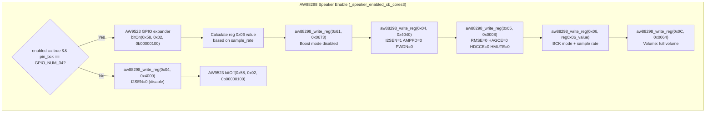

M5Unified Board-Specific Audio Configuration

# Board-Specific Audio Configuration

<details>
<summary>Relevant source files</summary>

The following files were used as context for generating this wiki page:

- [examples/Advanced/Mic_FFT/Mic_FFT.ino](examples/Advanced/Mic_FFT/Mic_FFT.ino)
- [src/M5Unified.cpp](src/M5Unified.cpp)
- [src/M5Unified.hpp](src/M5Unified.hpp)
- [src/utility/Mic_Class.cpp](src/utility/Mic_Class.cpp)
- [src/utility/Mic_Class.hpp](src/utility/Mic_Class.hpp)
- [src/utility/Speaker_Class.cpp](src/utility/Speaker_Class.cpp)
- [src/utility/Speaker_Class.hpp](src/utility/Speaker_Class.hpp)

</details>


This page covers the board-specific audio hardware initialization and control within M5Unified. Different M5Stack devices use various audio codecs (ES8311, ES7210, ES8388, AW88298), amplifier configurations, and power management strategies. M5Unified abstracts these differences through a callback-based architecture that enables and configures audio hardware according to the detected board type.

For general I2S driver configuration and DMA management, see [I2S Configuration and Driver Abstraction](4.1). For speaker playback APIs, see [Speaker Interface and Multi-Channel Mixing](4.2). For microphone recording APIs, see [Microphone Interface and Signal Processing](4.3).

## Audio Enable/Disable Callback Mechanism

M5Unified implements board-specific audio control through callback functions registered with `Speaker_Class` and `Mic_Class`. These callbacks are invoked when audio components are enabled or disabled, allowing board-specific initialization of codecs, GPIO amplifier control, and power management.

```mermaid
graph TB
    BEGIN["M5.begin(cfg)"]
    DETECT["_check_boardtype()"]
    SETUP_SPK["_begin_spk(cfg)"]
    SETUP_MIC["_begin_rtc_imu(cfg)"]
    
    subgraph "Speaker Callback Registration"
        SPK_CB_SELECT{"Board Type?"}
        SPK_CB_CORE2["_speaker_enabled_cb_core2"]
        SPK_CB_CORES3["_speaker_enabled_cb_cores3"]
        SPK_CB_STICKS3["_speaker_enabled_cb_sticks3"]
        SPK_CB_TAB5["_speaker_enabled_cb_tab5"]
        SPK_CB_HAT["_speaker_enabled_cb_hat_spk"]
        SPK_CB_ECHO["_speaker_enabled_cb_atomic_echo"]
        SPK_CB_CARD["_speaker_enabled_cb_cardputer_adv"]
        SPK_CB_ECHOS3R["_speaker_enabled_cb_atom_echos3r"]
        SPK_SET["Speaker.setCallback(this, callback)"]
    end
    
    subgraph "Microphone Callback Registration"
        MIC_CB_SELECT{"Board Type?"}
        MIC_CB_STICKC["_microphone_enabled_cb_stickc"]
        MIC_CB_CORES3["_microphone_enabled_cb_cores3"]
        MIC_CB_STICKS3["_microphone_enabled_cb_sticks3"]
        MIC_CB_ECHO["_microphone_enabled_cb_atomic_echo"]
        MIC_CB_ECHOS3R["_microphone_enabled_cb_atom_echos3r"]
        MIC_CB_TAB5["_microphone_enabled_cb_tab5"]
        MIC_CB_CARD["_microphone_enabled_cb_cardputer_adv"]
        MIC_SET["Mic.setCallback(this, callback)"]
    end
    
    subgraph "Runtime Callback Invocation"
        SPK_BEGIN["Speaker.begin()"]
        SPK_ENABLE["_cb_set_enabled(args, true)"]
        CODEC_INIT["I2C Codec Initialization"]
        GPIO_EN["GPIO Amplifier Enable"]
        PMIC_EN["PMIC Audio Power"]
    end
    
    BEGIN --> DETECT
    DETECT --> SETUP_SPK
    DETECT --> SETUP_MIC
    
    SETUP_SPK --> SPK_CB_SELECT
    SPK_CB_SELECT -->|Core2/Tough| SPK_CB_CORE2
    SPK_CB_SELECT -->|CoreS3| SPK_CB_CORES3
    SPK_CB_SELECT -->|StickS3| SPK_CB_STICKS3
    SPK_CB_SELECT -->|Tab5| SPK_CB_TAB5
    SPK_CB_SELECT -->|CoreInk| SPK_CB_HAT
    SPK_CB_SELECT -->|AtomicEcho| SPK_CB_ECHO
    SPK_CB_SELECT -->|Cardputer ADV| SPK_CB_CARD
    SPK_CB_SELECT -->|AtomEchoS3R| SPK_CB_ECHOS3R
    
    SPK_CB_CORE2 --> SPK_SET
    SPK_CB_CORES3 --> SPK_SET
    SPK_CB_STICKS3 --> SPK_SET
    SPK_CB_TAB5 --> SPK_SET
    SPK_CB_HAT --> SPK_SET
    SPK_CB_ECHO --> SPK_SET
    SPK_CB_CARD --> SPK_SET
    SPK_CB_ECHOS3R --> SPK_SET
    
    SETUP_MIC --> MIC_CB_SELECT
    MIC_CB_SELECT -->|StickC/CPlus| MIC_CB_STICKC
    MIC_CB_SELECT -->|CoreS3| MIC_CB_CORES3
    MIC_CB_SELECT -->|StickS3| MIC_CB_STICKS3
    MIC_CB_SELECT -->|AtomicEcho| MIC_CB_ECHO
    MIC_CB_SELECT -->|AtomEchoS3R| MIC_CB_ECHOS3R
    MIC_CB_SELECT -->|Tab5| MIC_CB_TAB5
    MIC_CB_SELECT -->|Cardputer ADV| MIC_CB_CARD
    
    MIC_CB_STICKC --> MIC_SET
    MIC_CB_CORES3 --> MIC_SET
    MIC_CB_STICKS3 --> MIC_SET
    MIC_CB_ECHO --> MIC_SET
    MIC_CB_ECHOS3R --> MIC_SET
    MIC_CB_TAB5 --> MIC_SET
    MIC_CB_CARD --> MIC_SET
    
    SPK_SET --> SPK_BEGIN
    SPK_BEGIN --> SPK_ENABLE
    SPK_ENABLE --> CODEC_INIT
    SPK_ENABLE --> GPIO_EN
    SPK_ENABLE --> PMIC_EN
```



**Audio Callback Registration and Invocation Flow**

The callback mechanism follows this pattern:

1. **Registration**: During `M5.begin()`, board detection identifies the device type and registers appropriate callbacks via `Speaker_Class::setCallback()` or `Mic_Class::setCallback()` [src/utility/Speaker_Class.hpp:242](), [src/utility/Mic_Class.hpp:161]()
2. **Invocation**: When `Speaker.begin()` or `Mic.begin()` is called, the registered callback executes with `enabled = true` to initialize hardware
3. **Disable**: When audio stops or `end()` is called, the callback executes with `enabled = false` to power down hardware

Callback function signature:
```cpp
bool (*callback)(void* args, bool enabled)
```

The `args` parameter is typically `this` (pointer to M5Unified instance), allowing callbacks to access board state and other subsystems like Power or I2C.

Sources: [src/utility/Speaker_Class.hpp:242](), [src/utility/Mic_Class.hpp:161](), [src/utility/Speaker_Class.hpp:287-288](), [src/utility/Mic_Class.hpp:184-185]()

## Board-Specific Audio Hardware Overview

M5Stack devices employ diverse audio hardware configurations. The following table summarizes the audio codecs, amplifiers, and control methods for each supported board:

| Board | Speaker Codec | Speaker Control | Microphone Codec | Mic Control | I2C Address(es) |
|-------|---------------|-----------------|------------------|-------------|-----------------|
| M5Stack Core2 | NS4168 (I2S) | AXP192 GPIO2 / AXP2101 ALDO3 | PDM (SPM1423) | - | - |
| M5Stack CoreS3 | AW88298 (I2S) | I2C registers + AW9523 GPIO | ES7210 (I2S) | I2C registers | 0x36, 0x40, 0x58 |
| M5StickS3 | ES8311 (I2S) | PY32PMIC reg 0x11 | ES8311 (I2S) | I2C registers | 0x18, 0x6E |
| M5Stack Tab5 | ES8388 (I2S) | PI4IOE reg 0x05 | ES7210 (I2S) | I2C registers | 0x10, 0x40, 0x43 |
| M5Atom Echo | ES8311 (I2S) | PI4IOE reg 0x05 | ES8311 (I2S) | I2C registers | 0x18, 0x43 |
| M5AtomEchoS3R | ES8311 (I2S) | GPIO18 | ES8311 (I2S) | I2C registers | 0x18 |
| M5Cardputer ADV | ES8311 (I2S) | I2C registers | ES8311 (I2S) | I2C registers | 0x18 |
| M5CoreInk | HAT SPK | GPIO25 | - | - | - |
| M5StickC/CPlus | NS4168 (I2S) | - | Analog | AXP192 LDO0 | - |

**Key Observations**:
- **ES8311**: Most common codec, used for both speaker and microphone on newer devices
- **ES7210**: Dedicated 4-channel ADC codec for high-quality microphone input
- **ES8388**: Full-duplex codec on Tab5 supporting simultaneous record/playback
- **AW88298**: Class-D amplifier with integrated DSP on CoreS3
- **GPIO Control**: Simple on/off for amplifier enable on some boards
- **I2C Control**: Complex register-based configuration for advanced codecs
- **PMIC Control**: Power management integration (AXP192, PY32PMIC) for audio power rails

Sources: [src/M5Unified.cpp:391-415](), [src/M5Unified.cpp:417-447](), [src/M5Unified.cpp:449-484](), [src/M5Unified.cpp:486-543](), [src/M5Unified.cpp:545-561](), [src/M5Unified.cpp:563-603](), [src/M5Unified.cpp:605-614](), [src/M5Unified.cpp:616-673](), [src/M5Unified.cpp:675-698](), [src/M5Unified.cpp:701-731](), [src/M5Unified.cpp:733-760](), [src/M5Unified.cpp:762-795](), [src/M5Unified.cpp:797-824](), [src/M5Unified.cpp:885-934](), [src/M5Unified.cpp:936-962]()

## Codec Initialization Sequences

Audio codecs require I2C-based register initialization to configure sample rates, data formats, power modes, and signal paths. M5Unified uses the `in_i2c_bulk_write()` helper function to write sequences of register configurations:

```cpp
static void in_i2c_bulk_write(const uint8_t i2c_addr, const uint8_t* bulk_data, 
                              const uint32_t i2c_freq = 100000u, const uint8_t retry = 0)
```

Bulk data format:
```cpp
const uint8_t bulk_data[] = {
    datalen, reg_addr, value1, [value2, ...],  // First write
    datalen, reg_addr, value1, [value2, ...],  // Second write
    0                                           // Terminator
};
```

Sources: [src/M5Unified.cpp:351-365]()

### ES8311 Codec Initialization

The ES8311 is a low-cost audio codec supporting both DAC (speaker) and ADC (microphone) modes. It's used on M5StickS3, Atomic Echo, Cardputer ADV, and AtomEchoS3R.

```mermaid
graph TB
    subgraph "ES8311 Speaker Enable (_speaker_enabled_cb_sticks3)"
        SPK_EN_CHECK{"enabled == true?"}
        SPK_PMIC["PY32PMIC reg 0x11<br/>bitOn(0x6E, 0x11, 0b00001000)"]
        SPK_RESET["ES8311 reg 0x00<br/>RESET / CSM POWER ON (0x80)"]
        SPK_CLKMGR["ES8311 reg 0x01<br/>CLOCK_MANAGER (0xB5)<br/>MCLK=BCLK"]
        SPK_MULT["ES8311 reg 0x02<br/>CLOCK_MANAGER (0x18)<br/>MULT_PRE=3"]
        SPK_SYS1["ES8311 reg 0x0D<br/>SYSTEM (0x01)<br/>Power up analog"]
        SPK_SYS2["ES8311 reg 0x12<br/>SYSTEM (0x00)<br/>Power-up DAC"]
        SPK_SYS3["ES8311 reg 0x13<br/>SYSTEM (0x10)<br/>Enable HP drive"]
        SPK_VOL["ES8311 reg 0x32<br/>DAC volume (0xBF)<br/>±0 dB"]
        SPK_EQ["ES8311 reg 0x37<br/>DAC (0x08)<br/>Bypass equalizer"]
        SPK_DISABLE["PY32PMIC bitOff(0x6E, 0x11, 0b00001000)"]
    end
    
    subgraph "ES8311 Microphone Enable (_microphone_enabled_cb_sticks3)"
        MIC_EN_CHECK{"enabled == true?"}
        MIC_RESET["ES8311 reg 0x00<br/>RESET (0x80)"]
        MIC_CLKMGR["ES8311 reg 0x01<br/>CLOCK_MANAGER (0xBA)<br/>MCLK=BCLK"]
        MIC_MULT["ES8311 reg 0x02<br/>MULT_PRE=3 (0x18)"]
        MIC_SYS1["ES8311 reg 0x0D<br/>Power up analog (0x01)"]
        MIC_SYS2["ES8311 reg 0x0E<br/>Enable PGA/ADC (0x02)"]
        MIC_GAIN["ES8311 reg 0x14<br/>Select Mic1p-Mic1n<br/>PGA GAIN minimum (0x10)"]
        MIC_VOL["ES8311 reg 0x17<br/>ADC_VOLUME (0xFF)<br/>MAXGAIN"]
        MIC_EQ["ES8311 reg 0x1C<br/>Bypass equalizer (0x6A)<br/>Cancel DC offset"]
        MIC_DISABLE_1["ES8311 reg 0x0D<br/>Power down (0xFC)"]
        MIC_DISABLE_2["ES8311 reg 0x0E (0x6A)"]
        MIC_DISABLE_3["ES8311 reg 0x00<br/>POWER DOWN (0x00)"]
    end
    
    SPK_EN_CHECK -->|Yes| SPK_PMIC
    SPK_EN_CHECK -->|No| SPK_DISABLE
    SPK_PMIC --> SPK_RESET
    SPK_RESET --> SPK_CLKMGR
    SPK_CLKMGR --> SPK_MULT
    SPK_MULT --> SPK_SYS1
    SPK_SYS1 --> SPK_SYS2
    SPK_SYS2 --> SPK_SYS3
    SPK_SYS3 --> SPK_VOL
    SPK_VOL --> SPK_EQ
    
    MIC_EN_CHECK -->|Yes| MIC_RESET
    MIC_EN_CHECK -->|No| MIC_DISABLE_1
    MIC_RESET --> MIC_CLKMGR
    MIC_CLKMGR --> MIC_MULT
    MIC_MULT --> MIC_SYS1
    MIC_SYS1 --> MIC_SYS2
    MIC_SYS2 --> MIC_GAIN
    MIC_GAIN --> MIC_VOL
    MIC_VOL --> MIC_EQ
    MIC_DISABLE_1 --> MIC_DISABLE_2
    MIC_DISABLE_2 --> MIC_DISABLE_3
```



**ES8311 Codec Initialization Flow**

Key ES8311 registers:
- **0x00**: RESET/CSM control (0x80 = power on, 0x00 = power down)
- **0x01**: Clock manager (0xB5 for DAC, 0xBA for ADC, MCLK=BCLK mode)
- **0x02**: Clock multiplier/prescaler (0x18 = multiply by 3)
- **0x0D**: Analog power control
- **0x0E**: ADC modulator enable (microphone mode)
- **0x12**: DAC power control (speaker mode)
- **0x13**: Headphone output enable
- **0x14**: PGA input selection and gain
- **0x17**: ADC volume (0xFF = max gain, 0xBF = ±0 dB)
- **0x1C**: ADC equalizer and DC offset cancellation
- **0x32**: DAC volume (0xBF = ±0 dB, 0xFF = max)
- **0x37**: DAC equalizer bypass

Sources: [src/M5Unified.cpp:449-484](), [src/M5Unified.cpp:797-824](), [src/M5Unified.cpp:567-603](), [src/M5Unified.cpp:701-731](), [src/M5Unified.cpp:733-760](), [src/M5Unified.cpp:762-795](), [src/M5Unified.cpp:675-698](), [src/M5Unified.cpp:936-962]()

### ES7210 Codec Initialization

The ES7210 is a 4-channel ADC codec designed for high-quality microphone arrays. It's used on CoreS3 and Tab5 for microphone input.

```mermaid
graph TB
    MIC_RESET["ES7210 reg 0x00<br/>RESET_CTL (0xFF)"]
    MIC_EN_CHECK{"enabled == true?"}
    
    subgraph "ES7210 Enable Sequence"
        REG_00["reg 0x00: RESET_CTL (0x41)"]
        REG_01["reg 0x01: CLK_ON_OFF (0x1f)"]
        REG_06["reg 0x06: DIGITAL_PDN (0x00)"]
        REG_07["reg 0x07: ADC_OSR (0x20)"]
        REG_08["reg 0x08: MODE_CFG (0x10)"]
        REG_09["reg 0x09: TCT0_CHPINI (0x30)"]
        REG_0A["reg 0x0A: TCT1_CHPINI (0x30)"]
        REG_20["reg 0x20: ADC34_HPF2 (0x0a)"]
        REG_21["reg 0x21: ADC34_HPF1 (0x2a)"]
        REG_22["reg 0x22: ADC12_HPF2 (0x0a)"]
        REG_23["reg 0x23: ADC12_HPF1 (0x2a)"]
        REG_02["reg 0x02: (0xC1)"]
        REG_04["reg 0x04: (0x01)"]
        REG_05["reg 0x05: (0x00)"]
        REG_11["reg 0x11: (0x60)"]
        REG_40["reg 0x40: ANALOG_SYS (0x42)"]
        REG_41["reg 0x41: MICBIAS12 (0x70)"]
        REG_42["reg 0x42: MICBIAS34 (0x70)"]
        REG_43["reg 0x43: MIC1_GAIN (0x1B)"]
        REG_44["reg 0x44: MIC2_GAIN (0x1B)"]
        REG_45["reg 0x45: MIC3_GAIN (0x00)"]
        REG_46["reg 0x46: MIC4_GAIN (0x00)"]
        REG_4B["reg 0x4B: MIC12_PDN (0x00)"]
        REG_4C["reg 0x4C: MIC34_PDN (0xFF)"]
        REG_01B["reg 0x01: CLK_ON_OFF (0x14)"]
    end
    
    MIC_RESET --> MIC_EN_CHECK
    MIC_EN_CHECK -->|Yes| REG_00
    REG_00 --> REG_01
    REG_01 --> REG_06
    REG_06 --> REG_07
    REG_07 --> REG_08
    REG_08 --> REG_09
    REG_09 --> REG_0A
    REG_0A --> REG_20
    REG_20 --> REG_21
    REG_21 --> REG_22
    REG_22 --> REG_23
    REG_23 --> REG_02
    REG_02 --> REG_04
    REG_04 --> REG_05
    REG_05 --> REG_11
    REG_11 --> REG_40
    REG_40 --> REG_41
    REG_41 --> REG_42
    REG_42 --> REG_43
    REG_43 --> REG_44
    REG_44 --> REG_45
    REG_45 --> REG_46
    REG_46 --> REG_4B
    REG_4B --> REG_4C
    REG_4C --> REG_01B
```



**ES7210 Microphone Codec Initialization**

Key ES7210 configuration:
- **Channel Selection**: Only MIC1 and MIC2 enabled (0x4B = 0x00, 0x4C = 0xFF disables MIC3/4)
- **Gain Settings**: 0x1B (~27dB) for active channels, 0x00 for unused
- **Bias Voltage**: 0x70 for MICBIAS12 and MICBIAS34
- **HPF**: High-pass filter configured via ADC12_HPF1/2, ADC34_HPF1/2
- **Sample Rate**: Determined by external I2S clock (configured by I2S driver)

Sources: [src/M5Unified.cpp:616-673](), [src/M5Unified.cpp:885-934]()

### ES8388 Codec Initialization

The ES8388 is a full-duplex stereo audio codec supporting simultaneous playback and recording. It's used on M5Stack Tab5.

```mermaid
graph TB
    subgraph "ES8388 Speaker Enable (_speaker_enabled_cb_tab5)"
        ES8388_EN_CHECK{"enabled == true?"}
        REG_00_RST["reg 0x00: RESET (0x80)"]
        REG_00_CLR1["reg 0x00: (0x00)"]
        REG_00_CLR2["reg 0x00: (0x00)"]
        REG_00_SETUP["reg 0x00: (0x0E)"]
        REG_01["reg 0x01: (0x00)"]
        REG_02["reg 0x02: CHIP_POWER (0x0A)<br/>Power up all"]
        REG_03["reg 0x03: ADC_POWER (0xFF)<br/>Power down ADC"]
        REG_04["reg 0x04: DAC_POWER (0x3C)<br/>Power up DAC + outputs"]
        REG_05["reg 0x05: ChipLowPower1 (0x00)"]
        REG_06["reg 0x06: ChipLowPower2 (0x00)"]
        REG_07["reg 0x07: VSEL (0x7C)"]
        REG_08["reg 0x08: I2S slave mode (0x00)"]
        REG_23["reg 0x23: I2S format 16-bit (0x18)"]
        REG_24["reg 0x24: MCLK ratio 128 (0x00)"]
        REG_25["reg 0x25: DAC unmute (0x20)"]
        REG_26["reg 0x26: LDACVOL 0x00"]
        REG_27["reg 0x27: RDACVOL 0x00"]
        REG_28["reg 0x28: Click-free enable (0x08)"]
        REG_29["reg 0x29: (0x00)"]
        REG_38["reg 0x38: DAC_CTRL16 (0x00)"]
        REG_39["reg 0x39: LEFT_MIX (0xB8)"]
        REG_42["reg 0x42: RIGHT_MIX (0xB8)"]
        REG_43["reg 0x43: ADC/DAC separate (0x08)"]
        REG_45["reg 0x45: VREF 1.5k (0x00)"]
        REG_46["reg 0x46: (0x21)"]
        REG_47["reg 0x47: (0x21)"]
        REG_48["reg 0x48: (0x21)"]
        REG_49["reg 0x49: (0x21)"]
        AMP_ON["PI4IOE reg 0x05<br/>bitOn(0x43, 0x05, 0b00000010)<br/>Amplifier ON"]
        REG_08_DIS["reg 0x08: I2S slave (0x00)"]
        AMP_OFF["PI4IOE reg 0x05<br/>bitOff(0x43, 0x05, 0b00000010)<br/>Amplifier OFF"]
    end
    
    ES8388_EN_CHECK -->|Yes| REG_00_RST
    REG_00_RST --> REG_00_CLR1
    REG_00_CLR1 --> REG_00_CLR2
    REG_00_CLR2 --> REG_00_SETUP
    REG_00_SETUP --> REG_01
    REG_01 --> REG_02
    REG_02 --> REG_03
    REG_03 --> REG_04
    REG_04 --> REG_05
    REG_05 --> REG_06
    REG_06 --> REG_07
    REG_07 --> REG_08
    REG_08 --> REG_23
    REG_23 --> REG_24
    REG_24 --> REG_25
    REG_25 --> REG_26
    REG_26 --> REG_27
    REG_27 --> REG_28
    REG_28 --> REG_29
    REG_29 --> REG_38
    REG_38 --> REG_39
    REG_39 --> REG_42
    REG_42 --> REG_43
    REG_43 --> REG_45
    REG_45 --> REG_46
    REG_46 --> REG_47
    REG_47 --> REG_48
    REG_48 --> REG_49
    REG_49 --> AMP_ON
    
    ES8388_EN_CHECK -->|No| REG_08_DIS
    REG_08_DIS --> AMP_OFF
```



**ES8388 Full-Duplex Codec Initialization**

Key ES8388 features:
- **Power Management**: Separate power control for ADC (0x03) and DAC (0x04) subsystems
- **I2S Configuration**: Slave mode, 16-bit samples, MCLK ratio 128
- **Volume Control**: Registers 0x26/0x27 for left/right DAC volume (0x00~0xC0 range)
- **Mixing**: Registers 0x39/0x42 configure input-to-output routing (0xB8 for standard DAC→output)
- **Click-Free**: Register 0x28 enables smooth power up/down transitions
- **External Amplifier**: Controlled via PI4IOE GPIO expander at 0x43

The ES8388 can simultaneously record and playback audio, making it suitable for voice applications.

Sources: [src/M5Unified.cpp:486-543]()

### AW88298 Codec Initialization

The AW88298 is a smart Class-D audio amplifier with integrated DSP. It's used on M5Stack CoreS3 for high-quality speaker output.



**AW88298 Smart Amplifier Initialization**

Key AW88298 features:
- **Sample Rate Detection**: Register 0x06 value calculated based on `sample_rate`:
  ```cpp
  static constexpr uint8_t rate_tbl[] = {4,5,6,8,10,11,15,20,22,44};
  size_t rate = (sample_rate + 1102) / 2205;
  // Find closest match in rate_tbl, then OR with 0x14C0
  ```
- **BCK Mode**: 0x14C0 sets I2SBCK=0 (16-bit × 2 channels)
- **Volume**: 0x0064 = 100 (full volume, range likely 0-255)
- **Power Modes**: Boost mode disabled (0x0673), amplifier and I2S enabled (0x4040)
- **GPIO Control**: AW9523 I/O expander (0x58) enables amplifier via bit 2 of register 0x02

Register writes use 16-bit big-endian values via `aw88298_write_reg()`:
```cpp
static void aw88298_write_reg(uint8_t reg, uint16_t value) {
    value = __builtin_bswap16(value);
    M5.In_I2C.writeRegister(aw88298_i2c_addr, reg, (const uint8_t*)&value, 2, 400000);
}
```

Sources: [src/M5Unified.cpp:417-447](), [src/M5Unified.cpp:378-383]()

## Configuration Examples

### Example 1: Internal DAC Speaker (ESP32)

```cpp
auto cfg = M5.Speaker.config();
cfg.pin_data_out = GPIO_NUM_25;  // DAC channel 0
cfg.use_dac = true;
cfg.sample_rate = 16000;
cfg.stereo = false;
cfg.dac_zero_level = 0;  // Dynamic DC offset
cfg.magnification = 16;
cfg.i2s_port = I2S_NUM_0;  // Required for DAC
M5.Speaker.config(cfg);
M5.Speaker.begin();
```

Sources: [src/utility/Speaker_Class.hpp:33-80]()

### Example 2: I2S Audio Codec

```cpp
auto cfg = M5.Speaker.config();
cfg.pin_bck = 12;
cfg.pin_ws = 0;
cfg.pin_data_out = 2;
cfg.sample_rate = 48000;
cfg.stereo = true;
cfg.use_dac = false;
cfg.dma_buf_len = 256;
cfg.dma_buf_count = 8;
cfg.i2s_port = I2S_NUM_0;
M5.Speaker.config(cfg);
M5.Speaker.begin();
```

Sources: [src/utility/Speaker_Class.hpp:33-80]()

### Example 3: PDM Microphone

```cpp
auto cfg = M5.Mic.config();
cfg.pin_data_in = 34;
cfg.pin_ws = 0;  // PDM CLK
cfg.pin_bck = -1;  // Not used for PDM
cfg.sample_rate = 16000;
cfg.over_sampling = 2;
cfg.stereo = false;
cfg.left_channel = false;
cfg.use_adc = false;
cfg.i2s_port = I2S_NUM_0;
M5.Mic.config(cfg);
M5.Mic.begin();
```

Sources: [src/utility/Mic_Class.hpp:42-96](), [examples/Advanced/Mic_FFT/Mic_FFT.ino:662-682]()

### Example 4: Internal ADC Microphone (ESP32)

```cpp
auto cfg = M5.Mic.config();
cfg.pin_data_in = 36;  // GPIO36 = ADC1_CH0
cfg.use_adc = true;
cfg.sample_rate = 16000;
cfg.over_sampling = 4;
cfg.magnification = 16;
cfg.noise_filter_level = 64;
cfg.i2s_port = I2S_NUM_0;  // Required for ADC
M5.Mic.config(cfg);
M5.Mic.begin();
```

Sources: [src/utility/Mic_Class.hpp:42-96](), [examples/Advanced/Mic_FFT/Mic_FFT.ino:662-682]()

### Example 5: High Sample Rate FFT Analysis

```cpp
auto cfg = M5.Mic.config();
cfg.sample_rate = 24000;  // Or 96000 for wider frequency range
cfg.dma_buf_count = 3;
cfg.dma_buf_len = 256;  // Must be small enough for real-time
cfg.over_sampling = 1;  // No oversampling for FFT
cfg.noise_filter_level = 0;  // No filtering for FFT
cfg.magnification = 1;  // Minimal gain
M5.Mic.config(cfg);
M5.Mic.begin();
```

Sources: [examples/Advanced/Mic_FFT/Mic_FFT.ino:617-628](), [examples/Advanced/Mic_FFT/Mic_FFT.ino:662-682]()

## Board-Specific Audio Considerations

Different M5Stack boards have varying audio hardware configurations:

**M5Stack Basic/Core**:
- Speaker: NS4168 I2S amplifier or internal DAC
- Microphone: Analog (ADC) or PDM
- I2S Port: Usually I2S_NUM_0

**M5Stack Core2**:
- Speaker: NS4168 I2S amplifier
- Microphone: SPM1423 PDM microphone
- Configuration handled in board detection

**M5Stack CoreS3**:
- Speaker: AW88298 I2S codec (controlled via I2C)
- Microphone: ES7210 I2S codec
- MCLK required: `pin_mck` must be configured
- Clock divider: `div_m = 8` for optimal performance

**M5Stick series**:
- Often uses internal DAC for speaker
- PDM microphone common
- Lower sample rates (8-16 kHz) typical

Board-specific configurations are automatically applied during `M5.begin()` based on board detection. Users can override defaults by manually configuring before calling `begin()`.

Sources: [src/utility/Speaker_Class.cpp:186-297](), [src/utility/Mic_Class.cpp:298-417](), [src/utility/Mic_Class.cpp:442-444]()