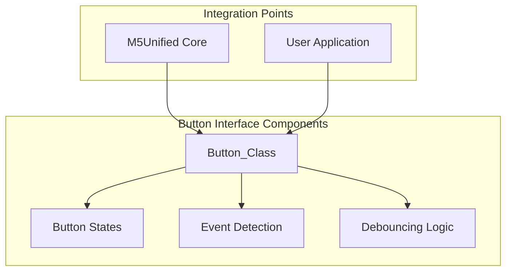
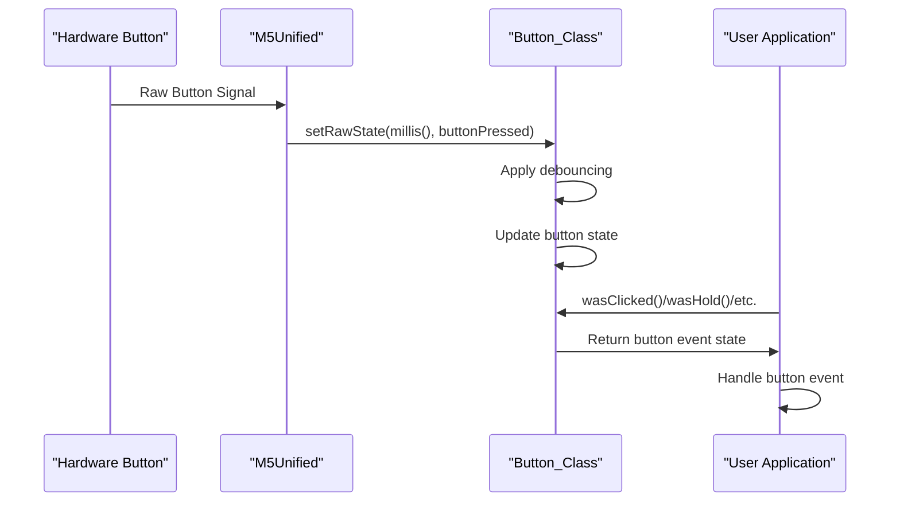
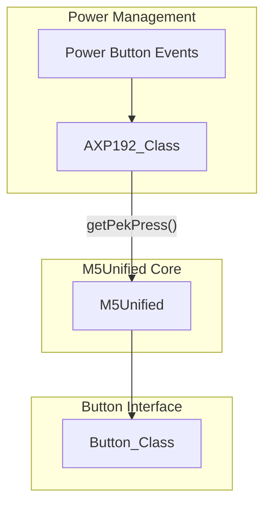

M5Unified Button System and State Machine

# Button Interface

<details>
<summary>Relevant source files</summary>

The following files were used as context for generating this wiki page:

- [src/M5Unified.cpp](src/M5Unified.cpp)
- [src/M5Unified.hpp](src/M5Unified.hpp)
- [src/utility/Button_Class.cpp](src/utility/Button_Class.cpp)
- [src/utility/Button_Class.hpp](src/utility/Button_Class.hpp)

</details>


The Button Interface in M5Unified provides a unified and comprehensive way to handle button input across all M5Stack devices. This page documents the `Button_Class` which handles button states, debouncing, and various types of button events such as clicks, holds, and multi-clicks.

For touch input handling, see [Touch Interface](#6.2).

## Overview

The Button Interface consists of a state machine that tracks button states and provides methods to detect various button events. It handles debouncing to filter out noise and spurious button presses, and supports advanced features like multi-click detection and hold state tracking.



Sources: [src/utility/Button_Class.hpp:1-86]()

## Button States

The Button Interface maintains a state machine that tracks the current state of each button. These states are managed internally but can be queried through various methods.

```mermaid
stateDiagram-v2
    [*] --> "Released"
    Released --> "Pressed": Button press detected
    Pressed --> "Clicked": Quick release
    Pressed --> "Hold": Pressed for threshold duration
    Clicked --> "Multi-Click Count": After timeout
    Hold --> "Released": Button released
    Clicked --> "Released": State reset
    Multi-Click Count --> "Released": State reset
    Released --> [*]
```

The internal states are defined in the `button_state_t` enum:

```mermaid
classDiagram
    class "button_state_t" {
        state_nochange
        state_clicked
        state_hold
        state_decide_click_count
    }
```

Sources: [src/utility/Button_Class.hpp:14-19](), [src/utility/Button_Class.cpp:8-83]()

## Button Class API

The `Button_Class` provides a rich set of methods to detect different types of button events:

### Event Detection Methods

| Method | Description |
|--------|-------------|
| `wasClicked()` | Returns true when button was briefly pressed and released |
| `wasHold()` | Returns true when button has been held for the threshold duration |
| `wasSingleClicked()` | Returns true when button was clicked once |
| `wasDoubleClicked()` | Returns true when button was clicked twice in quick succession |
| `wasDecideClickCount()` | Returns true when multi-click counting has finished |
| `getClickCount()` | Returns the number of consecutive clicks detected |

### Current State Methods

| Method | Description |
|--------|-------------|
| `isHolding()` | Returns true if the button is currently being held down |
| `isPressed()` | Returns true if the button is currently pressed |
| `isReleased()` | Returns true if the button is currently released |

### State Change Detection

| Method | Description |
|--------|-------------|
| `wasPressed()` | Returns true if the button transitioned from released to pressed |
| `wasReleased()` | Returns true if the button transitioned from pressed to released |
| `wasReleasedAfterHold()` | Returns true if the button was released after being in hold state |
| `wasReleaseFor(ms)` | Returns true if button was released for specified duration |
| `pressedFor(ms)` | Returns true if button has been pressed for specified duration |
| `releasedFor(ms)` | Returns true if button has been released for specified duration |

Sources: [src/utility/Button_Class.hpp:22-55]()

### Configuration Methods

These methods allow customizing the button behavior:

```mermaid
classDiagram
    class "Button_Class" {
        +setDebounceThresh(uint32_t msec)
        +setHoldThresh(uint32_t msec)
        +getDebounceThresh()
        +getHoldThresh()
    }
```

- `setDebounceThresh(msec)`: Sets the debounce threshold in milliseconds (default: 10ms)
- `setHoldThresh(msec)`: Sets the hold threshold in milliseconds (default: 500ms)

Sources: [src/utility/Button_Class.hpp:57-58](), [src/utility/Button_Class.hpp:65-66]()

### Internal State Management

```mermaid
classDiagram
    class "Button_Class" {
        +setRawState(uint32_t msec, bool press)
        +setState(uint32_t msec, button_state_t state)
        +getState()
        +lastChange()
        +getUpdateMsec()
        -uint32_t _lastMsec
        -uint32_t _lastChange
        -uint32_t _lastRawChange
        -uint32_t _lastClicked
        -uint16_t _msecDebounce
        -uint16_t _msecHold
        -uint16_t _lastHoldPeriod
        -button_state_t _currentState
        -bool _raw_press
        -uint8_t _press
        -uint8_t _oldPress
        -uint8_t _clickCount
    }
```

These methods are generally called by the M5Unified core rather than application code:

- `setRawState(msec, press)`: Updates button state based on raw input
- `setState(msec, state)`: Sets the button to a specific state
- `getState()`: Returns the current button state

Sources: [src/utility/Button_Class.hpp:60-68](), [src/utility/Button_Class.hpp:69-82](), [src/utility/Button_Class.cpp:8-83]()

## Button Processing Flow

The following sequence diagram shows how button input is processed from hardware to application code:



Sources: [src/utility/Button_Class.cpp:41-83]()

## Integration with Power Management

For devices with power management ICs like AXP192, the button interface also integrates with power button events:



The AXP192 class provides the `getPekPress()` method which can detect power button presses on devices that use this PMIC.

Sources: [src/utility/AXP192_Class.hpp:89](), [src/utility/AXP192_Class.cpp:275-280]()

## Using the Button Interface

To use the Button interface in your application, you typically:

1. Initialize M5Unified with button detection enabled
2. In your main loop, check for button events using the provided methods
3. Respond to button events as needed

Here's a simple example pattern:

```
// In setup()
M5.begin();

// In loop()
M5.update();  // Updates all button states

if (M5.BtnA.wasClicked()) {
    // Handle button A click
}

if (M5.BtnB.wasHold()) {
    // Handle button B being held
}

if (M5.BtnC.wasDoubleClicked()) {
    // Handle button C double-click
}
```

This simple API hides the complexity of the button state machine, debouncing, and event detection, providing a clean interface for application developers.

Sources: [src/utility/Button_Class.hpp:22-34]()

## Implementation Details

The Button_Class implements a sophisticated state machine that handles:

1. **Debouncing**: Filtering out spurious button presses using a time threshold (default 10ms)
2. **State Tracking**: Maintaining the current button state (pressed, released, held)
3. **Event Detection**: Identifying different button events (click, hold, multi-click)
4. **Multi-click Detection**: Counting consecutive clicks and reporting the count

When a raw button state change occurs:

1. The `setRawState()` method is called with the current timestamp and button state
2. Debouncing is applied to filter out noise
3. The internal state is updated based on the button state and timing
4. The appropriate button event flags are set

Applications can then query these events using the various detection methods.

Sources: [src/utility/Button_Class.cpp:41-83](), [src/utility/Button_Class.hpp:69-82]()