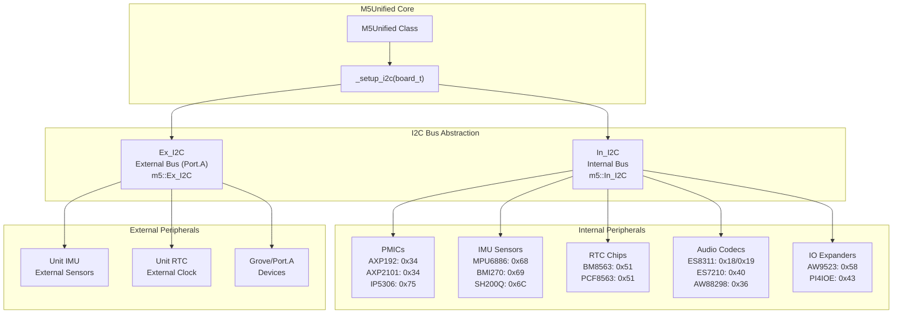
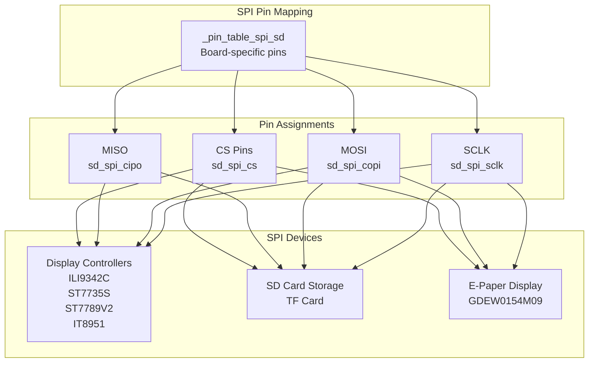
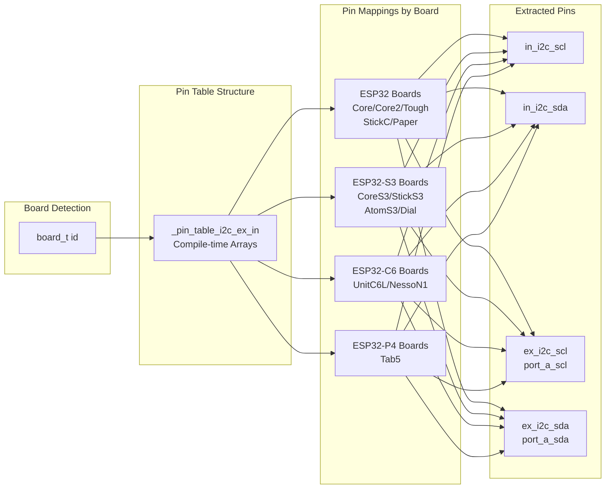
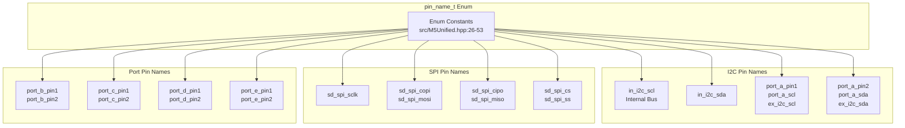
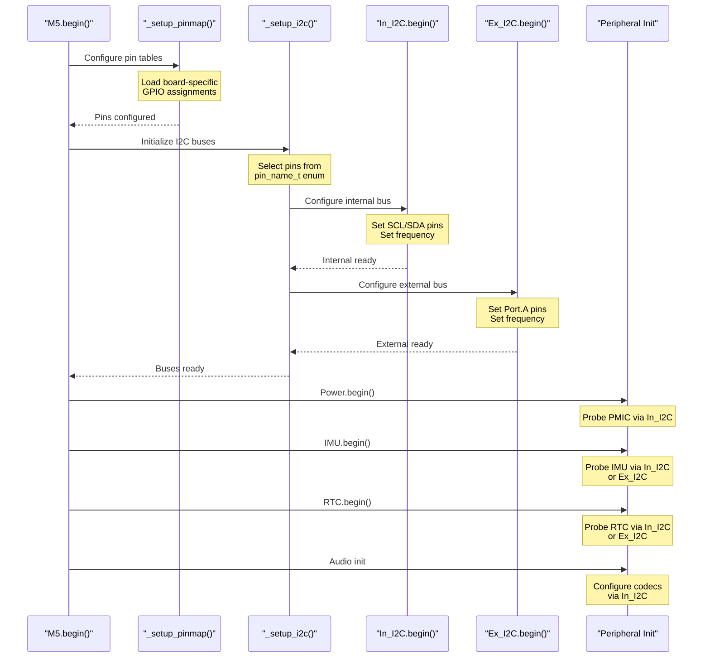
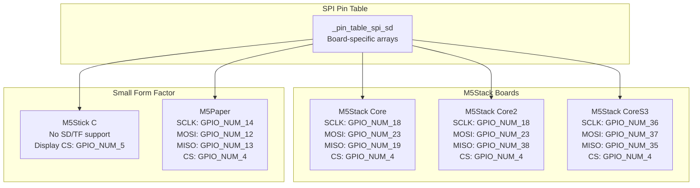

M5Unified Communication Interfaces

# Communication Interfaces

<details>
<summary>Relevant source files</summary>

The following files were used as context for generating this wiki page:

- [README.md](README.md)
- [examples/Basic/HowToUse/HowToUse.ino](examples/Basic/HowToUse/HowToUse.ino)
- [src/M5Unified.cpp](src/M5Unified.cpp)
- [src/M5Unified.hpp](src/M5Unified.hpp)

</details>


## Purpose and Scope

This page provides an overview of the communication bus architecture in M5Unified, focusing on the I2C and SPI interfaces used to communicate with onboard and external peripherals. M5Unified abstracts the complexity of multiple board configurations through a dual I2C bus system and board-specific pin mapping tables.

For detailed information about specific I2C bus implementation and device addressing, see [I2C Bus Architecture](#7.1) and [I2C Device Mapping](#7.2).

For information about individual peripheral classes that use these buses, see:
- [Power Management System](#3) - PMIC communication via I2C
- [Sensor Integration](#6) - IMU and RTC communication via I2C  
- [Audio System Architecture](#4) - Audio codec configuration via I2C
- [Display Management and M5GFX Integration](#2.4) - Display communication via SPI

Sources: [src/M5Unified.hpp:26-53](), [src/M5Unified.hpp:245-248]()

## Communication Bus Architecture

M5Unified manages two primary communication protocols for hardware interfacing: I2C for sensor/peripheral communication and SPI for display and storage access.

### Dual I2C Bus System



**Dual I2C Bus Design**: M5Unified implements two separate I2C buses:

- **`In_I2C`** (Internal I2C): Used for onboard peripherals including PMICs, internal IMU sensors, internal RTC, audio codecs, and IO expanders. Pin assignments vary by board type.

- **`Ex_I2C`** (External I2C): Exposed through Port.A connector for external sensors and units. Provides a standardized interface for add-on hardware.

Both buses are accessed through the global `I2C_Class` references defined in `M5Unified` [src/M5Unified.hpp:245-248]().

Sources: [src/M5Unified.hpp:245-248](), [src/M5Unified.cpp:367-377]()

### SPI Bus Usage



**SPI Usage**: SPI is primarily used for high-bandwidth display communication and SD card storage access. Unlike I2C, SPI configurations are board-specific and managed through chip select (CS) pins for device selection. The M5GFX library handles most SPI display communication.

Sources: [src/M5Unified.cpp:156-176](), [README.md:399-404]()

## Pin Mapping System

M5Unified uses compile-time pin tables to map communication bus pins for different board types. The `_setup_pinmap()` function loads the appropriate pin assignments during initialization.

### I2C Pin Assignment Tables



The `_pin_table_i2c_ex_in` array [src/M5Unified.cpp:73-116]() contains pin mappings indexed by `board_t` enum. Each entry specifies four GPIO numbers:

| Board Type | In_SCL | In_SDA | Ex_SCL | Ex_SDA |
|------------|--------|--------|--------|--------|
| M5Stack (ESP32) | GPIO_NUM_22 | GPIO_NUM_21 | GPIO_NUM_22 | GPIO_NUM_21 |
| M5StackCoreS3 (ESP32-S3) | GPIO_NUM_11 | GPIO_NUM_12 | GPIO_NUM_1 | GPIO_NUM_2 |
| M5AtomS3R (ESP32-S3) | GPIO_NUM_0 | GPIO_NUM_45 | GPIO_NUM_1 | GPIO_NUM_2 |
| M5Tab5 (ESP32-P4) | GPIO_NUM_32 | GPIO_NUM_31 | GPIO_NUM_54 | GPIO_NUM_53 |

Sources: [src/M5Unified.cpp:73-116](), [src/M5Unified.cpp:328-348]()

### Pin Name Enumeration



The `pin_name_t` enumeration [src/M5Unified.hpp:26-53]() provides symbolic names for communication pins. Multiple aliases exist for the same physical pin (e.g., `port_a_scl`, `ex_i2c_scl`, and `port_a_pin1` all refer to the same pin). Users can retrieve the actual GPIO number using `M5.getPin(pin_name_t)` [src/M5Unified.hpp:251]().

Sources: [src/M5Unified.hpp:26-53](), [src/M5Unified.hpp:251]()

## Device Addressing and Detection

### I2C Device Address Constants

The codebase defines I2C device addresses as compile-time constants for common peripherals:

```cpp
// Audio codecs
static constexpr uint8_t es7210_i2c_addr = 0x40;
static constexpr uint8_t es8311_i2c_addr0 = 0x18;
static constexpr uint8_t es8311_i2c_addr1 = 0x19;
static constexpr uint8_t es8388_i2c_addr = 0x10;

// GPIO expanders and PMICs
static constexpr uint8_t pi4io1_i2c_addr = 0x43;
static constexpr uint8_t pm1_i2c_addr = 0x6E;
static constexpr uint8_t py32pmic_i2c_addr = 0x6E;
static constexpr uint8_t aw88298_i2c_addr = 0x36;  // ESP32-S3
static constexpr uint8_t aw9523_i2c_addr = 0x58;   // ESP32-S3
```

These addresses are used throughout the initialization callbacks to configure board-specific hardware.

Sources: [src/M5Unified.cpp:367-377]()

### Common I2C Device Addresses by Board

| Device Type | Address | Boards |
|-------------|---------|--------|
| **Power Management** |
| AXP192 | 0x34 | Core2, Tough, StickC, StickCPlus, Station |
| AXP2101 | 0x34 | Core2 v1.1, CoreS3, CoreS3SE |
| IP5306 | 0x75 | M5Stack BASIC/GRAY/GO/FIRE |
| **RTC** |
| BM8563 | 0x51 | Core2, Tough, CoreS3, StickC, CoreInk, Paper, Station |
| PCF8563 | 0x51 | (Alternative RTC) |
| **IMU** |
| MPU6886 | 0x68 | M5Stack, Core2, StickC, ATOM Matrix, Station |
| BMI270 | 0x69 | CoreS3, CoreS3SE |
| SH200Q | 0x6C | M5Stack (old lot), StickC (old lot) |
| **Touch Panel** |
| FT6336U | 0x38 | Core2 |
| FT5xxx | 0x38 | CoreS3, CoreS3SE |
| CHSC6540 | 0x2E | Tough |
| GT911 | 0x14 or 0x5D | M5Paper |
| **Audio** |
| ES7210 | 0x40 | CoreS3 (microphone) |
| ES8311 | 0x18/0x19 | Various boards (codec) |
| ES8388 | 0x10 | Tab5 (codec) |
| AW88298 | 0x36 | CoreS3 (speaker amp) |
| **GPIO Expander** |
| AW9523B | 0x58 | CoreS3, CoreS3SE |
| PI4IOE5V6408 | 0x43 | Various boards |
| **Sensors** |
| LTR553ALS | 0x23 | CoreS3 (ambient light) |
| SHT30 | 0x44 | M5Paper (temperature/humidity) |

Sources: [README.md:407-422](), [src/M5Unified.cpp:367-377]()

## Bus Initialization Process

### Initialization Sequence



The initialization process follows this order:
1. **Pin Mapping** [src/M5Unified.cpp:328-348](): `_setup_pinmap()` loads board-specific GPIO assignments into `_get_pin_table`
2. **I2C Bus Setup**: `_setup_i2c()` configures both internal and external I2C buses using the loaded pin assignments
3. **Peripheral Initialization**: Each peripheral class (`Power_Class`, `IMU_Class`, `RTC_Class`, etc.) probes its respective devices on the appropriate I2C bus
4. **Audio Codec Configuration**: Board-specific callbacks configure audio hardware via I2C register writes

Sources: [src/M5Unified.cpp:328-348](), [src/M5Unified.cpp:351-365]()

## Board-Specific Communication Configurations

### Example: M5Stack CoreS3 I2C Configuration

For the CoreS3 (ESP32-S3), the I2C pin assignment is:
- **Internal I2C**: SCL=GPIO_NUM_11, SDA=GPIO_NUM_12
- **External I2C (Port.A)**: SCL=GPIO_NUM_1, SDA=GPIO_NUM_2

Devices on Internal I2C:
- AXP2101 PMIC (0x34)
- BMI270 IMU (0x69)
- BM8563 RTC (0x51)
- ES7210 Microphone (0x40)
- AW88298 Speaker Amplifier (0x36)
- AW9523B GPIO Expander (0x58)
- FT5xxx Touch Panel (0x38)

The external I2C bus on Port.A is available for connecting Grove units and external sensors.

Sources: [src/M5Unified.cpp:76-77](), [README.md:407-422]()

### Example: Audio Codec Initialization via I2C

Audio codec initialization demonstrates typical I2C usage. The `in_i2c_bulk_write()` helper function [src/M5Unified.cpp:351-365]() sends register configuration sequences:

```cpp
// Example: ES8311 codec initialization for StickS3
static constexpr const uint8_t enabled_bulk_data[] = {
  2, 0x00, 0x80,  // RESET/ CSM POWER ON
  2, 0x01, 0xB5,  // CLOCK_MANAGER/ MCLK=BCLK
  2, 0x02, 0x18,  // CLOCK_MANAGER/ MULT_PRE=3
  // ... more register writes ...
  0  // End marker
};
in_i2c_bulk_write(es8311_i2c_addr0, enabled_bulk_data, 100000, 3);
```

The bulk write format is: `[length, register, data1, data2, ..., 0]`. This pattern is used throughout board-specific callback functions like `_speaker_enabled_cb_sticks3()` [src/M5Unified.cpp:449-484]().

Sources: [src/M5Unified.cpp:351-365](), [src/M5Unified.cpp:458-473]()

## SPI Device Configuration

### Display SPI Pin Mapping



SPI pin assignments vary significantly across board types. The table at [src/M5Unified.cpp:156-176]() defines SCLK, MOSI, MISO, and CS pins for each supported board. M5GFX handles the actual SPI communication for displays.

Sources: [src/M5Unified.cpp:156-176]()

### Chip Select Strategy

Multiple SPI devices share the same bus but use different chip select (CS) pins:
- **Display CS**: Varies by board (e.g., GPIO_NUM_5 for Core2, GPIO_NUM_3 for CoreS3)
- **SD Card CS**: Typically GPIO_NUM_4 for boards with SD card slots
- **E-Paper CS**: Board-specific (e.g., GPIO_NUM_15 for M5Paper)

The M5GFX library and M5Unified coordinate CS pin assignments during display initialization.

Sources: [README.md:399-404]()

## Port Pin Assignments

Beyond I2C and SPI, M5Unified defines pin mappings for expansion ports (Port B, C, D, E) used for UART, analog input, and general GPIO. These mappings are stored in separate tables:

- `_pin_table_port_bc` [src/M5Unified.cpp:118-139](): Port B and C pin pairs
- `_pin_table_port_de` [src/M5Unified.cpp:141-154](): Port D and E pin pairs  
- `_pin_table_mbus` [src/M5Unified.cpp:233-326](): M-Bus connector pins (30 pins for CoreS3/Tab5)

These tables follow the same board-indexed structure as the I2C pin tables.

Sources: [src/M5Unified.cpp:118-154](), [src/M5Unified.cpp:233-326]()

## Code Entities Summary

### Key Classes and Functions

| Entity | Location | Purpose |
|--------|----------|---------|
| `I2C_Class` | M5GFX library | I2C communication wrapper |
| `m5::In_I2C` | Global instance | Internal I2C bus reference |
| `m5::Ex_I2C` | Global instance | External I2C bus reference |
| `M5Unified::_setup_pinmap()` | [src/M5Unified.cpp:328-348]() | Loads board-specific pin tables |
| `M5Unified::_setup_i2c()` | Called during `begin()` | Initializes I2C buses with pins |
| `in_i2c_bulk_write()` | [src/M5Unified.cpp:351-365]() | Helper for I2C register sequences |
| `M5Unified::getPin()` | [src/M5Unified.hpp:251]() | Retrieves GPIO number by pin name |

### Pin Tables

| Table | Location | Content |
|-------|----------|---------|
| `_pin_table_i2c_ex_in` | [src/M5Unified.cpp:73-116]() | Internal/External I2C pins |
| `_pin_table_port_bc` | [src/M5Unified.cpp:118-139]() | Port B/C pins |
| `_pin_table_port_de` | [src/M5Unified.cpp:141-154]() | Port D/E pins |
| `_pin_table_spi_sd` | [src/M5Unified.cpp:156-176]() | SPI and SD card pins |
| `_pin_table_other0` | [src/M5Unified.cpp:178-209]() | RGB LED pins |
| `_pin_table_other1` | [src/M5Unified.cpp:211-231]() | Power hold pins |
| `_pin_table_mbus` | [src/M5Unified.cpp:233-326]() | M-Bus connector pins |

Sources: [src/M5Unified.cpp:73-326]()