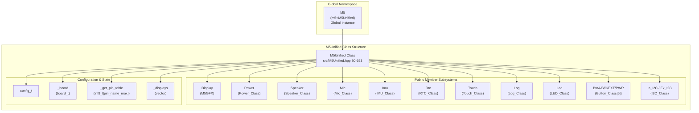
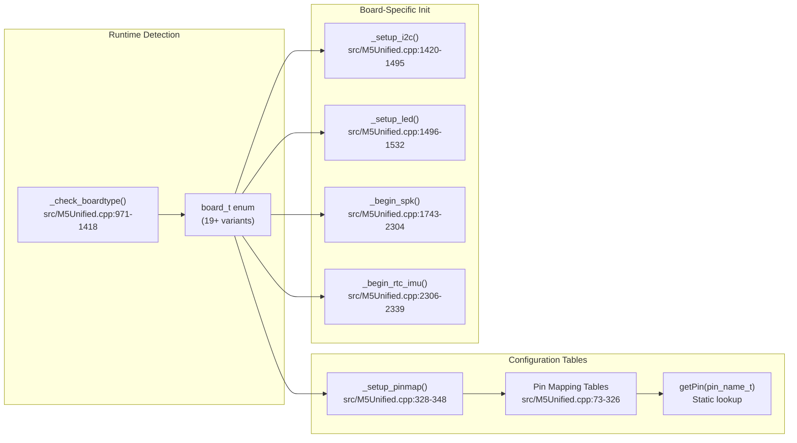
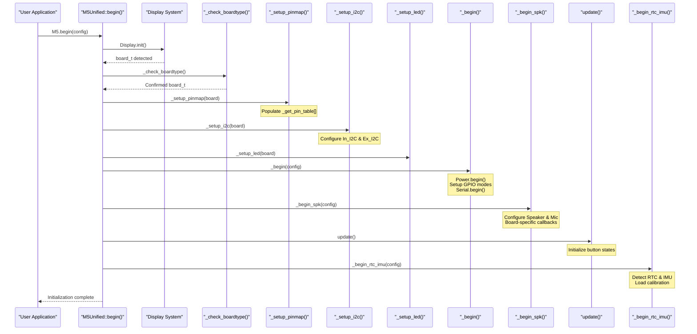
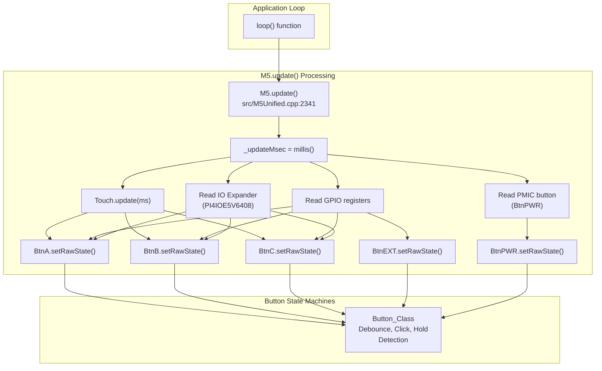
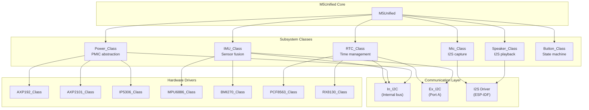
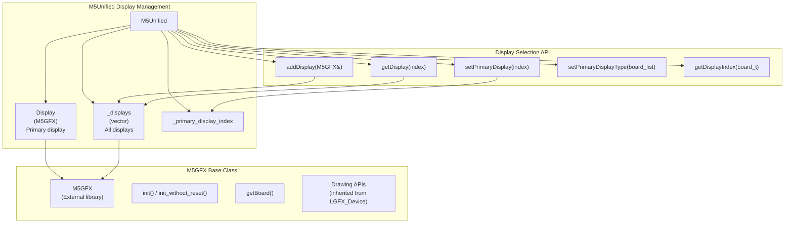
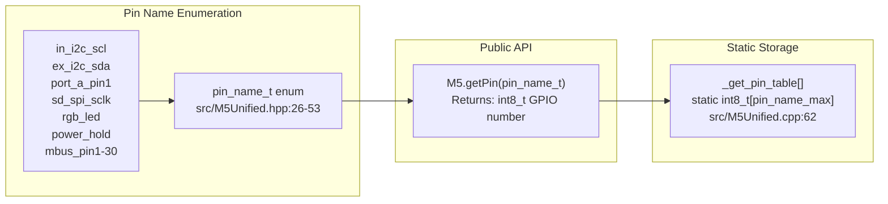

M5Unified Core Architecture

# Core Architecture

<details>
<summary>Relevant source files</summary>

The following files were used as context for generating this wiki page:

- [src/M5Unified.cpp](src/M5Unified.cpp)
- [src/M5Unified.hpp](src/M5Unified.hpp)

</details>


## Purpose and Scope

This page provides an architectural overview of the M5Unified library's core design, explaining how the `M5Unified` class acts as a central orchestrator to provide a unified hardware abstraction layer across 19+ M5Stack device variants. This document covers the major subsystems, ownership model, and interaction patterns, but defers detailed implementation specifics to dedicated child pages.

For detailed information about specific aspects:
- System initialization sequence and `M5.begin()` → See [System Initialization and Lifecycle](#2.1)
- Board detection mechanisms → See [Board Detection and Hardware Identification](#2.2)
- GPIO pin assignment strategy → See [Pin Mapping System](#2.3)
- Display management → See [Display Management and M5GFX Integration](#2.4)
- The `M5.update()` loop → See [Main Update Loop and Peripheral Polling](#2.5)

---

## Central Orchestrator Pattern

The M5Unified library centers around a single global instance, `M5`, of type `M5Unified` defined in [src/M5Unified.cpp:45](). This instance serves as the primary interface for all hardware interactions.



**Sources:** [src/M5Unified.cpp:45](), [src/M5Unified.hpp:80-653]()

### Ownership Model

The `M5Unified` class directly owns instances of all major subsystem classes as public members. This design provides immediate access to hardware abstractions without requiring pointer dereferencing or getter methods.

| Subsystem | Member Name | Type | Purpose |
|-----------|-------------|------|---------|
| Display | `Display` / `Lcd` | `M5GFX` | Primary display interface |
| Power Management | `Power` | `Power_Class` | Battery, charging, sleep modes |
| Audio Output | `Speaker` | `Speaker_Class` | I2S audio playback |
| Audio Input | `Mic` | `Mic_Class` | I2S audio capture |
| Motion Sensing | `Imu` | `IMU_Class` | Accelerometer, gyroscope, magnetometer |
| Real-Time Clock | `Rtc` | `RTC_Class` | Time/date management |
| Touch Input | `Touch` | `Touch_Class` | Touchscreen interface |
| Logging | `Log` | `Log_Class` | Multi-target logging |
| RGB LED | `Led` | `LED_Class` | Addressable LED control |
| Buttons | `BtnA`, `BtnB`, `BtnC`, `BtnEXT`, `BtnPWR` | `Button_Class` | Hardware button state machines |
| I2C Buses | `In_I2C`, `Ex_I2C` | `I2C_Class&` | Internal and external I2C |

**Sources:** [src/M5Unified.hpp:215-248]()

---

## Multi-Board Abstraction Strategy

The M5Unified architecture achieves hardware abstraction through three coordinated mechanisms:



**Sources:** [src/M5Unified.cpp:971-1418](), [src/M5Unified.cpp:73-326](), [src/M5Unified.cpp:328-348](), [src/M5Unified.cpp:1420-1532](), [src/M5Unified.cpp:1743-2339]()

### Board Detection

At startup, `_check_boardtype()` performs runtime hardware identification through:
- ESP32 package variant detection via `m5gfx::get_pkg_ver()`
- GPIO pull-up/pull-down response testing to identify board variants
- I2C device probing for board-specific peripherals
- Touch sensor capacitance measurements (ESP32 only) to distinguish similar boards

The detected board type is stored in the `_board` member variable of type `board_t`.

**Sources:** [src/M5Unified.cpp:971-1418]()

### Pin Mapping System

After board detection, `_setup_pinmap()` populates the static `_get_pin_table[]` array from compile-time constant tables. This array provides O(1) GPIO pin lookups via the `getPin(pin_name_t)` static method.

Pin mapping tables exist for:
- `_pin_table_i2c_ex_in` - Internal and external I2C buses [src/M5Unified.cpp:73-116]()
- `_pin_table_port_bc` - Port B and Port C connectors [src/M5Unified.cpp:118-139]()
- `_pin_table_port_de` - Port D and Port E connectors [src/M5Unified.cpp:141-154]()
- `_pin_table_spi_sd` - SD card SPI pins [src/M5Unified.cpp:156-176]()
- `_pin_table_other0` - RGB LED pin [src/M5Unified.cpp:178-209]()
- `_pin_table_other1` - Power hold pin [src/M5Unified.cpp:211-231]()
- `_pin_table_mbus` - Module bus pins (30 pins) [src/M5Unified.cpp:233-326]()

**Sources:** [src/M5Unified.cpp:73-348]()

---

## Initialization Lifecycle

The `M5.begin()` method orchestrates system initialization through a carefully ordered sequence:



**Sources:** [src/M5Unified.hpp:332-603](), [src/M5Unified.cpp:1534-1741]()

### Initialization Methods

The initialization process is split into multiple private methods, each responsible for a specific subsystem:

| Method | Responsibility | Key Actions |
|--------|---------------|-------------|
| `_check_boardtype()` | Board identification | ESP32 package detection, GPIO tests, I2C probing |
| `_setup_pinmap()` | Pin configuration | Load pin mappings from compile-time tables |
| `_setup_i2c()` | I2C bus setup | Configure `In_I2C` and `Ex_I2C` buses, initialize IO expanders |
| `_setup_led()` | LED initialization | Configure RGB LED driver (RMT or PowerHub protocol) |
| `_begin()` | Core subsystems | Initialize `Power`, set GPIO modes, start serial |
| `_begin_spk()` | Audio subsystems | Configure `Speaker` and `Mic` with board-specific callbacks |
| `_begin_rtc_imu()` | Sensor subsystems | Detect and initialize `Rtc` and `Imu` devices |

**Sources:** [src/M5Unified.cpp:971-2339]()

---

## Runtime Operation

After initialization, the application must call `M5.update()` regularly (typically in the Arduino `loop()` function) to maintain button states and other time-sensitive operations.



**Sources:** [src/M5Unified.cpp:2341-2699]()

### Update Method Responsibilities

The `update()` method at [src/M5Unified.cpp:2341-2699]() performs these operations:

1. **Timestamp Recording**: Updates `_updateMsec` with current `millis()` value
2. **Touch Processing**: Calls `Touch.update()` if touchscreen is enabled
3. **Touch Button Mapping**: Converts touch coordinates to virtual button presses for Core2/CoreS3/Paper/Tab5
4. **GPIO Sampling**: Reads hardware button states from GPIO registers
5. **IO Expander Reading**: Queries IO expander chips for extended button inputs (StampPLC, UnitC6L, NessoN1, Tab5)
6. **PMIC Button Reading**: Reads power button state from PMIC chips (AXP192/AXP2101)
7. **Button State Updates**: Calls `setRawState()` on all `Button_Class` instances to update their state machines

**Sources:** [src/M5Unified.cpp:2341-2699]()

---

## Subsystem Architecture

Each major subsystem follows a consistent architectural pattern:



**Sources:** [src/M5Unified.hpp:215-248](), [src/M5Unified.cpp:1534-2339]()

### Subsystem Initialization Pattern

Most subsystems follow this initialization pattern:

1. **Configuration**: Define a `config_t` structure with hardware parameters
2. **Board-Specific Setup**: Populate configuration based on detected `_board` type
3. **Callback Registration**: Register board-specific enable/disable callbacks (for Speaker/Mic)
4. **Hardware Detection**: Probe I2C bus for compatible devices
5. **Device Selection**: Instantiate appropriate driver class via polymorphism or runtime switching
6. **State Restoration**: Load calibration or persistent state from NVS (IMU, Power)

**Sources:** [src/M5Unified.cpp:1743-2339]()

---

## Integration with M5GFX

The display subsystem integrates tightly with the external M5GFX library [src/M5Unified.hpp:19]():



**Sources:** [src/M5Unified.hpp:215-216](), [src/M5Unified.hpp:257-286]()

### Multi-Display Support

M5Unified supports multiple displays simultaneously through a vector-based architecture:

- **Display Registration**: Displays are added to `_displays` vector via `addDisplay()` [src/M5Unified.hpp:263]()
- **Primary Display**: The `Display` member references the active display for drawing operations
- **Display Iteration**: Access individual displays via `getDisplay(index)` or `Displays(index)`
- **Type-Based Selection**: Use `setPrimaryDisplayType()` to select by board type (e.g., prioritizing external displays)

This architecture enables configurations like:
- M5Stack Core + Module Display (dual display)
- M5Atom + Atom Display attachment
- M5Stack Core + Unit OLED (external I2C display)

**Sources:** [src/M5Unified.hpp:215-216](), [src/M5Unified.hpp:257-286](), [src/M5Unified.hpp:332-603]()

---

## Configuration System

The `config_t` structure [src/M5Unified.hpp:83-213]() provides compile-time defaults with runtime overrides:

| Configuration Category | Purpose | Default Behavior |
|------------------------|---------|------------------|
| `serial_baudrate` | Arduino Serial initialization | 0 (disabled) |
| `clear_display` | Clear screen at startup | `true` |
| `output_power` | 5V output to external ports | `true` |
| `internal_*` flags | Enable built-in peripherals | All `true` except `internal_mic` varies by board |
| `external_*` flags | Enable external peripherals | `false` (opt-in) |
| `external_speaker.*` | External speaker detection flags | `0x00` (disabled) |
| `external_display.*` | External display detection flags | `0xFFFF` (all enabled) |
| `fallback_board` | Board type if detection fails | Varies by ESP32 variant |
| `led_brightness` | System LED brightness | 0 (off) |

**Sources:** [src/M5Unified.hpp:83-213]()

---

## Static Pin Table Architecture

The pin mapping system uses a static lookup table to provide fast GPIO pin access without board conditionals in user code:



**Usage Example:**
```cpp
// Get the I2C SDA pin for external devices (Port A)
int8_t sda_pin = M5.getPin(m5::pin_name_t::ex_i2c_sda);

// Get SD card CS pin
int8_t sd_cs = M5.getPin(m5::pin_name_t::sd_spi_cs);

// Get RGB LED pin
int8_t led_pin = M5.getPin(m5::pin_name_t::rgb_led);
```

**Sources:** [src/M5Unified.hpp:26-53](), [src/M5Unified.hpp:251](), [src/M5Unified.cpp:62](), [src/M5Unified.cpp:328-348]()

---

## Summary

The M5Unified core architecture achieves its goal of hardware abstraction through:

1. **Centralized Orchestration**: The global `M5` instance provides a single entry point for all hardware access
2. **Direct Subsystem Ownership**: All major peripherals are accessible as public members (e.g., `M5.Power`, `M5.Speaker`)
3. **Runtime Board Detection**: Automatic hardware identification through GPIO testing and I2C probing
4. **Static Pin Mapping**: Fast GPIO lookups via pre-populated tables indexed by symbolic names
5. **Polymorphic Drivers**: Hardware-specific implementations selected at runtime based on detected board type
6. **Ordered Initialization**: Dependencies respected through carefully sequenced initialization methods
7. **Regular Update Loop**: Application-driven polling via `M5.update()` for time-sensitive operations

This architecture enables a single compiled binary to support 19+ M5Stack device variants while maintaining optimal performance and a clean, consistent API surface.

**Sources:** [src/M5Unified.hpp:80-653](), [src/M5Unified.cpp:45](), [src/M5Unified.cpp:328-2699]()