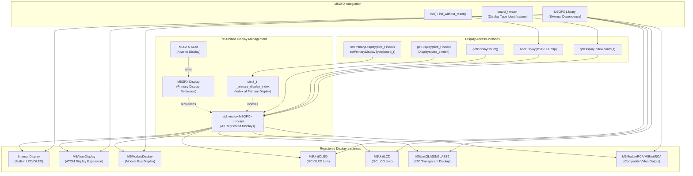
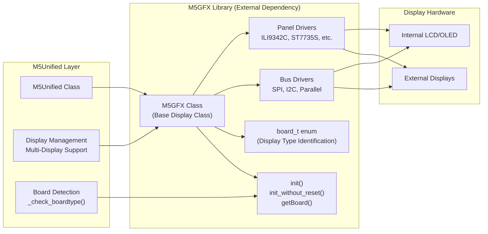
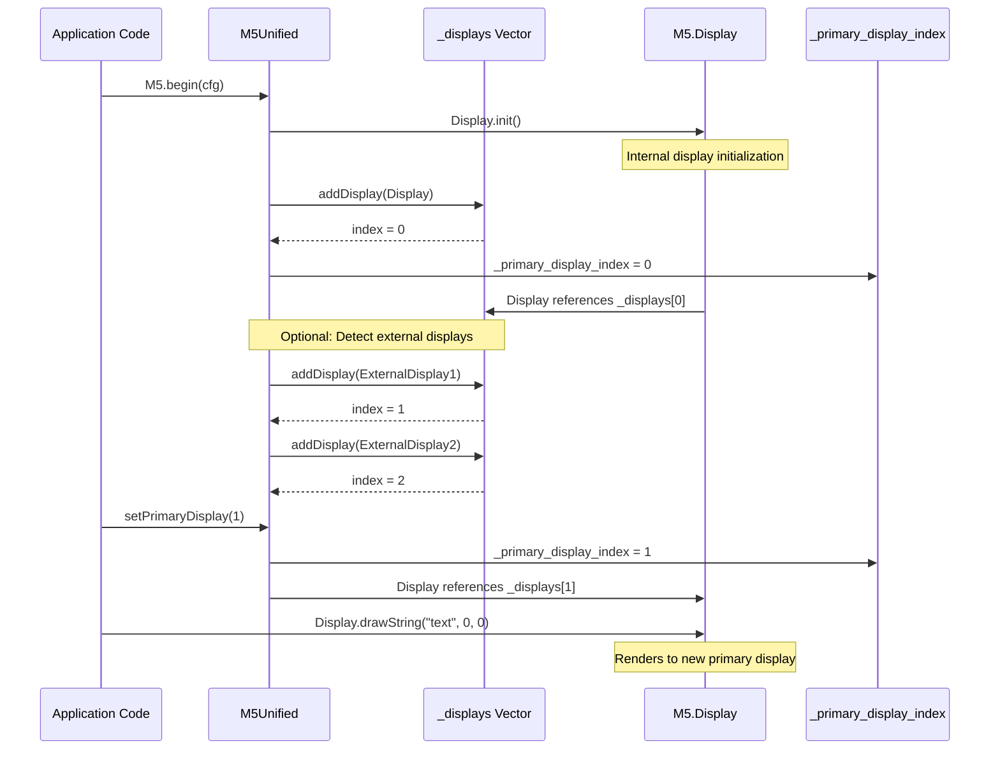
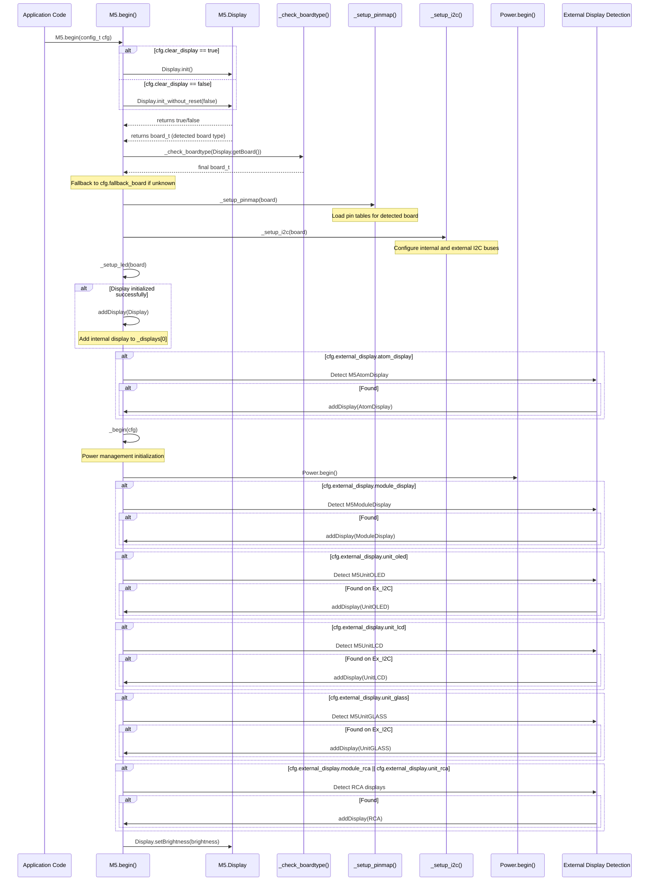
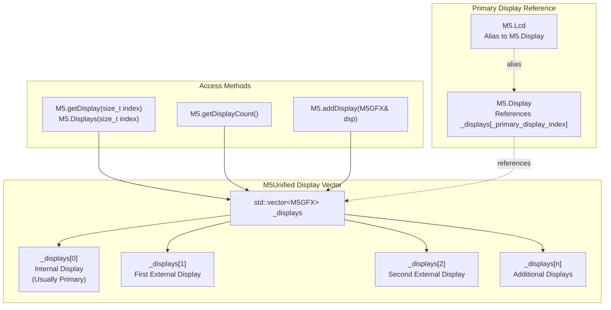
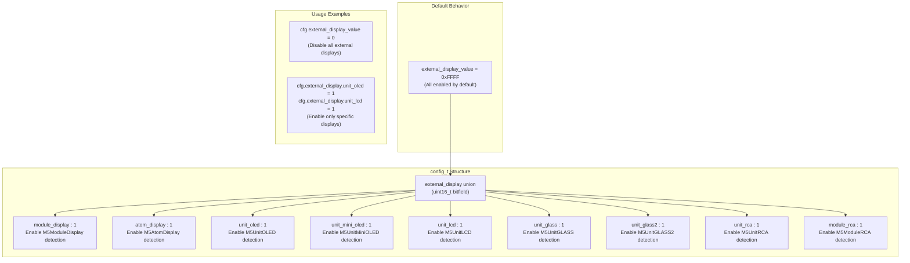

M5Unified Display Management and M5GFX Integration

# Display Management and M5GFX Integration

<details>
<summary>Relevant source files</summary>

The following files were used as context for generating this wiki page:

- [src/M5Unified.cpp](src/M5Unified.cpp)
- [src/M5Unified.hpp](src/M5Unified.hpp)

</details>


## Purpose and Scope

This document describes M5Unified's display management architecture, including the multi-display vector system, M5GFX library integration, primary display selection, and initialization sequence. It covers how M5Unified abstracts display hardware across 19+ board types and supports multiple simultaneous displays.

For board-specific pin mapping and hardware initialization, see [Pin Mapping System](#2.3). For system initialization ordering, see [System Initialization and Lifecycle](#2.1). For logging output to displays, see [Logging System](#8.1).

## Display Architecture Overview

M5Unified implements a multi-display architecture where multiple display instances can be registered and managed simultaneously. The system maintains a vector of all displays with one designated as the primary display.



**Sources:** [src/M5Unified.hpp:215-217](), [src/M5Unified.hpp:257-286](), [src/M5Unified.hpp:617](), [src/M5Unified.hpp:624]()

### Key Components

| Component | Type | Purpose |
|-----------|------|---------|
| `M5.Display` | `M5GFX` | Primary display instance (reference to element in `_displays` vector) |
| `M5.Lcd` | `M5GFX&` | Alias to `M5.Display` for backward compatibility |
| `_displays` | `std::vector<M5GFX>` | Vector containing all registered display instances |
| `_primary_display_index` | `uint8_t` | Index of the primary display in `_displays` vector |

**Sources:** [src/M5Unified.hpp:215-217](), [src/M5Unified.hpp:617](), [src/M5Unified.hpp:624]()

## M5GFX Library Integration

M5Unified depends on the M5GFX library, which provides unified graphics functionality across different display controllers. M5GFX handles low-level display initialization, communication protocols (SPI/I2C), and rendering operations.



**Sources:** [src/M5Unified.hpp:19](), [src/M5Unified.hpp:215-216](), [src/M5Unified.cpp:343-360]()

### M5GFX Responsibilities

M5GFX handles:
- **Display Controller Communication**: SPI, I2C, and parallel bus protocols
- **Panel Initialization**: Hardware-specific initialization sequences
- **Board Type Detection**: Identifying display hardware via GPIO probing and I2C scanning
- **Rendering Operations**: Graphics primitives, fonts, images, sprites
- **Brightness Control**: PWM backlight control
- **Touch Interface**: Touch controller integration (when applicable)

M5Unified responsibilities:
- **Multi-Display Management**: Registering and switching between displays
- **Board-Specific Configuration**: Pin mapping and initialization ordering
- **External Display Detection**: Probing I2C/SPI buses for additional displays
- **System Integration**: Coordinating displays with power management and logging

**Sources:** [src/M5Unified.hpp:19](), [src/M5Unified.cpp:343-360]()

## Primary Display Management

The primary display (`M5.Display` or `M5.Lcd`) is the default target for graphics operations. Applications typically render to this display without explicitly selecting it.

### Primary Display Selection Process



**Sources:** [src/M5Unified.cpp:343-360](), [src/M5Unified.hpp:272-279]()

### Primary Display API

| Method | Purpose |
|--------|---------|
| `setPrimaryDisplay(size_t index)` | Set primary display by index in `_displays` vector |
| `setPrimaryDisplayType(board_t board)` | Find and set primary display matching board type |
| `setPrimaryDisplayType(initializer_list<board_t>)` | Find and set primary from list of board types |
| `getDisplayIndex(board_t board)` | Get index of display matching board type (returns -1 if not found) |
| `getDisplay(size_t index)` | Access specific display by index |
| `getDisplayCount()` | Get total number of registered displays |

**Sources:** [src/M5Unified.hpp:257-279]()

### Usage Examples

```cpp
// Access primary display
M5.Display.fillScreen(BLACK);
M5.Lcd.drawString("Hello", 10, 10);  // Lcd is alias for Display

// Access specific display by index
M5.Displays(0).clear();
M5.Displays(1).drawCircle(50, 50, 20, WHITE);

// Change primary display to ModuleDisplay
M5.setPrimaryDisplayType(board_t::board_M5ModuleDisplay);

// Or by index
M5.setPrimaryDisplay(1);

// Check if specific display type exists
int idx = M5.getDisplayIndex(board_t::board_M5UnitOLED);
if (idx >= 0) {
    M5.Displays(idx).drawString("OLED found", 0, 0);
}
```

**Sources:** [src/M5Unified.hpp:215-217](), [src/M5Unified.hpp:257-279]()

## Display Initialization Sequence

Display initialization occurs in the `M5.begin()` method with a specific ordering to ensure proper hardware detection and configuration.



**Sources:** [src/M5Unified.cpp:332-603]()

### Initialization Phases

1. **Pre-Initialization** (lines 343-360)
   - Brightness saved and set to 0
   - `Display.init()` or `Display.init_without_reset()` called
   - Board type detected via M5GFX
   - Board type refined via `_check_boardtype()`
   - Pin mapping loaded via `_setup_pinmap()`
   - I2C buses configured via `_setup_i2c()`
   - Internal display added to `_displays` vector if initialization succeeded

2. **Early External Display Detection** (lines 362-377)
   - `M5AtomDisplay` detection (requires GPIO probing before power init)
   - Only if `cfg.external_display.atom_display` is true
   - Board-specific: ATOM family devices only

3. **Power Management Initialization** (lines 380)
   - `_begin(cfg)` called, which includes `Power.begin()`
   - External port power enabled if `cfg.output_power` is true
   - Required before detecting I2C/power-hungry displays

4. **Late External Display Detection** (lines 384-597)
   - `M5ModuleDisplay` detection (requires power to module bus)
   - `M5UnitOLED`, `M5UnitMiniOLED` detection (I2C displays)
   - `M5UnitLCD` detection (I2C display with retry logic)
   - `M5UnitGLASS`, `M5UnitGLASS2` detection (I2C transparent displays)
   - `M5ModuleRCA`, `M5UnitRCA` detection (composite video output)

5. **Finalization** (lines 599-602)
   - Brightness restored if primary display is valid

**Sources:** [src/M5Unified.cpp:332-603]()

## Multi-Display Support

M5Unified supports multiple simultaneous displays through the `_displays` vector. Each display is independently accessible and can have different properties (resolution, color depth, communication bus).

### Display Vector Management



**Sources:** [src/M5Unified.hpp:617](), [src/M5Unified.hpp:257-261]()

### Adding Displays

Displays are added to the vector via `addDisplay()`:

| Location in Code | Display Type | Timing |
|------------------|--------------|--------|
| [src/M5Unified.cpp:358-360]() | Internal Display | Early (before power init) |
| [src/M5Unified.cpp:362-377]() | M5AtomDisplay | Early (GPIO detection) |
| [src/M5Unified.cpp:384-402]() | M5ModuleDisplay | Late (after power init) |
| [src/M5Unified.cpp:424-446]() | M5UnitOLED | Late (I2C probing) |
| [src/M5Unified.cpp:448-470]() | M5UnitMiniOLED | Late (I2C probing) |
| [src/M5Unified.cpp:472-494]() | M5UnitGLASS | Late (I2C probing) |
| [src/M5Unified.cpp:496-518]() | M5UnitGLASS2 | Late (I2C probing) |
| [src/M5Unified.cpp:520-547]() | M5UnitLCD | Late (I2C probing with retry) |
| [src/M5Unified.cpp:550-597]() | M5ModuleRCA / M5UnitRCA | Late (after power init) |

**Sources:** [src/M5Unified.cpp:332-603]()

### Multi-Display Usage Patterns

```cpp
// Iterate through all displays
for (int i = 0; i < M5.getDisplayCount(); i++) {
    M5.Displays(i).drawString("Display " + String(i), 0, 0);
}

// Check if multiple displays available
if (M5.getDisplayCount() > 1) {
    // Use internal display for main UI
    M5.Display.fillScreen(BLACK);
    M5.Display.drawString("Main", 10, 10);
    
    // Use external display for status
    M5.Displays(1).fillScreen(BLUE);
    M5.Displays(1).drawString("Status", 10, 10);
}

// Find specific display type and use it
int moduleIdx = M5.getDisplayIndex(board_t::board_M5ModuleDisplay);
if (moduleIdx >= 0) {
    M5.Displays(moduleIdx).drawJpgFile(SD, "/image.jpg");
}
```

## Display Type Detection and Selection

M5Unified can detect and select displays based on their `board_t` type identifier, which is provided by M5GFX after hardware initialization.

### Board Type to Display Mapping

```mermaid
graph TB
    subgraph "Internal Displays (Built-in)"
        CoreS3["board_M5StackCoreS3<br/>ILI9342C 320x240"]
        Core2["board_M5StackCore2<br/>ILI9342C 320x240 + Touch"]
        StickCPlus["board_M5StickCPlus<br/>ST7735S 135x240"]
        Paper["board_M5Paper<br/>IT8951 540x960 E-Ink"]
        AtomS3["board_M5AtomS3<br/>GC9107 128x128"]
        Dial["board_M5Dial<br/>GC9A01 240x240 Round"]
    end
    
    subgraph "External Expansion Displays"
        AtomDisplay["board_M5AtomDisplay<br/>ST7789 1920x1080 HDMI"]
        ModuleDisplay["board_M5ModuleDisplay<br/>ST7789 320x240 + Audio"]
        UnitOLED["board_M5UnitOLED<br/>SSD1306 128x64 I2C"]
        UnitLCD["board_M5UnitLCD<br/>ST7735S 135x240 I2C"]
        ModuleRCA["board_M5ModuleRCA<br/>Composite Video"]
    end
    
    subgraph "Display Detection APIs"
        GetBoard["M5GFX.getBoard()<br/>Returns board_t"]
        GetIndex["M5.getDisplayIndex(board_t)<br/>Returns index or -1"]
        SetPrimary["M5.setPrimaryDisplayType(board_t)<br/>Switch primary display"]
    end
    
    GetBoard --> CoreS3
    GetBoard --> Core2
    GetBoard --> StickCPlus
    GetBoard --> Paper
    GetBoard --> AtomS3
    GetBoard --> Dial
    GetBoard --> AtomDisplay
    GetBoard --> ModuleDisplay
    GetBoard --> UnitOLED
    GetBoard --> UnitLCD
    GetBoard --> ModuleRCA
    
    CoreS3 --> GetIndex
    Core2 --> GetIndex
    StickCPlus --> GetIndex
    Paper --> GetIndex
    AtomS3 --> GetIndex
    Dial --> GetIndex
    AtomDisplay --> GetIndex
    ModuleDisplay --> GetIndex
    UnitOLED --> GetIndex
    UnitLCD --> GetIndex
    ModuleRCA --> GetIndex
    
    GetIndex --> SetPrimary
```



**Sources:** [src/M5Unified.hpp:267-279](), [src/M5Unified.cpp:351-360]()

### Display Type Selection Examples

```cpp
// Find and switch to ModuleDisplay if available
if (M5.setPrimaryDisplayType(board_t::board_M5ModuleDisplay)) {
    M5.Display.drawString("Using Module Display", 10, 10);
} else {
    M5.Display.drawString("Using Internal Display", 10, 10);
}

// Try multiple display types in priority order
bool found = M5.setPrimaryDisplayType({
    board_t::board_M5UnitLCD,
    board_t::board_M5UnitOLED,
    board_t::board_M5StackCoreS3
});

// Get index of specific display
int oledIdx = M5.getDisplayIndex(board_t::board_M5UnitOLED);
if (oledIdx >= 0) {
    // Direct access to OLED without changing primary
    M5.Displays(oledIdx).setTextSize(2);
    M5.Displays(oledIdx).drawString("Status", 0, 0);
}

// Check display count and types
Serial.printf("Total displays: %d\n", M5.getDisplayCount());
for (int i = 0; i < M5.getDisplayCount(); i++) {
    board_t type = M5.Displays(i).getBoard();
    Serial.printf("Display %d: board type %d\n", i, type);
}
```

## Configuration Options

The `config_t` structure provides flags to control which external displays are detected during initialization.

### External Display Configuration Flags



**Sources:** [src/M5Unified.hpp:108-124]()

### Configuration Table

| Flag | Default | Detection Timing | Boards Supported |
|------|---------|------------------|------------------|
| `module_display` | enabled | Late (after power) | M5Stack, Core2, CoreS3, Tab5 |
| `atom_display` | enabled | Early (GPIO detect) | ATOM family |
| `unit_oled` | enabled | Late (I2C probe) | All with Port.A |
| `unit_mini_oled` | enabled | Late (I2C probe) | All with Port.A |
| `unit_lcd` | enabled | Late (I2C probe) | All with Port.A |
| `unit_glass` | enabled | Late (I2C probe) | All with Port.A |
| `unit_glass2` | enabled | Late (I2C probe) | All with Port.A |
| `unit_rca` | enabled | Late (after power) | M5Stack, Core2, Paper, Station, ATOM |
| `module_rca` | enabled | Late (after power) | M5Stack, Core2, Tough |

**Sources:** [src/M5Unified.hpp:108-124](), [src/M5Unified.cpp:362-597]()

### Configuration Usage

```cpp
// Default: all external displays enabled
M5.begin();

// Disable all external display detection (faster boot)
auto cfg = M5.config();
cfg.external_display_value = 0;
M5.begin(cfg);

// Enable only specific displays
auto cfg = M5.config();
cfg.external_display_value = 0;  // Disable all first
cfg.external_display.unit_oled = 1;  // Enable OLED
cfg.external_display.unit_lcd = 1;   // Enable LCD
M5.begin(cfg);

// Clear display on startup
auto cfg = M5.config();
cfg.clear_display = true;  // Default is true
M5.begin(cfg);

// Don't clear display (keep bootloader graphics)
auto cfg = M5.config();
cfg.clear_display = false;
M5.begin(cfg);
```

**Sources:** [src/M5Unified.hpp:108-127](), [src/M5Unified.cpp:332-603]()

### Display-Specific Configuration Structures

Some external displays have additional configuration structures:

```cpp
#if defined(__M5GFX_M5ATOMDISPLAY__)
    M5AtomDisplay::config_t atom_display;
#endif

#if defined(__M5GFX_M5MODULEDISPLAY__)
    M5ModuleDisplay::config_t module_display;
#endif

#if defined(__M5GFX_M5UNITOLED__)
    M5UnitOLED::config_t unit_oled;
#endif

// Usage:
auto cfg = M5.config();
cfg.atom_display.pin_sda = GPIO_NUM_5;
cfg.atom_display.pin_scl = GPIO_NUM_6;
M5.begin(cfg);
```

**Sources:** [src/M5Unified.hpp:186-212](), [src/M5Unified.cpp:362-597]()

### Log Display Configuration

The logging system can output to a specific display using the log display configuration methods:

```cpp
// Set log output to specific display index
M5.setLogDisplayIndex(1);  // Log to second display

// Set log output to specific display type
M5.setLogDisplayType(board_t::board_M5UnitOLED);

// Set log output with type priority list
M5.setLogDisplayType({
    board_t::board_M5UnitOLED,
    board_t::board_M5UnitLCD,
    board_t::board_M5StackCoreS3
});

// Logs will now appear on the configured display
M5_LOGI("System ready");
```

**Sources:** [src/M5Unified.hpp:282-286]()