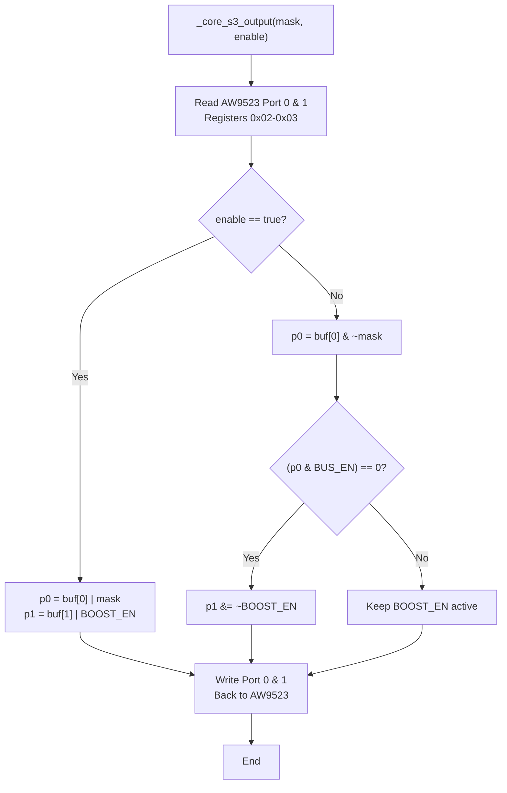
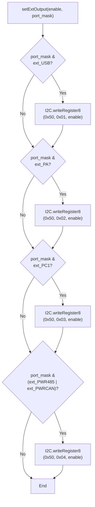
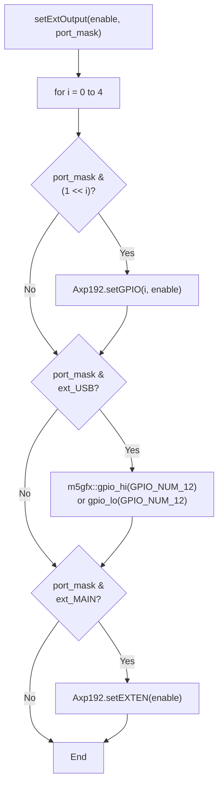
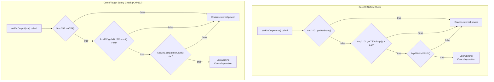

M5Unified External Port Power Control

# External Power Control

<details>
<summary>Relevant source files</summary>

The following files were used as context for generating this wiki page:

- [src/utility/Power_Class.cpp](src/utility/Power_Class.cpp)
- [src/utility/Power_Class.hpp](src/utility/Power_Class.hpp)

</details>


This page documents the external power control subsystem of the Power_Class, which manages power output to expansion ports and external peripherals. These methods control voltage regulators, boost converters, and GPIO-controlled switches that supply power to external devices connected via PortA/B/C, M-Bus, and USB interfaces.

For battery management and charging control, see [Battery Management](#4.2). For sleep modes and system power states, see [Sleep Modes](#4.3).

## Overview

External power control provides the ability to enable or disable power supply to expansion ports and external peripherals. This functionality varies significantly across device families due to different hardware implementations:

- **PMIC-based control**: Devices with AXP192/AXP2101 use integrated LDO/DCDC outputs
- **IO Expander-based control**: Newer devices (CoreS3, Tab5, NessoN1) use AW9523 or similar IO expanders to control power switches
- **Direct GPIO control**: Simpler devices use GPIO pins to control external MOSFETs or switches

The subsystem implements safety mechanisms that prevent external power output when battery levels are critically low or when power sourcing conditions are unsafe.

Sources: [src/utility/Power_Class.hpp:71-94](), [src/utility/Power_Class.cpp:514-700]()

## Device-Specific Implementations

The following diagram shows how different M5Stack devices implement external power control through various hardware paths:

```mermaid
graph TB
    subgraph API["Power_Class API"]
        setExtOutput["setExtOutput(enable, port_mask)"]
        getExtOutput["getExtOutput()"]
        setUsbOutput["setUsbOutput(enable)"]
        getUsbOutput["getUsbOutput()"]
    end
    
    subgraph ESP32P4["ESP32-P4 Devices"]
        Tab5["M5Tab5"]
        Tab5_IOE0["IOExpander(0) Pin 2<br/>ext_PA Control"]
        Tab5_IOE1["IOExpander(1) Pin 3<br/>ext_USB Control"]
    end
    
    subgraph ESP32C6["ESP32-C6 Devices"]
        NessoN1["ArduinoNessoN1"]
        NessoN1_IOE["IOExpander(1) Pin 2<br/>EXT_PWR_EN"]
    end
    
    subgraph ESP32S3["ESP32-S3 Devices"]
        CoreS3["CoreS3 / CoreS3SE"]
        AW9523["AW9523 I2C IO Expander<br/>addr 0x58"]
        CoreS3_BUS["Port 0 Bit 1<br/>BUS_EN"]
        CoreS3_USB["Port 0 Bit 5<br/>USB_EN"]
        CoreS3_BOOST["Port 1 Bit 7<br/>BOOST_EN"]
        CoreS3_Safety["Safety Check:<br/>Cancel if no battery<br/>TS > 2.0V && VBUS"]
        
        StickS3["M5StickS3"]
        M5PM1["M5PM1 PMIC<br/>I2C addr 0x6E"]
        StickS3_Reg["Register 0x06 bit 3<br/>5V Output Control"]
        
        PowerHub["M5PowerHub"]
        PowerHub_I2C["I2C addr 0x50"]
        PowerHub_Regs["Registers:<br/>0x01=USB, 0x02=PA<br/>0x03=PC1, 0x04=RS485/CAN"]
    end
    
    subgraph ESP32["ESP32 Original Devices"]
        Paper["M5Paper"]
        Paper_GPIO["GPIO 5<br/>EXT5V_ENABLE_PIN"]
        
        Core2["M5StackCore2 / M5Tough"]
        Core2_AXP192["AXP192 GPIO0<br/>LDO Mode"]
        Core2_AXP2101["AXP2101 BLDO2<br/>3300mV"]
        Core2_Safety["Safety Check:<br/>Cancel if !ACIN && VBUS<br/>&& battery <= 8%"]
        
        StickC["M5StickC / M5StickCPlus"]
        StickC_EXTEN["AXP192 EXTEN"]
        
        Station["M5Station"]
        Station_GPIO["AXP192 GPIO 0-4<br/>Per-port control"]
        Station_GPIO12["GPIO 12<br/>USB Power"]
        Station_EXTEN["AXP192 EXTEN<br/>Main Power"]
    end
    
    setExtOutput --> Tab5
    setExtOutput --> NessoN1
    setExtOutput --> CoreS3
    setExtOutput --> StickS3
    setExtOutput --> PowerHub
    setExtOutput --> Paper
    setExtOutput --> Core2
    setExtOutput --> StickC
    setExtOutput --> Station
    
    setUsbOutput --> CoreS3
    
    Tab5 --> Tab5_IOE0
    Tab5 --> Tab5_IOE1
    
    NessoN1 --> NessoN1_IOE
    
    CoreS3 --> CoreS3_Safety
    CoreS3_Safety --> AW9523
    AW9523 --> CoreS3_BUS
    AW9523 --> CoreS3_USB
    AW9523 --> CoreS3_BOOST
    
    StickS3 --> M5PM1
    M5PM1 --> StickS3_Reg
    
    PowerHub --> PowerHub_I2C
    PowerHub_I2C --> PowerHub_Regs
    
    Paper --> Paper_GPIO
    
    Core2 --> Core2_Safety
    Core2_Safety --> Core2_AXP192
    Core2_Safety --> Core2_AXP2101
    
    StickC --> StickC_EXTEN
    
    Station --> Station_GPIO
    Station --> Station_GPIO12
    Station --> Station_EXTEN
```



Sources: [src/utility/Power_Class.cpp:552-684]()

### M5Stack CoreS3 Implementation

The CoreS3 uses an AW9523 IO expander to control multiple power domains. The implementation includes automatic boost converter management and safety interlocks.

**Hardware Control Path:**
- **I2C Address**: `0x58` (AW9523)
- **BUS_EN**: Port 0, Bit 1 (`0b00000010`) - Controls expansion port power
- **USB_EN**: Port 0, Bit 5 (`0b00100000`) - Controls main USB port power
- **BOOST_EN**: Port 1, Bit 7 (`0b10000000`) - Boost converter enable

The `_core_s3_output()` helper function implements the control logic:



**Safety Mechanism**: External power output is cancelled if all conditions are met:
- Battery is not detected (`!Axp2101.getBatState()`)
- Thermistor voltage > 2.0V (`Axp2101.getTSVoltage() > 2.0f`)
- VBUS is present (`Axp2101.isVBUS()`)

This prevents attempting to power external devices when the battery is absent and the device is USB-powered only.

Sources: [src/utility/Power_Class.cpp:515-550](), [src/utility/Power_Class.cpp:582-593](), [src/utility/Power_Class.cpp:759-763]()

### M5StackCore2 and M5Tough Implementation

These devices support both AXP192 and AXP2101 PMICs with different control mechanisms:

| PMIC Type | Control Method | Register/Function | Voltage |
|-----------|---------------|-------------------|---------|
| AXP192 | GPIO0 as LDO | Register 0x90 | Configured |
| AXP2101 | BLDO2 Output | `setBLDO2(enable * 3300)` | 3300mV |

**AXP192 Implementation:**
- Write `0x02` to register `0x90` to enable GPIO0 as LDO
- Write `0x07` to register `0x90` to disable (floating mode)

**AXP2101 Implementation:**
- Uses `Ina3221[0]` current monitors to detect external power flow
- Checks shunt voltages on channels 0 and 1

**Safety Mechanism**: External power is cancelled when enabling if:
- **AXP192**: `!isACIN()` AND `getVBUSCurrent() > 0.0f` AND `getBatteryLevel() <= 8`
- **AXP2101**: `(getShuntVoltage(0) < 0.0f OR getShuntVoltage(1) < 0.0f)` AND `getBatteryLevel() <= 8`

This prevents draining the battery when powered solely via VBUS (USB-C data port) without ACIN (DC power port), which would cause the system to consume battery power to supply external devices.

Sources: [src/utility/Power_Class.cpp:632-657]()

### M5StickS3 Implementation

M5StickS3 uses the M5PM1 PMIC (I2C address `0x6E`) to control external 5V output via register-based control:

**Hardware Control Path:**
- **I2C Address**: `0x6E` (m5pm1_i2c_addr)
- **Control Register**: `0x06`
- **Control Bit**: Bit 3 (0x08 mask)
  - `1` = Enable 5V output
  - `0` = Disable 5V output

**Implementation**: Read-modify-write operation on register 0x06:
```
reg_val = read(0x06)
if (enable)
    reg_val |= 0x08   // Set bit 3
else
    reg_val &= ~0x08  // Clear bit 3
write(0x06, reg_val)
```

Sources: [src/utility/Power_Class.cpp:595-607](), [src/utility/Power_Class.cpp:39]()

### M5PowerHub Multi-Port Control

M5PowerHub provides advanced multi-port control with support for various expansion interfaces through I2C register-based control at address `0x50`:

| Port Mask | Register | Description |
|-----------|----------|-------------|
| `ext_USB` | `0x01` | USB port power control |
| `ext_PA` | `0x02` | Port A power control |
| `ext_PC1` | `0x03` | Port C1 power control |
| `ext_PWR485` | `0x04` | RS485 interface power |
| `ext_PWRCAN` | `0x04` | CAN interface power (shared register with RS485) |

**Implementation Flow**:


**Note**: RS485 and CAN interfaces share the same register (0x04), so enabling either will enable both.

Sources: [src/utility/Power_Class.cpp:609-625](), [src/utility/Power_Class.cpp:38]()

### M5Station Multi-Port Control

M5Station provides granular control over multiple expansion ports through the `ext_port_mask_t` enumeration:

| Port Mask | Bit Value | Control Method | Description |
|-----------|-----------|----------------|-------------|
| `ext_PA` | `0b00000001` | AXP192 GPIO0 | Port A power |
| `ext_PB1` | `0b00000010` | AXP192 GPIO1 | Port B1 power |
| `ext_PB2` | `0b00000100` | AXP192 GPIO2 | Port B2 power |
| `ext_PC1` | `0b00001000` | AXP192 GPIO3 | Port C1 power |
| `ext_PC2` | `0b00010000` | AXP192 GPIO4 | Port C2 power |
| `ext_USB` | `0b00100000` | GPIO 12 | External USB power |
| `ext_MAIN` | `0b10000000` | AXP192 EXTEN | Main power rail |

**Implementation Flow**: The implementation iterates through the port mask bits and controls individual ports:



Sources: [src/utility/Power_Class.cpp:664-678](), [src/utility/Power_Class.hpp:38-50]()

### Simple GPIO-Based Control

Some devices use direct GPIO control for external power:

| Device | GPIO Pin | Constant Name | Implementation |
|--------|----------|---------------|----------------|
| M5Paper | GPIO 5 | `M5Paper_EXT5V_ENABLE_PIN` | `m5gfx::gpio_hi()/gpio_lo()` |

Sources: [src/utility/Power_Class.cpp:48](), [src/utility/Power_Class.cpp:627-630]()

## API Reference

### setExtOutput()

```cpp
void setExtOutput(bool enable, ext_port_mask_t port_mask = 0xFF)
```

Controls power output to external expansion ports. The `port_mask` parameter is only used for M5Station to select individual ports; other devices ignore this parameter.

**Parameters:**
- `enable`: `true` to enable power output, `false` to disable
- `port_mask`: Bitmask selecting which ports to control (M5Station only)

**Board-Specific Behavior:**
- **CoreS3/CoreS3SE**: Controls expansion bus power, includes safety check
- **Core2/Tough**: Controls external power via PMIC, includes battery safety check
- **StickC/StickCPlus**: Controls AXP192 EXTEN output
- **M5Station**: Controls individual ports based on mask
- **M5Paper**: Controls GPIO-based 5V output
- **Tab5**: Controls PortA and USB via IO expanders
- **NessoN1**: Controls external power enable pin

Sources: [src/utility/Power_Class.cpp:552-684](), [src/utility/Power_Class.hpp:89-98]()

### getExtOutput()

```cpp
bool getExtOutput(void)
```

Returns the current state of external power output.

**Returns:** `true` if external power is enabled, `false` if disabled

**Implementation Methods:**
- **CoreS3**: Reads AW9523 Port 0 register and checks BUS_EN bit
- **Core2**: Reads BLDO2 state (AXP2101) or EXTEN state (AXP192)
- **M5Paper**: Reads GPIO 5 input state
- **M5Station**: Returns AXP192 EXTEN state
- **Tab5**: Returns IOExpander(0) write value for pin 2
- **NessoN1**: Returns IOExpander(1) write value for pin 2

Sources: [src/utility/Power_Class.cpp:686-752]()

### setUsbOutput()

```cpp
void setUsbOutput(bool enable)
```

Controls power output to the main USB port. **Only available on M5Stack CoreS3 and CoreS3SE.**

**Parameters:**
- `enable`: `true` to enable USB power output, `false` to disable

**Note**: This controls the CoreS3's main USB port power, not the M5Station external USB (which is controlled via `setExtOutput()` with `ext_USB` mask).

Sources: [src/utility/Power_Class.cpp:754-769](), [src/utility/Power_Class.hpp:104-108]()

### getUsbOutput()

```cpp
bool getUsbOutput(void)
```

Returns the current state of USB power output.

**Returns:** `true` if USB power is enabled, `false` if disabled

**Availability:** CoreS3/CoreS3SE only

Sources: [src/utility/Power_Class.cpp:771-789]()

## Safety Mechanisms

The external power control system implements device-specific safety mechanisms to prevent battery drain or damage:



### CoreS3 Safety Logic

The safety check prevents enabling external power when the device is USB-powered without a battery:

**Conditions for Cancellation:**
1. Battery not detected (`!Axp2101.getBatState()`)
2. AND thermistor voltage > 2.0V (`Axp2101.getTSVoltage() > 2.0f`)
3. AND VBUS is present (`Axp2101.isVBUS()`)

When cancelled, logs: `ESP_LOGW("Power","setExtPower(true) is canceled.")`

Sources: [src/utility/Power_Class.cpp:585-592]()

### Core2/Tough Safety Logic

The safety check prevents battery drain when powered solely via USB data port:

**Conditions for Cancellation (AXP192):**
1. AC adapter not connected (`!Axp192.isACIN()`)
2. AND VBUS current detected (`Axp192.getVBUSCurrent() > 0.0f`)
3. AND battery level ≤ 8% (`Axp192.getBatteryLevel() <= 8`)

**Conditions for Cancellation (AXP2101):**
1. Negative current on INA3221 channels 0 or 1 (power flowing out)
2. AND battery level ≤ 8%

**Rationale**: When powered via the USB-C data port (VBUS) without the DC power port (ACIN), enabling external power would drain the battery to supply external devices. This is prevented when battery is already low.

Sources: [src/utility/Power_Class.cpp:634-656]()

## Usage Examples

### Basic External Power Control

```cpp
// Enable external power output
M5.Power.setExtOutput(true);

// Check if external power is enabled
if (M5.Power.getExtOutput()) {
    Serial.println("External power is ON");
}

// Disable external power
M5.Power.setExtOutput(false);
```

### CoreS3 USB Port Control

```cpp
// Enable USB power output (CoreS3 only)
M5.Power.setUsbOutput(true);

// Read USB power state
bool usb_enabled = M5.Power.getUsbOutput();
```

### M5Station Individual Port Control

```cpp
// Enable only Port A
M5.Power.setExtOutput(true, ext_port_mask_t::ext_PA);

// Enable Ports B1 and C1
M5.Power.setExtOutput(true, 
    (ext_port_mask_t)(ext_port_mask_t::ext_PB1 | ext_port_mask_t::ext_PC1));

// Enable external USB power
M5.Power.setExtOutput(true, ext_port_mask_t::ext_USB);

// Enable all ports
M5.Power.setExtOutput(true, (ext_port_mask_t)0xFF);
```

### M5PowerHub Port Control

```cpp
// Enable USB and Port A
M5.Power.setExtOutput(true, 
    (ext_port_mask_t)(ext_port_mask_t::ext_USB | ext_port_mask_t::ext_PA));

// Enable RS485 interface
M5.Power.setExtOutput(true, ext_port_mask_t::ext_PWR485);

// Enable CAN interface (shares register with RS485)
M5.Power.setExtOutput(true, ext_port_mask_t::ext_PWRCAN);

// Enable all PowerHub ports
M5.Power.setExtOutput(true, 
    (ext_port_mask_t)(ext_USB | ext_PA | ext_PC1 | ext_PWR485));
```

### Safe Power Sequencing

```cpp
// Check battery level before enabling external power
int battery_level = M5.Power.getBatteryLevel();
if (battery_level > 20) {
    M5.Power.setExtOutput(true);
    Serial.println("External power enabled");
} else {
    Serial.println("Battery too low for external power");
}

// Later, disable when not needed
M5.Power.setExtOutput(false);
```

Sources: [src/utility/Power_Class.hpp:89-98]()

## Hardware Register Details

### AW9523 IO Expander (CoreS3)

The AW9523 is controlled via I2C at address `0x58`:

| Register | Name | Bits | Description |
|----------|------|------|-------------|
| 0x02 | Port 0 Output | 7:0 | Output state for Port 0 pins |
| 0x03 | Port 1 Output | 7:0 | Output state for Port 1 pins |

**Port 0 Bit Assignments:**
- Bit 1: BUS_EN (Expansion port power)
- Bit 5: USB_EN (Main USB port power)

**Port 1 Bit Assignments:**
- Bit 7: BOOST_EN (Boost converter enable)

The implementation reads both registers, modifies the appropriate bits, and writes both back atomically to maintain other pin states.

Sources: [src/utility/Power_Class.cpp:37](), [src/utility/Power_Class.cpp:519-548]()

### AXP192 Register Control (Core2/Tough/StickC)

For devices using AXP192, external power is controlled via:

**GPIO0 LDO Mode (Core2/Tough):**
- Register 0x90, GPIO0 control
- Value `0x02`: LDO mode (enabled)
- Value `0x07`: Floating (disabled)

**EXTEN Output (StickC/M5Station):**
- Controlled via dedicated PMIC function
- Software-controlled DC-DC converter output

Sources: [src/utility/Power_Class.cpp:648](), [src/utility/Power_Class.cpp:661]()

## Port Mask Reference

The `ext_port_mask_t` enumeration defines bitmasks for M5Station port control:

```cpp
enum ext_port_mask_t
{ 
    ext_none = 0,
    ext_PA   = 0b00000001,  // Port A
    ext_PB1  = 0b00000010,  // Port B1
    ext_PB2  = 0b00000100,  // Port B2
    ext_PC1  = 0b00001000,  // Port C1
    ext_PC2  = 0b00010000,  // Port C2
    ext_USB  = 0b00100000,  // M5Station external USB
    ext_MAIN = 0b10000000   // Main power rail
};
```

**Combining Masks:**
Port masks can be combined using bitwise OR:
```cpp
ext_port_mask_t combined = (ext_port_mask_t)(ext_PA | ext_PB1 | ext_USB);
M5.Power.setExtOutput(true, combined);
```

Sources: [src/utility/Power_Class.hpp:37-47]()