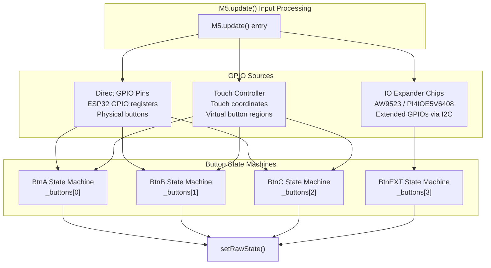
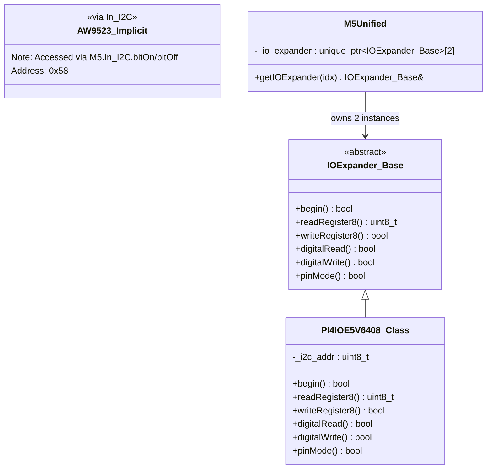
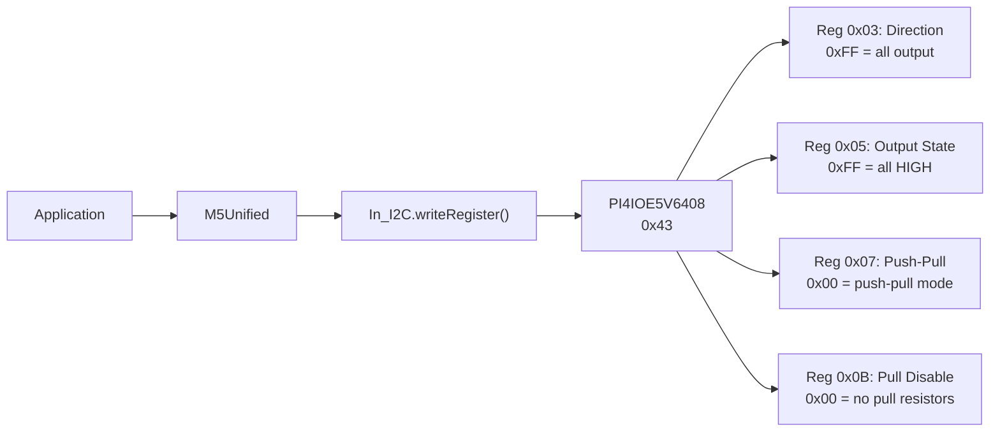
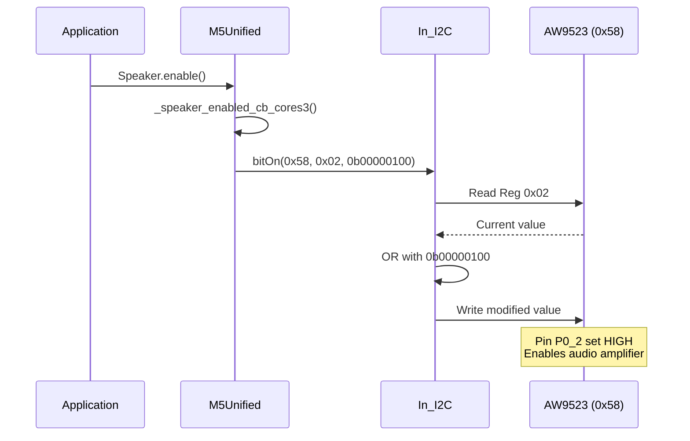
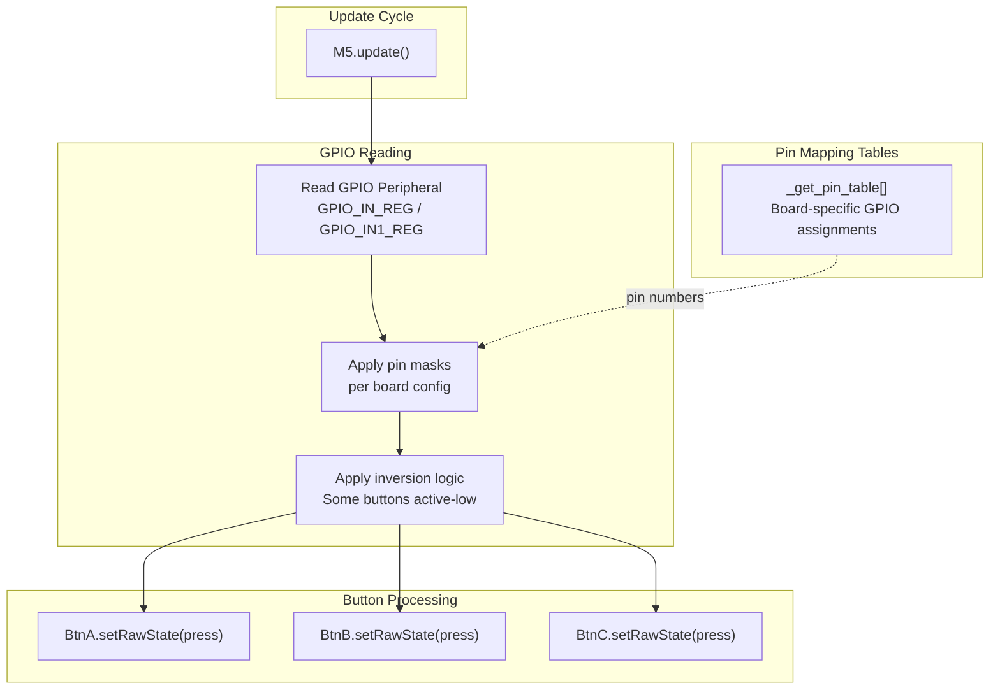
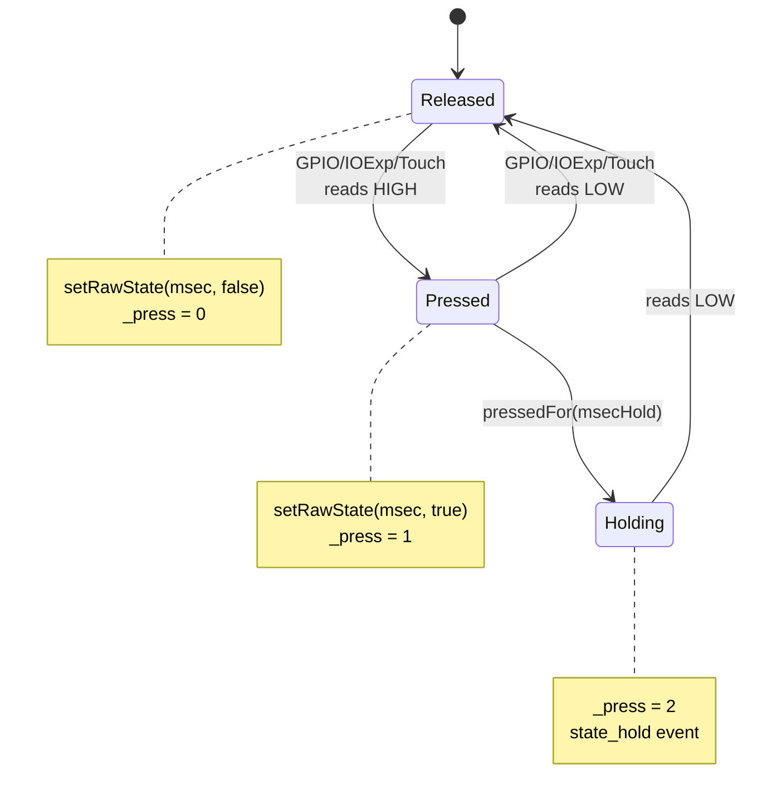
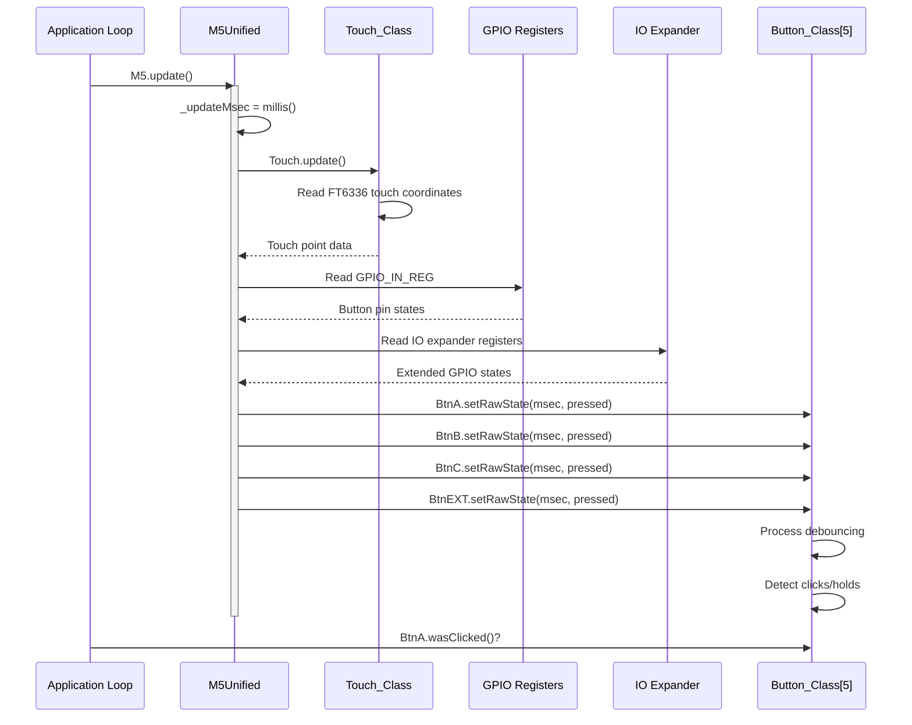
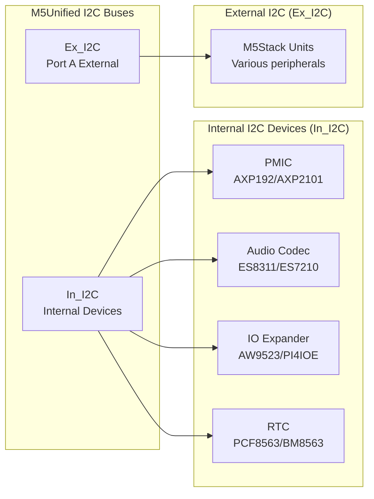

M5Unified GPIO and IO Expander Integration

# GPIO and IO Expander Integration

<details>
<summary>Relevant source files</summary>

The following files were used as context for generating this wiki page:

- [src/M5Unified.cpp](src/M5Unified.cpp)
- [src/M5Unified.hpp](src/M5Unified.hpp)
- [src/utility/Button_Class.cpp](src/utility/Button_Class.cpp)
- [src/utility/Button_Class.hpp](src/utility/Button_Class.hpp)

</details>


## Purpose and Scope

This document describes how M5Unified handles direct GPIO register reading and IO expander integration for input processing. These mechanisms provide the raw button state data that feeds into the button state machines. For details on button state processing and debouncing, see [Button System and State Machine](#5.1). For touch-based input, see [Touch Interface](#5.2).

The GPIO and IO expander system enables:
- Direct reading of physical GPIO pins for button detection
- Extended GPIO capabilities through I2C-connected IO expander chips
- Unified input aggregation from multiple hardware sources
- Board-specific input configurations without application code changes

---

## Input Source Architecture

M5Unified consolidates button inputs from three distinct hardware sources during each `M5.update()` cycle:



**Sources:** [src/M5Unified.cpp:1-3000](), [src/M5Unified.hpp:238-242](), [src/utility/Button_Class.hpp:41-61]()

---

## IOExpander Base Class Architecture

M5Unified provides an abstract base class for IO expander integration, allowing polymorphic access to different expander chips:



The `M5Unified` class maintains up to two IO expander instances accessible via `getIOExpander(0)` and `getIOExpander(1)`.

**Sources:** [src/M5Unified.hpp:609-618](), [src/utility/IOExpander_Base.hpp:1-100](), [src/M5Unified.cpp:7]()

---

## Supported IO Expander Chips

### PI4IOE5V6408

The PI4IOE5V6408 is an 8-bit I2C-controlled GPIO expander used on several M5Stack boards for extended button inputs and peripheral control.

| Property | Value |
|----------|-------|
| **I2C Address** | `0x43` |
| **Interface** | I2C (Internal Bus) |
| **GPIO Pins** | 8 bits |
| **Primary Use** | Extended button input (BtnEXT), amplifier enable |
| **Boards** | M5Tab5, M5AtomEcho |

**Configuration Register Operations:**



**Initialization Example (AtomicEcho):**

The following bulk write sequence initializes the PI4IOE for speaker control on M5AtomEcho:

```
Register 0x03 = 0xFF  // Set all pins as OUTPUT
Register 0x05 = 0xFF  // Set all outputs HIGH
Register 0x07 = 0x00  // Configure push-pull mode
Register 0x0B = 0x00  // Disable pull resistors
```

**Sources:** [src/M5Unified.cpp:371](), [src/M5Unified.cpp:582-592](), [src/utility/PI4IOE5V6408_Class.hpp:1-100]()

---

### AW9523

The AW9523 is a 16-bit I2C-controlled GPIO expander with LED driver capabilities, used primarily on M5StackCoreS3 for audio amplifier control.

| Property | Value |
|----------|-------|
| **I2C Address** | `0x58` |
| **Interface** | I2C (Internal Bus) |
| **GPIO Pins** | 16 bits (Port 0: P0_0-P0_7, Port 1: P1_0-P1_7) |
| **Primary Use** | Audio amplifier enable, LED control |
| **Boards** | M5StackCoreS3, M5StackCoreS3SE |

**Register Access Pattern:**

Unlike PI4IOE which uses the `IOExpander_Base` abstraction, AW9523 is accessed directly through `In_I2C` bit manipulation methods:



**Sources:** [src/M5Unified.cpp:376](), [src/M5Unified.cpp:426-443]()

---

## GPIO Register Reading

M5Unified reads physical GPIO button states directly from ESP32 GPIO peripheral registers during the update cycle. The exact implementation varies by board configuration but follows a consistent pattern.

### GPIO Input Flow



### Board-Specific GPIO Pin Assignments

The pin mapping tables defined in [src/M5Unified.cpp:73-326]() specify which GPIO pins are used for buttons on each board:

| Board | BtnA GPIO | BtnB GPIO | BtnC GPIO | Notes |
|-------|-----------|-----------|-----------|-------|
| M5Stack | GPIO_NUM_39 | GPIO_NUM_38 | GPIO_NUM_37 | Classic 3-button layout |
| M5StackCore2 | Touch zone | Touch zone | Touch zone | Virtual buttons via FT6336 |
| M5StickC | GPIO_NUM_37 | GPIO_NUM_39 | N/A | 2-button design |
| M5StickCPlus | GPIO_NUM_37 | GPIO_NUM_39 | N/A | 2-button design |
| M5AtomLite | GPIO_NUM_39 | N/A | N/A | Single physical button |
| M5AtomMatrix | GPIO_NUM_39 | N/A | N/A | Single physical button |
| M5StackCoreS3 | Touch zone | Touch zone | Touch zone | Virtual via FT6336U |

**Sources:** [src/M5Unified.cpp:73-116](), [src/M5Unified.cpp:328-348]()

---

## Integration with Button State Machine

Each button input source feeds raw pressed/released states into the `Button_Class` state machine via `setRawState()`:



### Debouncing and Raw State Processing

The `Button_Class::setRawState()` method at [src/utility/Button_Class.cpp:41-83]() implements debouncing:

1. **Raw State Tracking**: `_raw_press` stores the immediate GPIO/IOExp reading
2. **Debounce Delay**: Changes must persist for `_msecDebounce` (default 10ms)
3. **State Transitions**: Only debounced changes update `_press` and trigger state events
4. **Hold Detection**: After `_msecHold` (default 500ms), state transitions to holding

**Sources:** [src/utility/Button_Class.cpp:41-83](), [src/utility/Button_Class.hpp:57-58]()

---

## Board-Specific IO Expander Usage

### M5StackCoreS3 / CoreS3SE

Uses **AW9523** (0x58) for audio amplifier control. BtnEXT is not used; all buttons are touch-based.

**Amplifier Enable Sequence:**
```
1. In_I2C.bitOn(0x58, 0x02, 0b00000100)  // Enable AW88298 amplifier power
2. Configure AW88298 codec via I2C at 0x36
3. Speaker now operational
```

**Sources:** [src/M5Unified.cpp:417-446]()

---

### M5Tab5

Uses **PI4IOE5V6408** (0x43) for audio amplifier control and potentially extended button input.

**Amplifier Enable (ES8388 codec):**
```
1. Initialize ES8388 codec at 0x10
2. In_I2C.bitOn(0x43, 0x05, 0b00000010)  // AMP on via PI4IOE
```

**Sources:** [src/M5Unified.cpp:486-543]()

---

### M5AtomEcho

Uses **PI4IOE5V6408** (0x43) for speaker control and potentially BtnEXT input.

**Initialization Pattern:**
```
// Configure PI4IOE for output
0x03 = 0xFF  // Direction: all OUTPUT
0x05 = 0xFF  // Output: all HIGH (enables speaker)
0x07 = 0x00  // Push-pull mode
0x0B = 0x00  // Disable pulls

// Configure ES8311 codec at 0x18
[bulk register writes for audio configuration]
```

**Sources:** [src/M5Unified.cpp:563-603]()

---

### M5StackCoreInk

Uses **GPIO_NUM_5** for BtnEXT (external/top button) without an IO expander. This is a direct GPIO read case.

**GPIO Configuration:**
- BtnEXT: GPIO_NUM_5 (CoreInk top button)
- BtnPWR: GPIO_NUM_27 (Power button)

**Sources:** [src/M5Unified.cpp:967-968]()

---

## Update Cycle Integration

During each call to `M5.update()`, the input processing follows this sequence:



**Key Timing Constraints:**
- GPIO reads are near-instantaneous (register access)
- I2C reads to IO expanders take ~1-2ms at 400kHz
- Touch controller reads take ~2-5ms depending on I2C speed
- Total update cycle should complete in <10ms for responsive input

**Sources:** [src/M5Unified.cpp:2900-3000](), [src/utility/Button_Class.cpp:8-39]()

---

## IO Expander I2C Communication

### I2C Bus Selection

IO expanders always connect to the **Internal I2C bus** (`In_I2C`), not the external PortA I2C bus:



### I2C Addressing and Conflicts

The internal I2C bus must carefully manage address space to avoid conflicts:

| Address | Device | Boards |
|---------|--------|--------|
| 0x34 | AXP192 PMIC | M5StackCore2, M5StickC, M5StickCPlus |
| 0x36 | AW88298 Audio Amp | M5StackCoreS3 |
| 0x43 | PI4IOE5V6408 | M5Tab5, M5AtomEcho |
| 0x58 | AW9523 IO Expander | M5StackCoreS3 |
| 0x18 | ES8311 Audio Codec | Various boards with audio |
| 0x40 | ES7210 ADC | M5StackCoreS3 (microphone) |

**Sources:** [src/M5Unified.cpp:367-377](), [src/M5Unified.cpp:351-365]()

---

## Access Methods

### Direct I2C Access Pattern

For IO expanders like AW9523 that don't use the `IOExpander_Base` interface:

```cpp
// Enable a specific bit in a register
M5.In_I2C.bitOn(aw9523_i2c_addr, register, bitmask, freq);

// Disable a specific bit
M5.In_I2C.bitOff(aw9523_i2c_addr, register, bitmask, freq);

// Full register write
M5.In_I2C.writeRegister(aw9523_i2c_addr, register, data, len, freq);
```

### IOExpander_Base Interface

For PI4IOE5V6408:

```cpp
// Get expander instance (0 or 1)
auto& expander = M5.getIOExpander(0);

// Digital I/O operations
expander.pinMode(pin, mode);
expander.digitalWrite(pin, value);
bool state = expander.digitalRead(pin);

// Register-level access
expander.writeRegister8(register, value);
uint8_t val = expander.readRegister8(register);
```

**Sources:** [src/M5Unified.hpp:609](), [src/utility/IOExpander_Base.hpp:1-100]()

---

## Pin Mapping Retrieval

Applications can query GPIO pin assignments at runtime using `M5.getPin()`:

```cpp
// Get pin number for specific function
int8_t btn_a_pin = M5.getPin(m5::pin_name_t::port_a_pin1);
int8_t i2c_sda = M5.getPin(m5::pin_name_t::in_i2c_sda);
int8_t rgb_led = M5.getPin(m5::pin_name_t::rgb_led);

// Returns 255 if pin not available on current board
```

The `pin_name_t` enumeration includes:

| Name | Purpose |
|------|---------|
| `in_i2c_scl` / `in_i2c_sda` | Internal I2C bus pins |
| `ex_i2c_scl` / `ex_i2c_sda` | External I2C (Port A) |
| `port_a_pin1` / `port_a_pin2` | Port A GPIO pins |
| `port_b_pin1` / `port_b_pin2` | Port B GPIO pins |
| `rgb_led` | RGB LED data pin |
| `power_hold` | Power hold pin (some boards) |

**Sources:** [src/M5Unified.hpp:26-53](), [src/M5Unified.hpp:251]()