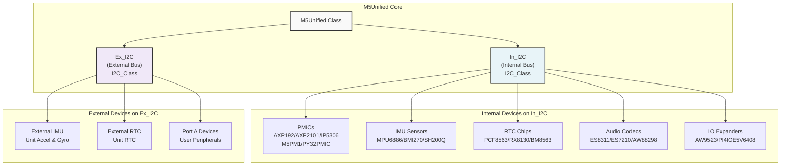
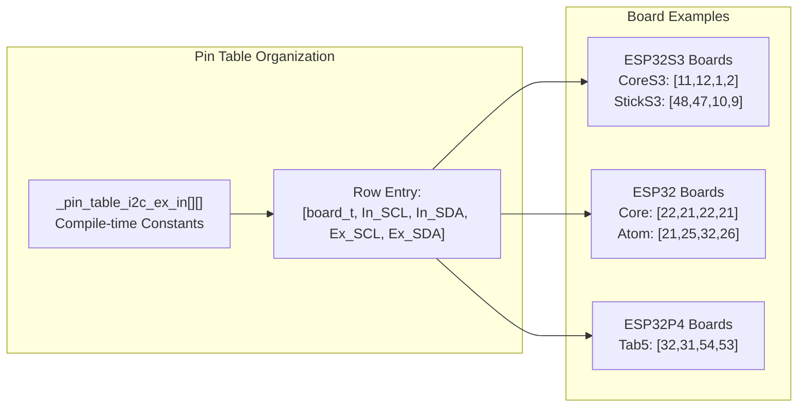
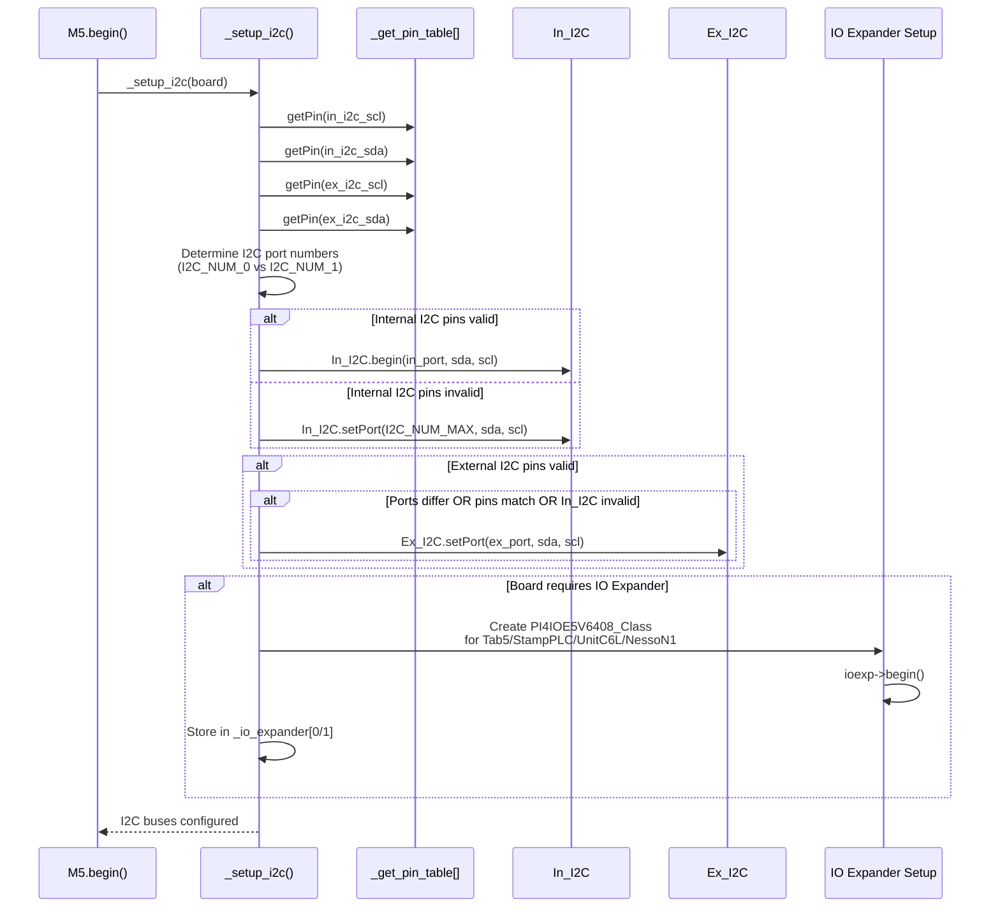
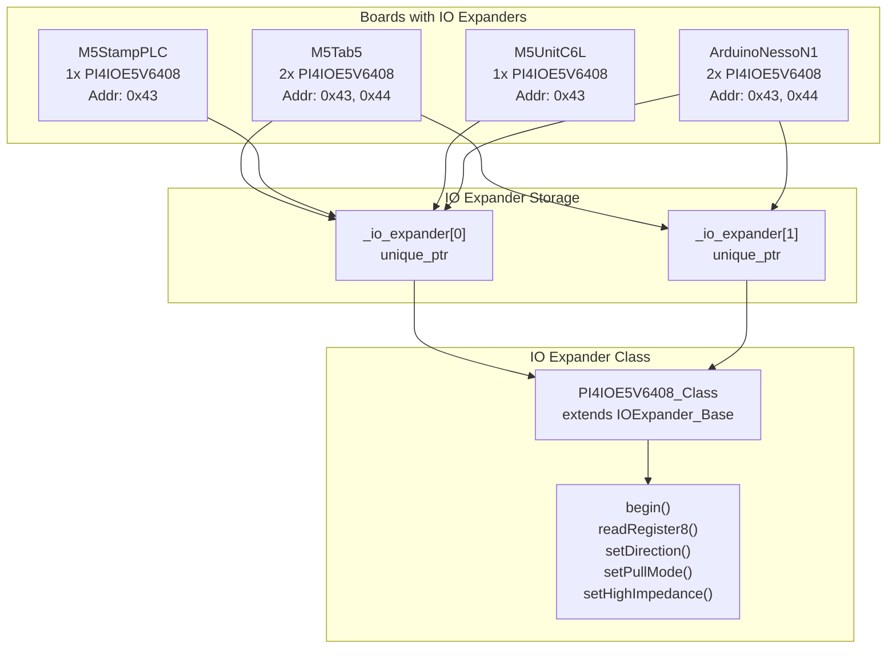
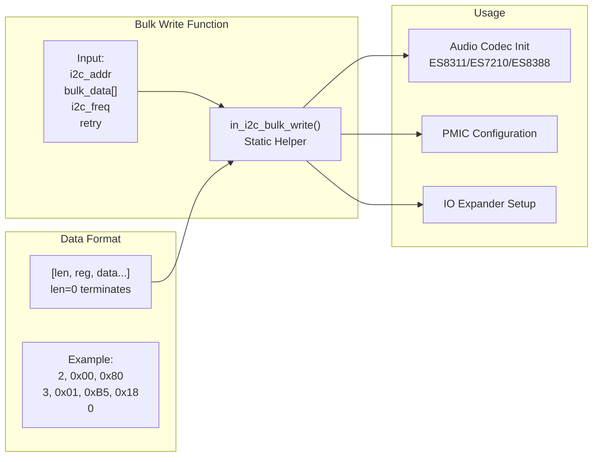
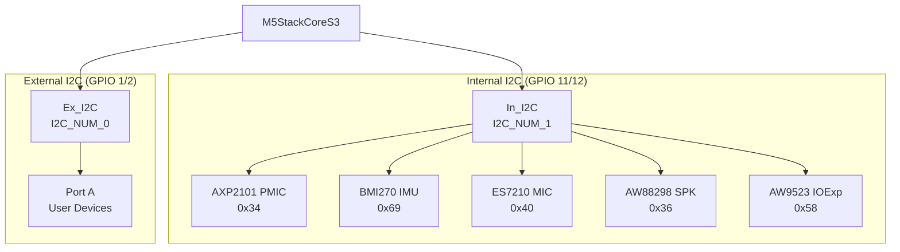
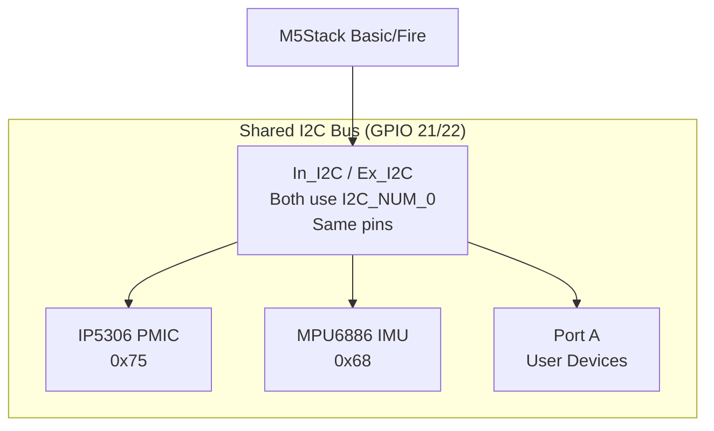
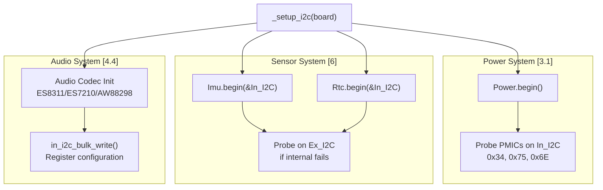

M5Unified I2C Bus Architecture

# I2C Bus Architecture

<details>
<summary>Relevant source files</summary>

The following files were used as context for generating this wiki page:

- [src/M5Unified.cpp](src/M5Unified.cpp)
- [src/M5Unified.hpp](src/M5Unified.hpp)

</details>


## Purpose and Scope

This document describes the dual I2C bus architecture in M5Unified, including the internal and external bus system, pin configuration, initialization sequence, and device mapping. The I2C buses serve as the primary communication interface for PMICs, sensors, audio codecs, and external peripherals.

For I2C device address mappings by board type, see [I2C Device Mapping](#7.2). For PMIC initialization details, see [PMIC Detection and Initialization](#3.1). For sensor integration, see [Sensor Integration](#6).

---

## Dual Bus System

M5Unified implements a dual I2C bus architecture to separate internal board peripherals from external devices:

- **In_I2C (Internal I2C)**: Communicates with on-board components (PMICs, IMUs, RTCs, audio codecs)
- **Ex_I2C (External I2C)**: Provides access to external peripherals via Port A or dedicated external ports

Both buses are exposed as public members in the `M5Unified` class [src/M5Unified.hpp:244-248]():

```cpp
/// for internal I2C device
I2C_Class& In_I2C = m5::In_I2C;

/// for external I2C device (Port.A)
I2C_Class& Ex_I2C = m5::Ex_I2C;
```

**Sources:** [src/M5Unified.hpp:244-248](), [src/M5Unified.cpp:1420-1495]()

---

## Bus Architecture Diagram



**Sources:** [src/M5Unified.cpp:1420-1495](), [src/M5Unified.hpp:244-248]()

---

## Pin Configuration Tables

I2C pin assignments vary by board type and are determined from compile-time lookup tables during initialization. The `_pin_table_i2c_ex_in` table defines SCL/SDA pins for both internal and external buses:

### Pin Table Structure



**Key pin configurations** [src/M5Unified.cpp:73-116]():

| Board | In_SCL | In_SDA | Ex_SCL | Ex_SDA |
|-------|--------|--------|--------|--------|
| M5StackCoreS3 | GPIO_NUM_11 | GPIO_NUM_12 | GPIO_NUM_1 | GPIO_NUM_2 |
| M5StickS3 | GPIO_NUM_48 | GPIO_NUM_47 | GPIO_NUM_10 | GPIO_NUM_9 |
| M5Stack | GPIO_NUM_22 | GPIO_NUM_21 | GPIO_NUM_22 | GPIO_NUM_21 |
| M5AtomLite | GPIO_NUM_21 | GPIO_NUM_25 | GPIO_NUM_32 | GPIO_NUM_26 |
| M5Tab5 | GPIO_NUM_32 | GPIO_NUM_31 | GPIO_NUM_54 | GPIO_NUM_53 |
| M5Cardputer | 255 (none) | 255 (none) | GPIO_NUM_1 | GPIO_NUM_2 |

**Sources:** [src/M5Unified.cpp:73-116]()

---

## I2C Initialization Sequence

The `_setup_i2c()` method configures both I2C buses during system initialization:



**Sources:** [src/M5Unified.cpp:1420-1495](), [src/M5Unified.cpp:328-348]()

---

## Port Assignment Logic

The system determines which ESP32 hardware I2C port to use based on the chip type and pin configuration:

### Port Selection Rules

[src/M5Unified.cpp:1431-1439]():

```cpp
i2c_port_t ex_port = I2C_NUM_0;
#if SOC_I2C_NUM == 1 || defined (CONFIG_IDF_TARGET_ESP32C6)
    i2c_port_t in_port = I2C_NUM_0;
#else
    i2c_port_t in_port = I2C_NUM_1;
    if (in_scl == ex_scl && in_sda == ex_sda) {
      in_port = ex_port;
    }
#endif
```

**Port assignment strategy:**

1. **Single-port chips (ESP32-C6)**: Both buses use `I2C_NUM_0`
2. **Dual-port chips (ESP32/ESP32-S3)**:
   - `Ex_I2C` defaults to `I2C_NUM_0`
   - `In_I2C` defaults to `I2C_NUM_1`
   - If internal and external pins are identical, both use `I2C_NUM_0` (shared bus mode)

**Sources:** [src/M5Unified.cpp:1431-1439]()

---

## Bus Initialization Details

### Internal Bus Configuration

[src/M5Unified.cpp:1440-1447]():

```cpp
if ((uint_fast8_t)in_scl < GPIO_NUM_MAX)
{
  In_I2C.begin(in_port, in_sda, in_scl);
}
else
{
  In_I2C.setPort(I2C_NUM_MAX, in_sda, in_scl);
}
```

- **Valid pins**: Call `In_I2C.begin()` to initialize hardware I2C
- **Invalid pins (255)**: Set port to `I2C_NUM_MAX` to disable the bus

### External Bus Configuration

[src/M5Unified.cpp:1449-1454]():

```cpp
if ((uint_fast8_t)ex_scl < GPIO_NUM_MAX)
{
  if ((in_port != ex_port) || (in_sda == ex_sda && in_scl == ex_scl) || ((uint_fast8_t)in_scl >= GPIO_NUM_MAX)) {
    Ex_I2C.setPort(ex_port, ex_sda, ex_scl);
  }
}
```

- External bus is configured only if:
  1. Pins are valid (`< GPIO_NUM_MAX`)
  2. Ports differ **OR** pins match internal **OR** internal bus is disabled

**Sources:** [src/M5Unified.cpp:1440-1454]()

---

## IO Expander Integration

Some boards require GPIO expansion via I2C IO expanders for button input and peripheral control:



**IO Expander setup** [src/M5Unified.cpp:1456-1493]():

- **M5Tab5 (ESP32-P4)**: Two expanders at 0x43 and 0x44
- **M5StampPLC (ESP32-S3)**: One expander at 0x43 for LCD backlight and buttons
- **M5UnitC6L / ArduinoNessoN1 (ESP32-C6)**: One or two expanders

The expanders are accessed via `M5.getIOExpander(index)` and used for:
- Button state reading
- LCD backlight control
- GPIO extension

**Sources:** [src/M5Unified.cpp:1456-1493](), [src/M5Unified.hpp:609]()

---

## I2C Device Categories

Devices are organized by function across the I2C buses:

### Internal Bus Devices

| Category | Devices | I2C Addresses | Purpose |
|----------|---------|---------------|---------|
| **PMICs** | AXP192, AXP2101, IP5306, M5PM1, PY32PMIC | 0x34, 0x75, 0x6E | Power management, battery monitoring, voltage rails |
| **IMUs** | MPU6886, BMI270, SH200Q, BMM150, AK8963 | 0x68, 0x69, 0x0C, 0x0D | Motion sensing, accelerometer, gyroscope, magnetometer |
| **RTCs** | PCF8563, RX8130, BM8563 | 0x51, 0x32 | Real-time clock, alarms, timers |
| **Audio Codecs** | ES8311, ES7210, ES8388, AW88298, NS4168 | 0x18, 0x19, 0x40, 0x36, 0x10 | Audio DAC/ADC, amplifiers, microphone preamps |
| **IO Expanders** | AW9523, PI4IOE5V6408 | 0x58, 0x43, 0x44 | GPIO expansion, button reading |
| **Special** | PowerHub Protocol | 0x50 | Custom power management system |

### External Bus Devices

- User-connected peripherals on Port A
- External IMU units
- External RTC modules
- Custom I2C devices

**Sources:** [src/M5Unified.cpp:367-377](), [src/M5Unified.cpp:1456-1493]()

---

## Bulk Write Helper Function

A helper function simplifies multi-register initialization for I2C devices:



**Implementation** [src/M5Unified.cpp:351-365]():

The function iterates through a compact byte array where:
- First byte = data length (including register address)
- Second byte = register address
- Remaining bytes = data to write
- Length of 0 terminates the sequence

**Example usage** [src/M5Unified.cpp:458-473]():
```cpp
static constexpr const uint8_t enabled_bulk_data[] = {
  2, 0x00, 0x80,  // 2 bytes: write 0x80 to register 0x00
  2, 0x01, 0xB5,  // 2 bytes: write 0xB5 to register 0x01
  2, 0x02, 0x18,  // 2 bytes: write 0x18 to register 0x02
  0               // Terminator
};
in_i2c_bulk_write(es8311_i2c_addr0, enabled_bulk_data, 100000, 3);
```

**Sources:** [src/M5Unified.cpp:351-365](), [src/M5Unified.cpp:458-473]()

---

## Board-Specific I2C Usage Examples

### CoreS3: Separate Internal/External Buses



### M5Stack: Shared Bus Configuration



**Note:** Original M5Stack uses the same GPIO pins for both buses, creating a shared bus configuration where internal and external devices coexist on the same hardware I2C port.

**Sources:** [src/M5Unified.cpp:106](), [src/M5Unified.cpp:1436-1438]()

---

## I2C Usage in System Components

The I2C buses are accessed throughout the system initialization:



**Key integration points:**

1. **Power Management** [3.1]: PMICs are probed via `In_I2C` to detect AXP192/AXP2101/IP5306
2. **IMU System** [6.1]: Sensors checked on internal bus first, then external if not found
3. **RTC System** [6.2]: Clock chips detected on internal bus, fallback to external
4. **Audio System** [4.4]: Codecs configured with bulk register writes via `In_I2C`

**Sources:** [src/M5Unified.cpp:1537](), [src/M5Unified.cpp:2306-2339]()

---

## Summary

M5Unified's dual I2C architecture provides:

- **Separation of concerns**: Internal components isolated from user peripherals
- **Board portability**: Pin tables support 19+ board types with automatic configuration
- **Flexible addressing**: Shared or separate hardware ports based on chip capabilities
- **Extended GPIO**: IO expanders integrated for boards requiring additional inputs
- **Unified interface**: Single `I2C_Class` abstraction used by all subsystems

The system automatically configures I2C buses during `M5.begin()`, with pin assignments determined from compile-time lookup tables and port selection logic that adapts to the ESP32 chip variant.

**Sources:** [src/M5Unified.cpp:1420-1495](), [src/M5Unified.cpp:73-116](), [src/M5Unified.hpp:244-248]()