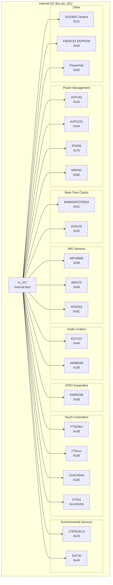
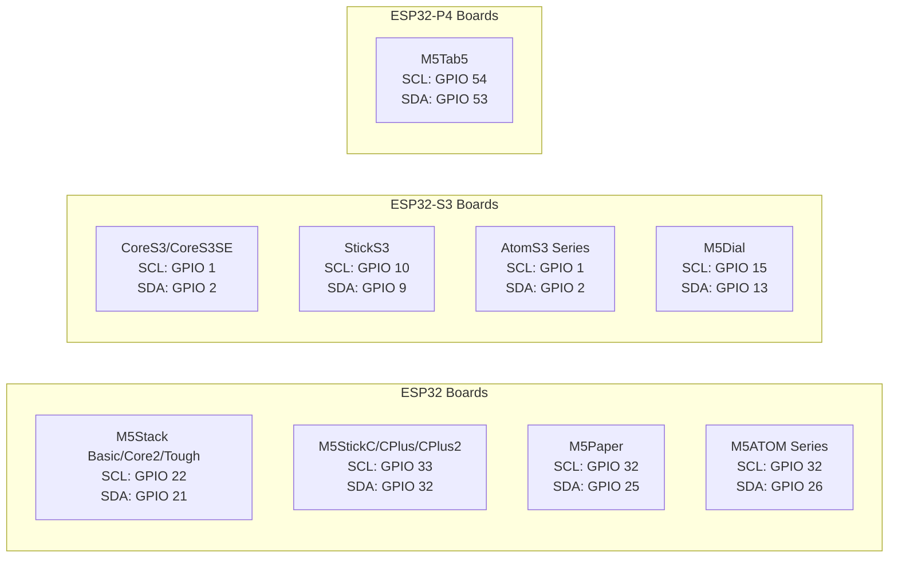
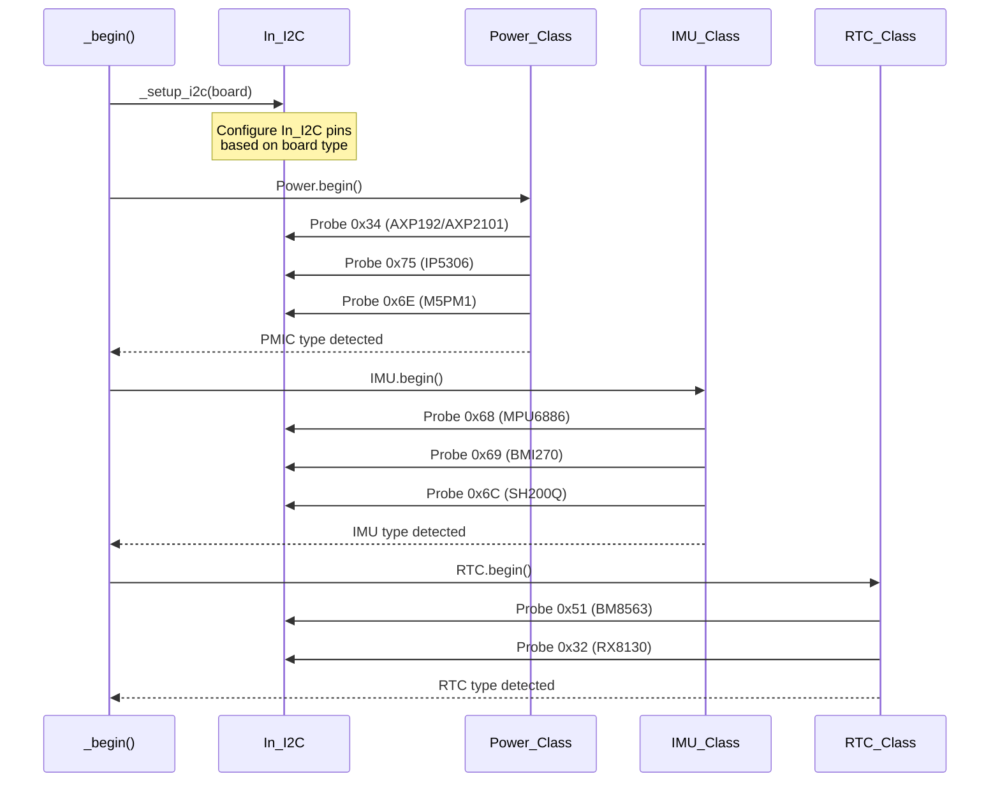

M5Unified I2C Device Mapping

# I2C Device Mapping

<details>
<summary>Relevant source files</summary>

The following files were used as context for generating this wiki page:

- [README.md](README.md)
- [examples/Basic/HowToUse/HowToUse.ino](examples/Basic/HowToUse/HowToUse.ino)
- [src/M5Unified.cpp](src/M5Unified.cpp)
- [src/M5Unified.hpp](src/M5Unified.hpp)

</details>


## Purpose and Scope

This document provides comprehensive I2C device address mappings for all supported M5Stack board types. It catalogs which devices are connected to the internal I2C bus (`In_I2C`) versus the external I2C bus (`Ex_I2C`/Port A), and documents the specific I2C addresses used by PMICs, sensors, audio codecs, GPIO expanders, and other peripherals.

For information about the I2C bus architecture and initialization, see [I2C Bus Architecture](#7.1). For general communication interface overview, see [Communication Interfaces](#7).

---

## I2C Device Address Constants

The M5Unified library defines I2C device addresses as compile-time constants for type safety and maintainability. These constants are used throughout the initialization and device callback functions.

### Audio Codec Addresses

| Constant | Address | Device | Boards Using |
|----------|---------|--------|--------------|
| `es7210_i2c_addr` | `0x40` | ES7210 4-channel ADC | CoreS3, Tab5 |
| `es8311_i2c_addr0` | `0x18` | ES8311 audio codec | AtomEcho, StickS3, Cardputer ADV, AtomEchoS3R |
| `es8311_i2c_addr1` | `0x19` | ES8311 (alternate) | (Unused in current boards) |
| `es8388_i2c_addr` | `0x10` | ES8388 audio codec | Tab5 |

### Power Management Addresses

| Constant | Address | Device | Boards Using |
|----------|---------|--------|--------------|
| `pm1_i2c_addr` | `0x6E` | M5PM1 PMIC protocol | StickS3 |
| `py32pmic_i2c_addr` | `0x6E` | PY32 PMIC | StickS3 |

### GPIO Expander Addresses

| Constant | Address | Device | Boards Using |
|----------|---------|--------|--------------|
| `pi4io1_i2c_addr` | `0x43` | PI4IOE5V6408 GPIO expander | Tab5, AtomEcho |
| `aw9523_i2c_addr` | `0x58` | AW9523B GPIO expander | CoreS3, CoreS3SE |

### Speaker/Amplifier Addresses

| Constant | Address | Device | Boards Using |
|----------|---------|--------|--------------|
| `aw88298_i2c_addr` | `0x36` | AW88298 audio amplifier | CoreS3, CoreS3SE |

### Miscellaneous Addresses

| Constant | Address | Device | Boards Using |
|----------|---------|--------|--------------|
| `powerhub_i2c_addr` | `0x50` | PowerHub device | PowerHub |

**Sources:** [src/M5Unified.cpp:367-377]()

---

## Internal I2C Bus (In_I2C) Device Mapping

The internal I2C bus connects to on-board peripherals including PMICs, IMUs, RTCs, audio codecs, and GPIO expanders. Pin assignments for `In_I2C` vary by board type and are configured during `_setup_i2c()`.



**Diagram: Internal I2C Bus Device Topology**

**Sources:** [README.md:407-423](), [src/M5Unified.cpp:367-377]()

---

## Board-Specific Internal I2C Mappings

### ESP32 Boards

| Board | PMIC | RTC | IMU | Touch | Audio | GPIO Exp | Other |
|-------|------|-----|-----|-------|-------|----------|-------|
| **M5Stack Basic/Gray/GO/Fire** | IP5306 (0x75) | — | MPU6886 (0x68) or SH200Q (0x6C) | — | — | — | — |
| **M5Stack Core2** | AXP192 (0x34) | BM8563 (0x51) | MPU6886 (0x68, Ext) | FT6336U (0x38) | — | — | — |
| **M5Stack Tough** | AXP192 (0x34) | BM8563 (0x51) | — | CHSC6540 (0x2E) | — | — | — |
| **M5StickC/CPlus** | AXP192 (0x34) | BM8563 (0x51) | MPU6886 (0x68) or SH200Q (0x6C) | — | — | — | — |
| **M5StickCPlus2** | AXP2101 (0x34) | BM8563 (0x51) | MPU6886 (0x68) | — | — | — | — |
| **M5Stack CoreInk** | — | BM8563 (0x51) | — | — | — | — | — |
| **M5Paper** | — | BM8563 (0x51) | — | GT911 (0x14/0x5D) | — | — | SHT30 (0x44), FM24C02 (0x50) |
| **M5Station** | AXP192 (0x34) | BM8563 (0x51) | MPU6886 (0x68, opt) | — | — | — | INA3221 (0x40/0x41, opt) |
| **M5ATOM Matrix** | — | — | MPU6886 (0x68) | — | — | — | — |

**Sources:** [README.md:407-423]()

### ESP32-S3 Boards

| Board | PMIC | RTC | IMU | Touch | Audio Codec | Speaker Amp | GPIO Exp | Other |
|-------|------|-----|-----|-------|-------------|-------------|----------|-------|
| **M5Stack CoreS3/SE** | AXP2101 (0x34) | BM8563 (0x51) | BMI270 (0x69) | FT5xxx (0x38) | ES7210 (0x40) | AW88298 (0x36) | AW9523B (0x58) | LTR553ALS (0x23), GC0308 (0x21) |
| **M5StickS3** | PY32 PMIC (0x6E) | — | — | — | ES8311 (0x18) | — | — | — |
| **M5ATOMS3/S3Lite** | — | — | — | — | — | — | — | — |
| **M5ATOMS3U** | — | — | — | — | — | — | — | — |
| **M5ATOMS3R/S3RCam/S3RExt** | — | — | IMU varies | — | — | — | — | — |
| **M5AtomEchoS3R** | — | — | — | — | ES8311 (0x18) | — | — | — |
| **M5Dial** | — | BM8563 (0x51) | — | FT3168 (varies) | — | — | — | — |
| **M5Capsule** | — | — | — | — | ES8311 (0x18) | — | — | — |
| **M5Cardputer** | — | — | — | — | — | — | — | Keyboard matrix |
| **M5CardputerADV** | — | — | — | — | ES8311 (0x18) | — | — | — |
| **M5PowerHub** | Custom (0x50) | — | — | — | — | — | — | — |
| **M5PaperS3** | — | BM8563 (0x51) | — | — | — | — | — | — |

**Sources:** [README.md:407-423](), [src/M5Unified.cpp:367-390]()

### ESP32-P4 Boards

| Board | PMIC | RTC | IMU | Touch | Audio Codec | Speaker Amp | GPIO Exp | Other |
|-------|------|-----|-----|-------|-------------|-------------|----------|-------|
| **M5Tab5** | Custom | RX8130 (0x32) | — | Touch varies | ES7210 (0x40), ES8388 (0x10) | — | PI4IOE (0x43) | — |

**Sources:** [README.md:407-423](), [src/M5Unified.cpp:486-543]()

---

## External I2C Bus (Ex_I2C / Port A) Device Mapping

The external I2C bus is exposed on Port A connectors and is used for connecting external units and modules. The bus is configured with pull-up resistors and is accessible to user applications via `M5.Ex_I2C`.

### Pin Assignments by Board



**Diagram: External I2C (Port A) Pin Assignments**

**Sources:** [src/M5Unified.cpp:73-116]()

### Common External Devices

External devices connect via Port A and are detected at runtime:

| Device Type | I2C Address | Example Units |
|-------------|-------------|---------------|
| **External RTC** | 0x51 (BM8563), 0x32 (RX8130) | Unit RTC |
| **External IMU** | 0x68 (MPU6886), 0x69 (BMI270) | Unit IMU |
| **Display Units** | 0x3C, 0x3D (SSD1306) | Unit OLED, Unit Mini OLED |
| **Environmental** | 0x76, 0x77 (BME680) | Unit ENV |
| **Generic I2C** | User-defined | Custom units |

**Sources:** [README.md:108-110]()

---

## Device Detection and Probing

M5Unified uses I2C probing during initialization to detect connected hardware and automatically configure the appropriate drivers.



**Diagram: I2C Device Detection Sequence**

**Sources:** [src/M5Unified.cpp:971-1436]()

### PMIC Detection Priority

PMICs are detected in the following order during `Power.begin()`:

1. **AXP192/AXP2101** (0x34) - Checked first for Core2, CoreS3, StickC series
2. **IP5306** (0x75) - Checked for original M5Stack Basic/Gray/GO/Fire
3. **M5PM1/PY32** (0x6E) - Checked for StickS3
4. **ADC-based** - Fallback for boards without PMIC

**Sources:** See [Power Management System](#3) documentation for complete PMIC detection logic.

### IMU Detection Priority

IMUs are detected with board-specific default addresses:

1. **BMI270** (0x69) - Primary for CoreS3
2. **MPU6886** (0x68) - Primary for most boards
3. **SH200Q** (0x6C) - Legacy devices (older StickC lots)

**Sources:** See [IMU System and Calibration](#6.1) documentation for complete IMU detection logic.

---

## Audio Device Initialization

Audio codecs and amplifiers require specific I2C initialization sequences sent via `in_i2c_bulk_write()`.

### ES8311 Codec (0x18)

Used by: AtomEcho, StickS3, CardputerADV, AtomEchoS3R

**Speaker Enable Sequence:**
```
Register 0x00: 0x80  // RESET, CSM POWER ON
Register 0x01: 0xB5  // CLOCK_MANAGER, MCLK=BCLK
Register 0x02: 0x18  // CLOCK_MANAGER, MULT_PRE=3
Register 0x0D: 0x01  // SYSTEM, Power up analog circuitry
Register 0x12: 0x00  // SYSTEM, power-up DAC
Register 0x13: 0x10  // SYSTEM, Enable output to HP drive
Register 0x32: 0xBF/0xFF  // DAC volume
Register 0x37: 0x08  // DAC, Bypass DAC equalizer
```

**Microphone Enable Sequence:**
```
Register 0x00: 0x80  // RESET, CSM POWER ON
Register 0x01: 0xBA  // CLOCK_MANAGER, MCLK=BCLK
Register 0x02: 0x18  // CLOCK_MANAGER, MULT_PRE=3
Register 0x0D: 0x01  // SYSTEM, Power up analog circuitry
Register 0x0E: 0x02  // SYSTEM, Enable analog PGA, ADC modulator
Register 0x14: 0x10  // ADC_REG14, select Mic1p-Mic1n, PGA GAIN
Register 0x17: 0xFF/0xBF  // ADC_VOLUME
Register 0x1C: 0x6A  // ADC_REG1C, Equalizer bypass, DC offset cancel
```

**Sources:** [src/M5Unified.cpp:567-577](), [src/M5Unified.cpp:705-730](), [src/M5Unified.cpp:797-823]()

### ES7210 ADC (0x40)

Used by: CoreS3, Tab5

Initialization includes reset, clock configuration, digital power-down register setup, ADC oversampling, mode configuration, analog system setup, microphone bias and gain configuration.

**Sources:** [src/M5Unified.cpp:625-668](), [src/M5Unified.cpp:885-933]()

### ES8388 Codec (0x10)

Used by: Tab5

Full-duplex audio codec requiring chip power, I2S format, DAC/ADC volume, digital click-free power management, and channel mixing configuration.

**Sources:** [src/M5Unified.cpp:495-531]()

### AW88298 Amplifier (0x36)

Used by: CoreS3, CoreS3SE

Smart audio amplifier with dynamic sample rate configuration. Register 0x06 value is calculated based on sample rate, with boost mode control and volume settings.

**Sources:** [src/M5Unified.cpp:378-382](), [src/M5Unified.cpp:417-446]()

### AW9523B GPIO Expander (0x58)

Used by: CoreS3, CoreS3SE

Provides additional GPIO for speaker enable control and other functions. Controlled via bit operations on register 0x02.

**Sources:** [src/M5Unified.cpp:426](), [src/M5Unified.cpp:443]()

---

## I2C Address Collision Handling

Some boards use the same I2C address for different device types on different buses:

| Address | Internal Bus Device | External Bus Device |
|---------|---------------------|---------------------|
| 0x50 | FM24C02 EEPROM (M5Paper), PowerHub | External device possible |
| 0x40 | ES7210 ADC (CoreS3) | INA3221 (M5Station opt) |
| 0x51 | BM8563 RTC (internal) | BM8563 RTC (external unit) |
| 0x68 | MPU6886 IMU (internal) | MPU6886 IMU (external unit) |

The dual I2C bus architecture (`In_I2C` vs `Ex_I2C`) prevents address collisions by segregating internal and external devices onto separate buses.

**Sources:** [src/M5Unified.cpp:73-116](), [README.md:407-423]()

---

## Temporary I2C Bus Switching

Some devices (particularly on AtomEcho variants) require temporary I2C bus switching to access peripherals on non-standard pins:

```cpp
// AtomEcho uses GPIO 38/39 for I2C to ES8311
m5gfx::i2c::i2c_temporary_switcher_t backup_i2c_setting(1, GPIO_NUM_38, GPIO_NUM_39);
in_i2c_bulk_write(es8311_i2c_addr0, enabled_bulk_data);
backup_i2c_setting.restore();
```

This pattern is used in:
- `_speaker_enabled_cb_atomic_echo()` - GPIO 38/39
- `_microphone_enabled_cb_atomic_echo()` - GPIO 38/39
- `_microphone_enabled_cb_atom_echos3r()` - GPIO 45/0
- `_speaker_enabled_cb_atom_echos3r()` - GPIO 45/0
- `_microphone_enabled_cb_sticks3()` - GPIO 47/48

**Sources:** [src/M5Unified.cpp:595-601](), [src/M5Unified.cpp:722-728](), [src/M5Unified.cpp:755-757](), [src/M5Unified.cpp:782](), [src/M5Unified.cpp:819]()

---

## Summary Reference Tables

### Complete I2C Address Registry

| Address | Device(s) | Bus | Boards |
|---------|-----------|-----|--------|
| 0x10 | ES8388 audio codec | Internal | Tab5 |
| 0x14 | GT911 touch (alt) | Internal | M5Paper |
| 0x18 | ES8311 codec | Internal | AtomEcho, StickS3, CardputerADV, AtomEchoS3R |
| 0x19 | ES8311 (alt address) | Internal | (Unused) |
| 0x21 | GC0308 camera | Internal | CoreS3 |
| 0x23 | LTR553ALS light sensor | Internal | CoreS3 |
| 0x2E | CHSC6540 touch | Internal | Tough |
| 0x32 | RX8130 RTC | Internal/External | Tab5, Unit RTC |
| 0x34 | AXP192/AXP2101 PMIC | Internal | Core2, CoreS3, StickC series, Station |
| 0x36 | AW88298 amplifier | Internal | CoreS3, CoreS3SE |
| 0x38 | FT6336U/FT5xxx touch | Internal | Core2, CoreS3 |
| 0x40 | ES7210 ADC / INA3221 | Internal | CoreS3, Tab5, Station(opt) |
| 0x41 | INA3221 (alt) | Internal | Station (opt) |
| 0x43 | PI4IOE5V6408 GPIO exp | Internal | Tab5, AtomEcho |
| 0x44 | SHT30 environmental | Internal | M5Paper |
| 0x50 | FM24C02 EEPROM / PowerHub | Internal | M5Paper, PowerHub |
| 0x51 | BM8563/PCF8563 RTC | Internal/External | Most boards, Unit RTC |
| 0x58 | AW9523B GPIO expander | Internal | CoreS3, CoreS3SE |
| 0x5D | GT911 touch (alt) | Internal | M5Paper |
| 0x68 | MPU6886 IMU | Internal/External | Most boards, Unit IMU |
| 0x69 | BMI270 IMU | Internal | CoreS3 |
| 0x6C | SH200Q IMU | Internal | Older StickC, M5Stack lots |
| 0x6E | M5PM1/PY32 PMIC | Internal | StickS3 |
| 0x75 | IP5306 PMIC | Internal | M5Stack Basic/Gray/GO/Fire |

**Sources:** [src/M5Unified.cpp:367-377](), [README.md:407-423]()

---

## Related Documentation

- [I2C Bus Architecture](#7.1) - I2C bus initialization and configuration
- [Power Management System](#3) - PMIC detection and initialization
- [IMU System and Calibration](#6.1) - IMU detection and setup
- [Real-Time Clock System](#6.2) - RTC detection and initialization
- [Audio System Architecture](#4) - Audio codec configuration
- [Board Detection and Hardware Identification](#2.2) - Runtime board detection