M5Unified I2S Configuration and Driver Abstraction

# I2S Configuration and Driver Abstraction

<details>
<summary>Relevant source files</summary>

The following files were used as context for generating this wiki page:

- [examples/Advanced/Mic_FFT/Mic_FFT.ino](examples/Advanced/Mic_FFT/Mic_FFT.ino)
- [src/utility/Mic_Class.cpp](src/utility/Mic_Class.cpp)
- [src/utility/Mic_Class.hpp](src/utility/Mic_Class.hpp)
- [src/utility/Speaker_Class.cpp](src/utility/Speaker_Class.cpp)
- [src/utility/Speaker_Class.hpp](src/utility/Speaker_Class.hpp)

</details>


## Purpose and Scope

This document describes the I2S (Inter-IC Sound) peripheral configuration and driver abstraction layer in M5Unified's audio system. It covers how the library provides a unified interface across multiple ESP-IDF versions and ESP32 variants while handling low-level I2S hardware setup, clock generation, and pin configuration.

For information about the higher-level audio playback and mixing system, see [Speaker Interface and Multi-Channel Mixing](#4.2). For microphone signal processing and recording, see [Microphone Interface and Signal Processing](#4.3). For board-specific audio codec initialization, see [Board-Specific Audio Configuration](#4.4).

---

## ESP-IDF Version Abstraction Strategy

M5Unified supports multiple ESP-IDF versions by detecting the API version at compile time and providing conditional compilation paths. This abstraction is critical because ESP-IDF 5.0+ introduced a completely redesigned I2S driver API.

### Version Detection Logic

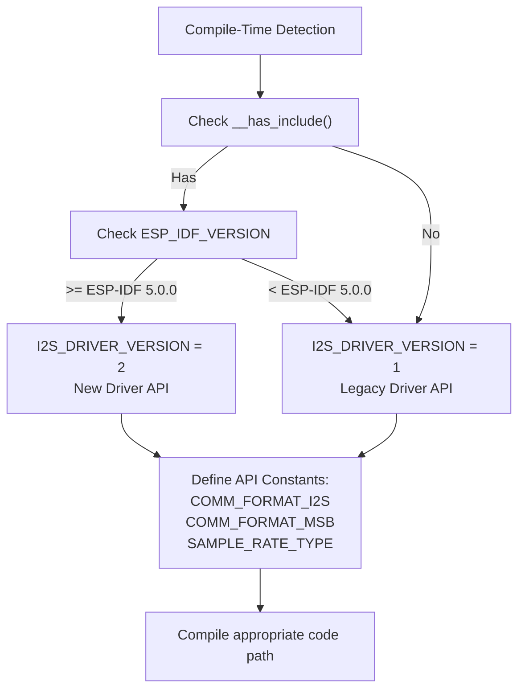

**Sources:** [src/utility/Speaker_Class.cpp:10-72](), [src/utility/Mic_Class.cpp:8-82]()

### Key Macro Definitions

| Macro | Purpose | Values |
|-------|---------|--------|
| `I2S_DRIVER_VERSION` | Selects driver implementation | `1` (legacy) or `2` (new) |
| `COMM_FORMAT_I2S` | I2S standard format constant | `I2S_COMM_FORMAT_I2S` or `I2S_COMM_FORMAT_STAND_I2S` |
| `COMM_FORMAT_MSB` | MSB-first format constant | `I2S_COMM_FORMAT_I2S_MSB` or `I2S_COMM_FORMAT_STAND_MSB` |
| `SAMPLE_RATE_TYPE` | Sample rate data type | `int` or `uint32_t` |
| `NON_BREAK` | C++17 fallthrough attribute | Empty or `[[fallthrough]]` |

The version detection uses multiple checks:
- `__has_include(<esp_idf_version.h>)` - Verify IDF header availability
- `ESP_IDF_VERSION_MAJOR` - Check major version number
- `__has_include(<driver/i2s_std.h>)` - Detect new driver API presence

**Sources:** [src/utility/Speaker_Class.cpp:48-72](), [src/utility/Mic_Class.cpp:55-82]()

---

## Configuration Structures

### Speaker Configuration

The `speaker_config_t` structure defines all parameters for I2S audio output:

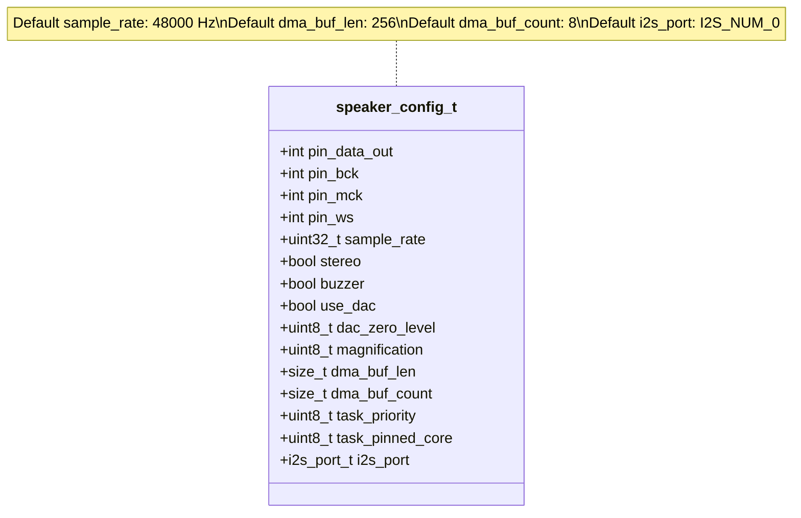

**Pin Configuration Fields:**
- `pin_data_out`: I2S data output pin (DOUT/SD)
- `pin_bck`: Bit clock pin (BCLK/SCK)
- `pin_ws`: Word select pin (LRCLK/WS)
- `pin_mck`: Master clock pin (optional, -1 if unused)

**Audio Format Fields:**
- `sample_rate`: Output sampling rate in Hz (default: 48000)
- `stereo`: `true` for stereo output, `false` for mono

**Special Modes:**
- `buzzer`: Use 1-bit delta-sigma PWM for piezo buzzer output
- `use_dac`: Use internal DAC (ESP32 only, GPIO 25/26 only, requires `I2S_NUM_0`)
- `dac_zero_level`: DAC offset level (0 = dynamic adjustment)

**DMA Configuration:**
- `dma_buf_len`: Length of each DMA buffer (max 1024)
- `dma_buf_count`: Number of DMA buffers

**Sources:** [src/utility/Speaker_Class.hpp:33-80]()

### Microphone Configuration

The `mic_config_t` structure defines parameters for I2S audio input:

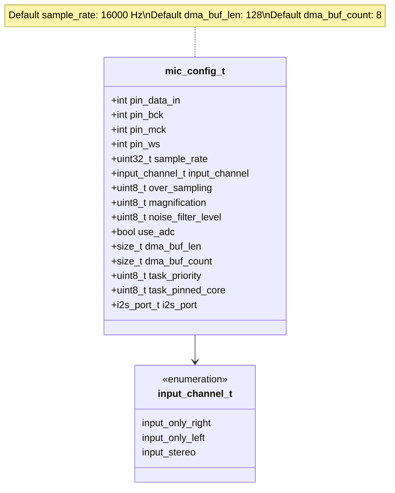

**Signal Processing Fields:**
- `over_sampling`: Oversampling factor for averaging (1-8, default: 2)
- `magnification`: Input gain multiplier (default: 16)
- `noise_filter_level`: IIR filter coefficient for noise reduction (0-255, default: 0)

**Channel Selection:**
- `input_only_right` (0): Capture only right channel
- `input_only_left` (1): Capture only left channel
- `input_stereo` (2): Capture both channels

**Special Modes:**
- `use_adc`: Use analog input via ADC (ESP32 only)
- When `pin_bck < 0` and `pin_ws < 0`: Automatically use PDM mode

**Sources:** [src/utility/Mic_Class.hpp:42-96]()

---

## Clock Configuration and Sample Rate Generation

The I2S peripheral requires precise clock generation to achieve accurate sample rates. M5Unified uses fractional dividers to minimize sample rate error.

### PLL Clock Sources by Platform

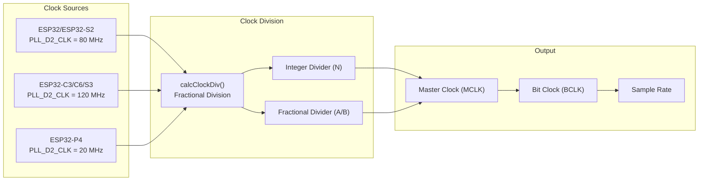

**Platform-Specific Clock Sources:**

| Platform | Base Clock | Constant Definition |
|----------|------------|---------------------|
| ESP32, ESP32-S2 | 80 MHz | `PLL_D2_CLK = 80*1000*1000` |
| ESP32-C3, ESP32-C6, ESP32-S3 | 120 MHz | `PLL_D2_CLK = 120*1000*1000` |
| ESP32-P4 | 20 MHz | `PLL_D2_CLK = 20*1000*1000` |

**Sources:** [src/utility/Speaker_Class.cpp:381-387](), [src/utility/Mic_Class.cpp:431-437]()

### Clock Divider Calculation Algorithm

The `calcClockDiv()` function computes optimal fractional divider values to achieve the target frequency with minimal error:

**Formula:**
```
Target Frequency = Base Clock / (N + B/A)
```

Where:
- `N`: Integer divider (2-255)
- `A`: Fractional denominator (1-63)
- `B`: Fractional numerator (0 to A-1)

**Algorithm Flow:**

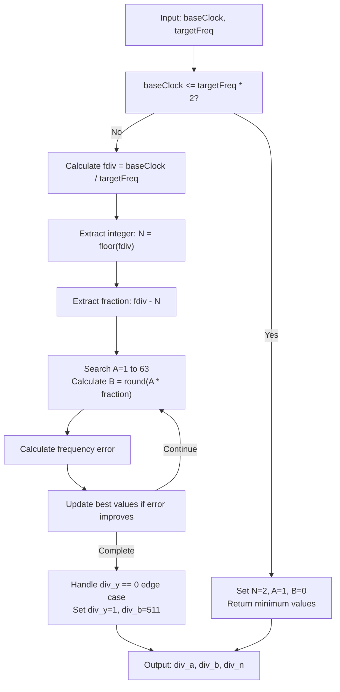

The algorithm performs an exhaustive search across all possible `A` values to find the combination that minimizes frequency error. It includes a workaround for the hardware bug where `div_y == 0` causes the fractional component to be ignored.

**Sources:** [src/utility/Speaker_Class.cpp:300-351](), [src/utility/Mic_Class.cpp:419-421]()

### Actual Sample Rate Computation

After configuring the dividers, the actual achieved sample rate differs slightly from the requested rate:

```
Actual Sample Rate = (PLL_D2_CLK * SAMPLERATE_MUL) / 
                     ((div_b * div_m * bits) / div_a + (div_n * div_m * bits))
```

Where:
- `div_m`: BCLK divider (typically 8 for MCLK devices, 32/bits otherwise)
- `bits`: Bits per sample (16 for standard I2S, 1 for DAC, 64 for PDM)
- `SAMPLERATE_MUL`: Scaling factor (256) for precision

**Sources:** [src/utility/Speaker_Class.cpp:388-400](), [src/utility/Mic_Class.cpp:443-447]()

---

## I2S Driver Initialization Flow

### Driver Version Branching

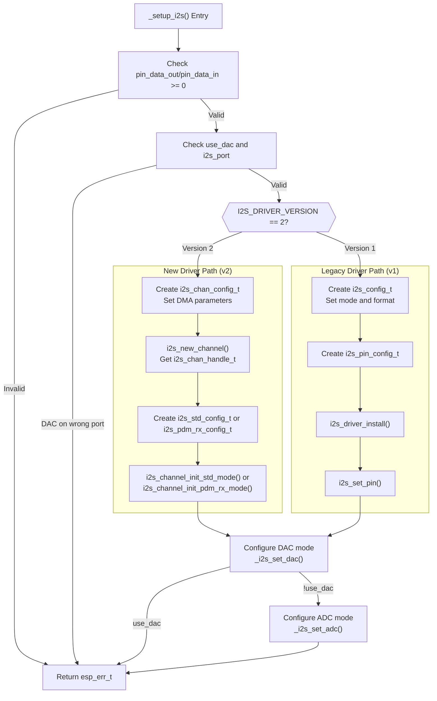

**Sources:** [src/utility/Speaker_Class.cpp:186-298](), [src/utility/Mic_Class.cpp:298-417]()

### New Driver API (ESP-IDF 5.0+)

**Channel Configuration:**

The new API uses a handle-based approach with separate transmit and receive channels:

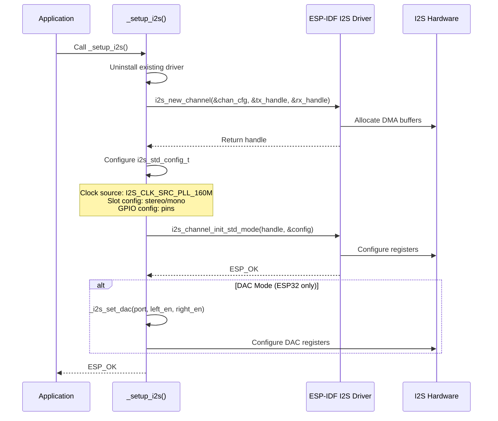

**Key Structures:**

- `i2s_chan_config_t`: DMA configuration with `dma_desc_num`, `dma_frame_num`, `auto_clear`
- `i2s_std_config_t`: Standard I2S mode with clock, slot, and GPIO configuration
- `i2s_pdm_rx_config_t`: PDM mode for microphones (if `pin_bck < 0`)

**Sources:** [src/utility/Speaker_Class.cpp:194-243](), [src/utility/Mic_Class.cpp:301-368]()

### Legacy Driver API (ESP-IDF < 5.0)

**Direct Configuration:**

The legacy API uses port-based configuration:

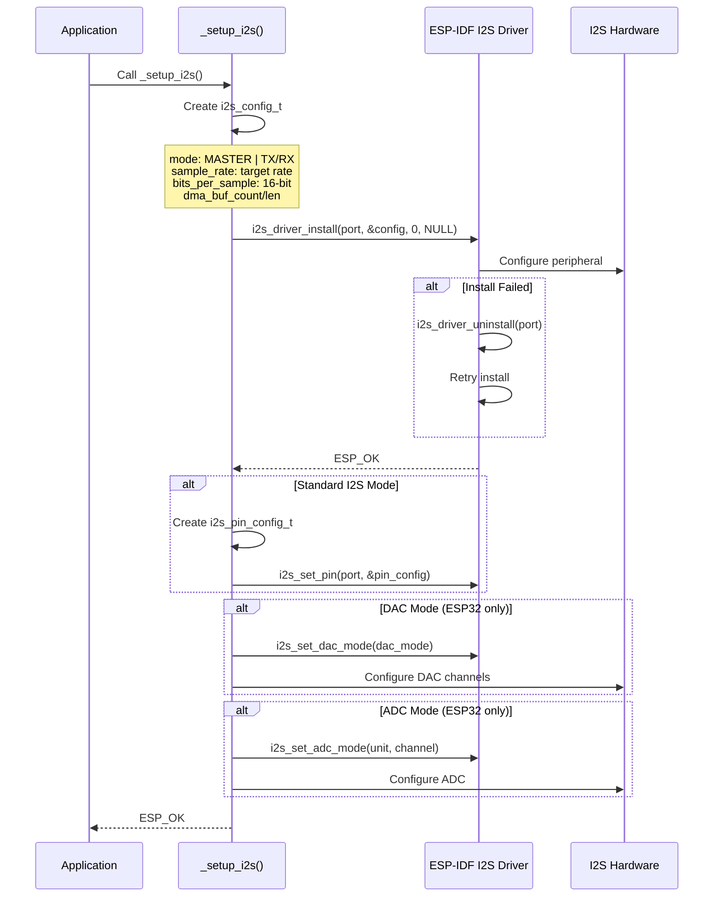

**Sources:** [src/utility/Speaker_Class.cpp:244-296](), [src/utility/Mic_Class.cpp:370-416]()

### Handle Management

For the new driver API, M5Unified maintains a global array of channel handles:

```c++
static i2s_chan_handle_t _i2s_handle[SOC_I2S_NUM] = { nullptr, };
```

This allows multiple subsystems to check if an I2S port is in use and prevents double-initialization.

**Sources:** [src/utility/Speaker_Class.cpp:84](), [src/utility/Mic_Class.cpp:92]()

---

## Pin Mapping and GPIO Configuration

### I2S Pin Roles

```mermaid
graph LR
    subgraph "ESP32 I2S Peripheral"
        MCLK["MCLK (Master Clock)<br/>Optional<br/>Typically 128x or 256x sample rate"]
        BCLK["BCLK (Bit Clock)<br/>Required<br/>Bits per sample × channels × sample rate"]
        WS["WS (Word Select / LRCLK)<br/>Required<br/>Toggles each sample<br/>Low=Left, High=Right"]
        DIN["DIN (Data In)<br/>For microphone/ADC"]
        DOUT["DOUT (Data Out)<br/>For speaker/DAC"]
    end
    
    subgraph "External Device"
        Codec["Audio Codec<br/>or<br/>I2S Microphone<br/>or<br/>DAC/ADC"]
    end
    
    MCLK -.->|"Optional clock reference"| Codec
    BCLK <-->|"Bit synchronization"| Codec
    WS <-->|"Channel selection"| Codec
    DIN <--|"Audio samples in"| Codec
    DOUT -->|"Audio samples out"| Codec
    
    style MCLK stroke-dasharray: 5 5
```

**Pin Assignment Rules:**

| Pin | Speaker | Microphone | Required | Notes |
|-----|---------|------------|----------|-------|
| DOUT | ✓ | | Yes | Cannot be -1 for speaker |
| DIN | | ✓ | Yes | Cannot be -1 for microphone |
| BCLK | ✓ | ✓ | Usually | Can be -1 for PDM mode on mic |
| WS | ✓ | ✓ | Usually | Can be -1 for PDM mode on mic, doubles as PDM clock |
| MCLK | ✓ | ✓ | No | Some codecs require this for clock reference |

**Sources:** [src/utility/Speaker_Class.cpp:227-230](), [src/utility/Mic_Class.cpp:325-327, 353-357]()

### GPIO Constraints

**DAC Mode (ESP32 only):**
- Only `GPIO_NUM_25` (right channel, DAC channel 1)
- Only `GPIO_NUM_26` (left channel, DAC channel 2)
- Must use `I2S_NUM_0` (I2S port 1 does not support DAC)

**ADC Mode (ESP32 only):**
- ADC1: GPIO 32-39
- ADC2: GPIO 0, 2, 4, 12-15, 25-27

**General I2S:**
- Any GPIO can be used for BCLK, WS, MCLK, DOUT, DIN
- Avoid input-only GPIOs (34-39 on ESP32) for output pins

**Sources:** [src/utility/Speaker_Class.cpp:190-193, 234-241](), [src/utility/Mic_Class.cpp:134-219, 239-293]()

---

## Special Hardware Modes

### DAC Mode (ESP32 Only)

The ESP32's internal DAC can be used for audio output without external hardware.

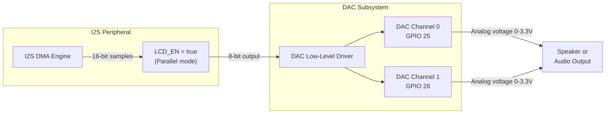

**Configuration Steps:**

1. **Power Management:**
   - Enable DAC power with `dac_ll_power_on(channel)`
   - Configure RTC GPIO mode
   - Disable pull-up/pull-down resistors

2. **Register Configuration:**
   - Set `I2S0.conf2.lcd_en = true` (enables parallel/LCD mode)
   - Configure `I2S0.conf.tx_right_first = false`
   - Set bit shift and sync parameters

3. **Data Format:**
   - I2S outputs 16-bit stereo data
   - Upper 8 bits go to DAC
   - Lower 8 bits ignored
   - Unsigned format: 0x0000 = 0V, 0xFF00 = 3.3V

**Dynamic Zero-Level Adjustment:**

When `dac_zero_level == 0`, M5Unified dynamically adjusts the DC offset to minimize DAC output noise:

- During silence: Gradually reduce DC offset toward zero
- During playback: Set offset to maximum amplitude to prevent clipping
- Benefits: Reduces hiss/noise when no audio is playing

**Sources:** [src/utility/Speaker_Class.cpp:107-143, 164-183, 234-241, 534-549, 563-570, 593-600, 802-837]()

### ADC Mode (ESP32 Only)

The ESP32 can capture audio using the internal ADC via I2S DMA.

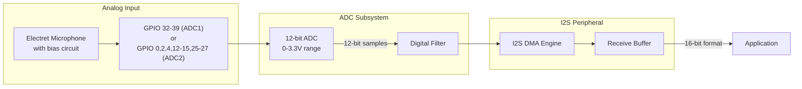

**Configuration Steps:**

1. **ADC Unit Selection:**
   - GPIO 32-39 use ADC1
   - GPIO 0, 2, 4, 12-15, 25-27 use ADC2
   - Map GPIO to ADC channel using lookup table

2. **ADC Parameters:**
   - Set attenuation: `ADC_ATTEN_DB_12` (0-2.6V range)
   - Set width: `ADC_WIDTH_BIT_12` (12-bit resolution)
   - Configure sample rate and FSM timing

3. **Register Configuration:**
   - Set `I2S0.conf2.lcd_en = true`
   - Configure RX channel mode
   - Set FIFO mode for proper data alignment

4. **Data Format:**
   - 12-bit ADC values in 16-bit container
   - Center value: 2048 (1.3V input)
   - Subtract 2048 to get signed audio data

**Sources:** [src/utility/Mic_Class.cpp:113-220, 238-293, 361-366, 404-413, 620-623]()

### PDM Mode (Microphone)

PDM (Pulse Density Modulation) microphones are common in M5Stack devices. PDM mode is automatically enabled when `pin_bck < 0`.

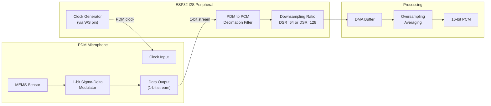

**Configuration for New Driver API:**

```c++
i2s_pdm_rx_config_t i2s_config;
i2s_config.clk_cfg.clk_src = I2S_CLK_SRC_PLL_160M;
i2s_config.clk_cfg.sample_rate_hz = sample_rate;
i2s_config.slot_cfg.slot_mode = I2S_SLOT_MODE_MONO;
i2s_config.slot_cfg.slot_mask = left_channel ? I2S_PDM_SLOT_LEFT : I2S_PDM_SLOT_RIGHT;
i2s_config.gpio_cfg.clk = (gpio_num_t)_cfg.pin_ws;  // PDM clock
i2s_config.gpio_cfg.din = (gpio_num_t)_cfg.pin_data_in;
```

**Configuration for Legacy Driver API:**

```c++
i2s_config.mode = I2S_MODE_MASTER | I2S_MODE_RX | I2S_MODE_PDM;
i2s_config.communication_format = I2S_COMM_FORMAT_STAND_PCM_SHORT;
dev->pdm_conf.rx_sinc_dsr_16_en = 1;  // DSR=128
dev->pdm_conf.pdm2pcm_conv_en = 1;
dev->pdm_conf.rx_pdm_en = 1;
```

**Clock Configuration:**

For PDM mode, the clock divider calculation uses `bits = 64` (DSR ratio) instead of 16, and `div_m = 2` for the clock divider.

**Sources:** [src/utility/Mic_Class.cpp:310-329, 392-395, 429, 446, 462-463, 528-534]()

---

## Platform-Specific Implementation Details

### Register Access Differences

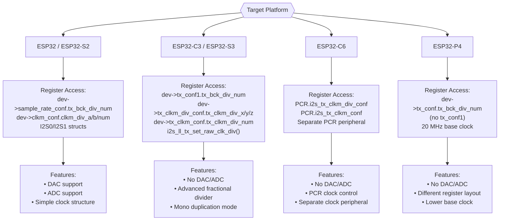

**Sources:** [src/utility/Speaker_Class.cpp:402-489](), [src/utility/Mic_Class.cpp:449-547]()

### Clock Register Programming

**ESP32 / ESP32-S2:**

```c++
dev->sample_rate_conf.tx_bck_div_num = div_m;
dev->clkm_conf.clkm_div_a = div_a;
dev->clkm_conf.clkm_div_b = div_b;
dev->clkm_conf.clkm_div_num = div_n;
dev->clkm_conf.clka_en = 0;  // PLL_160M
```

**ESP32-C3 / ESP32-S3:**

```c++
dev->tx_conf1.tx_bck_div_num = div_m - 1;

// Calculate fractional components with yn1 optimization
bool yn1 = (div_b > (div_a >> 1));
if (yn1) { div_b = div_a - div_b; }
int div_x = div_b ? (div_a / div_b - 1) : 0;
int div_y = div_b ? (div_a % div_b) : 1;

// Handle div_y == 0 hardware bug
if (div_y == 0) { div_y = 1; div_b = 511; }

i2s_ll_tx_set_raw_clk_div(dev, div_n, div_x, div_y, div_b, yn1);
```

**ESP32-C6:**

```c++
PCR.i2s_tx_clkm_div_conf.i2s_tx_clkm_div_x = div_x;
PCR.i2s_tx_clkm_div_conf.i2s_tx_clkm_div_y = div_y;
PCR.i2s_tx_clkm_div_conf.i2s_tx_clkm_div_z = div_b;
PCR.i2s_tx_clkm_div_conf.i2s_tx_clkm_div_yn1 = yn1;
PCR.i2s_tx_clkm_conf.i2s_tx_clkm_div_num = div_n;
PCR.i2s_tx_clkm_conf.i2s_tx_clkm_sel = 1;  // PLL_240M_CLK
```

**Sources:** [src/utility/Speaker_Class.cpp:422-489](), [src/utility/Mic_Class.cpp:474-525]()

### Mono Duplication Mode

ESP32-C3, C6, and S3 support automatic mono-to-stereo duplication:

```c++
// For mono output on stereo-capable hardware
if (!stereo && !use_dac && !buzzer) {
    dev->tx_conf.tx_mono = 1;
    dev->tx_conf.tx_chan_equal = 1;
}
```

This sends the same mono sample to both left and right channels, eliminating the need for software duplication.

**Sources:** [src/utility/Speaker_Class.cpp:414-419]()

---

## Wrapper Functions and Unified Interface

M5Unified provides wrapper functions that present a consistent interface regardless of the underlying driver version.

### Operation Wrapper Functions

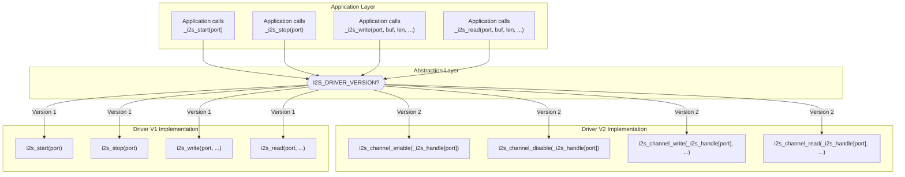

### Wrapper Function Implementations

**For New Driver API (v2):**

```c++
static i2s_chan_handle_t _i2s_handle[SOC_I2S_NUM] = { nullptr, };

static esp_err_t _i2s_start(i2s_port_t port) {
    if (_i2s_handle[port] == nullptr) { return ESP_FAIL; }
    return i2s_channel_enable(_i2s_handle[port]);
}

static esp_err_t _i2s_stop(i2s_port_t port) {
    if (_i2s_handle[port] == nullptr) { return ESP_OK; }
    return i2s_channel_disable(_i2s_handle[port]);
}

static esp_err_t _i2s_write(i2s_port_t port, void* buf, size_t len, 
                             size_t* result, TickType_t tick) {
    return i2s_channel_write(_i2s_handle[port], buf, len, result, tick);
}

static esp_err_t _i2s_read(i2s_port_t port, void* buf, size_t len,
                            size_t* result, TickType_t tick) {
    return i2s_channel_read(_i2s_handle[port], buf, len, result, tick);
}
```

**For Legacy Driver API (v1):**

```c++
static esp_err_t _i2s_start(i2s_port_t port) {
    return i2s_start(port);
}

static esp_err_t _i2s_stop(i2s_port_t port) {
    return i2s_stop(port);
}

static esp_err_t _i2s_write(i2s_port_t port, void* buf, size_t len,
                             size_t* result, TickType_t tick) {
    return i2s_write(port, buf, len, result, tick);
}

static esp_err_t _i2s_read(i2s_port_t port, void* buf, size_t len,
                            size_t* result, TickType_t tick) {
    return i2s_read(port, buf, len, result, tick);
}
```

**Sources:** [src/utility/Speaker_Class.cpp:84-106, 146-184](), [src/utility/Mic_Class.cpp:90-112, 221-237]()

### Driver Uninstall

The `_i2s_driver_uninstall()` function also has version-specific implementations:

**New Driver API:**

```c++
static esp_err_t _i2s_driver_uninstall(i2s_port_t port) {
    if (_i2s_handle[port] != nullptr) {
        auto res = i2s_del_channel(_i2s_handle[port]);
        _i2s_handle[port] = nullptr;
        return res;
    }
    return ESP_OK;
}
```

**Legacy Driver API:**

```c++
static esp_err_t _i2s_driver_uninstall(i2s_port_t port) {
    return i2s_driver_uninstall(port);
}
```

This wrapper approach allows the rest of the audio system code (in `spk_task` and `mic_task`) to remain identical across ESP-IDF versions, with all version-specific logic isolated to these wrapper functions.

**Sources:** [src/utility/Speaker_Class.cpp:98-106, 159-162](), [src/utility/Mic_Class.cpp:104-112, 234-237]()

---

## Task Integration

The I2S configuration functions are called from the audio processing tasks:

- **Speaker:** `Speaker_Class::spk_task()` calls `_setup_i2s()` via `begin()` [src/utility/Speaker_Class.cpp:912-946]()
- **Microphone:** `Mic_Class::mic_task()` receives pre-configured I2S from `begin()` [src/utility/Mic_Class.cpp:708-745]()

The tasks then use the wrapper functions (`_i2s_start`, `_i2s_write`, `_i2s_read`, etc.) for all I2S operations during runtime, ensuring consistent behavior across different hardware platforms and ESP-IDF versions.

**Sources:** [src/utility/Speaker_Class.cpp:356-910](), [src/utility/Mic_Class.cpp:422-706]()