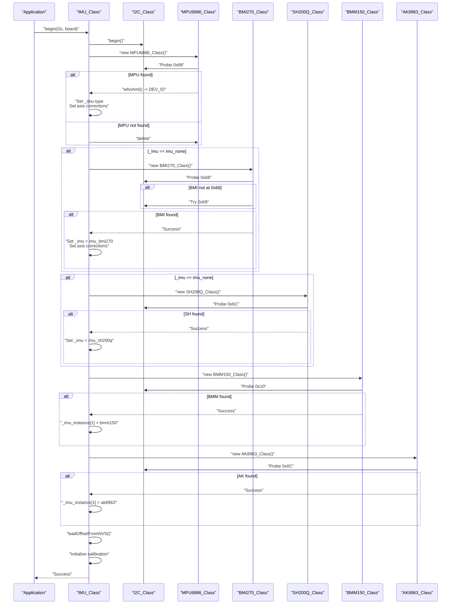
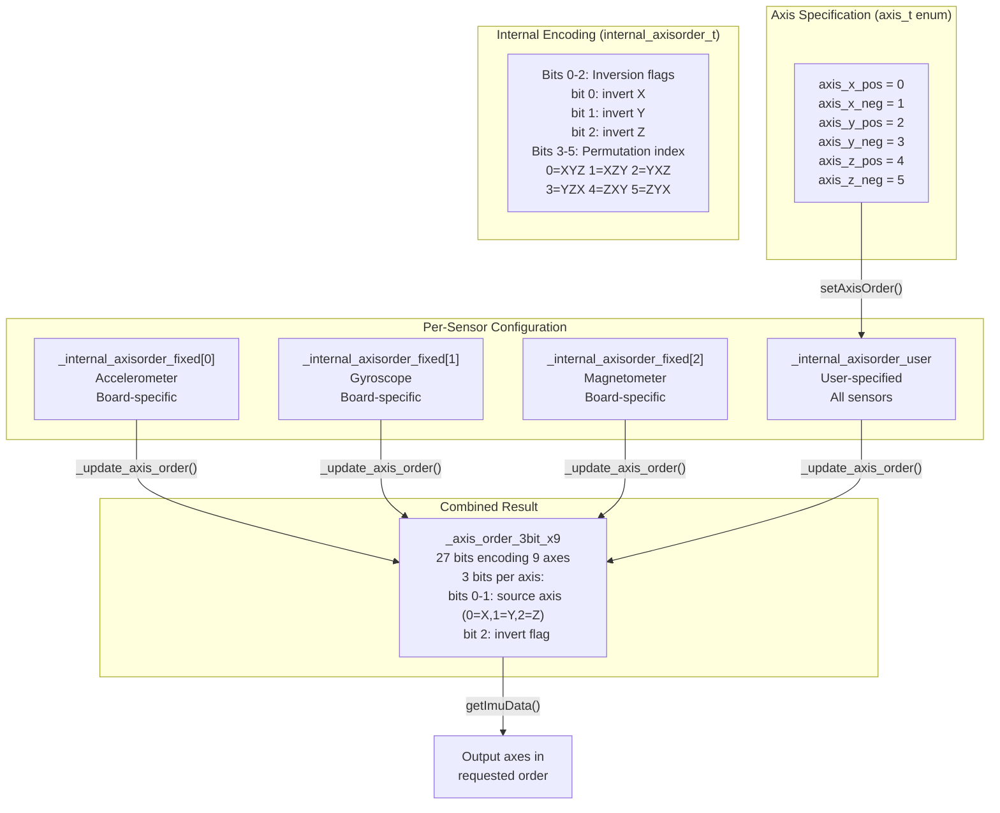
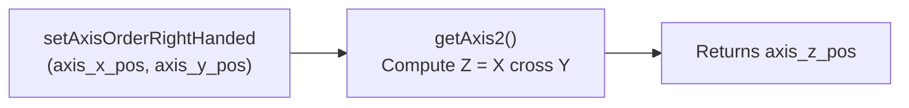
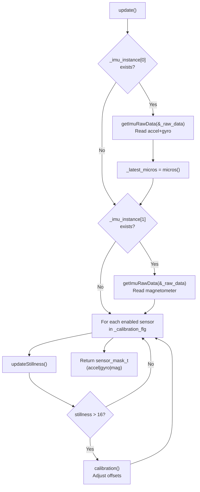
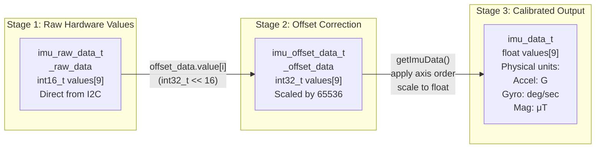
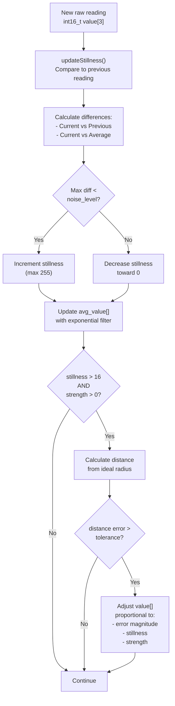
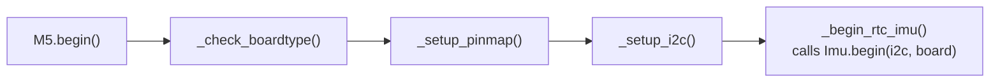

M5Unified IMU System and Calibration

# IMU System and Calibration

<details>
<summary>Relevant source files</summary>

The following files were used as context for generating this wiki page:

- [src/utility/IMU_Class.cpp](src/utility/IMU_Class.cpp)
- [src/utility/IMU_Class.hpp](src/utility/IMU_Class.hpp)

</details>


## Purpose and Scope

This document covers the `IMU_Class` system in M5Unified, which provides a unified interface for accessing inertial measurement unit (IMU) sensors across different M5Stack hardware. The system abstracts multiple IMU chip implementations (MPU6886, BMI270, SH200Q) and magnetometer chips (BMM150, AK8963), handles board-specific axis orientation differences, and provides automatic offset calibration with persistent storage.

For real-time clock integration, see [RTC System](#6.2). For general sensor integration overview, see [Sensor Integration](#6).

**Sources:** [src/utility/IMU_Class.hpp:1-268](), [src/utility/IMU_Class.cpp:1-597]()

---

## Architecture Overview

The IMU system uses a polymorphic driver architecture where `IMU_Class` owns up to two `IMU_Base` instances: one for accelerometer+gyroscope (index 0) and one for magnetometer (index 1). This design accommodates boards where these sensors are physically separate chips.

```mermaid
graph TB
    M5Unified["M5Unified"]
    IMU_Class["IMU_Class<br/>Orchestrator"]
    
    subgraph "IMU Instances (unique_ptr array)"
        Instance0["_imu_instance[0]<br/>Accel + Gyro"]
        Instance1["_imu_instance[1]<br/>Magnetometer"]
    end
    
    IMU_Base["IMU_Base<br/>Abstract Interface"]
    
    subgraph "Accel+Gyro Implementations"
        MPU6886["MPU6886_Class<br/>M5Stack Core"]
        BMI270["BMI270_Class<br/>CoreS3/Newer"]
        SH200Q["SH200Q_Class<br/>M5StickC"]
    end
    
    subgraph "Magnetometer Implementations"
        BMM150["BMM150_Class<br/>External chip"]
        AK8963["AK8963_Class<br/>MPU9250 internal"]
    end
    
    subgraph "Data Flow"
        RawData["_raw_data<br/>imu_raw_data_t"]
        OffsetData["_offset_data<br/>imu_offset_data_t"]
        ConvertParam["_convert_param<br/>imu_convert_param_t"]
        ImuData["imu_data_t<br/>Calibrated floats"]
    end
    
    subgraph "Persistence"
        NVS["NVS Storage<br/>9 keys: ax,ay,az,gx,gy,gz,mx,my,mz"]
    end
    
    M5Unified -->|"owns"| IMU_Class
    IMU_Class -->|"owns"| Instance0
    IMU_Class -->|"owns"| Instance1
    
    Instance0 -.->|"points to"| IMU_Base
    Instance1 -.->|"points to"| IMU_Base
    
    IMU_Base <|-- MPU6886
    IMU_Base <|-- BMI270
    IMU_Base <|-- SH200Q
    IMU_Base <|-- BMM150
    IMU_Base <|-- AK8963
    
    Instance0 -->|"getImuRawData"| RawData
    Instance1 -->|"getImuRawData"| RawData
    RawData -->|"apply offsets"| OffsetData
    ConvertParam -->|"scale to float"| ImuData
    OffsetData -->|"save/load"| NVS
```

**Sources:** [src/utility/IMU_Class.hpp:212-213](), [src/utility/IMU_Class.cpp:28-179]()

---

## Supported IMU Hardware

The system supports five IMU types identified by the `imu_t` enumeration:

| IMU Type | Enum Value | Sensors | Typical Boards | I2C Address |
|----------|-----------|---------|----------------|-------------|
| MPU6050 | `imu_mpu6050` | Accel + Gyro | Older devices | 0x68 |
| MPU6886 | `imu_mpu6886` | Accel + Gyro | M5Stack Core, StickC | 0x68 |
| MPU9250 | `imu_mpu9250` | Accel + Gyro + Mag | M5Stack Gray | 0x68 |
| SH200Q | `imu_sh200q` | Accel + Gyro | M5StickC (some) | 0x6C |
| BMI270 | `imu_bmi270` | Accel + Gyro | CoreS3, AtomS3 | 0x68/0x69 |

Additional magnetometer chips can be detected separately:

| Magnetometer | Class | Typical Configuration | I2C Address |
|--------------|-------|----------------------|-------------|
| BMM150 | `BMM150_Class` | External on M5Stack Core | 0x10 |
| AK8963 | `AK8963_Class` | Internal to MPU9250 | 0x0C |

**Sources:** [src/utility/IMU_Class.hpp:13-21](), [src/utility/IMU_Class.cpp:14-18]()

---

## Initialization and Hardware Detection

### Detection Sequence

The `begin()` method implements a sequential probe strategy, attempting to detect IMU hardware in priority order:



**Sources:** [src/utility/IMU_Class.cpp:28-179]()

### Board-Specific Axis Corrections

Different M5Stack boards mount IMU chips in different physical orientations. The system applies board-specific axis transformations stored in `_internal_axisorder_fixed[]`:

| Board | Sensor | Correction | Code Location |
|-------|--------|-----------|---------------|
| M5AtomMatrix | Accel/Gyro | Invert X, Invert Z | [src/utility/IMU_Class.cpp:65-69]() |
| CoreS3 (BMI270 @ 0x69) | Magnetometer | Invert Y, Invert Z | [src/utility/IMU_Class.cpp:90-93]() |
| AtomS3R series | Accel/Gyro | Swap X↔Y, Invert Y | [src/utility/IMU_Class.cpp:94-99]() |
| AtomS3R series | Magnetometer | Invert X, Invert Z | [src/utility/IMU_Class.cpp:94-99]() |
| M5Stack + BMM150 | Magnetometer | Invert X, Invert Z | [src/utility/IMU_Class.cpp:124-128]() |
| MPU9250 + AK8963 | Magnetometer | Swap X↔Y, Invert Z | [src/utility/IMU_Class.cpp:140-143]() |

**Sources:** [src/utility/IMU_Class.cpp:64-145](), [src/utility/IMU_Class.hpp:244-263]()

---

## Axis Ordering System

### Coordinate System Representation

The axis ordering system allows applications to specify their preferred coordinate frame while the hardware may be mounted in any orientation. The system uses a compact 27-bit encoding (`_axis_order_3bit_x9`) to represent axis transformations for all nine values (3 axes × 3 sensors).



**Sources:** [src/utility/IMU_Class.hpp:244-263](), [src/utility/IMU_Class.cpp:258-294]()

### Axis Order Configuration API

Three methods configure axis ordering:

| Method | Parameters | Behavior |
|--------|-----------|----------|
| `setAxisOrder()` | `axis_t axis0, axis_t axis1, axis_t axis2` | Explicitly specify all three axes |
| `setAxisOrderRightHanded()` | `axis_t axis0, axis_t axis1` | Specify two axes, compute third using right-hand rule |
| `setAxisOrderLeftHanded()` | `axis_t axis0, axis_t axis1` | Specify two axes, compute third using left-hand rule |

The right-hand/left-hand convenience methods compute the third axis automatically:



**Sources:** [src/utility/IMU_Class.hpp:95-101](), [src/utility/IMU_Class.cpp:239-316]()

---

## Data Acquisition

### Update Cycle

The `update()` method polls hardware sensors and updates internal state. It returns a `sensor_mask_t` bitmask indicating which sensors provided new data:



**Sources:** [src/utility/IMU_Class.cpp:394-435]()

### Data Structures

The system uses a three-stage data pipeline:



The `imu_data_t` structure provides both array and named field access:

```cpp
struct imu_data_t {
    uint32_t usec;           // Timestamp from _latest_micros
    union {
        float value[9];      // Array access: [0-2]=accel, [3-5]=gyro, [6-8]=mag
        imu_3d_t sensor[3];  // Sensor array access
        struct {
            imu_3d_t accel;  // accel.x, accel.y, accel.z
            imu_3d_t gyro;   // gyro.x, gyro.y, gyro.z
            imu_3d_t mag;    // mag.x, mag.y, mag.z
        };
    };
};
```

**Sources:** [src/utility/IMU_Class.hpp:27-55](), [src/utility/IMU_Class.cpp:437-456]()

### Convenience Accessor Methods

High-level accessor methods automatically call `update()` if data is stale (>256μs old):

| Method | Parameters | Returns | Auto-Update Threshold |
|--------|-----------|---------|----------------------|
| `getAccel()` | `float* x, float* y, float* z` | `bool` (sensor present) | 256μs |
| `getGyro()` | `float* x, float* y, float* z` | `bool` (sensor present) | 256μs |
| `getMag()` | `float* x, float* y, float* z` | `bool` (sensor present) | 256μs |
| `getTemp()` | `float* t` | `bool` (success) | No auto-update |
| `getImuData()` | `imu_data_t* data` | `void` | No auto-update |

**Sources:** [src/utility/IMU_Class.cpp:458-516](), [src/utility/IMU_Class.hpp:103-109]()

---

## Calibration System

### Auto-Calibration Algorithm

The calibration system automatically computes offset corrections when the device is stationary. Each sensor has an `offset_point_t` structure tracking calibration state:



**Sources:** [src/utility/IMU_Class.cpp:524-596](), [src/utility/IMU_Class.hpp:146-189]()

### Calibration Parameters

Each sensor type has different calibration parameters configured in `_update_convert_param()`:

| Sensor | Radius Target | Tolerance | Noise Level | Average Shifter | Purpose |
|--------|--------------|-----------|-------------|-----------------|---------|
| Accelerometer | 1.0G | 1/2048 G | 0.0625 G | 1 | Offset to 1G magnitude |
| Gyroscope | 0 (zero) | 0 | 2.0 deg/sec | 6 | Offset to zero rotation |
| Magnetometer | 384 units | 64 units | 96 units | 1 | Sphere calibration |

The **radius** parameter represents the expected magnitude when properly calibrated:
- Accelerometer: 1.0G when stationary (gravity vector)
- Gyroscope: 0 deg/sec when stationary
- Magnetometer: Sphere with radius ~384 (earth's magnetic field)

**Sources:** [src/utility/IMU_Class.cpp:205-227]()

### Calibration Configuration API

| Method | Parameters | Description |
|--------|-----------|-------------|
| `setCalibration()` | `uint8_t accel, uint8_t gyro, uint8_t mag` | Set calibration strength (0=off, 1-255=on) |
| `saveOffsetToNVS()` | none | Persist current offsets to NVS |
| `loadOffsetFromNVS()` | none | Load offsets from NVS |
| `clearOffsetData()` | none | Reset all offsets to zero |
| `setOffsetData()` | `size_t index, int32_t value` | Manually set offset (index 0-8) |
| `getOffsetData()` | `size_t index` | Read offset value (index 0-8) |
| `getRawData()` | `size_t index` | Read raw hardware value (index 0-8) |

Offset data is stored as **16-bit fixed-point** values (`int32_t` with 16-bit fractional part). The NVS keys are:

| Index | Sensor | Axis | NVS Key |
|-------|--------|------|---------|
| 0 | Accelerometer | X | `"ax"` |
| 1 | Accelerometer | Y | `"ay"` |
| 2 | Accelerometer | Z | `"az"` |
| 3 | Gyroscope | X | `"gx"` |
| 4 | Gyroscope | Y | `"gy"` |
| 5 | Gyroscope | Z | `"gz"` |
| 6 | Magnetometer | X | `"mx"` |
| 7 | Magnetometer | Y | `"my"` |
| 8 | Magnetometer | Z | `"mz"` |

**Sources:** [src/utility/IMU_Class.cpp:26](), [src/utility/IMU_Class.cpp:318-387](), [src/utility/IMU_Class.hpp:123-140]()

---

## Usage Patterns

### Basic Initialization and Data Reading

```cpp
// In setup()
M5.begin();  // IMU initialized automatically via M5Unified

// Check if IMU is available
if (M5.Imu.isEnabled()) {
    Serial.printf("IMU Type: %d\n", M5.Imu.getType());
}

// In loop()
float ax, ay, az;
float gx, gy, gz;
float mx, my, mz;

M5.Imu.update();  // Explicitly update sensors

// Read individual sensor types
if (M5.Imu.getAccel(&ax, &ay, &az)) {
    Serial.printf("Accel: %.2f, %.2f, %.2f G\n", ax, ay, az);
}

if (M5.Imu.getGyro(&gx, &gy, &gz)) {
    Serial.printf("Gyro: %.2f, %.2f, %.2f deg/s\n", gx, gy, gz);
}

if (M5.Imu.getMag(&mx, &my, &mz)) {
    Serial.printf("Mag: %.2f, %.2f, %.2f uT\n", mx, my, mz);
}
```

**Sources:** [src/utility/IMU_Class.cpp:394-516]()

### Configuring Axis Order

```cpp
// Set custom axis order (right-handed coordinate system)
// X = device right, Y = device forward, Z = device up
M5.Imu.setAxisOrderRightHanded(
    IMU_Class::axis_x_pos,  // First axis
    IMU_Class::axis_y_pos   // Second axis (third computed automatically)
);

// Or specify all three axes explicitly
M5.Imu.setAxisOrder(
    IMU_Class::axis_y_neg,  // X output = -Y hardware
    IMU_Class::axis_x_pos,  // Y output = +X hardware
    IMU_Class::axis_z_pos   // Z output = +Z hardware
);
```

**Sources:** [src/utility/IMU_Class.cpp:239-316]()

### Calibration Workflow

```cpp
// Enable auto-calibration on startup
M5.Imu.setCalibration(255, 255, 255);  // Max strength for all sensors

// Let device sit still for 5-10 seconds
for (int i = 0; i < 500; i++) {
    M5.Imu.update();  // Calibration happens automatically
    delay(10);
}

// Disable calibration and save to NVS
M5.Imu.setCalibration(0, 0, 0);
M5.Imu.saveOffsetToNVS();

// On next boot, calibration loads automatically from NVS
// Or manually restore:
M5.Imu.loadOffsetFromNVS();

// Inspect current offsets (16-bit fixed point, scaled by 65536)
for (int i = 0; i < 9; i++) {
    int32_t offset = M5.Imu.getOffsetData(i);
    int16_t raw = M5.Imu.getRawData(i);
    Serial.printf("Index %d: Raw=%d Offset=%d\n", i, raw, offset);
}
```

**Sources:** [src/utility/IMU_Class.cpp:229-237](), [src/utility/IMU_Class.cpp:318-387]()

### Retrieving Complete IMU Data

```cpp
// Update and get all sensor data in one call
M5.Imu.update();
imu_data_t data = M5.Imu.getImuData();

// Access via named fields
Serial.printf("Accel: %.2f, %.2f, %.2f\n", 
    data.accel.x, data.accel.y, data.accel.z);
Serial.printf("Gyro: %.2f, %.2f, %.2f\n",
    data.gyro.x, data.gyro.y, data.gyro.z);
Serial.printf("Mag: %.2f, %.2f, %.2f\n",
    data.mag.x, data.mag.y, data.mag.z);

// Or access via array
for (int i = 0; i < 9; i++) {
    Serial.printf("value[%d] = %.2f\n", i, data.value[i]);
}

// Timestamp in microseconds
Serial.printf("Data timestamp: %u us\n", data.usec);
```

**Sources:** [src/utility/IMU_Class.cpp:437-456](), [src/utility/IMU_Class.hpp:41-55]()

---

## Integration with M5Unified

The IMU system is automatically initialized during `M5.begin()` if IMU hardware is detected. The initialization sequence in M5Unified is:



The `board_t` parameter passed to `Imu.begin()` enables board-specific axis corrections to be applied automatically.

**Sources:** [src/utility/IMU_Class.cpp:28-29]()