M5Unified Input Handling System

# Input Handling System

<details>
<summary>Relevant source files</summary>

The following files were used as context for generating this wiki page:

- [src/M5Unified.cpp](src/M5Unified.cpp)
- [src/M5Unified.hpp](src/M5Unified.hpp)
- [src/utility/Button_Class.cpp](src/utility/Button_Class.cpp)
- [src/utility/Button_Class.hpp](src/utility/Button_Class.hpp)

</details>


## Purpose and Scope

The Input Handling System provides a unified interface for reading and processing user input across all M5Stack devices. This system consolidates multiple input sources—physical GPIO buttons, capacitive touch sensors, PMIC power buttons, and IO expander GPIO pins—into a consistent Button_Class state machine that handles debouncing, click detection, and hold detection automatically.

This page covers the overall input architecture and how the `M5.update()` polling mechanism coordinates input from multiple sources. For detailed information about the button state machine logic, see [Button System and State Machine](#5.1). For touch-specific functionality, see [Touch Interface](#5.2). For GPIO and IO expander integration, see [GPIO and IO Expander Integration](#5.3).

**Sources:** [src/M5Unified.hpp:1-658](), [src/utility/Button_Class.hpp:1-87]()

## Input System Architecture

The input system follows a polling-based architecture where `M5.update()` must be called regularly (typically in the Arduino `loop()` function) to read all input sources and update button states.

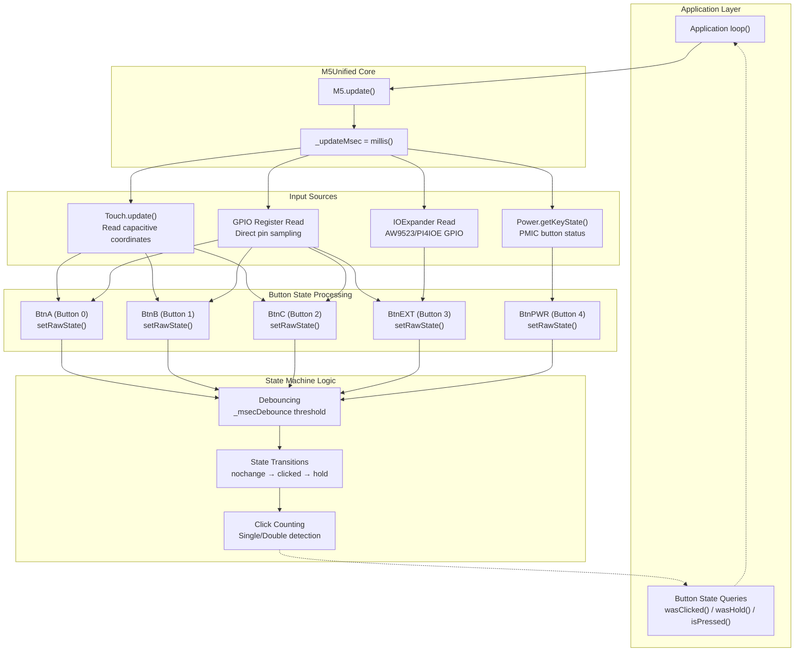

**Sources:** [src/M5Unified.hpp:238-242](), [src/M5Unified.hpp:320](), [src/utility/Button_Class.hpp:60]()

## Button Array and Naming Convention

M5Unified maintains an array of five `Button_Class` instances, with named references for easy access:

| Button Index | Reference Name | Common Usage |
|--------------|----------------|--------------|
| 0 | `M5.BtnA` | Left button (M5Stack), Main button (ATOM) |
| 1 | `M5.BtnB` | Center button (M5Stack), Side button (M5StickC) |
| 2 | `M5.BtnC` | Right button (M5Stack) |
| 3 | `M5.BtnEXT` | External button (CoreInk top button) |
| 4 | `M5.BtnPWR` | Power button (from PMIC or dedicated pin) |

Button availability varies by device:

- **M5Stack Basic/Core2**: BtnA, BtnB, BtnC, BtnPWR (Core2 only)
- **M5StickC/CPlus**: BtnA, BtnB, BtnPWR
- **M5ATOM series**: BtnA only
- **CoreInk**: BtnA, BtnB, BtnC, BtnEXT, BtnPWR
- **M5Paper**: BtnA, BtnB, BtnC

**Sources:** [src/M5Unified.hpp:227-242](), [src/M5Unified.hpp:614]()

## Multi-Source Input Resolution

A single button can receive input from multiple physical sources, which are logically OR'd together. For example, on M5Stack Core2, BtnA can be triggered by either:
1. A touch event in the left region of the screen
2. An external GPIO button connected to PortB

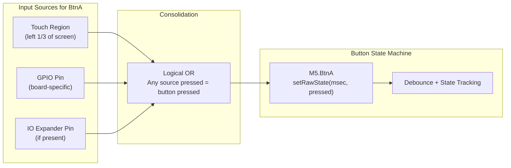

The `M5.update()` method polls all input sources and calls `setRawState()` for each button with the consolidated pressed/released state.

**Sources:** [src/utility/Button_Class.hpp:60](), [src/utility/Button_Class.cpp:41-84]()

## Update Loop Timing

The input system relies on regular polling via `M5.update()`. The method captures the current timestamp using `millis()` and stores it in `_updateMsec`, which is used for:

1. **Debouncing calculations**: Determining if sufficient time has passed since the last raw state change
2. **Hold detection**: Measuring how long a button has been continuously pressed
3. **Click timeout**: Detecting when multi-click sequences should be finalized
4. **PMIC button polling**: The power button from PMIC requires at least 4ms between updates

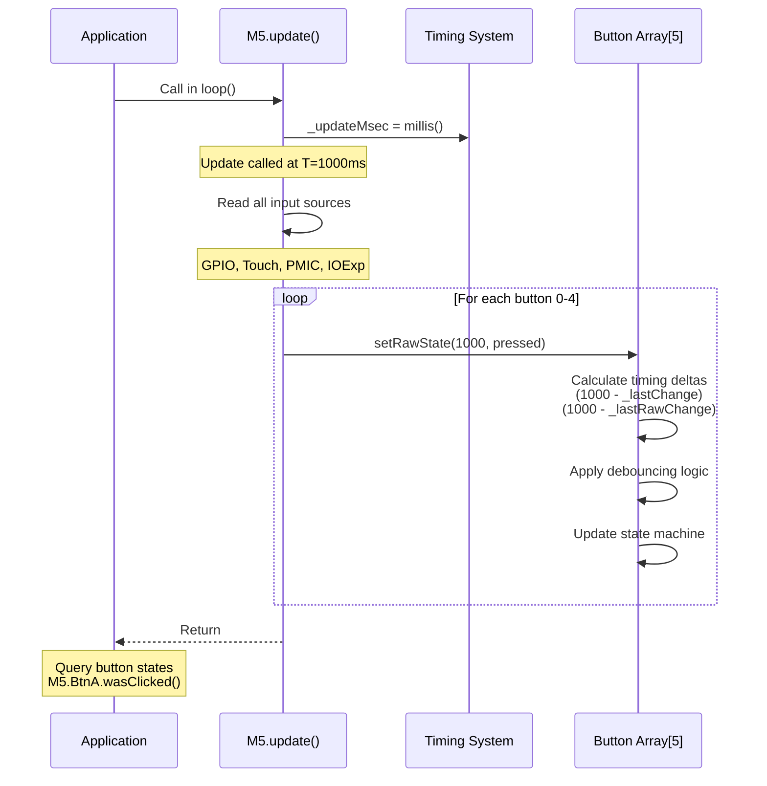

**Sources:** [src/M5Unified.hpp:289](), [src/M5Unified.hpp:612](), [src/utility/Button_Class.cpp:44]()

## Button State Machine

Each `Button_Class` instance implements a state machine with four states defined by the `button_state_t` enum:

| State | Value | Description |
|-------|-------|-------------|
| `state_nochange` | 0 | No state transition occurred this update |
| `state_clicked` | 1 | Button was briefly pressed and released |
| `state_hold` | 2 | Button has been held for longer than hold threshold |
| `state_decide_click_count` | 3 | Click sequence complete, final count available |

The state machine tracks:
- **Current state**: `_currentState` indicates what happened in the most recent update
- **Press level**: `_press` is 0 (released), 1 (clicked), or 2 (holding)
- **Previous press**: `_oldPress` stores the previous `_press` value
- **Click count**: `_clickCount` accumulates clicks in a sequence
- **Raw state**: `_raw_press` stores the actual input before debouncing

**Sources:** [src/utility/Button_Class.hpp:14-19](), [src/utility/Button_Class.hpp:69-82]()

## Debouncing and Timing Parameters

The Button_Class implements software debouncing to filter mechanical switch bounce and rapid state changes:

| Parameter | Default | Configurable Via | Purpose |
|-----------|---------|------------------|---------|
| `_msecDebounce` | 10ms | `setDebounceThresh()` | Minimum time for raw state to stabilize |
| `_msecHold` | 500ms | `setHoldThresh()` | Time threshold to transition from click to hold |

### Debouncing Logic

The debouncing mechanism uses two timing variables:

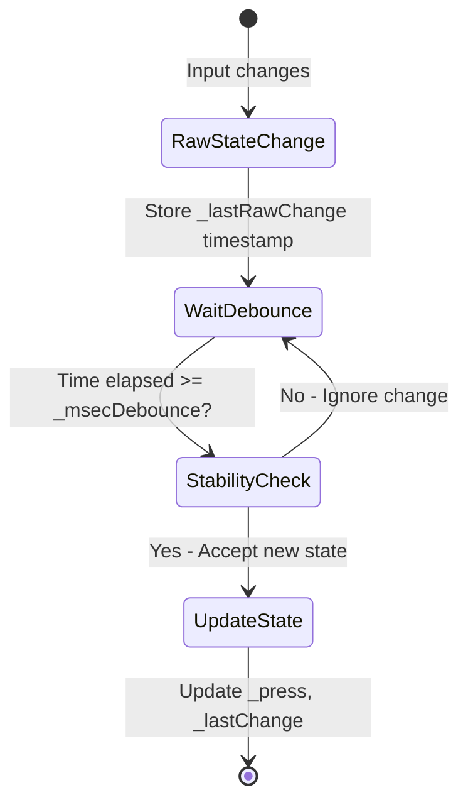

1. When raw input changes, `_lastRawChange` is updated
2. The new state is only accepted if `(currentTime - _lastRawChange) >= _msecDebounce`
3. Alternatively, if more than `_msecDebounce` has elapsed since the last `update()` call, debouncing is disabled for that update (prevents missed inputs during long loop times)

**Sources:** [src/utility/Button_Class.cpp:41-57](), [src/utility/Button_Class.hpp:57-58](), [src/utility/Button_Class.hpp:74-75]()

## State Transition Flow

The complete state transition logic in `setRawState()`:

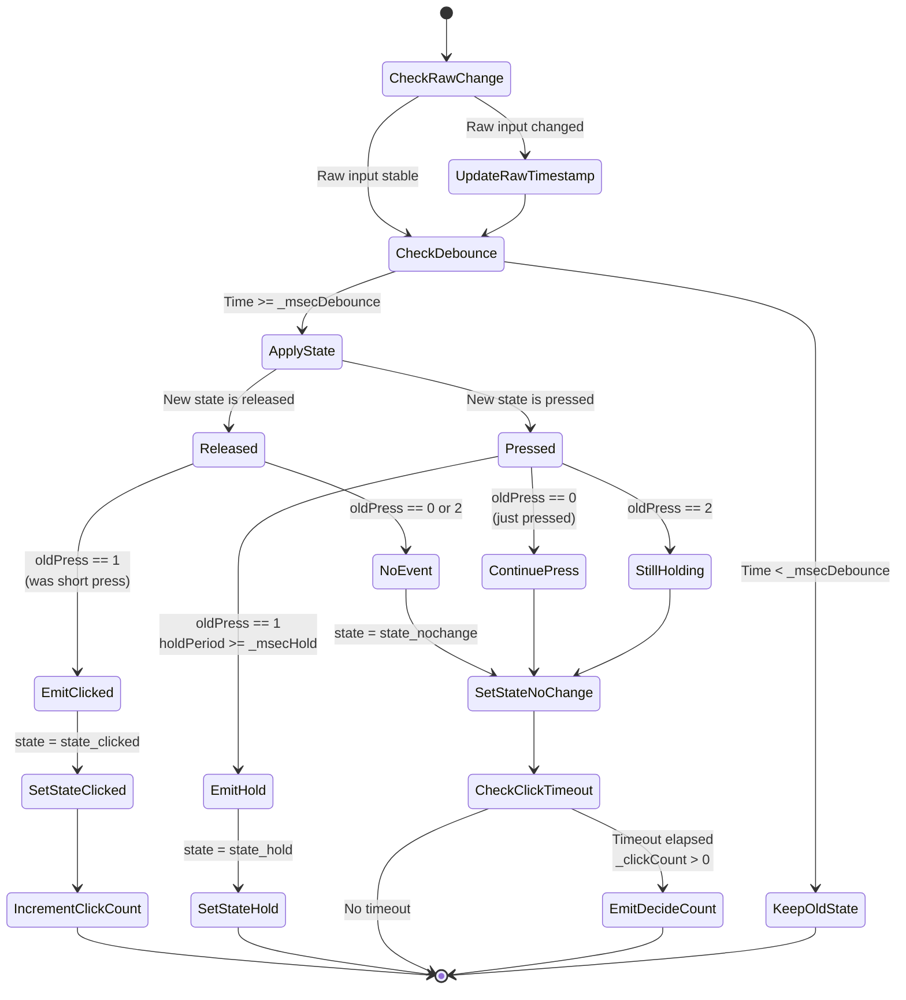

**Sources:** [src/utility/Button_Class.cpp:41-84](), [src/utility/Button_Class.cpp:8-39]()

## Click Counting and Multi-Click Detection

The button system supports single, double, and multi-click detection:

1. Each `state_clicked` event increments `_clickCount` and resets `_lastClicked` timestamp
2. If no button activity occurs for `_msecHold` milliseconds after the last click, the system emits `state_decide_click_count`
3. User code queries `getClickCount()` to determine how many clicks occurred

Example usage:
```cpp
M5.update();
if (M5.BtnA.wasSingleClicked()) {
    // Exactly one click detected
}
if (M5.BtnA.wasDoubleClicked()) {
    // Exactly two clicks detected
}
if (M5.BtnA.wasDecideClickCount() && M5.BtnA.getClickCount() == 3) {
    // Triple-click detected
}
```

**Sources:** [src/utility/Button_Class.hpp:28-34](), [src/utility/Button_Class.cpp:16-27](), [src/utility/Button_Class.cpp:30-33]()

## Button Query API

The Button_Class provides a rich API for querying button state:

| Method | Returns True When |
|--------|-------------------|
| `wasClicked()` | Button was briefly pressed and released this update |
| `wasHold()` | Button transitioned to hold state this update |
| `wasSingleClicked()` | Single-click sequence finalized |
| `wasDoubleClicked()` | Double-click sequence finalized |
| `wasDecideClickCount()` | Any multi-click sequence finalized |
| `isPressed()` | Button is currently pressed (any duration) |
| `isReleased()` | Button is currently released |
| `isHolding()` | Button is currently in hold state |
| `wasPressed()` | Button transitioned from released to pressed this update |
| `wasReleased()` | Button transitioned from pressed to released this update |
| `wasReleasedAfterHold()` | Button was released after being held |
| `pressedFor(ms)` | Button has been continuously pressed for at least ms |
| `releasedFor(ms)` | Button has been continuously released for at least ms |
| `wasReleaseFor(ms)` | Button was held for at least ms before being released |

All query methods are non-destructive—button state persists until the next `M5.update()` call.

**Sources:** [src/utility/Button_Class.hpp:22-55]()

## Touch Integration

On devices with capacitive touch screens (M5Stack Core2, M5Tough), the touch interface can generate button events by dividing the screen into virtual button regions:

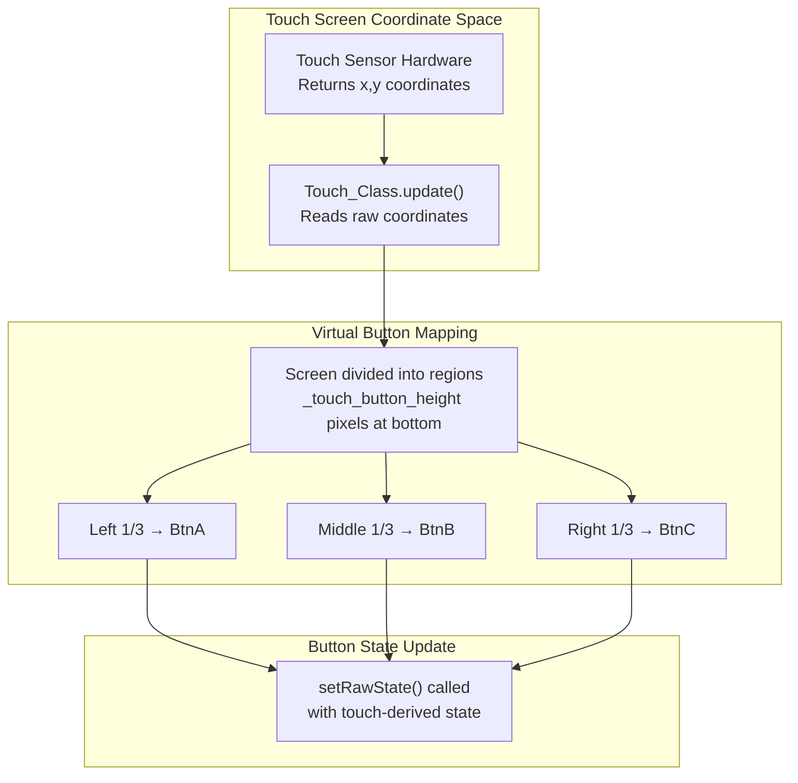

The height of the touch button region is configurable:
- `setTouchButtonHeightByRatio(ratio)`: Sets height as a percentage (0-255 = 0%-100%)
- `setTouchButtonHeight(pixels)`: Sets absolute pixel height
- `getTouchButtonHeight()`: Returns current height

**Sources:** [src/M5Unified.hpp:605-607](), [src/M5Unified.hpp:222]()

## GPIO Input Sources

Physical button inputs are read directly from GPIO pins using the pin mapping system:

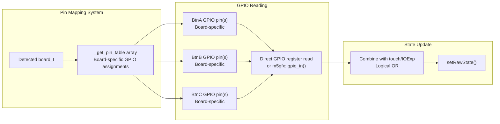

The specific GPIO pins used for buttons vary by board and are resolved during initialization via `_setup_pinmap()`.

**Sources:** [src/M5Unified.hpp:251](), [src/M5Unified.hpp:635](), [src/M5Unified.cpp:328-349]()

## PMIC Power Button

Devices with Power Management ICs (AXP192, AXP2101, IP5306) can read the power button state via the PMIC's I2C interface:

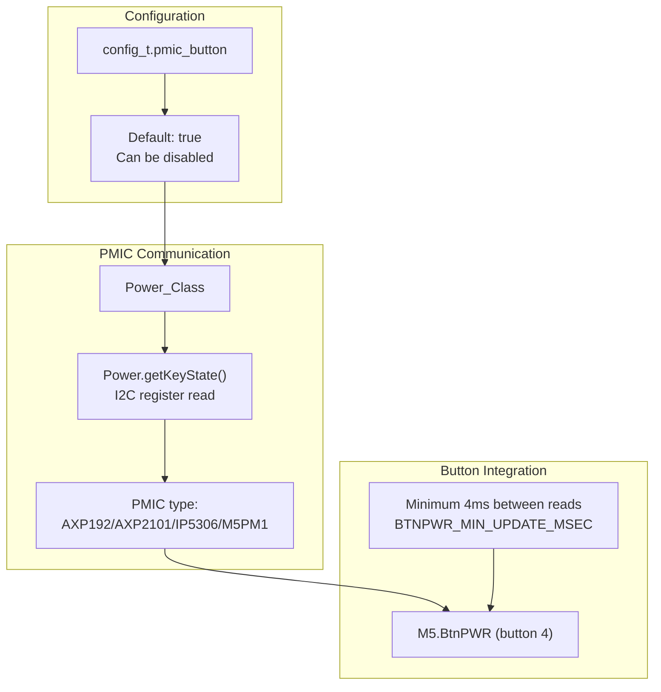

The PMIC button is only available when:
1. The board has a PMIC with button support
2. `config.pmic_button = true` (default)
3. At least 4ms has elapsed since the last update (prevents I2C bus saturation)

**Sources:** [src/M5Unified.hpp:133](), [src/M5Unified.hpp:612](), [src/M5Unified.hpp:242]()

## IO Expander Integration

Some devices use IO expander chips (AW9523, PI4IOE5V6408) to provide additional GPIO pins for buttons:

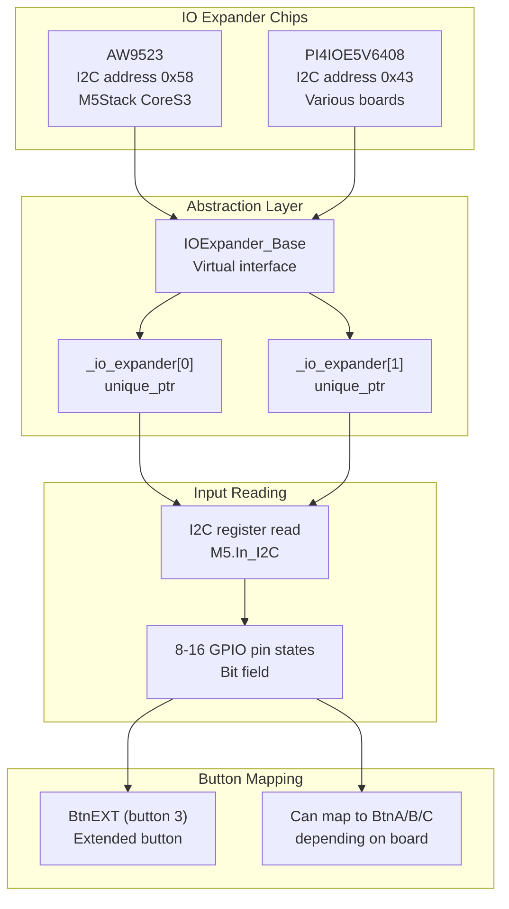

The `M5.getIOExpander(idx)` method provides access to IO expander instances for advanced use cases.

**Sources:** [src/M5Unified.hpp:609](), [src/M5Unified.hpp:618](), [src/utility/IOExpander_Base.hpp:1]()

## Board-Specific Button Configurations

Different M5Stack devices have vastly different button configurations:

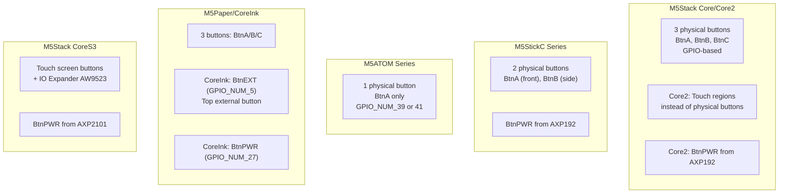

The specific implementation details are handled automatically by `M5.begin()` based on the detected board type.

**Sources:** [src/M5Unified.hpp:227-242](), [src/M5Unified.cpp:971-1114]()

## Touch Sensor Reading (ESP32 Classic)

On ESP32 (not S3/C3/C6), the classic capacitive touch sensor peripheral can be used for button detection. The system provides a helper function for reading touch pad values:

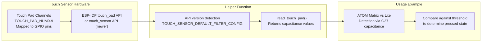

This functionality is primarily used during board detection (distinguishing ATOM Matrix from ATOM Lite based on LED capacitance) but can be leveraged for custom touch button implementations.

**Sources:** [src/M5Unified.cpp:826-883](), [src/M5Unified.cpp:994-1009]()

## Update Method Call Requirements

For the input system to function correctly, `M5.update()` must be called:

1. **Regularly**: At least once per loop iteration
2. **Frequently enough**: More often than the debounce threshold (default 10ms) to avoid missed inputs
3. **Not too frequently**: For PMIC buttons, allow at least 4ms between calls to avoid I2C bus saturation

Typical usage pattern:
```cpp
void setup() {
    M5.begin();
}

void loop() {
    M5.update();  // Poll all input sources
    
    // Query button states
    if (M5.BtnA.wasClicked()) {
        // Handle button A click
    }
    
    // Rest of application logic
    delay(10);  // Optional, but helps maintain consistent timing
}
```

**Sources:** [src/M5Unified.hpp:319-321](), [src/M5Unified.hpp:612]()

## Input Processing Performance

The input system is designed for efficient polling:

- **GPIO reads**: Direct register access, typically <1µs per pin
- **Touch reads**: I2C communication with touch controller, ~100µs-1ms
- **PMIC reads**: I2C register read, ~200µs-500µs
- **IO expander reads**: I2C communication, ~200µs-500µs per device

Total `M5.update()` execution time is typically 1-3ms depending on the board configuration and number of active input sources.

The state machine logic (debouncing, click counting) adds negligible overhead (<10µs per button).

**Sources:** [src/utility/Button_Class.cpp:41-84]()