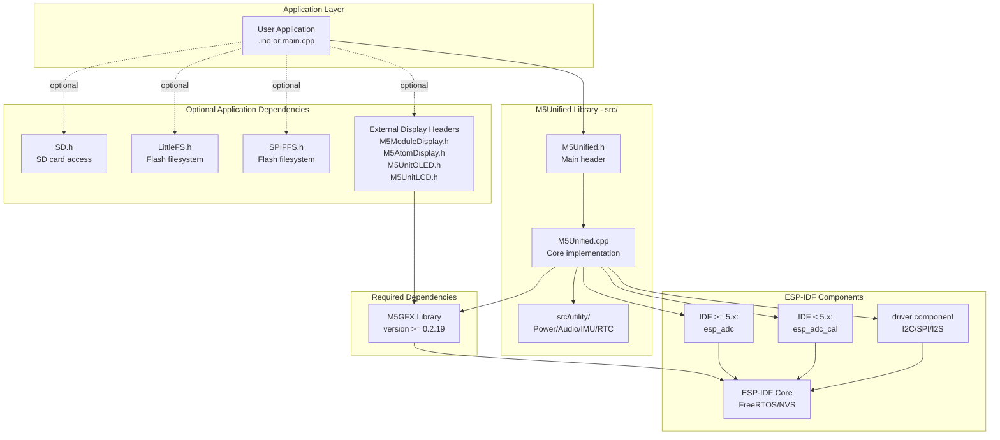
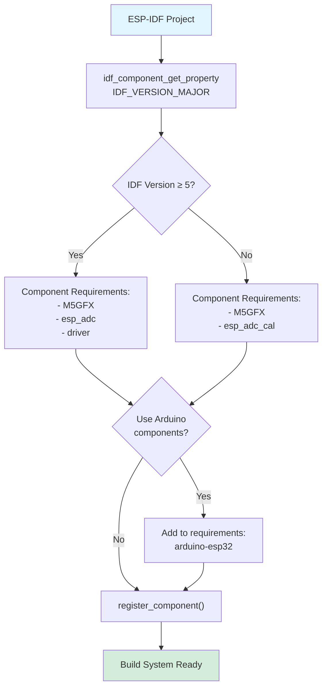
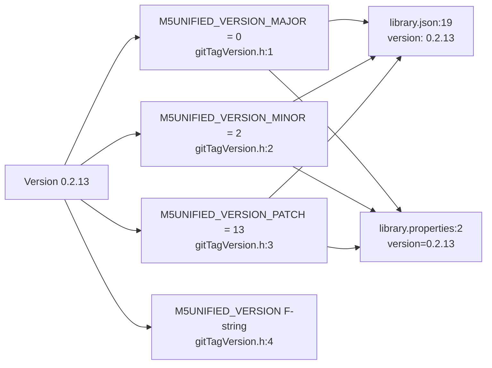

M5Unified Installation and Dependencies

# Installation and Dependencies

<details>
<summary>Relevant source files</summary>

The following files were used as context for generating this wiki page:

- [README.md](README.md)
- [examples/Basic/HowToUse/HowToUse.ino](examples/Basic/HowToUse/HowToUse.ino)
- [library.json](library.json)
- [library.properties](library.properties)
- [src/gitTagVersion.h](src/gitTagVersion.h)

</details>


This page covers the installation process for M5Unified, its external dependencies, and build system configuration. For information about supported hardware devices, see [Supported Hardware](#2.1). For basic usage patterns after installation, see [Basic Usage](#2.3).

## Overview

M5Unified requires:
- **Core dependency**: M5GFX library (version 0.2.19 or higher)
- **Platform**: ESP32-based microcontrollers (ESP32, ESP32-S3, ESP32-C3, ESP32-C6, ESP32-P4)
- **Framework**: Arduino IDE or ESP-IDF
- **Build system**: Arduino, PlatformIO, or ESP-IDF CMake

The library version is 0.2.13 as defined in [library.json:19]() and [gitTagVersion.h:1-4]().

Sources: [library.json:13-17](), [library.json:19](), [gitTagVersion.h:1-4]()

---

## Dependency Architecture

**Diagram: M5Unified Dependency Structure**



Sources: [library.json:13-17](), [CMakeLists.txt:4-18](), [README.md:1-43]()

---

## Installation Methods

### Arduino IDE Installation

**Method 1: Library Manager (Recommended)**
1. Open Arduino IDE
2. Navigate to **Sketch > Include Library > Manage Libraries**
3. Search for "M5Unified"
4. Select version 0.2.13 or higher
5. Click Install
6. The M5GFX dependency (>= 0.2.19) will be automatically installed via the `depends=M5GFX` declaration in [library.properties:11]()

**Method 2: Manual Installation**
1. Download the repository from https://github.com/m5stack/M5Unified.git
2. Extract to Arduino libraries folder: `~/Arduino/libraries/M5Unified`
3. Manually install M5GFX (>= 0.2.19) from https://github.com/M5Stack/M5GFX

After installation, examples are available under **File > Examples > M5Unified > Basic**, including:
- `HowToUse` - Combined demonstration ([examples/Basic/HowToUse/HowToUse.ino]())
- `Button`, `Touch`, `Speaker`, `Microphone`, `Imu`, `Rtc` - Individual feature examples

Sources: [README.md:16-34](), [library.properties:1-11]()

---

### PlatformIO Installation

Add to `platformio.ini`:

```ini
[env:m5stack]
platform = espressif32
framework = arduino
lib_deps = 
    M5Unified @ ^0.2.13
    ; M5GFX will be automatically resolved by PlatformIO
```

The library name is defined in [library.json:2]() as `"M5Unified"`. The M5GFX dependency with version constraint `">=0.2.19"` is automatically resolved via [library.json:13-17]().

**Supported frameworks** (from [library.json:20]()):
- `"arduino"` - Arduino framework
- `"espidf"` - ESP-IDF framework
- `"*"` - Platform-agnostic components

**Supported platforms** (from [library.json:21]()):
- `"espressif32"` - ESP32 family (ESP32, ESP32-S3, ESP32-C3, ESP32-C6, ESP32-P4)
- `"native"` - Native platform for testing

Sources: [library.json:1-22]()

---

### ESP-IDF Installation

**Diagram: ESP-IDF Component Configuration Flow**



Sources: [CMakeLists.txt:1-28]()

**Step 1**: Add M5Unified as a component dependency in your ESP-IDF project's `CMakeLists.txt`:

```cmake
set(EXTRA_COMPONENT_DIRS 
    path/to/M5Unified
    path/to/M5GFX
)
```

**Step 2**: The M5Unified [CMakeLists.txt]() automatically configures component requirements based on IDF version detection via `idf_component_get_property(IDF_VERSION_MAJOR idf_version VERSION_MAJOR)` ([CMakeLists.txt:14]()):

| IDF Version | ADC Component | Other Requirements |
|-------------|---------------|-------------------|
| IDF ≥ 5.x   | `esp_adc` ([CMakeLists.txt:18]()) | `M5GFX`, `driver` |
| IDF < 5.x   | `esp_adc_cal` ([CMakeLists.txt:16]()) | `M5GFX` |

**Step 3** (Optional): To use Arduino components in ESP-IDF, uncomment [CMakeLists.txt:21]():

```cmake
list(APPEND COMPONENT_REQUIRES arduino-esp32)
```

**Component source files** are automatically gathered via `GLOB_RECURSE` patterns in [CMakeLists.txt:4-12]():

| Pattern | Description | Example Files |
|---------|-------------|---------------|
| `src/*.cpp` | Core implementation | `M5Unified.cpp` |
| `src/utility/*.cpp` | Utility classes | `In_I2C.cpp`, `Log_Class.cpp` |
| `src/utility/imu/*.cpp` | IMU drivers | `IMU_MPU6886.cpp`, `IMU_BMI270.cpp` |
| `src/utility/led/*.cpp` | LED control | `LED_ESP32.cpp` |
| `src/utility/power/*.cpp` | PMIC drivers | `AXP192_Class.cpp`, `AXP2101_Class.cpp` |
| `src/utility/rtc/*.cpp` | RTC drivers | `RTC_PCF8563.cpp`, `RTC_RX8130.cpp` |

Sources: [CMakeLists.txt:1-28]()

---

## Header Inclusion Order

M5Unified has specific requirements for header inclusion order due to initialization dependencies.

**Diagram: Required Header Inclusion Sequence**

```mermaid
flowchart TD
    START["Application .ino/.cpp file"] --> FSCHECK{"Using SD/<br/>LittleFS/<br/>SPIFFS?"}
    
    FSCHECK -->|Yes| FSHEADERS["#include &lt;SD.h&gt;<br/>#include &lt;LittleFS.h&gt;<br/>#include &lt;SPIFFS.h&gt;"]
    FSCHECK -->|No| DISPCHECK
    
    FSHEADERS --> COMMENT1["Comment in HowToUse.ino:21:<br/>Filesystem header must be<br/>included before display library"]
    
    COMMENT1 --> DISPCHECK{"Using external<br/>displays?"}
    
    DISPCHECK -->|Yes| DISPHEADERS["#include &lt;M5AtomDisplay.h&gt;<br/>#include &lt;M5ModuleDisplay.h&gt;<br/>#include &lt;M5ModuleRCA.h&gt;<br/>#include &lt;M5UnitGLASS.h&gt;<br/>#include &lt;M5UnitGLASS2.h&gt;<br/>#include &lt;M5UnitOLED.h&gt;<br/>#include &lt;M5UnitMiniOLED.h&gt;<br/>#include &lt;M5UnitLCD.h&gt;<br/>#include &lt;M5UnitRCA.h&gt;"]
    DISPCHECK -->|No| M5HEADER
    
    DISPHEADERS --> COMMENT2["Comment in HowToUse.ino:52:<br/>Display header must be<br/>included before M5Unified"]
    
    COMMENT2 --> M5HEADER["#include &lt;M5Unified.h&gt;<br/>HowToUse.ino:56-57"]
    
    M5HEADER --> BEGIN["M5.begin&#40;&#41;<br/>Initialize system"]
```



Sources: [README.md:18](), [examples/Basic/HowToUse/HowToUse.ino:1-57]()

### Inclusion Order Rules

**Rule 1: Filesystem Headers First**

As documented in [examples/Basic/HowToUse/HowToUse.ino:21]():
```cpp
// * The filesystem header must be included before the display library.
```

Example from [examples/Basic/HowToUse/HowToUse.ino:6-17]():
```cpp
#include <SD.h>          // If using SD card
#include <LittleFS.h>    // If using LittleFS
#include <SPIFFS.h>      // If using SPIFFS
```

**Rule 2: Display Headers Second**

As documented in [examples/Basic/HowToUse/HowToUse.ino:52]():
```cpp
// * The display header must be included before the M5Unified library.
```

Supported external display headers from [examples/Basic/HowToUse/HowToUse.ino:25-50]():
```cpp
#include <M5AtomDisplay.h>    // ATOM Display (HDMI)
#include <M5ModuleDisplay.h>  // Module Display (HDMI)
#include <M5ModuleRCA.h>      // Module RCA (Composite)
#include <M5UnitGLASS.h>      // Unit GLASS
#include <M5UnitGLASS2.h>     // Unit GLASS2
#include <M5UnitOLED.h>       // Unit OLED
#include <M5UnitMiniOLED.h>   // Unit Mini OLED
#include <M5UnitLCD.h>        // Unit LCD
#include <M5UnitRCA.h>        // Unit RCA
```

These external displays are also documented in [README.md:88-106]().

**Rule 3: M5Unified Header Last**

From [examples/Basic/HowToUse/HowToUse.ino:56-57]():
```cpp
// Include this to enable the M5 global instance.
#include <M5Unified.h>
```

The main header path is defined in [library.json:22]() as `"M5Unified.h"`.

Sources: [examples/Basic/HowToUse/HowToUse.ino:1-57](), [README.md:88-106](), [library.json:22]()

---

## Build Configuration Summary

**Table: Build System Support Matrix**

| Build System | Configuration File | Dependency Declaration | M5GFX Version Constraint |
|--------------|-------------------|----------------------|--------------------------|
| Arduino IDE  | `library.properties` | `depends=M5GFX` ([library.properties:11]()) | Automatic (implicitly >= 0.2.19) |
| PlatformIO   | `library.json` | `"name": "M5GFX", "version": ">=0.2.19"` ([library.json:15-16]()) | Semantic versioning |
| ESP-IDF      | `CMakeLists.txt` | `COMPONENT_REQUIRES M5GFX` ([CMakeLists.txt:15]()) | Manual installation required |

**Additional build metadata:**

| Property | Arduino | PlatformIO | Source |
|----------|---------|------------|--------|
| Library name | `M5Unified` | `"M5Unified"` | [library.properties:1](), [library.json:2]() |
| Version | `0.2.13` | `"0.2.13"` | [library.properties:2](), [library.json:19]() |
| Main header | `M5Unified.h` | `"M5Unified.h"` | [library.properties:10](), [library.json:22]() |
| Architectures | `esp32` | `["espressif32", "native"]` | [library.properties:9](), [library.json:21]() |

Sources: [library.properties:1-11](), [library.json:1-22](), [CMakeLists.txt:1-28]()

---

## Version Information

The library version is defined in multiple locations for compatibility across build systems:

**Version 0.2.13** is declared in:
- [src/gitTagVersion.h:1-4]() - C preprocessor macros for runtime version checking
- [library.json:19]() - PlatformIO manifest
- [library.properties:2]() - Arduino manifest

**Diagram: Version Number Encoding**



From [src/gitTagVersion.h:1-4]():
```cpp
#define M5UNIFIED_VERSION_MAJOR 0
#define M5UNIFIED_VERSION_MINOR 2
#define M5UNIFIED_VERSION_PATCH 13
#define M5UNIFIED_VERSION F( M5UNIFIED_VERSION_MAJOR "." M5UNIFIED_VERSION_MINOR "." M5UNIFIED_VERSION_PATCH )
```

The `M5UNIFIED_VERSION` macro uses Arduino's `F()` macro to store the version string in program memory, reducing RAM usage.

Sources: [src/gitTagVersion.h:1-4](), [library.json:19](), [library.properties:2]()

---

## Platform and Architecture Support

**Supported ESP32 Variants** (from [README.md:53-86]()):

| ESP32 Variant | Supported Devices | Example Boards |
|---------------|-------------------|----------------|
| ESP32 (Xtensa) | Original ESP32 | M5Stack BASIC/GRAY/GO/FIRE, M5Stack Core2, M5Stick C/CPlus, M5Paper, M5ATOM Lite/Matrix, M5STAMP PICO, M5Station |
| ESP32-S3 (Xtensa) | ESP32-S3 | M5Stack CoreS3/CoreS3SE, M5StickS3, M5ATOMS3/S3Lite/S3R, M5STAMPS3, M5Dial, M5Cardputer, M5Capsule, M5PaperS3, M5PowerHub |
| ESP32-C3 (RISC-V) | ESP32-C3 | M5STAMPC3/C3U |
| ESP32-C6 (RISC-V) | ESP32-C6 | M5NanoC6, M5UnitC6L, ArduinoNessoN1 |
| ESP32-P4 | ESP32-P4 | M5Tab5 |

**PlatformIO Platform Support** (from [library.json:21]()):
- `"espressif32"` - All ESP32 family microcontrollers
- `"native"` - Native platform for unit testing

**Arduino IDE Architecture** (from [library.properties:9]()):
- `esp32` - Unified support for all ESP32 variants

**Framework Support** (from [library.json:20]()):
- `"arduino"` - Arduino framework
- `"espidf"` - ESP-IDF framework
- `"*"` - Framework-agnostic components

Sources: [README.md:49-86](), [library.json:20-21](), [library.properties:9]()

---

## Troubleshooting Installation Issues

### Issue: M5GFX Not Found

**Problem**: Compiler error "M5GFX.h: No such file or directory"

**Solution**: M5GFX must be installed separately:
- Arduino IDE: Install via Library Manager
- PlatformIO: Add to `lib_deps` in `platformio.ini`
- ESP-IDF: Add to component directories

The minimum required version is 0.2.17 as specified in [library.json:16]().

### Issue: Wrong ESP-IDF ADC Component

**Problem**: Build error about `esp_adc_cal` not found on IDF 5.x

**Solution**: The CMakeLists.txt automatically selects the correct ADC component based on IDF version. Ensure you're using the provided [CMakeLists.txt:14-18]() without modifications.

### Issue: Header Inclusion Order Error

**Problem**: Compilation errors or runtime crashes when using SD card or external displays

**Solution**: Follow the strict inclusion order documented above:
1. Filesystem headers (SD, LittleFS, SPIFFS)
2. Display headers (M5AtomDisplay, M5ModuleDisplay, etc.)
3. M5Unified.h

This requirement is documented in [HowToUse.ino:21]() and [HowToUse.ino:52]().

Sources: [library.json:13-17](), [CMakeLists.txt:14-18](), [HowToUse.ino:21](), [HowToUse.ino:52]()