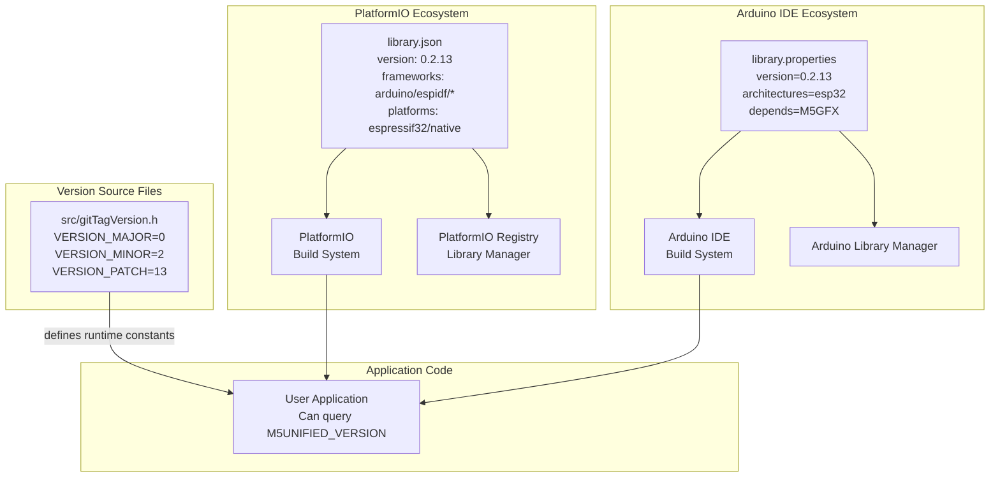
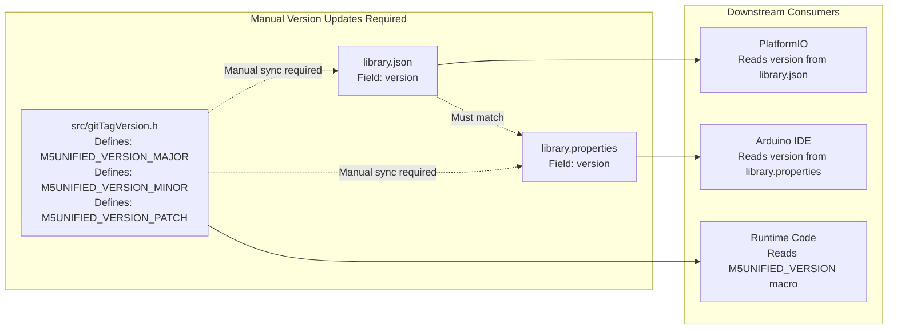
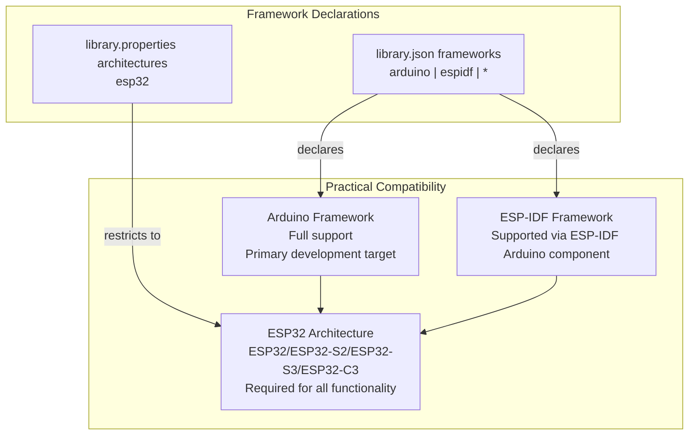

M5Unified Library Versioning and Metadata

# Library Versioning and Metadata

<details>
<summary>Relevant source files</summary>

The following files were used as context for generating this wiki page:

- [library.json](library.json)
- [library.properties](library.properties)
- [src/gitTagVersion.h](src/gitTagVersion.h)

</details>


## Purpose and Scope

This document explains the M5Unified library's versioning scheme and metadata management. It covers the three files that define library identity and version information: `library.json` for PlatformIO, `library.properties` for Arduino IDE, and `src/gitTagVersion.h` for runtime version constants. For information about library installation and dependency setup, see [Installation and Dependencies](#1.2).

---

## Versioning Scheme

M5Unified follows **semantic versioning** (SemVer) with a three-component version number: `MAJOR.MINOR.PATCH`.

The current version (0.2.13) is defined consistently across three files:

| Component | Value | File Location |
|-----------|-------|---------------|
| Major | 0 | `src/gitTagVersion.h`, `library.json`, `library.properties` |
| Minor | 2 | `src/gitTagVersion.h`, `library.json`, `library.properties` |
| Patch | 13 | `src/gitTagVersion.h`, `library.json`, `library.properties` |

### Version Constants Header

The [src/gitTagVersion.h:1-4]() file defines compile-time version constants:

```cpp
#define M5UNIFIED_VERSION_MAJOR 0
#define M5UNIFIED_VERSION_MINOR 2
#define M5UNIFIED_VERSION_PATCH 13
#define M5UNIFIED_VERSION F( M5UNIFIED_VERSION_MAJOR "." M5UNIFIED_VERSION_MINOR "." M5UNIFIED_VERSION_PATCH )
```

The `M5UNIFIED_VERSION` macro concatenates the version components into a string stored in flash memory using the `F()` macro (Arduino flash string optimization). This allows user code to query the library version at runtime.

**Sources:** [src/gitTagVersion.h:1-5]()

---

## Build System Integration

M5Unified metadata files serve two distinct build ecosystems with different metadata specifications:



**Sources:** [library.json:1-23](), [library.properties:1-11](), [src/gitTagVersion.h:1-5]()

---

## PlatformIO Metadata (library.json)

The [library.json:1-23]() file provides PlatformIO with library metadata in JSON format:

### Basic Identity Fields

| Field | Value | Purpose |
|-------|-------|---------|
| `name` | "M5Unified" | Library identifier for dependency resolution |
| `description` | (Full device list) | Human-readable description of supported hardware |
| `keywords` | "M5Unified" | Search indexing for library registry |
| `version` | "0.2.13" | Current library version (SemVer) |

### Author and Repository Information

```json
"authors": {
  "name": "M5Stack, lovyan03",
  "url": "http://www.m5stack.com"
},
"repository": {
  "type": "git",
  "url": "https://github.com/m5stack/M5Unified.git"
}
```

The `authors` field credits both M5Stack (primary vendor) and lovyan03 (key contributor who authored M5GFX and much of M5Unified's core architecture).

**Sources:** [library.json:5-11]()

### Dependency Declarations

```json
"dependencies": [
  {
    "name": "M5GFX",
    "version": ">=0.2.19"
  }
]
```

M5Unified declares a single dependency on **M5GFX >= 0.2.19**. The `>=` constraint allows PlatformIO to install any M5GFX version 0.2.19 or newer. This dependency is critical because M5Unified's display system (see [Display Management and M5GFX Integration](#2.4)) inherits from M5GFX's `M5GFX_Device` class.

**Sources:** [library.json:13-17]()

### Framework and Platform Support

```json
"frameworks": ["arduino", "espidf", "*"],
"platforms": ["espressif32", "native"]
```

| Field | Values | Meaning |
|-------|--------|---------|
| `frameworks` | `"arduino"`, `"espidf"`, `"*"` | Supports Arduino framework, ESP-IDF framework, or any framework |
| `platforms` | `"espressif32"`, `"native"` | Runs on ESP32 hardware platforms or native testing environments |

The `"*"` wildcard in frameworks indicates the library can theoretically build in any framework context, though practical functionality requires ESP32 hardware.

**Sources:** [library.json:20-21]()

### Header Include

```json
"headers": "M5Unified.h"
```

Specifies the primary header file users should include. PlatformIO uses this to automatically add include paths and verify header availability.

**Sources:** [library.json:22]()

---

## Arduino IDE Metadata (library.properties)

The [library.properties:1-11]() file provides Arduino IDE with library metadata in key-value format:

### Version and Identity

```
name=M5Unified
version=0.2.13
author=M5Stack
maintainer=M5Stack
```

These fields must match `library.json` values to ensure version consistency across build systems.

**Sources:** [library.properties:1-4]()

### Description Fields

```
sentence=Library for M5Stack/Core2/Tough/CoreS3/CoreS3SE, M5StickC/C-Plus/C-Plus2, M5CoreInk, M5Paper, M5ATOM, M5STAMP, M5Station, M5Dial, M5DinMeter, M5Capsule, M5Cardputer, M5VAMeter, M5Tab5
paragraph=M5Stack, M5Stack Core2, M5Stack CoreInk, M5StickC, M5StickC-Plus, M5Paper, M5Tough, M5ATOM, M5STAMP, M5Station, See more on http://M5Stack.com
```

Arduino requires two description fields:
- **sentence**: One-line summary displayed in Library Manager search results
- **paragraph**: Extended description with additional context

Both list the 19+ supported M5Stack device families (see [Supported Hardware](#1.1) for complete list).

**Sources:** [library.properties:5-6]()

### Category and Architecture

```
category=Display
architectures=esp32
```

| Field | Value | Purpose |
|-------|-------|---------|
| `category` | Display | Categorization in Arduino Library Manager (logical category, not strict API) |
| `architectures` | esp32 | Restricts compilation to ESP32 architecture targets only |

The `Display` category reflects M5Unified's primary visible functionality, though the library provides much more than display control (power, audio, sensors, etc.).

**Sources:** [library.properties:7,9]()

### Dependency Declaration

```
depends=M5GFX
```

Arduino's dependency syntax differs from PlatformIO's JSON format but declares the same requirement: M5GFX must be installed. Arduino IDE does not support version constraints in this field, so it will accept any installed M5GFX version (users must manually ensure compatibility).

**Sources:** [library.properties:11]()

### Include Header

```
includes=M5Unified.h
```

Specifies the header file for Arduino's include verification system, matching `library.json`'s `headers` field.

**Sources:** [library.properties:10]()

---

## Version Synchronization Strategy

The three version-bearing files must maintain consistency to prevent build system confusion:



### Version Update Checklist

When releasing a new M5Unified version, developers must update **three locations**:

1. [src/gitTagVersion.h:1-3]() - Update `M5UNIFIED_VERSION_MAJOR`, `M5UNIFIED_VERSION_MINOR`, and/or `M5UNIFIED_VERSION_PATCH`
2. [library.json:19]() - Update `"version"` field to match
3. [library.properties:2]() - Update `version=` field to match

No automated synchronization exists; version mismatches will cause confusion when users query the runtime version versus what their package manager reports.

**Sources:** [src/gitTagVersion.h:1-5](), [library.json:19](), [library.properties:2]()

---

## Metadata Field Comparison

The following table shows equivalent fields across both metadata formats:

| Concept | library.json | library.properties | Notes |
|---------|--------------|-------------------|-------|
| Library name | `"name": "M5Unified"` | `name=M5Unified` | Must match exactly |
| Version | `"version": "0.2.13"` | `version=0.2.13` | SemVer format required |
| Primary header | `"headers": "M5Unified.h"` | `includes=M5Unified.h` | Different field names |
| Dependency | `"dependencies": [{"name": "M5GFX", "version": ">=0.2.19"}]` | `depends=M5GFX` | Arduino lacks version constraints |
| Description | `"description": "..."` | `sentence=...` + `paragraph=...` | Arduino requires two separate fields |
| Author | `"authors": {"name": "M5Stack, lovyan03"}` | `author=M5Stack` + `maintainer=M5Stack` | Different structures |
| Repository | `"repository": {"url": "..."}` | `url=...` | Similar concept, different structure |

**Sources:** [library.json:1-23](), [library.properties:1-11]()

---

## Supported Devices List

Both metadata files enumerate the supported M5Stack device families. The complete list declared in [library.json:3]() and [library.properties:5]():

| Device Family | Examples | Notes |
|---------------|----------|-------|
| M5Stack | Core, Core2, Tough, CoreS3, CoreS3SE | Full-size devices with TFT displays |
| M5StickC | StickC, StickC-Plus, StickC-Plus2 | Compact stick form factor |
| M5Paper | Paper, PaperS3 | E-ink display devices |
| M5CoreInk | CoreInk | E-ink with physical buttons |
| M5ATOM | Atom, AtomS3, AtomMatrix, AtomEcho | Ultra-compact form factor |
| M5STAMP | Stamp, StampPico, StampS3 | Minimal footprint modules |
| M5Station | Station | Base station design |
| M5Dial | Dial | Rotary encoder interface |
| M5DinMeter | DinMeter | DIN rail mounted |
| M5Capsule | Capsule | Capsule form factor |
| M5Cardputer | Cardputer | Keyboard-equipped device |
| M5VAMeter | VAMeter | Volt-ampere meter |
| M5Tab5 | Tab5 | Tablet form factor |

For detailed hardware specifications and board detection mechanisms, see [Supported Hardware](#1.1) and [Board Detection and Hardware Identification](#2.2).

**Sources:** [library.json:3](), [library.properties:5-6]()

---

## Framework Compatibility Matrix

M5Unified's framework support varies by build system:



### Framework Notes

- **Arduino Framework**: Primary development and testing target. All examples use Arduino APIs.
- **ESP-IDF Framework**: Supported through ESP-IDF's Arduino-as-component mechanism. Some features may require Arduino compatibility layer.
- **Native Platform**: Declared in `library.json` for unit testing purposes but non-functional (requires ESP32 hardware).

**Sources:** [library.json:20-21](), [library.properties:9]()

---

## Dependency Version Constraint

M5Unified requires **M5GFX >= 0.2.19** as declared in [library.json:13-17]():

### Why Version 0.2.19?

The `>=0.2.19` constraint indicates M5Unified depends on APIs or bug fixes introduced in M5GFX 0.2.19. Earlier M5GFX versions will cause compilation failures or runtime issues.

### PlatformIO vs Arduino Dependency Handling

| Build System | Constraint Support | User Action Required |
|--------------|-------------------|---------------------|
| PlatformIO | Full SemVer constraints (`>=`, `~`, `^`) | Automatic resolution to compatible M5GFX version |
| Arduino IDE | No version constraints in metadata | User must manually verify M5GFX version |

Arduino users must check their installed M5GFX version in Library Manager and upgrade if necessary before installing M5Unified.

### Circular Dependency Consideration

M5Unified depends on M5GFX, but M5GFX is designed as a standalone graphics library with no M5Unified dependency. This unidirectional dependency allows:
- M5GFX to be used independently for custom projects
- M5Unified to leverage M5GFX's display capabilities while adding hardware abstraction

**Sources:** [library.json:13-17](), [library.properties:11]()

---

## Version Querying at Runtime

User code can query the library version using the `M5UNIFIED_VERSION` macro:

```cpp
#include <M5Unified.h>

void setup() {
  Serial.begin(115200);
  Serial.print("M5Unified Version: ");
  Serial.println(M5UNIFIED_VERSION);
  // Outputs: "0.2.13"
}
```

The version string is stored in flash memory via the `F()` macro to conserve RAM. Component-level version queries are also available:

```cpp
Serial.print("Major: ");
Serial.println(M5UNIFIED_VERSION_MAJOR);  // 0
Serial.print("Minor: ");
Serial.println(M5UNIFIED_VERSION_MINOR);  // 2
Serial.print("Patch: ");
Serial.println(M5UNIFIED_VERSION_PATCH);  // 13
```

This enables version-dependent conditional compilation or runtime feature detection in user applications.

**Sources:** [src/gitTagVersion.h:1-5]()

---

## Build System File Usage

Different build contexts consume different metadata files:

| Build Context | File Used | Purpose |
|---------------|-----------|---------|
| PlatformIO project | `library.json` | Dependency resolution, version verification |
| Arduino IDE | `library.properties` | Library Manager display, dependency checking |
| Arduino CLI | `library.properties` | Command-line library management |
| GitHub Actions CI | Both files | Automated testing across both ecosystems |
| User compilation | `src/gitTagVersion.h` | Runtime version constant inclusion |

**Sources:** [library.json:1-23](), [library.properties:1-11](), [src/gitTagVersion.h:1-5]()