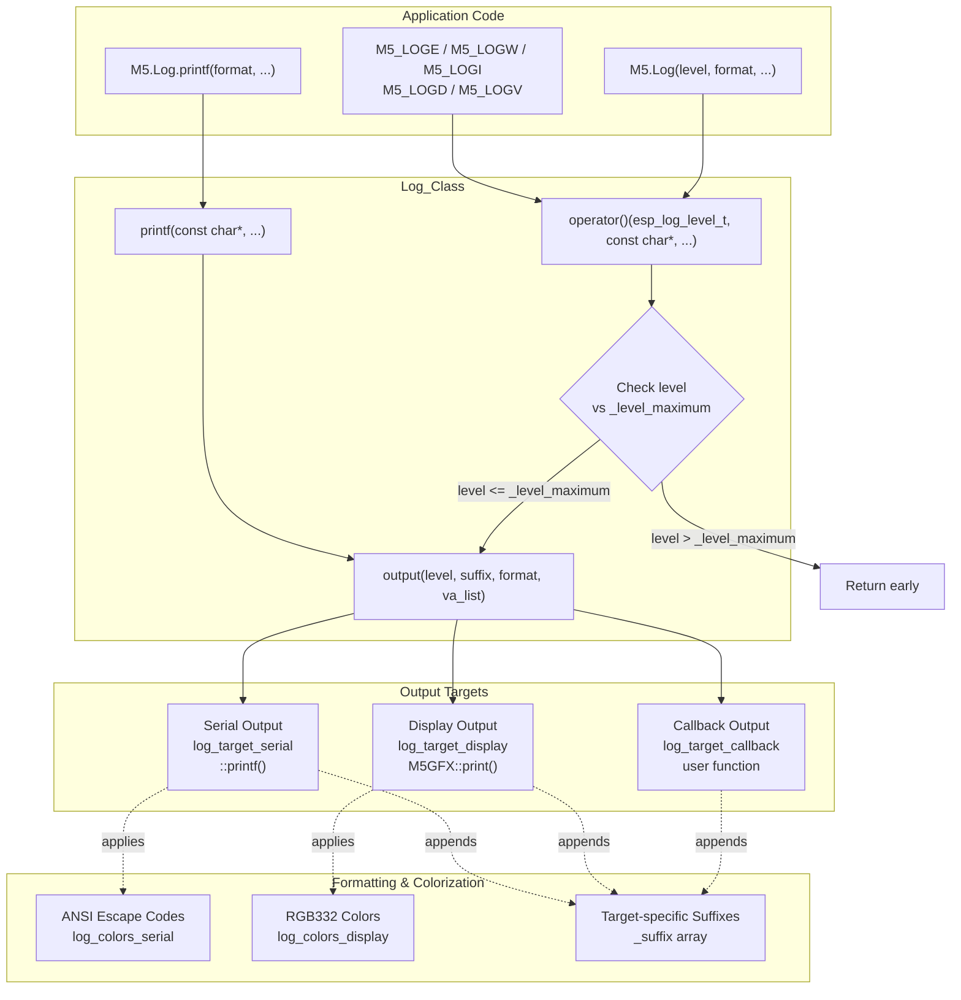
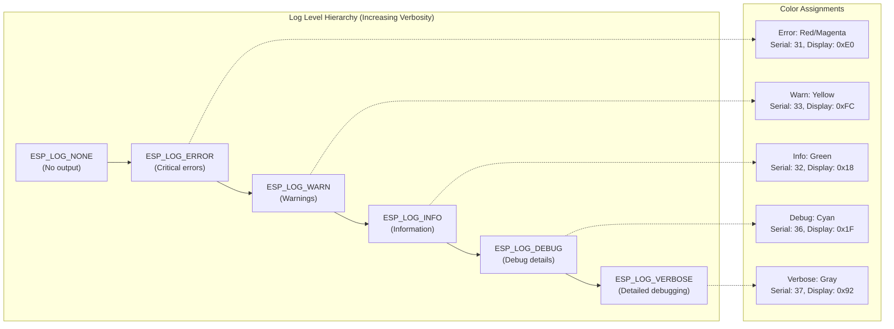
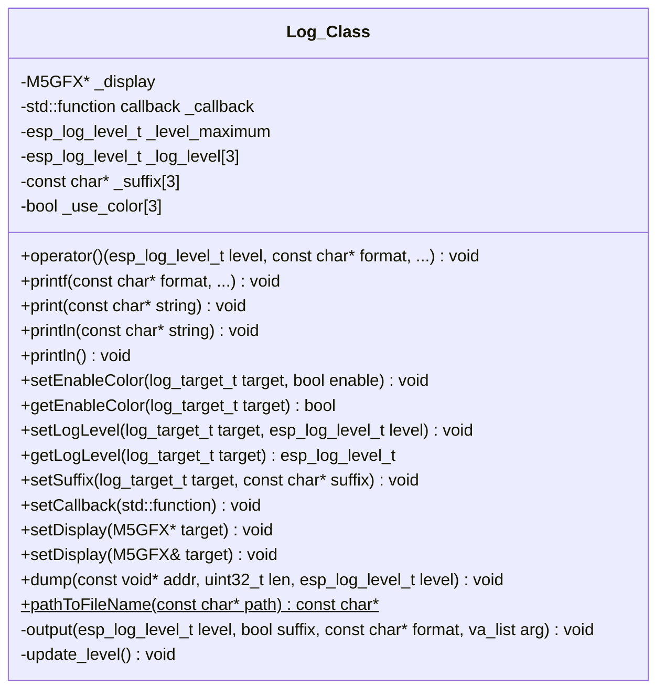
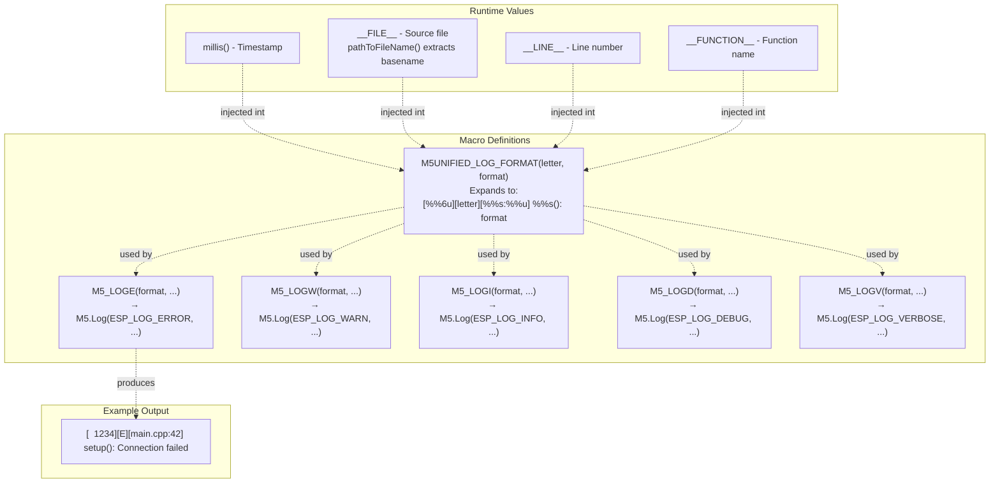
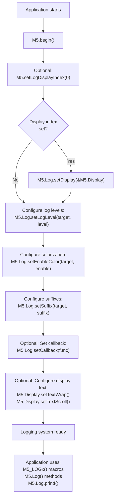
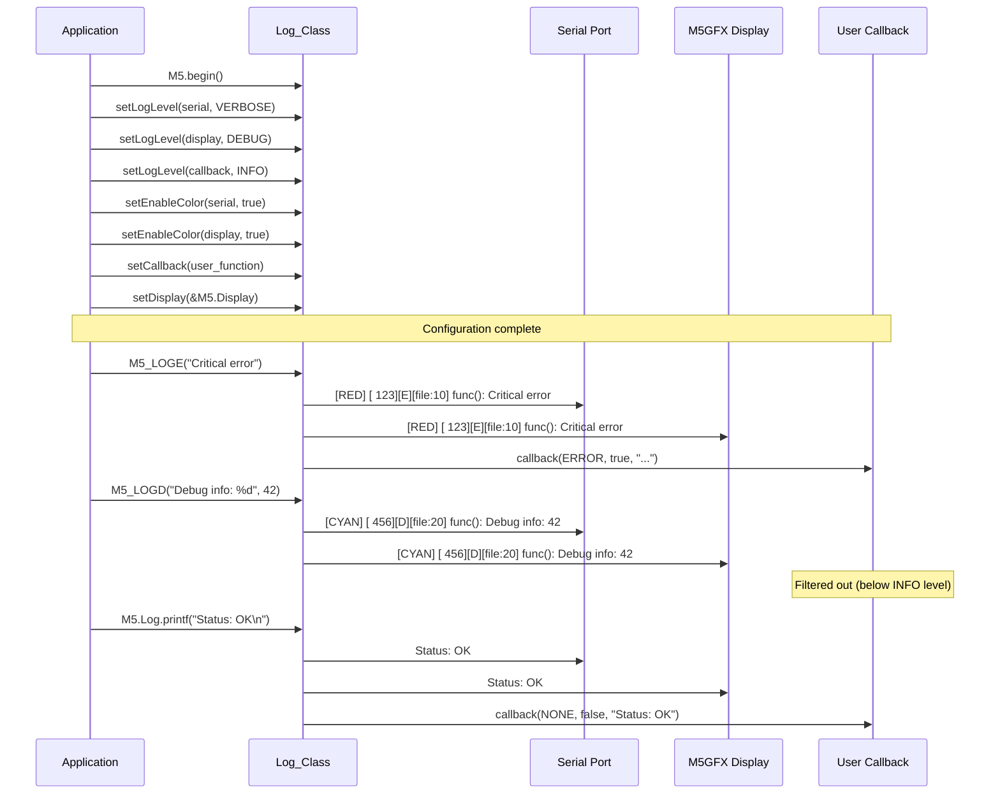

M5Unified Logging System

# Logging System

<details>
<summary>Relevant source files</summary>

The following files were used as context for generating this wiki page:

- [examples/Basic/LogOutput/LogOutput.ino](examples/Basic/LogOutput/LogOutput.ino)
- [src/utility/Log_Class.cpp](src/utility/Log_Class.cpp)
- [src/utility/Log_Class.hpp](src/utility/Log_Class.hpp)

</details>


This document describes the M5Unified logging system implemented in `Log_Class`. The logging system provides a unified interface for outputting diagnostic messages to multiple destinations simultaneously: serial port, display, and user-defined callbacks. Each destination can be configured independently with different log levels, colorization settings, and suffixes.

For information about the broader M5Unified initialization and system architecture, see [Core Architecture](#2). For display management details, see [Display Management and M5GFX Integration](#2.4).

---

## Overview

The logging system is exposed through the `M5.Log` object (instance of `Log_Class`) and provides both direct logging methods and convenience macros. The system is designed to support debugging during development (serial output) and user-facing status messages (display output) from the same logging calls.

**Key Features:**
- Three independent output targets (serial, display, callback)
- Per-target log level filtering
- Per-target colorization control
- Source location information via macros
- Memory dump utility for debugging
- Non-blocking operation

**Sources:** [src/utility/Log_Class.hpp:1-128](), [src/utility/Log_Class.cpp:1-164]()

---

## Architecture

### Log Targets

The logging system supports three concurrent output targets defined by the `log_target_t` enum, each independently configurable:

| Target | Enum Value | Purpose | Default Level |
|--------|-----------|---------|---------------|
| Serial | `log_target_serial` | USB/UART output to development PC | Based on `CORE_DEBUG_LEVEL` |
| Display | `log_target_display` | On-screen text output via M5GFX | Based on `CORE_DEBUG_LEVEL` |
| Callback | `log_target_callback` | User-defined function handler | Based on `CORE_DEBUG_LEVEL` |



**Sources:** [src/utility/Log_Class.hpp:40-46](), [src/utility/Log_Class.cpp:59-124]()

---

### Log Levels

The system uses ESP-IDF standard log levels for severity classification:



Each target maintains its own log level threshold. Messages with severity greater than the threshold are filtered out before formatting.

**Sources:** [src/utility/Log_Class.cpp:10-14](), [src/utility/Log_Class.hpp:114-122]()

---

### Output Flow

The following diagram shows the complete flow from log call to output:

```mermaid
flowchart TD
    START["Application calls M5_LOGE(format, ...)"]
    
    MACRO["Macro expands to:<br/>M5.Log(ESP_LOG_ERROR,<br/>M5UNIFIED_LOG_FORMAT(E, format),<br/>__VA_ARGS__)"]
    
    FORMAT["Format string includes:<br/>[millis][level][file:line] func(): message"]
    
    OPERATOR["Log_Class::operator()<br/>(esp_log_level_t level, const char* format, ...)"]
    
    MAXCHECK{"level <=<br/>_level_maximum?"}
    
    VASTART["va_start(args, format)"]
    
    OUTPUT["output(level, true, format, args)"]
    
    VSNPRINTF["vsnprintf() formats message<br/>into buffer"]
    
    BUFCHECK{"Buffer size<br/>sufficient?"}
    
    ALLOCA["alloca() for larger buffer<br/>Re-format message"]
    
    SERIALCHECK{"_log_level[serial]<br/>>= level?"}
    
    SERIALOUT["Serial output with<br/>ANSI color codes<br/>printf()"]
    
    DISPCHECK{"_display &&<br/>_log_level[display]<br/>>= level?"}
    
    DISPOUT["Display output with<br/>RGB332 colors<br/>M5GFX::print()"]
    
    CBCHECK{"_callback &&<br/>_log_level[callback]<br/>>= level?"}
    
    CBOUT["Callback invocation<br/>_callback(level, use_color, str)"]
    
    VAEND["va_end(args)"]
    
    END["Return to application"]
    
    START --> MACRO
    MACRO --> FORMAT
    FORMAT --> OPERATOR
    OPERATOR --> MAXCHECK
    MAXCHECK -->|No| END
    MAXCHECK -->|Yes| VASTART
    VASTART --> OUTPUT
    OUTPUT --> VSNPRINTF
    VSNPRINTF --> BUFCHECK
    BUFCHECK -->|No| ALLOCA
    BUFCHECK -->|Yes| SERIALCHECK
    ALLOCA --> SERIALCHECK
    SERIALCHECK -->|Yes| SERIALOUT
    SERIALCHECK -->|No| DISPCHECK
    SERIALOUT --> DISPCHECK
    DISPCHECK -->|Yes| DISPOUT
    DISPCHECK -->|No| CBCHECK
    DISPOUT --> CBCHECK
    CBCHECK -->|Yes| CBOUT
    CBCHECK -->|No| VAEND
    CBOUT --> VAEND
    VAEND --> END
    
```



**Sources:** [src/utility/Log_Class.cpp:37-52](), [src/utility/Log_Class.cpp:59-124]()

---

## Core API

### Log_Class Interface

The `Log_Class` provides multiple methods for outputting messages:



**Sources:** [src/utility/Log_Class.hpp:48-126]()

---

### Basic Logging Methods

#### Logging with Level

```cpp
void operator() (esp_log_level_t level, const char* format, ...)
```

Primary logging method that outputs formatted messages to all enabled targets based on their individual log level thresholds.

**Parameters:**
- `level` - Log severity level (ESP_LOG_ERROR through ESP_LOG_VERBOSE)
- `format` - printf-style format string
- `...` - Variable arguments for format string

**Example:**
```cpp
M5.Log(ESP_LOG_INFO, "Sensor reading: %d", value);
```

**Sources:** [src/utility/Log_Class.hpp:52](), [src/utility/Log_Class.cpp:37-44]()

---

#### Direct Output (No Level)

```cpp
void printf(const char* format, ...)
void print(const char* string)
void println(const char* string)
void println(void)
```

These methods output text to all targets regardless of log level settings. Useful for user-facing messages that should always appear.

**Example:**
```cpp
M5.Log.printf("Device initialized\n");
M5.Log.println("Ready");
```

**Sources:** [src/utility/Log_Class.hpp:54-68](), [src/utility/Log_Class.cpp:46-52]()

---

### Configuration Methods

#### Log Level Configuration

```cpp
void setLogLevel(log_target_t target, esp_log_level_t level)
esp_log_level_t getLogLevel(log_target_t target)
```

Configure the minimum log level for each target independently. Messages below the threshold are filtered out.

**Example:**
```cpp
M5.Log.setLogLevel(m5::log_target_serial, ESP_LOG_VERBOSE);  // All levels
M5.Log.setLogLevel(m5::log_target_display, ESP_LOG_INFO);    // Info and above
M5.Log.setLogLevel(m5::log_target_callback, ESP_LOG_ERROR);  // Errors only
```

The internal `_level_maximum` is automatically updated to the highest level among all targets to enable early filtering.

**Sources:** [src/utility/Log_Class.hpp:76-80](), [src/utility/Log_Class.cpp:54-57]()

---

#### Color Configuration

```cpp
void setEnableColor(log_target_t target, bool enable)
bool getEnableColor(log_target_t target)
```

Enable or disable colorization for each target. Serial uses ANSI escape codes, display uses RGB332 colors.

**Color Mappings:**

| Level | Serial ANSI | Display RGB332 | Visual Appearance |
|-------|-------------|----------------|-------------------|
| ERROR | 31 | 0xE0 | Red/Magenta |
| WARN | 33 | 0xFC | Yellow |
| INFO | 32 | 0x18 | Green |
| DEBUG | 36 | 0x1F | Cyan |
| VERBOSE | 37 | 0x92 | Gray |

**Example:**
```cpp
M5.Log.setEnableColor(m5::log_target_serial, true);
M5.Log.setEnableColor(m5::log_target_display, false);
```

**Sources:** [src/utility/Log_Class.hpp:71-74](), [src/utility/Log_Class.cpp:10-14](), [src/utility/Log_Class.cpp:82-117]()

---

#### Suffix Configuration

```cpp
void setSuffix(log_target_t target, const char* suffix)
```

Set the text appended to each log message for a specific target. Default is "\n" for serial and display, "\r\n" for callback.

**Example:**
```cpp
M5.Log.setSuffix(m5::log_target_serial, "\r\n");
M5.Log.setSuffix(m5::log_target_display, "\n");
M5.Log.setSuffix(m5::log_target_callback, "");  // No suffix
```

**Sources:** [src/utility/Log_Class.hpp:83](), [src/utility/Log_Class.hpp:123]()

---

#### Callback Configuration

```cpp
void setCallback(std::function<void(esp_log_level_t, bool, const char*)> function)
```

Register a user-defined callback function to receive log messages. The callback receives the log level, color enable flag, and formatted text.

**Callback Signature:**
```cpp
void user_callback(esp_log_level_t log_level, bool use_color, const char* log_text)
```

**Example Use Cases:**
- Writing logs to SD card
- Sending logs over network
- Storing logs in circular buffer
- Triggering alerts on errors

**Example:**
```cpp
M5.Log.setCallback([](esp_log_level_t level, bool color, const char* text) {
    if (level == ESP_LOG_ERROR) {
        // Write to SD card
        auto file = SD.open("/errors.log", FILE_APPEND);
        file.print(text);
        file.close();
    }
});
```

**Sources:** [src/utility/Log_Class.hpp:85-87](), [src/utility/Log_Class.cpp:119-123](), [examples/Basic/LogOutput/LogOutput.ino:97-113]()

---

#### Display Configuration

```cpp
void setDisplay(M5GFX* target)
void setDisplay(M5GFX& target)
```

Set the M5GFX display instance for log output. If null, display output is disabled.

**Example:**
```cpp
M5.Log.setDisplay(&M5.Display);
// Or use M5.setLogDisplayIndex(0) for convenience
```

The display target is typically configured automatically during `M5.begin()` when display index is set.

**Sources:** [src/utility/Log_Class.hpp:89-95](), [src/utility/Log_Class.cpp:126-129]()

---

## Logging Macros

M5Unified provides convenience macros that automatically include source location information:



### Macro Usage

| Macro | Level | Usage |
|-------|-------|-------|
| `M5_LOGE(format, ...)` | ERROR | Critical errors, system failures |
| `M5_LOGW(format, ...)` | WARN | Recoverable errors, warnings |
| `M5_LOGI(format, ...)` | INFO | Normal operation messages |
| `M5_LOGD(format, ...)` | DEBUG | Detailed debugging information |
| `M5_LOGV(format, ...)` | VERBOSE | Very detailed debugging |

**Example:**
```cpp
void setup() {
    if (!sensor.begin()) {
        M5_LOGE("Sensor initialization failed");
        return;
    }
    M5_LOGI("Sensor initialized successfully");
}

void loop() {
    int value = sensor.read();
    M5_LOGD("Sensor value: %d", value);
}
```

**Output:**
```
[  1523][E][main.cpp:12] setup(): Sensor initialization failed
[  1542][I][main.cpp:15] setup(): Sensor initialized successfully
[  2034][D][main.cpp:21] loop(): Sensor value: 42
```

**Sources:** [src/utility/Log_Class.hpp:18-36](), [examples/Basic/LogOutput/LogOutput.ino:62-67]()

---

## Advanced Features

### Memory Dump

```cpp
void dump(const void* addr, uint32_t len, esp_log_level_t level = ESP_LOG_NONE)
```

Outputs a formatted hexadecimal dump of memory contents, useful for debugging binary data, register values, or buffer contents.

**Format:**
```
0x3ffb1234| 01 02 03 04  05 06 07 08  09 0a 0b 0c  0d 0e 0f 10 |............
0x3ffb1244| 11 12 13 14  15 16 17 18  19 1a 1b 1c  1d 1e 1f 20 |............
```

**Example:**
```cpp
uint8_t buffer[64];
i2c_read(DEVICE_ADDR, buffer, sizeof(buffer));
M5.Log.dump(buffer, sizeof(buffer), ESP_LOG_DEBUG);
```

The function formats memory in 16-byte rows showing both hex values and ASCII representation.

**Sources:** [src/utility/Log_Class.hpp:98](), [src/utility/Log_Class.cpp:131-163]()

---

### Format String Helper

```cpp
static const char* pathToFileName(const char* path)
```

Static utility function that extracts the filename from a full path. Used internally by the logging macros to strip directory paths from `__FILE__` macro.

**Example:**
```cpp
// Input:  "/home/user/project/src/main.cpp"
// Output: "main.cpp"
```

**Sources:** [src/utility/Log_Class.hpp:101](), [src/utility/Log_Class.cpp:20-35]()

---

## Initialization and Configuration Flow



**Sources:** [examples/Basic/LogOutput/LogOutput.ino:7-70]()

---

## Complete Example

The following example demonstrates all major features of the logging system:



**Example Code:**
[examples/Basic/LogOutput/LogOutput.ino:1-114]()

**Key Points:**
1. Each target operates independently with its own log level threshold
2. Colorization applies only to level-based logging (not `printf()`)
3. Callbacks receive both level-based and direct output
4. Source information is automatically included via macros
5. Display output integrates with M5GFX text rendering system

**Sources:** [examples/Basic/LogOutput/LogOutput.ino:7-95]()

---

## Internal Implementation Details

### Buffer Management

The `output()` method uses a two-stage buffer strategy to minimize heap allocations:

1. **Stack buffer (64 bytes)**: Used for short messages via `vsnprintf()`
2. **Dynamic allocation**: If message exceeds 64 bytes, `alloca()` allocates exact size on stack

This approach avoids heap fragmentation while supporting arbitrarily long messages.

**Sources:** [src/utility/Log_Class.cpp:61-76]()

---

### Level Optimization

The `_level_maximum` member stores the highest log level among all targets:

```cpp
_level_maximum = max(_log_level[serial], _log_level[display], _log_level[callback]);
```

This enables early rejection of messages that won't be output to any target, avoiding unnecessary string formatting.

**Sources:** [src/utility/Log_Class.cpp:54-57](), [src/utility/Log_Class.cpp:39]()

---

### Color Code Tables

Two separate color tables are maintained for different output types:

**Serial Colors (ANSI escape codes):**
```cpp
// [NONE, ERROR, WARN, INFO, DEBUG, VERBOSE]
log_colors_serial[] = { 38, 31, 33, 32, 36, 37 };
// Format: "\033[0;%dm%s\033[0m"
```

**Display Colors (RGB332 format):**
```cpp
// [NONE, ERROR, WARN, INFO, DEBUG, VERBOSE]
log_colors_display[] = { 0xFF, 0xE0, 0xFC, 0x18, 0x1F, 0x92 };
```

**Sources:** [src/utility/Log_Class.cpp:10-14]()

---

## Integration with M5Unified

The `Log_Class` instance is a member of the `M5Unified` global object, accessible as `M5.Log`. It is initialized during `M5.begin()` and can be configured before or after system initialization.

**Display Integration:**
When `M5.setLogDisplayIndex(index)` is called during initialization (see [System Initialization and Lifecycle](#2.1)), it automatically configures `M5.Log.setDisplay()` to point to the selected display from the `_displays` vector managed by the display system.

**RTC Integration:**
The timestamp in log messages comes from `m5gfx::millis()`, which provides millisecond-resolution timing. For absolute timestamps, applications can combine this with RTC data (see [Real-Time Clock System](#6.2)).

**Sources:** [src/utility/Log_Class.hpp:16](), [examples/Basic/LogOutput/LogOutput.ino:24]()