M5Unified M5Unified Overview

# M5Unified Overview

<details>
<summary>Relevant source files</summary>

The following files were used as context for generating this wiki page:

- [README.md](README.md)
- [examples/Basic/HowToUse/HowToUse.ino](examples/Basic/HowToUse/HowToUse.ino)
- [library.json](library.json)
- [library.properties](library.properties)
- [src/M5Unified.cpp](src/M5Unified.cpp)
- [src/M5Unified.hpp](src/M5Unified.hpp)
- [src/gitTagVersion.h](src/gitTagVersion.h)

</details>


## Purpose and Scope

M5Unified is a unified hardware abstraction library for the M5Stack ecosystem, providing consistent API access to built-in peripherals across 19+ different M5Stack device types. This library acts as a central orchestrator that automatically detects the runtime hardware platform and configures appropriate drivers for displays, power management, audio, sensors, buttons, and communication interfaces.

This page provides an architectural overview of the M5Unified system. For detailed information about specific subsystems, see:
- Hardware detection and board-specific configuration: [Board Detection and Hardware Identification](#2.2)
- Power management features: [Power Management System](#3)
- Audio capabilities: [Audio System Architecture](#4)
- Input handling: [Input Handling System](#5)
- Sensor integration: [Sensor Integration](#6)

**Sources:** [README.md:1-47](), [library.json:1-23](), [src/M5Unified.hpp:1-658]()

---

## Library Architecture

### Central Orchestrator Pattern

M5Unified implements a central orchestrator pattern where the `M5Unified` class serves as the single point of access to all hardware subsystems. This design eliminates the need for conditional compilation or multiple library includes across different M5Stack devices.

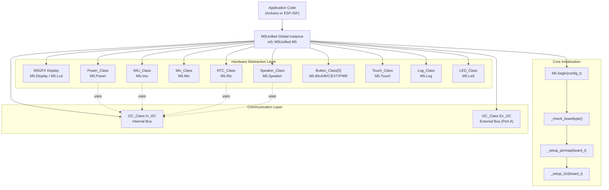

**M5Unified Class Hierarchy**
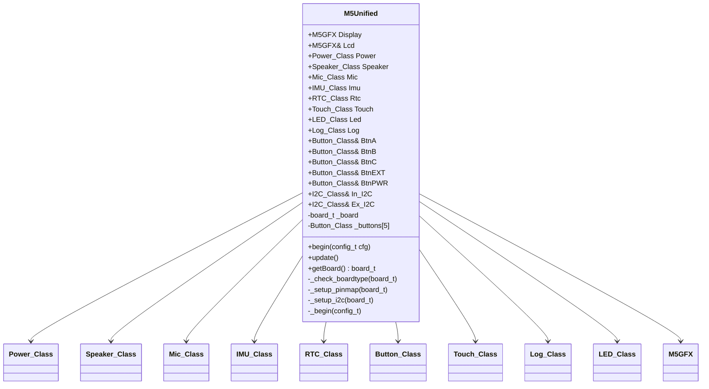

**Sources:** [src/M5Unified.hpp:80-658](), [src/M5Unified.cpp:44-45](), [README.md:1-13]()

---

## Global Instance and Usage Pattern

M5Unified exposes a single global instance `M5` that applications use to access all functionality:

```cpp
// Global instance declaration
extern m5::M5Unified M5;
```

The typical application structure follows this pattern:

1. **Include M5Unified.h** - This brings in all subsystems
2. **Call M5.begin()** - Initializes hardware with auto-detection
3. **Call M5.update()** - Regular polling in main loop for buttons/touch
4. **Access subsystems** - Via public members like `M5.Display`, `M5.Power`, etc.

**Configuration Structure**

The `config_t` structure allows selective initialization of subsystems:

| Configuration Field | Type | Default | Description |
|---------------------|------|---------|-------------|
| `serial_baudrate` | uint32_t | 0 | Serial port baud rate (0=disabled) |
| `clear_display` | bool | true | Clear screen during initialization |
| `output_power` | bool | true | Enable 5V output to external ports |
| `pmic_button` | bool | true | Use PMIC button as BtnPWR |
| `internal_imu` | bool | true | Enable internal IMU |
| `internal_rtc` | bool | true | Enable internal RTC |
| `internal_mic` | bool | true | Enable microphone |
| `internal_spk` | bool | true | Enable speaker |
| `external_imu` | bool | false | Enable Unit IMU |
| `external_rtc` | bool | false | Enable Unit RTC |
| `external_display` | bitfield | 0xFFFF | Auto-detect external displays |
| `external_speaker` | bitfield | 0x00 | Enable external speaker modules |
| `led_brightness` | uint8_t | 0 | System LED brightness (0-255) |
| `fallback_board` | board_t | platform-specific | Board type if auto-detect fails |

**Sources:** [src/M5Unified.hpp:83-213](), [examples/Basic/HowToUse/HowToUse.ino:71-186]()

---

## Supported Hardware Platforms

M5Unified supports devices across five ESP32 microcontroller families:

**ESP32 (Original)**
- M5Stack (BASIC/GRAY/GO/FIRE), M5Stack Core2, M5Tough
- M5StickC, M5StickCPlus, M5StickCPlus2
- M5StackCoreInk, M5Paper, M5Station, M5TimerCam
- M5ATOM (Lite/Matrix/ECHO/PSRAM/U), M5STAMP PICO

**ESP32-S3**
- M5Stack CoreS3, CoreS3SE
- M5StickS3
- M5ATOMS3 (base/Lite/U/R variants)
- M5Dial, M5DinMeter, M5Capsule, M5Cardputer, M5VAMeter
- M5PaperS3, M5PowerHub, M5STAMPS3

**ESP32-C3**
- M5STAMPC3, M5STAMPC3U

**ESP32-C6**
- M5NanoC6, M5UnitC6L, Arduino NessoN1

**ESP32-P4**
- M5Tab5

Each board has unique pin assignments, power management configurations, and peripheral availability, all managed transparently by M5Unified's runtime detection system.

**Sources:** [README.md:49-87](), [library.json:3](), [library.properties:5]()

---

## Pin Mapping System

M5Unified abstracts board-specific GPIO assignments through a unified pin naming system. Applications query pin numbers using the `pin_name_t` enumeration rather than hardcoding GPIO numbers:

**Pin Name Categories**

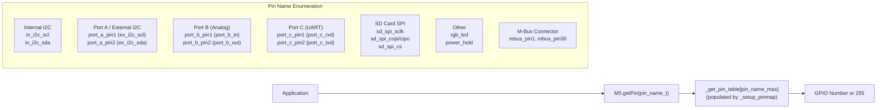

**Pin Mapping Implementation**

Pin mappings are stored in compile-time constant tables organized by board type. During initialization, `_setup_pinmap()` copies the appropriate board's pin assignments into the runtime lookup table:

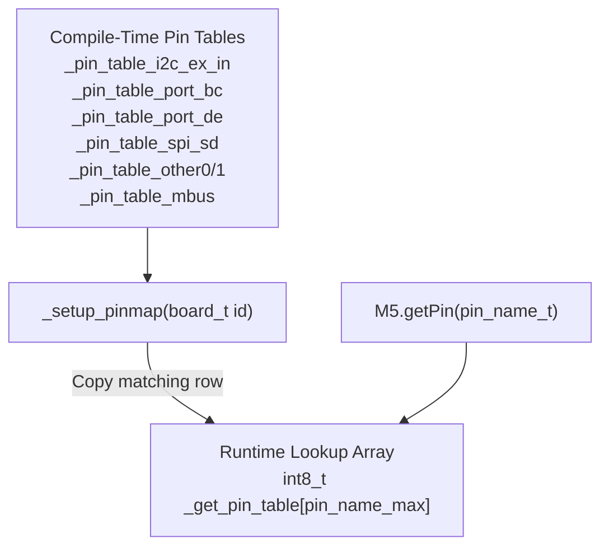

**Example Pin Table Structure**
```cpp
// From src/M5Unified.cpp:73-116
static constexpr const uint8_t _pin_table_i2c_ex_in[][5] = {
    // board_type,    In_SCL,      In_SDA,       Ex_SCL,      Ex_SDA
    { board_M5StackCoreS3, GPIO_NUM_11, GPIO_NUM_12,  GPIO_NUM_1,  GPIO_NUM_2  },
    { board_M5StickS3,     GPIO_NUM_48, GPIO_NUM_47,  GPIO_NUM_10, GPIO_NUM_9  },
    { board_M5Stack,       GPIO_NUM_22, GPIO_NUM_21,  GPIO_NUM_22, GPIO_NUM_21 },
    { board_unknown,       GPIO_NUM_39, GPIO_NUM_38,  GPIO_NUM_1,  GPIO_NUM_2  },
};
```

**Sources:** [src/M5Unified.hpp:26-53](), [src/M5Unified.cpp:62-349](), [src/M5Unified.cpp:328-348]()

---

## Display Management and M5GFX Integration

M5Unified depends on the **M5GFX** library for all display operations. M5GFX is a separate library that provides:
- Hardware-accelerated graphics rendering
- Multiple display driver support
- Font rendering and text handling
- Sprite/canvas operations
- Touch coordinate processing

**Display Architecture**

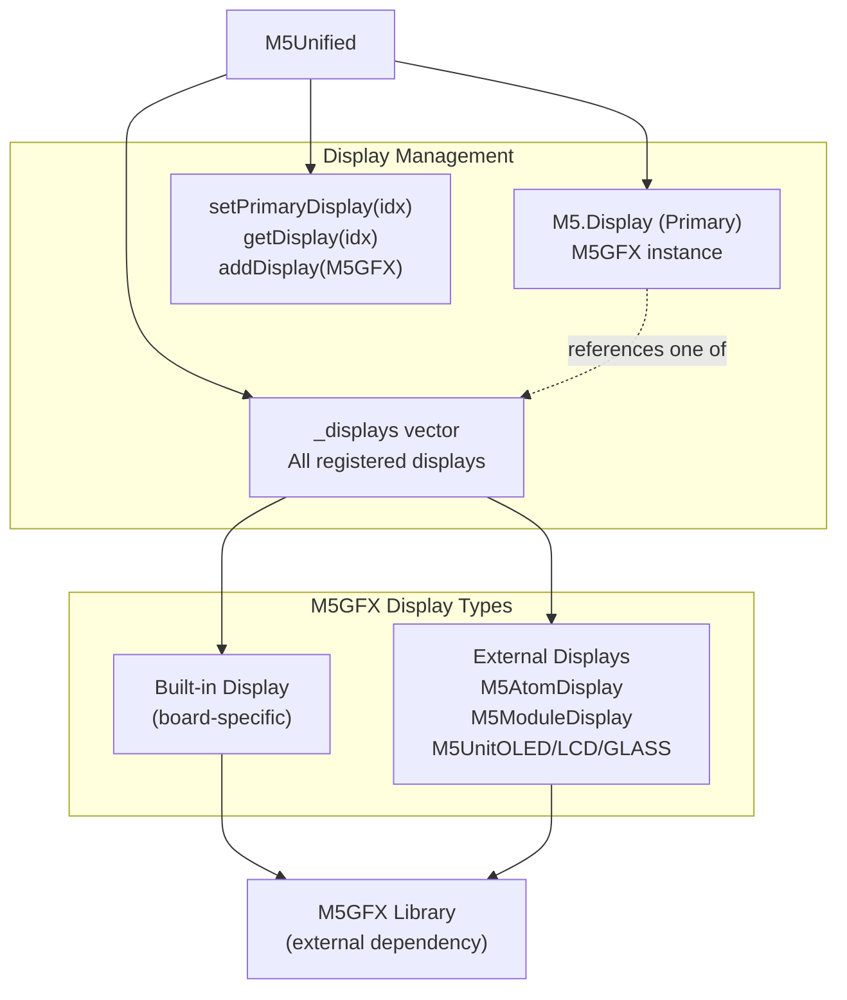

**Multi-Display Support**

M5Unified can manage multiple displays simultaneously:
- Built-in display (automatically detected)
- Module Display (HDMI output for M5Stack/CoreS3)
- ATOM Display (HDMI output for ATOM series)
- Unit LCD/OLED/GLASS (I2C displays)
- Unit RCA (composite video output)

The `Display` member always references the primary display, while `Displays(idx)` or `getDisplay(idx)` access specific displays by index.

**Display Initialization Flow**

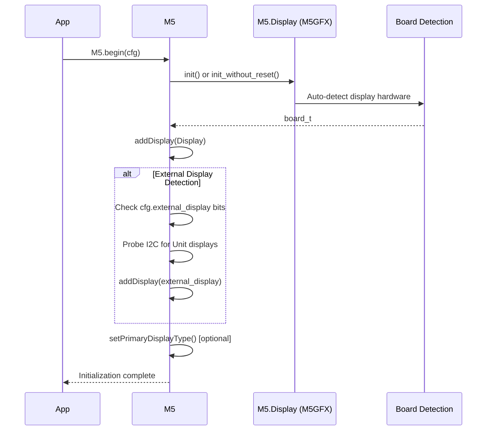

**Sources:** [src/M5Unified.hpp:19](), [src/M5Unified.hpp:215-280](), [src/M5Unified.cpp:358-603](), [README.md:7]()

---

## Initialization Sequence

The `M5.begin()` method orchestrates a multi-stage initialization process that adapts to the detected hardware platform:

**Stage 1: Board Detection**
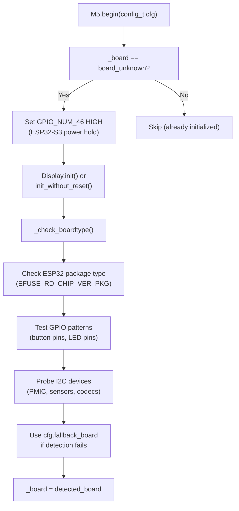

**Stage 2: Platform Configuration**
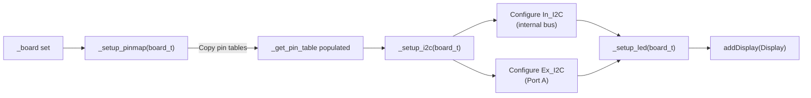

**Stage 3: Subsystem Initialization**
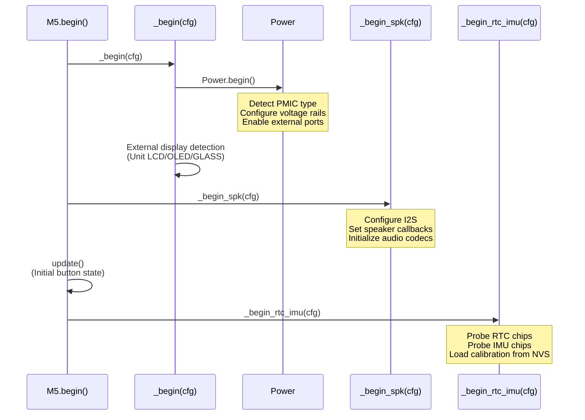

**Configuration Priority and Safety**

The initialization system implements several safety mechanisms:
1. **Single initialization**: `begin()` returns early if `_board != board_unknown`
2. **Power hold**: ESP32-S3 devices assert GPIO_NUM_46 to prevent power-off during boot
3. **Display preservation**: `cfg.clear_display=false` allows init without screen reset
4. **Fallback mechanism**: Uses `cfg.fallback_board` if detection fails
5. **Deferred initialization**: Some displays detected after external power enabled

**Sources:** [src/M5Unified.hpp:323-603](), [src/M5Unified.cpp:971-1887](), [src/M5Unified.cpp:2348-2823]()

---

## Subsystem Architecture Summary

The following table summarizes the major subsystems and their code locations:

| Subsystem | Public API | Header File | Implementation Complexity |
|-----------|-----------|-------------|--------------------------|
| **Power Management** | `M5.Power` | [utility/Power_Class.hpp]() | High - Multiple PMIC types, battery monitoring, sleep modes |
| **Audio Output** | `M5.Speaker` | [utility/Speaker_Class.hpp]() | High - I2S configuration, 8-channel mixer, board-specific codecs |
| **Audio Input** | `M5.Mic` | [utility/Mic_Class.hpp]() | Medium - I2S capture, oversampling, noise filtering |
| **IMU** | `M5.Imu` | [utility/IMU_Class.hpp]() | Medium - Polymorphic driver selection, calibration, NVS persistence |
| **RTC** | `M5.Rtc` | [utility/RTC_Class.hpp]() | Medium - Polymorphic driver selection, system time sync |
| **Buttons** | `M5.BtnA/B/C/EXT/PWR` | [utility/Button_Class.hpp]() | Medium - State machine, debouncing, multi-source input |
| **Touch** | `M5.Touch` | [utility/Touch_Class.hpp]() | Low - Coordinate reading, virtual button regions |
| **Display** | `M5.Display` | [M5GFX.h (external)]() | External - M5GFX library dependency |
| **Logging** | `M5.Log` | [utility/Log_Class.hpp]() | Low - Multi-target output, log levels |
| **LED** | `M5.Led` | [utility/LED_Class.hpp]() | Low - RGB LED or system LED control |

**Subsystem Communication Patterns**

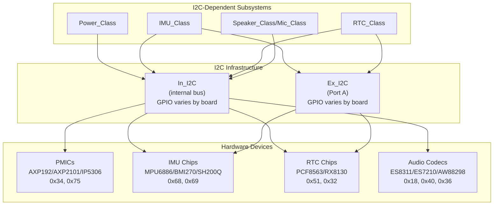

Each subsystem provides its own detailed API for accessing hardware features. For detailed documentation on specific subsystems, refer to their individual wiki pages.

**Sources:** [src/M5Unified.hpp:215-226](), [src/M5Unified.hpp:57-66]()

---

## Update Loop and Event Processing

Applications must call `M5.update()` regularly (typically in the Arduino `loop()` function) to maintain button states and process touch input:

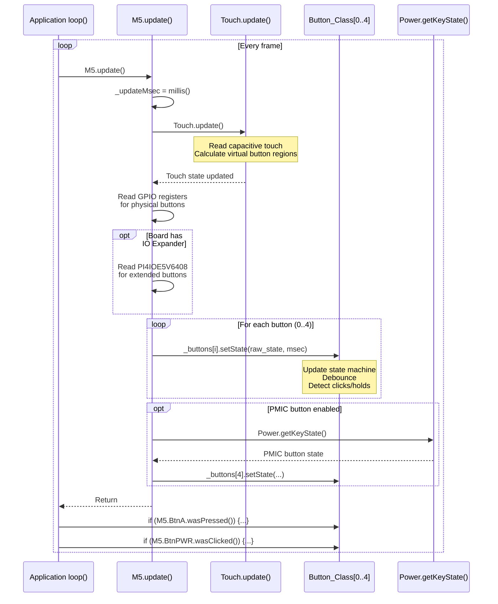

**Button State Query Methods**

| Method | Description | Available For |
|--------|-------------|---------------|
| `isPressed()` | Current state (true while held) | BtnA/B/C/EXT/PWR (CoreInk) |
| `wasPressed()` | Edge detection (true once on press) | BtnA/B/C/EXT/PWR (CoreInk) |
| `isReleased()` | Current state (true while not held) | BtnA/B/C/EXT/PWR (CoreInk) |
| `wasReleased()` | Edge detection (true once on release) | BtnA/B/C/EXT/PWR (CoreInk) |
| `wasClicked()` | Short press detected | All buttons |
| `wasHold()` | Long press detected | All buttons |
| `isHolding()` | Currently holding | BtnA/B/C/EXT/PWR (CoreInk) |
| `wasDecideClickCount()` | Multi-click count determined | BtnA/B/C/EXT/PWR (CoreInk) |
| `getClickCount()` | Number of clicks in sequence | All buttons |

**Sources:** [src/M5Unified.hpp:320](), [src/M5Unified.cpp:2825-2955](), [examples/Basic/HowToUse/HowToUse.ino:359-484]()

---

## Library Dependencies and Build System

**Primary Dependency: M5GFX**

M5Unified has a mandatory dependency on the M5GFX library (version ≥0.2.19):

```json
// From library.json:13-18
"dependencies": [
  {
    "name": "M5GFX",
    "version": ">=0.2.19"
  }
]
```

M5GFX must be included before M5Unified.h in application code. Optional filesystem headers (SD.h, LittleFS.h, SPIFFS.h) should also be included before M5GFX if needed.

**Optional Display Headers**

External display support requires including the appropriate M5GFX display headers before M5Unified.h:

```cpp
// Optional external displays - include before M5Unified.h
#include <M5AtomDisplay.h>     // HDMI for ATOM series
#include <M5ModuleDisplay.h>   // HDMI for M5Stack series
#include <M5ModuleRCA.h>       // Composite video
#include <M5UnitGLASS.h>       // I2C OLED displays
#include <M5UnitGLASS2.h>
#include <M5UnitOLED.h>
#include <M5UnitMiniOLED.h>
#include <M5UnitLCD.h>
#include <M5UnitRCA.h>         // Composite video

#include <M5Unified.h>         // Always include last
```

**Build System Metadata**

| Property | Value |
|----------|-------|
| Library Name | M5Unified |
| Current Version | 0.2.13 |
| Supported Frameworks | Arduino, ESP-IDF |
| Supported Platforms | espressif32, native (PC build) |
| Main Header | M5Unified.h |
| Category | Display |

**Version Information**

Version numbers are defined in [src/gitTagVersion.h:1-4]() and follow semantic versioning:
```cpp
#define M5UNIFIED_VERSION_MAJOR 0
#define M5UNIFIED_VERSION_MINOR 2
#define M5UNIFIED_VERSION_PATCH 13
```

**Sources:** [library.json:1-23](), [library.properties:1-11](), [src/gitTagVersion.h:1-4](), [examples/Basic/HowToUse/HowToUse.ino:1-58]()

---

## Board Detection Mechanism

The `_check_boardtype()` function implements a three-stage detection algorithm to identify the runtime hardware platform:

**Detection Strategy**

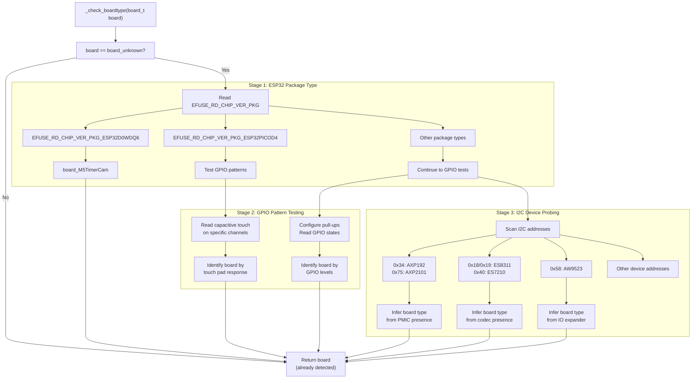

**Platform-Specific Detection**

Different ESP32 variants use different detection strategies:

**ESP32 (Original)**
- Package type distinguishes M5TimerCam (D0WDQ6) vs others (PICOD4)
- Capacitive touch pad readings identify StickC/CPlus variants
- GPIO pull-up/pull-down patterns identify different ATOM variants
- TF card CS pin testing distinguishes M5Stack from Core2

**ESP32-S3**
- GPIO voltage readings identify different variants
- I2C device scanning (AW9523, ES7210, AXP2101) determines board type
- Camera pin detection identifies ATOMS3R variants

**ESP32-C3**
- Limited to StampC3 variants
- Button GPIO location identifies C3 vs C3U

**ESP32-C6**
- I2C device presence distinguishes UnitC6L from NanoC6/NessoN1

**ESP32-P4**
- Currently only M5Tab5 supported

**Key Detection Points**

The following I2C addresses are probed during detection:

| Address | Device | Used By |
|---------|--------|---------|
| 0x34 | AXP192 PMIC | Core2, StickC/CPlus, Station |
| 0x75 | AXP2101 PMIC | Core2 v1.1, CoreS3 |
| 0x6E | M5PM1/PY32 PMIC | StickS3, others |
| 0x18/0x19 | ES8311 Audio Codec | StickS3, Cardputer |
| 0x40 | ES7210 Audio Codec | CoreS3 |
| 0x36 | AW88298 Audio Amp | CoreS3 |
| 0x58 | AW9523 IO Expander | CoreS3 |
| 0x50 | PowerHub Protocol | PowerHub |

**Sources:** [src/M5Unified.cpp:971-1887](), [README.md:114-213]()

---

## Summary

M5Unified provides a unified abstraction layer that enables single-source applications to run across the entire M5Stack hardware ecosystem. Key architectural features include:

1. **Central Orchestrator**: Single `M5` global instance provides access to all subsystems
2. **Runtime Detection**: Automatic board identification without compile-time configuration
3. **Pin Abstraction**: Named pin lookup eliminates hardcoded GPIO numbers
4. **Polymorphic Drivers**: Runtime selection of appropriate PMIC, IMU, and RTC drivers
5. **Display Management**: Multi-display support with M5GFX integration
6. **Consistent API**: Same code works across 19+ device types

The initialization sequence automatically detects hardware, configures pin mappings, initializes subsystems, and provides a consistent API regardless of the underlying platform. Applications interact with hardware through well-defined class interfaces (`Power`, `Speaker`, `Imu`, etc.) that abstract hardware differences.

For detailed information about specific subsystems, refer to their dedicated wiki pages using the links provided in the "Purpose and Scope" section.

**Sources:** [README.md:1-47](), [src/M5Unified.hpp:1-658](), [src/M5Unified.cpp:1-3600]()