M5Unified MP3 File Playback

# MP3 File Playback

<details>
<summary>Relevant source files</summary>

The following files were used as context for generating this wiki page:

- [examples/Advanced/Bluetooth_with_ESP32A2DP/Bluetooth_with_ESP32A2DP.ino](examples/Advanced/Bluetooth_with_ESP32A2DP/Bluetooth_with_ESP32A2DP.ino)
- [examples/Advanced/MP3_with_ESP8266Audio/MP3_with_ESP8266Audio.ino](examples/Advanced/MP3_with_ESP8266Audio/MP3_with_ESP8266Audio.ino)
- [examples/Basic/Speaker/Speaker.ino](examples/Basic/Speaker/Speaker.ino)

</details>


This page documents the MP3 file playback functionality demonstrated in the Advanced examples, specifically explaining the integration between the ESP8266Audio library and M5Unified's audio system. The example shows how to create an adapter class that bridges external audio libraries to M5Unified's `Speaker_Class`, implements triple buffering for smooth playback, and handles SD card file operations with ID3 metadata parsing.

For Bluetooth audio streaming using A2DP, see [Bluetooth Audio Streaming](#9.1). For general audio system architecture and the underlying I2S implementation, see [Audio System Architecture](#4). For FFT-based audio visualization techniques, see [Audio Visualization with FFT](#9.4).

## System Overview

The MP3 playback system integrates the ESP8266Audio library with M5Unified's audio infrastructure through an adapter pattern. The ESP8266Audio library provides MP3 decoding capabilities, while M5Unified handles the actual audio output through its I2S-based speaker system.

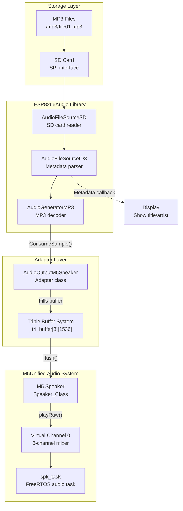

**Diagram: MP3 Playback Data Flow Architecture**

Sources: [examples/Advanced/MP3_with_ESP8266Audio/MP3_with_ESP8266Audio.ino:1-512]()

## AudioOutputM5Speaker Adapter Class

The `AudioOutputM5Speaker` class serves as the bridge between ESP8266Audio's `AudioOutput` interface and M5Unified's `Speaker_Class`. It implements the required virtual methods to receive decoded audio samples and route them to the M5 speaker system.

### Class Definition and Responsibilities

| Responsibility | Method | Description |
|---|---|---|
| Interface Implementation | `ConsumeSample()` | Receives stereo samples from MP3 decoder |
| Buffer Management | `flush()` | Sends complete buffer to speaker |
| Playback Control | `stop()` | Halts playback and clears buffers |
| Data Access | `getBuffer()` | Provides buffer access for FFT visualization |

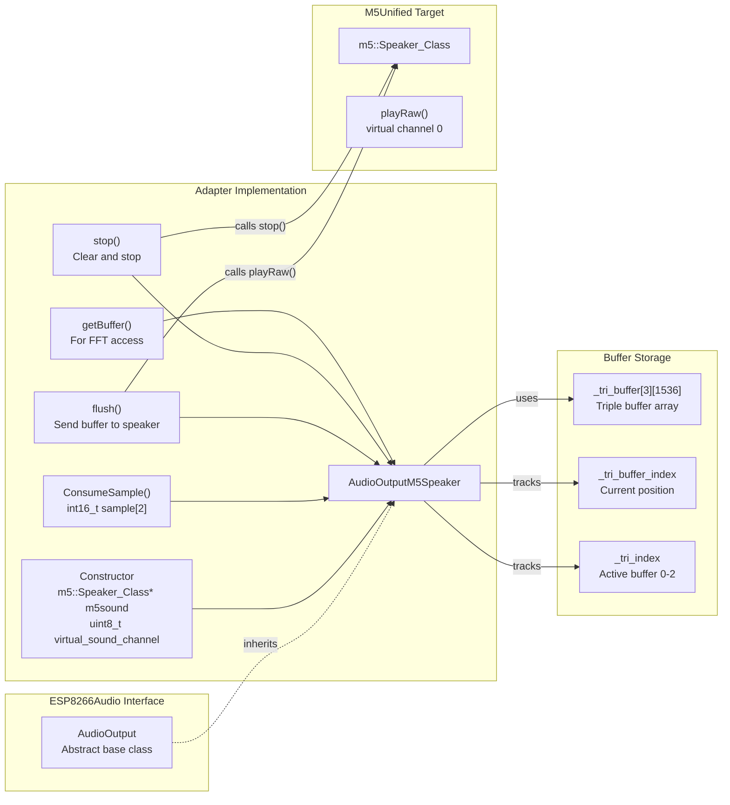

**Diagram: AudioOutputM5Speaker Adapter Architecture**

Sources: [examples/Advanced/MP3_with_ESP8266Audio/MP3_with_ESP8266Audio.ino:28-77]()

### Constructor and Initialization

The constructor accepts a pointer to `m5::Speaker_Class` and an optional virtual channel identifier (0-7):

```
AudioOutputM5Speaker(m5::Speaker_Class* m5sound, uint8_t virtual_sound_channel = 0)
```

The virtual channel parameter allows multiple audio sources to be mixed through M5Unified's 8-channel audio mixer system. The example uses channel 0 by default.

Sources: [examples/Advanced/MP3_with_ESP8266Audio/MP3_with_ESP8266Audio.ino:31-35]()

### Sample Consumption Process

The `ConsumeSample()` method is called by the MP3 decoder for each decoded stereo sample pair. It accumulates samples into the active buffer until the buffer is full:

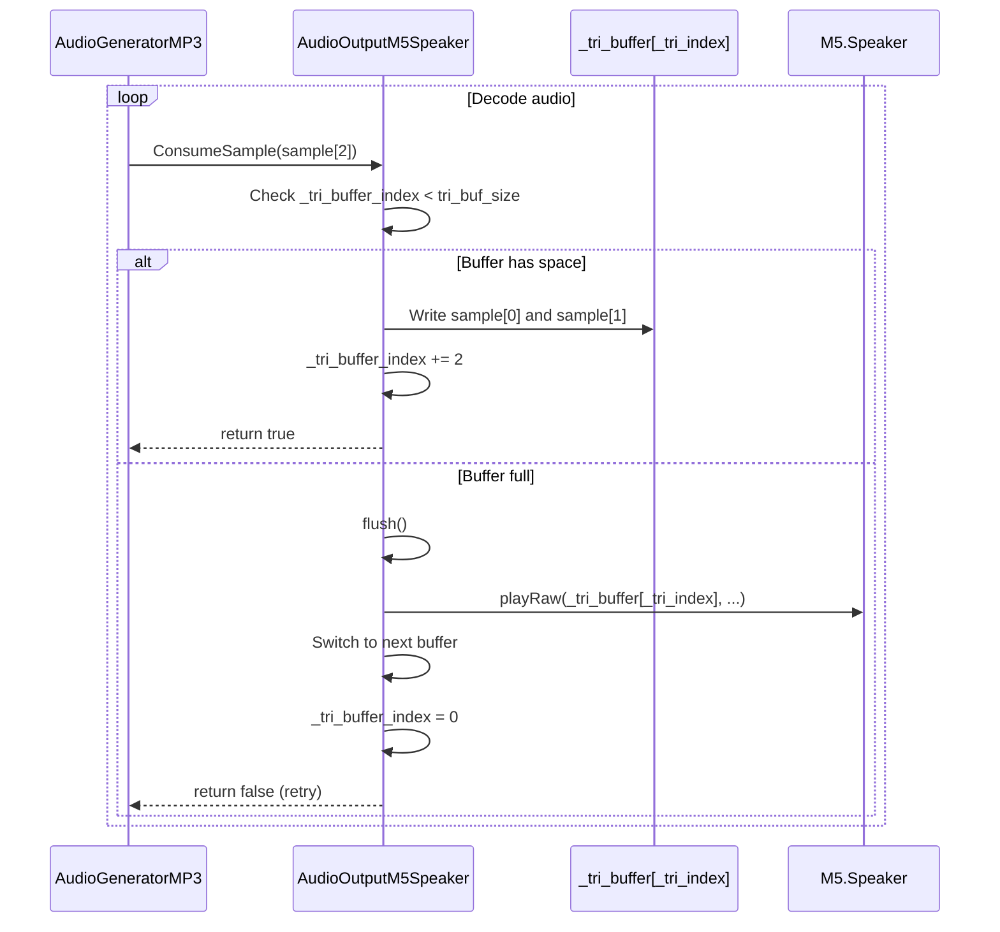

**Diagram: Sample Consumption Sequence**

The method stores the left channel in position `_tri_buffer_index` and right channel in `_tri_buffer_index+1`, then increments the index by 2. When the buffer reaches capacity (1536 samples = 768 stereo pairs), `flush()` is called.

Sources: [examples/Advanced/MP3_with_ESP8266Audio/MP3_with_ESP8266Audio.ino:38-51]()

## Triple Buffering Strategy

The adapter employs a triple buffering mechanism to ensure continuous, glitch-free audio playback. This prevents audio stutter that would occur if the decoder had to wait for the speaker to consume the previous buffer.

### Buffer Configuration

| Parameter | Value | Purpose |
|---|---|---|
| Buffer count | 3 | One filling, one playing, one ready |
| Buffer size | 1536 samples | 768 stereo pairs |
| Data type | `int16_t` | 16-bit signed PCM |
| Total memory | 9,216 bytes | 3 × 1536 × 2 bytes |

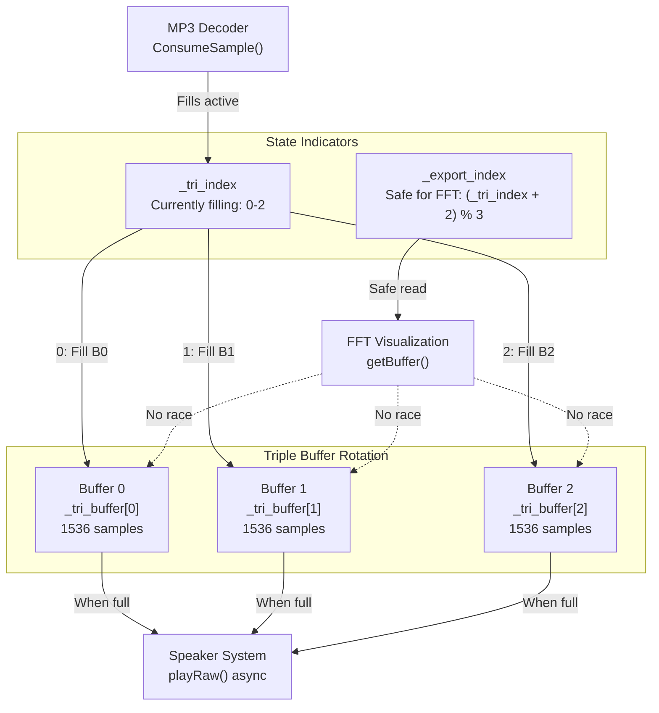

**Diagram: Triple Buffer State Management**

### Buffer Rotation Logic

The `flush()` method handles buffer rotation when a buffer is full:

1. Calls `playRaw()` with current buffer pointer and sample count
2. Advances `_tri_index` to next buffer: `_tri_index < 2 ? _tri_index + 1 : 0`
3. Resets `_tri_buffer_index` to 0 for the new buffer
4. The speaker system processes the submitted buffer asynchronously

The third buffer serves as a stable read source for FFT visualization. The `getBuffer()` method returns `_tri_buffer[(_tri_index + 2) % 3]`, which is guaranteed to be at least two cycles behind the filling buffer, preventing race conditions.

Sources: [examples/Advanced/MP3_with_ESP8266Audio/MP3_with_ESP8266Audio.ino:52-68](), [examples/Advanced/MP3_with_ESP8266Audio/MP3_with_ESP8266Audio.ino:73-76]()

## SD Card Integration and File Management

The MP3 playback system reads audio files from an SD card connected via SPI. The example demonstrates file selection, opening, and sequential playback.

### SD Card Initialization

The SD card must be initialized before file operations can begin. The example uses GPIO 4 for the chip select pin and a 25 MHz SPI clock:

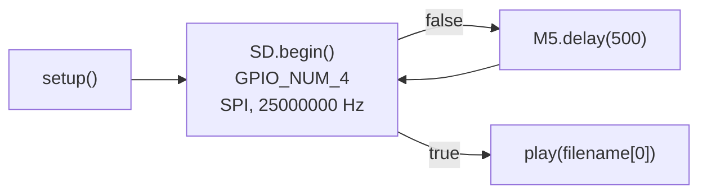

**Diagram: SD Card Initialization Loop**

The initialization loop continues retrying with 500ms delays until the SD card is successfully mounted. This handles cases where the card may not be immediately ready after power-on.

Sources: [examples/Advanced/MP3_with_ESP8266Audio/MP3_with_ESP8266Audio.ino:470-473]()

### File Management Structure

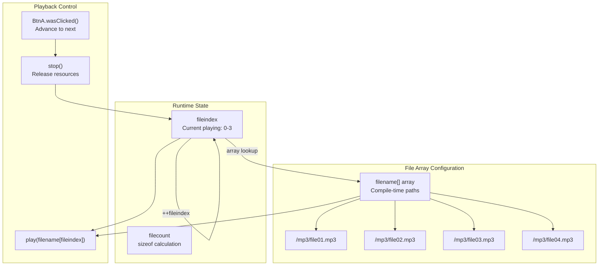

**Diagram: File Selection and Playback Control**

The example uses a compile-time array of file paths and a runtime index to track the currently playing file. Button A advances to the next file in the array with wraparound.

Sources: [examples/Advanced/MP3_with_ESP8266Audio/MP3_with_ESP8266Audio.ino:19-26](), [examples/Advanced/MP3_with_ESP8266Audio/MP3_with_ESP8266Audio.ino:494-500]()

### Play and Stop Functions

The `play()` function orchestrates the setup of the audio pipeline:

1. Calls `stop()` if a file is already playing
2. Opens the file with `AudioFileSourceSD`
3. Creates `AudioFileSourceID3` wrapper for metadata extraction
4. Registers metadata callback for display updates
5. Begins MP3 generation with `mp3.begin()`

The `stop()` function performs cleanup:

1. Calls `out.stop()` to flush and halt audio output
2. Calls `mp3.stop()` to terminate decoding
3. Unregisters metadata callback
4. Closes file handles
5. Deletes the dynamically allocated `AudioFileSourceID3` object

Sources: [examples/Advanced/MP3_with_ESP8266Audio/MP3_with_ESP8266Audio.ino:202-223]()

## ID3 Metadata Handling

The example extracts ID3 tags from MP3 files and displays track information on screen. This provides visual feedback about the currently playing audio.

### Metadata Callback Mechanism

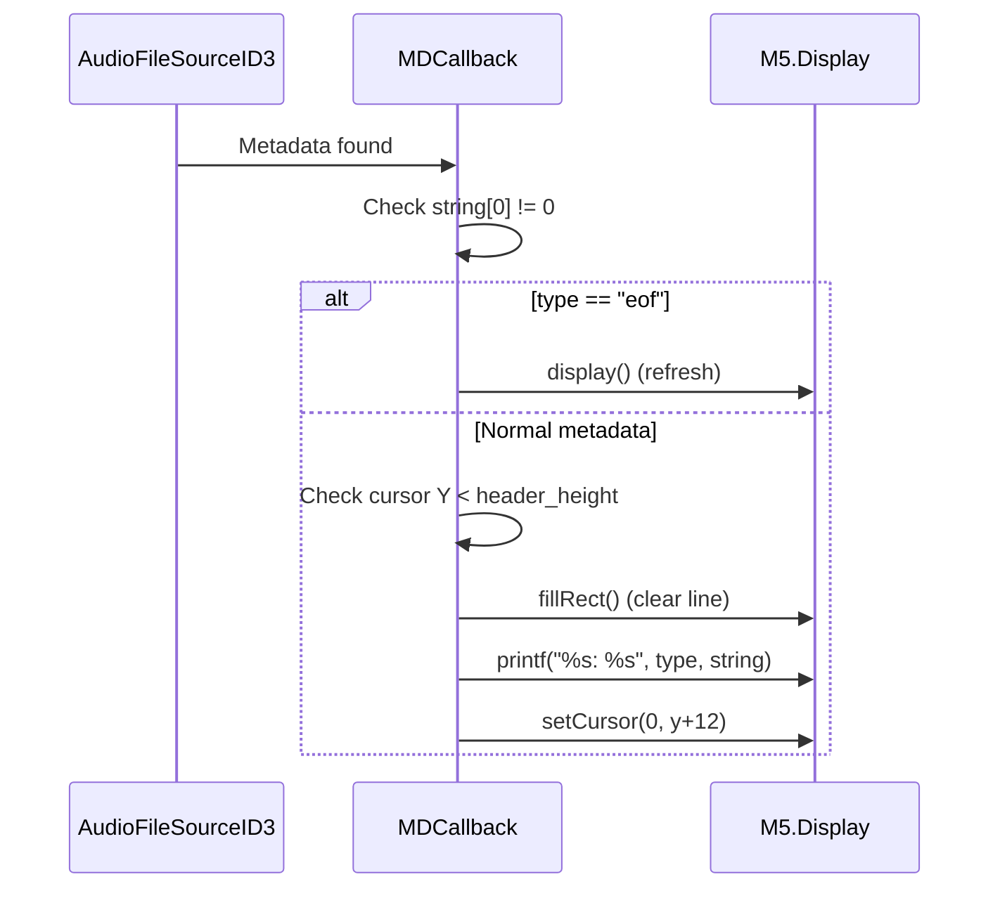

**Diagram: ID3 Metadata Display Sequence**

The `MDCallback()` function is registered with the ID3 parser and receives three parameters:

- `cbData`: User-defined callback data pointer (unused in this example)
- `type`: Metadata field name (e.g., "Title", "Artist", "Album")
- `isUnicode`: Flag indicating UTF-16 encoding (not used here)
- `string`: Null-terminated text content

The callback displays each metadata field on a separate line in the header area, clearing the previous content to prevent visual artifacts. The special type "eof" triggers a display refresh when parsing completes.

Sources: [examples/Advanced/MP3_with_ESP8266Audio/MP3_with_ESP8266Audio.ino:186-200]()

### Metadata Registration Flow

The metadata callback is registered when opening a file and unregistered during cleanup:

| Function | Action | Line Reference |
|---|---|---|
| `play()` | `id3->RegisterMetadataCB(MDCallback, (void*)"ID3TAG")` | Line 220 |
| `stop()` | `id3->RegisterMetadataCB(nullptr, nullptr)` | Line 207 |

This ensures that metadata updates only occur during active playback and prevents callbacks after resources are freed.

Sources: [examples/Advanced/MP3_with_ESP8266Audio/MP3_with_ESP8266Audio.ino:207-220]()

## Audio Data Flow Pipeline

The complete audio data flow from SD card to speaker output involves multiple stages of processing and buffering.

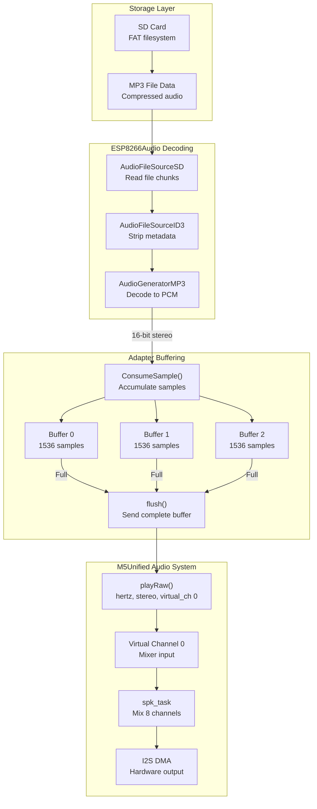

**Diagram: Complete Audio Data Flow Pipeline**

Sources: [examples/Advanced/MP3_with_ESP8266Audio/MP3_with_ESP8266Audio.ino:1-512]()

### Main Loop Processing

The example's `loop()` function drives the MP3 decoder and handles user input:

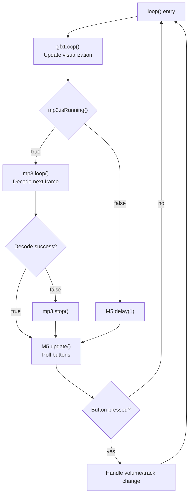

**Diagram: Main Loop Processing Flow**

The `mp3.loop()` call performs a single decode iteration, which may call `ConsumeSample()` multiple times. The method returns `false` when the end of file is reached, triggering automatic playback termination.

Sources: [examples/Advanced/MP3_with_ESP8266Audio/MP3_with_ESP8266Audio.ino:480-511]()

## Initialization and Configuration

The initialization sequence prepares the audio system, SD card, and display subsystems for MP3 playback.

### Speaker Configuration

The example applies custom speaker settings to optimize audio quality:

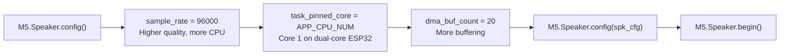

**Diagram: Speaker Configuration Parameters**

| Parameter | Default | Example Value | Impact |
|---|---|---|---|
| `sample_rate` | 64000 Hz | 96000 Hz | Higher quality, increased CPU load |
| `task_pinned_core` | PRO_CPU_NUM | APP_CPU_NUM | Runs on Core 1 |
| `dma_buf_count` | 8 | 20 | More buffering, less underruns |

The increased sample rate of 96 kHz provides better audio fidelity at the cost of higher CPU usage. The additional DMA buffers (20 instead of 8) reduce the likelihood of audio glitches during system load spikes.

Sources: [examples/Advanced/MP3_with_ESP8266Audio/MP3_with_ESP8266Audio.ino:460-465]()

### External Speaker Configuration

The example demonstrates enabling external speaker modules through the configuration structure:

```
auto cfg = M5.config();
cfg.external_speaker.hat_spk = true;        // HAT Speaker
cfg.external_speaker.atomic_spk = true;     // ATOMIC Speaker
// cfg.external_speaker.module_display = true;  // Module Display
// cfg.external_speaker.module_rca = true;      // Module RCA
// cfg.external_speaker.hat_spk2 = true;        // HAT Speaker2
M5.begin(cfg);
```

These settings inform M5Unified to initialize the appropriate audio codec and enable circuitry for attached speaker modules. The example enables HAT Speaker and ATOMIC Speaker by default.

Sources: [examples/Advanced/MP3_with_ESP8266Audio/MP3_with_ESP8266Audio.ino:440-457]()

## Playback Control and User Interface

The example provides button-based controls for volume adjustment and track navigation.

### Button Control Mapping

| Button | Action | Function |
|---|---|---|
| BtnA single click | Next track | `stop()` + `play(filename[++fileindex])` |
| BtnA hold | Volume down | `setVolume(v - 1)` per frame |
| BtnB press | Volume down | `setVolume(v - 1)` |
| BtnC press | Volume up | `setVolume(v + 1)` |

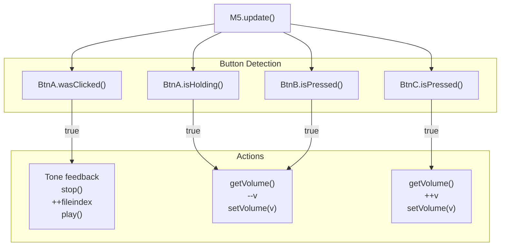

**Diagram: Button Input Processing**

The tone feedback (`M5.Speaker.tone(1000, 100)`) provides audio confirmation when changing tracks. Volume adjustments occur every frame when buttons are held, allowing smooth volume ramping.

Sources: [examples/Advanced/MP3_with_ESP8266Audio/MP3_with_ESP8266Audio.ino:493-510]()

### Volume Bar Visualization

The display system renders a dynamic volume indicator at the top of the screen that updates whenever the volume changes. This provides visual feedback synchronized with the audio level.

Sources: [examples/Advanced/MP3_with_ESP8266Audio/MP3_with_ESP8266Audio.ino:283-294]()

## FFT Visualization Integration

The MP3 playback example includes real-time FFT visualization identical to the Bluetooth A2DP example. The `fft_t` class and visualization code are duplicated between both examples.

The visualization accesses audio data through the `getBuffer()` method, which returns a pointer to the stable triple buffer. The FFT processing occurs in the main loop during idle time when the display is not busy, ensuring smooth visual updates without blocking audio playback.

For detailed documentation of the FFT implementation, spectrum rendering, and waveform display, see [Audio Visualization with FFT](#9.4).

Sources: [examples/Advanced/MP3_with_ESP8266Audio/MP3_with_ESP8266Audio.ino:80-168](), [examples/Advanced/MP3_with_ESP8266Audio/MP3_with_ESP8266Audio.ino:279-436]()

## Performance Considerations

Several design decisions in the adapter implementation optimize for smooth, continuous playback:

### Buffer Sizing

The 1536-sample buffer size provides approximately 16ms of audio at 96 kHz sample rate (768 stereo pairs). This balances memory usage against latency requirements. Smaller buffers risk underruns during system load spikes; larger buffers increase latency and memory consumption.

### Asynchronous Playback

The `playRaw()` method queues audio data asynchronously to the speaker's virtual channel mixer. The triple buffer system ensures that the MP3 decoder can continue filling the next buffer while the speaker system processes the previous buffer, eliminating synchronization bottlenecks.

### Loop Iteration Strategy

The main loop calls `mp3.loop()` continuously when playback is active, but adds a 1ms delay when idle. This prevents tight-looping on the CPU while allowing rapid response to playback start commands.

Sources: [examples/Advanced/MP3_with_ESP8266Audio/MP3_with_ESP8266Audio.ino:480-491]()