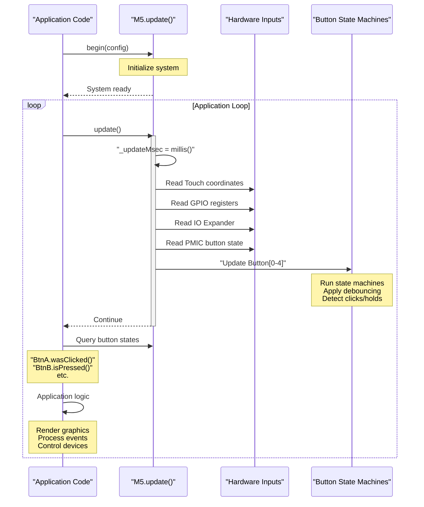
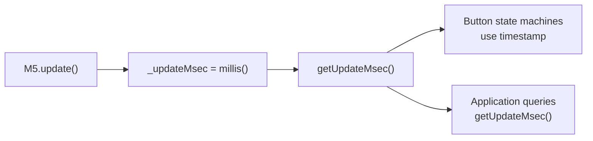
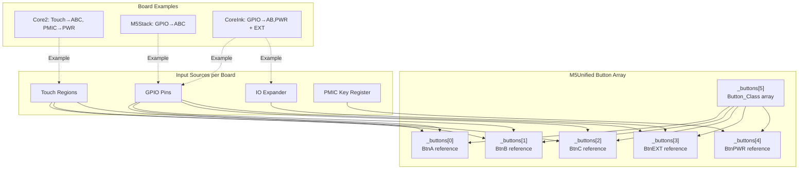
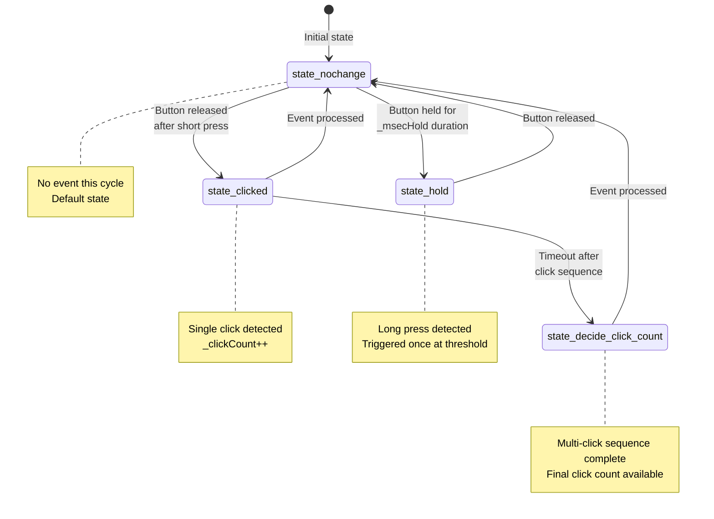
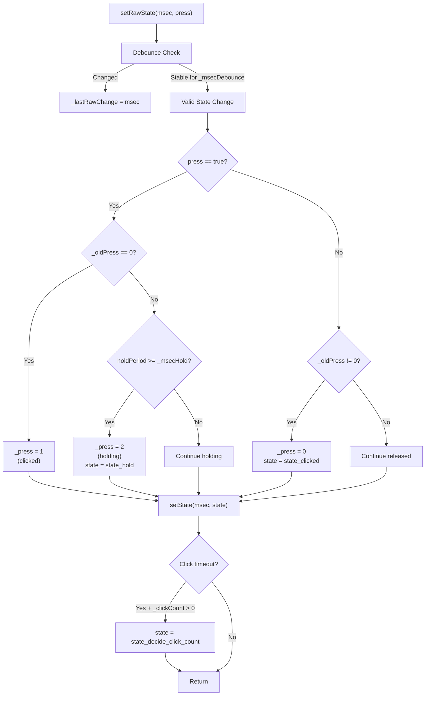
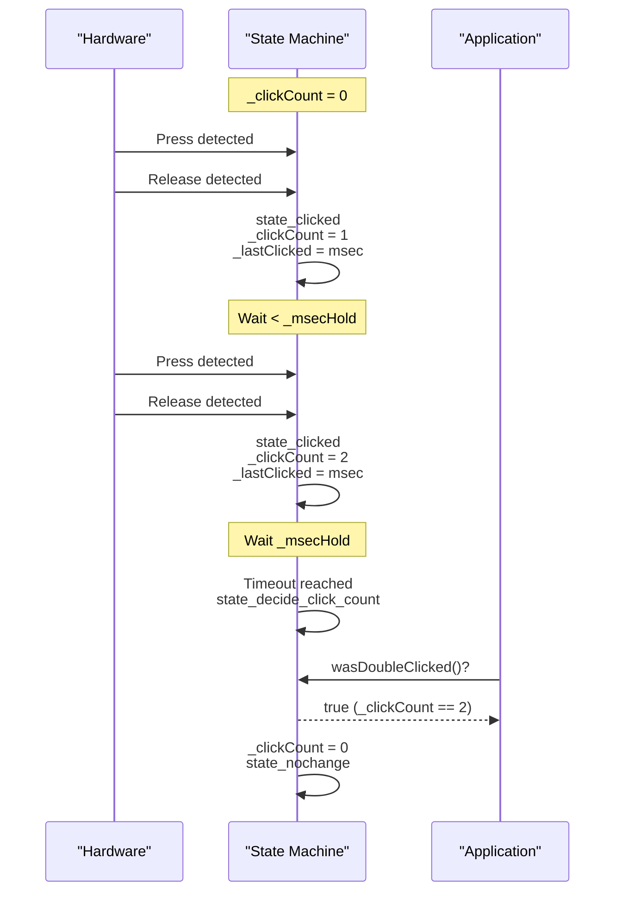
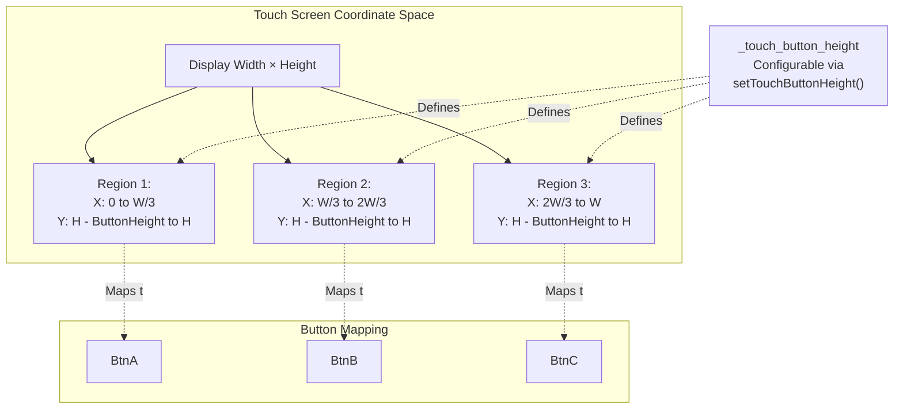
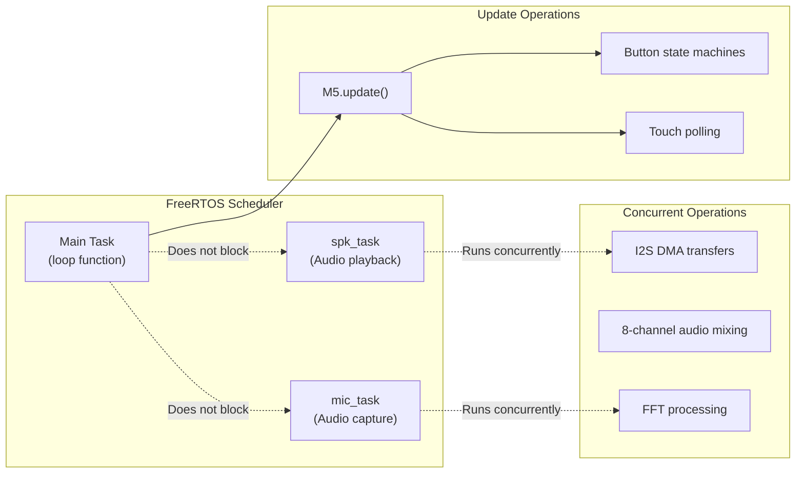
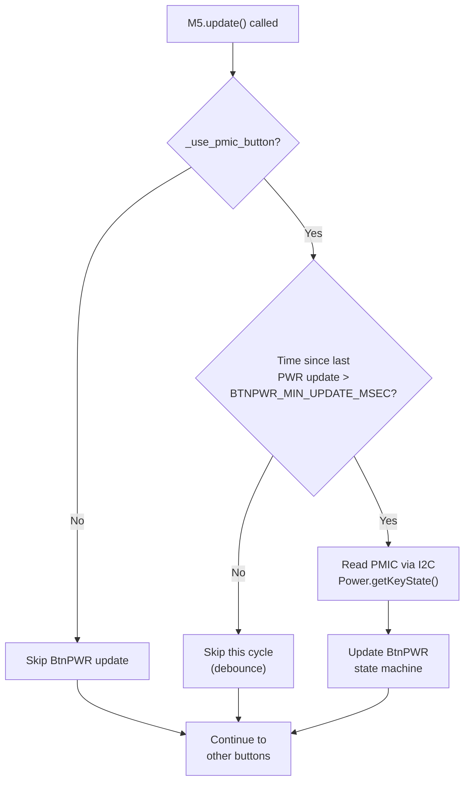

M5Unified Main Update Loop and Peripheral Polling

# Main Update Loop and Peripheral Polling

<details>
<summary>Relevant source files</summary>

The following files were used as context for generating this wiki page:

- [src/M5Unified.cpp](src/M5Unified.cpp)
- [src/M5Unified.hpp](src/M5Unified.hpp)
- [src/utility/Button_Class.cpp](src/utility/Button_Class.cpp)
- [src/utility/Button_Class.hpp](src/utility/Button_Class.hpp)

</details>


## Purpose and Scope

This page documents the `M5.update()` method and the peripheral polling system that drives input event processing in M5Unified. The update loop is responsible for reading hardware inputs (buttons, touch, IO expanders), updating internal state machines, and making input events available to application code.

For information about system initialization before the update loop begins, see [System Initialization and Lifecycle](#2.1). For details on audio system background tasks that operate independently of the update loop, see [Audio System Architecture](#4).

**Sources:** [src/M5Unified.hpp:320](), [src/M5Unified.cpp:1-100]()

---

## Application Loop Pattern

The M5Unified library follows a polling-based event processing model where user code must call `M5.update()` regularly, typically in the Arduino `loop()` function or equivalent main application loop.



**Sources:** [src/M5Unified.hpp:320](), [src/M5Unified.cpp:148-150]()

---

## Update Method Responsibilities

The `update()` method declared in [src/M5Unified.hpp:320]() performs several key functions on each invocation:

### Timestamp Capture



The method captures the current millisecond timestamp at the start of each update cycle. This timestamp is stored in the `_updateMsec` member variable [src/M5Unified.hpp:620]() and used consistently throughout the update cycle for:
- Button debouncing calculations
- Hold duration measurements
- Click timeout detection
- Application timing queries via `getUpdateMsec()` [src/M5Unified.hpp:289]()

### Input Source Aggregation

The update method polls multiple input sources and aggregates their states:

| Input Source | Hardware Interface | Target Buttons | Board Dependency |
|--------------|-------------------|----------------|------------------|
| **Touch** | `Touch.update()` | BtnA, BtnB, BtnC | Core2, Tough, CoreS3 |
| **GPIO** | Direct GPIO register read | BtnA, BtnB, BtnC, BtnEXT | Most boards |
| **IO Expander** | I2C (AW9523, PI4IOE5V6408) | BtnEXT | Specific models |
| **PMIC** | `Power.getKeyState()` | BtnPWR | Boards with AXP192/AXP2101 |

**Sources:** [src/M5Unified.hpp:238-242](), [src/M5Unified.cpp:351-365]()

---

## Button Array Architecture

M5Unified maintains an array of five `Button_Class` instances to support various board configurations:



Each button instance maintains its own independent state machine, allowing the same application code to work across different M5Stack boards without modification.

**Sources:** [src/M5Unified.hpp:238-242, 614](), [src/utility/Button_Class.hpp:11-83]()

---

## Button State Machine

Each `Button_Class` instance implements a state machine that processes raw hardware inputs into high-level button events.

### State Enumeration



The state enumeration is defined in [src/utility/Button_Class.hpp:14-19]():
- `state_nochange` - No new event this update cycle
- `state_clicked` - Button was clicked (pressed and quickly released)
- `state_hold` - Button has been held for the hold threshold duration
- `state_decide_click_count` - Multi-click sequence timeout reached, final count available

### State Update Logic

The `setRawState()` method [src/utility/Button_Class.cpp:41-83]() processes raw hardware input through the following pipeline:



**Key Variables:**
- `_raw_press` - Immediate hardware state (may be noisy)
- `_press` - Debounced state: 0=released, 1=clicked, 2=holding
- `_oldPress` - Previous debounced state
- `_lastRawChange` - Timestamp of last raw input change
- `_lastChange` - Timestamp of last debounced state change
- `_msecDebounce` - Debounce threshold (default 10ms)
- `_msecHold` - Hold detection threshold (default 500ms)

**Sources:** [src/utility/Button_Class.cpp:41-83](), [src/utility/Button_Class.hpp:69-81]()

### Multi-Click Detection

The state machine tracks consecutive clicks within a timeout window:



The timeout logic in [src/utility/Button_Class.cpp:16-27]() finalizes the click count when `_msecHold` duration passes without another click.

**Sources:** [src/utility/Button_Class.cpp:8-39](), [src/utility/Button_Class.hpp:28-39]()

---

## Button State Query Interface

Application code queries button states using the `Button_Class` public methods. States persist until the next update cycle where they may change.

### Query Methods by Category

**Press/Release State:**

```cpp
bool isPressed()       // Currently held down (this moment)
bool isReleased()      // Currently not pressed (this moment)
bool isHolding()       // Currently in hold state (_press == 2)
bool wasPressed()      // Transitioned from released to pressed
bool wasReleased()     // Transitioned from pressed to released
bool wasChangePressed()// State changed (either direction)
```

**Event Detection:**

```cpp
bool wasClicked()           // Single quick press/release detected
bool wasHold()              // Hold threshold reached
bool wasSingleClicked()     // Exactly 1 click after timeout
bool wasDoubleClicked()     // Exactly 2 clicks after timeout
bool wasDecideClickCount()  // Any multi-click count decided
```

**Timing Queries:**

```cpp
bool pressedFor(ms)         // Held for at least ms milliseconds
bool releasedFor(ms)        // Released for at least ms milliseconds
bool wasReleaseFor(ms)      // Was held for at least ms before release
bool wasReleasedAfterHold() // Released after reaching hold state
uint32_t lastChange()       // Timestamp of last state change
```

### Usage Pattern Example

```cpp
void loop() {
    M5.update();  // Poll hardware and update button states
    
    // Query button states for this frame
    if (M5.BtnA.wasClicked()) {
        Serial.println("Button A clicked");
    }
    
    if (M5.BtnB.wasHold()) {
        Serial.println("Button B held");
    }
    
    if (M5.BtnC.wasDoubleClicked()) {
        Serial.println("Button C double-clicked");
    }
    
    // Current state queries
    if (M5.BtnA.isPressed()) {
        // React to continuous press
    }
    
    // Application logic continues...
}
```

**Sources:** [src/utility/Button_Class.hpp:22-55](), [src/M5Unified.hpp:238-242]()

---

## Touch-to-Button Mapping

On boards with touch screens (Core2, Tough, CoreS3), the update loop converts touch coordinates into virtual button presses for BtnA, BtnB, and BtnC.



The touch button height can be configured:
- `setTouchButtonHeight(uint16_t pixel)` - Set absolute pixel height [src/M5Unified.hpp:606]()
- `setTouchButtonHeightByRatio(uint8_t ratio)` - Set as percentage of display height [src/M5Unified.hpp:605]()
- `getTouchButtonHeight()` - Query current setting [src/M5Unified.hpp:607]()

**Sources:** [src/M5Unified.hpp:605-607, 621](), [src/utility/Touch_Class.hpp:1-50]()

---

## Update Timing Considerations

### Recommended Update Frequency

The update loop should be called frequently for responsive input handling:

| Update Frequency | Input Responsiveness | Resource Usage |
|------------------|---------------------|----------------|
| **Every loop iteration** (default) | Excellent (sub-ms latency) | Minimal CPU overhead |
| 10-50 Hz | Acceptable for most applications | Very low overhead |
| < 10 Hz | Noticeable lag in button response | Not recommended |

### Debounce and Hold Thresholds

Default timing values can be adjusted per button:

```cpp
// Configure debounce threshold (default 10ms)
M5.BtnA.setDebounceThresh(20);  // 20ms debounce

// Configure hold threshold (default 500ms)
M5.BtnA.setHoldThresh(1000);    // 1 second for hold detection

// Query current settings
uint32_t debounce = M5.BtnA.getDebounceThresh();
uint32_t hold = M5.BtnA.getHoldThresh();
```

**Sources:** [src/utility/Button_Class.hpp:57-58, 65-66](), [src/utility/Button_Class.cpp:74-76]()

### Update Loop vs Background Tasks

The update loop operates independently from audio background tasks:



The update loop does not block on audio operations. Speaker and microphone tasks run independently in separate FreeRTOS tasks with their own priority levels. For details on audio task architecture, see [Speaker Interface and Multi-Channel Mixing](#4.2) and [Microphone Interface and Signal Processing](#4.3).

**Sources:** [src/M5Unified.cpp:1-100](), High-level architecture diagrams

---

## Power Button Special Handling

The power button (BtnPWR) requires special consideration as it may be polled less frequently to reduce I2C bus traffic:



The minimum update interval `BTNPWR_MIN_UPDATE_MSEC` is defined as 4ms [src/M5Unified.hpp:612]() to prevent excessive I2C transactions to the PMIC. The `_use_pmic_button` flag is set based on the `config_t.pmic_button` configuration option [src/M5Unified.hpp:133]().

**Sources:** [src/M5Unified.hpp:133, 242, 612, 625](), [src/utility/Power_Class.hpp:1-100]()

---

## Performance Characteristics

### Execution Time

Typical `M5.update()` execution times on ESP32 @ 240MHz:

| Operation | Approximate Duration | Notes |
|-----------|---------------------|-------|
| Timestamp capture | < 1 μs | `millis()` call |
| GPIO register read | ~2-5 μs | Direct register access |
| Touch coordinate read | ~50-200 μs | I2C transaction dependent |
| IO Expander read | ~100-300 μs | I2C transaction to AW9523/PI4IOE |
| PMIC button read | ~100-300 μs | I2C transaction to AXP192/AXP2101 |
| Button state machine (×5) | ~5-10 μs | Pure computation |
| **Total (typical)** | **200-800 μs** | Varies by board configuration |

Boards without touch screens or IO expanders experience faster update cycles (< 50 μs).

### Best Practices

1. **Call `update()` in every iteration** of the main loop for maximum responsiveness
2. **Query button states immediately after update()** while state is fresh
3. **Don't call `update()` from interrupt handlers** - designed for main loop only
4. **Adjust debounce/hold thresholds** if mechanical buttons exhibit excessive bounce
5. **Use state query methods consistently** - prefer `wasClicked()` over manual state tracking

**Sources:** [src/M5Unified.cpp:1-100](), [src/utility/Button_Class.cpp:41-83]()