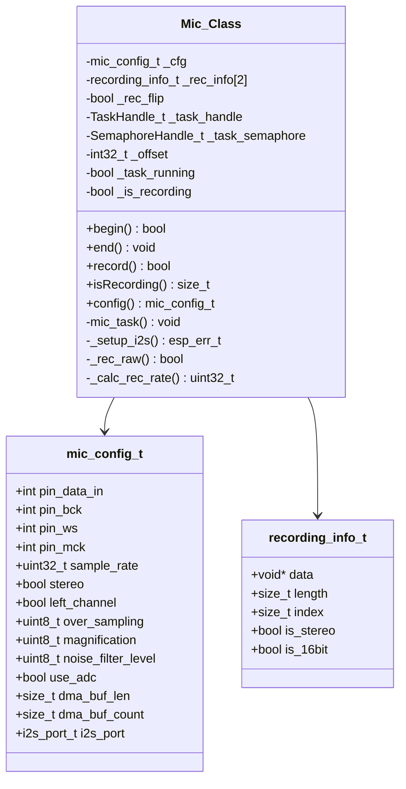
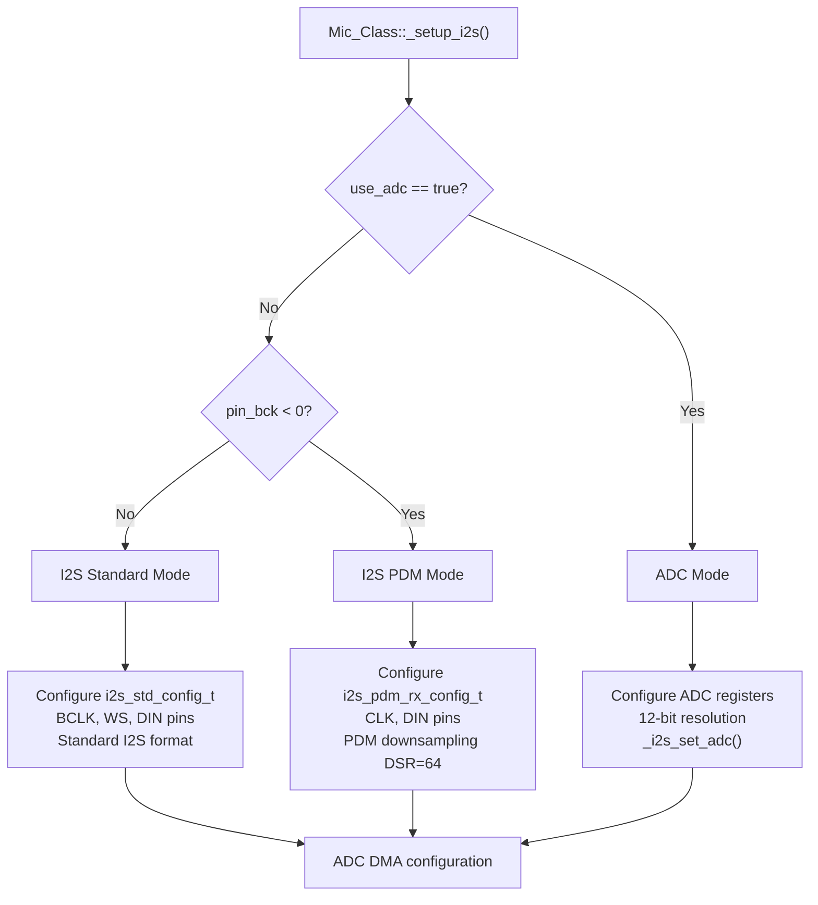
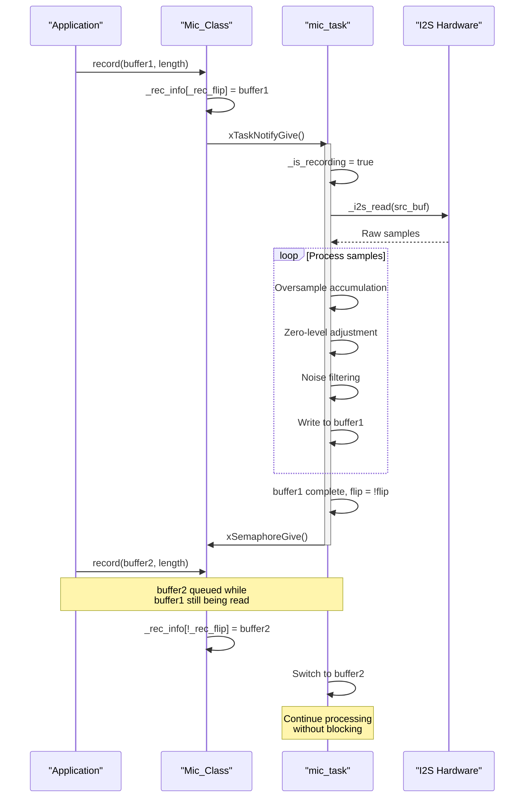
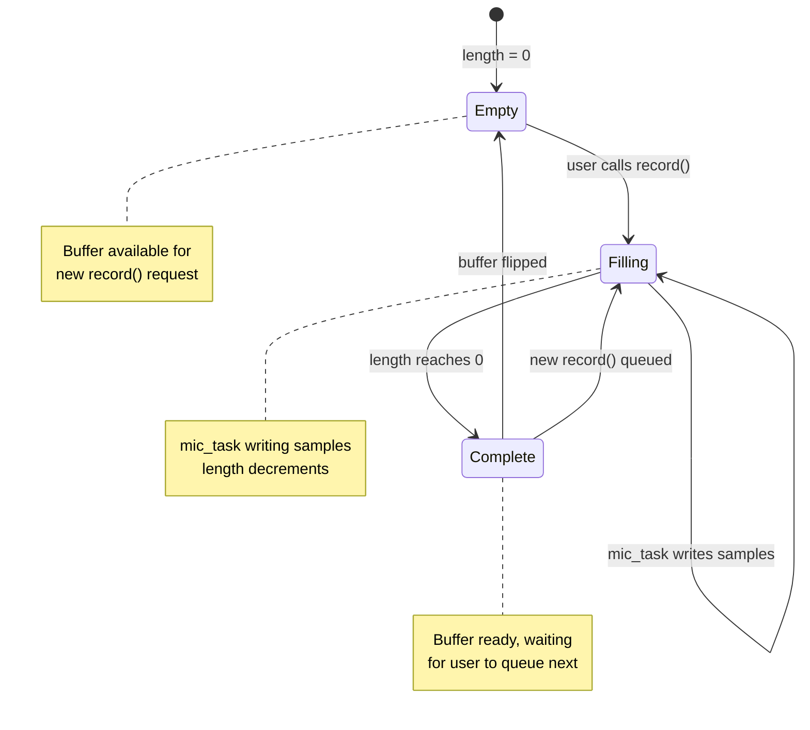
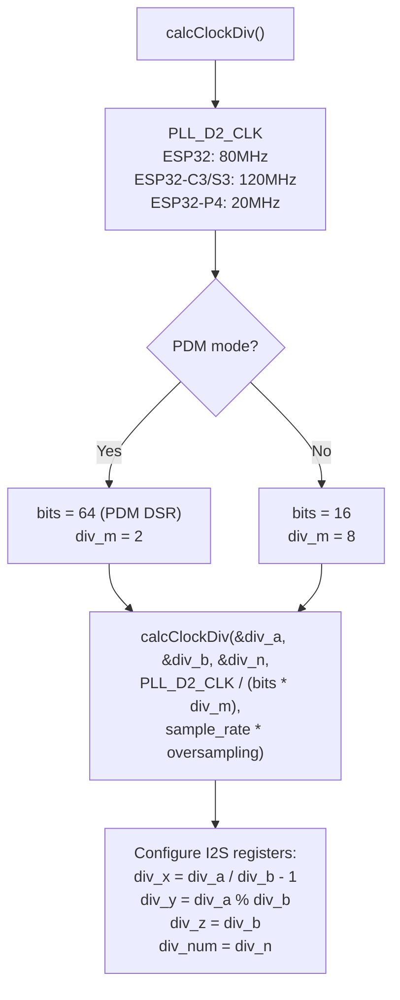
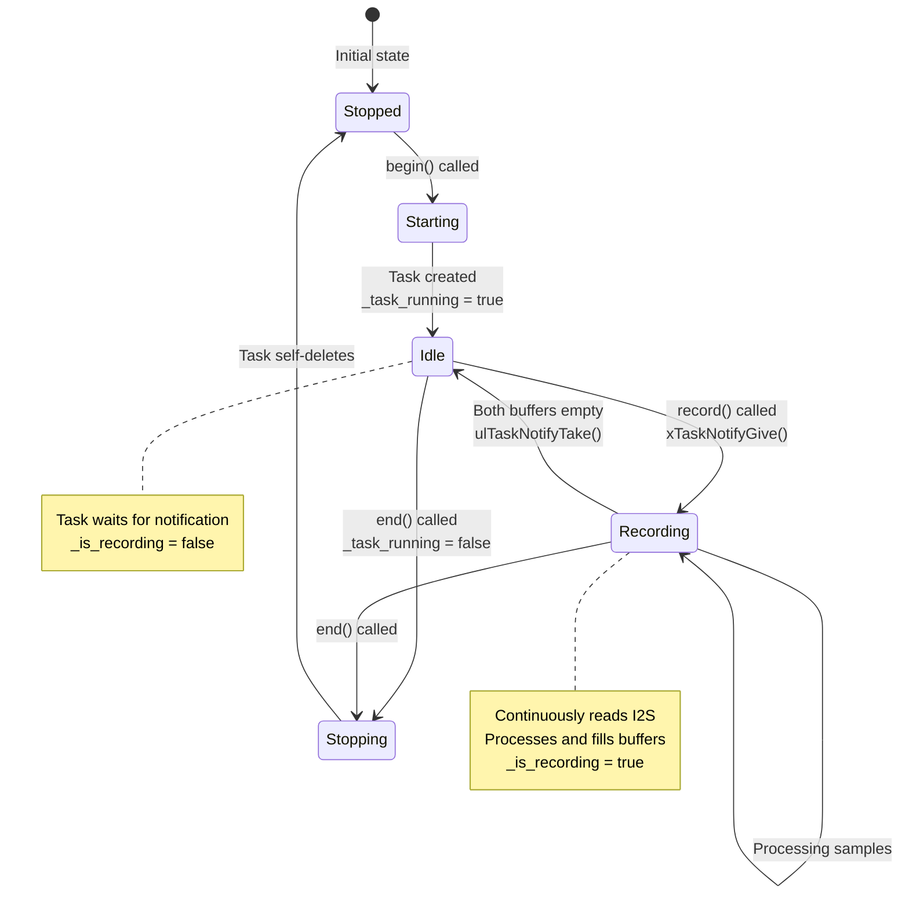
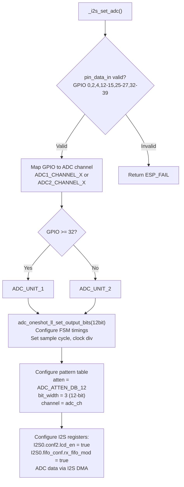

M5Unified Microphone Interface and Signal Processing

# Microphone Interface and Signal Processing

<details>
<summary>Relevant source files</summary>

The following files were used as context for generating this wiki page:

- [examples/Advanced/Mic_FFT/Mic_FFT.ino](examples/Advanced/Mic_FFT/Mic_FFT.ino)
- [src/utility/Mic_Class.cpp](src/utility/Mic_Class.cpp)
- [src/utility/Mic_Class.hpp](src/utility/Mic_Class.hpp)
- [src/utility/Speaker_Class.cpp](src/utility/Speaker_Class.cpp)
- [src/utility/Speaker_Class.hpp](src/utility/Speaker_Class.hpp)

</details>


## Purpose and Scope

This document covers the `Mic_Class` implementation in M5Unified, which provides audio input functionality through I2S and ADC interfaces. The microphone system captures audio data in a background FreeRTOS task, applies signal processing (oversampling, noise filtering, zero-level adjustment), and delivers processed samples to user applications through a double-buffered recording mechanism.

For general audio architecture and I2S configuration details, see [I2S Configuration and Driver Abstraction](#4.1). For board-specific audio codec initialization and microphone hardware differences, see [Board-Specific Audio Configuration](#4.4).

---

## Mic_Class Architecture

The `Mic_Class` provides a non-blocking audio capture interface that runs in a dedicated FreeRTOS task. The architecture separates user-facing recording requests from low-level I2S/ADC data acquisition and signal processing.

### Class Structure



**Sources:** [src/utility/Mic_Class.hpp:98-196](), [src/utility/Mic_Class.hpp:42-96](), [src/utility/Mic_Class.hpp:163-170]()

---

## Configuration System

The `mic_config_t` structure defines all microphone parameters including I2S pins, sampling rate, signal processing parameters, and hardware mode selection.

### Configuration Parameters

| Parameter | Type | Default | Description |
|-----------|------|---------|-------------|
| `pin_data_in` | int | -1 | I2S data input pin or ADC GPIO pin |
| `pin_bck` | int | -1 | I2S bit clock pin (ignored for PDM/ADC) |
| `pin_ws` | int | -1 | I2S word select pin (or PDM clock) |
| `pin_mck` | int | -1 | I2S master clock pin (optional) |
| `sample_rate` | uint32_t | 16000 | Output sampling rate in Hz |
| `stereo` | bool | false | Stereo input capture |
| `left_channel` | bool | false | Select left channel (when mono) |
| `over_sampling` | uint8_t | 2 | Oversampling factor (1-8) |
| `magnification` | uint8_t | 16 | Output amplitude multiplier |
| `noise_filter_level` | uint8_t | 0 | Low-pass filter strength (0-255) |
| `use_adc` | bool | false | Use ADC instead of I2S (ESP32 only) |
| `dma_buf_len` | size_t | 128 | I2S DMA buffer length |
| `dma_buf_count` | size_t | 8 | Number of DMA buffers |
| `i2s_port` | i2s_port_t | I2S_NUM_0 | I2S peripheral selection |

**Sources:** [src/utility/Mic_Class.hpp:42-96]()

### Hardware Mode Selection

The microphone system supports three hardware input modes determined by pin configuration:



**Sources:** [src/utility/Mic_Class.cpp:298-417]()

---

## Recording Data Flow

The microphone system uses a producer-consumer pattern with double buffering. The `mic_task` continuously fills recording buffers while user code reads completed buffers asynchronously.

### Double-Buffer Mechanism



**Sources:** [src/utility/Mic_Class.cpp:422-706](), [src/utility/Mic_Class.cpp:567-699]()

### Recording Buffer States

The `recording_info_t` structures maintain the state of each buffer in the double-buffer system:



**Sources:** [src/utility/Mic_Class.cpp:567-591]()

---

## Signal Processing Pipeline

The `mic_task` applies a multi-stage signal processing pipeline to raw I2S/ADC samples before delivering them to the user buffer. This pipeline improves signal quality and removes DC offset.

### Processing Stages Diagram

```mermaid
flowchart LR
    subgraph "I2S/ADC Input"
        I2S["I2S DMA Buffer<br/>dma_buf_len samples<br/>int16_t raw data"]
    end
    
    subgraph "Oversampling"
        Accumulate["Accumulate Samples<br/>sum_value[0] += src[i]<br/>sum_value[1] += src[i+1]<br/>over_sampling iterations"]
    end
    
    subgraph "Zero-Level Adjustment"
        DCRemoval["Automatic DC Offset<br/>offset -= (sum + offset) >> 5<br/>Gradual convergence to zero"]
    end
    
    subgraph "Noise Filtering"
        LowPass["IIR Low-Pass Filter<br/>v = sum*(256-level) + prev*level<br/>prev_value[i] = v"]
    end
    
    subgraph "Gain & Clipping"
        Gain["Apply Magnification<br/>v = sum * f_gain<br/>f_gain = magnification / (os << 1)"]
        Clip["Clamp to Range<br/>8-bit: 0-255<br/>16-bit: INT16_MIN-INT16_MAX"]
    end
    
    subgraph "Output"
        Convert["Stereo/Mono Convert<br/>Write to user buffer<br/>int16_t or uint8_t"]
    end
    
    I2S --> Accumulate
    Accumulate --> DCRemoval
    DCRemoval --> LowPass
    LowPass --> Gain
    Gain --> Clip
    Clip --> Convert
```



**Sources:** [src/utility/Mic_Class.cpp:594-699]()

### Oversampling Implementation

Oversampling reduces quantization noise by capturing samples at a higher rate and averaging them down to the target sample rate. The `over_sampling` parameter controls how many hardware samples are accumulated per output sample.

```cpp
// From mic_task processing loop
do
{
    sum_value[0] += src_buf[src_idx  ];
    sum_value[1] += src_buf[src_idx+1];
    src_idx += 2;
} while (--os_remain && (src_idx < src_len));
```

The effective recording rate is `sample_rate * over_sampling`, calculated by `_calc_rec_rate()`:

**Sources:** [src/utility/Mic_Class.cpp:603-608](), [src/utility/Mic_Class.cpp:84-88]()

### Zero-Level Adjustment

The automatic zero-level adjustment removes DC offset using a first-order IIR filter that gradually converges the signal baseline to zero:

```cpp
auto value_tmp = (sv0 + sv1) << 3;
int32_t offset = self->_offset;
// Automatic zero level adjustment
offset -= (value_tmp + offset + 16) >> 5;
self->_offset = offset;
offset = (offset + 8) >> 4;
sum_value[0] = sv0 + offset;
sum_value[1] = sv1 + offset;
```

This implements: `offset = offset - (signal + offset) / 32`, providing a time constant of approximately 32 samples for DC offset removal.

**Sources:** [src/utility/Mic_Class.cpp:625-632]()

### Noise Filtering

When `noise_filter_level` is non-zero, an IIR low-pass filter smooths the signal:

```cpp
if (noise_filter)
{
    for (int i = 0; i < 2; ++i)
    {
        int32_t v = (sum_value[i] * (256 - noise_filter) + prev_value[i] * noise_filter + 128) >> 8;
        prev_value[i] = v;
        sum_value[i] = v * f_gain;
    }
}
```

The filter coefficient ranges from 0 (no filtering) to 255 (maximum smoothing). Higher values increase latency but reduce high-frequency noise.

**Sources:** [src/utility/Mic_Class.cpp:634-650]()

---

## Clock Configuration

The microphone system requires precise clock configuration to achieve the target sampling rate. The implementation uses fractional dividers to minimize sampling rate error.

### Clock Divider Calculation



The actual sampling rate is: `rate = PLL_D2_CLK / (div_m * bits * (div_n + div_b/div_a))`

For PDM mode, the hardware downsamples by DSR=64, so the I2S clock runs at `sample_rate * oversampling * 64`.

**Sources:** [src/utility/Mic_Class.cpp:431-547](), [src/utility/Mic_Class.cpp:419-420]()

---

## Task Lifecycle Management

The `mic_task` runs as a FreeRTOS task with configurable priority and core affinity. The task lifecycle is managed through flags and semaphores to coordinate with user operations.

### Task State Machine



**Sources:** [src/utility/Mic_Class.cpp:708-759]()

### Initialization Sequence

```cpp
bool Mic_Class::begin(void)
{
    // Check if already running at same rate
    if (_task_running) {
        auto rate = _calc_rec_rate();
        if (_rec_sample_rate == rate) { return true; }
        
        // Rate changed - restart
        do { vTaskDelay(1); } while (isRecording());
        end();
        _rec_sample_rate = rate;
    }
    
    // Create semaphore for buffer synchronization
    if (_task_semaphore == nullptr) { 
        _task_semaphore = xSemaphoreCreateBinary(); 
    }
    
    // Enable callback (board-specific power control)
    if (_cb_set_enabled) { 
        res = _cb_set_enabled(_cb_set_enabled_args, true); 
    }
    
    // Setup I2S/ADC hardware
    res = (ESP_OK == _setup_i2s()) && res;
    
    // Create background task
    _task_running = true;
    xTaskCreatePinnedToCore(mic_task, "mic_task", stack_size, 
                           this, _cfg.task_priority, 
                           &_task_handle, _cfg.task_pinned_core);
}
```

**Sources:** [src/utility/Mic_Class.cpp:708-745]()

---

## Mono/Stereo Conversion

The signal processing pipeline automatically converts between mono and stereo formats based on the input configuration and output buffer format.

### Conversion Logic

| Input Mode | Output Mode | Operation |
|------------|-------------|-----------|
| Stereo | Stereo | Direct copy, both channels processed |
| Stereo | Mono | Average: `(left + right) / 2` |
| Mono | Mono | Direct copy of single channel |
| Mono | Stereo | Duplicate: `left = right = mono` |

```cpp
if (in_stereo != current_rec->is_stereo)
{
    if (in_stereo)
    { // stereo -> mono convert
        sum_value[0] = (sum_value[0] + sum_value[1] + 1) >> 1;
        output_num = 1;
    }
    else
    { // mono -> stereo convert
        auto tmp = sum_value[1];
        sum_value[3] = tmp;
        sum_value[2] = tmp;
        sum_value[1] = sum_value[0];
        output_num = 4;
    }
}
```

**Sources:** [src/utility/Mic_Class.cpp:652-669]()

---

## ADC Mode Implementation

On ESP32 (not ESP32-S2/S3/C3), the microphone can use the internal ADC for analog input instead of I2S. This mode is enabled by setting `use_adc = true` and specifying an ADC-capable GPIO pin.

### ADC Configuration Process



**Sources:** [src/utility/Mic_Class.cpp:134-219](), [src/utility/Mic_Class.cpp:239-293]()

### ADC Data Processing

ADC samples are unsigned 12-bit values (0-4095) that must be converted to signed format:

```cpp
if (self->_cfg.use_adc) {
    sv0 -= 2048 * oversampling;  // Remove 2048 center offset
    sv1 -= 2048 * oversampling;
}
```

The ADC zero-point is 2048 (half of 4096), so this conversion centers the signal around zero for proper signal processing.

**Sources:** [src/utility/Mic_Class.cpp:620-623]()

---

## Usage Example

The following example from the Mic_FFT demonstration shows typical microphone usage with continuous recording and FFT analysis:

```cpp
// Configure microphone
auto cfg = M5.Mic.config();
cfg.dma_buf_count = 3;
cfg.dma_buf_len = 256;        // WAVE_BLOCK_SIZE
cfg.over_sampling = 1;
cfg.noise_filter_level = 0;
cfg.sample_rate = 24000;      // SAMPLE_RATE
cfg.magnification = cfg.use_adc ? 16 : 1;
M5.Mic.config(cfg);

// Start microphone
M5.Mic.begin();

// In loop: continuous recording
int wav_idx = wav_data.latest_index;
while (M5.Mic.isRecording() < 2) {
    // Queue next block while previous is processing
    M5.Mic.record(&(wav_data.wav[wav_idx]), 
                  WAVE_BLOCK_SIZE, 
                  SAMPLE_RATE, 
                  false);  // mono
    
    wav_idx += WAVE_BLOCK_SIZE;
    if (wav_idx >= WAVE_TOTAL_SIZE) { wav_idx = 0; }
    wav_data.latest_index = wav_idx;
}
```

This pattern maintains a continuous circular buffer by queuing new recording requests before the previous one completes, ensuring no gaps in audio capture.

**Sources:** [examples/Advanced/Mic_FFT/Mic_FFT.ino:662-741]()

---

## Performance Considerations

### Buffer Sizing

The `dma_buf_len` and `dma_buf_count` parameters affect latency and reliability:

- **Small buffers** (dma_buf_len < 128): Lower latency but higher risk of buffer underrun
- **Large buffers** (dma_buf_len > 512): Higher latency but more robust under CPU load
- **Buffer count** (dma_buf_count): Typically 3-8 buffers provide good balance

### Task Priority

The `task_priority` should be set high enough to prevent I2S buffer underruns:

- Default priority: 2
- Higher priority (3-4) recommended for high sample rates (>48kHz)
- Must be balanced against other real-time tasks

### Stack Size Calculation

The task stack size is calculated dynamically:

```cpp
size_t stack_size = 2048 + (_cfg.dma_buf_len * sizeof(uint16_t));
```

This provides base overhead plus space for the intermediate buffer allocation.

**Sources:** [src/utility/Mic_Class.cpp:730]()

---

## API Reference Summary

| Method | Description |
|--------|-------------|
| `begin()` | Initialize I2S/ADC and start mic_task |
| `end()` | Stop mic_task and release resources |
| `record(uint8_t*, size_t)` | Queue 8-bit mono recording |
| `record(int16_t*, size_t)` | Queue 16-bit mono recording |
| `record(buffer, len, rate, stereo)` | Queue recording with full parameters |
| `isRecording()` | Returns 0/1/2 for idle/recording/queue-full |
| `isEnabled()` | Check if pin_data_in is configured |
| `config()` | Get current mic_config_t |
| `config(cfg)` | Set new mic_config_t |

**Sources:** [src/utility/Mic_Class.hpp:107-157]()