M5Unified PMIC Detection and Initialization

# PMIC Detection and Initialization

<details>
<summary>Relevant source files</summary>

The following files were used as context for generating this wiki page:

- [src/utility/Power_Class.cpp](src/utility/Power_Class.cpp)
- [src/utility/Power_Class.hpp](src/utility/Power_Class.hpp)

</details>


## Purpose and Scope

This page documents the PMIC (Power Management IC) detection and initialization process implemented in the `Power_Class::begin()` method. This is the first step in power subsystem initialization, responsible for identifying which power management hardware is present on the detected board and configuring it appropriately.

For battery monitoring and charge control APIs, see [Battery Monitoring and Charging Control](#3.2). For sleep mode functionality, see [Sleep Modes and Power States](#3.3). For external port power control, see [External Port Power Control](#3.4).

## PMIC Type Enumeration

The system supports multiple PMIC types through the `pmic_t` enum, which enables runtime polymorphism for power management operations.

| PMIC Type | Boards Using This PMIC | Communication |
|-----------|------------------------|---------------|
| `pmic_axp192` | M5Stack Core2, M5Tough, M5StickC, M5StickC Plus, M5Station | I2C (0x34) |
| `pmic_axp2101` | M5Stack CoreS3, M5Stack CoreS3SE, M5Stack Core2 v1.1 | I2C (0x34) |
| `pmic_ip5306` | Original M5Stack | I2C (0x75) |
| `pmic_m5pm1` | M5StickS3 | I2C (0x6E) |
| `pmic_aw32001` | Arduino NessoN1 | I2C |
| `pmic_py32pmic` | (Reserved) | I2C (0x6E) |
| `pmic_adc` | M5Paper, M5PaperS3, CoreInk, M5Capsule, M5Cardputer, M5TimerCam, M5StickC Plus2, M5AirQ, M5DinMeter | ADC-based voltage sensing |
| `pmic_unknown` | Boards without power management | None |

Sources: [src/utility/Power_Class.hpp:72-81](), [src/utility/Power_Class.cpp:53-513]()

## Initialization Flow Overview

The `Power_Class::begin()` method follows a board-specific initialization pattern determined by the ESP32 variant and board type detected during earlier initialization.

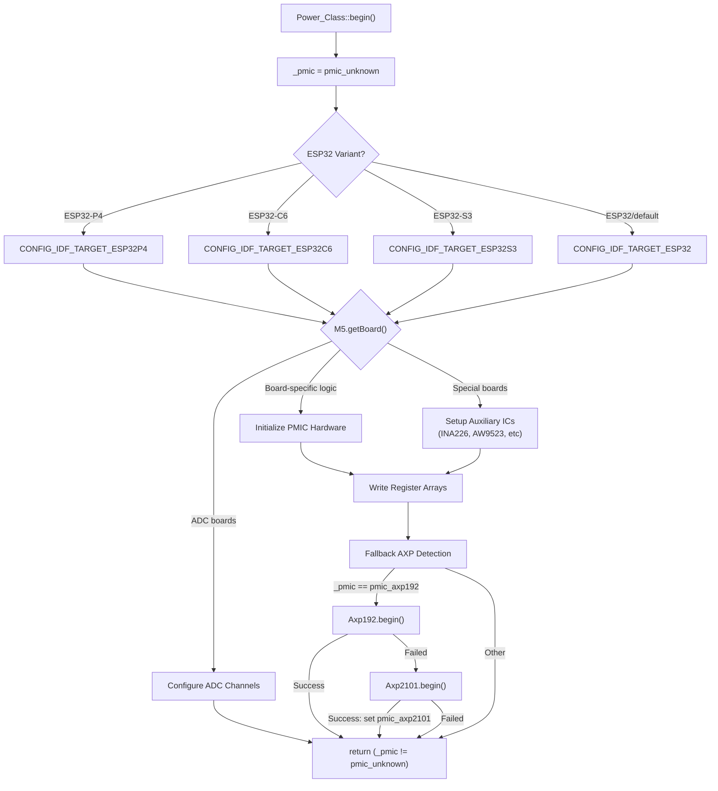

**Figure 1: Power_Class::begin() Execution Flow**

Sources: [src/utility/Power_Class.cpp:53-513]()

## Board-Specific Initialization by ESP32 Variant

### ESP32-P4 Initialization (M5Tab5)

The M5Tab5 uses dual IO expanders (AW9523) for GPIO control instead of a traditional PMIC. The initialization configures both expanders with specific pin directions and output states.

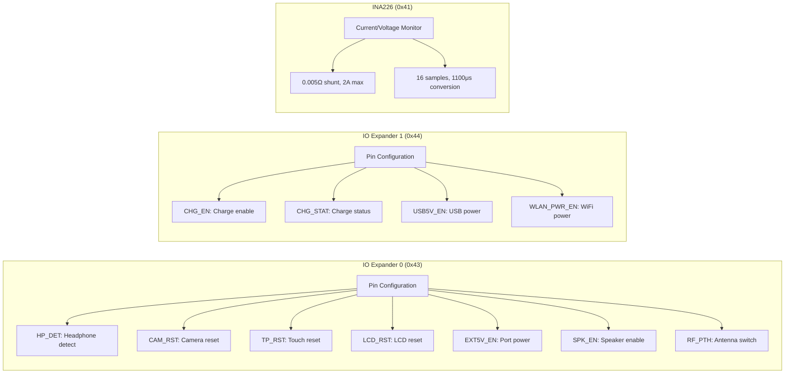

**Figure 2: M5Tab5 Power Control Architecture**

The register arrays define output states, I/O direction, output drive modes, and pull resistor configuration:

| Register | Expander 0 Value | Expander 1 Value | Description |
|----------|------------------|------------------|-------------|
| 0x05 (OUT_SET) | 0b01110000 | 0b10000001 | Initial output values |
| 0x03 (IO_DIR) | 0b01110011 | 0b10110001 | Pin direction (1=input, 0=output) |
| 0x07 (OUT_H_IM) | 0b00001000 | 0b00000110 | Open-drain output mode bits |
| 0x0D (PULL_SEL) | 0b00000100 | 0b00001000 | Pull-up/down selection |
| 0x0B (PULL_EN) | 0b00000100 | 0b00001000 | Pull resistor enable |

Sources: [src/utility/Power_Class.cpp:58-112]()

### ESP32-C6 Initialization

#### UnitC6L Configuration

Configures the PI4IOE IO expander for LoRa module control:

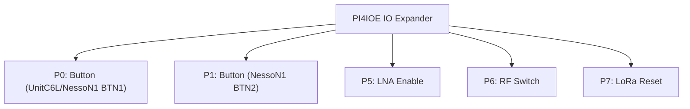

**Figure 3: UnitC6L IO Expander Configuration**

Sources: [src/utility/Power_Class.cpp:114-153]()

#### Arduino NessoN1 Configuration

The NessoN1 board initializes both the IO expander and two additional ICs:

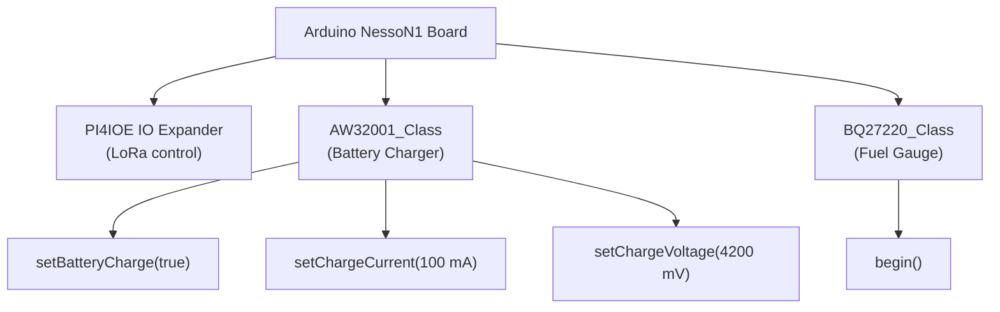

**Figure 4: NessoN1 Power Subsystem Initialization**

Sources: [src/utility/Power_Class.cpp:143-153]()

### ESP32-S3 Initialization

ESP32-S3 boards have the most diverse PMIC configurations:

#### M5Stack CoreS3/CoreS3SE

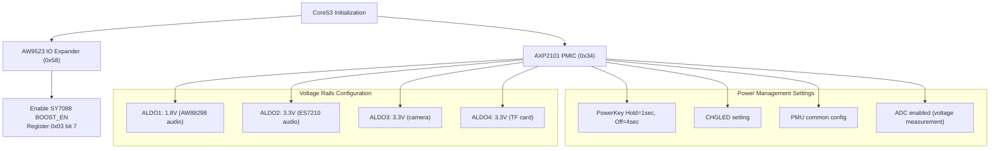

**Figure 5: CoreS3 Power Initialization Sequence**

The register configuration array written to AXP2101:

| Register | Value | Description |
|----------|-------|-------------|
| 0x90 | 0xBF | LDOS ON/OFF control 0 |
| 0x92 | 13 | ALDO1 = 1.8V (18-5) for AW88298 |
| 0x93 | 28 | ALDO2 = 3.3V (33-5) for ES7210 |
| 0x94 | 28 | ALDO3 = 3.3V (33-5) for camera |
| 0x95 | 28 | ALDO4 = 3.3V (33-5) for TF card |
| 0x27 | 0x00 | PowerKey timing configuration |
| 0x69 | 0x11 | CHGLED (charge LED) setting |
| 0x10 | 0x30 | PMU common config |
| 0x30 | 0x0F | ADC enable for voltage measurement |

Sources: [src/utility/Power_Class.cpp:163-180]()

#### M5StickS3 (M5PM1 PMIC)

The M5StickS3 uses a custom M5PM1 PMIC controlled via I2C register operations. The initialization configures GPIO0 as an input for reading charging status:

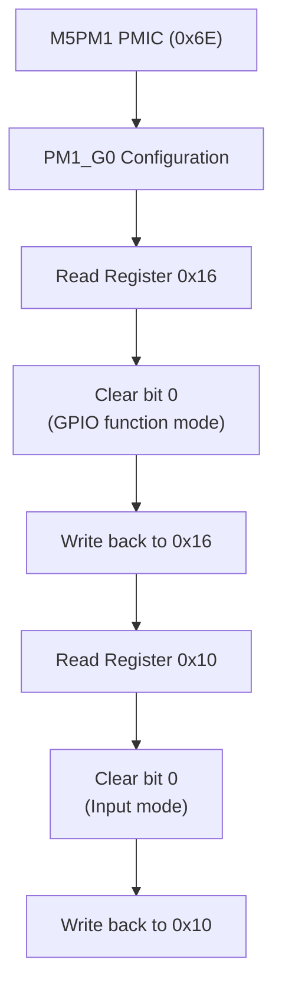

**Figure 6: M5PM1 GPIO0 Initialization for Charge Status**

Sources: [src/utility/Power_Class.cpp:182-195]()

#### ADC-Based Power Monitoring (Multiple Boards)

Several ESP32-S3 boards use ADC channels instead of PMICs:

| Board | ADC Channel | ADC Unit | Voltage Ratio | Wakeup Pin |
|-------|-------------|----------|---------------|------------|
| M5PaperS3 | ADC1_GPIO3_CHANNEL | 1 | 2.0 | GPIO_NUM_48 (touch INT) |
| M5Capsule | ADC1_GPIO6_CHANNEL | 1 | 2.0 | (none) |
| M5AirQ | ADC2_GPIO14_CHANNEL | 2 | 2.0 | (none) |
| M5DinMeter | ADC1_GPIO10_CHANNEL | 1 | 2.0 | (none) |
| M5Cardputer | ADC1_GPIO10_CHANNEL | 1 | 2.0 | (none) |
| M5CardputerADV | ADC1_GPIO10_CHANNEL | 1 | 2.0 | (none) |

For M5PaperS3, a dedicated charge status pin is also configured:

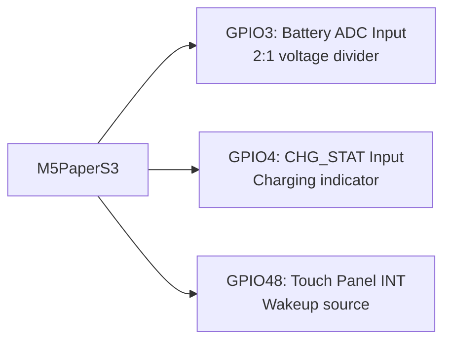

**Figure 7: M5PaperS3 Power Monitoring Pins**

Sources: [src/utility/Power_Class.cpp:197-228]()

#### M5PowerHub

The PowerHub enables VAMeter functionality through I2C:

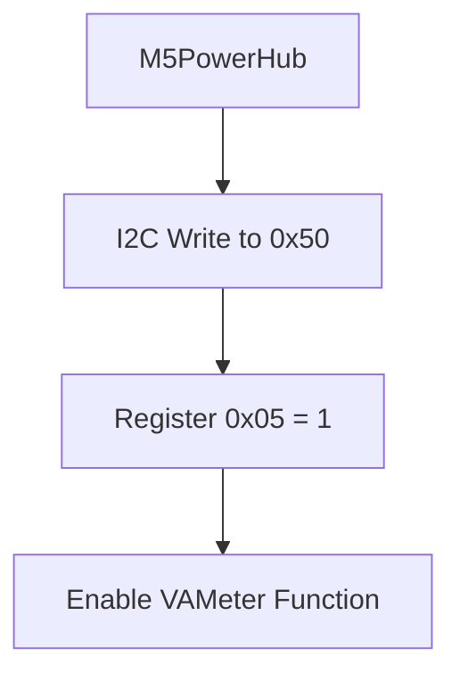

**Figure 8: M5PowerHub VAMeter Initialization**

Sources: [src/utility/Power_Class.cpp:229-232]()

#### M5StampPLC

Initializes INA226 current monitor with specific shunt configuration:

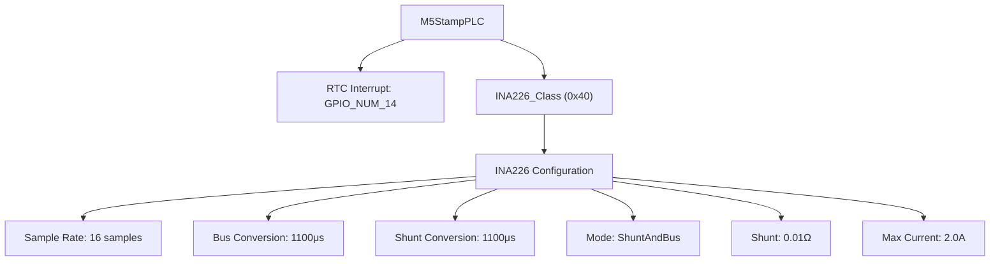

**Figure 9: M5StampPLC INA226 Configuration**

Sources: [src/utility/Power_Class.cpp:233-244]()

### ESP32 (Original) Initialization

#### M5TimerCam

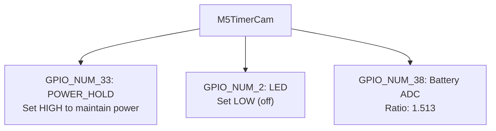

**Figure 10: M5TimerCam Power Control**

Sources: [src/utility/Power_Class.cpp:256-265]()

#### M5Stack CoreInk

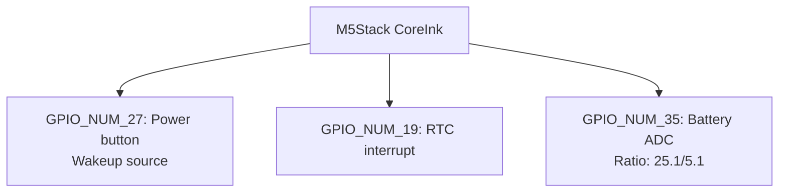

**Figure 11: M5CoreInk Power Configuration**

Sources: [src/utility/Power_Class.cpp:267-274]()

#### M5Paper

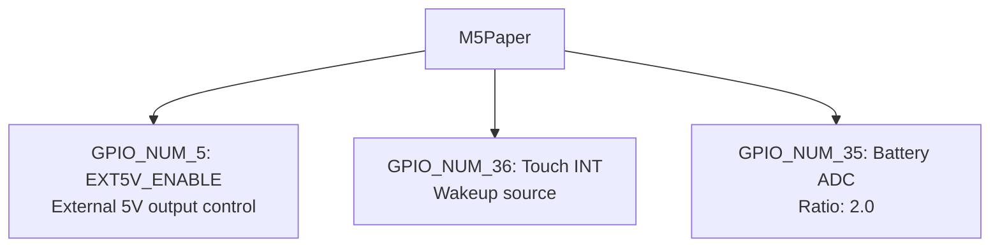

**Figure 12: M5Paper Power Configuration**

Sources: [src/utility/Power_Class.cpp:276-283]()

#### M5Stack Core2 and M5Tough (AXP192/AXP2101)

These boards support two PMIC types with different initialization paths:

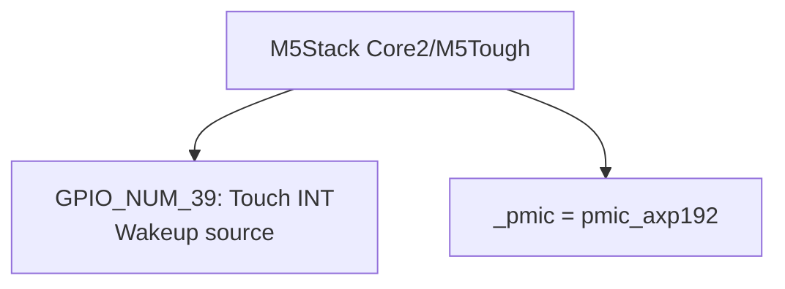

**Figure 13: Core2/Tough Initial Configuration**

Sources: [src/utility/Power_Class.cpp:285-294]()

#### M5Station

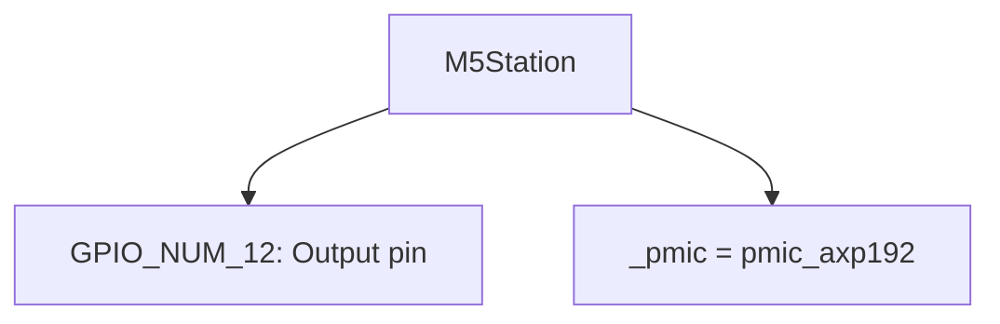

**Figure 14: M5Station Initial Configuration**

Sources: [src/utility/Power_Class.cpp:291-294]()

#### M5StickC and M5StickC Plus

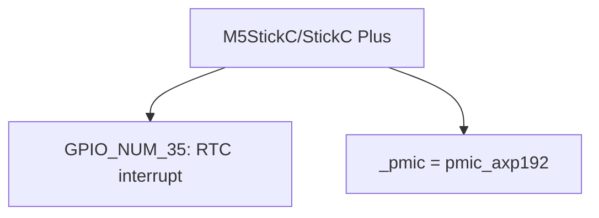

**Figure 15: M5StickC Power Configuration**

Sources: [src/utility/Power_Class.cpp:296-300]()

#### M5StickC Plus2

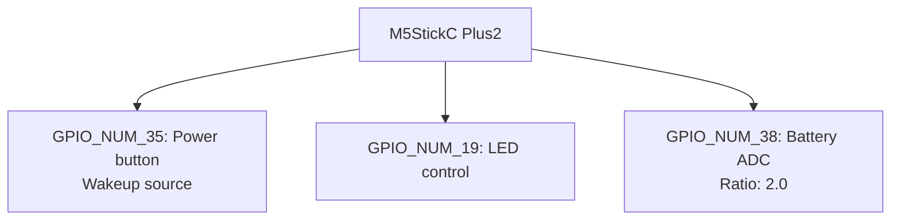

**Figure 16: M5StickC Plus2 Power Configuration**

Sources: [src/utility/Power_Class.cpp:302-309]()

#### Original M5Stack (IP5306)

The original M5Stack uses the IP5306 PMIC with extensive register configuration:

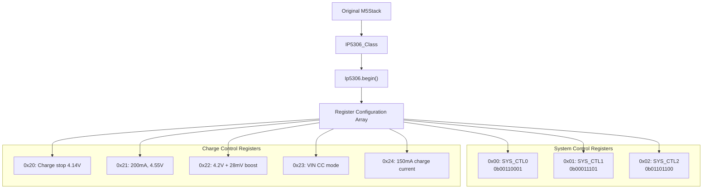

**Figure 17: IP5306 Initialization Sequence**

Key IP5306 register settings:

| Register | Value | Bit Fields Description |
|----------|-------|------------------------|
| 0x00 | 0b00110001 | Boost enable, charge enable, auto power-on, push button shutdown enable |
| 0x01 | 0b00011101 | Boost control=long press, WLED=short press, keep boost after VIN removal, batlow 3.0V shutdown |
| 0x02 | 0b01101100 | Key long press=3s, light load shutdown=16s |
| 0x20 | 0x00 | Charge full stop at 4.14V |
| 0x21 | 0x09 | 200mA detection, 4.55V charging loop |
| 0x22 | 0x02 | 4.2V battery + 28mV boost |
| 0x23 | 0xAE | VIN side constant current |
| 0x24 | 0xC1 | 150mA charge current |

Sources: [src/utility/Power_Class.cpp:311-374]()

## AXP192/AXP2101 Fallback Detection

After board-specific initialization, if `_pmic` was set to `pmic_axp192`, the system attempts I2C communication to confirm the PMIC type:

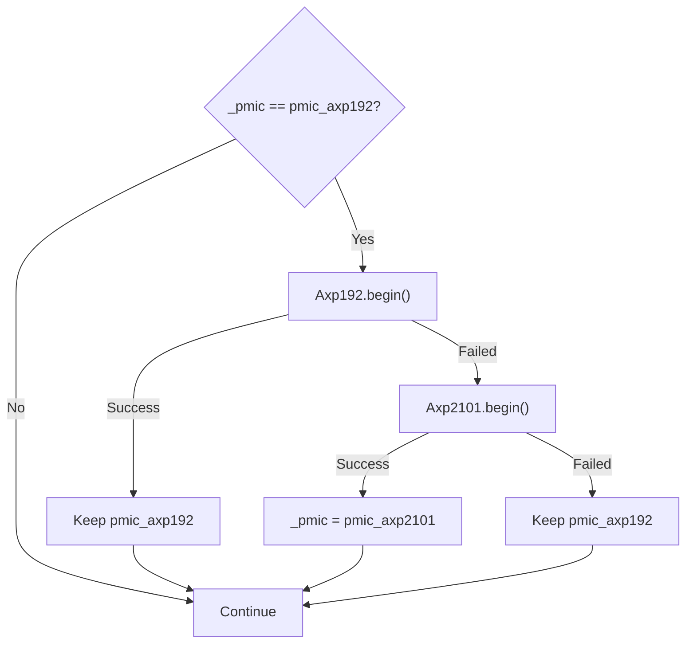

**Figure 18: AXP PMIC Fallback Detection Logic**

This allows boards like Core2 v1.1 (which use AXP2101 instead of AXP192) to be detected correctly even when the board type indicates AXP192.

Sources: [src/utility/Power_Class.cpp:377-383]()

## AXP192 Register Configuration

When AXP192 is detected, a common register array is applied to all AXP192-equipped boards:

```mermaid
graph TD
    AXP192["AXP192 PMIC"]
    
    subgraph "Core Configuration"
        DCDC1["0x26: DCDC1 = 3350mV<br/>(ESP32 VDD)"]
        VBUS["0x30: VBUS management"]
        VOFF["0x31: VOFF = 3.0V"]
        BatDet["0x32: Battery detection enable"]
    end
    
    subgraph "Charge Configuration"
        Charge["0x33: Charge 4.2V, 100mA"]
        RTCBat["0x35: RTC battery charge"]
        PowerKey["0x36: 128ms on, 4s off"]
    end
    
    subgraph "Interrupt Configuration"
        IRQ1["0x40-0x44: IRQ config"]
        IRQ3["0x42: Power key IRQ enable"]
    end
    
    subgraph "ADC Configuration"
        ADCAll["0x82: ADC all on"]
        ADCTemp["0x83: ADC temp on"]
        ADCRate["0x84: ADC 25Hz"]
    end
    
    subgraph "GPIO Configuration"
        GPIO0["0x90-0x91: GPIO0 (LDOio0)"]
        PWM["0x98-0x9A: PWM1 config"]
    end
    
    AXP192 --> DCDC1
    AXP192 --> VBUS
    AXP192 --> VOFF
    AXP192 --> BatDet
    AXP192 --> Charge
    AXP192 --> RTCBat
    AXP192 --> PowerKey
    AXP192 --> IRQ1
    AXP192 --> IRQ3
    AXP192 --> ADCAll
    AXP192 --> ADCTemp
    AXP192 --> ADCRate
    AXP192 --> GPIO0
    AXP192 --> PWM
```

**Figure 19: AXP192 Common Register Configuration**

### Board-Specific AXP192 Customization

After the common configuration, board-specific settings are applied:

| Board | Customizations |
|-------|---------------|
| **M5StickC / M5StickC Plus** | reg30h = 0x80 (VBUS pass-through), DCDC3 = 0V, LDO3 = 3000mV (LCD power) |
| **M5Stack Core2** | LDO2 = 3300mV (LCD+SD), LDO3 = 0V (vibration off), GPIO2 = false (speaker off), PWM LED control, charge current = 390mA |
| **M5Tough** | LDO2 = 3300mV (LCD+SD), GPIO2 = false (speaker off), DCDC3 = 0V |
| **M5Station** | LDO2 = 3300mV, GPIO0-4 as NMOS OpenDrain outputs, initialize dual INA3221 current monitors |

Sources: [src/utility/Power_Class.cpp:385-486]()

## AXP2101 Register Configuration

For Core2 v1.1 boards with AXP2101, a different register array is used:

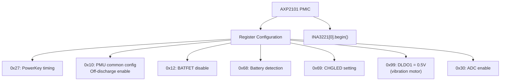

**Figure 20: AXP2101 Configuration for Core2 v1.1**

The AXP2101 configuration attempts to initialize an INA3221 current monitor, which is present on Core2 v1.1 hardware for accurate current measurement.

Sources: [src/utility/Power_Class.cpp:488-506]()

## ADC Configuration for Battery Monitoring

Boards using `pmic_adc` type configure ESP32 ADC channels for battery voltage measurement. The implementation varies by ESP-IDF version:

### ESP-IDF v5+ (ADC Oneshot API)

```mermaid
flowchart TD
    GetRaw["_getBatteryAdcRaw()"]
    CheckHandle{"adc_handle exists?"}
    CreateUnit["adc_oneshot_new_unit()"]
    SetUnit["unit_id based on _batAdcUnit"]
    ConfigChan["adc_oneshot_config_channel()"]
    SetAtten["atten = ADC_ATTEN_DB_12"]
    SetWidth["bitwidth = ADC_BITWIDTH_12"]
    
    CheckCali{"adc_cali exists?"}
    CreateCali["Create calibration handle"]
    CurveFit["adc_cali_curve_fitting_config_t"]
    LineFit["adc_cali_line_fitting_config_t"]
    
    ReadRaw["adc_oneshot_read()"]
    CalibVolt["adc_cali_raw_to_voltage()"]
    ReturnVolt["Return voltage (mV)"]
    
    GetRaw --> CheckHandle
    CheckHandle -->|No| CreateUnit
    CreateUnit --> SetUnit
    SetUnit --> ConfigChan
    ConfigChan --> SetAtten
    SetAtten --> SetWidth
    SetWidth --> CheckCali
    CheckHandle -->|Yes| CheckCali
    
    CheckCali -->|No| CreateCali
    CreateCali --> CurveFit
    CreateCali --> LineFit
    CheckCali -->|Yes| ReadRaw
    CurveFit --> ReadRaw
    LineFit --> ReadRaw
    
    ReadRaw --> CalibVolt
    CalibVolt --> ReturnVolt
```

**Figure 21: ADC Oneshot API Flow (ESP-IDF v5+)**

### Legacy ESP-IDF (esp_adc_cal API)

```mermaid
flowchart TD
    GetRaw["_getBatteryAdcRaw()"]
    CheckChars{"adc_chars exists?"}
    ConfigADC["Configure ADC channel/width"]
    ADC1["adc1_config_width(ADC_WIDTH_BIT_12)"]
    ADC1Chan["adc1_config_channel_atten()"]
    ADC2Chan["adc2_config_channel_atten()"]
    
    Alloc["Allocate esp_adc_cal_characteristics_t"]
    Characterize["esp_adc_cal_characterize()"]
    BaseV["BASE_VOLTAGE = 3600mV"]
    
    ReadRaw["Read raw ADC value"]
    ReadADC1["adc1_get_raw()"]
    ReadADC2["adc2_get_raw()"]
    
    Convert["esp_adc_cal_raw_to_voltage()"]
    Return["Return voltage (mV)"]
    
    GetRaw --> CheckChars
    CheckChars -->|No| ConfigADC
    ConfigADC --> ADC1
    ConfigADC --> ADC1Chan
    ConfigADC --> ADC2Chan
    ADC1 --> Alloc
    ADC1Chan --> Alloc
    ADC2Chan --> Alloc
    Alloc --> Characterize
    Characterize --> BaseV
    
    CheckChars -->|Yes| ReadRaw
    BaseV --> ReadRaw
    ReadRaw --> ReadADC1
    ReadRaw --> ReadADC2
    ReadADC1 --> Convert
    ReadADC2 --> Convert
    Convert --> Return
```

**Figure 22: Legacy ADC API Flow (ESP-IDF v4)**

The `_adc_ratio` member variable scales the raw ADC voltage to account for voltage dividers. For example, M5CoreInk uses a 25.1kΩ/5.1kΩ divider, giving `_adc_ratio = 25.1 / 5.1 ≈ 4.92`.

Sources: [src/utility/Power_Class.cpp:1227-1309](), [src/utility/Power_Class.hpp:239]()

## Return Value and Post-Initialization State

The `begin()` method returns a boolean indicating success:

```cpp
return (_pmic != pmic_t::pmic_unknown);
```

This return value indicates whether any PMIC or power monitoring system was successfully initialized. Even boards without a PMIC (using ADC-based monitoring) will return `true` as long as they were configured.

After initialization:
- The `_pmic` member indicates the detected PMIC type
- Voltage rails are configured for the specific board
- ADC channels are configured (if applicable)
- Auxiliary ICs (INA226, INA3221, BQ27220, etc.) are initialized
- Wakeup and RTC interrupt pins are recorded for later use in sleep functions

Sources: [src/utility/Power_Class.cpp:512](), [src/utility/Power_Class.hpp:242]()