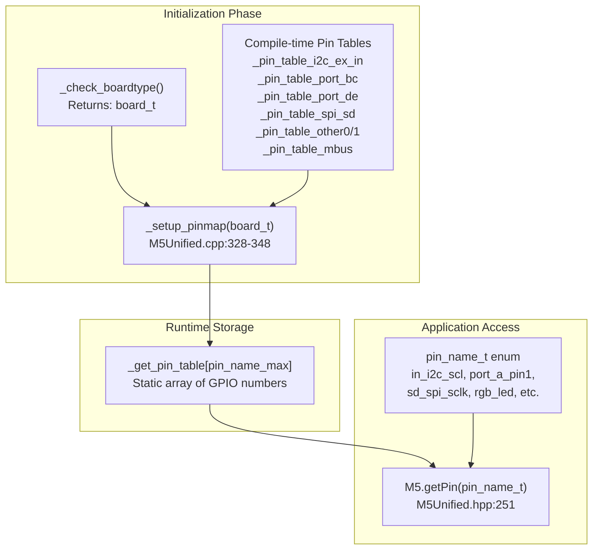
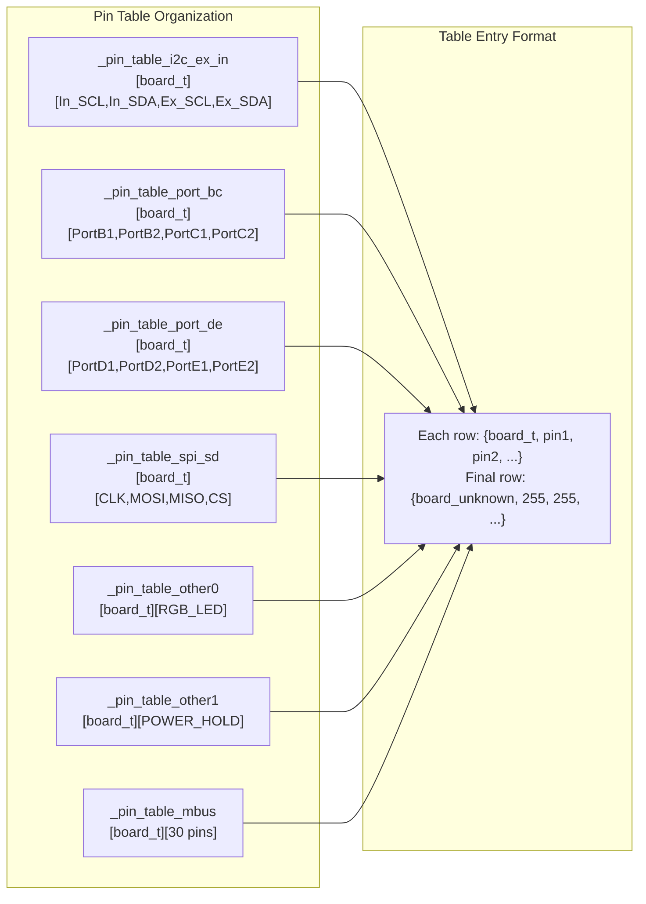
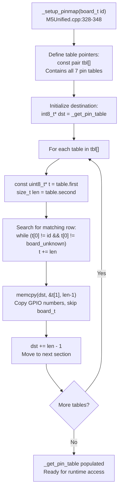
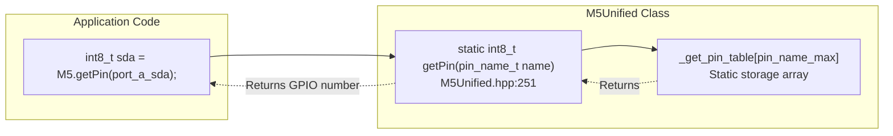
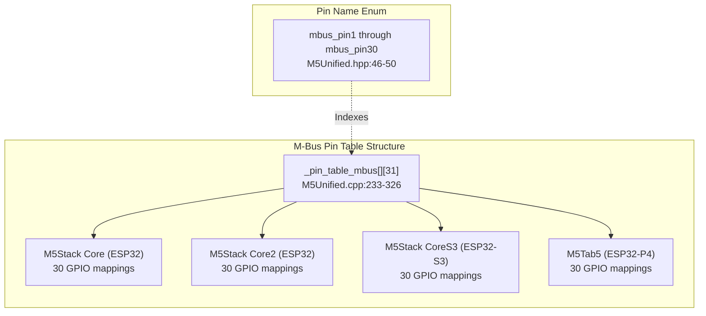
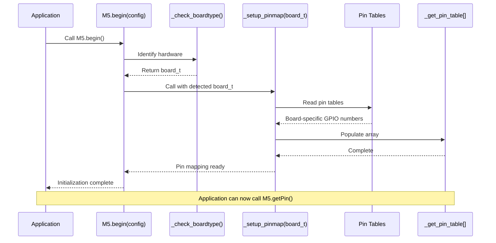
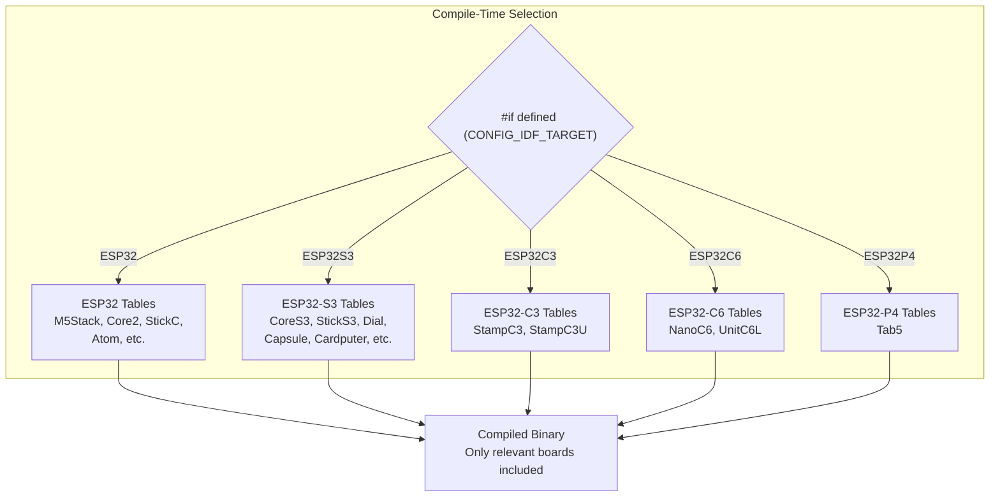

M5Unified Pin Mapping System

# Pin Mapping System

<details>
<summary>Relevant source files</summary>

The following files were used as context for generating this wiki page:

- [README.md](README.md)
- [examples/Basic/HowToUse/HowToUse.ino](examples/Basic/HowToUse/HowToUse.ino)
- [src/M5Unified.cpp](src/M5Unified.cpp)
- [src/M5Unified.hpp](src/M5Unified.hpp)

</details>


## Purpose and Scope

The Pin Mapping System provides a unified interface for accessing GPIO pin numbers across M5Stack's 19+ supported board types. Rather than hardcoding board-specific GPIO numbers, the system uses logical pin names that are resolved to physical GPIO numbers at runtime based on the detected board type. This enables a single compiled binary to support multiple M5Stack devices without modification.

For information about board detection that precedes pin mapping, see [Board Detection and Hardware Identification](#2.2). For information about how pins are configured and used by specific peripherals, see [I2C Bus Architecture](#7.1) and other subsystem pages.

## Architecture Overview

The pin mapping system operates through three key components: a logical pin name enumeration, compile-time pin tables indexed by board type, and a runtime lookup mechanism.



**Sources:** [src/M5Unified.cpp:328-348](), [src/M5Unified.hpp:26-53](), [src/M5Unified.hpp:251]()

## Pin Name Enumeration

The `pin_name_t` enum provides logical names for all mappable pins in the system. These names abstract away board-specific GPIO numbers.

| Pin Name Category | Enum Members | Purpose |
|-------------------|--------------|---------|
| Internal I2C | `in_i2c_scl`, `in_i2c_sda` | I2C bus for internal peripherals (PMICs, IMU, RTC) |
| External I2C (Port A) | `ex_i2c_scl`, `ex_i2c_sda`, `port_a_scl`, `port_a_sda`, `port_a_pin1`, `port_a_pin2` | External I2C on Port A connector |
| Port B | `port_b_pin1`, `port_b_pin2`, `port_b_in`, `port_b_out` | General-purpose Port B pins |
| Port C | `port_c_pin1`, `port_c_pin2`, `port_c_rxd`, `port_c_txd` | UART pins on Port C |
| Port D | `port_d_pin1`, `port_d_pin2`, `port_d_rxd`, `port_d_txd`, `port_b2_pin1`, `port_b2_pin2` | Port D (also mapped as Port B2 on M5Station) |
| Port E | `port_e_pin1`, `port_e_pin2`, `port_e_rxd`, `port_e_txd`, `port_c2_pin1`, `port_c2_pin2` | Port E (also mapped as Port C2 on M5Station) |
| SD Card SPI | `sd_spi_sclk`, `sd_spi_copi`, `sd_spi_mosi`, `sd_spi_cipo`, `sd_spi_miso`, `sd_spi_cs`, `sd_spi_ss` | SPI pins for SD card access |
| Special Functions | `rgb_led`, `power_hold` | RGB LED control and power hold pin |
| M-Bus | `mbus_pin1` through `mbus_pin30` | M5Stack module bus pins (30 pins total) |

Note that many pin names have aliases (e.g., `port_a_scl` is an alias for `port_a_pin1`, and `ex_i2c_scl` is also an alias for the same pin).

**Sources:** [src/M5Unified.hpp:26-53]()

## Pin Table Structure

Pin mappings are stored in compile-time tables, with one row per board type. Each table covers a specific category of pins.



**Sources:** [src/M5Unified.cpp:73-326]()

### I2C Pin Table Example

The I2C pin table demonstrates the structure used across all tables:

```cpp
// From M5Unified.cpp:73-116
static constexpr const uint8_t _pin_table_i2c_ex_in[][5] = {
                            // In SCL,SDA, EX SCL,SDA
#if defined (CONFIG_IDF_TARGET_ESP32S3)
{ board_t::board_M5StackCoreS3, GPIO_NUM_11,GPIO_NUM_12 , GPIO_NUM_1 ,GPIO_NUM_2  },
{ board_t::board_M5StickS3    , GPIO_NUM_48,GPIO_NUM_47 , GPIO_NUM_10,GPIO_NUM_9  },
{ board_t::board_M5Capsule    , GPIO_NUM_10,GPIO_NUM_8  , GPIO_NUM_15,GPIO_NUM_13 },
// ...more ESP32S3 boards...
{ board_t::board_unknown      , GPIO_NUM_39,GPIO_NUM_38 , GPIO_NUM_1 ,GPIO_NUM_2  }, // Default for ESP32S3
#elif defined (CONFIG_IDF_TARGET_ESP32)
{ board_t::board_M5Stack      , GPIO_NUM_22,GPIO_NUM_21 , GPIO_NUM_22,GPIO_NUM_21 },
{ board_t::board_M5AtomLite   , GPIO_NUM_21,GPIO_NUM_25 , GPIO_NUM_32,GPIO_NUM_26 },
// ...more ESP32 boards...
{ board_t::board_unknown      , GPIO_NUM_22,GPIO_NUM_21 , GPIO_NUM_33,GPIO_NUM_32 }, // Default for ESP32
#endif
};
```

Key observations:
- Each row starts with a `board_t` enum value
- Remaining columns contain GPIO numbers as `uint8_t`
- The value `255` (0xFF) indicates "no pin assigned"
- Tables are conditionally compiled based on ESP32 variant (`ESP32`, `ESP32S3`, `ESP32C3`, `ESP32C6`, `ESP32P4`)
- The final row uses `board_t::board_unknown` as a fallback default

**Sources:** [src/M5Unified.cpp:73-116]()

## Pin Mapping Process

The `_setup_pinmap()` function translates board-specific pin tables into a flat runtime lookup array.



**Implementation Details:**

The function processes each table sequentially:

1. **Table Registration**: Line 330-338 creates an array of pointers to all pin tables along with their row sizes
2. **Row Matching**: Line 344 searches each table for a row matching the detected `board_t`, falling back to `board_unknown` if no exact match exists
3. **Data Copy**: Line 345 copies GPIO numbers from the matched row into `_get_pin_table`, skipping the first byte (the `board_t` identifier)
4. **Sequential Layout**: The destination pointer advances by `len-1` bytes after each table, creating a flat array

The resulting `_get_pin_table` array has indices that correspond to the `pin_name_t` enum values, enabling O(1) lookup.

**Sources:** [src/M5Unified.cpp:328-348]()

## Runtime Pin Access

Applications retrieve GPIO numbers using the `M5.getPin()` method.



**Usage Example:**

```cpp
// Get Port A I2C pins
int8_t sda_pin = M5.getPin(m5::port_a_sda);  // or ex_i2c_sda, or port_a_pin2
int8_t scl_pin = M5.getPin(m5::port_a_scl);  // or ex_i2c_scl, or port_a_pin1

// Get SD card SPI pins
int8_t sd_cs = M5.getPin(m5::sd_spi_cs);
int8_t sd_clk = M5.getPin(m5::sd_spi_sclk);

// Get special function pins
int8_t led_pin = M5.getPin(m5::rgb_led);
int8_t hold_pin = M5.getPin(m5::power_hold);

// Returns -1 (or 255 cast to int8_t) if pin not assigned on current board
if (led_pin != 255) {
  // Use the LED pin
}
```

The `getPin()` method is a simple inline function that performs an array lookup: `return _get_pin_table[name];`

**Sources:** [src/M5Unified.hpp:251](), [src/M5Unified.cpp:62]()

## Board-Specific Pin Configurations

Different board types have vastly different pin assignments. Below are examples showing how the same logical pins map to different GPIOs across boards.

### Port A I2C Pins Across ESP32 Boards

| Board Type | `ex_i2c_scl` (Port A) | `ex_i2c_sda` (Port A) | `in_i2c_scl` (Internal) | `in_i2c_sda` (Internal) |
|------------|------------------------|------------------------|--------------------------|--------------------------|
| M5Stack (ESP32) | GPIO_NUM_22 | GPIO_NUM_21 | GPIO_NUM_22 | GPIO_NUM_21 |
| M5Stack Core2 (ESP32) | GPIO_NUM_33 | GPIO_NUM_32 | GPIO_NUM_22 | GPIO_NUM_21 |
| M5Atom Lite (ESP32) | GPIO_NUM_32 | GPIO_NUM_26 | GPIO_NUM_21 | GPIO_NUM_25 |
| M5Paper (ESP32) | GPIO_NUM_32 | GPIO_NUM_25 | GPIO_NUM_22 | GPIO_NUM_21 |

Note: M5Stack BASIC/GRAY/GO/FIRE shares the same I2C bus between internal and external (Port A), while Core2 uses separate buses.

**Sources:** [src/M5Unified.cpp:73-116]()

### Port A I2C Pins Across ESP32-S3 Boards

| Board Type | `ex_i2c_scl` (Port A) | `ex_i2c_sda` (Port A) | `in_i2c_scl` (Internal) | `in_i2c_sda` (Internal) |
|------------|------------------------|------------------------|--------------------------|--------------------------|
| M5Stack CoreS3 | GPIO_NUM_1 | GPIO_NUM_2 | GPIO_NUM_11 | GPIO_NUM_12 |
| M5StickS3 | GPIO_NUM_10 | GPIO_NUM_9 | GPIO_NUM_48 | GPIO_NUM_47 |
| M5Capsule | GPIO_NUM_15 | GPIO_NUM_13 | GPIO_NUM_10 | GPIO_NUM_8 |
| M5Cardputer | GPIO_NUM_1 | GPIO_NUM_2 | 255 (none) | 255 (none) |

**Sources:** [src/M5Unified.cpp:73-94]()

### SPI and SD Card Pins

| Board Type | `sd_spi_sclk` | `sd_spi_mosi` | `sd_spi_miso` | `sd_spi_cs` |
|------------|---------------|---------------|---------------|-------------|
| M5Stack (ESP32) | GPIO_NUM_18 | GPIO_NUM_23 | GPIO_NUM_19 | GPIO_NUM_4 |
| M5Stack Core2 (ESP32) | GPIO_NUM_18 | GPIO_NUM_23 | GPIO_NUM_38 | GPIO_NUM_4 |
| M5Stack CoreS3 (ESP32-S3) | GPIO_NUM_36 | GPIO_NUM_37 | GPIO_NUM_35 | GPIO_NUM_4 |
| M5Cardputer (ESP32-S3) | GPIO_NUM_40 | GPIO_NUM_14 | GPIO_NUM_39 | GPIO_NUM_12 |

**Sources:** [src/M5Unified.cpp:156-176]()

### Special Function Pins

| Board Type | `rgb_led` | `power_hold` | Notes |
|------------|-----------|--------------|-------|
| M5Stack (ESP32) | GPIO_NUM_15 | 255 (none) | Basic RGB LED control |
| M5Stack Core2 (ESP32) | GPIO_NUM_25 | 255 (none) | Uses AXP192 power control |
| M5Stack CoreS3 (ESP32-S3) | 255 (none) | 255 (none) | No RGB LED or hold pin |
| M5Atom Lite (ESP32) | GPIO_NUM_27 | 255 (none) | SK6812 RGB LED |
| M5Dial (ESP32-S3) | GPIO_NUM_21 | GPIO_NUM_46 | Power hold required |
| M5Capsule (ESP32-S3) | GPIO_NUM_21 | GPIO_NUM_46 | Power hold required |
| M5Paper (ESP32) | 255 (none) | GPIO_NUM_2 | Power hold for e-paper |
| M5PaperS3 (ESP32-S3) | 255 (none) | GPIO_NUM_44 | Power hold for e-paper |

**Sources:** [src/M5Unified.cpp:178-231]()

## M-Bus Pin Mapping

M5Stack Core and CoreS3 boards feature a 30-pin M-Bus connector that exposes various ESP32 GPIO pins for module expansion. The M-Bus table is the largest pin table, mapping 30 logical pin names to physical GPIOs.



**Example M-Bus Pins for M5Stack Core (ESP32):**

| Logical Pin | Physical GPIO | Typical Usage |
|-------------|---------------|---------------|
| `mbus_pin1` | 255 (none) | - |
| `mbus_pin2` | GPIO_NUM_35 | ADC input |
| `mbus_pin3` | 255 (none) | - |
| `mbus_pin4` | GPIO_NUM_36 | ADC input |
| `mbus_pin7` | GPIO_NUM_23 | SPI MOSI |
| `mbus_pin8` | GPIO_NUM_25 | DAC output |
| `mbus_pin9` | GPIO_NUM_19 | SPI MISO |
| `mbus_pin10` | GPIO_NUM_26 | ADC input |
| `mbus_pin11` | GPIO_NUM_18 | SPI CLK |
| `mbus_pin15` | GPIO_NUM_16 | UART RXD |
| `mbus_pin16` | GPIO_NUM_17 | UART TXD |
| `mbus_pin17` | GPIO_NUM_21 | I2C SDA |
| `mbus_pin18` | GPIO_NUM_22 | I2C SCL |

**Sources:** [src/M5Unified.cpp:233-326](), [src/M5Unified.hpp:46-50]()

## Integration with System Initialization

The pin mapping system is invoked during the `M5.begin()` initialization sequence:



The pin mapping is established before any peripheral initialization occurs, ensuring that I2C, SPI, and other subsystems have access to correct GPIO numbers when they configure their hardware.

**Sources:** [src/M5Unified.hpp:332-356]()

## Platform-Specific Table Compilation

Pin tables use conditional compilation to minimize memory usage. Each ESP32 variant (ESP32, ESP32-S3, ESP32-C3, ESP32-C6, ESP32-P4) includes only the board types relevant to that chip.



This approach ensures that an ESP32-S3 binary doesn't include pin tables for ESP32 boards, reducing flash memory usage.

**Sources:** [src/M5Unified.cpp:73-326]()

## Unassigned Pins

When a board doesn't have a particular logical pin, the value `255` (0xFF) is stored in the pin table. This value, when cast to `int8_t`, becomes `-1`, which applications can check:

```cpp
int8_t hold_pin = M5.getPin(m5::power_hold);
if (hold_pin == 255 || hold_pin < 0) {
  // This board doesn't have a power hold pin
  // Skip power hold initialization
} else {
  // Configure power hold
  pinMode(hold_pin, OUTPUT);
  digitalWrite(hold_pin, HIGH);
}
```

**Sources:** [src/M5Unified.cpp:73-326]()

## Summary

The Pin Mapping System provides:
- **Abstraction**: Logical pin names instead of hardcoded GPIO numbers
- **Flexibility**: Single binary supports multiple board types
- **Efficiency**: Compile-time tables with O(1) runtime lookup
- **Maintainability**: Centralized pin definitions in tabular format
- **Completeness**: Covers I2C, SPI, ports, special functions, and M-Bus pins

The system is initialized automatically during `M5.begin()` and accessed throughout the codebase via `M5.getPin()`, enabling board-agnostic peripheral configuration.