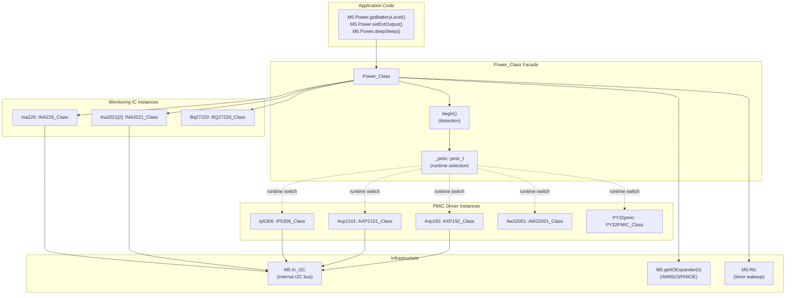
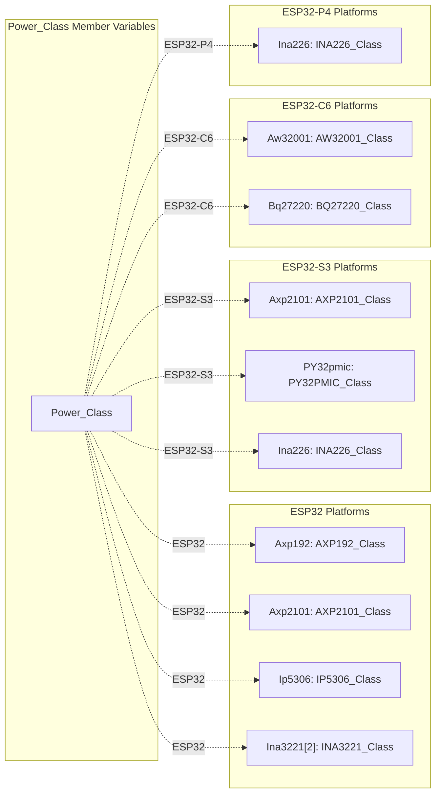
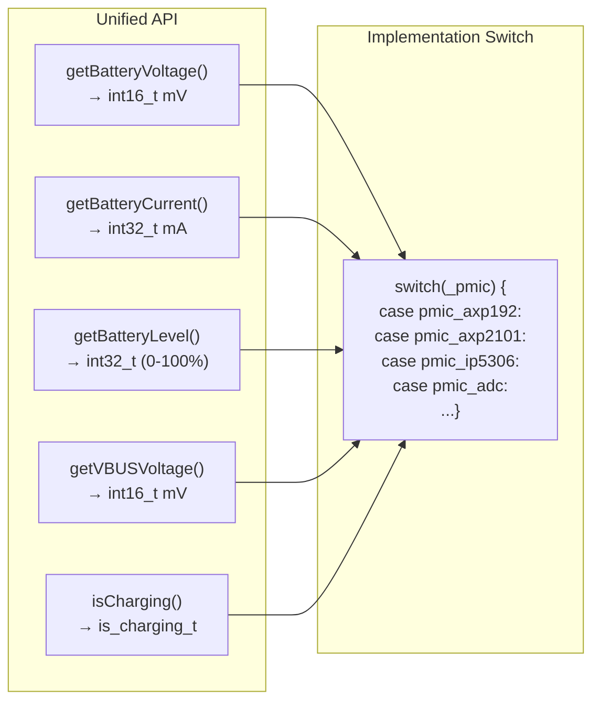
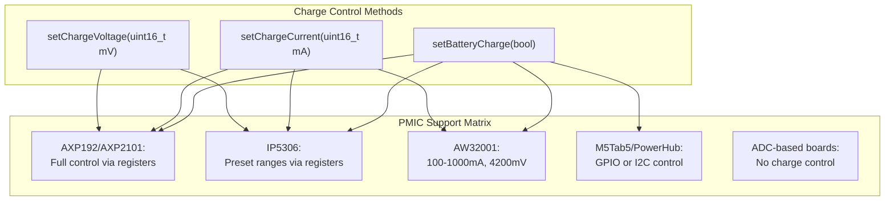
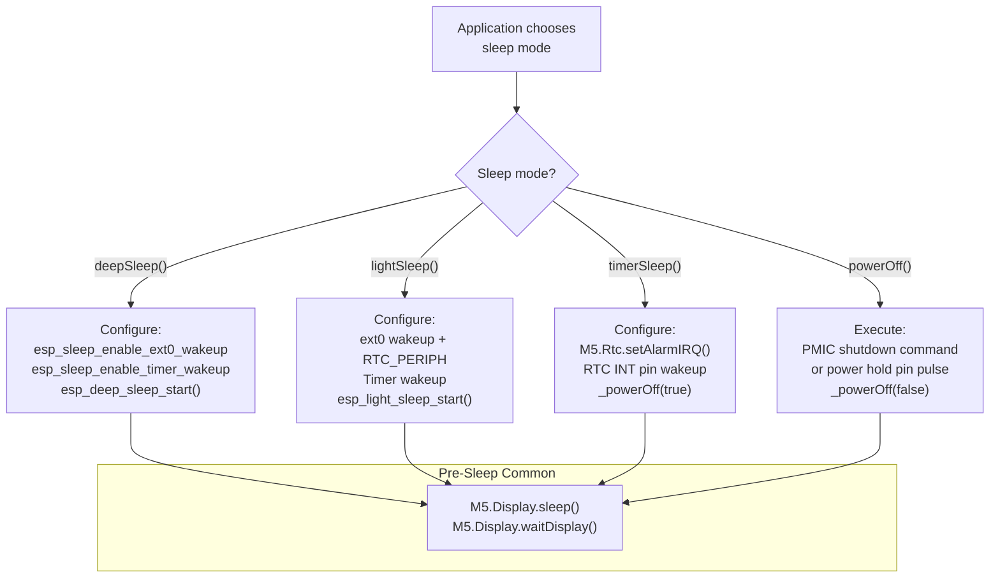
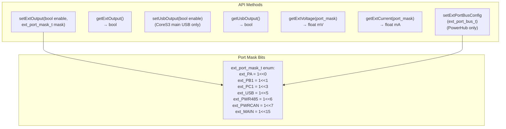
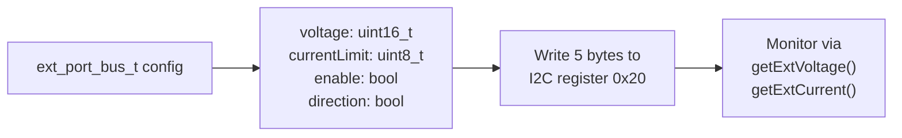

M5Unified Power Management System

# Power Management System

<details>
<summary>Relevant source files</summary>

The following files were used as context for generating this wiki page:

- [src/utility/Power_Class.cpp](src/utility/Power_Class.cpp)
- [src/utility/Power_Class.hpp](src/utility/Power_Class.hpp)

</details>


The Power Management System provides unified control over battery monitoring, charging, sleep modes, and external power distribution across the 19+ supported M5Stack devices. The system abstracts hardware differences between multiple Power Management IC (PMIC) types and board-specific configurations through the `Power_Class` facade, allowing application code to use a consistent API regardless of underlying hardware.

The M5Stack product line uses diverse power management hardware:
- **AXP192/AXP2101**: Full-featured PMICs with multi-rail voltage control (Core2, CoreS3, StickC)
- **IP5306**: Basic charge controller (M5Stack Basic/Gray/Fire)
- **AW32001 + BQ27220**: Charger IC with fuel gauge (Arduino Nesso N1)
- **ADC-based**: Direct battery voltage measurement without PMIC (Paper, Capsule, Cardputer)
- **INA226/INA3221**: External current/voltage monitoring ICs (M5Tab5, M5Station)

This page provides an architectural overview of the power management system. For detailed information, see:
- **[Page 3.1](#3.1)**: PMIC detection and initialization procedures
- **[Page 3.2](#3.2)**: Battery monitoring and charging control APIs
- **[Page 3.3](#3.3)**: Sleep mode implementations and wakeup configuration
- **[Page 3.4](#3.4)**: External port power control and safety mechanisms
- **[Page 3.5](#3.5)**: Voltage rail configuration for PMICs

**Sources:** [src/utility/Power_Class.hpp:1-250](), [src/utility/Power_Class.cpp:1-1924]()

---

## Architecture Overview

### Facade Pattern and Hardware Abstraction

The `Power_Class` implements a facade pattern that provides a unified API while automatically detecting and managing diverse power management hardware. During `M5.begin()`, the `Power_Class::begin()` method executes board-specific detection logic and initializes the appropriate PMIC driver(s).

**Diagram: Power_Class Facade Architecture**



**Key Architectural Components:**

- **Power_Class**: Main facade exposing unified power management API
- **pmic_t enum**: Runtime selector determining which PMIC driver to use
- **PMIC driver instances**: Concrete implementations (Axp192, Axp2101, Ip5306, etc.) exist as member variables but only the detected type is actively used
- **Monitoring IC instances**: Optional INA3221, INA226, BQ27220 for enhanced current/voltage monitoring
- **I2C infrastructure**: All PMICs and monitoring ICs communicate via `M5.In_I2C` internal bus

**Sources:** [src/utility/Power_Class.hpp:67-247](), [src/utility/Power_Class.cpp:53-513]()

### PMIC Type Enumeration

The `pmic_t` enum at [src/utility/Power_Class.hpp:72-81]() identifies the detected power management hardware:

| pmic_t Value | Description | Typical Boards |
|--------------|-------------|----------------|
| `pmic_unknown` | No PMIC detected | Basic boards without power management |
| `pmic_adc` | ADC-based voltage measurement | Paper, PaperS3, Capsule, Cardputer, CoreInk, TimerCam |
| `pmic_axp192` | X-Powers AXP192 PMIC | Core2, Tough, StickC, StickCPlus, M5Station |
| `pmic_ip5306` | Injoinic IP5306 charger IC | M5Stack Basic/Gray/Go/Fire |
| `pmic_axp2101` | X-Powers AXP2101 PMIC | Core2 v1.1, CoreS3, CoreS3SE |
| `pmic_aw32001` | Awinic AW32001 charger IC | Arduino Nesso N1 |
| `pmic_py32pmic` | PY32 PMIC | Specialized boards |
| `pmic_m5pm1` | M5Stack PM1 PMIC | M5StickS3 |

The runtime selection pattern allows a single compiled binary to support multiple hardware variants. Methods like `getBatteryVoltage()` use switch statements on `_pmic` to delegate to the appropriate implementation.

**Sources:** [src/utility/Power_Class.hpp:72-81](), [src/utility/Power_Class.cpp:1362-1421]()

### PMIC Driver Classes

The Power_Class contains instances of all PMIC driver classes as member variables. The appropriate instance is activated based on `_pmic` detection:

**Diagram: PMIC Driver Class Structure**



The driver instances are conditionally compiled based on `CONFIG_IDF_TARGET_*` macros, ensuring only relevant drivers are included for each platform.

**Sources:** [src/utility/Power_Class.hpp:208-231]()

---

## Power Management Capabilities

The Power Management System provides five major capability areas, each implemented through the `Power_Class` facade with board-specific logic.

### 1. PMIC Detection and Initialization

The `Power_Class::begin()` method automatically detects power management hardware by examining the board type via `M5.getBoard()` and probing I2C devices. The detection is platform-specific and configures appropriate PMIC driver(s) with board-specific register settings.

**Detection Flow:**
1. Set `_pmic = pmic_unknown`
2. Switch on `M5.getBoard()` platform (ESP32-P4, ESP32-C6, ESP32-S3, ESP32)
3. For each board type, configure:
   - PMIC type (`_pmic` enum value)
   - ADC configuration (`_batAdcCh`, `_batAdcUnit`, `_adc_ratio`) for ADC-based boards
   - Wakeup pins (`_wakeupPin`, `_rtcIntPin`)
   - IO expander registers for peripheral control
   - Monitoring ICs (INA226, INA3221, BQ27220)
4. Initialize detected PMIC with voltage rails and charge parameters
5. Execute board-specific post-initialization (e.g., enable boost converters, configure port pins)

**Example Board Configurations:**

| Board | PMIC Type | Additional Setup |
|-------|-----------|------------------|
| CoreS3 | `pmic_axp2101` | Enable AW9523 SY7088 boost, configure ALDO1-4 voltages |
| Core2 | `pmic_axp192` (fallback to `pmic_axp2101`) | Configure LDO2/LDO3, set charge current, try INA3221 |
| M5Stack | `pmic_ip5306` | Configure 9 registers for charge/boost/shutdown behavior |
| PaperS3 | `pmic_adc` | Set ADC channel GPIO3, ratio 2.0, wakeup pin GPIO48 |
| M5Tab5 | (no PMIC) | Configure dual IO expanders, initialize INA226 at 0x41 |

See **[Page 3.1](#3.1)** for complete detection flowcharts and register initialization sequences.

**Sources:** [src/utility/Power_Class.cpp:53-513]()

### 2. Battery Monitoring and Charging Control

The Power_Class provides unified API methods for reading battery state and controlling charge parameters. Implementation varies by PMIC type through runtime switch statements on the `_pmic` enum.

**Battery Monitoring API:**



**Measurement Implementation Matrix:**

| PMIC Type | Voltage Source | Current Source | Level Calculation | VBUS Support |
|-----------|----------------|----------------|-------------------|--------------|
| `pmic_axp192` | AXP192 register | Charge - Discharge | 3.3-4.15V linear | Yes |
| `pmic_axp2101` | AXP2101 register | INA3221 (Core2 v1.1) or 0 (CoreS3) | Built-in fuel gauge | Yes |
| `pmic_ip5306` | Not supported | Not supported | IP5306 register bits | No |
| `pmic_adc` | `_getBatteryAdcRaw()` × `_adc_ratio` | Not supported | 3.3-4.15V linear | No |
| `pmic_aw32001` | BQ27220 fuel gauge | Not supported | BQ27220 calculation | No |
| M5Tab5 special | INA226 bus voltage | INA226 shunt current | 2S Li-Po calculation | No |
| M5PowerHub special | I2C register 0x30 | I2C register 0x32 | 2S calculation | No |

**Charging Control API:**



ADC-based measurement for boards without PMICs uses ESP32 ADC channels with voltage dividers. The `_getBatteryAdcRaw()` method handles ESP-IDF v4/v5 API differences for ADC calibration.

See **[Page 3.2](#3.2)** for detailed implementation of each PMIC's monitoring and charging algorithms, ADC calibration procedures, and charge parameter ranges.

**Sources:** [src/utility/Power_Class.cpp:1227-1309](), [src/utility/Power_Class.cpp:1311-1358](), [src/utility/Power_Class.cpp:1360-1421](), [src/utility/Power_Class.cpp:1423-1500](), [src/utility/Power_Class.cpp:1502-1563](), [src/utility/Power_Class.cpp:1565-1631](), [src/utility/Power_Class.cpp:1633-1685](), [src/utility/Power_Class.cpp:1687-1723](), [src/utility/Power_Class.cpp:1725-1779]()

### 3. Sleep Modes and Power States

The Power Management System implements four power-saving modes with different characteristics and wakeup mechanisms:

**Sleep Mode Comparison:**

| Mode | API Method | Power Consumption | RAM Retention | Wakeup Sources | Resume Behavior |
|------|-----------|-------------------|---------------|----------------|-----------------|
| Deep Sleep | `deepSleep(us, touch)` | ~10µA | No | Timer, GPIO | `setup()` restart |
| Light Sleep | `lightSleep(us, touch)` | ~800µA | Yes | Timer, GPIO | Continue from `loop()` |
| Timer Sleep | `timerSleep(...)` | Varies | No | RTC alarm | `setup()` restart |
| Power Off | `powerOff()` | ~1µA | No | Power button | `setup()` restart |

**Sleep Mode Selection Logic:**



**Board-Specific Sleep Behavior:**

- **IP5306 boards (M5Stack)**: Call `Ip5306.setPowerBoostKeepOn(true)` before deep/light sleep to prevent auto-shutdown
- **AXP192/2101 boards**: Use PMIC `powerOff()` register commands
- **ADC-based boards**: Use GPIO power hold pins or IO expander pulse sequences
- **M5PaperS3**: Requires `gpio_wakeup_enable()` instead of `ext0_wakeup` for GPIO48 (non-RTC pin)

**Wakeup Pin Assignments:**

Stored in `_wakeupPin` and `_rtcIntPin` member variables during `begin()`:

| Board | _wakeupPin | _rtcIntPin | Purpose |
|-------|------------|------------|---------|
| Core2/Tough | GPIO39 | - | Touch panel interrupt |
| Paper | GPIO36 | - | Touch panel interrupt |
| PaperS3 | GPIO48 | - | Touch panel interrupt |
| CoreInk | GPIO27 | GPIO19 | Power button, RTC INT |
| StickC/Plus | - | GPIO35 | RTC INT |
| StickCPlus2 | GPIO35 | - | Power button |

See **[Page 3.3](#3.3)** for detailed sleep mode implementations, wakeup configuration for each board, and the `_powerOff()` internal method flow.

**Sources:** [src/utility/Power_Class.cpp:922-946](), [src/utility/Power_Class.cpp:1048-1087](), [src/utility/Power_Class.cpp:1089-1139](), [src/utility/Power_Class.cpp:1141-1191](), [src/utility/Power_Class.cpp:1193-1198](), [src/utility/Power_Class.cpp:1200-1225]()

### 4. External Port Power Control

The Power Management System controls power output to expansion ports (Grove ports, USB, RS485/CAN) with board-specific implementations and safety mechanisms to prevent battery damage.

**External Port API:**



**Board Implementation Matrix:**

| Board | Control Method | Port Types | Safety Logic |
|-------|----------------|------------|--------------|
| CoreS3/SE | AW9523 IO Expander (0x58) | BUS_EN, USB_EN | Battery + VBUS check |
| Core2/Tough | AXP192 GPIO0 or AXP2101 BLDO2 | Single external port | Battery level + VBUS check |
| StickC/Plus | AXP192 EXTEN | Single external port | None |
| M5Station | AXP192 GPIO0-4 + GPIO12 | 5 ports + USB + MAIN | None |
| M5Tab5 | Dual IO Expanders | Port A + USB | None |
| M5PowerHub | I2C registers 0x01-0x04 | 4 programmable ports | None |
| M5Paper | GPIO5 | EXT5V_ENABLE | None |
| M5StickS3 | M5PM1 register 0x06 bit 3 | 5V output | None |
| Arduino Nesso N1 | IO Expander pin 2 | EXT_PWR_EN | None |

**Safety Mechanisms:**

Two boards implement protection to prevent battery damage:

1. **CoreS3**: Cancels `setExtOutput(true)` if:
   - No battery detected (`!Axp2101.getBatState()`)
   - AND TS voltage > 2.0V (thermistor indicates missing battery)
   - AND VBUS present (USB-powered without battery)

2. **Core2/Tough**: Cancels `setExtOutput(true)` if:
   - Battery level ≤ 8%
   - AND power consumed from VBUS (not from ACIN or M-Bus)

**M5PowerHub Advanced Configuration:**

PowerHub supports programmable per-port voltage (3000-20000mV) and current limits (0-232mA):



See **[Page 3.4](#3.4)** for detailed port control implementations, safety check logic for each board, and PowerHub register mapping.

**Sources:** [src/utility/Power_Class.cpp:552-684](), [src/utility/Power_Class.cpp:686-752](), [src/utility/Power_Class.cpp:754-789](), [src/utility/Power_Class.cpp:1781-1836](), [src/utility/Power_Class.cpp:1838-1846](), [src/utility/Power_Class.cpp:1880-1896](), [src/utility/Power_Class.hpp:38-65]()

### 5. Voltage Rails and PMIC Configuration

Boards with full-featured PMICs (AXP192, AXP2101, IP5306) support multiple voltage rails for powering ESP32 and peripherals. Rails are configured during `Power_Class::begin()` with board-specific register writes.

**AXP192 Voltage Rails (Core2, Tough, StickC, M5Station):**

| Rail | Register | Range | Core2 Use | StickC Use |
|------|----------|-------|-----------|------------|
| DCDC1 | 0x26 | 0.7-3.5V | 3350mV (ESP32 VDD) | 3350mV (ESP32 VDD) |
| DCDC3 | 0x27 | 0.7-3.5V | Off | Off (LCD uses LDO3) |
| LDO2 | 0x28 | 1.8-3.3V | 3300mV (LCD, SD) | Off |
| LDO3 | 0x28 | 1.8-3.3V | 0 (vibration off) | 3000mV (LCD power) |
| GPIO0 LDO | 0x90-0x91 | 1.8-3.3V | Float or 2.8V (ext port) | Not used |

**AXP2101 Voltage Rails (CoreS3, Core2 v1.1):**

| Rail | Registers | Voltage | CoreS3 Use | Core2 v1.1 Use |
|------|-----------|---------|------------|----------------|
| ALDO1 | 0x90, 0x92 | 1800mV | AW88298 audio amp | Not used |
| ALDO2 | 0x90, 0x93 | 3300mV | ES7210 audio codec | Not used |
| ALDO3 | 0x90, 0x94 | 3300mV | Camera module | Not used |
| ALDO4 | 0x90, 0x95 | 3300mV | TF card slot | Not used |
| BLDO2 | - | 3300mV | Not used | External port |
| DLDO1 | 0x99 | 500-3400mV | Not used | Vibration motor |

Register 0x90 contains enable bits for all LDOs. Voltage registers use formula: `(mV / 100) - 5`.

**IP5306 Configuration (M5Stack Basic/Gray/Fire):**

IP5306 has fixed 5V boost output but configurable charge behavior via 9 registers (0x00-0x02, 0x20-0x24):

| Register | Bits | Function | Default Value |
|----------|------|----------|---------------|
| 0x00 (SYS_CTL0) | [4] | Auto power on | Enabled |
| 0x00 (SYS_CTL0) | [1] | Boost normally open | Enabled (for deep sleep) |
| 0x21 (Charger_CTL1) | [7:6] | Charge current detect | 200mA stop |
| 0x22 (Charger_CTL2) | [5:4] | Battery voltage | 4.2V |
| 0x22 (Charger_CTL2) | [1:0] | Voltage boost | +28mV |
| 0x24 (CHG_DIG_CTL0) | [4:0] | Charge current | 150mA |

See **[Page 3.5](#3.5)** for complete register initialization sequences, voltage calculation formulas, and board-specific rail assignments.

**Sources:** [src/utility/Power_Class.cpp:311-374](), [src/utility/Power_Class.cpp:385-441](), [src/utility/Power_Class.cpp:443-486](), [src/utility/Power_Class.cpp:488-506](), [src/utility/Power_Class.cpp:163-179]()

---

## Additional Features

### LED Control

The `setLed(uint8_t brightness)` method controls status LEDs with board-specific implementations:

| Board | Implementation | Control Method |
|-------|----------------|----------------|
| Core2 (AXP192) | PWM register | Register 0x9A: 255-brightness |
| Core2 (AXP2101) | On/Off only | Register 0x69: 0x05=off / 0x35=on |
| StickC/Plus | GPIO10 PWM | `Light_PWM` class, inverted |
| StickCPlus2 | GPIO19 PWM | `Light_PWM` class, channel 6 |
| CoreInk | GPIO10 PWM | `Light_PWM` class, inverted |
| TimerCam | GPIO2 PWM | `Light_PWM` class |
| PaperS3 | GPIO0 PWM | `Light_PWM` class |
| NanoC6 | GPIO7 PWM | `Light_PWM` class |

**Sources:** [src/utility/Power_Class.cpp:730-852]()

### Vibration Motor Control

Core2 has a vibration motor controlled through LDO3 (AXP192) or DLDO1 (AXP2101):

```cpp
M5.Power.setVibration(level);  // level: 0=stop, 1-255=strength
```

The voltage is calculated as: `480mV + level * 12mV` (range: 480-3540mV)

**Sources:** [src/utility/Power_Class.cpp:1647-1668](), [src/utility/Power_Class.hpp:199-201]()

### Power Key State Detection

For boards with AXP192 or AXP2101, the power button state can be read:

```cpp
uint8_t state = M5.Power.getKeyState();
// 0 = none
// 1 = long pressed
// 2 = short clicked  
// 3 = both (long and short)
```

This reads and clears the interrupt status registers, so each press is reported only once. The method calls `Axp192.getPekPress()` or `Axp2101.getPekPress()`.

**Sources:** [src/utility/Power_Class.cpp:1602-1625](), [src/utility/Power_Class.hpp:188-192]()

---

## Code Reference Summary

### Primary Classes

- **Power_Class**: [src/utility/Power_Class.hpp:66-242]()
  - Main facade for all power management operations
  - Contains PMIC driver instances
  - Implements board-specific power control logic

### PMIC Driver Classes

- **AXP192_Class**: [src/utility/Power_Class.hpp:10]()
  - Used in Core2, Tough, StickC, StickCPlus, M5Station
  - Multi-rail LDO/DCDC control
  - Battery monitoring and charge control

- **AXP2101_Class**: [src/utility/Power_Class.hpp:11]()
  - Used in Core2 v1.1, CoreS3, CoreS3SE
  - Advanced multi-rail power management
  - Improved battery monitoring

- **IP5306_Class**: [src/utility/Power_Class.hpp:12]()
  - Used in M5Stack Basic/Gray/Go/Fire
  - Basic charge control
  - Limited monitoring capabilities

- **AW32001_Class**: [src/utility/Power_Class.hpp:15]()
  - Used in Arduino Nesso N1
  - Works with BQ27220 fuel gauge

### Monitoring IC Classes

- **INA3221_Class**: [src/utility/Power_Class.hpp:13]()
  - Dual/triple channel current sensor
  - Used in Core2 v1.1 and M5Station

- **INA226_Class**: [src/utility/Power_Class.hpp:14]()
  - High-precision voltage/current monitor
  - Used in M5Tab5

- **BQ27220_Class**: [src/utility/Power_Class.hpp:16]()
  - Battery fuel gauge
  - Used in Arduino Nesso N1

### Key Methods Reference

| Method | Source Lines | Purpose |
|--------|--------------|---------|
| `begin()` | [src/utility/Power_Class.cpp:50-480]() | PMIC detection and initialization |
| `setExtOutput()` | [src/utility/Power_Class.cpp:519-636]() | External port power control |
| `deepSleep()` | [src/utility/Power_Class.cpp:983-1025]() | ESP32 deep sleep mode |
| `lightSleep()` | [src/utility/Power_Class.cpp:1027-1063]() | ESP32 light sleep mode |
| `timerSleep()` | [src/utility/Power_Class.cpp:1072-1095]() | RTC alarm sleep |
| `powerOff()` | [src/utility/Power_Class.cpp:1065-1070]() | Complete power off |
| `getBatteryVoltage()` | [src/utility/Power_Class.cpp:1216-1264]() | Battery voltage reading |
| `getBatteryLevel()` | [src/utility/Power_Class.cpp:1266-1330]() | Battery percentage |
| `getBatteryCurrent()` | [src/utility/Power_Class.cpp:1413-1465]() | Battery current |
| `setBatteryCharge()` | [src/utility/Power_Class.cpp:1332-1378]() | Enable/disable charging |
| `setChargeCurrent()` | [src/utility/Power_Class.cpp:1380-1411]() | Configure charge current |
| `setChargeVoltage()` | [src/utility/Power_Class.cpp:1467-1503]() | Configure charge voltage |
| `isCharging()` | [src/utility/Power_Class.cpp:1505-1551]() | Charging status |