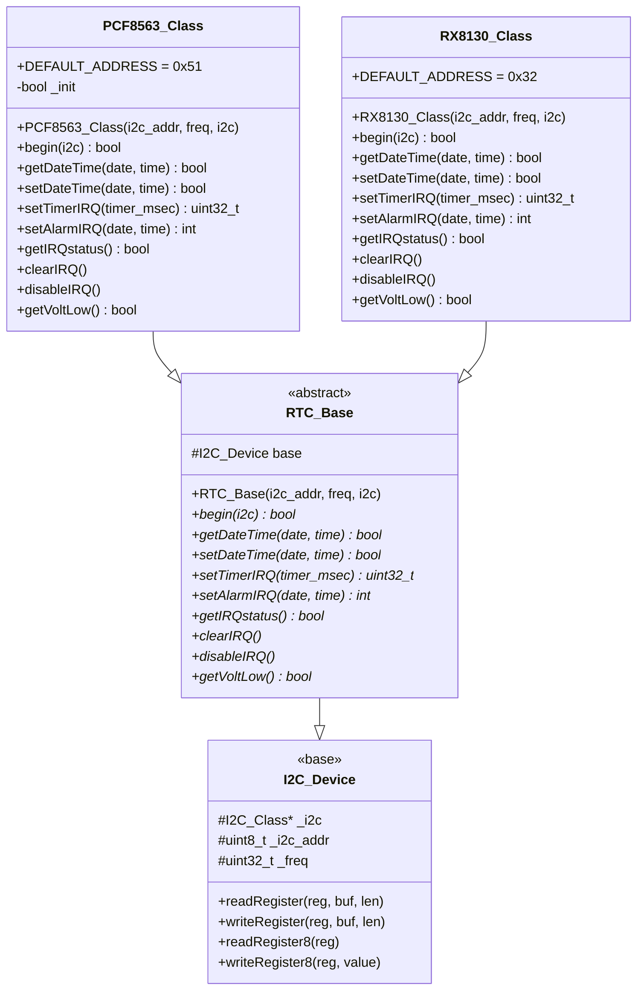
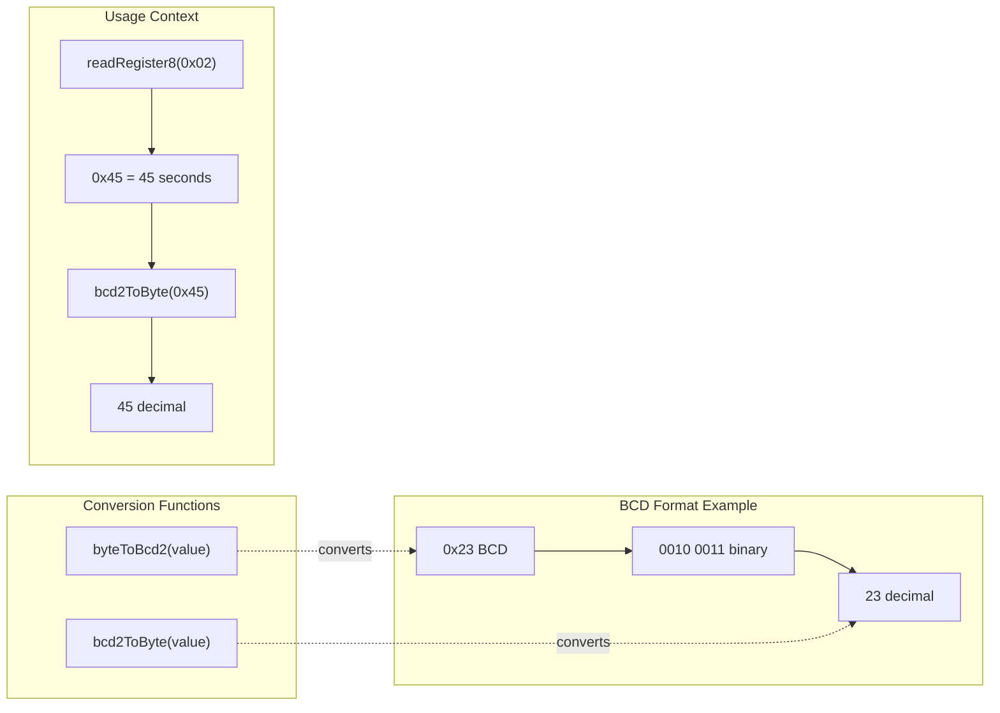
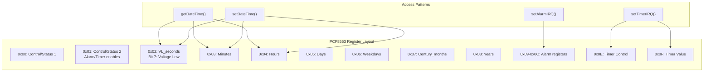
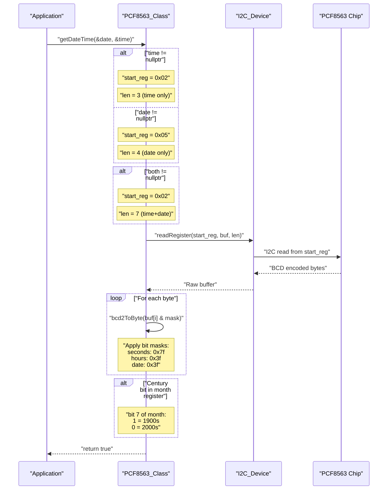
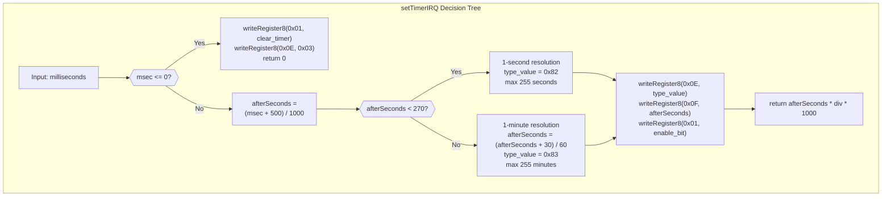
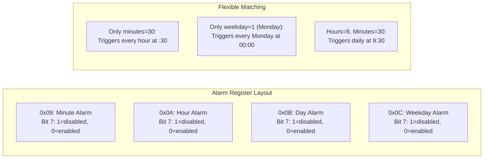
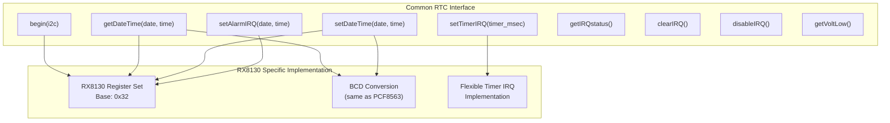
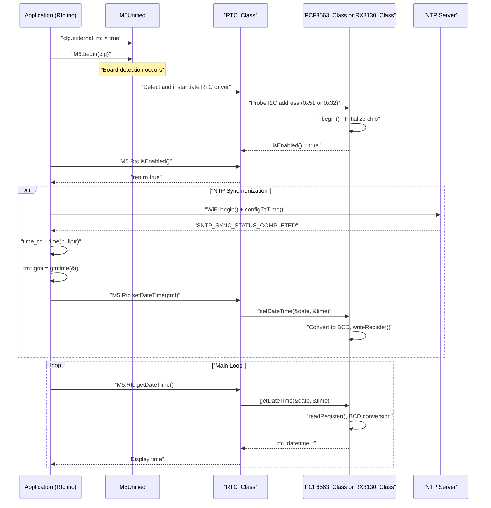

M5Unified RTC Hardware Implementations

# RTC Hardware Implementations

<details>
<summary>Relevant source files</summary>

The following files were used as context for generating this wiki page:

- [examples/Basic/Rtc/Rtc.ino](examples/Basic/Rtc/Rtc.ino)
- [src/utility/rtc/PCF8563_Class.cpp](src/utility/rtc/PCF8563_Class.cpp)
- [src/utility/rtc/PCF8563_Class.hpp](src/utility/rtc/PCF8563_Class.hpp)
- [src/utility/rtc/RTC_Base.hpp](src/utility/rtc/RTC_Base.hpp)
- [src/utility/rtc/RX8130_Class.hpp](src/utility/rtc/RX8130_Class.hpp)

</details>


## Purpose and Scope

This document details the concrete hardware implementations of Real-Time Clock (RTC) drivers in M5Unified. It covers the two primary RTC chip implementations: PCF8563 and RX8130, including their register-level operations, BCD conversion utilities, timer/alarm interrupt configuration, and board-specific usage patterns.

For information about the high-level RTC abstraction layer and the `RTC_Class` interface, see [Real-Time Clock System](#6.2). For IMU sensor implementations, see [IMU System and Calibration](#6.1).

---

## RTC Hardware Support Matrix

M5Unified supports two primary RTC chip families through polymorphic driver implementations. The RTC hardware is detected and instantiated at runtime during system initialization.

| RTC Chip | I2C Address | Supported Boards | Key Features |
|----------|-------------|------------------|--------------|
| PCF8563 | 0x51 | M5StickC, M5StickCPlus, TimerCamera, most units | Timer IRQ (1s-255min), Alarm IRQ, Voltage low detection |
| RX8130 | 0x32 | M5Tab5, M5StampPLC | Timer IRQ, Alarm IRQ, Enhanced flexibility |
| BM8563 | 0x51 | Various (PCF8563 compatible) | Compatible with PCF8563 driver |

**Sources:** [src/utility/rtc/PCF8563_Class.hpp:14](), [src/utility/rtc/RX8130_Class.hpp:14]()

---

## Class Inheritance Architecture



**Sources:** [src/utility/rtc/RTC_Base.hpp:78-103](), [src/utility/rtc/PCF8563_Class.hpp:11-38](), [src/utility/rtc/RX8130_Class.hpp:11-36]()

---

## Data Structures

### Time and Date Representation

Both RTC implementations use the same standardized structures defined in `RTC_Base.hpp`:

| Structure | Fields | Description |
|-----------|--------|-------------|
| `rtc_time_t` | `hours`, `minutes`, `seconds` (int8_t) | Time components, -1 indicates unset |
| `rtc_date_t` | `year` (int16_t), `month`, `date`, `weekDay` (int8_t) | Date components, year range 1900-2099 |
| `rtc_datetime_t` | `date` (rtc_date_t), `time` (rtc_time_t) | Combined date and time |

The negative value convention (`-1`) allows partial specification for alarm configuration where only certain fields should trigger the alarm.

**Sources:** [src/utility/rtc/RTC_Base.hpp:18-76]()

---

## BCD Conversion System

Both PCF8563 and RX8130 chips store time/date values in Binary-Coded Decimal (BCD) format, where each nibble (4 bits) represents a decimal digit. M5Unified provides conversion utilities in the PCF8563 implementation that are used across RTC drivers.



### Conversion Implementation

**`bcd2ToByte(value)`** - Converts BCD to decimal byte:
- High nibble: `(value >> 4) * 10`
- Low nibble: `value & 0x0F`
- Example: `0x23` → `2*10 + 3` = `23`

**`byteToBcd2(value)`** - Converts decimal byte to BCD:
- Compute tens digit: `bcdhigh = value / 10`
- Compute ones digit: `value - (bcdhigh * 10)`
- Combine: `(bcdhigh << 4) | ones`
- Example: `23` → `(2 << 4) | 3` = `0x23`

**Sources:** [src/utility/rtc/PCF8563_Class.cpp:10-19]()

---

## PCF8563 Implementation

The `PCF8563_Class` is the most commonly used RTC implementation, found in M5StickC, M5StickCPlus, TimerCamera, and various external RTC units.

### Register Map



**Sources:** [src/utility/rtc/PCF8563_Class.cpp:29-200]()

### Initialization Sequence

The `begin()` method performs a two-stage initialization:

1. **First Write (Dummy):** `writeRegister8(0x00, 0x00)` - TimerCamera internal RTC sometimes fails initial communication, so a dummy write ensures the I2C bus is properly initialized [src/utility/rtc/PCF8563_Class.cpp:29]()

2. **Control Register Setup:**
   - `writeRegister8(0x00, 0x00)` - Clear control register 1
   - `writeRegister8(0x0E, 0x03)` - Initialize timer control register

3. **Validation:** Both writes must succeed for `_init = true`

**Sources:** [src/utility/rtc/PCF8563_Class.cpp:21-32]()

### DateTime Operations

#### Reading DateTime

The `getDateTime()` method demonstrates optimized register access:



**Key Features:**
- **Partial reads supported:** Can read only time, only date, or both
- **Optimized register access:** Calculates minimal register range needed
- **Bit masking:** Removes control bits before BCD conversion
- **Century handling:** Month register bit 7 determines century (1900 vs 2000)

**Sources:** [src/utility/rtc/PCF8563_Class.cpp:39-67]()

#### Writing DateTime

The `setDateTime()` method mirrors the read operation:

- Converts decimal values to BCD using `byteToBcd2()`
- Applies partial write optimization (time only, date only, or both)
- Sets century bit in month register based on year value
- Stores weekday directly (0-6, no BCD conversion needed)

**Sources:** [src/utility/rtc/PCF8563_Class.cpp:69-92]()

### Timer Interrupt Configuration

The PCF8563 provides a countdown timer with two resolution modes:



**Resolution Selection Logic:**
- **1-255 seconds:** Use second-resolution mode (0x82), div=1
- **270+ seconds:** Switch to minute-resolution mode (0x83), div=60, rounded to nearest minute
- **Maximum timer:** 255 minutes = 15,300,000 milliseconds

**Register 0x0E Configuration:**
- Bit 7: Timer enable (1=enabled)
- Bits 1-0: Timer clock frequency
  - `10b` (0x02): 1 Hz (seconds)
  - `11b` (0x03): 1/60 Hz (minutes)

**Sources:** [src/utility/rtc/PCF8563_Class.cpp:94-125]()

### Alarm Interrupt Configuration

The PCF8563 alarm system uses a bit-masking strategy where each field can be independently enabled:



**Alarm Configuration Process:**
1. Initialize buffer to `0xFF` (all fields disabled with bit 7 set)
2. For each non-negative field in `rtc_time_t` or `rtc_date_t`:
   - Convert to BCD
   - Clear bit 7 (enable field)
   - Store in buffer
3. Write buffer to registers 0x09-0x0C
4. Enable alarm interrupt in control register 0x01 bit 1

**Sources:** [src/utility/rtc/PCF8563_Class.cpp:127-175]()

### Interrupt Status Management

The PCF8563 uses control register 0x01 for interrupt management:

| Method | Register | Bits | Purpose |
|--------|----------|------|---------|
| `getIRQstatus()` | 0x01 | 0x0C (bits 2-3) | Check if timer or alarm interrupt fired |
| `clearIRQ()` | 0x01 | 0x0C | Clear interrupt flags |
| `disableIRQ()` | 0x09-0x0C, 0x0E, 0x01 | Multiple | Disable all interrupt sources |

**Voltage Low Detection:**
- `getVoltLow()` reads register 0x02 bit 7
- Indicates if VDD dropped below VLOW threshold
- Suggests potential time inaccuracy due to power loss

**Sources:** [src/utility/rtc/PCF8563_Class.cpp:177-201]()

---

## RX8130 Implementation

The `RX8130_Class` is used in M5Tab5 and M5StampPLC devices. While sharing the same interface as PCF8563, it has different register layouts and enhanced capabilities.

### Key Differences from PCF8563

| Feature | PCF8563 | RX8130 |
|---------|---------|--------|
| I2C Address | 0x51 | 0x32 |
| Timer Resolution | 1s or 1min | Flexible configuration |
| Alarm Registers | 4 bytes (minute/hour/day/weekday) | Enhanced alarm configuration |
| Century Handling | Month register bit 7 | Separate handling mechanism |
| Voltage Detection | Single bit in seconds register | Dedicated voltage low register |

### Register Access Pattern

While the implementation details are in `RX8130_Class.cpp` (not provided), the header reveals the same interface contract:



**Sources:** [src/utility/rtc/RX8130_Class.hpp:11-36]()

---

## Usage Pattern Example

The following demonstrates typical RTC hardware initialization and synchronization workflow from application code:



### Example Configuration from Rtc.ino

**Enabling External RTC:**
```cpp
auto cfg = M5.config();
cfg.external_rtc = true;  // Enable Unit RTC detection
M5.begin(cfg);
```

**NTP Synchronization:**
```cpp
configTzTime(NTP_TIMEZONE, NTP_SERVER1, NTP_SERVER2, NTP_SERVER3);
WiFi.begin(WIFI_SSID, WIFI_PASSWORD);
// Wait for NTP sync...
time_t t = time(nullptr) + 1;  // Advance one second
M5.Rtc.setDateTime(gmtime(&t)); // Set RTC to UTC
```

**Reading Time:**
```cpp
auto dt = M5.Rtc.getDateTime();
printf("RTC UTC: %04d/%02d/%02d %02d:%02d:%02d\n",
       dt.date.year, dt.date.month, dt.date.date,
       dt.time.hours, dt.time.minutes, dt.time.seconds);
```

**Sources:** [examples/Basic/Rtc/Rtc.ino:33-146]()

---

## Implementation Summary

### Design Principles

1. **Polymorphic Abstraction:** Both drivers inherit from `RTC_Base`, enabling runtime driver selection without application code changes

2. **BCD Transparency:** Application code works with decimal integers; drivers handle BCD conversion internally

3. **Partial Operations:** DateTime read/write methods support partial updates (time-only or date-only)

4. **Flexible Interrupts:** Timer and alarm systems support multiple use cases through independent field enabling

5. **I2C Device Pattern:** Both classes inherit from `I2C_Device`, reusing register read/write utilities

### Driver Selection at Runtime

During `M5.begin()`, the system probes I2C addresses:
- First check 0x51 for PCF8563/BM8563
- Then check 0x32 for RX8130
- Instantiate appropriate driver via `unique_ptr<RTC_Base>`

This allows a single compiled binary to support multiple board types with different RTC hardware.

**Sources:** [src/utility/rtc/RTC_Base.hpp:1-107](), [src/utility/rtc/PCF8563_Class.hpp:1-42](), [src/utility/rtc/RX8130_Class.hpp:1-40](), [src/utility/rtc/PCF8563_Class.cpp:1-202]()