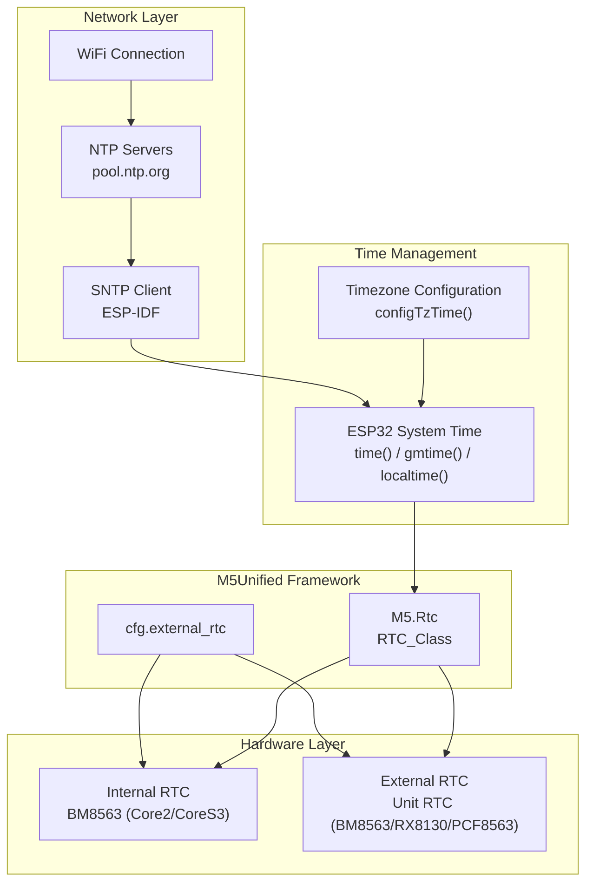
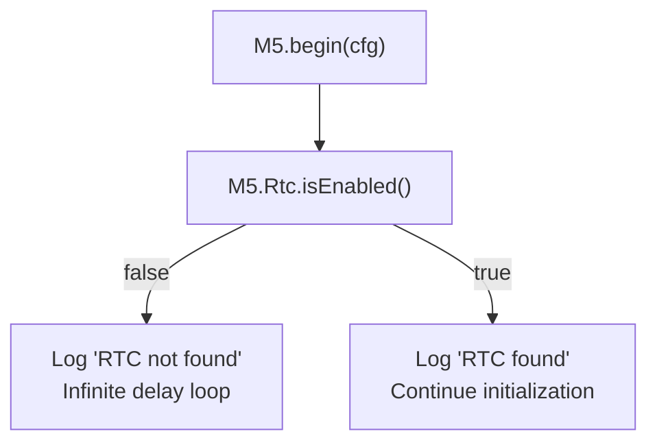
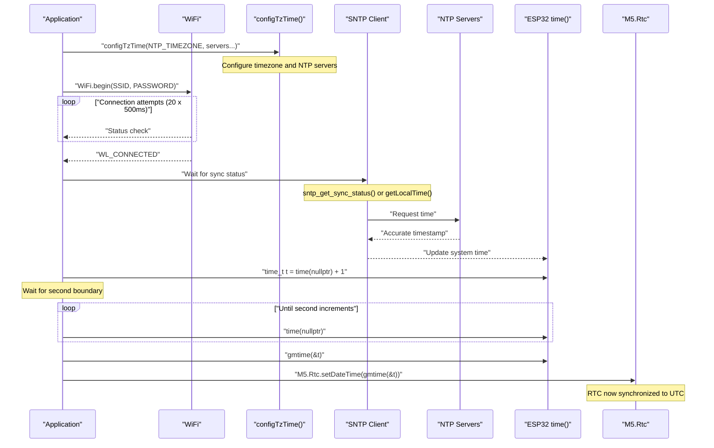
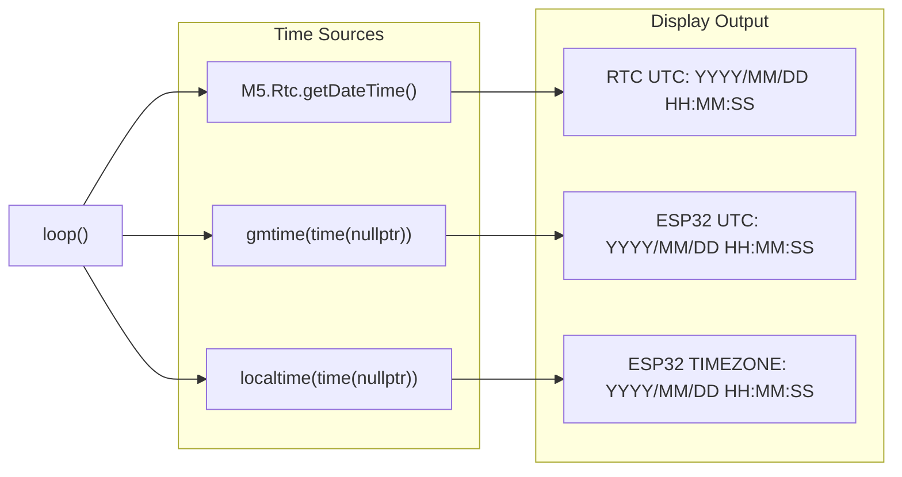

M5Unified RTC with NTP Synchronization

# RTC with NTP Synchronization

<details>
<summary>Relevant source files</summary>

The following files were used as context for generating this wiki page:

- [examples/Basic/Rtc/Rtc.ino](examples/Basic/Rtc/Rtc.ino)
- [src/utility/rtc/PCF8563_Class.cpp](src/utility/rtc/PCF8563_Class.cpp)
- [src/utility/rtc/PCF8563_Class.hpp](src/utility/rtc/PCF8563_Class.hpp)
- [src/utility/rtc/RTC_Base.hpp](src/utility/rtc/RTC_Base.hpp)
- [src/utility/rtc/RX8130_Class.hpp](src/utility/rtc/RX8130_Class.hpp)

</details>


## Overview

This document explains the RTC example that demonstrates how to synchronize an external Real-Time Clock (RTC) chip with network time using NTP (Network Time Protocol). The example shows the complete workflow: connecting to WiFi, obtaining accurate time from NTP servers, and setting the external RTC hardware to maintain time even when the ESP32 is powered off.

The example supports both internal RTCs (built into devices like Core2, CoreS3) and external Unit RTCs connected via I2C. It demonstrates timezone handling, comparing RTC time with ESP32 system time, and proper UTC-based time management. For general RTC usage without network synchronization, see [Real-Time Clock](#7.2).

Sources: [examples/Basic/Rtc/Rtc.ino:1-165]()

## System Architecture

### Component Overview

The RTC synchronization system integrates four major components:



Sources: [examples/Basic/Rtc/Rtc.ino:31-99](), [src/utility/rtc/RTC_Base.hpp:78-103]()

### Supported RTC Hardware

M5Unified automatically detects and supports multiple RTC chip variants:

| RTC Chip | I2C Address | Typical Device | Features |
|----------|-------------|----------------|----------|
| BM8563 | 0x51 | Core2, CoreS3, Unit RTC | Timer IRQ, Alarm IRQ, Voltage detection |
| RX8130 | 0x32 | M5Tab5 | Timer IRQ, Alarm IRQ, High precision |
| PCF8563 | 0x51 | Unit RTC | Timer IRQ, Alarm IRQ |

The `RTC_Base` class provides a unified interface across all RTC implementations.

Sources: [src/utility/rtc/RTC_Base.hpp:78-103](), [src/utility/rtc/RX8130_Class.hpp:11-36]()

## Configuration

### Network and NTP Settings

The example requires WiFi credentials and NTP server configuration at compile time:

```cpp
// Required configuration macros
#define WIFI_SSID     "YOUR WIFI SSID NAME"
#define WIFI_PASSWORD "YOUR WIFI PASSWORD"
#define NTP_TIMEZONE  "JST-9"              // Japan Standard Time (UTC+9)
#define NTP_SERVER1   "0.pool.ntp.org"
#define NTP_SERVER2   "1.pool.ntp.org"
#define NTP_SERVER3   "2.pool.ntp.org"
```

The `NTP_TIMEZONE` string uses POSIX timezone format. Common examples:
- `"JST-9"` - Japan Standard Time (UTC+9)
- `"PST8PDT,M3.2.0,M11.1.0"` - Pacific Time with daylight saving
- `"CET-1CEST,M3.5.0,M10.5.0/3"` - Central European Time with DST
- `"UTC0"` - Coordinated Universal Time

Sources: [examples/Basic/Rtc/Rtc.ino:3-8]()

### M5Unified RTC Configuration

Enable external RTC support through the `config_t` structure:

```cpp
auto cfg = M5.config();
cfg.external_rtc = true;  // Enable Unit RTC detection on Ex_I2C
M5.begin(cfg);
```

When `external_rtc` is enabled, M5Unified automatically probes both internal I2C (In_I2C) and external I2C (Ex_I2C) buses for RTC chips during initialization.

Sources: [examples/Basic/Rtc/Rtc.ino:33-37]()

### Platform-Specific WiFi Configuration

ESP32-P4 devices require explicit WiFi pin configuration:

```cpp
#if defined (CONFIG_IDF_TARGET_ESP32P4)
  if (M5.getBoard() == m5::board_t::board_M5Tab5) {
    WiFi.setPins(GPIO_NUM_12, GPIO_NUM_13, GPIO_NUM_11, 
                 GPIO_NUM_10, GPIO_NUM_9, GPIO_NUM_8, GPIO_NUM_15);
  }
#endif
```

This is necessary because ESP32-P4 uses a different GPIO matrix than other ESP32 variants.

Sources: [examples/Basic/Rtc/Rtc.ino:64-68]()

## Initialization Sequence

### RTC Detection and Validation

The example first verifies that an RTC was successfully detected:



If no RTC is detected on either I2C bus, the program enters an infinite loop to prevent undefined behavior.

Sources: [examples/Basic/Rtc/Rtc.ino:42-48]()

### NTP Synchronization Flow

The complete synchronization process follows this sequence:



Sources: [examples/Basic/Rtc/Rtc.ino:60-99]()

### SNTP Implementation Variants

The example handles different ESP-IDF versions that use different SNTP header files:

| Header File | ESP-IDF Version | Sync Check Method |
|-------------|-----------------|-------------------|
| `<esp_sntp.h>` | Newer versions | `sntp_get_sync_status() == SNTP_SYNC_STATUS_COMPLETED` |
| `<sntp.h>` | Older versions | `sntp_get_sync_status() == SNTP_SYNC_STATUS_COMPLETED` |
| None available | Legacy | `getLocalTime(&timeInfo, 1000)` fallback |

The code uses preprocessor conditionals to select the appropriate method at compile time.

Sources: [examples/Basic/Rtc/Rtc.ino:14-27](), [examples/Basic/Rtc/Rtc.ino:80-93]()

## Time Synchronization Details

### UTC Recommendation

The example code emphasizes setting both RTC and ESP32 system time to UTC rather than local time:

```cpp
// It is recommended to set UTC for the RTC and ESP32 internal clocks.
```

This approach provides several benefits:
1. Eliminates daylight saving time complications in the RTC hardware
2. Simplifies time zone conversions (handled in software)
3. Prevents RTC drift issues when traveling across time zones
4. Matches standard practices for system timestamps

Sources: [examples/Basic/Rtc/Rtc.ino:50-50]()

### Second-Boundary Synchronization

To achieve precise RTC synchronization, the code waits for a second boundary before writing to the RTC:

```cpp
time_t t = time(nullptr) + 1;  // Advance one second
while (t > time(nullptr));     // Wait until that second arrives
M5.Rtc.setDateTime(gmtime(&t));
```

This technique ensures the RTC is set at the exact start of a second, minimizing sub-second timing errors that could accumulate over time.

Sources: [examples/Basic/Rtc/Rtc.ino:96-98]()

### Direct RTC Setting (Alternative Method)

The example also shows how to set the RTC directly without network synchronization:

```cpp
// Direct setting without NTP
M5.Rtc.setDateTime({{2021, 12, 31}, {12, 34, 56}});
```

The `rtc_datetime_t` structure accepts date and time components:
- Date: `{year, month, date}` (year: 1900-2099, month: 1-12, date: 1-31)
- Time: `{hours, minutes, seconds}` (24-hour format)

This method is useful for offline applications or when network access is unavailable.

Sources: [examples/Basic/Rtc/Rtc.ino:53-56](), [src/utility/rtc/RTC_Base.hpp:66-76]()

## Runtime Operation

### Main Loop Time Display

The main loop continuously reads and displays time from multiple sources:



Sources: [examples/Basic/Rtc/Rtc.ino:109-146]()

### Reading RTC DateTime

The `M5.Rtc.getDateTime()` method returns an `rtc_datetime_t` structure:

```cpp
auto dt = M5.Rtc.getDateTime();

// Access date components
dt.date.year      // 1900-2099
dt.date.month     // 1-12
dt.date.date      // 1-31
dt.date.weekDay   // 0=Sun, 1=Mon, ..., 6=Sat

// Access time components
dt.time.hours     // 0-23
dt.time.minutes   // 0-59
dt.time.seconds   // 0-59
```

Sources: [examples/Basic/Rtc/Rtc.ino:115-125](), [src/utility/rtc/RTC_Base.hpp:18-76]()

### Comparing Time Sources

The example displays three time values side-by-side for comparison:

| Display Line | Source | Description |
|--------------|--------|-------------|
| `RTC UTC` | External RTC chip | Battery-backed time that persists across power cycles |
| `ESP32 UTC` | `gmtime(time(nullptr))` | System time in UTC, lost on reset |
| `ESP32 TIMEZONE` | `localtime(time(nullptr))` | System time converted to configured timezone |

This comparison allows verification that:
1. The RTC maintains accurate time during power cycles
2. The system time matches the RTC after synchronization
3. Timezone conversion is working correctly

Sources: [examples/Basic/Rtc/Rtc.ino:117-145]()

### Weekday String Conversion

The example includes a weekday lookup table for human-readable display:

```cpp
static constexpr const char* const wd[7] = {"Sun","Mon","Tue","Wed","Thr","Fri","Sat"};

// Used to display weekday from numeric value (0-6)
wd[dt.date.weekDay]
```

The `rtc_date_t.weekDay` field follows the same convention as POSIX `tm.tm_wday` (0 = Sunday).

Sources: [examples/Basic/Rtc/Rtc.ino:111-111](), [examples/Basic/Rtc/Rtc.ino:121-121]()

## Usage Examples

### Basic Speech Playback

To make your M5Stack device speak, call the `playAquesTalk` function with a text string:

```
playAquesTalk("akue_suto'-_ku/kido-shima'_shita.");  // "AquesTalk initialized"
waitAquesTalk();  // Wait for speech to complete
playAquesTalk("botanno/o_shitekudasa'i.");          // "Please press a button"
```

Sources: [examples/Advanced/Speak_with_AquesTalk/Speak_with_AquesTalk.ino:99-101]()

### Responding to Button Events

The example demonstrates triggering different speech outputs based on button events:

```
if (M5.BtnA.wasClicked())     { playAquesTalk("kuri'kku"); }      // "Click"
else if (M5.BtnA.wasHold())    { playAquesTalk("ho'-rudo"); }     // "Hold"
else if (M5.BtnA.wasReleased()) { playAquesTalk("riri'-su"); }    // "Release"
else if (M5.BtnB.wasReleased()) { playAquesTalk("korewa;te'_sutode_su."); } // "This is a test"
else if (M5.BtnC.wasReleased()) { playAquesTalk("yukkuri_siteittene?"); }  // "Take it easy"
```

Sources: [examples/Advanced/Speak_with_AquesTalk/Speak_with_AquesTalk.ino:104-112]()

## AquesTalk Pronunciation Guide

The AquesTalk library uses a special phonetic notation system to control Japanese pronunciation. Some key points:

- Single quotes (`'`) mark accented syllables
- Hyphens (`-`) extend vowel sounds
- Forward slashes (`/`) separate phrases
- Semicolons (`;`) create short pauses

For example, the text `"akue_suto'-_ku/kido-shima'_shita."` contains these pronunciation controls.

Sources: [examples/Advanced/Speak_with_AquesTalk/Speak_with_AquesTalk.ino:99-112]()

## Display Integration

When running speech synthesis, the example also shows the spoken text on the M5Stack display:

```
M5.Display.printf("Play:%s\n", koe);
```

You can extend this functionality to create more sophisticated visual feedback during speech playback.

Sources: [examples/Advanced/Speak_with_AquesTalk/Speak_with_AquesTalk.ino:52-52]()

## Complete Implementation Reference

The complete implementation of the text-to-speech system can be found in the example file [examples/Advanced/Speak_with_AquesTalk/Speak_with_AquesTalk.ino]().