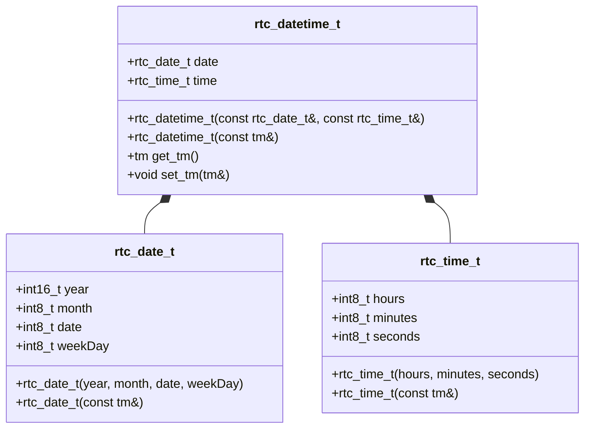
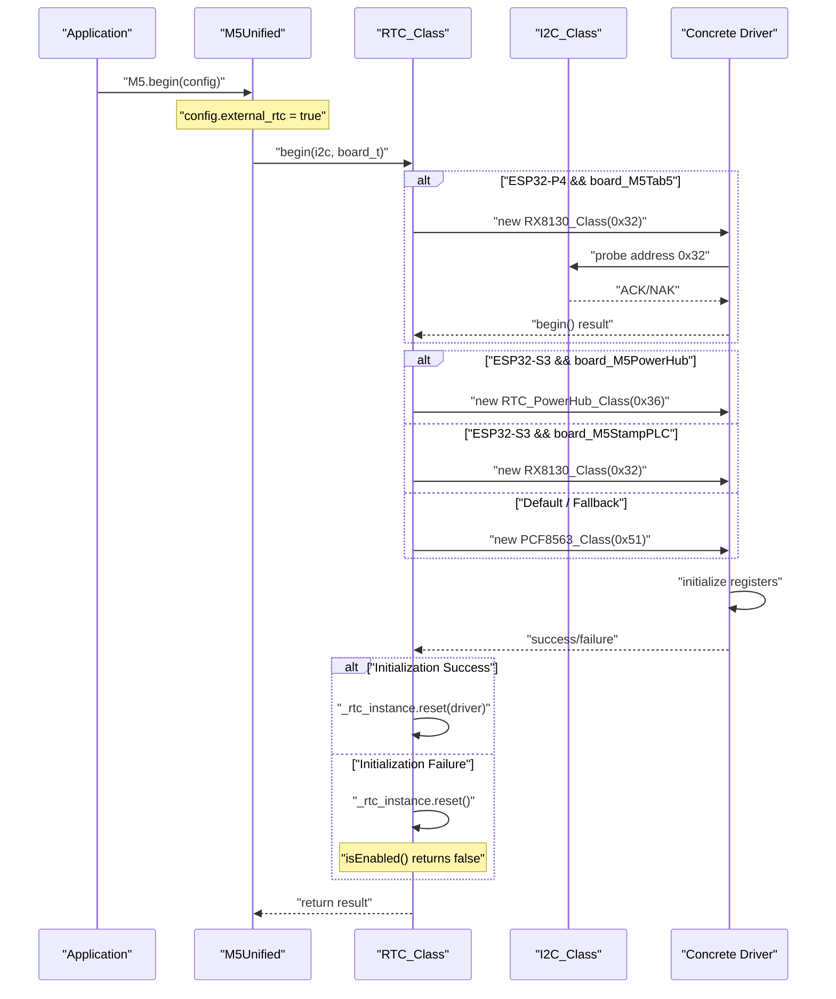
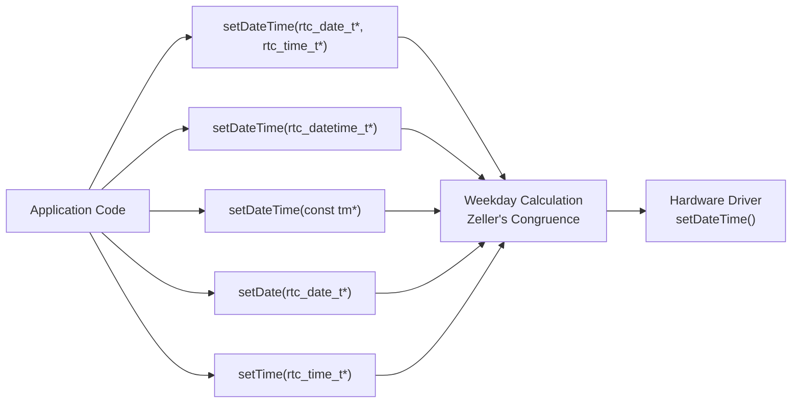
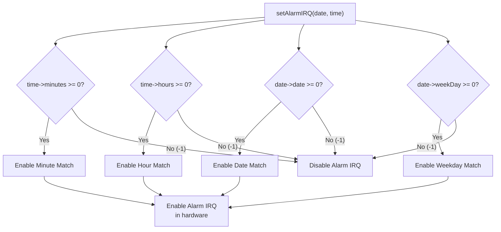
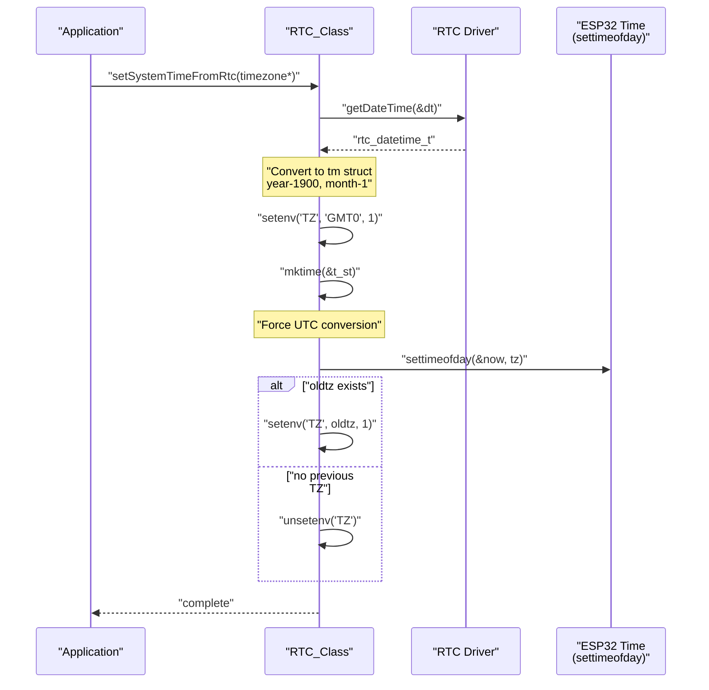
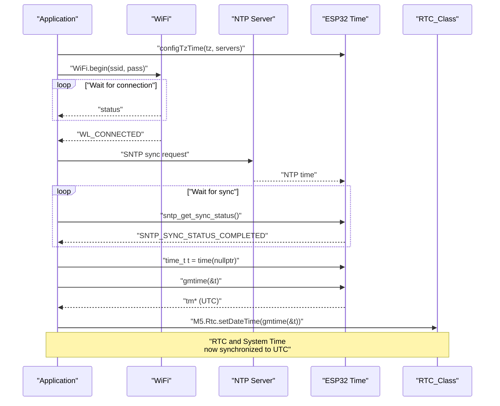

M5Unified Real-Time Clock System

# Real-Time Clock System

<details>
<summary>Relevant source files</summary>

The following files were used as context for generating this wiki page:

- [examples/Basic/Rtc/Rtc.ino](examples/Basic/Rtc/Rtc.ino)
- [src/utility/RTC_Class.cpp](src/utility/RTC_Class.cpp)
- [src/utility/RTC_Class.hpp](src/utility/RTC_Class.hpp)
- [src/utility/rtc/PCF8563_Class.cpp](src/utility/rtc/PCF8563_Class.cpp)
- [src/utility/rtc/PCF8563_Class.hpp](src/utility/rtc/PCF8563_Class.hpp)
- [src/utility/rtc/RTC_Base.hpp](src/utility/rtc/RTC_Base.hpp)
- [src/utility/rtc/RX8130_Class.cpp](src/utility/rtc/RX8130_Class.cpp)
- [src/utility/rtc/RX8130_Class.hpp](src/utility/rtc/RX8130_Class.hpp)

</details>


This document describes the `RTC_Class` abstraction layer that provides unified access to real-time clock hardware across M5Stack devices. The RTC system enables applications to read and set date/time values, configure timer and alarm interrupts, and synchronize with the ESP32 system clock.

This page covers the high-level RTC architecture, initialization, and API usage. For hardware-specific implementation details of individual RTC chips (PCF8563, RX8130, and their register-level operations), see [RTC Hardware Implementations](#6.3). For IMU sensor integration, see [IMU System and Calibration](#6.1).

## Purpose and Scope

The RTC system provides:
- Polymorphic hardware abstraction supporting multiple RTC chip types
- Board-specific automatic detection and driver selection
- Date and time manipulation with automatic weekday calculation
- Timer interrupts with millisecond precision configuration
- Alarm interrupts with flexible date/time matching
- Bidirectional synchronization with ESP32 system time
- Low voltage detection for battery backup monitoring

## Architecture Overview

The RTC system uses a three-tier architecture with runtime polymorphism through `std::unique_ptr`:

```mermaid
graph TB
    M5Unified["M5Unified"]
    RTC_Class["RTC_Class<br/>Public API"]
    RTCInstance["_rtc_instance<br/>unique_ptr&lt;RTC_Base&gt;"]
    
    RTC_Base["RTC_Base<br/>Abstract Interface<br/>Pure Virtual Methods"]
    
    PCF8563["PCF8563_Class<br/>Default RTC<br/>I2C Addr: 0x51"]
    RX8130["RX8130_Class<br/>M5Tab5/StampPLC<br/>I2C Addr: 0x32"]
    PowerHub["RTC_PowerHub_Class<br/>M5PowerHub<br/>Custom Protocol"]
    
    M5Unified -->|"owns"| RTC_Class
    RTC_Class -->|"contains"| RTCInstance
    RTCInstance -->|"points to"| RTC_Base
    
    RTC_Base <|-- PCF8563
    RTC_Base <|-- RX8130
    RTC_Base <|-- PowerHub
    
    PCF8563 -.->|"inherits from"| I2C_Device
    RX8130 -.->|"inherits from"| I2C_Device
    PowerHub -.->|"inherits from"| I2C_Device
```

**Sources:** [src/utility/RTC_Class.hpp:15-18](), [src/utility/RTC_Class.cpp:22-70](), [src/utility/rtc/RTC_Base.hpp:78-103]()

The `RTC_Class` acts as a facade that delegates all operations to the underlying hardware-specific driver through virtual function dispatch. The concrete driver is selected during initialization based on board type and I2C device probing.

## Data Structures

The RTC system defines three packed structures for representing date and time:

| Structure | Fields | Size | Purpose |
|-----------|--------|------|---------|
| `rtc_time_t` | `hours`, `minutes`, `seconds` | 3 bytes | Time representation (24-hour format) |
| `rtc_date_t` | `year`, `month`, `date`, `weekDay` | 5 bytes | Date with weekday (0=Sunday) |
| `rtc_datetime_t` | `date`, `time` | 8 bytes | Combined date and time |

All fields use negative values (-1) to indicate "don't care" when setting alarms. The `weekDay` field is automatically calculated if not provided.

**Sources:** [src/utility/rtc/RTC_Base.hpp:18-76]()



**Sources:** [src/utility/rtc/RTC_Base.hpp:18-76]()

## Initialization and Driver Selection

The `RTC_Class::begin()` method probes the I2C bus to detect available RTC hardware and instantiates the appropriate driver:



**Sources:** [src/utility/RTC_Class.cpp:22-70]()

The selection logic follows this priority:

1. **Board-specific drivers** (ESP32-P4 M5Tab5, ESP32-S3 PowerHub/StampPLC) - [src/utility/RTC_Class.cpp:31-57]()
2. **Default PCF8563** - Used for most M5Stack devices with external RTC modules - [src/utility/RTC_Class.cpp:59]()
3. **Failure state** - `_rtc_instance` remains null if no RTC is detected - [src/utility/RTC_Class.cpp:65-68]()

Applications should check `M5.Rtc.isEnabled()` before using RTC functions, as shown in [examples/Basic/Rtc/Rtc.ino:42-46]().

## Date and Time Operations

### Reading Date and Time

The `RTC_Class` provides multiple overloaded methods for reading date and time:

| Method | Parameters | Returns | Description |
|--------|------------|---------|-------------|
| `getDateTime(date, time)` | `rtc_date_t*`, `rtc_time_t*` | `bool` | Read both date and time |
| `getDateTime(datetime)` | `rtc_datetime_t*` | `bool` | Read into combined structure |
| `getDateTime()` | none | `rtc_datetime_t` | Return by value |
| `getDate(date)` | `rtc_date_t*` | `bool` | Read date only |
| `getTime(time)` | `rtc_time_t*` | `bool` | Read time only |

**Sources:** [src/utility/RTC_Class.hpp:27-85]()

Example usage from [examples/Basic/Rtc/Rtc.ino:115-125]():
```cpp
auto dt = M5.Rtc.getDateTime();
M5.Log.printf("RTC UTC: %04d/%02d/%02d (%s) %02d:%02d:%02d\r\n",
    dt.date.year, dt.date.month, dt.date.date,
    wd[dt.date.weekDay],
    dt.time.hours, dt.time.minutes, dt.time.seconds);
```

### Setting Date and Time

The `setDateTime()` methods accept multiple input formats:



**Sources:** [src/utility/RTC_Class.hpp:32-40](), [src/utility/RTC_Class.cpp:82-115]()

The implementation includes automatic weekday calculation using Zeller's congruence when `weekDay > 6` and valid year/month are provided - [src/utility/RTC_Class.cpp:98-112](). This formula: `(year + (year >> 2) - ydiv100 + (ydiv100 >> 2) + (13 * month + 8) / 5 + day) % 7` computes the day of week for any Gregorian calendar date.

Direct setting example from [examples/Basic/Rtc/Rtc.ino:53-56]():
```cpp
// YYYY  MM  DD      hh  mm  ss
M5.Rtc.setDateTime({{2021, 12, 31}, {12, 34, 56}});
```

## Timer Interrupt Configuration

The RTC timer interrupt generates periodic events at configured intervals. The `setTimerIRQ()` method configures the timer:

```cpp
uint32_t actual_msec = M5.Rtc.setTimerIRQ(5000);  // Request 5 second timer
```

**Sources:** [src/utility/RTC_Class.hpp:44-47](), [src/utility/RTC_Class.cpp:117-120]()

Hardware-specific implementations quantize the requested period to available timer resolutions:

| RTC Chip | Timer Ranges | Resolution | Implementation |
|----------|--------------|------------|----------------|
| PCF8563 | 1-255 seconds<br/>1-255 minutes | 1s or 60s | [src/utility/rtc/PCF8563_Class.cpp:94-125]() |
| RX8130 | ~16s (4096Hz)<br/>~1024s (64Hz)<br/>~65535s (1Hz)<br/>~65535min<br/>~65535hr | Multiple modes | [src/utility/rtc/RX8130_Class.cpp:88-138]() |

The method returns the actual configured period in milliseconds. Setting `timer_msec=0` disables the timer.

## Alarm Interrupt Configuration

Alarm interrupts fire when the RTC time matches configured date/time fields. Fields set to `-1` are ignored (wildcard match).



**Sources:** [src/utility/RTC_Class.hpp:54-58](), [src/utility/RTC_Class.cpp:122-135]()

Example alarm patterns:

```cpp
// Every day at 07:30
M5.Rtc.setAlarmIRQ(nullptr, rtc_time_t{7, 30, 0});

// Every hour at 15 minutes past
M5.Rtc.setAlarmIRQ(nullptr, rtc_time_t{-1, 15, 0});

// Specific date and time
rtc_datetime_t alarm_time = {{2024, 12, 25}, {9, 0, 0}};
M5.Rtc.setAlarmIRQ(alarm_time);
```

After an interrupt fires, applications should call `clearIRQ()` to acknowledge it and `getIRQstatus()` to check if an interrupt is pending - [src/utility/RTC_Class.hpp:62-64]().

## System Time Synchronization

The RTC system supports bidirectional synchronization with the ESP32's system time:

### RTC to System Time

The `setSystemTimeFromRtc()` method reads the RTC and updates the ESP32 system clock:



**Sources:** [src/utility/RTC_Class.cpp:154-186]()

This method temporarily sets `TZ=GMT0` to force `mktime()` to interpret the RTC value as UTC, then restores the previous timezone setting - [src/utility/RTC_Class.cpp:172-181](). This works around ESP-IDF issue #11455 where timezone handling affects `mktime()`.

### System Time to RTC (NTP Synchronization)

The example in [examples/Basic/Rtc/Rtc.ino:59-104]() demonstrates NTP-based synchronization:



**Sources:** [examples/Basic/Rtc/Rtc.ino:60-99]()

The pattern is:
1. Configure timezone with `configTzTime()` - [examples/Basic/Rtc/Rtc.ino:60]()
2. Connect to WiFi - [examples/Basic/Rtc/Rtc.ino:70]()
3. Wait for SNTP synchronization - [examples/Basic/Rtc/Rtc.ino:81-93]()
4. Read system time as UTC with `gmtime()` - [examples/Basic/Rtc/Rtc.ino:96-98]()
5. Write UTC time to RTC - [examples/Basic/Rtc/Rtc.ino:98]()

This ensures the RTC stores UTC, while the ESP32 system time can display local time through `localtime()` - [examples/Basic/Rtc/Rtc.ino:139-145]().

## Configuration and Enabling

The RTC is enabled through the `M5_Config` structure passed to `M5.begin()`:

```cpp
auto cfg = M5.config();
cfg.external_rtc = true;  // Enable external RTC detection
M5.begin(cfg);
```

**Sources:** [examples/Basic/Rtc/Rtc.ino:33-37]()

After initialization, check availability:

```cpp
if (!M5.Rtc.isEnabled()) {
    M5.Log.println("RTC not found.");
    // Handle missing RTC
}
```

**Sources:** [examples/Basic/Rtc/Rtc.ino:42-46](), [src/utility/RTC_Class.hpp:24]()

The `isEnabled()` method checks if `_rtc_instance` is non-null, indicating successful hardware detection and initialization - [src/utility/RTC_Class.hpp:24]().

## Low Voltage Detection

RTC chips with battery backup can report low backup battery voltage:

```cpp
bool low_voltage = M5.Rtc.getVoltLow();
if (low_voltage) {
    // RTC may have lost time during power-off
    // Re-synchronize from NTP or prompt user
}
```

**Sources:** [src/utility/RTC_Class.hpp:42](), [src/utility/RTC_Class.cpp:72-75]()

This flag indicates the RTC's backup battery voltage dropped below the threshold, meaning time may not be accurate after a power cycle. Different RTC chips implement this differently:
- **PCF8563**: VLSEC bit in register 0x02 - [src/utility/rtc/PCF8563_Class.cpp:34-37]()
- **RX8130**: VBLF bit in register 0x1D - [src/utility/rtc/RX8130_Class.cpp:223-228]()

## API Reference Summary

### Core Methods

| Method | Purpose | Returns |
|--------|---------|---------|
| `begin(i2c, board)` | Initialize and detect RTC hardware | `bool` success |
| `isEnabled()` | Check if RTC hardware was detected | `bool` |
| `getDateTime(...)` | Read current date/time | `bool` success |
| `setDateTime(...)` | Set date/time | `void` |
| `setTimerIRQ(msec)` | Configure periodic timer | `uint32_t` actual period |
| `setAlarmIRQ(...)` | Configure alarm interrupt | `int` enabled |
| `getIRQstatus()` | Check if IRQ is pending | `bool` |
| `clearIRQ()` | Acknowledge interrupt | `void` |
| `disableIRQ()` | Disable all interrupts | `void` |
| `getVoltLow()` | Check battery voltage flag | `bool` |
| `setSystemTimeFromRtc(tz)` | Sync ESP32 time from RTC | `void` |

**Sources:** [src/utility/RTC_Class.hpp:21-64]()

### Supported Hardware

| RTC Chip | I2C Address | Boards | Features |
|----------|-------------|--------|----------|
| PCF8563 | 0x51 | Most M5Stack devices | Timer, Alarm, Battery backup |
| RX8130 | 0x32 | M5Tab5, M5StampPLC | High-precision timer, Flexible alarm |
| PowerHub | 0x36 | M5PowerHub | Custom protocol |

**Sources:** [src/utility/RTC_Class.cpp:22-70](), [src/utility/rtc/PCF8563_Class.hpp:14](), [src/utility/rtc/RX8130_Class.hpp:14]()