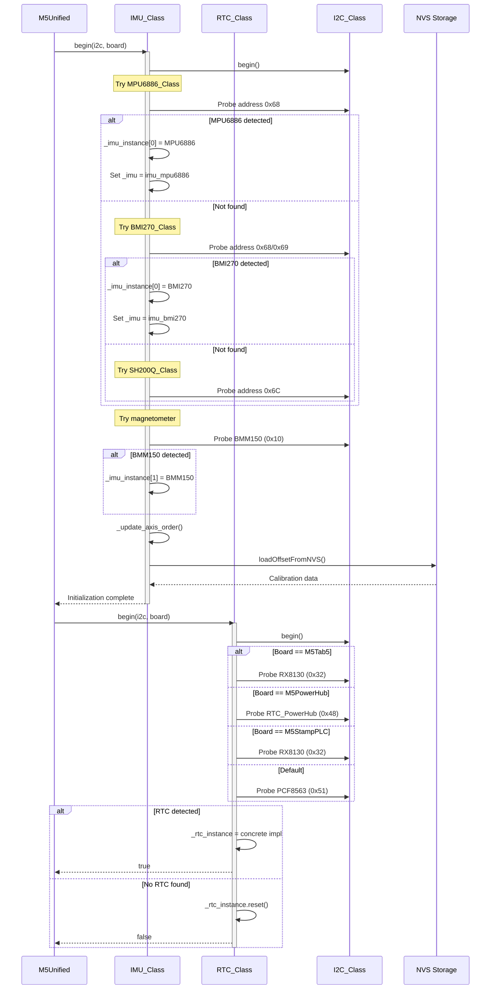
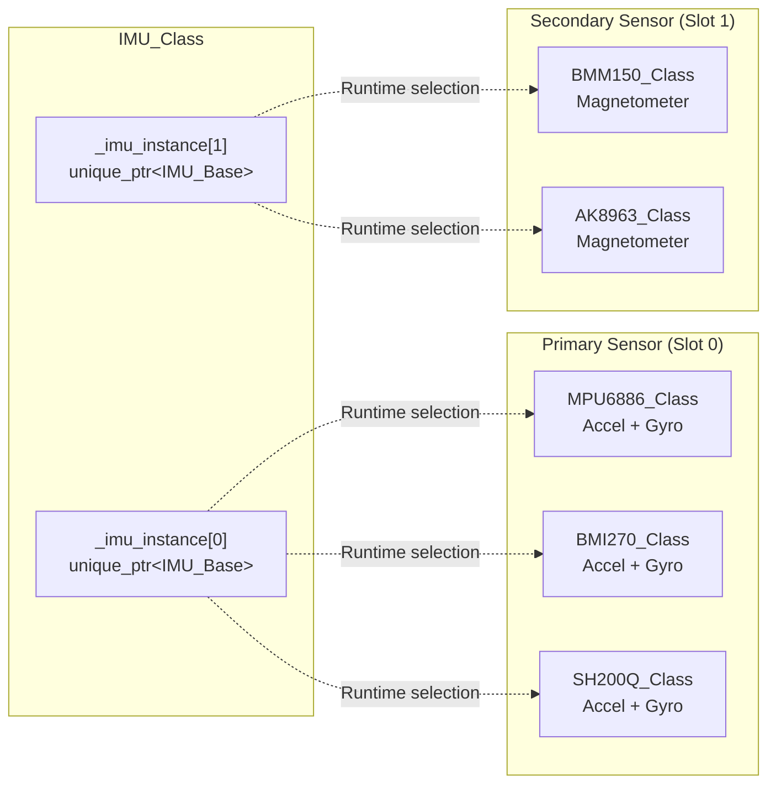
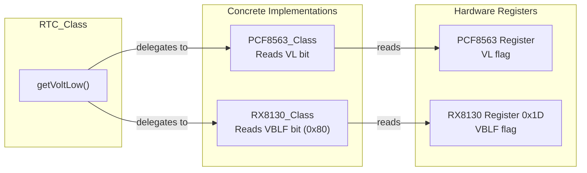
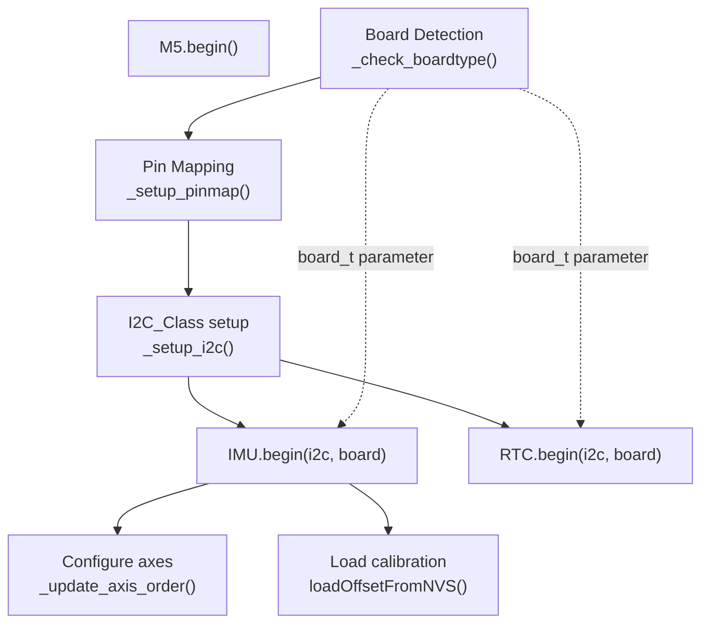

M5Unified Sensor Integration

# Sensor Integration

<details>
<summary>Relevant source files</summary>

The following files were used as context for generating this wiki page:

- [src/utility/IMU_Class.cpp](src/utility/IMU_Class.cpp)
- [src/utility/IMU_Class.hpp](src/utility/IMU_Class.hpp)
- [src/utility/RTC_Class.cpp](src/utility/RTC_Class.cpp)
- [src/utility/RTC_Class.hpp](src/utility/RTC_Class.hpp)
- [src/utility/rtc/RX8130_Class.cpp](src/utility/rtc/RX8130_Class.cpp)

</details>


## Purpose and Scope

This document provides an overview of M5Unified's sensor integration architecture, covering both the Inertial Measurement Unit (IMU) and Real-Time Clock (RTC) subsystems. These systems provide motion sensing and timekeeping capabilities through a polymorphic driver architecture that supports multiple hardware implementations across the M5Stack device family.

For detailed information about IMU calibration, axis ordering, and data processing, see [IMU System and Calibration](#6.1). For RTC time synchronization and alarm configuration, see [Real-Time Clock System](#6.2). For hardware-specific RTC implementations, see [RTC Hardware Implementations](#6.3).

## Sensor Subsystem Architecture

The sensor integration layer consists of two primary classes that act as facades for multiple hardware implementations:

```mermaid
graph TB
    subgraph "M5Unified Core"
        M5[M5Unified]
    end
    
    subgraph "Sensor Facade Classes"
        IMU[IMU_Class<br/>_imu_instance[2]]
        RTC[RTC_Class<br/>_rtc_instance]
    end
    
    subgraph "Base Abstractions"
        IMU_Base[IMU_Base<br/>Abstract Interface]
        RTC_Base[RTC_Base<br/>Abstract Interface]
    end
    
    subgraph "IMU Implementations"
        MPU6886[MPU6886_Class]
        BMI270[BMI270_Class]
        SH200Q[SH200Q_Class]
        BMM150[BMM150_Class]
        AK8963[AK8963_Class]
    end
    
    subgraph "RTC Implementations"
        PCF8563[PCF8563_Class]
        RX8130[RX8130_Class]
        RTC_PowerHub[RTC_PowerHub_Class]
    end
    
    subgraph "Infrastructure"
        I2C[I2C_Class<br/>In_I2C bus]
        NVS[NVS Storage<br/>Calibration Data]
    end
    
    M5 -->|owns| IMU
    M5 -->|owns| RTC
    
    IMU -->|unique_ptr array| IMU_Base
    RTC -->|unique_ptr| RTC_Base
    
    IMU_Base <|-- MPU6886
    IMU_Base <|-- BMI270
    IMU_Base <|-- SH200Q
    IMU_Base <|-- BMM150
    IMU_Base <|-- AK8963
    
    RTC_Base <|-- PCF8563
    RTC_Base <|-- RX8130
    RTC_Base <|-- RTC_PowerHub
    
    IMU -->|uses| I2C
    RTC -->|uses| I2C
    IMU -->|persists to| NVS
```

**Sources:** [src/utility/IMU_Class.hpp:213](), [src/utility/RTC_Class.hpp:18](), [src/utility/IMU_Class.cpp:14-18](), [src/utility/RTC_Class.cpp:15-18]()

## Detection and Initialization Sequence

Both sensor subsystems follow a probing-based initialization pattern where multiple device types are tested at runtime:



**Sources:** [src/utility/IMU_Class.cpp:28-179](), [src/utility/RTC_Class.cpp:22-70]()

## Sensor Hardware Support Matrix

### IMU Devices

| Device | I2C Address | Sensors | Boards | Detection Method |
|--------|-------------|---------|--------|------------------|
| MPU6886 | 0x68 | Accel + Gyro | M5Stack Core, StickC | WHO_AM_I register (0x19) |
| MPU6050 | 0x68 | Accel + Gyro | Generic | WHO_AM_I register (0x68) |
| MPU9250 | 0x68 | Accel + Gyro + Mag | Generic | WHO_AM_I register (0x71) |
| BMI270 | 0x68, 0x69 | Accel + Gyro | CoreS3, AtomS3R | CHIP_ID register |
| SH200Q | 0x6C | Accel + Gyro | StickC (alt) | WHO_AM_I register |
| BMM150 | 0x10 | Magnetometer | M5Stack Core | CHIP_ID register (0x32) |
| AK8963 | 0x0C | Magnetometer | MPU9250 internal | WHO_AM_I register (0x48) |

**Sources:** [src/utility/IMU_Class.cpp:43-145]()

### RTC Devices

| Device | I2C Address | Features | Boards | Selection Criteria |
|--------|-------------|----------|--------|-------------------|
| PCF8563 | 0x51 | Time/Date, Timer, Alarm | Most boards | Default fallback |
| RX8130 | 0x32 | Time/Date, Timer, Alarm | M5Tab5, StampPLC | Board-specific |
| RTC_PowerHub | 0x48 | Custom protocol | PowerHub | Board-specific |

**Sources:** [src/utility/RTC_Class.cpp:31-63]()

## IMU Instance Management

The `IMU_Class` maintains up to two sensor instances to support separate accelerometer/gyroscope and magnetometer chips:



The two-slot design allows boards with separate magnetometer chips (e.g., MPU6886 + BMM150) to operate both sensors independently. During `update()`, both instances are polled sequentially:

```cpp
// Polling both sensor instances
for (size_t i = 0; i < 2; ++i) {
    if (_imu_instance[i].get()) {
        uint_fast8_t t = _imu_instance[i]->getImuRawData(&_raw_data);
        if (t) { res = (sensor_mask_t)(res | t); }
    }
}
```

**Sources:** [src/utility/IMU_Class.hpp:213](), [src/utility/IMU_Class.cpp:398-411]()

## Board-Specific Axis Ordering

Different M5Stack boards mount IMU sensors in varying physical orientations. The `IMU_Class` automatically applies axis transformations based on detected board type:

| Board Type | Accel Transform | Gyro Transform | Mag Transform | Applied At |
|------------|-----------------|----------------|---------------|------------|
| M5AtomMatrix | Invert X, Z | Invert X, Z | None | [Line 67-68]() |
| CoreS3 (BMI270 @0x69) | None | None | Invert Y, Z | [Line 92]() |
| AtomS3R series | YXZ order, Invert Y | YXZ order, Invert Y | Invert X, Z | [Line 96-98]() |
| M5Stack (BMM150) | None | None | Invert X, Z | [Line 127]() |
| MPU9250 (AK8963) | None | None | YXZ order, Invert Z | [Line 142]() |

These transformations are stored in `_internal_axisorder_fixed[3]` and combined with user-specified axis orders in `_update_axis_order()`.

**Sources:** [src/utility/IMU_Class.cpp:65-145](), [src/utility/IMU_Class.cpp:258-294]()

## I2C Communication Architecture

Both sensor subsystems communicate via the internal I2C bus (`In_I2C`), which is configured during board initialization:

```mermaid
graph TB
    subgraph "Application Layer"
        M5["M5.begin()"]
    end
    
    subgraph "Sensor Layer"
        IMU_begin["IMU_Class::begin(i2c, board)"]
        RTC_begin["RTC_Class::begin(i2c, board)"]
    end
    
    subgraph "I2C Layer"
        I2C["I2C_Class* (In_I2C)"]
    end
    
    subgraph "Hardware Bus"
        I2C_HW["ESP32 I2C Port<br/>SDA/SCL pins<br/>from _setup_pinmap"]
    end
    
    M5 -->|passes In_I2C| IMU_begin
    M5 -->|passes In_I2C| RTC_begin
    
    IMU_begin -->|i2c->begin()| I2C
    RTC_begin -->|i2c->begin()| I2C
    
    I2C -->|configures| I2C_HW
    
    IMU_begin -.->|0x68, 0x69, 0x6C<br/>0x10, 0x0C| I2C_HW
    RTC_begin -.->|0x51, 0x32, 0x48| I2C_HW
```

The I2C pointer is passed from `M5Unified` during initialization and used for all device probing and communication. If `nullptr` is passed, the sensor classes will not initialize I2C themselves.

**Sources:** [src/utility/IMU_Class.cpp:34-37](), [src/utility/RTC_Class.cpp:24-27]()

## Calibration Data Persistence

The `IMU_Class` uses ESP32's Non-Volatile Storage (NVS) to persist offset calibration values across reboots:

```mermaid
graph TB
    subgraph "IMU_Class"
        offset_data["_offset_data<br/>imu_offset_data_t"]
        accel_offset["accel.value[3]<br/>32-bit per axis"]
        gyro_offset["gyro.value[3]<br/>32-bit per axis"]
        mag_offset["mag.value[3]<br/>32-bit per axis"]
    end
    
    subgraph "NVS Keys (LIBRARY_NAME namespace)"
        ax["ax: accel.x offset"]
        ay["ay: accel.y offset"]
        az["az: accel.z offset"]
        gx["gx: gyro.x offset"]
        gy["gy: gyro.y offset"]
        gz["gz: gyro.z offset"]
        mx["mx: mag.x offset"]
        my["my: mag.y offset"]
        mz["mz: mag.z offset"]
    end
    
    offset_data --> accel_offset
    offset_data --> gyro_offset
    offset_data --> mag_offset
    
    accel_offset -.->|saveOffsetToNVS()| ax
    accel_offset -.->|saveOffsetToNVS()| ay
    accel_offset -.->|saveOffsetToNVS()| az
    
    gyro_offset -.->|saveOffsetToNVS()| gx
    gyro_offset -.->|saveOffsetToNVS()| gy
    gyro_offset -.->|saveOffsetToNVS()| gz
    
    mag_offset -.->|saveOffsetToNVS()| mx
    mag_offset -.->|saveOffsetToNVS()| my
    mag_offset -.->|saveOffsetToNVS()| mz
    
    ax -.->|loadOffsetFromNVS()| accel_offset
    ay -.->|loadOffsetFromNVS()| accel_offset
    az -.->|loadOffsetFromNVS()| accel_offset
    gx -.->|loadOffsetFromNVS()| gyro_offset
    gy -.->|loadOffsetFromNVS()| gyro_offset
    gz -.->|loadOffsetFromNVS()| gyro_offset
    mx -.->|loadOffsetFromNVS()| mag_offset
    my -.->|loadOffsetFromNVS()| mag_offset
    mz -.->|loadOffsetFromNVS()| mag_offset
```

The offset values are stored as 32-bit integers in fixed-point format (raw_value << 16) and are automatically loaded during `IMU_Class::begin()`. The NVS namespace is `"M5Unified"`, defined by the `LIBRARY_NAME` constant.

**Sources:** [src/utility/IMU_Class.cpp:22](), [src/utility/IMU_Class.cpp:26](), [src/utility/IMU_Class.cpp:318-363]()

## Sensor Type Enumeration

The `IMU_Class` maintains an `imu_t` enumeration to track the detected IMU type:

```cpp
enum imu_t {
    imu_none,     // No IMU detected
    imu_unknown,  // Detected but unrecognized
    imu_sh200q,   // SH200Q sensor
    imu_mpu6050,  // MPU6050 sensor
    imu_mpu6886,  // MPU6886 sensor
    imu_mpu9250,  // MPU9250 sensor
    imu_bmi270,   // BMI270 sensor
};
```

This value is set during `begin()` based on the WHO_AM_I or CHIP_ID register of the detected device and can be queried via `getType()`.

**Sources:** [src/utility/IMU_Class.hpp:13-21](), [src/utility/IMU_Class.cpp:39-63]()

## RTC Voltage Monitoring

RTC implementations support battery backup voltage monitoring through the `getVoltLow()` method:



The voltage low flag indicates that the RTC battery has dropped below its operating threshold, which may cause timekeeping accuracy issues.

**Sources:** [src/utility/RTC_Class.cpp:72-75](), [src/utility/rtc/RX8130_Class.cpp:223-228]()

## Sensor Mask and Multi-Sensor Updates

The `IMU_Class::update()` method returns a bitmask indicating which sensors provided new data:

```cpp
enum sensor_mask_t {
    sensor_mask_none  = 0,
    sensor_mask_accel = 1 << 0,  // Accelerometer updated
    sensor_mask_gyro  = 1 << 1,  // Gyroscope updated
    sensor_mask_mag   = 1 << 2,  // Magnetometer updated
};
```

This allows applications to determine data availability:

```cpp
auto mask = M5.Imu.update();
if (mask & IMU_Class::sensor_mask_accel) {
    // Accelerometer data is fresh
}
if (mask & IMU_Class::sensor_mask_mag) {
    // Magnetometer data is fresh
}
```

**Sources:** [src/utility/IMU_Class.hpp:74-80](), [src/utility/IMU_Class.cpp:394-435]()

## Initialization Dependencies

The sensor subsystems have specific initialization dependencies that must be satisfied:



The `board_t` parameter is critical for both sensor subsystems as it determines:
- **IMU**: Axis transformation matrices (`_internal_axisorder_fixed`)
- **RTC**: Device selection logic (PCF8563 vs RX8130 vs PowerHub)

**Sources:** [src/utility/IMU_Class.cpp:28](), [src/utility/RTC_Class.cpp:22](), [src/utility/IMU_Class.cpp:65-145](), [src/utility/RTC_Class.cpp:31-63]()