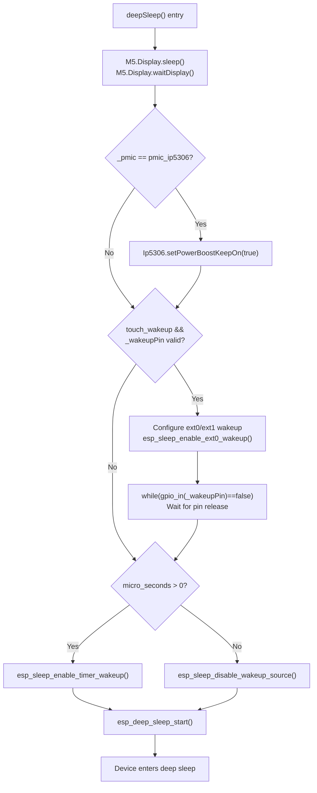
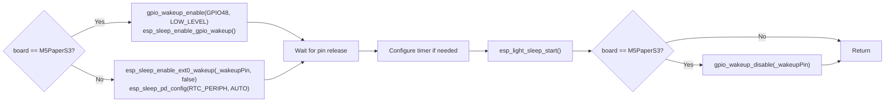
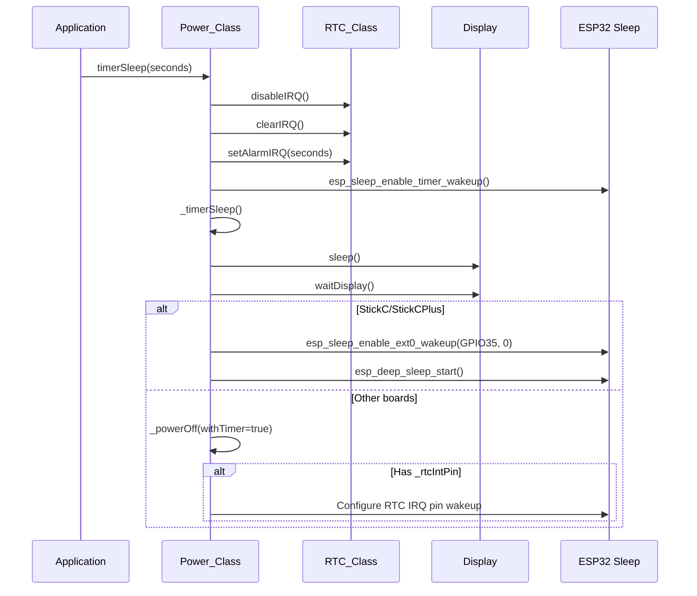
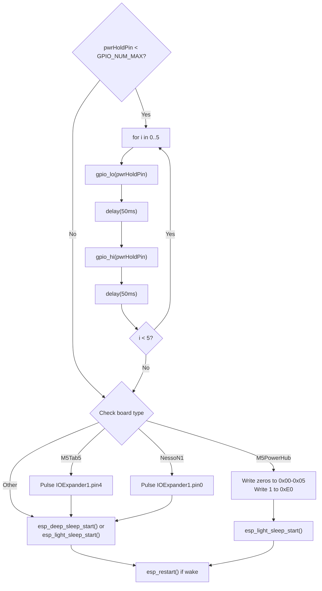
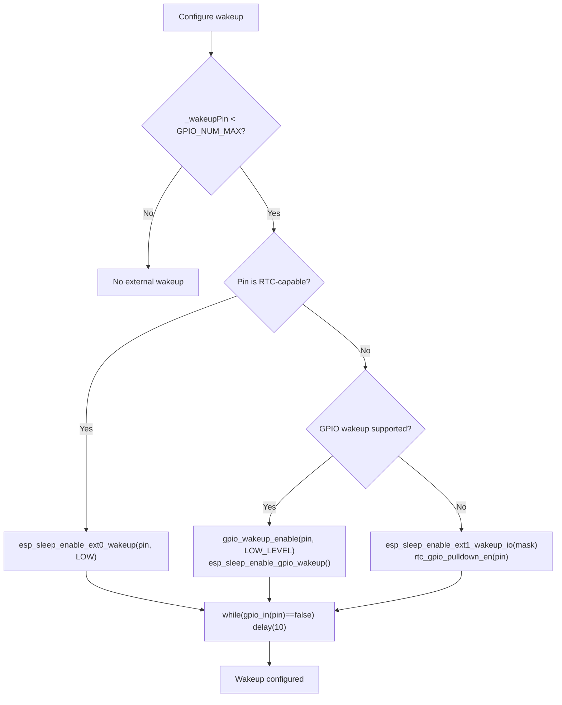
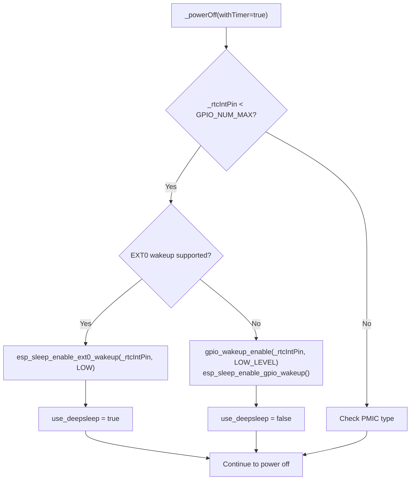
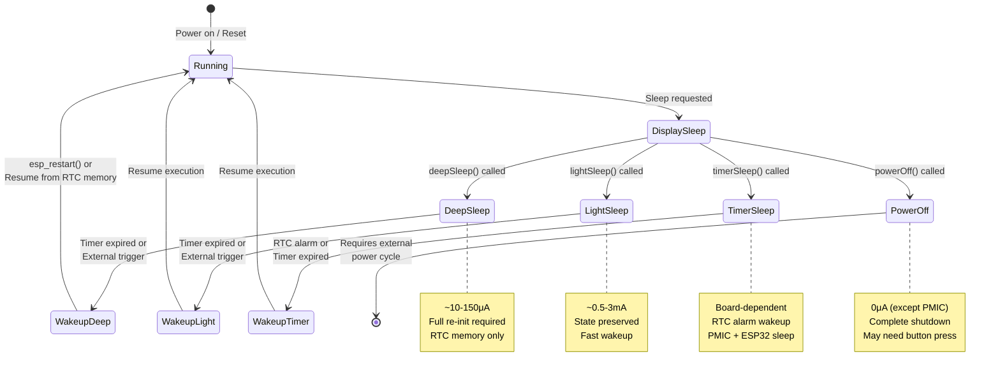

M5Unified Sleep Modes and Power States

# Sleep Modes and Power States

<details>
<summary>Relevant source files</summary>

The following files were used as context for generating this wiki page:

- [src/utility/Power_Class.cpp](src/utility/Power_Class.cpp)
- [src/utility/Power_Class.hpp](src/utility/Power_Class.hpp)

</details>


This document describes the sleep mode and power state management capabilities provided by the `Power_Class`. The M5Unified library offers multiple sleep modes with configurable wakeup sources to optimize power consumption across different M5Stack devices.

For battery monitoring and charging control, see [Battery Monitoring and Charging Control](#3.2). For PMIC initialization and detection, see [PMIC Detection and Initialization](#3.1).

## Overview

The Power_Class implements four distinct power states:
- **Deep Sleep**: Lowest power consumption, ESP32 deep sleep with limited wakeup sources
- **Light Sleep**: Moderate power consumption, faster wakeup, more peripherals retained
- **Timer Sleep**: PMIC/RTC-based sleep with alarm wakeup (board-dependent)
- **Power Off**: Complete system shutdown (may require physical interaction to restart)

All sleep modes automatically invoke display sleep before entering the low-power state to prevent visual artifacts and reduce current draw.

Sources: [src/utility/Power_Class.hpp:140-146](), [src/utility/Power_Class.cpp:1090-1225]()

## Sleep Mode Types

### Deep Sleep (ESP32 Deep Sleep)

Deep sleep provides the lowest power consumption by shutting down most ESP32 subsystems. CPU, most RAM, and digital peripherals are powered off. Only the RTC controller, RTC peripherals, and ULP coprocessor remain active.

```cpp
void deepSleep(std::uint64_t micro_seconds = 0, bool touch_wakeup = true)
```

**Key Characteristics:**
- **Power consumption**: ~10-150μA depending on enabled wakeup sources
- **Wakeup latency**: ~100-200ms
- **RAM retention**: RTC memory only (8KB on ESP32, 16KB on ESP32-S3)
- **Peripheral state**: Lost; requires re-initialization after wakeup

**Implementation Flow:**



**Wakeup Pin Configuration:**
- Uses `_wakeupPin` configured during board initialization
- EXT0 wakeup on low level (GPIO must be RTC-capable)
- On ESP32-S3 without EXT0 support, falls back to EXT1 wakeup with pull-down

Sources: [src/utility/Power_Class.cpp:1090-1139]()

### Light Sleep (ESP32 Light Sleep)

Light sleep maintains more system state than deep sleep, allowing faster wakeup and retention of more peripherals. CPU is clock-gated, but configured peripherals can remain powered.

```cpp
void lightSleep(std::uint64_t micro_seconds = 0, bool touch_wakeup = true)
```

**Key Characteristics:**
- **Power consumption**: ~0.5-3mA depending on active peripherals
- **Wakeup latency**: ~1-10ms
- **RAM retention**: All RAM retained
- **Peripheral state**: Configurable; many peripherals can continue operation

**M5PaperS3 Special Handling:**

The M5PaperS3 touch interrupt pin (GPIO48) is not RTC-capable, requiring GPIO wakeup instead of EXT0:



Sources: [src/utility/Power_Class.cpp:1141-1191]()

### Timer Sleep (RTC Alarm Wakeup)

Timer sleep uses the RTC hardware to schedule a wakeup at a specific time or after a delay. This mode combines PMIC shutdown or ESP32 sleep with RTC alarm interrupt.

```cpp
void timerSleep(int seconds);
void timerSleep(const rtc_time_t& time);
void timerSleep(const rtc_date_t& date, const rtc_time_t& time);
```

**RTC Configuration Sequence:**

1. Clear existing RTC interrupts: `M5.Rtc.clearIRQ()`
2. Disable RTC interrupt generation: `M5.Rtc.disableIRQ()`
3. Set new alarm time: `M5.Rtc.setAlarmIRQ(...)`
4. Enable ESP32 timer wakeup if seconds specified
5. Enter sleep via `_timerSleep()`

**Implementation:**



Sources: [src/utility/Power_Class.cpp:1200-1225](), [src/utility/Power_Class.cpp:1048-1088]()

### Power Off (Complete Shutdown)

Power off completely shuts down the system using PMIC-specific methods or ESP32 deep sleep as fallback.

```cpp
void powerOff(void)
```

**PMIC-Specific Power Off Methods:**

| PMIC Type | Power Off Method | Line Reference |
|-----------|------------------|----------------|
| `pmic_axp192` | `Axp192.powerOff()` | [950-952]() |
| `pmic_axp2101` | `Axp2101.powerOff()` | [960-962]() |
| `pmic_ip5306` | `Ip5306.setPowerBoostKeepOn(false)` | [954-956]() |
| `pmic_m5pm1` | Register 0x0C bits[1:0] = 01 | [969-977]() |
| `pmic_py32pmic` | `PY32pmic.powerOff()` | [965-967]() |
| Unknown | `esp_deep_sleep_start()` fallback | [1042]() |

**GPIO-Based Power Hold Release:**

Some boards use a GPIO power hold mechanism. The system repeatedly pulses the power hold pin to ensure shutdown:



Sources: [src/utility/Power_Class.cpp:922-1046](), [src/utility/Power_Class.cpp:1193-1198]()

## Wakeup Source Configuration

### Timer Wakeup

Timer-based wakeup is configured via `esp_sleep_enable_timer_wakeup(micro_seconds)`. The timer continues running during sleep and triggers wakeup when expired.

**Disable Timer Wakeup:**
```cpp
esp_sleep_disable_wakeup_source(ESP_SLEEP_WAKEUP_TIMER);
```

Applied when `micro_seconds == 0` is passed to deep/light sleep functions.

Sources: [src/utility/Power_Class.cpp:1128-1135](), [src/utility/Power_Class.cpp:1179-1183]()

### Touch and External Pin Wakeup

External wakeup uses the `_wakeupPin` configured during board initialization. This pin varies by board type:

| Board | Wakeup Pin | Purpose | Line Reference |
|-------|------------|---------|----------------|
| M5StackCore2 / M5Tough | GPIO_NUM_39 | Touch panel INT | [287](), [286]() |
| M5StackCoreInk | GPIO_NUM_27 | Power button | [268]() |
| M5Paper | GPIO_NUM_36 | Touch panel INT | [278]() |
| M5PaperS3 | GPIO_NUM_48 | Touch panel INT | [203]() |
| M5StickCPlus2 | GPIO_NUM_35 | Power button | [303]() |

**EXT0 vs GPIO Wakeup:**



**Issue #91 Prevention:**

The while loop waiting for pin release prevents premature wakeup. M5Paper specifically requires this to avoid waking immediately after entering sleep when touch is still detected.

Sources: [src/utility/Power_Class.cpp:1110-1127](), [src/utility/Power_Class.cpp:1159-1178]()

### RTC Alarm Interrupt Wakeup

For timer sleep operations, the RTC alarm interrupt can trigger wakeup. This requires `_rtcIntPin` to be configured:

| Board | RTC IRQ Pin | Line Reference |
|-------|-------------|----------------|
| M5StackCoreInk | GPIO_NUM_19 | [269]() |
| M5StickC / M5StickCPlus | GPIO_NUM_35 | [298]() |
| M5StampPLC | GPIO_NUM_14 | [234]() |

**RTC Wakeup Configuration:**



Sources: [src/utility/Power_Class.cpp:927-939]()

## Board-Specific Sleep Behavior

### M5StickC and M5StickCPlus

These boards use a special fast path for timer sleep that bypasses PMIC power off:

```cpp
case board_t::board_M5StickC:
case board_t::board_M5StickCPlus:
    esp_sleep_enable_ext0_wakeup(GPIO_NUM_35, 0);
    esp_deep_sleep_start();
    return;
```

The power button (connected to AXP192 PEK) on GPIO35 serves as the wakeup source.

Sources: [src/utility/Power_Class.cpp:1058-1063]()

### M5StampPLC

Before entering sleep, M5StampPLC must reset the IO expander IRQ state:

```cpp
case board_t::board_M5StampPLC:
    M5.getIOExpander(0).resetIrq();
    break;
```

This ensures the external IRQ line is cleared before configuring wakeup.

Sources: [src/utility/Power_Class.cpp:1078-1080]()

### M5PaperS3

M5PaperS3 has unique constraints:
- Touch panel INT (GPIO48) is not RTC-capable
- Must use GPIO wakeup instead of EXT0 for light sleep
- Power hold requires pulse sequence to reliably shut down

Sources: [src/utility/Power_Class.cpp:1162-1168](), [src/utility/Power_Class.cpp:1186-1188](), [src/utility/Power_Class.cpp:997-1007]()

### M5Tab5 and ArduinoNessoN1

These boards use IO expander GPIO for power control. Power off requires pulsing a specific IO expander pin:

**M5Tab5:**
```cpp
for (int i = 0; i < 10; ++i) {
    M5.getIOExpander(1).digitalWrite(4, i & 1); // PWROFF_PLUSE
    delay(50);
}
```

**ArduinoNessoN1:**
```cpp
for (int i = 0; i < 10; ++i) {
    M5.getIOExpander(1).digitalWrite(0, i & 1); // PWROFF_PULSE
    delay(50);
}
```

Sources: [src/utility/Power_Class.cpp:1013-1019](), [src/utility/Power_Class.cpp:1023-1029]()

### M5PowerHub

M5PowerHub uses a custom protocol to disable all outputs before shutdown:

```cpp
uint8_t buf[6]={};
M5.In_I2C.writeRegister(powerhub_i2c_addr, 0x00, buf, sizeof(buf), i2c_freq);
M5.In_I2C.writeRegister8(powerhub_i2c_addr, 0xE0, 1, i2c_freq);
use_deepsleep = false; // Use light sleep instead
```

Sources: [src/utility/Power_Class.cpp:1033-1038]()

## Power State Transition Diagram

The following diagram shows the complete power state machine with all transition paths:



Sources: [src/utility/Power_Class.cpp:1090-1225](), [src/utility/Power_Class.hpp:140-146]()

## API Summary Table

| Function | Sleep Type | Wakeup Sources | RAM Retention | Typical Current |
|----------|-----------|----------------|---------------|-----------------|
| `deepSleep(us, touch)` | ESP32 Deep Sleep | Timer, External Pin | RTC only | ~10-150μA |
| `lightSleep(us, touch)` | ESP32 Light Sleep | Timer, External Pin, GPIO | Full | ~0.5-3mA |
| `timerSleep(seconds)` | RTC Alarm + Sleep | RTC IRQ, Timer | Board-dependent | ~10-150μA |
| `timerSleep(time)` | RTC Alarm + Sleep | RTC IRQ | Board-dependent | ~10-150μA |
| `timerSleep(date, time)` | RTC Alarm + Sleep | RTC IRQ | Board-dependent | ~10-150μA |
| `powerOff()` | PMIC Shutdown | Manual/External | None | ~0μA |

**Parameter Notes:**
- `us`: Microseconds until timer wakeup (0 = disable timer wakeup)
- `touch`: Enable touch/button wakeup via `_wakeupPin`
- `seconds`: Integer seconds until RTC alarm
- `time`: `rtc_time_t` structure (hours and minutes used)
- `date`: `rtc_date_t` structure (date and weekday used)

Sources: [src/utility/Power_Class.hpp:140-146](), [src/utility/Power_Class.cpp:1090-1225]()

## Implementation Notes

### Pre-Sleep Display Handling

All sleep functions invoke display sleep to prevent visual corruption and reduce power draw:

```cpp
M5.Display.sleep();
M5.Display.waitDisplay();
```

The `waitDisplay()` call ensures all pending display operations complete before cutting power.

Sources: [src/utility/Power_Class.cpp:1052-1053](), [src/utility/Power_Class.cpp:1092-1093](), [src/utility/Power_Class.cpp:1195-1196]()

### IP5306 Boost Keep-On

Boards with IP5306 PMIC (original M5Stack) require enabling boost keep-on before sleep to prevent unexpected shutdown:

```cpp
if (_pmic == pmic_t::pmic_ip5306) {
    Ip5306.setPowerBoostKeepOn(true);
}
```

This ensures the boost converter continues operating under light load conditions during sleep.

Sources: [src/utility/Power_Class.cpp:1104-1107](), [src/utility/Power_Class.cpp:1153-1156]()

### Fallback Power Off Strategy

If no PMIC-specific power off method is available, the system falls back to ESP32 deep sleep:

```cpp
if (use_deepsleep) { 
    esp_deep_sleep_start(); 
}
esp_light_sleep_start();
esp_restart();
```

The restart ensures the system doesn't continue executing if wakeup occurs unexpectedly.

Sources: [src/utility/Power_Class.cpp:1042-1044]()