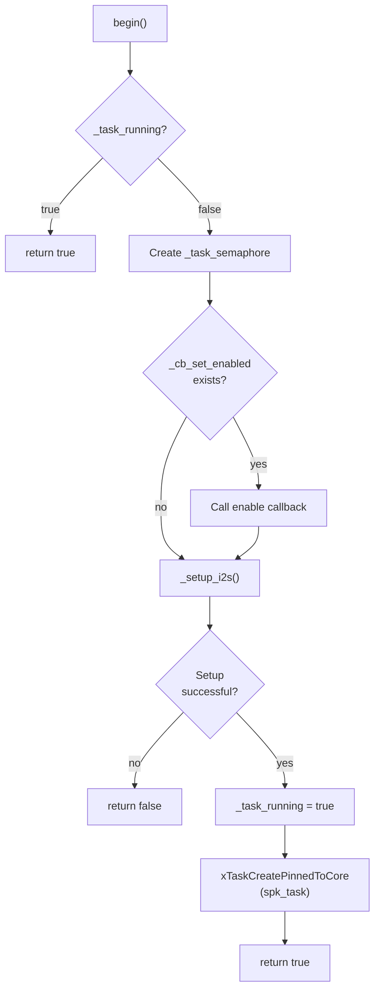
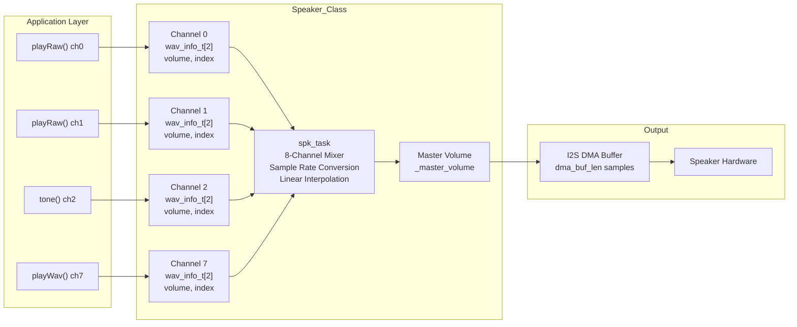
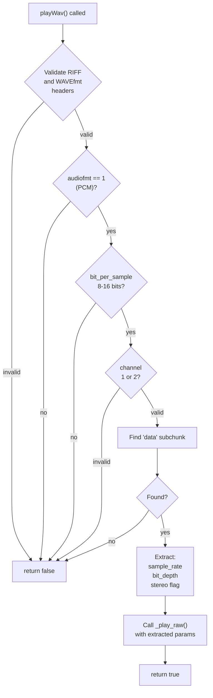
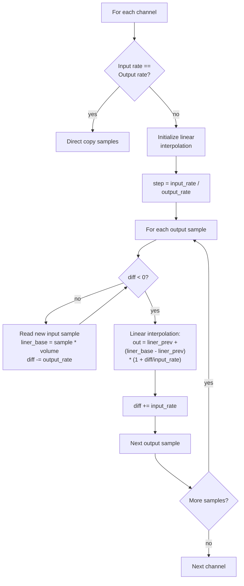
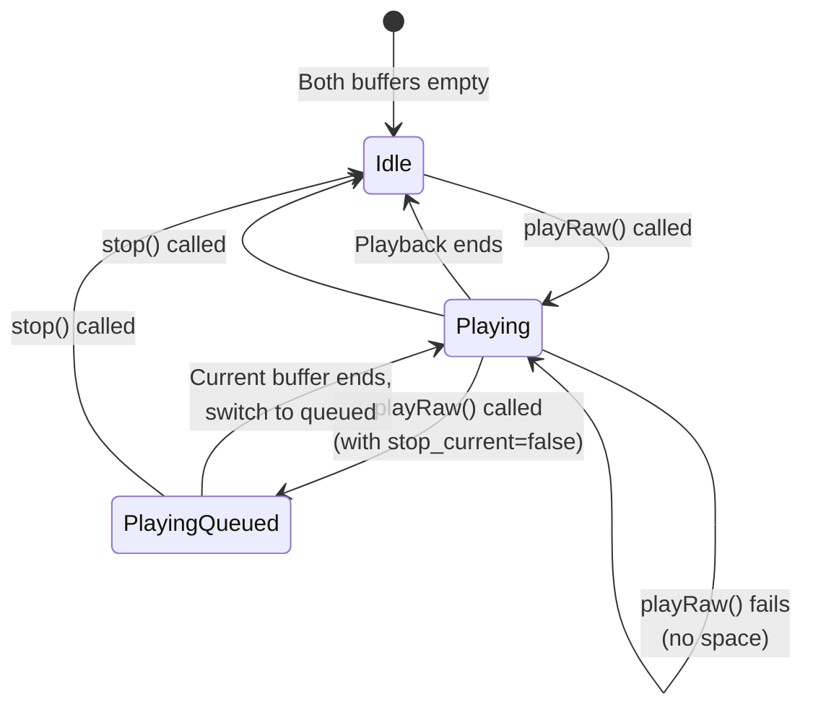
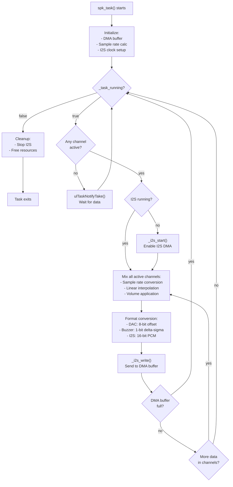

M5Unified Speaker Interface and Multi-Channel Mixing

# Speaker Interface

<details>
<summary>Relevant source files</summary>

The following files were used as context for generating this wiki page:

- [examples/Advanced/Mic_FFT/Mic_FFT.ino](examples/Advanced/Mic_FFT/Mic_FFT.ino)
- [src/utility/Mic_Class.cpp](src/utility/Mic_Class.cpp)
- [src/utility/Mic_Class.hpp](src/utility/Mic_Class.hpp)
- [src/utility/Speaker_Class.cpp](src/utility/Speaker_Class.cpp)
- [src/utility/Speaker_Class.hpp](src/utility/Speaker_Class.hpp)

</details>


## Purpose and Scope

This page documents the `Speaker_Class` API, which provides audio output functionality for M5Stack devices. The Speaker_Class manages audio playback through I2S DMA with support for 8 virtual channels, automatic sample rate conversion, per-channel volume control, and multiple output modes (I2S codec, DAC, buzzer).

For information about I2S driver configuration and audio codec initialization, see [Audio Architecture and I2S Configuration](#5.1). For microphone input functionality, see [Microphone Interface](#5.3).

Sources: [src/utility/Speaker_Class.hpp:1-301](), [src/utility/Speaker_Class.cpp:1-1149]()

---

## Configuration Structure

The `speaker_config_t` structure defines all configuration parameters for audio output. It must be set before calling `begin()`.

```cpp
struct speaker_config_t
{
    int pin_data_out;        // I2S data output pin
    int pin_bck;             // I2S bit clock pin
    int pin_mck;             // I2S master clock pin (optional)
    int pin_ws;              // I2S word select (LRCK) pin
    uint32_t sample_rate;    // Output sampling rate in Hz (default: 48000)
    bool stereo;             // true=stereo output, false=mono
    bool buzzer;             // true=single GPIO buzzer mode
    bool use_dac;            // true=use ESP32 DAC (GPIO 25/26 only)
    uint8_t dac_zero_level;  // DAC zero reference (0=dynamic)
    uint8_t magnification;   // Output multiplier (default: 16)
    size_t dma_buf_len;      // DMA buffer length (max 1024, default: 256)
    size_t dma_buf_count;    // Number of DMA buffers (default: 8)
    uint8_t task_priority;   // FreeRTOS task priority (default: 2)
    uint8_t task_pinned_core;// Core affinity (default: ~0 = no pinning)
    i2s_port_t i2s_port;     // I2S peripheral (default: I2S_NUM_0)
};
```

### Key Configuration Parameters

| Parameter | Description | Typical Values |
|-----------|-------------|----------------|
| `pin_data_out` | I2S data output GPIO | Device-specific |
| `sample_rate` | Output sample rate | 8000-96000 Hz |
| `stereo` | Stereo/mono output | false=mono, true=stereo |
| `use_dac` | ESP32 DAC mode | Only GPIO 25/26 on ESP32 |
| `buzzer` | 1-bit buzzer mode | Uses single GPIO |
| `dma_buf_len` | DMA buffer size | 128-1024 samples |
| `magnification` | Volume multiplier | 1-255 (16 typical) |

Sources: [src/utility/Speaker_Class.hpp:33-80]()

---

## Initialization and Lifecycle

### Starting the Speaker

```cpp
bool begin(void);
```

The `begin()` method initializes the I2S peripheral and starts the audio processing task. It:
1. Creates a FreeRTOS semaphore for synchronization
2. Calls the hardware enable callback (if configured)
3. Sets up I2S driver with configured parameters
4. Creates the `spk_task` background task for audio mixing

Returns `true` on success, `false` if initialization fails.

**Diagram: Speaker Initialization Flow**



Sources: [src/utility/Speaker_Class.cpp:912-946]()

### Stopping the Speaker

```cpp
void end(void);
```

The `end()` method:
1. Calls hardware disable callback
2. Stops the audio processing task
3. Clears all channel data
4. Uninstalls the I2S driver

Sources: [src/utility/Speaker_Class.cpp:948-976]()

### Status Checking

```cpp
bool isRunning(void) const;
bool isEnabled(void) const;
bool isPlaying(void) const;
size_t isPlaying(uint8_t channel) const;
size_t getPlayingChannels(void) const;
```

- `isRunning()`: Returns true if the audio task is active
- `isEnabled()`: Returns true if `pin_data_out` is configured (≥ 0)
- `isPlaying()`: Returns true if any channel is playing
- `isPlaying(channel)`: Returns 0=not playing, 1=playing with queue space, 2=queue full
- `getPlayingChannels()`: Returns count of active channels

Sources: [src/utility/Speaker_Class.hpp:95-117]()

---

## Virtual Channel Architecture

The Speaker_Class implements an 8-channel virtual mixer that allows simultaneous playback of up to 8 audio streams with independent properties.

**Diagram: Virtual Channel Architecture**



Sources: [src/utility/Speaker_Class.hpp:238-276](), [src/utility/Speaker_Class.cpp:356-910]()

### Channel Management

Each virtual channel maintains two flip buffers (`wav_info_t[2]`) to allow queuing the next sound while the current one is playing. This enables seamless transitions without gaps.

**Channel Information Structure**

```cpp
struct channel_info_t
{
    wav_info_t wavinfo[2];   // Current/next flip buffers
    size_t index;            // Current playback position
    int diff;                // Sample rate conversion accumulator
    uint8_t volume;          // Channel volume (0-255)
    bool flip;               // Current buffer selector
    float liner_buf[2][2];   // Linear interpolation buffers
};
```

**Wave Information Structure**

```cpp
struct wav_info_t
{
    uint32_t repeat;         // Repeat count (~0 = infinite)
    uint32_t sample_rate_x256; // Sample rate * 256
    const void* data;        // Audio data pointer
    size_t length;           // Data length in samples
    uint8_t is_stereo : 1;   // Stereo flag
    uint8_t is_16bit : 1;    // 16-bit sample flag
    uint8_t is_signed : 1;   // Signed data flag
    uint8_t stop_current : 1; // Stop current playback flag
    uint8_t no_clear_index : 1; // Preserve playback position
};
```

Sources: [src/utility/Speaker_Class.hpp:244-274]()

### Channel Selection

When calling playback methods, the `channel` parameter determines which virtual channel to use:
- **channel = -1** (default): Automatically selects the first available channel
- **channel = 0-7**: Uses the specified channel
- If all channels are busy, playback request fails

Sources: [src/utility/Speaker_Class.cpp:1038-1064]()

---

## Playing Audio

### Playing Tones

```cpp
bool tone(float frequency, uint32_t duration = UINT32_MAX, 
          int channel = -1, bool stop_current_sound = true);
```

Plays a simple sine wave tone. The method uses a pre-defined 16-sample sine wave pattern and adjusts playback rate to achieve the desired frequency.

**Parameters:**
- `frequency`: Tone frequency in Hz
- `duration`: Duration in milliseconds (UINT32_MAX = continuous)
- `channel`: Virtual channel (0-7, or -1 for auto-select)
- `stop_current_sound`: If true, immediately start new sound

**Example:**
```cpp
M5.Speaker.tone(440, 1000);  // Play 440Hz (A4) for 1 second
```

Sources: [src/utility/Speaker_Class.hpp:148-165]()

### Playing Raw Audio Data

The Speaker_Class provides overloaded `playRaw()` methods for different data formats:

**8-bit Unsigned Raw Audio**
```cpp
bool playRaw(const uint8_t* raw_data, size_t array_len, 
             uint32_t sample_rate = 44100, bool stereo = false,
             uint32_t repeat = 1, int channel = -1, 
             bool stop_current_sound = false);
```

**8-bit Signed Raw Audio**
```cpp
bool playRaw(const int8_t* raw_data, size_t array_len, 
             uint32_t sample_rate = 44100, bool stereo = false,
             uint32_t repeat = 1, int channel = -1, 
             bool stop_current_sound = false);
```

**16-bit Signed Raw Audio**
```cpp
bool playRaw(const int16_t* raw_data, size_t array_len, 
             uint32_t sample_rate = 44100, bool stereo = false,
             uint32_t repeat = 1, int channel = -1, 
             bool stop_current_sound = false);
```

**Parameters:**
- `raw_data`: Pointer to audio sample array
- `array_len`: Number of samples in array
- `sample_rate`: Source sampling rate in Hz
- `stereo`: If true, data is interleaved L/R stereo
- `repeat`: Number of times to repeat (1 = play once, 0 = infinite)
- `channel`: Virtual channel number or -1 for auto-select
- `stop_current_sound`: If true, interrupt current playback

**Important Notes:**
- Audio data must remain valid in memory until playback completes
- For runtime-generated data, use at least 2 buffers in alternating fashion
- If noise occurs, increase the priority of the data generation task

Sources: [src/utility/Speaker_Class.hpp:177-227]()

### Playing WAV Files

```cpp
bool playWav(const uint8_t* wav_data, size_t data_len = ~0u, 
             uint32_t repeat = 1, int channel = -1, 
             bool stop_current_sound = false);
```

Plays audio from a WAV file format (including header). The method automatically parses the WAV header to extract:
- Audio format (must be PCM, format code 1)
- Sample rate
- Bit depth (8 or 16 bits)
- Channel configuration (mono or stereo)

**WAV Header Parsing:**



Sources: [src/utility/Speaker_Class.cpp:1066-1146](), [src/utility/Speaker_Class.hpp:229-234]()

---

## Volume Control

The Speaker_Class implements two-level volume control: master volume and per-channel volume. The final output amplitude is: `output = sample * (channel_volume^2) * (master_volume^2) * magnification`

### Master Volume

```cpp
void setVolume(uint8_t master_volume);  // 0-255
uint8_t getVolume(void) const;
```

Master volume affects all channels simultaneously. Volume values are squared internally to provide more natural perceived loudness curves.

### Per-Channel Volume

```cpp
void setAllChannelVolume(uint8_t volume);
void setChannelVolume(uint8_t channel, uint8_t volume);
uint8_t getChannelVolume(uint8_t channel) const;
```

Each virtual channel has independent volume control (0-255, default 255).

**Volume Calculation in Mixer:**

```cpp
// From spk_task() mixing loop
float volume = magnification * (_master_volume * _master_volume);
int32_t tmp = ch_info->volume;
tmp *= tmp;  // Square channel volume
const float ch_v = volume * tmp;
```

Sources: [src/utility/Speaker_Class.hpp:119-139](), [src/utility/Speaker_Class.cpp:620-674]()

---

## Output Modes

The Speaker_Class supports three output modes, configured via `speaker_config_t`:

### I2S Mode (Standard)

Standard I2S output to external audio codec or DAC. Requires configuration of:
- `pin_data_out`: I2S data pin
- `pin_bck`: Bit clock
- `pin_ws`: Word select (LRCK)
- `pin_mck`: Master clock (optional, some codecs require it)

This is the most common mode for M5Stack devices with audio codecs like AW88298, ES8311, etc.

### DAC Mode (ESP32 Only)

Uses the ESP32's internal 8-bit DAC for direct analog output. Available only on:
- **GPIO 25** (DAC channel 1 / right)
- **GPIO 26** (DAC channel 2 / left)

**Configuration:**
```cpp
cfg.use_dac = true;
cfg.pin_data_out = GPIO_NUM_25;  // or GPIO_NUM_26
cfg.i2s_port = I2S_NUM_0;  // DAC only works with I2S_NUM_0
```

**DAC Zero Level Adjustment:**
- `dac_zero_level = 0`: Dynamic adjustment to minimize noise
- `dac_zero_level > 0`: Fixed DC offset

The DAC mode implementation includes gradual transitions to/from zero to avoid pops and clicks.

Sources: [src/utility/Speaker_Class.cpp:190-193](), [src/utility/Speaker_Class.cpp:234-241](), [src/utility/Speaker_Class.cpp:801-837]()

### Buzzer Mode

1-bit delta-sigma modulation for driving a simple piezo buzzer or speaker through a single GPIO. This mode:
- Requires only `pin_data_out` configuration
- Outputs high-frequency PWM-like signal
- Uses I2S peripheral to generate the bitstream
- Limited audio quality but requires minimal hardware

**Configuration:**
```cpp
cfg.buzzer = true;
cfg.pin_data_out = GPIO_NUM_XX;
cfg.stereo = false;  // Buzzer is always mono
```

Sources: [src/utility/Speaker_Class.cpp:838-862]()

---

## Sample Rate Conversion

The Speaker_Class performs real-time sample rate conversion to allow each virtual channel to play audio at its original sample rate while mixing to the configured output rate.

**Sample Rate Conversion Algorithm:**



Sources: [src/utility/Speaker_Class.cpp:695-790]()

### Rate Conversion Precision

The system uses a 256x multiplier (`SAMPLERATE_MUL`) to maintain precision:
```cpp
#define SAMPLERATE_MUL 256
info.sample_rate_x256 = sample_rate * SAMPLERATE_MUL;
```

This allows fractional sample rate calculations without floating-point arithmetic in the mixing loop.

**Clock Divider Calculation:**

The `calcClockDiv()` function computes optimal I2S clock divider values to achieve precise output sample rates:

```cpp
void calcClockDiv(uint32_t* div_a, uint32_t* div_b, uint32_t* div_n, 
                  uint32_t baseClock, uint32_t targetFreq);
```

It searches for the best integer + fractional divider combination that minimizes sample rate error.

Sources: [src/utility/Speaker_Class.cpp:300-351](), [src/utility/Speaker_Class.cpp:353-354]()

---

## Playback Control

### Stopping Playback

```cpp
void stop(void);            // Stop all channels
void stop(uint8_t channel); // Stop specific channel
```

The `stop()` method works by setting a `stop_current` flag in the next buffer slot. The audio task will:
1. Finish the current buffer
2. Clear the channel state
3. Mark the channel as available

Sources: [src/utility/Speaker_Class.cpp:978-1002]()

### Queuing Behavior

Each channel has two buffer slots (flip buffers). When calling a playback method:

**Diagram: Flip Buffer State Machine**



- **stop_current_sound = false**: Queue the new sound, wait for current to finish
- **stop_current_sound = true**: Interrupt current playback immediately

Sources: [src/utility/Speaker_Class.cpp:1013-1036](), [src/utility/Speaker_Class.cpp:637-665]()

---

## Background Task Architecture

The `spk_task` is a FreeRTOS task that runs continuously to perform audio mixing and I2S output.

**Task Operation Flow:**



Sources: [src/utility/Speaker_Class.cpp:356-910](), [src/utility/Speaker_Class.hpp:278]()

### Task Configuration

The audio task is configured via:
```cpp
cfg.task_priority = 2;      // FreeRTOS priority
cfg.task_pinned_core = ~0;  // Core affinity (or ~0 for no pinning)
```

Stack size is calculated dynamically:
```cpp
size_t stack_size = 1280 + (cfg.dma_buf_len * sizeof(uint32_t));
```

Sources: [src/utility/Speaker_Class.cpp:930-941]()

### Synchronization

The task uses:
- **Task notifications**: `xTaskNotifyGive()` to wake the task when new audio is queued
- **Semaphore**: `_task_semaphore` to signal when a buffer slot becomes available

This allows lock-free operation between the application and audio task.

Sources: [src/utility/Speaker_Class.cpp:529](), [src/utility/Speaker_Class.cpp:646](), [src/utility/Speaker_Class.cpp:1033]()

---

## Code Entity Reference

### Key Classes and Structures

| Entity | Location | Purpose |
|--------|----------|---------|
| `Speaker_Class` | [src/utility/Speaker_Class.hpp:82-298]() | Main audio output class |
| `speaker_config_t` | [src/utility/Speaker_Class.hpp:33-80]() | Configuration structure |
| `wav_info_t` | [src/utility/Speaker_Class.hpp:244-263]() | Audio buffer descriptor |
| `channel_info_t` | [src/utility/Speaker_Class.hpp:265-274]() | Virtual channel state |

### Key Methods

| Method | Location | Purpose |
|--------|----------|---------|
| `begin()` | [src/utility/Speaker_Class.cpp:912-946]() | Initialize speaker |
| `end()` | [src/utility/Speaker_Class.cpp:948-976]() | Shutdown speaker |
| `tone()` | [src/utility/Speaker_Class.hpp:148-165]() | Play tone |
| `playRaw()` | [src/utility/Speaker_Class.hpp:177-227]() | Play raw audio |
| `playWav()` | [src/utility/Speaker_Class.cpp:1066-1146]() | Play WAV file |
| `_setup_i2s()` | [src/utility/Speaker_Class.cpp:186-297]() | Configure I2S driver |
| `spk_task()` | [src/utility/Speaker_Class.cpp:356-910]() | Audio mixing task |
| `_play_raw()` | [src/utility/Speaker_Class.cpp:1038-1064]() | Internal playback handler |
| `calcClockDiv()` | [src/utility/Speaker_Class.cpp:300-351]() | Clock divider calculation |

### Constants

| Constant | Value | Purpose |
|----------|-------|---------|
| `sound_channel_max` | 8 | Number of virtual channels |
| `SAMPLERATE_MUL` | 256 | Sample rate precision multiplier |
| `_default_tone_wav` | 16 bytes | Default sine wave for tones |

Sources: [src/utility/Speaker_Class.hpp:1-301](), [src/utility/Speaker_Class.cpp:1-1149]()