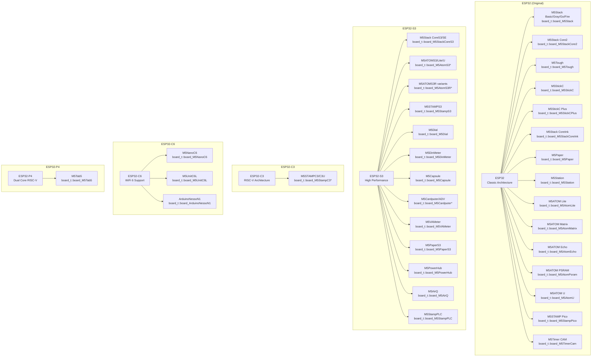
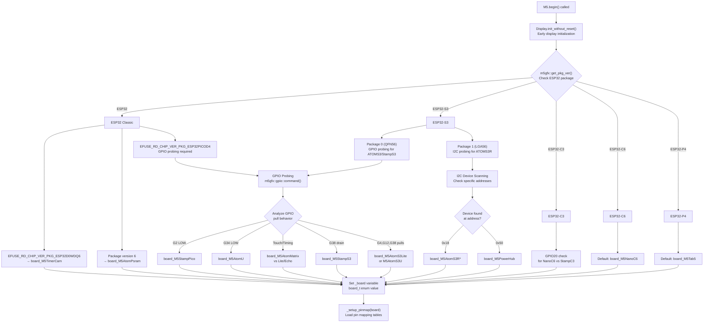
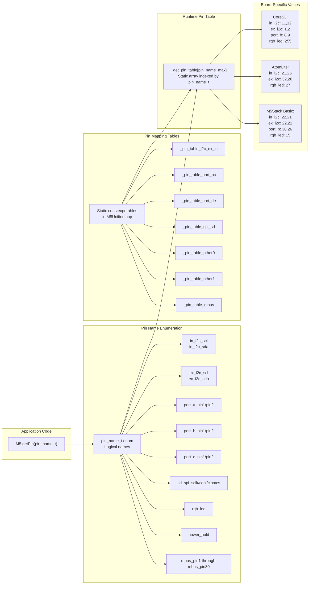

M5Unified Supported Hardware

# Supported Hardware

<details>
<summary>Relevant source files</summary>

The following files were used as context for generating this wiki page:

- [README.md](README.md)
- [examples/Basic/HowToUse/HowToUse.ino](examples/Basic/HowToUse/HowToUse.ino)
- [src/M5Unified.cpp](src/M5Unified.cpp)
- [src/M5Unified.hpp](src/M5Unified.hpp)

</details>


This page provides a comprehensive reference of all M5Stack devices supported by M5Unified, organized by ESP32 processor variant. It documents the board detection system, hardware features available on each device, and the pin mapping infrastructure that enables board-agnostic code.

For information about initializing M5Unified and configuring device detection, see [System Initialization](#3.1). For details about board-specific pin configurations and port assignments, see [Pin Mapping System](#3.3).

---

## ESP32 Variant Support

M5Unified supports devices across five ESP32 processor variants, with automatic hardware detection for over 40 distinct board configurations. The library uses the `board_t` enumeration defined in M5GFX to identify each supported device.



**Board Enumeration in Code**

Sources: [src/M5Unified.hpp:23]()

The `board_t` type alias references the `m5gfx::board_t` enumeration defined in the M5GFX library. Each supported device has a unique enum value used throughout initialization and configuration.

---

## Board Detection System

M5Unified employs a multi-stage detection process to automatically identify the runtime hardware. The detection logic is executed during `M5.begin()` and uses package version checking, GPIO probing, and I2C device scanning.



**Detection Implementation Details**

The board detection logic is implemented in `_check_boardtype()` method:

Sources: [src/M5Unified.cpp:901-1430]()

### ESP32 Package-Based Detection

For ESP32 (classic), the detection begins with reading the chip package version from eFuses:

- **EFUSE_RD_CHIP_VER_PKG_ESP32D0WDQ6**: Indicates M5Timer CAM
- **EFUSE_RD_CHIP_VER_PKG_ESP32PICOD4**: Requires GPIO probing to distinguish between StampPico, AtomU, AtomMatrix, AtomLite, and AtomEcho
- **Package version 6**: Indicates M5ATOM PSRAM

Sources: [src/M5Unified.cpp:907-1001]()

### ESP32-S3 Detection Strategy

ESP32-S3 devices use different detection strategies based on package type:

**QFN56 Package (pkg_ver = 0):** GPIO probing sequence analyzes pull-up/pull-down behavior on GPIO4, GPIO8, GPIO10, GPIO12, and GPIO38 to distinguish between:
- M5StampS3: GPIO38 drains charge quickly (pulled by SGM2578)
- M5AtomS3Lite: GPIO4 drains charge (InfraRed component)
- M5AtomS3U: GPIO4 remains charged (not connected)
- M5Capsule: Specific GPIO pattern (result bits 0b110)

**LGA56 Package (pkg_ver = 1):** I2C probing checks for ES8311 audio codec at address 0x18 to identify M5ATOMS3R variants.

Sources: [src/M5Unified.cpp:1046-1172]()

### GPIO Probing Mechanism

The GPIO probing uses `m5gfx::gpio::command()` to execute sequences of GPIO operations atomically:

```cpp
// Example from PICOD4 detection
auto result = m5gfx::gpio::command(
  (const uint8_t[]) {
    m5gfx::gpio::command_mode_input_pulldown, GPIO_NUM_2,
    m5gfx::gpio::command_mode_input_pullup  , GPIO_NUM_2,
    m5gfx::gpio::command_read               , GPIO_NUM_2,
    m5gfx::gpio::command_mode_input         , GPIO_NUM_2,
    m5gfx::gpio::command_delay              , 1,
    m5gfx::gpio::command_read               , GPIO_NUM_2,
    m5gfx::gpio::command_end
  }
);
```

The result bits indicate whether GPIO pins maintained their charge or drained, revealing hardware differences.

Sources: [src/M5Unified.cpp:915-995](), [src/M5Unified.cpp:1063-1113]()

### Touch Sensor Detection (ESP32 Only)

For distinguishing M5ATOM Matrix from Lite/Echo, the library uses touch sensor readings on GPIO27 (RGB LED pin) and GPIO13 (not connected). The capacitance difference allows identification.

Sources: [src/M5Unified.cpp:757-812](), [src/M5Unified.cpp:924-961]()

---

## Device Features by Board Family

### M5Stack Series (Large Form Factor)

| Device | Display | Touch | PMIC | IMU | RTC | Speaker | Microphone | SD Card | Ports |
|--------|---------|-------|------|-----|-----|---------|------------|---------|-------|
| **M5Stack Basic/Gray/GO/Fire** | ILI9342C<br/>320×240 | No | IP5306<br/>0x75 | MPU6886/SH200Q<br/>0x68/0x6C | Optional<br/>Unit RTC | DAC GPIO25 | Optional (GO/Fire)<br/>ADC GPIO34 | Yes | A,B,C,D,E |
| **M5Stack Core2** | ILI9342C<br/>320×240 | FT6336U<br/>0x38 | AXP192<br/>0x34 | MPU6886<br/>0x68 | BM8563<br/>0x51 | I2S GPIO2 | PDM GPIO34 | Yes | A,B,C,D,E |
| **M5Stack Core2 v1.1** | ILI9342C<br/>320×240 | FT6336U<br/>0x38 | AXP2101<br/>0x34 | MPU6886<br/>0x68 | BM8563<br/>0x51 | I2S GPIO2 | PDM GPIO34 | Yes | A,B,C,D,E |
| **M5Tough** | ILI9342C<br/>320×240 | CHSC6540<br/>0x2E | AXP192<br/>0x34 | No | BM8563<br/>0x51 | I2S GPIO2 | No | Yes | A,B,C,E |
| **M5Stack CoreS3** | ILI9342C<br/>320×240 | FT5xxx<br/>0x38 | AXP2101<br/>0x34 | BMI270<br/>0x69 | BM8563<br/>0x51 | AW88298<br/>I2S GPIO13 | ES7210<br/>I2S GPIO14 | Yes | A,B,C |
| **M5Station** | ILI9342C<br/>320×240 | No | AXP192<br/>0x34 | MPU6886<br/>0x68 | BM8563<br/>0x51 | DAC GPIO25 | No | No | A,B1,B2,C1,C2 |

Sources: [README.md:53-61](), [README.md:408-421]()

### M5Stick Series (Compact Form Factor)

| Device | Display | PMIC | IMU | RTC | Speaker | Microphone | HAT Port |
|--------|---------|------|-----|-----|---------|------------|----------|
| **M5StickC** | ST7735S<br/>80×160 | AXP192<br/>0x34 | MPU6886/SH200Q<br/>0x68/0x6C | BM8563<br/>0x51 | No | PDM GPIO34<br/>(via AXP LDO0) | Yes |
| **M5StickC Plus** | ST7789V2<br/>135×240 | AXP192<br/>0x34 | MPU6886/SH200Q<br/>0x68/0x6C | BM8563<br/>0x51 | Buzzer GPIO2 | PDM GPIO34<br/>(via AXP LDO0) | Yes |
| **M5StickC Plus2** | ST7789V2<br/>135×240 | AXP2101<br/>0x34 | MPU6886<br/>0x68 | BM8563<br/>0x51 | Buzzer GPIO2 | PDM GPIO34 | Yes |

Sources: [README.md:56]()

### M5Paper Series (E-Ink Displays)

| Device | Display | Touch | PMIC | RTC | Storage | Features |
|--------|---------|-------|------|-----|---------|----------|
| **M5Paper** | IT8951<br/>960×540<br/>E-Ink | GT911<br/>0x14/0x5D | No | BM8563<br/>0x51 | SD Card | SHT30 temp/humidity<br/>0x44 |
| **M5CoreInk** | GDEW0154M09<br/>200×200<br/>E-Ink | No | No | BM8563<br/>0x51 | No | Buzzer GPIO2<br/>HAT port |
| **M5PaperS3** | GDEW0154M09<br/>200×200<br/>E-Ink | No | No | No | SD Card | Power hold GPIO44 |

Sources: [README.md:59](), [README.md:73]()

### M5ATOM Series (Minimal Form Factor)

| Device | Features | I2C Pins | RGB LED | Button | Special |
|--------|----------|----------|---------|--------|---------|
| **M5ATOM Lite** | Minimal | G25,G21 | GPIO27 | GPIO39 | Port.A connector |
| **M5ATOM Matrix** | 5×5 LED matrix | G25,G21 | GPIO27 | GPIO39 | 25 addressable LEDs |
| **M5ATOM Echo** | I2S Speaker | G25,G21 | GPIO27 | GPIO39 | ES8311 codec<br/>SPK: G22,G19,G23 |
| **M5ATOM U** | IR + Mic | G25,G21 | GPIO27 | GPIO39 | PDM mic G5<br/>IR G12 |
| **M5ATOM PSRAM** | 8MB PSRAM | G25,G21 | GPIO27 | GPIO39 | Extra memory |
| **M5ATOMS3/Lite** | ESP32-S3 | G2,G1 | GPIO35 | GPIO41 | QFN56 package |
| **M5ATOMS3U** | IR + Mic | G2,G1 | GPIO35 | GPIO41 | PDM G38,G39<br/>IR G12 |
| **M5ATOMS3R** | Camera | G2,G1 | N/A | GPIO41 | OV2640 camera |

Sources: [README.md:60-61](), [README.md:63-66]()

### M5Stamp Series (Module Form Factor)

| Device | ESP32 Variant | Features | I2C | RGB LED | Button |
|--------|---------------|----------|-----|---------|--------|
| **M5STAMP Pico** | ESP32 | Minimal module | G32,G33 | GPIO27 | GPIO39 |
| **M5STAMPC3** | ESP32-C3 | RISC-V | G0,G1 | GPIO2 | GPIO3 |
| **M5STAMPC3U** | ESP32-C3 | USB port | G0,G1 | GPIO2 | GPIO9 |
| **M5STAMPS3** | ESP32-S3 | QFN56 | G15,G13 | GPIO21 | GPIO0 |
| **M5StampPLC** | ESP32-S3 | Industrial | G1,G2 | GPIO21 | N/A |

Sources: [README.md:61](), [README.md:67](), [README.md:76-77]()

### Specialized Devices

| Device | ESP32 Variant | Primary Feature | Display | Special Hardware |
|--------|---------------|-----------------|---------|------------------|
| **M5Dial** | ESP32-S3 | Rotary encoder | GC9A01<br/>240×240<br/>Round | RFID reader<br/>Encoder GPIO40,41<br/>Touch panel |
| **M5DinMeter** | ESP32-S3 | DIN rail mount | GC9A01<br/>240×240<br/>Round | RS485 option |
| **M5Capsule** | ESP32-S3 | Capsule form | ST7789V<br/>135×240 | Buzzer GPIO2<br/>IR GPIO4 |
| **M5Cardputer** | ESP32-S3 | Full keyboard | ST7789V<br/>135×240 | Keyboard matrix<br/>IR GPIO44 |
| **M5CardputerADV** | ESP32-S3 | Audio+Keyboard | ST7789V<br/>135×240 | ES8311 I2S audio<br/>Keyboard matrix |
| **M5VAMeter** | ESP32-S3 | Voltage/current | ILI9341<br/>320×240 | Measurement circuits |
| **M5AirQ** | ESP32-S3 | Air quality | GC9A01<br/>240×240 | Environmental sensors |
| **M5PowerHub** | ESP32-S3 | Power control | No | Multi-port power<br/>management |
| **M5Tab5** | ESP32-P4 | Tablet form | ILI9488<br/>480×320 | ES8388 audio<br/>INA226 monitor |
| **M5NanoC6** | ESP32-C6 | WiFi 6 support | No | RGB LED GPIO20 |
| **M5UnitC6L** | ESP32-C6 | Unit form | No | RGB LED GPIO2 |
| **ArduinoNessoN1** | ESP32-C6 | Arduino form | No | BQ27220 fuel gauge<br/>AW32001 PMIC |

Sources: [README.md:68-75](), [README.md:79-85]()

---

## Pin Mapping System

M5Unified provides a board-agnostic pin lookup system through static pin mapping tables. The `pin_name_t` enumeration defines logical pin names that are resolved to physical GPIO numbers based on the detected board.



**Pin Lookup API**

Applications retrieve GPIO numbers using:
```cpp
int8_t gpio_num = M5.getPin(pin_name_t::port_a_scl);
```

The pin name is resolved through the `_get_pin_table` array populated during `_setup_pinmap()`.

Sources: [src/M5Unified.hpp:26-54](), [src/M5Unified.hpp:251](), [src/M5Unified.cpp:62]()

### Pin Mapping Table Structure

Each pin table is a 2D array where the first column contains the `board_t` enum value, followed by GPIO numbers for that board:

```cpp
static constexpr const uint8_t _pin_table_i2c_ex_in[][5] = {
  // board_t           In_SCL     In_SDA     Ex_SCL     Ex_SDA
  { board_M5StackCoreS3, GPIO_NUM_11, GPIO_NUM_12, GPIO_NUM_1, GPIO_NUM_2 },
  { board_M5AtomLite,    GPIO_NUM_21, GPIO_NUM_25, GPIO_NUM_32, GPIO_NUM_26 },
  { board_unknown,       GPIO_NUM_22, GPIO_NUM_21, GPIO_NUM_33, GPIO_NUM_32 },
};
```

The `board_unknown` row provides default values used when a specific board isn't matched.

Sources: [src/M5Unified.cpp:73-114]()

### Pin Table Categories

The pin mapping system uses seven separate tables:

1. **_pin_table_i2c_ex_in**: Internal and External I2C buses (4 pins)
2. **_pin_table_port_bc**: Port B and Port C pin assignments (4 pins)
3. **_pin_table_port_de**: Port D and Port E pin assignments (4 pins)
4. **_pin_table_spi_sd**: SPI pins for SD card access (4 pins)
5. **_pin_table_other0**: RGB LED pin (1 pin)
6. **_pin_table_other1**: Power hold pin (1 pin)
7. **_pin_table_mbus**: M-Bus expansion connector pins (30 pins)

Sources: [src/M5Unified.cpp:73-324]()

### Port Naming Conventions

M5Stack devices use lettered ports (A, B, C, D, E) with pin naming that reflects their common use:

- **Port A**: I2C expansion port (`port_a_scl`, `port_a_sda`)
- **Port B**: GPIO port (`port_b_in`, `port_b_out`)
- **Port C**: UART port (`port_c_rxd`, `port_c_txd`)
- **Port D**: UART port (`port_d_rxd`, `port_d_txd`)
- **Port E**: UART port (`port_e_rxd`, `port_e_txd`)

M5Station provides duplicated ports labeled B2 and C2.

Sources: [src/M5Unified.hpp:30-39]()

### M-Bus Connector Pins

The M5Stack Core series features a 30-pin M-Bus connector on the bottom. Pin mapping includes all 30 positions:

```cpp
static constexpr const uint8_t _pin_table_mbus[][31] = {
  { board_t::board_M5StackCoreS3,
    255, GPIO_NUM_10,  // pins 1-2
    255, GPIO_NUM_8,   // pins 3-4
    // ... continues through pin 30
  },
};
```

Unmapped pins are marked with 255.

Sources: [src/M5Unified.cpp:231-324](), [src/M5Unified.hpp:46-51]()

### Pin Mapping Initialization

The `_setup_pinmap()` method populates the runtime `_get_pin_table` array during `M5.begin()`:

```cpp
void M5Unified::_setup_pinmap(board_t id)
{
  constexpr const std::pair<const void*, size_t> tbl[] = {
    { _pin_table_i2c_ex_in, sizeof(_pin_table_i2c_ex_in[0]) },
    { _pin_table_port_bc, sizeof(_pin_table_port_bc[0]) },
    // ... other tables
  };
  
  int8_t* dst = _get_pin_table;
  for (auto &p : tbl) {
    const uint8_t* t = (uint8_t*)p.first;
    size_t len = p.second;
    // Find matching board_t in table
    while (t[0] != id && t[0] != board_t::board_unknown) { t += len; }
    // Copy GPIO values to runtime table
    memcpy(dst, &t[1], len - 1);
    dst += len - 1;
  }
}
```

Sources: [src/M5Unified.cpp:326-346]()

---

## I2C Device Map

M5Unified manages two I2C buses: internal (In_I2C) for onboard peripherals and external (Ex_I2C) for expansion ports. Device addresses and bus assignments vary by board.

### Internal I2C Bus Devices

| Device Type | Address | Boards | Purpose |
|-------------|---------|--------|---------|
| **AXP192** | 0x34 | Core2, Tough, StickC, StickCPlus, Station | Power management IC |
| **AXP2101** | 0x34 | Core2 v1.1, CoreS3, StickCPlus2 | Power management IC |
| **IP5306** | 0x75 | M5Stack Basic/Gray/Go/Fire | Power management IC |
| **AW32001** | 0x34 | ArduinoNessoN1 | Power management IC |
| **MPU6886** | 0x68 | M5Stack, Core2, StickC, Station, AtomMatrix | IMU (Accelerometer + Gyroscope) |
| **BMI270** | 0x69 | CoreS3 | IMU (Accelerometer + Gyroscope) |
| **SH200Q** | 0x6C | M5Stack (old), StickC (old) | IMU (Accelerometer + Gyroscope) |
| **BM8563/PCF8563** | 0x51 | Core2, Tough, CoreS3, StickC, StickCPlus, CoreInk, Paper, Station | Real-time clock |
| **RX8130** | 0x32 | Paper | Real-time clock |
| **FT6336U** | 0x38 | Core2 (v1.0 and v1.1) | Touch panel controller |
| **FT5xxx** | 0x38 | CoreS3 | Touch panel controller |
| **CHSC6540** | 0x2E | Tough | Touch panel controller |
| **GT911** | 0x14 or 0x5D | M5Paper | Touch panel controller |
| **AW88298** | 0x36 | CoreS3 | Audio speaker amplifier |
| **ES8311** | 0x18 or 0x19 | Cardputer ADV, AtomEchoS3R | Audio codec (speaker/mic) |
| **ES7210** | 0x40 | CoreS3, Tab5 | Microphone ADC |
| **ES8388** | 0x10 | Tab5 | Audio codec |
| **AW9523B** | 0x58 | CoreS3 | GPIO expander |
| **PI4IOE5V6408** | 0x43 | Tab5, Atomic Echo | GPIO expander |
| **INA3221** | 0x40/0x41 | Core2 v1.1, Station (optional) | Current/voltage monitor |
| **INA226** | 0x40 | Tab5 | Current/voltage monitor |
| **BQ27220** | 0x55 | ArduinoNessoN1 | Battery fuel gauge |
| **LTR553ALS** | 0x23 | CoreS3 | Ambient light sensor |
| **SHT30** | 0x44 | M5Paper | Temperature/humidity sensor |
| **GC0308** | 0x21 | CoreS3 | Camera module |

Sources: [README.md:408-421](), [src/M5Unified.cpp:365-373]()

### External I2C Bus (Port.A)

The external I2C bus connects to Port.A on most devices. Common peripherals include:

- **Unit RTC** (BM8563 at 0x51): External real-time clock module
- **Unit IMU** (MPU6886 at 0x68): External inertial measurement unit
- **External displays**: Unit OLED, Unit LCD, Unit GLASS (various addresses)

Sources: [README.md:107-109]()

### I2C Pin Assignments by Board Family

| Board | Internal I2C (SCL, SDA) | External I2C (SCL, SDA) |
|-------|-------------------------|-------------------------|
| **M5Stack Basic** | GPIO22, GPIO21 | GPIO22, GPIO21 (shared) |
| **M5Stack Core2** | GPIO22, GPIO21 | GPIO33, GPIO32 |
| **M5Stack CoreS3** | GPIO11, GPIO12 | GPIO1, GPIO2 |
| **M5StickC** | GPIO22, GPIO21 | GPIO33, GPIO32 |
| **M5ATOM Lite** | GPIO21, GPIO25 | GPIO32, GPIO26 |
| **M5ATOMS3** | GPIO39, GPIO38 | GPIO1, GPIO2 |
| **M5Stamp Pico** | GPIO22, GPIO21 | GPIO32, GPIO33 |
| **M5StampC3** | 255, 255 (none) | GPIO0, GPIO1 |
| **M5Dial** | GPIO12, GPIO11 | GPIO15, GPIO13 |
| **M5Tab5** | GPIO32, GPIO31 | GPIO54, GPIO53 |

Sources: [src/M5Unified.cpp:73-114]()

---

## External Accessories

M5Unified supports automatic detection and initialization of external displays, speakers, and other accessories.

### External Display Support

The following external displays can be automatically detected and added to the `_displays` vector:

| Accessory | Interface | Resolution | Compatible Boards | Configuration Flag |
|-----------|-----------|------------|-------------------|-------------------|
| **ATOM Display** | HDMI | 1920×1080 | ATOM series, ATOMS3 series | `cfg.external_display.atom_display` |
| **Module Display** | HDMI | 1920×1080 | M5Stack Core, Core2, CoreS3 | `cfg.external_display.module_display` |
| **Unit OLED** | I2C | 128×64 | Any with Port.A | `cfg.external_display.unit_oled` |
| **Unit Mini OLED** | I2C | 64×32 | Any with Port.A | `cfg.external_display.unit_mini_oled` |
| **Unit LCD** | I2C | 128×160 | Any with Port.A | `cfg.external_display.unit_lcd` |
| **Unit GLASS** | I2C | 128×128 | Any with Port.A | `cfg.external_display.unit_glass` |
| **Unit GLASS2** | I2C | 128×128 | Any with Port.A | `cfg.external_display.unit_glass2` |
| **Module RCA** | Composite | 480i NTSC/PAL | M5Stack Core, Core2 (ESP32 only) | `cfg.external_display.module_rca` |
| **Unit RCA** | Composite | 480i NTSC/PAL | Various (ESP32 only) | `cfg.external_display.unit_rca` |

External displays are detected during `M5.begin()` after power initialization. Applications can enumerate displays using `M5.getDisplayCount()` and `M5.getDisplay(index)`.

Sources: [README.md:87-96](), [src/M5Unified.hpp:108-124]()

### External Speaker Support

External speaker accessories extend or replace internal audio:

| Accessory | Audio Path | Compatible Boards | Configuration Flag |
|-----------|-----------|-------------------|-------------------|
| **SPK HAT** | I2S amplifier | StickC, StickCPlus, CoreInk | `cfg.external_speaker.hat_spk` |
| **SPK HAT2** | I2S amplifier | StickCPlus | `cfg.external_speaker.hat_spk2` |
| **ATOMIC SPK** | I2S amplifier | ATOM series | `cfg.external_speaker.atomic_spk` |
| **ATOMIC ECHO** | ES8311 codec | ATOM series | `cfg.external_speaker.atomic_echo` |
| **Module Display** | HDMI audio | M5Stack Core, Core2, CoreS3 | Automatic with display |
| **Module RCA** | Composite audio | M5Stack Core, Core2 | `cfg.external_speaker.module_rca` |

Speaker configuration is performed in `_begin_spk()` after display detection.

Sources: [README.md:98-105](), [src/M5Unified.hpp:94-106]()

### External Sensor Units

| Unit | Sensor Type | I2C Address | Compatible Boards | Configuration |
|------|-------------|-------------|-------------------|---------------|
| **Unit RTC** | Real-time clock | 0x51 (BM8563) | Any with Port.A | `cfg.external_rtc = true` |
| **Unit IMU** | 6-axis IMU | 0x68 (MPU6886) | Any with Port.A | `cfg.external_imu = true` |

These units connect to the external I2C bus (Port.A) and are initialized if the corresponding configuration flags are enabled.

Sources: [README.md:107-109](), [src/M5Unified.hpp:148-151]()

---

## Configuration and Initialization

The `config_t` structure controls which hardware features are detected and initialized:

```cpp
auto cfg = M5.config();

// Disable automatic detection of certain peripherals
cfg.internal_imu = false;  // Don't initialize internal IMU
cfg.internal_rtc = false;  // Don't initialize internal RTC

// Enable external peripherals
cfg.external_imu = true;   // Initialize Unit IMU on Port.A
cfg.external_rtc = true;   // Initialize Unit RTC on Port.A

// Configure external displays
cfg.external_display.unit_oled = true;
cfg.external_display.unit_lcd = true;

// Configure external speakers
cfg.external_speaker.atomic_echo = true;

// Set fallback board if detection fails
cfg.fallback_board = board_t::board_M5AtomLite;

// Power configuration
cfg.output_power = true;   // Enable 5V output to ports
cfg.pmic_button = true;    // Use PMIC button as BtnPWR

M5.begin(cfg);
```

**Configuration Options**

| Field | Type | Default | Description |
|-------|------|---------|-------------|
| `serial_baudrate` | `uint32_t` | 0 | Baud rate for Serial.begin() (0=disabled) |
| `clear_display` | `bool` | true | Clear display during initialization |
| `output_power` | `bool` | true | Enable 5V output to external ports |
| `pmic_button` | `bool` | true | Use PMIC power button as BtnPWR |
| `internal_imu` | `bool` | true | Initialize internal IMU if present |
| `internal_rtc` | `bool` | true | Initialize internal RTC if present |
| `internal_mic` | `bool` | true | Initialize internal microphone |
| `internal_spk` | `bool` | true | Initialize internal speaker |
| `external_imu` | `bool` | false | Initialize Unit IMU on Port.A |
| `external_rtc` | `bool` | false | Initialize Unit RTC on Port.A |
| `disable_rtc_irq` | `bool` | true | Clear RTC interrupt flag at startup |
| `led_brightness` | `uint8_t` | 0 | System LED brightness (0-255) |
| `fallback_board` | `board_t` | variant-specific | Board type if detection fails |

Sources: [src/M5Unified.hpp:83-213]()

---

## Arduino Board Definitions

When using Arduino IDE, predefined macros can influence board detection fallback:

- `ARDUINO_M5STACK_CORE_ESP32`: Falls back to `board_M5Stack`
- `ARDUINO_M5STACK_CORE2`: Falls back to `board_M5StackCore2`
- `ARDUINO_M5STICK_C`: Falls back to `board_M5StickC`
- `ARDUINO_M5STICK_C_PLUS`: Falls back to `board_M5StickCPlus`
- `ARDUINO_M5STACK_COREINK`: Falls back to `board_M5StackCoreInk`
- `ARDUINO_M5STACK_PAPER`: Falls back to `board_M5Paper`
- `ARDUINO_M5STACK_TOUGH`: Falls back to `board_M5Tough`
- `ARDUINO_M5STACK_ATOM`: Falls back to `board_M5AtomLite`
- `ARDUINO_M5STACK_TIMER_CAM`: Falls back to `board_M5TimerCam`

These macros are checked when package version detection fails to provide reasonable defaults.

Sources: [src/M5Unified.cpp:1005-1042]()

---

## Related Pages

- For initialization details and `M5.begin()` process, see [System Initialization](#3.1)
- For board detection algorithm details, see [Board Detection](#3.2)
- For pin mapping implementation and usage, see [Pin Mapping System](#3.3)
- For power management chip differences, see [Power Management](#4)
- For I2C communication and device addressing, see [I2C Interface](#8.1)