M5Unified System Initialization and Lifecycle

# System Initialization and Lifecycle

<details>
<summary>Relevant source files</summary>

The following files were used as context for generating this wiki page:

- [src/M5Unified.cpp](src/M5Unified.cpp)
- [src/M5Unified.hpp](src/M5Unified.hpp)

</details>


## Purpose and Scope

This page documents the complete initialization process executed by `M5.begin()` and the subsequent runtime lifecycle of M5Unified applications. It covers the ordered sequence of hardware detection, configuration, and subsystem initialization that prepares M5Stack devices for use.

**Related pages:**
- For hardware identification details, see [Board Detection and Hardware Identification](#2.2)
- For GPIO assignment tables, see [Pin Mapping System](#2.3)
- For display setup specifics, see [Display Management and M5GFX Integration](#2.4)
- For runtime operation, see [Main Update Loop and Peripheral Polling](#2.5)

## Overview

M5Unified follows a strictly ordered, single-pass initialization sequence that:

1. Prevents multiple initialization attempts (begin-once guarantee)
2. Detects the board type at runtime
3. Configures hardware-specific pin mappings
4. Initializes communication buses (I2C, SPI)
5. Sets up peripheral subsystems (Power, Audio, Display, Sensors)
6. Prepares the system for the main application loop

The entire process is orchestrated by the `M5Unified::begin()` method, which delegates to several internal initialization methods.

**Sources:** [src/M5Unified.hpp:332-603](), [src/M5Unified.cpp:1534-1741]()

## Configuration Structure

The `config_t` structure controls initialization behavior. Key configuration fields:

| Field | Type | Default | Description |
|-------|------|---------|-------------|
| `serial_baudrate` | uint32_t | 0 | Serial port baud rate (0=disabled) |
| `clear_display` | bool | true | Clear screen during initialization |
| `output_power` | bool | true | Enable 5V output to external ports |
| `pmic_button` | bool | true | Use PMIC button for BtnPWR |
| `internal_imu` | bool | true | Initialize internal IMU |
| `internal_rtc` | bool | true | Initialize internal RTC |
| `internal_mic` | bool | true | Initialize microphone |
| `internal_spk` | bool | true | Initialize speaker |
| `external_imu` | bool | false | Detect external IMU on Port A |
| `external_rtc` | bool | false | Detect external RTC on Port A |
| `led_brightness` | uint8_t | 0 | System LED brightness (0-255) |
| `fallback_board` | board_t | (varies) | Board type if auto-detection fails |

**Sources:** [src/M5Unified.hpp:83-213]()

## Initialization Entry Point

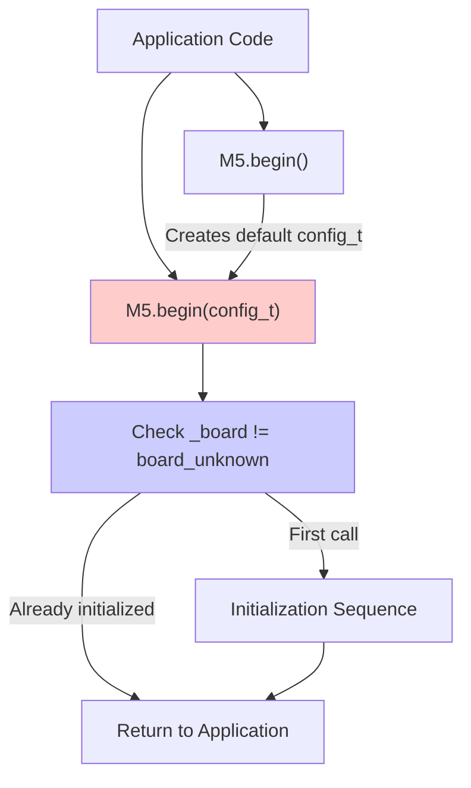

**Sources:** [src/M5Unified.hpp:323-327](), [src/M5Unified.hpp:332-603]()

The `begin()` method guarantees single execution through the board type check at [src/M5Unified.hpp:335](). If `_board != board_unknown`, the method returns immediately, preventing re-initialization.

## Power Hold Pin (ESP32-S3)

On ESP32-S3 devices (Capsule, Dial, DinMeter), GPIO46 must be set HIGH before any initialization to maintain power:

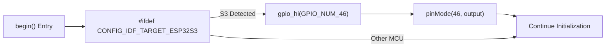

**Sources:** [src/M5Unified.hpp:337-341]()

This prevents the device from powering down during initialization. The operation is MCU-specific and occurs before any other initialization steps.

## Master Initialization Sequence

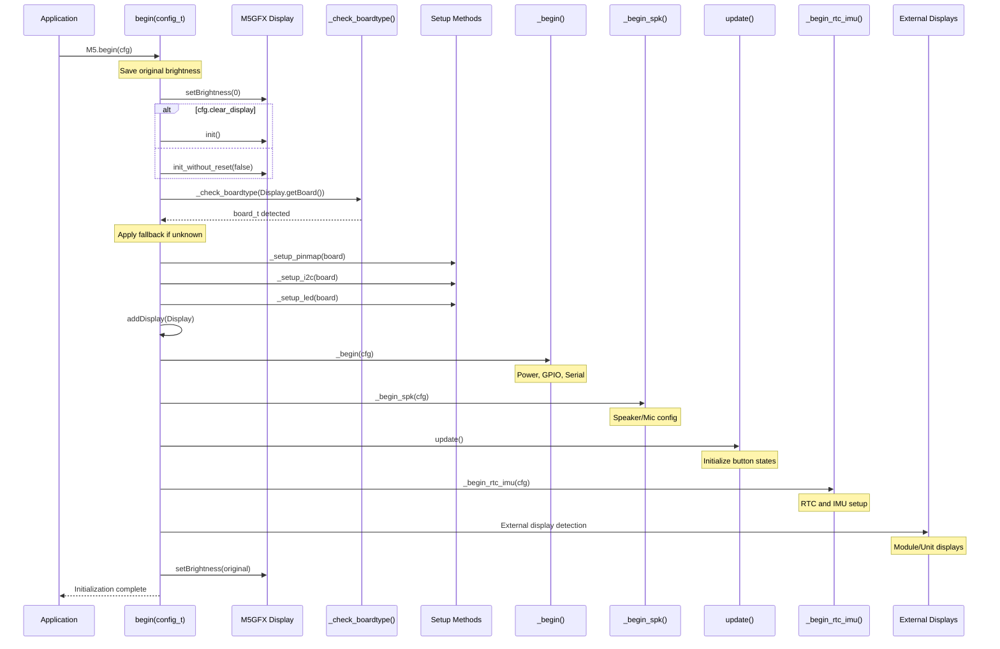

**Sources:** [src/M5Unified.hpp:332-603]()

## Display Initialization Phase

The display initializes first to enable board detection through hardware probing:

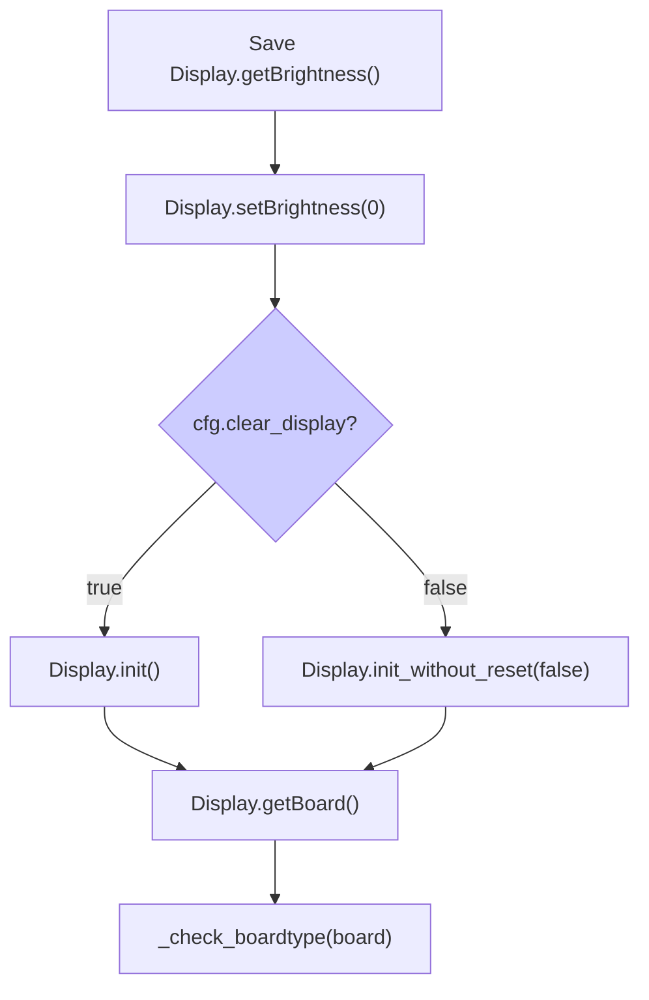

**Sources:** [src/M5Unified.hpp:343-351]()

The brightness is set to zero to prevent display flicker during initialization, then restored at [src/M5Unified.hpp:599-602]() after all setup is complete.

**Board detection flow:**
1. Display attempts hardware identification through GPIO/I2C probes
2. `Display.getBoard()` returns tentative board type
3. `_check_boardtype()` performs additional verification
4. If `board_unknown`, `cfg.fallback_board` is used

**Sources:** [src/M5Unified.hpp:351-354]()

## Configuration Phase

After board detection, three setup methods configure hardware-specific resources:

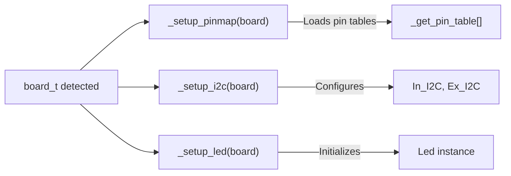

**Sources:** [src/M5Unified.hpp:355-357]()

These methods are detailed in:
- Pin mapping: See [Pin Mapping System](#2.3)
- I2C setup: [src/M5Unified.cpp:1420-1495]()
- LED setup: [src/M5Unified.cpp:1496-1532]()

## Internal Hardware Initialization (_begin)

The `_begin()` method [src/M5Unified.cpp:1534-1741]() initializes core hardware:

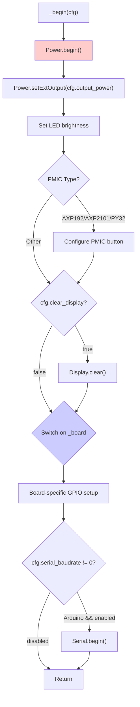

**Sources:** [src/M5Unified.cpp:1534-1741]()

### Power Management Initialization

Power initialization occurs first and is critical:

```cpp
Power.begin();                      // Auto-detect and initialize PMIC
Power.setExtOutput(cfg.output_power); // Control external port power
if (cfg.led_brightness) {
    Power.setLed(cfg.led_brightness); // System status LED
}
```

**Sources:** [src/M5Unified.cpp:1536-1542]()

For PMIC details, see [Power Management System](#3).

### PMIC Button Configuration

If an AXP192, AXP2101, or PY32PMIC is detected:

```cpp
auto pmic_type = Power.getType();
if (pmic_type == pmic_axp2101 || pmic_type == pmic_axp192 || pmic_type == pmic_py32pmic) {
    _use_pmic_button = cfg.pmic_button;
    BtnPWR.setHoldThresh(BtnPWR.getHoldThresh() * 1.2);
}
```

**Sources:** [src/M5Unified.cpp:1543-1551]()

The hold threshold is extended by 20% to accommodate the AXP192's longer button detection time.

### Board-Specific GPIO Setup

Different boards require specific GPIO configurations:

| Board | GPIO Configuration | Purpose |
|-------|-------------------|---------|
| M5Stack | GPIO15 LOW, SPI pins high-drive | WiFi sensitivity, SD speed |
| StickC/Atom | GPIO0 HIGH output | CH552 overvoltage prevention |
| CoreInk | GPIO5, GPIO27 input | Button pins |
| StampC3 | GPIO3 input pullup | Button pin |
| StickS3 | I2C PMIC GPIO3 config | PA control pin |

**Sources:** [src/M5Unified.cpp:1559-1730]()

## Audio Configuration (_begin_spk)

Audio setup [src/M5Unified.cpp:1743-2304]() is complex due to board-specific codecs and external peripherals:

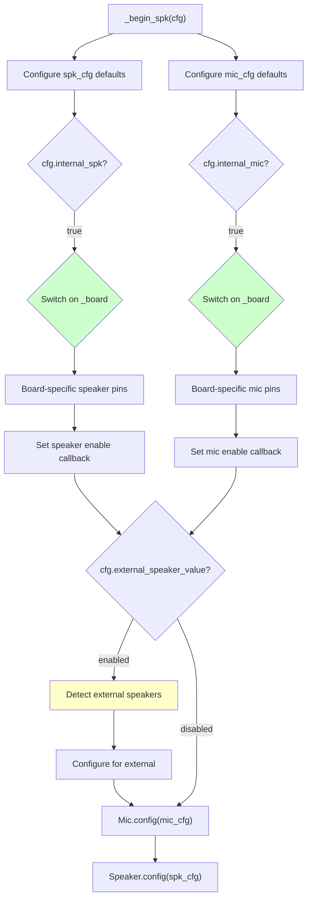

**Sources:** [src/M5Unified.cpp:1743-2304]()

### Microphone Configuration Examples

**CoreS3 (ES7210 codec):**
```cpp
mic_cfg.pin_mck = GPIO_NUM_0;
mic_cfg.pin_bck = GPIO_NUM_34;
mic_cfg.pin_ws = GPIO_NUM_33;
mic_cfg.pin_data_in = GPIO_NUM_14;
mic_cfg.i2s_port = I2S_NUM_1;
mic_cfg.input_channel = input_channel_t::input_stereo;
mic_enable_cb = _microphone_enabled_cb_cores3;
```

**Sources:** [src/M5Unified.cpp:1775-1788]()

**StickC (PDM microphone with AXP192 LDO control):**
```cpp
mic_cfg.pin_data_in = GPIO_NUM_34;
mic_cfg.pin_ws = GPIO_NUM_0;
mic_enable_cb = _microphone_enabled_cb_stickc;
```

**Sources:** [src/M5Unified.cpp:1849-1855]()

### Speaker Configuration Examples

**CoreS3 (AW88298 amplifier):**
```cpp
spk_cfg.pin_bck = GPIO_NUM_34;
spk_cfg.pin_ws = GPIO_NUM_33;
spk_cfg.pin_data_out = GPIO_NUM_13;
spk_cfg.magnification = 4;
spk_cfg.i2s_port = I2S_NUM_1;
spk_enable_cb = _speaker_enabled_cb_cores3;
```

**Sources:** [src/M5Unified.cpp:1931-1942]()

The callback functions handle codec-specific initialization via I2C register writes.

### External Speaker Detection

For ATOM-series devices, external speakers are detected through GPIO probing:

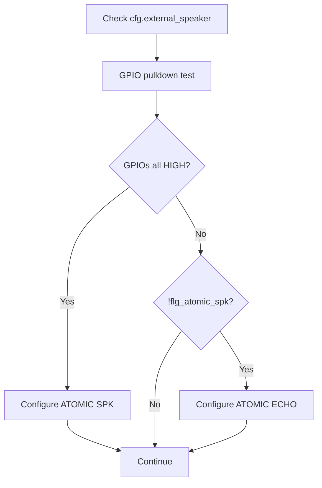

**Sources:** [src/M5Unified.cpp:1973-2016]() (ESP32-S3), [src/M5Unified.cpp:2188-2245]() (ESP32)

## First Update Cycle

Immediately after audio configuration, `update()` is called to initialize button states:

```cpp
update();  // Initialize button state machines
```

**Sources:** [src/M5Unified.hpp:407]()

This ensures button states are valid before user code executes. The update process is detailed in [Main Update Loop and Peripheral Polling](#2.5).

## Sensor Initialization (_begin_rtc_imu)

RTC and IMU initialization [src/M5Unified.cpp:2306-2339]() attempts internal then external detection:

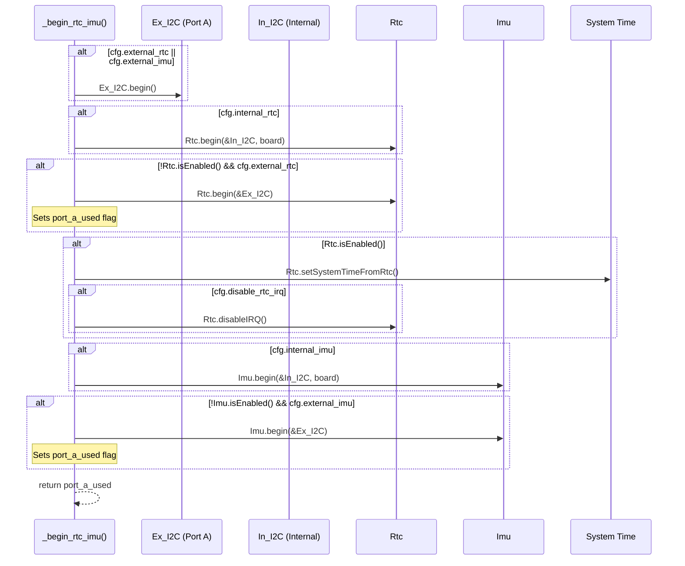

**Sources:** [src/M5Unified.cpp:2306-2339]()

### Port A Usage Tracking

The `port_a_used` flag prevents certain external displays (like UnitRCA on ATOM) from initializing when Port A is occupied by sensors:

```cpp
bool port_a_used = _begin_rtc_imu(cfg);
// Later used to prevent UnitRCA on ATOM when Port A has sensors
```

**Sources:** [src/M5Unified.hpp:409](), [src/M5Unified.hpp:579-585]()

## External Display Detection

After internal hardware initialization, external displays are probed:

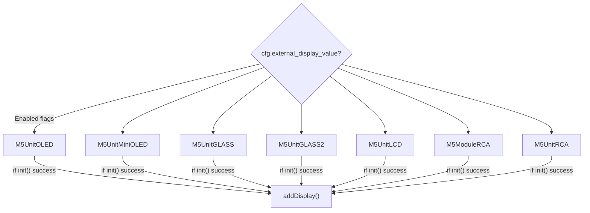

**Sources:** [src/M5Unified.hpp:422-597]()

Each display type has conditional compilation guards and board compatibility checks. I2C pins default to Ex_I2C configuration if not explicitly set.

## Post-Initialization State

After `begin()` returns, the system is in the runtime state:

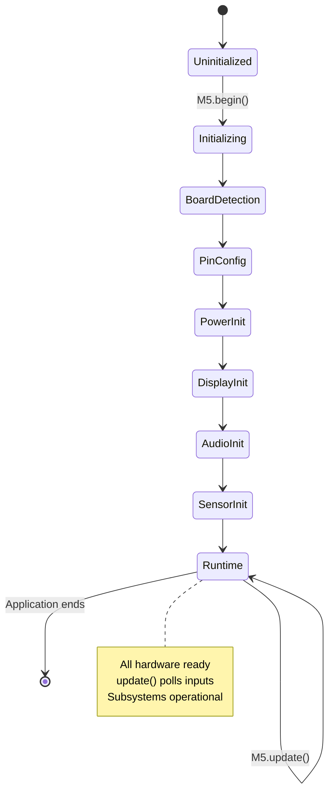

**Key state at runtime:**
- `_board` contains detected/fallback board type
- `_displays` vector contains all registered displays
- Display brightness restored to original value
- All button state machines initialized
- Power management active
- Audio, RTC, IMU ready (if configured)

**Sources:** [src/M5Unified.hpp:332-603]()

## Initialization Ordering Rationale

The initialization order is carefully designed to satisfy dependencies:

| Phase | Rationale |
|-------|-----------|
| **Power Hold** | ESP32-S3 devices require this immediately or they power down |
| **Display Init** | Needed for board detection hardware probes |
| **Board Detection** | Determines all subsequent hardware configuration |
| **Pin Mapping** | Provides GPIO numbers for all other subsystems |
| **I2C Setup** | Required by Power, RTC, IMU, Audio codecs |
| **Power Init** | Enables voltage rails needed by other peripherals |
| **Audio Config** | Uses I2C, may depend on external power |
| **First Update** | Initializes button states before user code |
| **Sensors** | Uses I2C, may conflict with audio if not ordered properly |
| **External Displays** | Uses external power, requires complete I2C setup |

**Sources:** [src/M5Unified.hpp:332-603]()

## Runtime Lifecycle

After initialization, applications enter the main loop:


The `update()` method must be called regularly (typically at the start of `loop()`) to:
- Read button/touch inputs
- Update button state machines
- Maintain PMIC communication
- Service other time-critical tasks

**Sources:** [src/M5Unified.cpp:2341-2683]()

For details on the update cycle, see [Main Update Loop and Peripheral Polling](#2.5).