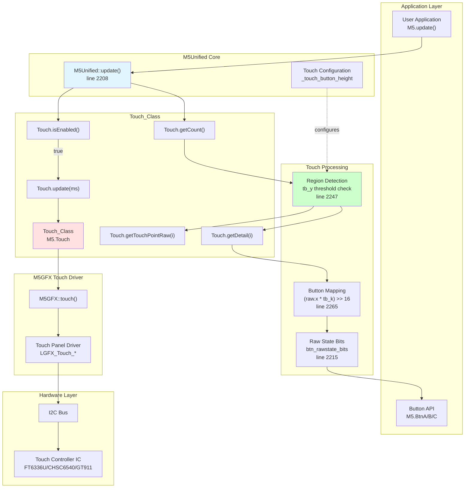
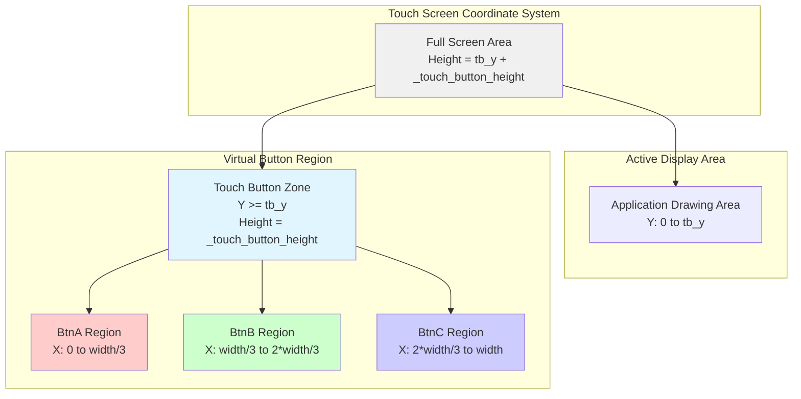
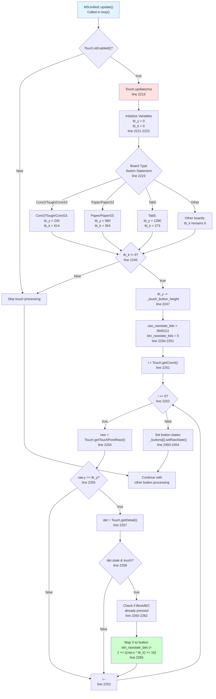
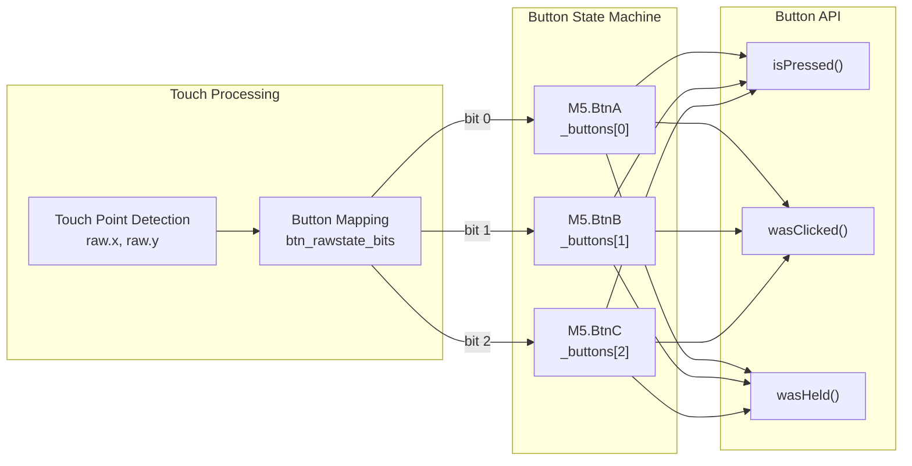
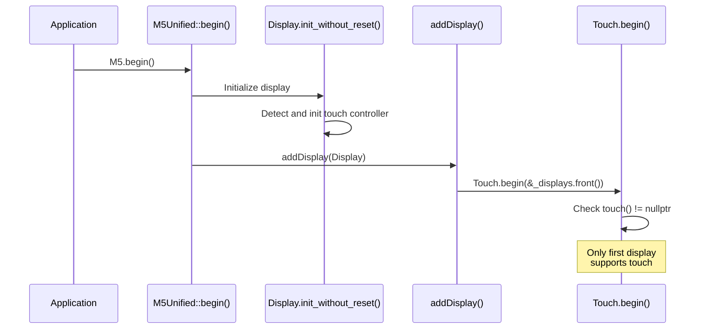

M5Unified Touch Interface

# Touch Interface

<details>
<summary>Relevant source files</summary>

The following files were used as context for generating this wiki page:

- [src/M5Unified.cpp](src/M5Unified.cpp)
- [src/M5Unified.hpp](src/M5Unified.hpp)

</details>


## Purpose and Scope

This document describes the Touch Interface subsystem in M5Unified, which provides capacitive touch screen support and virtual touch button functionality. The Touch Interface detects touch input from hardware touch controllers and converts touch coordinates into button press events for devices with touch screens.

For information about physical hardware buttons, see [Button Interface](#6.1). For display management, see [Display Management](#3.4).

---

## Overview

The Touch Interface serves two primary functions:

1. **Hardware Touch Detection**: Reads capacitive touch input from touch controllers (FT6336U, CHSC6540, GT911) via I2C
2. **Virtual Touch Buttons**: Maps the bottom portion of the touch screen to three virtual buttons (BtnA, BtnB, BtnC)

The touch system is integrated into the M5Unified update loop and automatically converts touch coordinates into button states that applications can query using the standard Button API.

**Supported Boards with Touch Screens:**
- M5Stack Core2
- M5Stack Tough
- M5Stack CoreS3 / CoreS3 SE
- M5Paper / M5Paper S3
- M5Tab5

Sources: [src/M5Unified.hpp:222](), [src/M5Unified.cpp:2217-2270]()

---

## Touch System Architecture



Sources: [src/M5Unified.cpp:2208-2474](), [src/M5Unified.hpp:222]()

---

## Touch Controller Hardware

Touch input is managed by the M5GFX library's touch panel drivers, which communicate with physical touch controller ICs over I2C. M5Unified leverages this infrastructure and adds virtual button mapping.

### Supported Touch Controllers

| Controller | I2C Address | Boards |
|------------|-------------|--------|
| FT6336U    | 0x38        | Core2, Tough |
| CHSC6540   | 0x2E        | CoreS3, CoreS3SE |
| GT911      | 0x14 or 0x5D | Paper, Paper S3, Tab5 |

Touch controllers are automatically detected and initialized by M5GFX during `Display.init_without_reset()`. The `Touch_Class` instance (`M5.Touch`) wraps the M5GFX touch interface and is initialized in `begin()` via:

```cpp
Touch.begin(_displays.front().touch() ? &_displays.front() : nullptr);
```

Sources: [src/M5Unified.cpp:2512](), Diagram 4 from system overview

---

## Virtual Touch Button Regions

On touch-enabled devices, the bottom portion of the screen is divided into three equal-width regions that function as virtual buttons BtnA, BtnB, and BtnC.



### Board-Specific Configurations

The touch button region height and scaling factors are configured per board:

| Board | Screen Height | tb_y Calculation | tb_k (scale factor) |
|-------|---------------|------------------|---------------------|
| Core2 / Tough / CoreS3 / CoreS3SE | 240 pixels | `240 - _touch_button_height` | 614 (65536*3/320) |
| Paper / PaperS3 | 960 pixels | `960 - _touch_button_height` | 364 (65536*3/540) |
| Tab5 | 1280 pixels | `1280 - _touch_button_height` | 273 (65536*3/720) |

The `tb_k` value is used to map X coordinates to button indices:
```cpp
btn_rawstate_bits |= 1 << ((raw.x * tb_k) >> 16);
```

This calculation divides the screen width into three zones (0, 1, 2) corresponding to BtnA, BtnB, and BtnC.

Sources: [src/M5Unified.cpp:2221-2243](), [src/M5Unified.cpp:2265]()

---

## Touch Processing Flow



Sources: [src/M5Unified.cpp:2208-2474]()

---

## Touch State Detection

Touch states are managed by the M5GFX touch driver and exposed through `Touch_Class` methods:

### Touch State Enumeration

The touch state is defined by M5GFX's `touch_state_t` flags:
- `touch`: Touch is currently detected
- `mask_moving`: Touch point is moving (used to prevent accidental button activation during dragging)

### Multi-Touch Support

The system supports multiple simultaneous touch points:
- `Touch.getCount()` returns the number of active touch points
- Each touch point is queried individually in a loop (lines 2252-2269)
- Only the first touch point in the button region triggers button events

### Button State Persistence

Once a button is pressed during touch, it remains pressed even if the touch moves:
```cpp
if (BtnA.isPressed()) { btn_rawstate_bits |= 1 << 0; }
if (BtnB.isPressed()) { btn_rawstate_bits |= 1 << 1; }
if (BtnC.isPressed()) { btn_rawstate_bits |= 1 << 2; }
if (btn_rawstate_bits || !(det.state & touch_state_t::mask_moving))
{
  btn_rawstate_bits |= 1 << ((raw.x * tb_k) >> 16);
}
```

This logic (lines 2260-2266) ensures that:
1. Previously pressed buttons remain active
2. New button presses are only registered if no movement is detected
3. Touch gestures don't accidentally trigger button clicks

Sources: [src/M5Unified.cpp:2258-2266]()

---

## Configuration and Customization

### Setting Touch Button Height

Applications can customize the height of the virtual button region:

**By Ratio (0-255):**
```cpp
M5.setTouchButtonHeightByRatio(ratio);
```
Calculates height as: `height = screen_height * ratio / 255`

**By Pixel Count:**
```cpp
M5.setTouchButtonHeight(pixel_height);
```

**Query Current Height:**
```cpp
uint16_t height = M5.getTouchButtonHeight();
```

### Default Behavior

If `_touch_button_height` is not explicitly set (default value is 0), the touch button region uses the full height below `tb_y`, effectively disabling a separate button zone and using the entire screen for button detection.

Sources: [src/M5Unified.hpp:599-601](), [src/M5Unified.cpp:2476-2498]()

---

## Integration with Button System

Virtual touch buttons are mapped to the same `Button_Class` instances as physical buttons:



The `setRawState()` method is called for buttons 0-2 when `use_rawstate_bits` indicates touch buttons are active:
```cpp
for (int i = 0; i < 5; ++i) {
  if (use_rawstate_bits & (1 << i)) {
    _buttons[i].setRawState(ms, btn_rawstate_bits & (1 << i));
  }
}
```

This unified approach means touch buttons support all Button_Class features:
- Click detection (single, double, multi-click)
- Hold detection
- Press/release timing
- Debouncing

Sources: [src/M5Unified.cpp:2449-2455](), [src/M5Unified.hpp:238-242]()

---

## Board-Specific Touch Initialization

Touch initialization occurs during `M5Unified::begin()` when displays are registered:



Key points:
1. Touch controllers are initialized by M5GFX during display initialization
2. Only the first display in the `_displays` vector can have touch support
3. `Touch.begin()` is called with `nullptr` if no touch is available
4. The touch button height defaults to 0 and can be configured after `begin()`

Sources: [src/M5Unified.cpp:2512](), [src/M5Unified.hpp:332-597]()

---

## Example Usage

### Basic Touch Button Detection
```cpp
void setup() {
  M5.begin();
  M5.setTouchButtonHeightByRatio(32); // 12.5% of screen height
}

void loop() {
  M5.update();
  
  if (M5.BtnA.wasClicked()) {
    Serial.println("Left button clicked");
  }
  if (M5.BtnB.wasClicked()) {
    Serial.println("Middle button clicked");
  }
  if (M5.BtnC.wasClicked()) {
    Serial.println("Right button clicked");
  }
}
```

### Direct Touch Point Access
```cpp
void loop() {
  M5.update();
  
  if (M5.Touch.isEnabled()) {
    int count = M5.Touch.getCount();
    for (int i = 0; i < count; i++) {
      auto point = M5.Touch.getTouchPointRaw(i);
      Serial.printf("Touch %d: X=%d Y=%d\n", i, point.x, point.y);
    }
  }
}
```

Sources: Application pattern based on [src/M5Unified.cpp:2208-2474]()

---

## Summary

The Touch Interface provides seamless integration between hardware touch controllers and the M5Unified button system. Key features include:

- Automatic touch controller detection via M5GFX
- Virtual button mapping with configurable height
- Multi-touch point tracking
- Integration with standard Button_Class API
- Board-specific optimizations for different screen sizes

The system abstracts hardware differences and provides a consistent API across all touch-enabled M5Stack devices, allowing applications to use the same button-handling code regardless of whether the input comes from physical buttons or touch regions.

Sources: [src/M5Unified.cpp:2208-2474](), [src/M5Unified.hpp:222](), [src/M5Unified.hpp:599-601]()