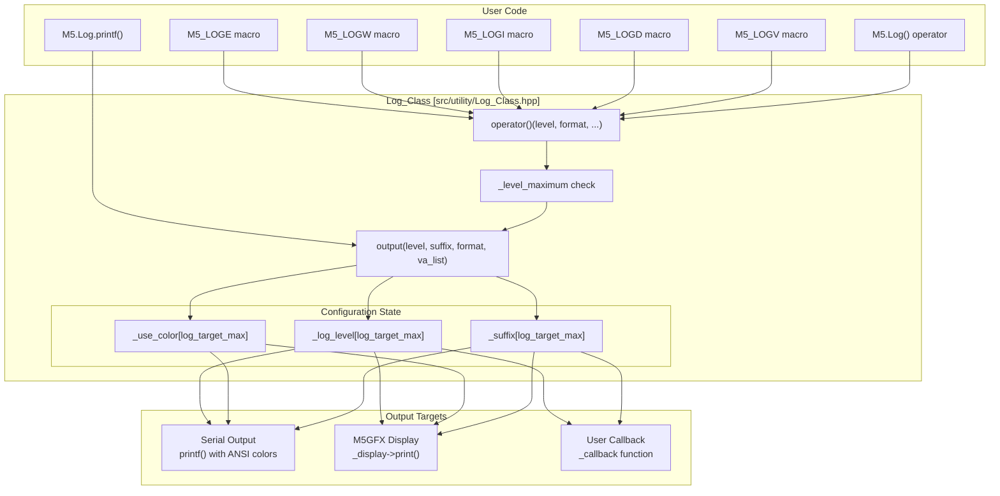
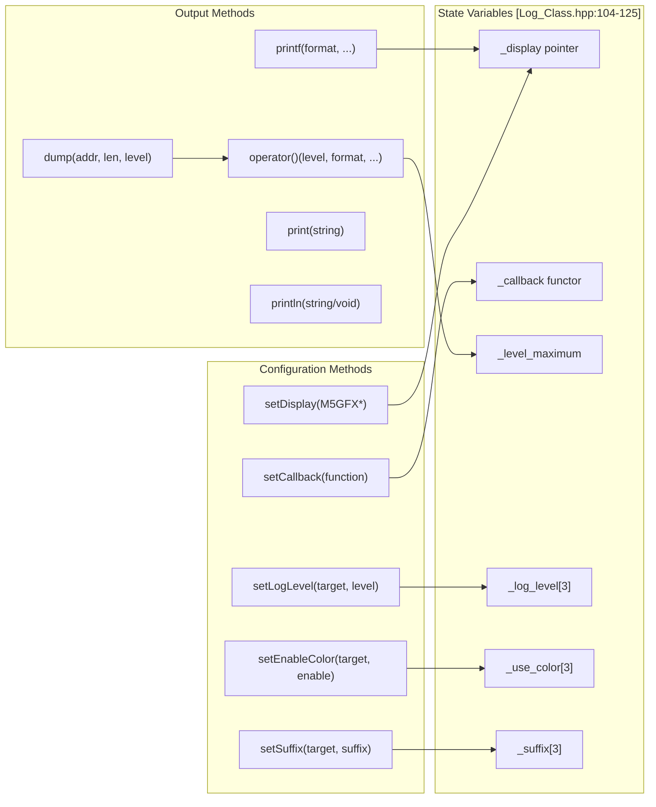
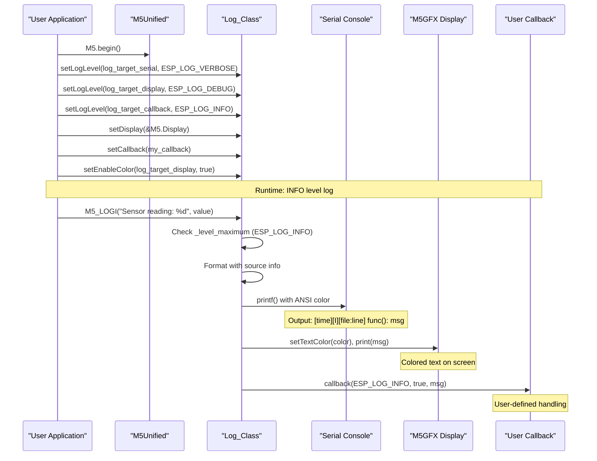
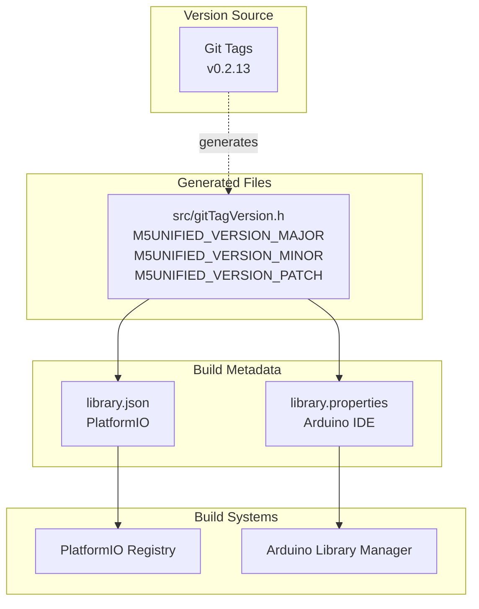
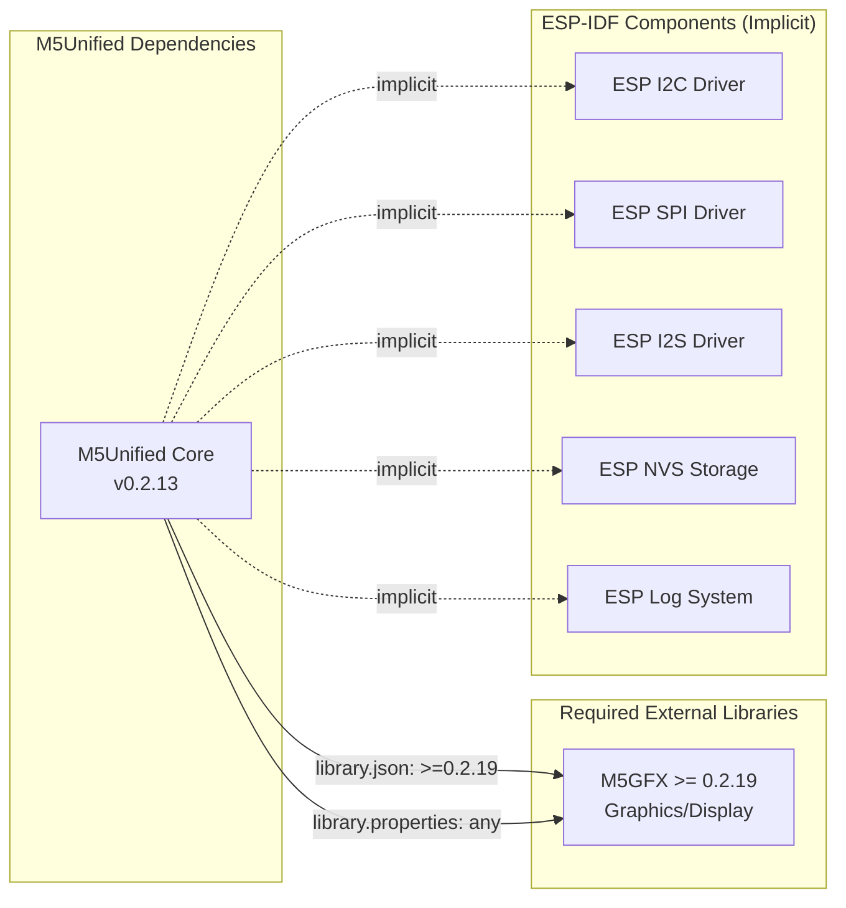

M5Unified Utility Systems

# Utility Systems

<details>
<summary>Relevant source files</summary>

The following files were used as context for generating this wiki page:

- [examples/Basic/LogOutput/LogOutput.ino](examples/Basic/LogOutput/LogOutput.ino)
- [library.json](library.json)
- [library.properties](library.properties)
- [src/gitTagVersion.h](src/gitTagVersion.h)
- [src/utility/Log_Class.cpp](src/utility/Log_Class.cpp)
- [src/utility/Log_Class.hpp](src/utility/Log_Class.hpp)

</details>


The Utility Systems provide supporting infrastructure for M5Unified that is not directly related to hardware control. This page documents the logging system and library metadata management. For hardware-specific utilities like power management, see [Power Management System](#3). For communication interfaces, see [Communication Interfaces](#7).

This page covers:
- **Log_Class**: Multi-target logging infrastructure with configurable output destinations
- **Library Metadata**: Version management and dependency declarations for build systems

---

## Logging System Architecture

The `Log_Class` provides a unified logging interface that can simultaneously output to multiple destinations: serial console, display hardware, and user-defined callbacks. The system is implemented in [src/utility/Log_Class.hpp:1-129]() and [src/utility/Log_Class.cpp:1-165]().

### Multi-Target Output Architecture



**Sources**: [src/utility/Log_Class.hpp:40-128](), [src/utility/Log_Class.cpp:37-124]()

The logging architecture routes log messages to three independent output targets, each with configurable log levels, color settings, and line terminators. The `log_target_t` enumeration defines these targets at [src/utility/Log_Class.hpp:40-46]():

| Target | Purpose | Default Level | Notes |
|--------|---------|---------------|-------|
| `log_target_serial` | USB serial console | `CORE_DEBUG_LEVEL` or `CONFIG_LOG_DEFAULT_LEVEL` | Uses ANSI color codes |
| `log_target_display` | M5GFX display output | `CORE_DEBUG_LEVEL` or `CONFIG_LOG_DEFAULT_LEVEL` | Uses RGB332 colors |
| `log_target_callback` | User-defined function | `CORE_DEBUG_LEVEL` or `CONFIG_LOG_DEFAULT_LEVEL` | Custom routing |

### Log Levels and Macros

The system supports standard ESP-IDF log levels, from most to least critical:

| Level | Macro | Purpose | Source Line |
|-------|-------|---------|-------------|
| `ESP_LOG_ERROR` | `M5_LOGE` | Critical errors requiring attention | [src/utility/Log_Class.hpp:24]() |
| `ESP_LOG_WARN` | `M5_LOGW` | Recoverable error conditions | [src/utility/Log_Class.hpp:27]() |
| `ESP_LOG_INFO` | `M5_LOGI` | Normal operational messages | [src/utility/Log_Class.hpp:30]() |
| `ESP_LOG_DEBUG` | `M5_LOGD` | Development debugging information | [src/utility/Log_Class.hpp:33]() |
| `ESP_LOG_VERBOSE` | `M5_LOGV` | Detailed diagnostic output | [src/utility/Log_Class.hpp:36]() |

The `M5_LOGx` macros automatically inject source file, line number, and function name into the log message using the `M5UNIFIED_LOG_FORMAT` macro defined at [src/utility/Log_Class.hpp:19-21](). The format string expands to:
```
"[%6u][X][%s:%u] %s(): <user_format>"
```
where `X` is the log level letter (E/W/I/D/V).

**Sources**: [src/utility/Log_Class.hpp:19-36](), [examples/Basic/LogOutput/LogOutput.ino:62-67]()

### Log_Class Interface and Configuration



**Sources**: [src/utility/Log_Class.hpp:48-102]()

The `Log_Class` provides several configuration points:

1. **Per-target log levels**: Each output target can filter logs independently using `setLogLevel()` [src/utility/Log_Class.hpp:77]()
2. **Color control**: Enable/disable colored output per target with `setEnableColor()` [src/utility/Log_Class.hpp:71]()
3. **Line terminators**: Customize suffix strings (default `"\n"`) with `setSuffix()` [src/utility/Log_Class.hpp:83]()
4. **Display binding**: Route logs to an M5GFX display instance with `setDisplay()` [src/utility/Log_Class.hpp:91-95]()
5. **Custom callbacks**: Register a functor for custom log routing with `setCallback()` [src/utility/Log_Class.hpp:87]()

The callback signature is defined at [src/utility/Log_Class.hpp:112]():
```cpp
std::function<void(esp_log_level_t log_level, bool use_color, const char* log_text)>
```

**Sources**: [src/utility/Log_Class.hpp:71-95](), [examples/Basic/LogOutput/LogOutput.ino:36-53]()

### Output Implementation Details

The core output logic is implemented in `Log_Class::output()` at [src/utility/Log_Class.cpp:59-124](). The method performs these steps:

1. **Buffer allocation**: Stack allocates 64 bytes, heap allocates if format expansion exceeds this [src/utility/Log_Class.cpp:61-76]()
2. **Format expansion**: Uses `vsnprintf()` to expand variadic arguments
3. **Serial output**: Writes to `printf()` with ANSI escape codes for color [src/utility/Log_Class.cpp:78-94]()
4. **Display output**: Calls `_display->print()` with RGB332 color codes [src/utility/Log_Class.cpp:96-117]()
5. **Callback invocation**: Calls user functor if registered [src/utility/Log_Class.cpp:119-123]()

The color lookup tables are defined at [src/utility/Log_Class.cpp:10-14]():
- Serial colors: ANSI codes `[38,31,33,32,36,37]` for dark terminals
- Display colors: RGB332 values `[0xFF,0xE0,0xFC,0x18,0x1F,0x92]` mapping to white/red/magenta/yellow/cyan/blue

**Sources**: [src/utility/Log_Class.cpp:10-124]()

### Memory Dump Utility

The `dump()` method provides hexadecimal memory inspection at [src/utility/Log_Class.cpp:131-163](). It formats memory as:
```
0x<address>| <4 words in hex> | <4 words as ASCII>
```

The method:
- Aligns addresses to 4-byte boundaries
- Displays up to 4 32-bit words per line
- Shows unprintable characters as spaces
- Uses the configured log level for filtering

**Sources**: [src/utility/Log_Class.cpp:131-163]()

### Usage Example Flow



**Sources**: [examples/Basic/LogOutput/LogOutput.ino:36-71]()

---

## Library Versioning and Metadata

M5Unified maintains metadata files for integration with Arduino IDE and PlatformIO build systems. Version information is centralized and synchronized across multiple files.

### Version Number Definition

The canonical version is defined in [src/gitTagVersion.h:1-5]():

```
M5UNIFIED_VERSION_MAJOR = 0
M5UNIFIED_VERSION_MINOR = 2
M5UNIFIED_VERSION_PATCH = 13
M5UNIFIED_VERSION = "0.2.13" (as F-string macro)
```

This file is the single source of truth, automatically generated from git tags during the build process. The version follows semantic versioning: `MAJOR.MINOR.PATCH`.

**Sources**: [src/gitTagVersion.h:1-5]()

### Build System Metadata Files



**Sources**: [library.json:1-23](), [library.properties:1-12](), [src/gitTagVersion.h:1-5]()

### PlatformIO Metadata (library.json)

The [library.json:1-23]() file provides metadata for PlatformIO:

| Field | Value | Purpose |
|-------|-------|---------|
| `name` | `"M5Unified"` | Package identifier |
| `version` | `"0.2.13"` | Semantic version string |
| `description` | Board listing | Search keywords and library manager description |
| `keywords` | `"M5Unified"` | Search tags |
| `authors.name` | `"M5Stack, lovyan03"` | Maintainer information |
| `repository.url` | GitHub URL | Source code location |
| `dependencies` | M5GFX >= 0.2.19 | Required libraries |
| `frameworks` | `["arduino", "espidf", "*"]` | Compatible build environments |
| `platforms` | `["espressif32", "native"]` | Target hardware platforms |
| `headers` | `"M5Unified.h"` | Main include file |

The `dependencies` array at [library.json:13-18]() ensures M5GFX version compatibility. The minimum required M5GFX version is 0.2.19.

**Sources**: [library.json:1-23]()

### Arduino IDE Metadata (library.properties)

The [library.properties:1-12]() file follows the Arduino library specification:

| Field | Value | Purpose |
|-------|-------|---------|
| `name` | `M5Unified` | Library name in Library Manager |
| `version` | `0.2.13` | Version for dependency resolution |
| `author` | `M5Stack` | Primary author |
| `maintainer` | `M5Stack` | Current maintainer contact |
| `sentence` | Board listing | Short description (< 80 chars) |
| `paragraph` | Extended description | Long description for Library Manager |
| `category` | `Display` | Library Manager category |
| `url` | GitHub URL | Project homepage |
| `architectures` | `esp32` | Restrict to ESP32 targets |
| `includes` | `M5Unified.h` | Header for compilation detection |
| `depends` | `M5GFX` | Required library (no version constraint) |

Note that Arduino's `depends` field at [library.properties:11]() does not support version specifications like PlatformIO's format.

**Sources**: [library.properties:1-12]()

### Dependency Declaration Strategy

M5Unified declares a single external dependency on M5GFX, the graphics library providing display drivers and rendering primitives. The dependency is specified differently per build system:



**Sources**: [library.json:13-18](), [library.properties:11]()

ESP-IDF component dependencies (I2C, SPI, I2S, NVS, logging) are implicit and managed by the ESP32 Arduino core or ESP-IDF build system. They are not declared in the library metadata because they are always present in ESP32 environments.

**Sources**: [library.json:20](), [library.properties:9]()