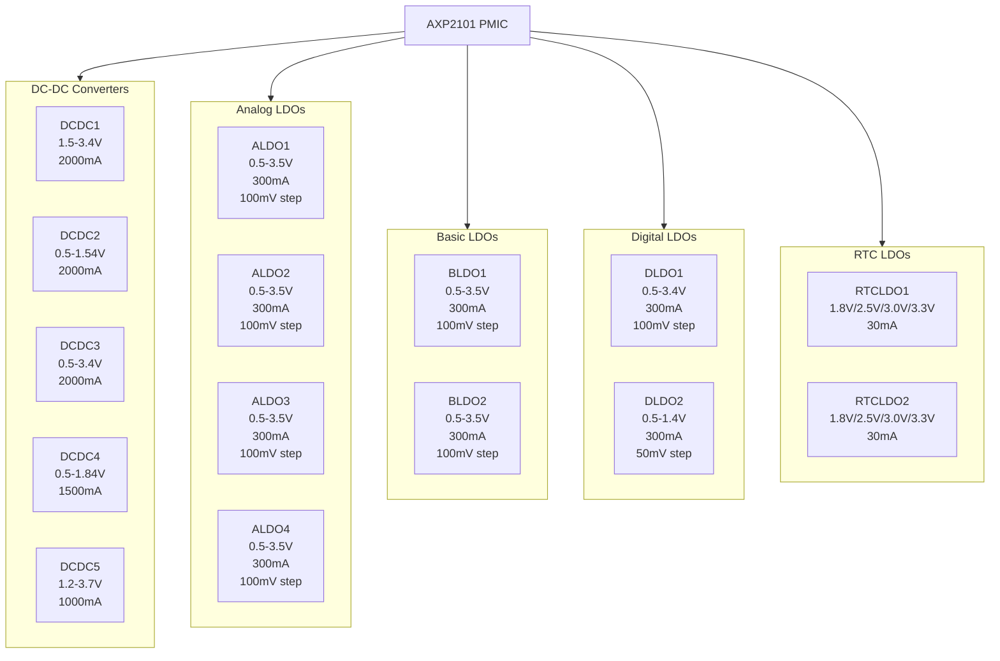
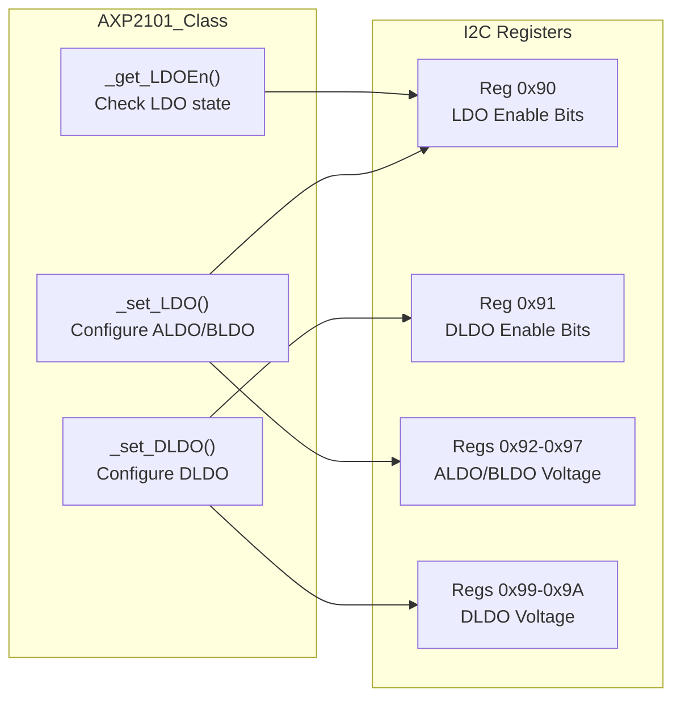
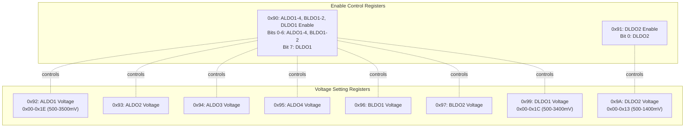
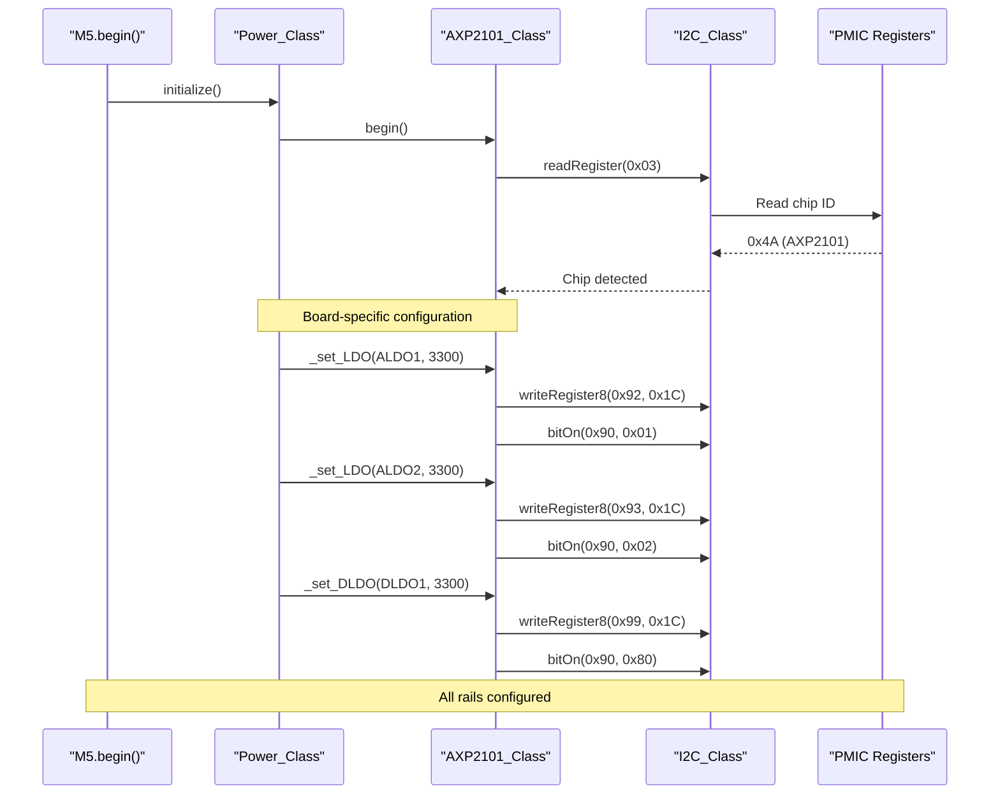

M5Unified Voltage Rails and PMIC Configuration

# Voltage Rails and LDO Configuration

<details>
<summary>Relevant source files</summary>

The following files were used as context for generating this wiki page:

- [README.md](README.md)
- [examples/Basic/HowToUse/HowToUse.ino](examples/Basic/HowToUse/HowToUse.ino)
- [src/utility/Power_Class.cpp](src/utility/Power_Class.cpp)
- [src/utility/Power_Class.hpp](src/utility/Power_Class.hpp)

</details>


This document describes the configuration of voltage rails and Low Dropout (LDO) regulators available on Power Management ICs (PMICs) used in M5Stack devices. These rails provide regulated power to various peripherals such as displays, sensors, audio codecs, and expansion ports.

For information about PMIC detection and initialization, see [Power Initialization and PMIC Detection](#4.1). For controlling external port power (5V output), see [External Power Control](#4.4).

## Overview

M5Stack devices use PMICs with multiple configurable voltage rails to power different subsystems. The primary PMICs are:

- **AXP192**: Used in M5Stack Core2, M5Tough, M5StickC, M5Station
- **AXP2101**: Used in M5Stack Core2 v1.1 and CoreS3
- **IP5306**: Used in M5Stack Basic/Gray/Go/Fire (limited rail configuration)

Each PMIC provides several types of voltage regulators:

| Regulator Type | Description | Typical Use Case |
|----------------|-------------|------------------|
| **DCDC** | DC-DC switching converters | High-current loads (displays, ESP32 core) |
| **ALDO** | Analog LDOs | Sensors, analog circuits, low-noise applications |
| **BLDO** | Basic LDOs | General-purpose peripheral power |
| **DLDO** | Digital LDOs | Digital peripherals, I/O expansion |
| **RTCLDO** | RTC domain LDOs | Real-time clock backup power |

**Sources:** [src/utility/power/AXP2101_Class.cpp:16-26]()

## AXP2101 Voltage Rail Specifications

The AXP2101 PMIC provides the following voltage rails:



### Detailed Specifications

**DC-DC Converters (High Current):**
- `DCDC1`: 1.5-3.4V, 2000mA max
- `DCDC2`: 0.5-1.2V, 1.22-1.54V, 2000mA max
- `DCDC3`: 0.5-1.2V, 1.22-1.54V, 1.6-3.4V, 2000mA max
- `DCDC4`: 0.5-1.2V, 1.22-1.84V, 1500mA max
- `DCDC5`: 1.2V, 1.4-3.7V, 1000mA max

**LDO Regulators (Lower Current, Cleaner Power):**
- `ALDO1-4`: 0.5-3.5V, 300mA max, 100mV step size
- `BLDO1-2`: 0.5-3.5V, 300mA max, 100mV step size
- `DLDO1`: 0.5-3.4V, 300mA max, 100mV step size
- `DLDO2`: 0.5-1.4V, 300mA max, 50mV step size
- `RTCLDO1/2`: Fixed voltages (1.8V/2.5V/3.0V/3.3V), 30mA max

**Sources:** [src/utility/power/AXP2101_Class.cpp:16-26]()

## LDO Configuration Functions

### AXP2101 LDO Control

The `AXP2101_Class` provides internal methods for configuring voltage rails:



### ALDO/BLDO Configuration

The `_set_LDO()` function configures ALDO (0-3) and BLDO (4-5) regulators:

```cpp
// num: 0=ALDO1, 1=ALDO2, 2=ALDO3, 3=ALDO4, 4=BLDO1, 5=BLDO2
// voltage: desired voltage in mV (500-3500mV), or negative to disable
void AXP2101_Class::_set_LDO(std::uint8_t num, int voltage)
```

**Implementation details:**
1. Voltage register address: `0x92 + num`
2. Voltage calculation: `(voltage - 500mV) / 100mV`
3. Range: 0x00 (500mV) to 0x1E (3500mV)
4. Enable/disable via register `0x90` bit mask

**Sources:** [src/utility/power/AXP2101_Class.cpp:42-60]()

### DLDO Configuration

The `_set_DLDO()` function configures DLDO1 and DLDO2 regulators:

```cpp
// num: 0=DLDO1, 1=DLDO2
// voltage: desired voltage in mV, or negative to disable
void AXP2101_Class::_set_DLDO(std::uint8_t num, int voltage)
```

**Implementation details:**
1. Voltage register address: `0x99 + num`
2. DLDO1 step: 100mV (range: 500-3400mV)
3. DLDO2 step: 50mV (range: 500-1400mV)
4. DLDO1 enable: register `0x90` bit 7
5. DLDO2 enable: register `0x91` bit 0

**Sources:** [src/utility/power/AXP2101_Class.cpp:62-82]()

### LDO Enable Status

The `_get_LDOEn()` function checks if an LDO is enabled:

```cpp
// num: 0-5 for ALDO1-4, BLDO1-2
// returns: true if enabled, false if disabled
bool AXP2101_Class::_get_LDOEn(std::uint8_t num)
```

**Sources:** [src/utility/power/AXP2101_Class.cpp:84-92]()

## Register Mapping

### AXP2101 Voltage Configuration Registers



### Voltage Encoding

| LDO Type | Formula | Step Size | Range |
|----------|---------|-----------|-------|
| ALDO1-4 | `value = (voltage_mV - 500) / 100` | 100mV | 500-3500mV |
| BLDO1-2 | `value = (voltage_mV - 500) / 100` | 100mV | 500-3500mV |
| DLDO1 | `value = (voltage_mV - 500) / 100` | 100mV | 500-3400mV |
| DLDO2 | `value = (voltage_mV - 500) / 50` | 50mV | 500-1400mV |

**Sources:** [src/utility/power/AXP2101_Class.cpp:42-82]()

## Board-Specific Rail Usage

Different M5Stack boards use voltage rails for different purposes. Below are typical configurations:

### CoreS3 (AXP2101)

| Rail | Voltage | Purpose |
|------|---------|---------|
| DCDC1 | 3.3V | Main 3.3V rail for ESP32-S3 |
| DCDC3 | 1.2V | ESP32-S3 core voltage |
| ALDO1 | 3.3V | Display backlight control |
| ALDO2 | 3.3V | Audio codec power |
| ALDO3 | 3.3V | Sensor power |
| ALDO4 | 3.3V | External expansion (Port A) |
| BLDO1 | 3.3V | Touch panel power |
| DLDO1 | 3.3V | Camera/peripheral power |

### Core2 v1.1 (AXP2101)

| Rail | Voltage | Purpose |
|------|---------|---------|
| DCDC1 | 3.3V | Main 3.3V rail |
| ALDO1 | 3.3V | Display power |
| ALDO2 | 3.3V | Audio codec |
| ALDO3 | 3.3V | Touch controller |
| ALDO4 | 3.3V | External port power |

**Note:** These are typical configurations. Actual rail assignments may vary by board revision. The M5Unified library handles board-specific configurations automatically during initialization.

**Sources:** Architecture diagrams, [src/utility/power/AXP2101_Class.cpp:16-26]()

## Configuration Flow

The voltage rail configuration follows this sequence during board initialization:



### Configuration Steps

1. **PMIC Detection**: Read chip ID register (0x03) to identify PMIC type
2. **Board Detection**: Determine board type and required rail configuration
3. **Rail Setup**: Configure each required voltage rail:
   - Calculate register value from desired voltage
   - Write voltage setting to appropriate register
   - Enable the rail via enable register
4. **Verification**: Optionally read back settings to verify

**Sources:** [src/utility/power/AXP2101_Class.cpp:27-39](), [src/utility/power/AXP2101_Class.cpp:42-82]()

## Safety Considerations

### Over-Current Protection

The AXP2101 provides over-current protection for LDO outputs. If an over-current condition is detected, an interrupt can be generated:

```cpp
// Enable LDO over-current interrupt
enableIRQ(AXP2101_IRQ_LDO_OVER_CURR);

// Check for over-current condition
if (isLdoOverCurrentIrq()) {
    // Handle over-current condition
    clearIRQStatuses();
}
```

**Sources:** [src/utility/power/AXP2101_Class.cpp:495-503]()

### Voltage Range Limits

Always ensure voltage settings are within the specified ranges:

- **Minimum voltage**: 500mV (0.5V) for most rails
- **Maximum voltage**: Varies by rail type (3.4V-3.5V typically)
- **Out-of-range values**: Automatically clamped to valid range

```cpp
// Example: Setting ALDO1 voltage
// Values < 500mV set to 0 (disabled)
// Values > 3500mV clamped to 3500mV
_set_LDO(0, 3300);  // ALDO1 to 3.3V - valid
_set_LDO(0, 4000);  // Clamped to 3500mV
_set_LDO(0, -1);    // Disabled
```

**Sources:** [src/utility/power/AXP2101_Class.cpp:42-60]()

### Current Limits

Each rail has a maximum current capacity. Exceeding this may cause:
- Voltage sag under load
- PMIC thermal shutdown
- Over-current protection activation

| Rail Type | Max Current | Typical Use Case |
|-----------|-------------|------------------|
| DCDC1-3 | 2000mA | High-power peripherals, ESP32 |
| DCDC4 | 1500mA | Medium-power loads |
| DCDC5 | 1000mA | Moderate loads |
| ALDO/BLDO/DLDO | 300mA | Low-power peripherals, sensors |
| RTCLDO | 30mA | RTC backup only |

**Sources:** [src/utility/power/AXP2101_Class.cpp:16-26]()

## API Access

The voltage rail configuration functions in `AXP2101_Class` are internal (prefixed with `_`) and not exposed directly through the public `Power_Class` API. Board-specific rail configurations are applied automatically during `M5.begin()`.

For custom applications requiring manual rail control, you would need to:
1. Access the PMIC instance through `Power_Class`
2. Cast to the appropriate PMIC class (`AXP2101_Class`)
3. Call the internal configuration methods

However, this approach is not recommended as it bypasses the board-specific safety configurations. The automatic configuration during initialization is designed to match each board's specific hardware requirements.

**Sources:** [src/utility/power/AXP2101_Class.cpp:42-92]()