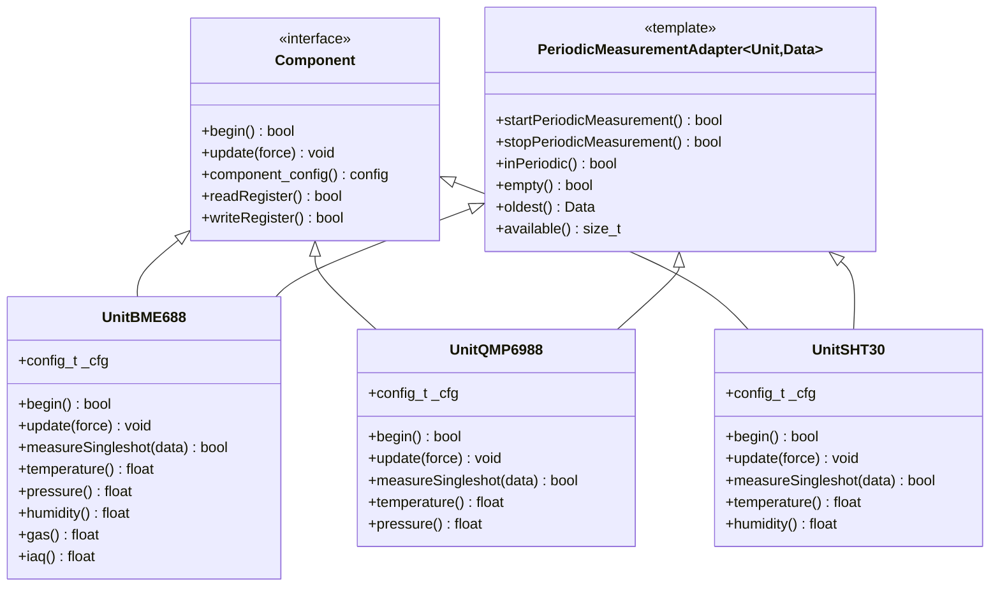
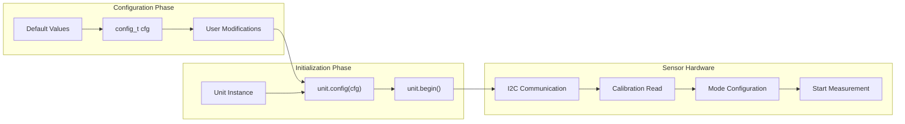
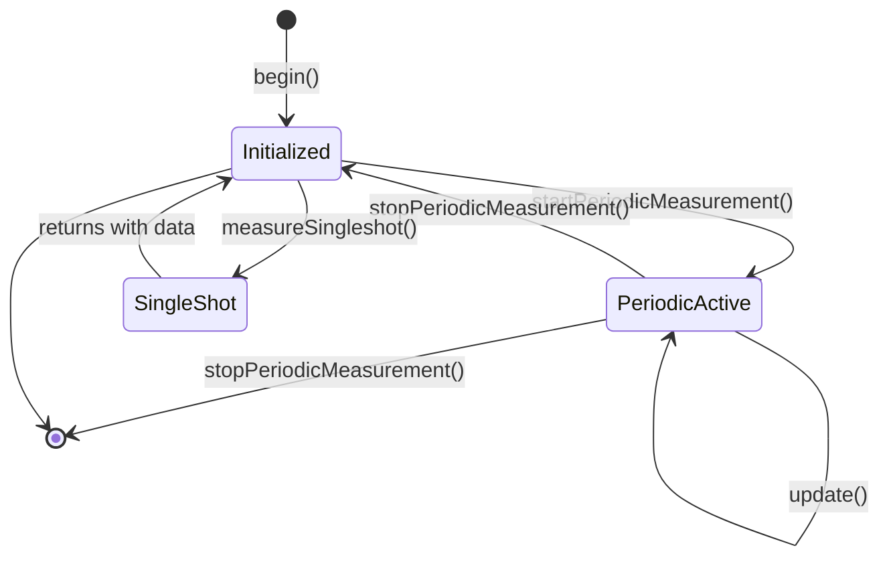
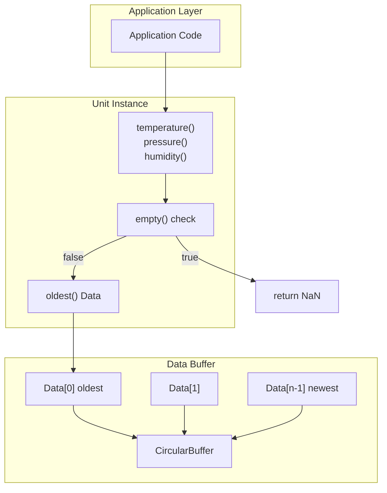
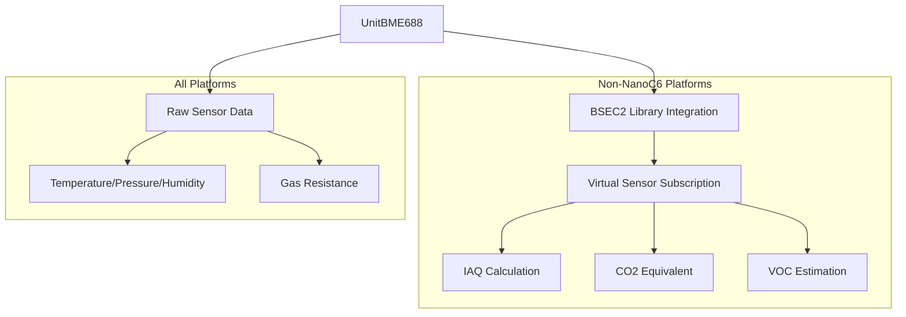

M5Unit-ENV API Reference

# API Reference

<details>
<summary>Relevant source files</summary>

The following files were used as context for generating this wiki page:

- [README.md](README.md)
- [library.json](library.json)
- [library.properties](library.properties)
- [src/unit/unit_BME688.cpp](src/unit/unit_BME688.cpp)
- [src/unit/unit_BME688.hpp](src/unit/unit_BME688.hpp)
- [src/unit/unit_QMP6988.cpp](src/unit/unit_QMP6988.cpp)
- [src/unit/unit_QMP6988.hpp](src/unit/unit_QMP6988.hpp)
- [src/unit/unit_SHT30.hpp](src/unit/unit_SHT30.hpp)

</details>


This document provides a high-level overview of the M5Unit-ENV API structure, common usage patterns shared across sensor units, and data access conventions. For detailed sensor-specific APIs including register-level operations and specialized features, see the individual sensor unit references ([BME688](#4.1), [SHT30](#4.2), [QMP6988](#4.3), [SCD40/SCD41](#4.4), [BMP280](#4.5), [SHT40](#4.6), [SGP30](#4.7), [ENV3](#4.8), [ENV4](#4.9)).

For architectural context explaining the dual-interface design philosophy, see [Architecture Overview](#3).

---

## Library Entry Points

The library exposes two mutually exclusive entry point headers that provide different levels of integration:

| Header File | Purpose | Dependencies | Target Use Case |
|-------------|---------|--------------|-----------------|
| `M5UnitENV.h` | Conventional interface | Adafruit, Sensirion libraries | Standalone sensor usage, Arduino IDE users |
| `M5UnitUnifiedENV.h` | Unified framework interface | M5UnitUnified, M5HAL, M5Utility | Multi-unit applications, M5Stack ecosystem integration |

**Important:** These headers are mutually exclusive and should not be included simultaneously in the same compilation unit.

```cpp
// Option 1: Conventional approach
#include <M5UnitENV.h>

// Option 2: Unified approach (do not mix with conventional)
#include <M5UnitUnifiedENV.h>
```

Sources: [library.properties:10](), [library.json:22-24](), [README.md:72-75]()

---

## Class Hierarchy and Component Architecture

All sensor unit classes follow a consistent inheritance pattern that provides standardized lifecycle management and measurement semantics:



**Key Architectural Points:**
- `Component` base class provides I2C communication primitives and lifecycle hooks
- `PeriodicMeasurementAdapter<Unit, Data>` template adds circular buffer storage and periodic measurement orchestration
- All concrete unit classes inherit from both interfaces
- Each unit defines a sensor-specific `Data` struct in its namespace (e.g., `bme688::Data`, `qmp6988::Data`)

Sources: [src/unit/unit_BME688.hpp:377](), [src/unit/unit_QMP6988.hpp:131](), [src/unit/unit_SHT30.hpp:111]()

---

## Initialization Pattern

### Configuration Structure

Every unit class exposes a `config_t` nested struct that encapsulates all initialization parameters:



**Common `config_t` Fields:**

| Field | Type | Purpose | Found In |
|-------|------|---------|----------|
| `start_periodic` | `bool` | Whether to begin periodic measurements automatically | All units |
| `osrs_pressure` | Enum | Oversampling setting for pressure | QMP6988, BMP280 |
| `osrs_temperature` | Enum | Oversampling setting for temperature | QMP6988, BMP280, BME688 |
| `mps` | `sht30::MPS` | Measurements per second | SHT30 |
| `repeatability` | `sht30::Repeatability` | Accuracy level | SHT30, SHT40 |
| `filter` | Enum | IIR filter coefficient | QMP6988, BMP280, BME688 |
| `subscribe_bits` | `uint32_t` | BSEC2 virtual sensor subscription | BME688 (non-NanoC6) |

### Initialization Sequence

```cpp
// 1. Construct with I2C address (uses default if omitted)
UnitQMP6988 qmp(0x70);

// 2. Optionally modify configuration before begin()
auto cfg = qmp.config();
cfg.start_periodic = true;
cfg.osrs_pressure = qmp6988::Oversampling::X16;
cfg.filter = qmp6988::Filter::Coeff8;
qmp.config(cfg);

// 3. Initialize hardware and start measurement if configured
if (!qmp.begin()) {
    // Handle initialization failure
}
```

**What `begin()` Does:**
1. Verifies I2C communication and chip ID
2. Reads factory calibration data from sensor
3. Soft resets the sensor
4. Applies `config_t` settings
5. Starts periodic measurement if `start_periodic == true`

Sources: [src/unit/unit_QMP6988.hpp:135-150](), [src/unit/unit_QMP6988.cpp:235-266](), [src/unit/unit_BME688.hpp:381-428](), [src/unit/unit_SHT30.hpp:115-128]()

---

## Measurement Patterns

The library supports two fundamental measurement modes with distinct APIs:



### Periodic Measurement Mode

Periodic mode runs continuous background measurements at a configured interval. Data accumulates in a circular buffer accessible through the `PeriodicMeasurementAdapter` interface.

**Start Periodic Measurement:**

```cpp
// Method signature varies by sensor capabilities
// QMP6988 example:
bool startPeriodicMeasurement(
    const qmp6988::Oversampling osrsPressure,
    const qmp6988::Oversampling osrsTemperature,
    const qmp6988::Filter filter,
    const qmp6988::Standby standbyTime
);

// SHT30 example:
bool startPeriodicMeasurement(
    const sht30::MPS measurementsPerSecond,
    const sht30::Repeatability repeatability
);

// BME688 with BSEC2 (non-NanoC6):
bool startPeriodicMeasurement(
    const uint32_t subscribeBits,
    const bme688::bsec2::SampleRate sampleRate
);
```

**Update Cycle:**

```cpp
void loop() {
    qmp.update();  // Checks if new data is ready based on interval
    
    if (qmp.updated()) {
        float temp = qmp.temperature();  // Access latest measurement
        float pres = qmp.pressure();
    }
}
```

**Stop Periodic Measurement:**

```cpp
bool stopPeriodicMeasurement();
```

Sources: [src/unit/unit_QMP6988.hpp:205-234](), [src/unit/unit_SHT30.hpp:182-202](), [src/unit/unit_BME688.hpp:699-746]()

### Single-Shot Measurement Mode

Single-shot mode performs one measurement on demand and blocks until data is available. It cannot be used while periodic measurement is active.

```cpp
// Method signature pattern:
bool measureSingleshot(
    SensorData& outputData,
    [optional parameters...]
);

// QMP6988 example:
qmp6988::Data data;
if (qmp.measureSingleshot(data, 
                          qmp6988::Oversampling::X16,
                          qmp6988::Oversampling::X2,
                          qmp6988::Filter::Coeff4)) {
    float temp = data.celsius();
    float pres = data.pressure();
}

// SHT30 example:
sht30::Data data;
if (sht30.measureSingleshot(data, 
                            sht30::Repeatability::High,
                            true /* clock stretching */)) {
    float temp = data.temperature();
    float hum = data.humidity();
}

// BME688 example:
bme688::bme68xData data;
if (bme688.measureSingleshot(data)) {
    float temp = data.temperature;
    float pres = data.pressure;
    float hum = data.humidity;
    float gas = data.gas_resistance;
}
```

**Constraints:**
- Returns error if `inPeriodic() == true`
- Blocks for measurement duration (varies by oversampling settings)
- May overwrite sensor configuration settings

Sources: [src/unit/unit_QMP6988.hpp:238-254](), [src/unit/unit_SHT30.hpp:204-218](), [src/unit/unit_BME688.hpp:749-759](), [src/unit/unit_BME688.cpp:696-724]()

---

## Data Access Patterns

### Direct Access from Unit Instance

For periodic measurements, the unit instance provides convenience methods that return the oldest buffered measurement:



**Common Accessor Pattern:**

```cpp
// All units follow this pattern for periodic measurements
inline float temperature() const {
    return !empty() ? oldest().temperature() : std::numeric_limits<float>::quiet_NaN();
}

inline float pressure() const {
    return !empty() ? oldest().pressure() : std::numeric_limits<float>::quiet_NaN();
}

inline float humidity() const {
    return !empty() ? oldest().humidity() : std::numeric_limits<float>::quiet_NaN();
}
```

**Units return `NaN` when:**
- No measurements have been taken yet (`empty() == true`)
- Periodic measurement has not been started
- Update cycle has not yet produced data

Sources: [src/unit/unit_QMP6988.hpp:180-202](), [src/unit/unit_SHT30.hpp:158-180](), [src/unit/unit_BME688.hpp:482-534]()

### Data Structures

Each sensor namespace defines a `Data` struct containing raw bytes and conversion methods:

```mermaid
classDiagram
    class "qmp6988::Data" {
        +array~uint8_t,6~ raw
        +Calibration* calib
        +temperature() float
        +celsius() float
        +fahrenheit() float
        +pressure() float
    }
    
    class "sht30::Data" {
        +array~uint8_t,6~ raw
        +temperature() float
        +celsius() float
        +fahrenheit() float
        +humidity() float
    }
    
    class "bme688::Data" {
        +bme68xData raw
        +bsecOutputs raw_outputs
        +temperature() float
        +pressure() float
        +humidity() float
        +gas() float
        +iaq() float
        +co2() float
        +voc() float
    }
```

**Data Struct Characteristics:**
- Stores raw sensor bytes in `raw` field (typically 6 bytes for temperature/humidity/pressure)
- Provides conversion methods that apply calibration and return physical units
- May contain pointer to calibration data (`const Calibration* calib`)
- BME688 includes both raw sensor data and BSEC2-processed outputs (when enabled)

Sources: [src/unit/unit_QMP6988.hpp:108-124](), [src/unit/unit_SHT30.hpp:89-104](), [src/unit/unit_BME688.hpp:252-368]()

### Circular Buffer Access

For advanced use cases requiring historical data, the `PeriodicMeasurementAdapter` provides buffer manipulation:

```cpp
// Check if buffer has data
if (!unit.empty()) {
    // Number of measurements in buffer
    size_t count = unit.available();
    
    // Access oldest measurement (FIFO)
    const auto& oldest = unit.oldest();
    
    // Access newest measurement (most recent)
    const auto& newest = unit.newest();
    
    // Discard oldest measurement
    unit.discard();
    
    // Clear all buffered data
    unit.clear();
}
```

The buffer size is controlled by `stored_size()` configuration and defaults to 1 for most units.

Sources: [src/unit/unit_BME688.cpp:169-179](), [src/unit/unit_QMP6988.cpp:236-245]()

---

## Common API Methods Reference

### Configuration and Settings

All sensor units expose read/write methods for runtime configuration:

| Method Pattern | Purpose | Example |
|----------------|---------|---------|
| `read{Setting}({output})` | Query current sensor configuration | `readOversampling(osrsP, osrsT)` |
| `write{Setting}({value})` | Modify sensor configuration | `writeOversampling(Oversampling::X16, Oversampling::X2)` |
| `writeMode(mode)` | Change power/measurement mode | `writeMode(PowerMode::Forced)` |
| `softReset()` | Software reset sensor | `qmp.softReset()` |

**Constraint:** Most write methods return `false` and log errors if called during active periodic measurement. Stop periodic measurement first with `stopPeriodicMeasurement()`.

Sources: [src/unit/unit_QMP6988.hpp:256-341](), [src/unit/unit_BME688.hpp:598-697]()

### Status and Diagnostics

```cpp
// Check if periodic measurement is running
bool inPeriodic() const;

// Check if update() produced new data
bool updated() const;

// Get timestamp of last measurement
elapsed_time_t lastUpdate() const;

// Sensor-specific: read status register (e.g., SHT30)
sht30::Status status;
if (sht30.readStatus(status)) {
    if (status.reset()) { /* handle reset event */ }
    if (status.heater()) { /* heater is active */ }
}
```

Sources: [src/unit/unit_SHT30.hpp:261-275](), [src/unit/unit_QMP6988.cpp:267-285]()

---

## Sensor-Specific API Extensions

While the patterns above apply universally, each sensor provides specialized APIs for unique features:

### BME688 (ENVPro) - Air Quality Algorithms

The BME688 has dual measurement paths depending on platform:



**BSEC2-specific methods (excluded on NanoC6):**
- `bsec2SetConfig(config, size)` - Configure air quality algorithm
- `bsec2GetState(state, actualSize)` - Retrieve calibration state for persistence
- `bsec2SetState(state)` - Restore previous calibration state
- `bsec2UpdateSubscription(bits, sampleRate)` - Subscribe to virtual sensors
- `bsec2Subscribe(virtualSensorId)` - Add single virtual sensor
- `bsec2Unsubscribe(virtualSensorId)` - Remove virtual sensor
- `bsec2GetTemperatureOffset()` / `bsec2SetTemperatureOffset(offset)` - Calibration offset

See [BME688 API Reference](#4.1) for complete details.

Sources: [src/unit/unit_BME688.hpp:761-880](), [src/unit/unit_BME688.cpp:786-903](), [README.md:83-86]()

### SCD40/SCD41 - CO2 Calibration

CO2 sensors provide automatic self-calibration (ASC) and manual calibration interfaces:

- `setAutomaticSelfCalibration(enabled)` - Enable/disable ASC
- `performForcedRecalibration(co2Reference)` - Calibrate against known CO2 concentration
- `setTemperatureOffset(offset)` - Compensate for self-heating
- `setAltitudeCompensation(meters)` - Adjust for elevation
- `setAmbientPressure(pascals)` - Improve accuracy with barometric pressure (SCD41 only)

See [SCD40/SCD41 API Reference](#4.4) for details.

Sources: Referenced in system overview, detailed in sensor-specific pages

### SHT30/SHT40 - Heater Control

Temperature/humidity sensors provide heater control to combat sensor drift:

```cpp
// SHT30
sht30.startHeater();  // Enable heater
sht30.stopHeater();   // Disable heater

// SHT40 with duty cycle control
sht40.startHeater(sht40::HeaterPower::High, sht40::HeaterDuration::Short);
```

See [SHT30 API Reference](#4.2) and [SHT40 API Reference](#4.6).

Sources: [src/unit/unit_SHT30.hpp:246-259]()

### QMP6988/BMP280 - Use Case Presets

Pressure sensors provide preset configurations optimized for specific applications:

```cpp
// QMP6988 use cases
qmp.writeUseCaseSetting(qmp6988::UseCase::Weather);    // Weather monitoring
qmp.writeUseCaseSetting(qmp6988::UseCase::Indoor);     // Indoor navigation
qmp.writeUseCaseSetting(qmp6988::UseCase::Elevator);   // Elevator detection

// BMP280 use cases  
bmp.setMode(UseCase::WeatherMonitoring);
bmp.setMode(UseCase::DropDetection);
bmp.setMode(UseCase::IndoorNavigation);
```

Each preset configures oversampling, filter coefficients, and standby times appropriately.

See [QMP6988 API Reference](#4.3) and [BMP280 API Reference](#4.5).

Sources: [src/unit/unit_QMP6988.hpp:88-98](), [src/unit/unit_QMP6988.cpp:507-511]()

---

## Error Handling and Return Conventions

The library uses boolean return values for error signaling:

```cpp
// Return true on success, false on failure
bool begin();              // Initialization
bool update();             // Update cycle (some units)
bool measureSingleshot();  // Single measurement
bool read*();              // Read operations
bool write*();             // Write operations
```

**Failure Conditions:**
- I2C communication errors (NACK, timeout)
- Invalid chip ID on initialization
- Operations attempted during incompatible mode (e.g., singleshot during periodic)
- Invalid parameter values
- Timeout waiting for measurement completion

**Diagnostic Logging:**

The library uses M5Stack's logging macros throughout:
- `M5_LIB_LOGE` - Error conditions
- `M5_LIB_LOGW` - Warnings
- `M5_LIB_LOGI` - Informational messages
- `M5_LIB_LOGD` - Debug messages
- `M5_LIB_LOGV` - Verbose debug

Enable logging by defining appropriate log levels in your build configuration.

Sources: [src/unit/unit_BME688.cpp:176-184](), [src/unit/unit_QMP6988.cpp:243-250](), [src/unit/unit_QMP6988.cpp:332-334]()

---

## Sensor-Specific API Documentation

For complete API documentation including register-level operations, calibration procedures, and advanced features:

| Sensor | SKU | API Reference Page |
|--------|-----|-------------------|
| BME688 ENVPro | U169 | [BME688 API Reference](#4.1) |
| SHT30 | U001-C (ENV3) | [SHT30 API Reference](#4.2) |
| QMP6988 | U001-C (ENV3) | [QMP6988 API Reference](#4.3) |
| SCD40 CO2 | U103 | [SCD40/SCD41 API Reference](#4.4) |
| SCD41 CO2L | U104 | [SCD40/SCD41 API Reference](#4.4) |
| BMP280 | U001-D (ENV4) | [BMP280 API Reference](#4.5) |
| SHT40 | U001-D (ENV4) | [SHT40 API Reference](#4.6) |
| SGP30 TVOC | U088 | [SGP30 API Reference](#4.7) |
| ENV3 (ENVIII) | U001-C | [ENV3 Composite Unit](#4.8) |
| ENV4 (ENVIV) | U001-D | [ENV4 Composite Unit](#4.9) |

Sources: [README.md:5-27](), [README.md:47-53]()