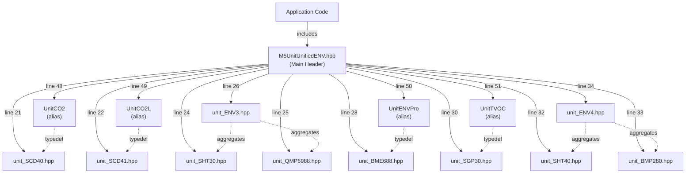
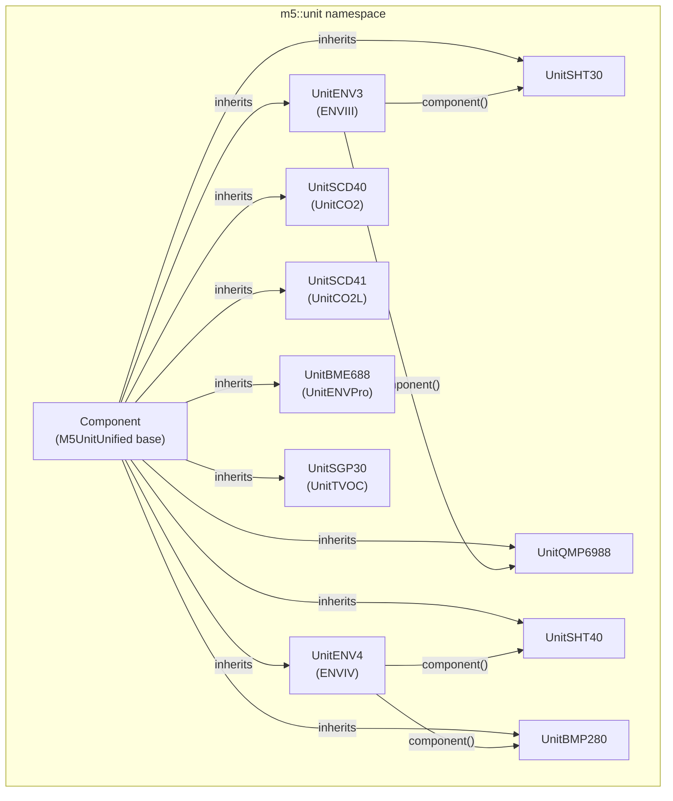
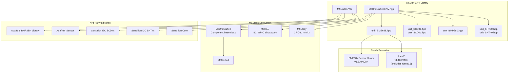
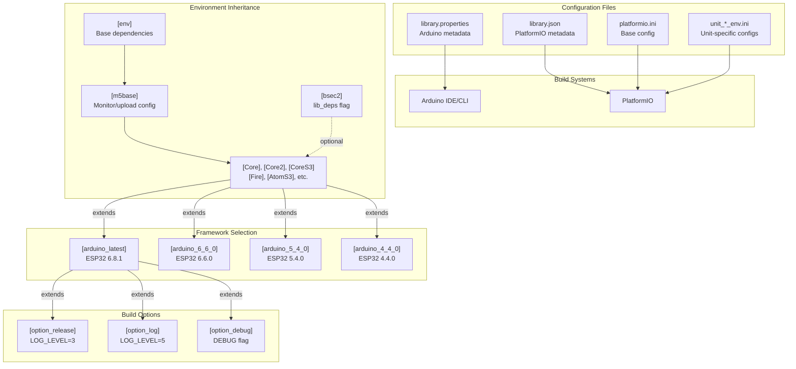
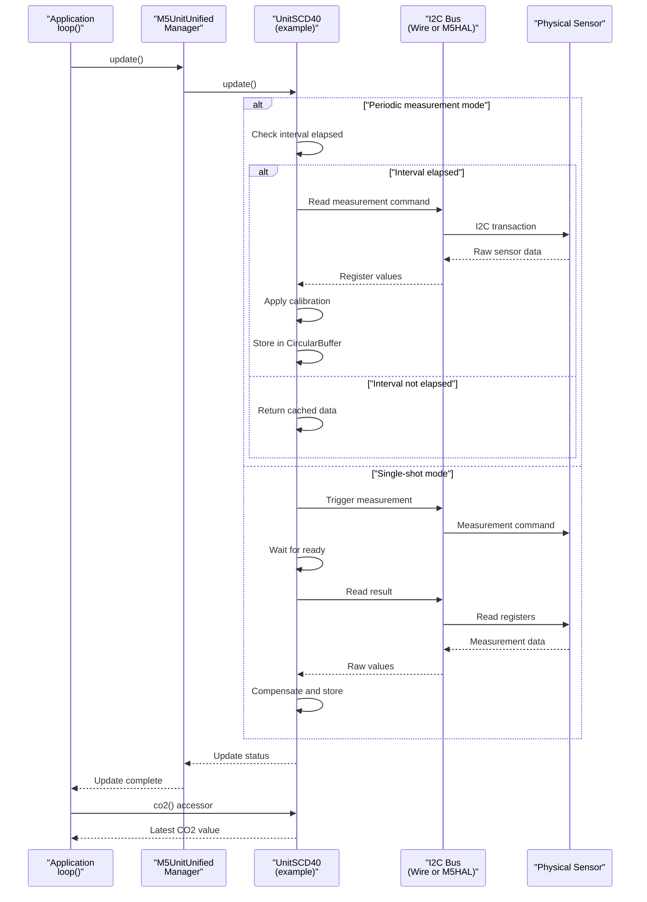
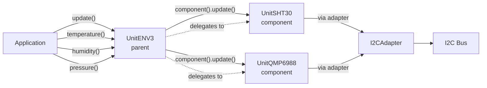

M5Unit-ENV Architecture Overview

# Architecture Overview

<details>
<summary>Relevant source files</summary>

The following files were used as context for generating this wiki page:

- [README.md](README.md)
- [library.json](library.json)
- [library.properties](library.properties)
- [platformio.ini](platformio.ini)
- [src/M5UnitUnifiedENV.hpp](src/M5UnitUnifiedENV.hpp)
- [unit_co2_env.ini](unit_co2_env.ini)

</details>


This document explains the internal structure of the M5Unit-ENV library, including the dual-interface design philosophy, component hierarchy, dependency integration, and data flow patterns. This overview provides a foundation for understanding how the library organizes sensor drivers, manages external dependencies, and supports both standalone and framework-integrated usage.

For details on the differences between the two interfaces, see [Conventional vs Unified Interface](#3.1). For dependency requirements and version constraints, see [Dependency Management](#3.2). For usage patterns and code examples, see [Usage Patterns and Examples](#5).

## Library Entry Points

The M5Unit-ENV library provides two mutually exclusive top-level headers that define the library's interface paradigm:

| Header File | Interface Type | Primary Use Case | Framework Dependency |
|------------|----------------|------------------|---------------------|
| `M5UnitENV.h` | Conventional | Standalone sensor usage | Arduino Wire library |
| `M5UnitUnifiedENV.h` | Unified | Multi-sensor integration | M5UnitUnified framework |

The mutual exclusion is enforced at compile time through preprocessor guards in [src/M5UnitUnifiedENV.hpp:13-15]():

```cpp
#if defined(_M5_UNIT_ENV_H_)
#error "DO NOT USE it at the same time as conventional libraries"
#endif
```

Both headers declare themselves in [library.properties:10]() and [library.json:22-25]() as the primary includes for the library.

**Unified Interface Include Structure**



Sources: [src/M5UnitUnifiedENV.hpp:1-55](), [library.properties:10](), [library.json:22-25]()

## Component Hierarchy

The library organizes sensors into three architectural tiers:

### Basic Sensor Units

Individual sensor drivers that provide direct hardware access:

| Unit Class | Physical Sensor | SKU | Capabilities |
|-----------|----------------|-----|--------------|
| `UnitSHT30` | SHT30 | U001-C | Temperature, Humidity, Periodic/Single-shot |
| `UnitSHT40` | SHT40 | U001-D | Temperature, Humidity, Heater, Periodic/Single-shot |
| `UnitQMP6988` | QMP6988 | U001-C | Pressure, Temperature, IIR Filter |
| `UnitBMP280` | BMP280 | U001-D | Pressure, Temperature, 6 Use Cases |
| `UnitSCD40` | SCD40 | U103 | CO2, Temperature, Humidity, ASC |
| `UnitSCD41` | SCD41 | U104 | CO2, Temperature, Humidity, Low Power |
| `UnitSGP30` | SGP30 | U088 | TVOC, eCO2, Baseline Management |
| `UnitBME688` | BME688 | U169 | Temperature, Humidity, Pressure, Gas, IAQ |

### Composite Units

Aggregated multi-sensor units that combine multiple physical sensors:

| Composite Class | Component Sensors | SKU | Architecture Pattern |
|----------------|-------------------|-----|---------------------|
| `UnitENV3` | `UnitSHT30` + `UnitQMP6988` | U001-C | Parent-child with I2C adapter |
| `UnitENV4` | `UnitSHT40` + `UnitBMP280` | U001-D | Parent-child with I2C adapter |

### Type Aliases

Product-friendly naming defined in [src/M5UnitUnifiedENV.hpp:48-51]():

```cpp
using UnitCO2    = m5::unit::UnitSCD40;
using UnitCO2L   = m5::unit::UnitSCD41;
using UnitENVPro = m5::unit::UnitBME688;
using UnitTVOC   = m5::unit::UnitSGP30;
```

**Component Class Hierarchy**



Sources: [src/M5UnitUnifiedENV.hpp:20-34](), [src/M5UnitUnifiedENV.hpp:48-51]()

## Dependency Architecture

The library integrates with three primary dependency ecosystems: M5Stack, Bosch Sensortec, and third-party vendor libraries.

### M5Stack Ecosystem Dependencies

These dependencies are required for the unified interface and are declared in [library.properties:11]() and [library.json:13-16]():

| Library | Minimum Version | Purpose | Configuration Source |
|---------|----------------|---------|---------------------|
| `M5UnitUnified` | >=0.1.0 | Unit lifecycle management, discovery | [library.json:14]() |
| `M5Utility` | (implicit) | CRC-8, MurmurHash3 utilities | [library.properties:11]() |
| `M5HAL` | (implicit) | Hardware abstraction layer | [library.properties:11]() |
| `M5Unified` | (implicit) | Core M5Stack framework | [platformio.ini:13]() |

### Bosch Sensortec Dependencies

Required specifically for the BME688/ENVPro unit:

| Library | Minimum Version | Purpose | Platform Exclusions |
|---------|----------------|---------|-------------------|
| `BME68x Sensor library` | >=1.3.40408 | Low-level BME688 driver | None |
| `bsec2` | >=1.10.2610 | IAQ, CO2eq, VOC algorithms | NanoC6 (excluded) |

The BSEC2 exclusion for NanoC6 is handled in [platformio.ini:89-97](), where the `NanoC6` environment does not include `${bsec2.lib_deps}`.

### Third-Party Vendor Dependencies

Used by the conventional interface, documented in [README.md:29-35]():

| Library | Vendor | Sensor Support | Interface Type |
|---------|--------|----------------|----------------|
| `Adafruit_BMP280_Library` | Adafruit | BMP280 | Conventional only |
| `Adafruit_Sensor` | Adafruit | Unified sensor API | Conventional only |
| `Sensirion I2C SCD4x` | Sensirion | SCD40/SCD41 | Conventional only |
| `Sensirion I2C SHT4x` | Sensirion | SHT40 | Conventional only |
| `Sensirion Core` | Sensirion | I2C common functions | Conventional only |

**Dependency Integration Map**



Sources: [library.properties:11](), [library.json:13-16](), [platformio.ini:13-19](), [platformio.ini:89-97](), [README.md:29-35]()

## Build Configuration Architecture

The library supports both PlatformIO and Arduino IDE through parallel configuration systems.

### PlatformIO Configuration Structure

The build system uses a modular INI structure defined in [platformio.ini:1-204]():

| Configuration File | Purpose | Line Reference |
|-------------------|---------|----------------|
| `platformio.ini` | Base environments and framework selection | [platformio.ini:8-203]() |
| `unit_co2_env.ini` | CO2 unit test/example configurations | [platformio.ini:6]() |
| `unit_env3_env.ini` | ENV3 unit test/example configurations | [platformio.ini:6]() |
| `unit_env4_env.ini` | ENV4 unit test/example configurations | [platformio.ini:6]() |
| `unit_envpro_env.ini` | ENVPro unit test/example configurations | [platformio.ini:6]() |
| `unit_tvoc_env.ini` | TVOC unit test/example configurations | [platformio.ini:6]() |

**Base Environment Structure**

The base environment is defined in [platformio.ini:8-15]():

```
[env]
build_flags = -Wall -Wextra -Wreturn-local-addr -Werror=format -Werror=return-local-addr
lib_ldf_mode = deep
test_framework = googletest
test_build_src = true
lib_deps = m5stack/M5Unified
           m5stack/M5UnitUnified
           boschsensortec/BME68x Sensor library@>=1.3.40408
```

**Board Environment Inheritance Pattern**

Each M5Stack board extends from `m5base` with specific dependencies:

| Environment | Board Identifier | BSEC2 Support | Line Reference |
|------------|-----------------|---------------|----------------|
| `Core` | `m5stack-grey` | Yes | [platformio.ini:28-35]() |
| `Core2` | `m5stack-core2` | Yes | [platformio.ini:37-41]() |
| `CoreS3` | `m5stack-cores3` | Yes | [platformio.ini:43-47]() |
| `Fire` | `m5stack-fire` | Yes | [platformio.ini:49-53]() |
| `StampS3` | `m5stack-stamps3` | Yes | [platformio.ini:55-60]() |
| `AtomMatrix` | `m5stack-atom` | Yes | [platformio.ini:69-73]() |
| `AtomS3` | `m5stack-atoms3` | Yes | [platformio.ini:75-79]() |
| `AtomS3R` | `m5stack-atoms3r` | Yes | [platformio.ini:82-86]() |
| `NanoC6` | `m5stack-nanoc6` | **No** | [platformio.ini:89-97]() |

**Framework Version Selection**

Multiple Espressif32 platform versions are supported through configuration sections:

```
[arduino_latest]   platform = espressif32 @ 6.8.1
[arduino_6_6_0]    platform = espressif32 @ 6.6.0
[arduino_6_0_1]    platform = espressif32 @ 6.0.1
[arduino_5_4_0]    platform = espressif32 @ 5.4.0
[arduino_4_4_0]    platform = espressif32 @ 4.4.0
```

Defined in [platformio.ini:138-156]().

### Arduino IDE Configuration

Arduino IDE integration is configured through [library.properties:1-11]():

```
name=M5Unit-ENV
version=1.3.1
architectures=esp32
includes=M5UnitENV.h, M5UnitUnifiedENV.h
depends=M5UnitUnified,M5Utility,M5HAL,bsec2,BME68x Sensor library
```

**Build System Configuration Matrix**



Sources: [platformio.ini:1-204](), [library.properties:1-11](), [library.json:1-33]()

## File Organization

The library follows a structured directory layout:

```
M5Unit-ENV/
├── src/
│   ├── M5UnitENV.h                    # Conventional interface header
│   ├── M5UnitUnifiedENV.hpp           # Unified interface header
│   └── unit/
│       ├── unit_BME688.hpp/cpp        # ENVPro sensor driver
│       ├── unit_SCD40.hpp/cpp         # CO2 sensor driver
│       ├── unit_SCD41.hpp/cpp         # CO2L sensor driver
│       ├── unit_SHT30.hpp/cpp         # Temperature/humidity driver
│       ├── unit_SHT40.hpp/cpp         # Advanced temp/humidity driver
│       ├── unit_QMP6988.hpp/cpp       # Pressure sensor driver
│       ├── unit_BMP280.hpp/cpp        # Pressure/temp driver
│       ├── unit_SGP30.hpp/cpp         # TVOC sensor driver
│       ├── unit_ENV3.hpp/cpp          # ENVIII composite unit
│       └── unit_ENV4.hpp/cpp          # ENVIV composite unit
├── examples/
│   └── UnitUnified/
│       ├── UnitCO2/PlotToSerial/      # SCD40 example
│       ├── UnitCO2L/PlotToSerial/     # SCD41 example
│       ├── UnitENV3/PlotToSerial/     # ENV3 composite example
│       ├── UnitENV4/PlotToSerial/     # ENV4 composite example
│       ├── UnitENVPro/PlotToSerial/   # BME688 example
│       └── UnitTVOC/PlotToSerial/     # SGP30 example
├── test/
│   └── embedded/
│       ├── test_scd40/                # SCD40 unit tests
│       ├── test_scd41/                # SCD41 unit tests
│       └── test_bmp280/               # BMP280 unit tests
├── platformio.ini                      # PlatformIO configuration
├── unit_co2_env.ini                    # CO2 test environments
├── unit_env3_env.ini                   # ENV3 test environments
├── unit_env4_env.ini                   # ENV4 test environments
├── unit_envpro_env.ini                 # ENVPro test environments
├── unit_tvoc_env.ini                   # TVOC test environments
├── library.properties                  # Arduino library metadata
└── library.json                        # PlatformIO library metadata
```

**File-to-Component Mapping**

| Product Name | SKU | Unit Class | Header File | Namespace |
|-------------|-----|-----------|-------------|-----------|
| Unit CO2 | U103 | `UnitSCD40` / `UnitCO2` | `unit_SCD40.hpp` | `m5::unit` |
| Unit CO2L | U104 | `UnitSCD41` / `UnitCO2L` | `unit_SCD41.hpp` | `m5::unit` |
| Unit ENVIII | U001-C | `UnitENV3` | `unit_ENV3.hpp` | `m5::unit` |
| Unit ENVIV | U001-D | `UnitENV4` | `unit_ENV4.hpp` | `m5::unit` |
| Unit ENVPro | U169 | `UnitBME688` / `UnitENVPro` | `unit_BME688.hpp` | `m5::unit` |
| Unit TVOC | U088 | `UnitSGP30` / `UnitTVOC` | `unit_SGP30.hpp` | `m5::unit` |

Sources: [src/M5UnitUnifiedENV.hpp:20-34](), [README.md:47-53]()

## Data Flow and Update Cycle

The unified interface implements a periodic update pattern managed by the M5UnitUnified framework:

**Sensor Update Flow**



**Composite Unit Data Aggregation**

For composite units like `UnitENV3` and `UnitENV4`, the parent unit coordinates child sensor updates:



Sources: [src/M5UnitUnifiedENV.hpp:26](), Example structure inferred from composite unit patterns

## Testing Infrastructure

The library includes embedded unit tests using GoogleTest, configured in [platformio.ini:11]():

```
test_framework = googletest
test_build_src = true
```

**Test Coverage by Sensor**

| Sensor Unit | Test Directory | Test Environments | Configuration File |
|------------|----------------|-------------------|-------------------|
| SCD40 | `test/embedded/test_scd40` | 14 boards × 1 test | [unit_co2_env.ini:5-88]() |
| SCD41 | `test/embedded/test_scd41` | 14 boards × 1 test | [unit_co2_env.ini:91-174]() |
| BMP280 | `test/embedded/test_bmp280` | Multiple boards | Unit-specific config |

Test environments inherit from board configurations and add `${test_fw.lib_deps}` which is defined in [platformio.ini:201-202]():

```
[test_fw]
lib_deps = google/googletest@1.12.1
```

Sources: [platformio.ini:11-12](), [platformio.ini:201-202](), [unit_co2_env.ini:5-174]()

## Platform-Specific Considerations

### NanoC6 BSEC2 Exclusion

The NanoC6 board environment excludes the BSEC2 library due to resource constraints. This is implemented in [platformio.ini:89-97]():

```ini
[NanoC6]
extends = m5base
board = m5stack-nanoc6
platform = https://github.com/platformio/platform-espressif32.git
platform_packages =
	platformio/framework-arduinoespressif32 @ https://github.com/espressif/arduino-esp32.git#3.0.7
	platformio/framework-arduinoespressif32-libs @ https://github.com/espressif/esp32-arduino-libs.git#idf-release/v5.1
board_build.partitions = default.csv
lib_deps = ${env.lib_deps}
```

Note the absence of `${bsec2.lib_deps}` which is present in all other board configurations. This means the BME688/ENVPro unit will not have IAQ calculation capabilities on NanoC6.

### ESP32 Platform Version Matrix

The library supports a wide range of ESP32 platform versions to maintain compatibility:

| Platform Version | Espressif32 Package | Arduino Core Version | Status |
|-----------------|-------------------|---------------------|---------|
| 6.8.1 | `espressif32 @ 6.8.1` | Latest | Primary |
| 6.6.0 | `espressif32 @ 6.6.0` | Stable | Supported |
| 6.0.1 | `espressif32 @ 6.0.1` | Stable | Supported |
| 5.4.0 | `espressif32 @ 5.4.0` | Stable | Supported |
| 4.4.0 | `espressif32 @ 4.4.0` | Legacy | Supported |

Sources: [platformio.ini:89-97](), [platformio.ini:138-156](), [README.md:85]()