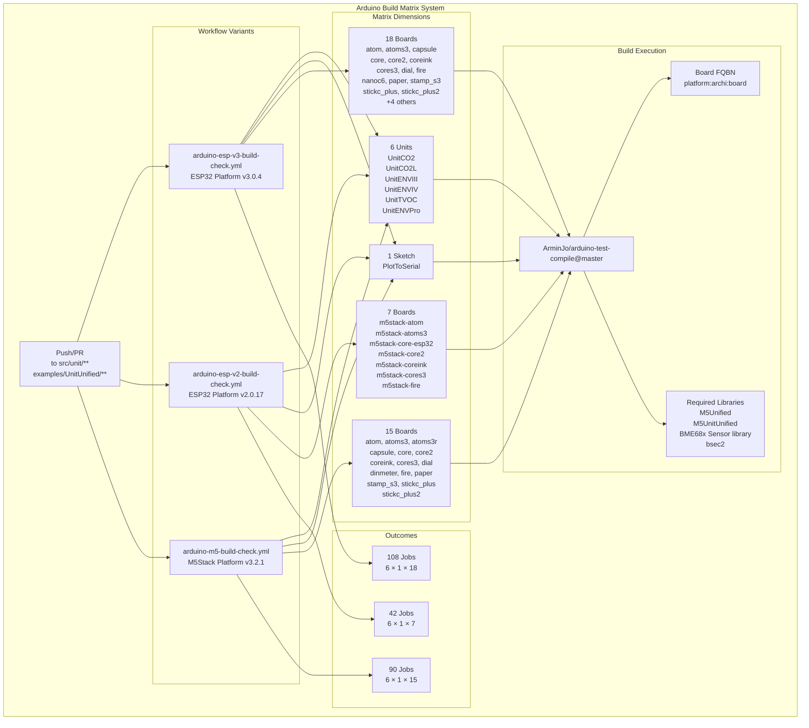
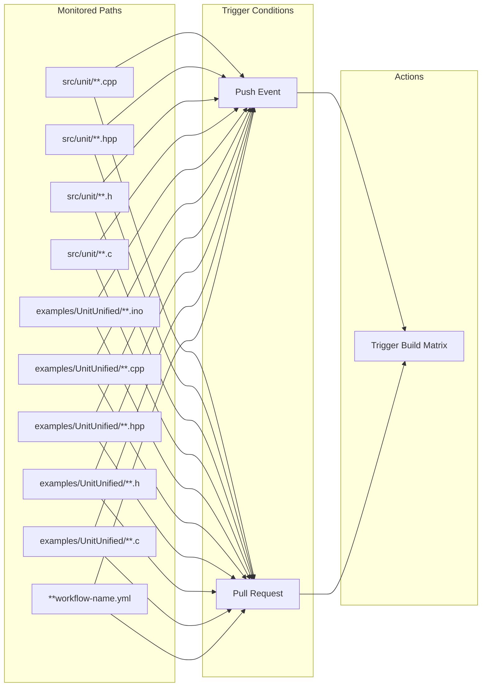
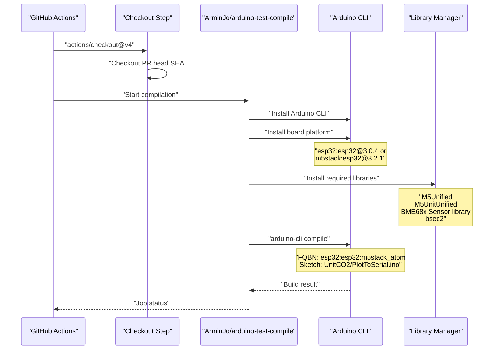
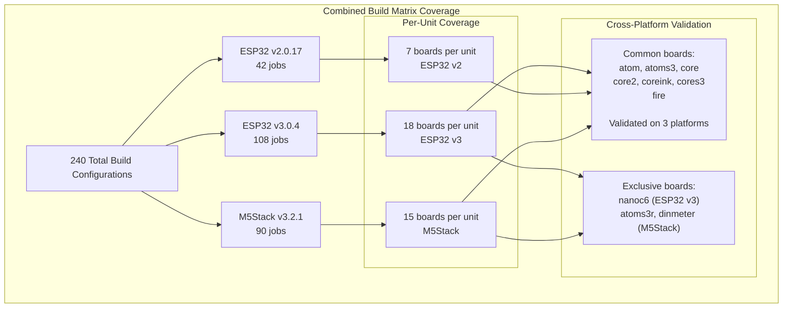

M5Unit-ENV Arduino Build Matrix

# Arduino Build Matrix

<details>
<summary>Relevant source files</summary>

The following files were used as context for generating this wiki page:

- [.github/workflows/arduino-esp-v2-build-check.yml](.github/workflows/arduino-esp-v2-build-check.yml)
- [.github/workflows/arduino-esp-v3-build-check.yml](.github/workflows/arduino-esp-v3-build-check.yml)
- [.github/workflows/arduino-m5-build-check.yml](.github/workflows/arduino-m5-build-check.yml)

</details>


## Purpose and Scope

This document explains the Arduino continuous integration workflows that validate library compatibility across multiple ESP32 platforms and M5Stack board variants. The Arduino build matrix ensures that example sketches compile successfully for all supported hardware combinations by testing unit-sketch-board permutations in parallel.

For PlatformIO build verification, see [PlatformIO Build Verification](#7.2). For documentation generation and code quality checks, see [Code Quality and Documentation](#7.3).

## Workflow Architecture

The library maintains three separate Arduino CI workflows, each targeting a different platform variant:



**Sources:** [.github/workflows/arduino-esp-v3-build-check.yml](), [.github/workflows/arduino-m5-build-check.yml](), [.github/workflows/arduino-esp-v2-build-check.yml]()

## Platform Variant Comparison

| Aspect | ESP32 v3.0.4 | ESP32 v2.0.17 (Legacy) | M5Stack v3.2.1 |
|--------|--------------|------------------------|----------------|
| **Workflow File** | `arduino-esp-v3-build-check.yml` | `arduino-esp-v2-build-check.yml` | `arduino-m5-build-check.yml` |
| **Platform URL** | `https://espressif.github.io/arduino-esp32/package_esp32_index.json` | `https://espressif.github.io/arduino-esp32/package_esp32_index.json` | `https://m5stack.oss-cn-shenzhen.aliyuncs.com/resource/arduino/package_m5stack_index.json` |
| **Platform FQBN** | `esp32:esp32:board` | `esp32:esp32:board` | `m5stack:esp32:board` |
| **Board Count** | 18 | 7 | 15 |
| **Total Jobs** | 108 (6×1×18) | 42 (6×1×7) | 90 (6×1×15) |
| **Board Naming** | `m5stack_atom` | `m5stack-atom` | `m5stack_atom` |
| **BSEC2 Dependency** | `bsec2` | `Bsec2` | `bsec2` |
| **Purpose** | Current ESP32 platform | Legacy compatibility | M5Stack-specific features |

**Sources:** [.github/workflows/arduino-esp-v3-build-check.yml:1-126](), [.github/workflows/arduino-m5-build-check.yml:1-127](), [.github/workflows/arduino-esp-v2-build-check.yml:1-108]()

## Matrix Configuration Structure

### Unit Dimension

All three workflows test the same six environmental units:

```yaml
unit:
  - UnitCO2      # SCD40 sensor
  - UnitCO2L     # SCD41 sensor
  - UnitENVIII   # ENV3 composite (SHT30 + QMP6988)
  - UnitENVIV    # ENV4 composite (SHT40 + BMP280)
  - UnitTVOC     # SGP30 sensor
  - UnitENVPro   # BME688 sensor with BSEC2
```

These values directly map to subdirectory names under `examples/UnitUnified/`.

**Sources:** [.github/workflows/arduino-esp-v3-build-check.yml:63-69](), [.github/workflows/arduino-m5-build-check.yml:63-69](), [.github/workflows/arduino-esp-v2-build-check.yml:63-69]()

### Sketch Dimension

Each workflow compiles only the `PlotToSerial` example sketch for each unit. The sketch is located via:

```yaml
sketch-names: PlotToSerial.ino
sketch-names-find-start: ./examples/UnitUnified/${{ matrix.unit }}
```

This results in paths like `./examples/UnitUnified/UnitCO2/PlotToSerial/PlotToSerial.ino`.

**Sources:** [.github/workflows/arduino-esp-v3-build-check.yml:60-61,123-124](), [.github/workflows/arduino-m5-build-check.yml:60-61,123-124]()

### Board Dimension: ESP32 v3.0.4

The ESP32 v3.0.4 workflow targets 18 M5Stack board variants:

```yaml
board:
  - m5stack_atom
  - m5stack_atoms3
  - m5stack_capsule
  - m5stack_core
  - m5stack_core2
  - m5stack_coreink
  - m5stack_cores3
  - m5stack_dial
  - m5stack_fire
  - m5stack_nanoc6
  - m5stack_paper
  - m5stack_stamp_s3
  - m5stack_stickc_plus
  - m5stack_stickc_plus2
  # Additional boards commented out:
  # - m5stack_cardputer
  # - m5stack_poe_cam
  # - m5stack_stamp_c3
  # - m5stack_stamp_pico
  # - m5stack_station
  # - m5stack_stickc
  # - m5stack_timer_cam
  # - m5stack_tough
  # - m5stack_unit_cam
  # - m5stack_unit_cams3
```

**Sources:** [.github/workflows/arduino-esp-v3-build-check.yml:71-96]()

### Board Dimension: ESP32 v2.0.17 (Legacy)

The legacy ESP32 v2.0.17 workflow uses a reduced board set with different naming conventions (hyphens instead of underscores):

```yaml
board:
  - m5stack-atom
  - m5stack-atoms3
  - m5stack-core-esp32
  - m5stack-core2
  - m5stack-coreink
  - m5stack-cores3
  - m5stack-fire
```

**Sources:** [.github/workflows/arduino-esp-v2-build-check.yml:71-78]()

### Board Dimension: M5Stack Platform

The M5Stack-specific platform includes 15 boards, adding M5Stack-exclusive hardware:

```yaml
board:
  - m5stack_atom
  - m5stack_atoms3
  - m5stack_atoms3r      # M5Stack exclusive
  - m5stack_capsule
  - m5stack_core
  - m5stack_core2
  - m5stack_coreink
  - m5stack_cores3
  - m5stack_dial
  - m5stack_dinmeter     # M5Stack exclusive
  - m5stack_fire
  - m5stack_paper
  - m5stack_stamp_s3
  - m5stack_stickc_plus
  - m5stack_stickc_plus2
```

**Sources:** [.github/workflows/arduino-m5-build-check.yml:71-96]()

## Workflow Triggers and Path Filtering

### Trigger Events

All three workflows activate on:

```yaml
on:
  push:
    tags-ignore:
      - '*.*.*'
      - 'v*.*.*'
    branches:
      - '*'
  pull_request:
  workflow_dispatch:
```

Push events ignore version tags to prevent redundant builds during releases.

**Sources:** [.github/workflows/arduino-esp-v3-build-check.yml:7-37]()

### Path Filtering

Builds only trigger when changes occur in relevant files:



This filtering prevents unnecessary builds when documentation or metadata files change.

**Sources:** [.github/workflows/arduino-esp-v3-build-check.yml:14-36]()

## Build Execution Process

### Job Configuration

Each matrix combination spawns an independent job:

```yaml
jobs:
  build:
    name: ${{ matrix.unit }}:${{ matrix.sketch }}:${{matrix.board}}@${{matrix.platform-version}}
    runs-on: ubuntu-latest
    timeout-minutes: 5
    
    strategy:
      fail-fast: false
      matrix:
        # ... matrix definition ...
```

Job names follow the format: `UnitCO2:PlotToSerial:m5stack_atom@3.0.4`

**Sources:** [.github/workflows/arduino-esp-v3-build-check.yml:48-56]()

### Compilation Steps



**Sources:** [.github/workflows/arduino-esp-v3-build-check.yml:106-125]()

### Dependency Installation

The `REQUIRED_LIBRARIES` environment variable specifies libraries to install:

```yaml
env:
  REQUIRED_LIBRARIES: M5Unified,M5UnitUnified,BME68x Sensor library,bsec2
```

Note the case difference in BSEC2:
- ESP32 v3 and M5Stack: `bsec2` (lowercase)
- ESP32 v2: `Bsec2` (capitalized)

**Sources:** [.github/workflows/arduino-esp-v3-build-check.yml:5](), [.github/workflows/arduino-esp-v2-build-check.yml:5]()

### Board FQBN Construction

The Fully Qualified Board Name (FQBN) is constructed from matrix variables:

```yaml
arduino-board-fqbn: ${{ matrix.platform }}:${{ matrix.archi }}:${{ matrix.board }}
```

Examples:
- `esp32:esp32:m5stack_atom` (ESP32 v3)
- `esp32:esp32:m5stack-atom` (ESP32 v2)
- `m5stack:esp32:m5stack_atoms3r` (M5Stack platform)

**Sources:** [.github/workflows/arduino-esp-v3-build-check.yml:116]()

## Parallel Execution and Resource Management

### Concurrency Control

Each workflow uses concurrency groups to prevent redundant builds:

```yaml
concurrency:
  group: ${{ github.workflow }}-${{ github.ref }}
  cancel-in-progress: true
```

This cancels in-progress jobs when new commits are pushed to the same branch.

**Sources:** [.github/workflows/arduino-esp-v3-build-check.yml:43-45]()

### Fail-Fast Strategy

The matrix strategy disables fail-fast to ensure all combinations are tested:

```yaml
strategy:
  fail-fast: false
```

Without this, a single failing job would abort the entire matrix, preventing identification of multiple platform-specific issues.

**Sources:** [.github/workflows/arduino-esp-v3-build-check.yml:54]()

### Timeout Configuration

Each job has a 5-minute timeout to prevent hung builds:

```yaml
timeout-minutes: 5
```

**Sources:** [.github/workflows/arduino-esp-v3-build-check.yml:51]()

## Total Build Coverage



The three workflows provide comprehensive validation:
- **7 common boards** are tested on all 3 platforms (21 builds per unit, 126 total)
- **18 boards** receive ESP32 v3.0.4 testing
- **15 boards** receive M5Stack platform testing
- **Legacy compatibility** maintained via ESP32 v2.0.17

**Sources:** All three workflow files