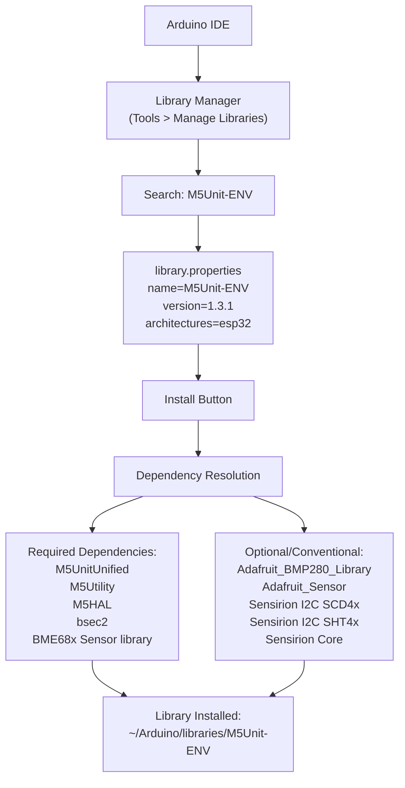
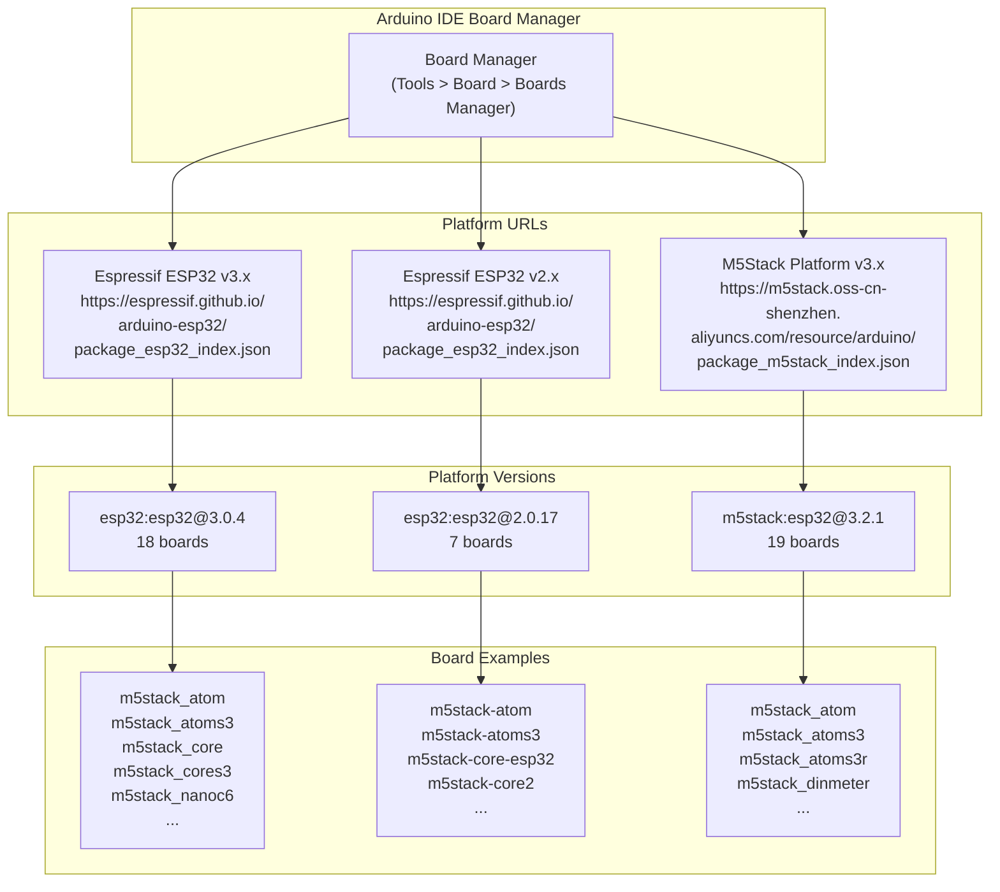
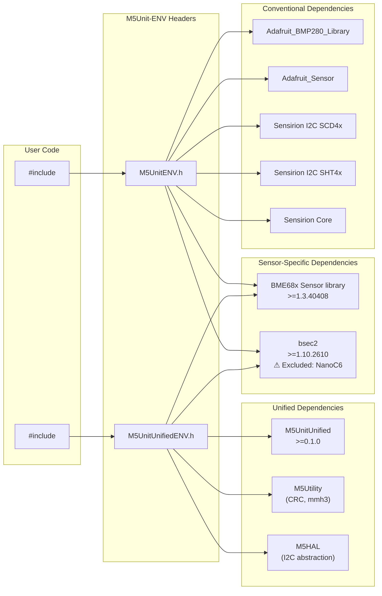
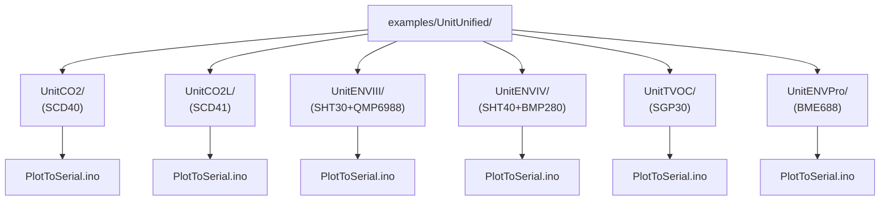
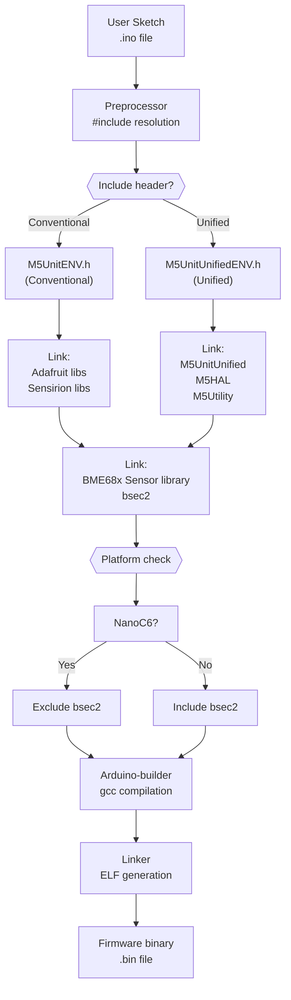

M5Unit-ENV Arduino IDE Integration

# Arduino IDE Integration

<details>
<summary>Relevant source files</summary>

The following files were used as context for generating this wiki page:

- [.github/workflows/arduino-esp-v2-build-check.yml](.github/workflows/arduino-esp-v2-build-check.yml)
- [.github/workflows/arduino-esp-v3-build-check.yml](.github/workflows/arduino-esp-v3-build-check.yml)
- [.github/workflows/arduino-m5-build-check.yml](.github/workflows/arduino-m5-build-check.yml)
- [README.md](README.md)
- [library.json](library.json)
- [library.properties](library.properties)

</details>


This document provides guidance for using the M5Unit-ENV library within the Arduino IDE environment. It covers library installation via Arduino Library Manager, board manager configuration for ESP32 platforms, dependency management, example sketch locations, and Arduino-specific compilation considerations. For advanced build configuration using PlatformIO, see [PlatformIO Configuration](#6.1). For comprehensive board support details, see [Supported Boards and Platforms](#6.2).

## Library Installation Methods

The M5Unit-ENV library can be installed through Arduino Library Manager or manual installation. The library metadata is defined in `library.properties`, which declares the library name, version, supported architecture (ESP32), dual-interface headers (`M5UnitENV.h` and `M5UnitUnifiedENV.h`), and required dependencies.

### Arduino Library Manager Installation



**Arduino Library Manager Workflow**

The Library Manager searches the Arduino Library Registry using metadata from [library.properties:1-11](). When installed, the library manager automatically resolves dependencies declared in [library.properties:11]() and prompts for installation of required libraries. The library is installed to the user's Arduino libraries directory (typically `~/Arduino/libraries/M5Unit-ENV` or `Documents/Arduino/libraries/M5Unit-ENV`).

Sources: [library.properties:1-11](), [README.md:29-35](), [README.md:78-85]()

### Manual Installation

For manual installation, clone or download the repository and place it in the Arduino libraries directory:

```
~/Arduino/libraries/M5Unit-ENV/
├── src/
├── examples/
├── library.properties
└── library.json
```

The library structure follows Arduino library specifications with source files in `src/` and example sketches in `examples/`. The [library.json:28-32]() file excludes documentation artifacts (`docs/html`) from the library distribution.

Sources: [library.json:28-32]()

## Board Manager Configuration

M5Unit-ENV supports multiple ESP32 platform variants through different board manager packages. Each platform provides different board definitions and feature sets.



**Multi-Platform Board Manager Support**

### Platform Installation Steps

1. Open Arduino IDE **Preferences** (File > Preferences)
2. Add platform URL(s) to **Additional Boards Manager URLs** field:
   - **Espressif ESP32**: `https://espressif.github.io/arduino-esp32/package_esp32_index.json`
   - **M5Stack Platform**: `https://m5stack.oss-cn-shenzhen.aliyuncs.com/resource/arduino/package_m5stack_index.json`
3. Open **Tools > Board > Boards Manager**
4. Search and install one of:
   - **esp32 by Espressif Systems** (version 3.0.4 recommended, or 2.0.17 for legacy)
   - **M5Stack by M5Stack** (version 3.2.1)

### Platform Comparison

| Platform | Version | FQBN Prefix | Board Count | CI Tested |
|----------|---------|-------------|-------------|-----------|
| Espressif ESP32 v3 | 3.0.4 | `esp32:esp32:` | 18 | Yes |
| Espressif ESP32 v2 | 2.0.17 | `esp32:esp32:` | 7 | Yes |
| M5Stack | 3.2.1 | `m5stack:esp32:` | 19 | Yes |

Sources: [.github/workflows/arduino-esp-v3-build-check.yml:57-98](), [.github/workflows/arduino-esp-v2-build-check.yml:57-81](), [.github/workflows/arduino-m5-build-check.yml:57-99]()

### Board Naming Conventions

Board identifiers differ between platforms:
- **ESP32 v3.x and M5Stack**: Use underscores (e.g., `m5stack_core`, `m5stack_atoms3`)
- **ESP32 v2.x**: Use hyphens (e.g., `m5stack-core-esp32`, `m5stack-atoms3`)

Sources: [.github/workflows/arduino-esp-v3-build-check.yml:71-95](), [.github/workflows/arduino-esp-v2-build-check.yml:71-78]()

## Dependency Management

The library declares dependencies in [library.properties:11]() that Arduino Library Manager attempts to resolve automatically. However, the dual-interface architecture requires different dependency sets.



**Dual-Interface Dependency Resolution**

### Declared Dependencies

The [library.properties:11]() line declares core dependencies:
```
depends=M5UnitUnified,M5Utility,M5HAL,bsec2,BME68x Sensor library
```

These are automatically installed when using the **unified interface** (`M5UnitUnifiedENV.h`). For the **conventional interface** (`M5UnitENV.h`), additional libraries must be manually installed through Library Manager.

### Unified Interface Dependencies

| Library | Min Version | Purpose | Auto-Install |
|---------|-------------|---------|--------------|
| M5UnitUnified | >=0.1.0 | Unit management framework | Yes |
| M5Utility | (latest) | CRC-8, MurmurHash3 utilities | Yes |
| M5HAL | (latest) | Hardware abstraction layer | Yes |
| BME68x Sensor library | >=1.3.40408 | BME688 low-level driver | Yes |
| bsec2 | >=1.10.2610 | Bosch air quality algorithms | Yes |

Sources: [library.properties:11](), [library.json:13-16](), [README.md:78-85]()

### Conventional Interface Dependencies

These must be installed manually via Library Manager:

| Library | Purpose | Source |
|---------|---------|--------|
| Adafruit_BMP280_Library | BMP280 sensor driver | Adafruit |
| Adafruit_Sensor | Unified sensor API | Adafruit |
| Sensirion I2C SCD4x | SCD40/SCD41 CO2 sensors | Sensirion |
| Sensirion I2C SHT4x | SHT40 temp/humidity | Sensirion |
| Sensirion Core | Common I2C functions | Sensirion |

Sources: [README.md:29-35]()

### Platform-Specific Exclusions

The **bsec2** library is excluded from the **NanoC6** platform due to resource constraints. CI workflows show this is handled through conditional dependency specifications:

- ESP32 v3 and M5Stack: `bsec2` (lowercase)
- ESP32 v2: `Bsec2` (capitalized - legacy package name)
- NanoC6: bsec2 dependencies excluded during build

Sources: [.github/workflows/arduino-esp-v3-build-check.yml:5](), [.github/workflows/arduino-esp-v2-build-check.yml:5](), [README.md:85]()

## Example Sketch Structure

Example sketches are organized under `examples/UnitUnified/` directory, with each sensor unit having its own subdirectory containing sketch variants.



**Example Sketch Organization**

### Accessing Examples in Arduino IDE

1. Open **File > Examples > M5Unit-ENV > UnitUnified**
2. Navigate to the desired unit subdirectory:
   - `UnitCO2` - SCD40 CO2 sensor examples
   - `UnitCO2L` - SCD41 CO2 sensor examples
   - `UnitENVIII` - ENV3 composite unit (SHT30+QMP6988)
   - `UnitENVIV` - ENV4 composite unit (SHT40+BMP280)
   - `UnitTVOC` - SGP30 air quality sensor
   - `UnitENVPro` - BME688 comprehensive environmental sensor
3. Open the sketch variant (e.g., `PlotToSerial.ino`)

### PlotToSerial Example Pattern

All units include a `PlotToSerial.ino` example demonstrating the standard unified interface pattern. For detailed explanation of this pattern, see [PlotToSerial Pattern](#5.1).

Typical structure:
```cpp
#include <M5UnitUnifiedENV.h>

void setup() {
    // Initialize hardware
    // Configure I2C bus
    // Begin sensor unit
    // Configure measurement parameters
}

void loop() {
    // Update sensor readings
    // Output formatted data to Serial
    // Delay for plot interval
}
```

Sources: [.github/workflows/arduino-esp-v3-build-check.yml:4](), [.github/workflows/arduino-esp-v3-build-check.yml:60-69]()

## Arduino Compilation Process

The Arduino IDE compilation process integrates with the library through standard Arduino build mechanisms, with special considerations for the M5Unit-ENV dual-interface architecture.



**Arduino Build Flow with Platform-Specific Handling**

### Build Configuration

The Arduino IDE uses the `library.properties` file to:
- Validate architecture compatibility ([library.properties:9]() - `architectures=esp32`)
- Resolve library dependencies ([library.properties:11]())
- Include appropriate header files ([library.properties:10]())

### Header Include Selection

**Mutually Exclusive Interfaces**: Users must choose one interface approach per project:

```cpp
// Option 1: Unified Interface (recommended for new projects)
#include <M5UnitUnifiedENV.h>

// Option 2: Conventional Interface (backward compatibility)
#include <M5UnitENV.h>

// ⚠️ INVALID: Do not include both
// #include <M5UnitENV.h>
// #include <M5UnitUnifiedENV.h>  // Causes conflicts
```

The [README.md:72-74]() explicitly warns against mixing interfaces:
```cpp
// When using M5UnitUnified, do not use it at the same time as conventional libraries
```

Sources: [library.properties:10](), [README.md:72-74]()

### Compiler Flags and Optimizations

Arduino IDE applies standard ESP32 compilation flags. Advanced users can add custom flags through **Preferences > Show verbose output during: compilation** to inspect the build process.

For release builds with optimizations and logging control, use PlatformIO instead (see [PlatformIO Configuration](#6.1)).

Sources: [library.properties:1-11]()

## Arduino-Specific Considerations

### Library Search Path

Arduino IDE searches for libraries in:
1. Sketch's `libraries/` folder (highest priority)
2. User's libraries directory (`~/Arduino/libraries/`)
3. IDE's built-in libraries (lowest priority)

Place custom or modified versions in the sketch folder to override installed versions.

### Compilation Warnings

The library follows Arduino library specification guidelines. During compilation, you may see warnings related to:
- **Deprecated APIs**: Some legacy sensor classes maintain backward compatibility
- **Platform-specific code**: Conditional compilation for NanoC6/BSEC2 exclusions
- **Vendor library warnings**: Third-party libraries (Adafruit, Sensirion, Bosch) may emit warnings

These are informational and generally do not prevent successful compilation.

Sources: [library.properties:1-11](), [README.md:85]()

### Board Selection Best Practices

When selecting boards in **Tools > Board** menu:

1. **Match your hardware**: Select the exact M5Stack product (e.g., `M5Stack Core2`, `M5Stack ATOMS3`)
2. **Platform consistency**: Use M5Stack platform (`m5stack:esp32:*`) for best M5Stack hardware integration
3. **Version compatibility**: ESP32 v3.x platforms provide latest features; v2.x for legacy compatibility

The CI test matrix validates all combinations, ensuring examples compile across [.github/workflows/arduino-esp-v3-build-check.yml:71-95]() board variants.

Sources: [.github/workflows/arduino-esp-v3-build-check.yml:71-95](), [.github/workflows/arduino-m5-build-check.yml:71-96]()

### Serial Monitor Configuration

For PlotToSerial examples:
- **Baud Rate**: Set to match sketch (typically 115200)
- **Line Ending**: Set to "Newline" or "Both NL & CR"
- **Plotter Mode**: Use **Tools > Serial Plotter** for real-time visualization of sensor data

Sources: [.github/workflows/arduino-esp-v3-build-check.yml:60-69]()

## Troubleshooting Arduino IDE Issues

Common issues and resolutions:

| Issue | Cause | Solution |
|-------|-------|----------|
| Library not found | Not installed via Library Manager | Install M5Unit-ENV through Tools > Manage Libraries |
| Missing dependencies | Auto-install failed | Manually install dependencies from Library Manager |
| Compilation errors with both headers | Including both interfaces | Use only one: `M5UnitENV.h` OR `M5UnitUnifiedENV.h` |
| BSEC2 errors on NanoC6 | Platform incompatibility | Use different board or avoid ENVPro unit |
| Board not available | Platform not installed | Install ESP32 or M5Stack platform via Board Manager |
| Upload failed | Wrong COM port | Select correct port in Tools > Port menu |

For detailed troubleshooting, see [Troubleshooting and FAQ](#9).

Sources: [README.md:72-74](), [README.md:85](), [library.properties:11]()