M5Unit-ENV BME688 (ENVPro Unit)

# BME688 (ENVPro Unit)

<details>
<summary>Relevant source files</summary>

The following files were used as context for generating this wiki page:

- [README.md](README.md)
- [library.json](library.json)
- [library.properties](library.properties)
- [src/unit/unit_BME688.cpp](src/unit/unit_BME688.cpp)
- [src/unit/unit_BME688.hpp](src/unit/unit_BME688.hpp)

</details>


## Purpose and Scope

This page documents the BME688 environmental sensor implementation in the M5Unit-ENV library, sold as the ENVPro Unit (SKU: U169). The BME688 is a sophisticated 4-in-1 sensor measuring temperature, pressure, humidity, and gas resistance. When integrated with Bosch's BSEC2 algorithm library, it provides advanced air quality metrics including Indoor Air Quality (IAQ) index, CO2 equivalent, and VOC equivalent.

For information about composite environmental units combining multiple sensors, see [ENV3 (ENVIII)](#4.8) and [ENV4 (ENVIV)](#4.9). For basic environmental sensing without gas measurements, see [SHT30](#4.2) or [SHT40](#4.6).

**Sources:** [src/unit/unit_BME688.hpp:1-11](), [README.md:52](), [library.properties:1-12]()

---

## Hardware and Feature Overview

The BME688 provides four physical sensor measurements plus algorithmically-derived air quality metrics. Its key differentiator is the integrated gas sensor with a micro-hotplate, enabling detection of volatile organic compounds.

| Measurement Type | Range | Resolution | Availability |
|-----------------|-------|------------|--------------|
| Temperature | -40°C to +85°C | 0.01°C | Always |
| Pressure | 300 hPa to 1100 hPa | 0.18 Pa | Always |
| Humidity | 0% to 100% | 0.008% | Always |
| Gas Resistance | 10 Ω to 10 MΩ | Variable | Always |
| IAQ Index | 0-500 | 1 | BSEC2 only |
| CO2 Equivalent | 400-60000 ppm | 1 ppm | BSEC2 only |
| VOC Equivalent | 0.5-500 ppm | 0.01 ppm | BSEC2 only |

### Platform-Specific BSEC2 Availability

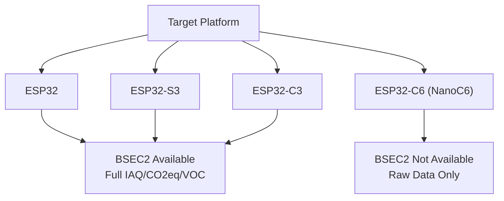

**Sources:** [src/unit/unit_BME688.hpp:22-31](), [README.md:85]()

---

## Software Architecture

### Class Hierarchy and Core Components

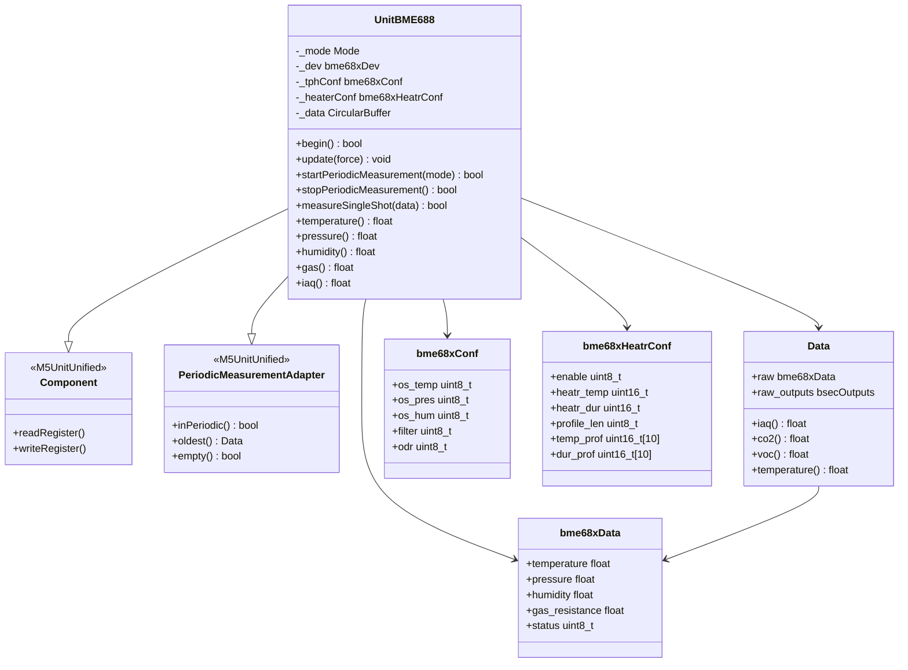

**Sources:** [src/unit/unit_BME688.hpp:377-447](), [src/unit/unit_BME688.hpp:252-368]()

### Data Flow and Processing Pipeline

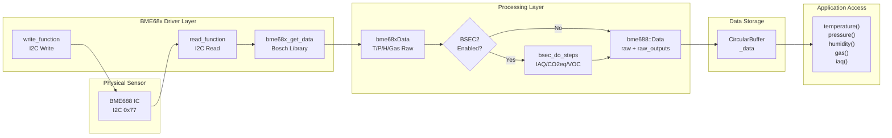

**Sources:** [src/unit/unit_BME688.cpp:136-148](), [src/unit/unit_BME688.cpp:281-350](), [src/unit/unit_BME688.cpp:354-408]()

---

## Measurement Modes

The BME688 supports four distinct operational modes, each with different power consumption and data characteristics.

### Mode Enumeration and Characteristics

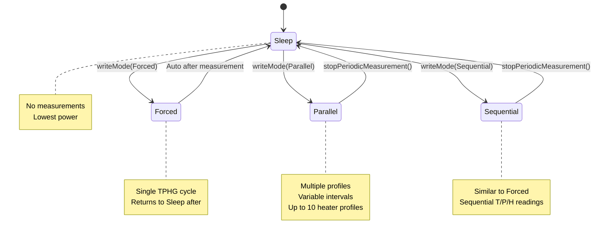

| Mode | Description | Heater Profiles | Auto-Sleep | Use Case |
|------|-------------|-----------------|------------|----------|
| `Mode::Sleep` | No measurements | N/A | N/A | Standby, low power |
| `Mode::Forced` | Single TPHG cycle | 1 (fixed) | Yes | One-shot measurements |
| `Mode::Parallel` | Continuous with multiple profiles | 1-10 | No | Advanced air quality |
| `Mode::Sequential` | Sequential readings | 1 | No | Continuous monitoring |

**Sources:** [src/unit/unit_BME688.hpp:46-52](), [src/unit/unit_BME688.cpp:726-763]()

---

## Initialization and Configuration

### Configuration Structure

The `UnitBME688::config_t` structure controls initialization behavior and differs significantly depending on whether BSEC2 is available.

#### BSEC2 Platforms (ESP32/S3/C3)

```cpp
struct config_t {
    bool start_periodic{true};
    int8_t ambient_temperature{25};
    
    // BSEC2-specific
    uint32_t subscribe_bits{
        1U << BSEC_OUTPUT_IAQ | 
        1U << BSEC_OUTPUT_RAW_TEMPERATURE |
        1U << BSEC_OUTPUT_RAW_PRESSURE | 
        1U << BSEC_OUTPUT_RAW_HUMIDITY |
        1U << BSEC_OUTPUT_RAW_GAS | 
        1U << BSEC_OUTPUT_STABILIZATION_STATUS |
        1U << BSEC_OUTPUT_RUN_IN_STATUS
    };
    bme688::bsec2::SampleRate sample_rate{
        bme688::bsec2::SampleRate::LowPower
    };
};
```

#### Non-BSEC2 Platforms (NanoC6)

```cpp
struct config_t {
    bool start_periodic{true};
    int8_t ambient_temperature{25};
    
    // Raw mode configuration
    bme688::Mode mode{bme688::Mode::Forced};
    bme688::Oversampling oversampling_temperature{bme688::Oversampling::x2};
    bme688::Oversampling oversampling_pressure{bme688::Oversampling::x1};
    bme688::Oversampling oversampling_humidity{bme688::Oversampling::x16};
    bme688::Filter filter{bme688::Filter::None};
    bme688::ODR odr{bme688::ODR::None};
    bool heater_enable{true};
    uint16_t heater_temperature{300};  // Celsius
    uint16_t heater_duration{100};     // milliseconds
};
```

**Sources:** [src/unit/unit_BME688.hpp:382-428]()

### Initialization Sequence

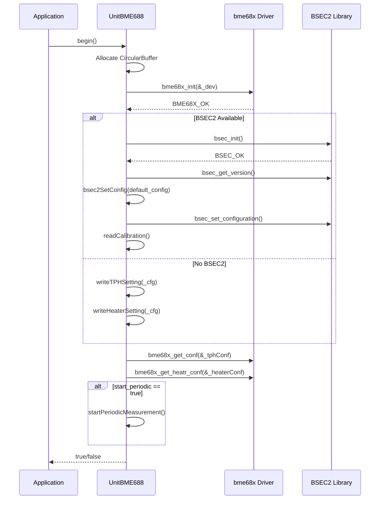

**Sources:** [src/unit/unit_BME688.cpp:169-262]()

### Default BSEC2 Configuration

The library uses a pre-configured BSEC2 setup optimized for 3.3V operation with 3-second and 4-day calibration cycles:

**Sources:** [src/unit/unit_BME688.cpp:74-77]()

---

## Periodic Measurement Patterns

### With BSEC2 (Advanced Mode)

When BSEC2 is available, measurements are controlled by the BSEC2 algorithm which manages sensor timing and heater profiles automatically.

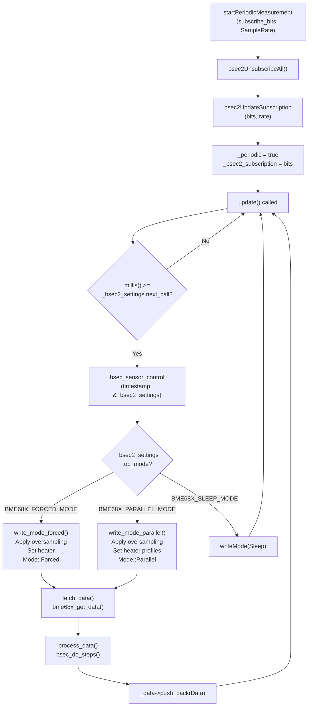

#### BSEC2 Sample Rates and Intervals

| SampleRate Enum | Frequency | Interval | Use Case |
|-----------------|-----------|----------|----------|
| `Disabled` | 0 Hz | N/A | Sensor off |
| `LowPower` | 0.33 Hz | 3 sec | Standard IAQ |
| `UltraLowPower` | 3.3 mHz | 300 sec | Battery operation |
| `UltraLowPowerMeasurementOnDemand` | Mixed | 3s (T/P/H) 300s (IAQ) | Hybrid mode |
| `Scan` | 0.093 Hz | 10.8 sec | Scanning mode |
| `Continuous` | 1 Hz | 1 sec | Real-time monitoring |

**Sources:** [src/unit/unit_BME688.cpp:47-50](), [src/unit/unit_BME688.cpp:79-82](), [src/unit/unit_BME688.cpp:787-797](), [src/unit/unit_BME688.cpp:282-350]()

### BSEC2 Virtual Sensor Subscription

Applications subscribe to specific BSEC2 outputs using a bitmask or convenience functions:

```cpp
// Method 1: Using bits directly
uint32_t bits = (1U << BSEC_OUTPUT_IAQ) | 
                (1U << BSEC_OUTPUT_CO2_EQUIVALENT) |
                (1U << BSEC_OUTPUT_BREATH_VOC_EQUIVALENT);
unit.startPeriodicMeasurement(bits, bme688::bsec2::SampleRate::LowPower);

// Method 2: Using helper function
uint32_t bits = bme688::bsec2::subscribe_to_bits(
    BSEC_OUTPUT_IAQ,
    BSEC_OUTPUT_CO2_EQUIVALENT,
    BSEC_OUTPUT_BREATH_VOC_EQUIVALENT
);

// Method 3: Using array
bsec_virtual_sensor_t sensors[] = {
    BSEC_OUTPUT_IAQ,
    BSEC_OUTPUT_RAW_TEMPERATURE,
    BSEC_OUTPUT_RAW_PRESSURE
};
unit.startPeriodicMeasurement(sensors, 3, bme688::bsec2::SampleRate::LowPower);
```

Available virtual sensors include:

| Virtual Sensor | Output Type | Description |
|----------------|-------------|-------------|
| `BSEC_OUTPUT_IAQ` | float | Indoor Air Quality index (0-500) |
| `BSEC_OUTPUT_STATIC_IAQ` | float | IAQ without motion detection |
| `BSEC_OUTPUT_CO2_EQUIVALENT` | float | CO2 equivalent (ppm) |
| `BSEC_OUTPUT_BREATH_VOC_EQUIVALENT` | float | VOC equivalent (ppm) |
| `BSEC_OUTPUT_RAW_TEMPERATURE` | float | Temperature (°C) |
| `BSEC_OUTPUT_RAW_PRESSURE` | float | Pressure (Pa) |
| `BSEC_OUTPUT_RAW_HUMIDITY` | float | Humidity (%) |
| `BSEC_OUTPUT_RAW_GAS` | float | Gas resistance (Ω) |
| `BSEC_OUTPUT_STABILIZATION_STATUS` | bool | Gas sensor stabilized? |
| `BSEC_OUTPUT_RUN_IN_STATUS` | bool | Burn-in complete? |
| `BSEC_OUTPUT_SENSOR_HEAT_COMPENSATED_TEMPERATURE` | float | Heat-compensated temp |
| `BSEC_OUTPUT_SENSOR_HEAT_COMPENSATED_HUMIDITY` | float | Heat-compensated humidity |
| `BSEC_OUTPUT_GAS_PERCENTAGE` | float | Gas sensor quality (%) |

**Sources:** [src/unit/unit_BME688.cpp:51-72](), [src/unit/unit_BME688.hpp:222-247](), [src/unit/unit_BME688.cpp:826-857]()

### Without BSEC2 (Raw Mode)

On platforms without BSEC2, periodic measurements directly control the sensor mode and only provide raw T/P/H/Gas readings.

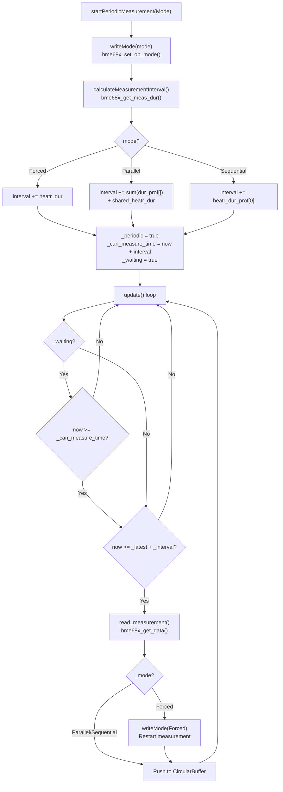

**Sources:** [src/unit/unit_BME688.cpp:726-763](), [src/unit/unit_BME688.cpp:354-408](), [src/unit/unit_BME688.cpp:691-694]()

---

## Single-Shot Measurements

Single-shot measurements execute one complete TPHG cycle using Forced mode and block until data is available.

### Single-Shot Execution Flow

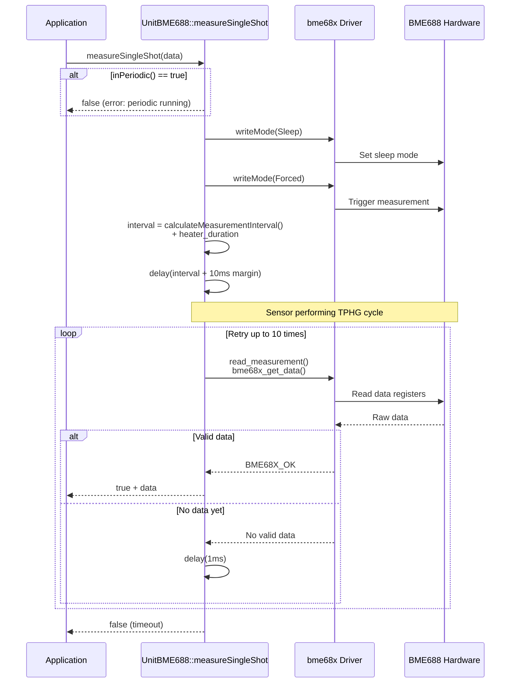

**Key Points:**

- **Blocking**: Function blocks for the entire measurement duration
- **Forced Mode**: Always uses Forced mode, sensor returns to Sleep after
- **Timing**: `interval = TPH_duration + heater_duration + 10ms margin`
- **Retry Logic**: Up to 10 retries with 1ms delay if data not immediately ready
- **Incompatible with Periodic**: Cannot run while `inPeriodic()` is true

**Sources:** [src/unit/unit_BME688.cpp:696-724]()

---

## Temperature, Pressure, Humidity (TPH) Configuration

TPH settings control measurement quality and sensor power consumption through oversampling and filtering.

### Oversampling Settings

```cpp
enum class Oversampling : uint8_t {
    None,  // Skipped (measurement disabled)
    x1,    // 1x oversampling (fastest)
    x2,    // 2x oversampling
    x4,    // 4x oversampling
    x8,    // 8x oversampling
    x16,   // 16x oversampling (highest quality)
};
```

### IIR Filter Coefficients

```cpp
enum class Filter : uint8_t {
    None,       // No filtering
    Coeff_1,    // Filter coefficient 1
    Coeff_3,    // Filter coefficient 3
    Coeff_7,    // Filter coefficient 7
    Coeff_15,   // Filter coefficient 15
    Coeff_31,   // Filter coefficient 31
    Coeff_63,   // Filter coefficient 63
    Coeff_127,  // Filter coefficient 127 (max smoothing)
};
```

### TPH Configuration Methods

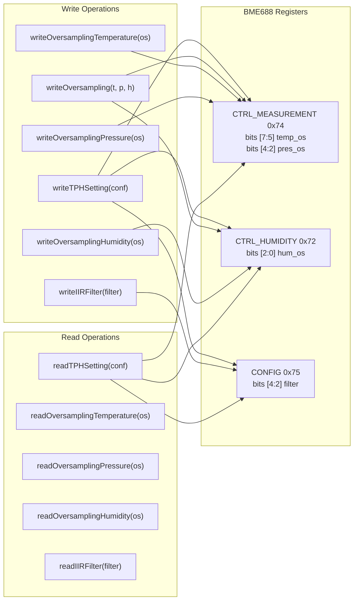

**Sources:** [src/unit/unit_BME688.hpp:96-118](), [src/unit/unit_BME688.cpp:534-660]()

---

## Gas Sensor and Heater Configuration

The gas sensor requires heating to specific temperatures for VOC detection. Heater configuration varies by measurement mode.

### Heater Configuration Structure

```cpp
struct bme68xHeatrConf {
    uint8_t enable;                     // Heater on/off
    uint16_t heatr_temp;                // Target temp (°C) for Forced/Sequential
    uint16_t heatr_dur;                 // Duration (ms) for Forced/Sequential
    
    uint8_t profile_len;                // Number of profiles for Parallel
    uint16_t heatr_temp_prof[10];       // Temperature profile for Parallel
    uint16_t heatr_dur_prof[10];        // Duration profile for Parallel
    uint16_t shared_heatr_dur;          // Shared duration for Parallel
    
    uint16_t temp_prof[10];             // Internal storage
    uint16_t dur_prof[10];              // Internal storage
};
```

### Heater Profiles by Mode

```mermaid
flowchart TD
    subgraph Forced["Forced Mode"]
        F_HEAT["Single heater config<br/>heatr_temp: 300°C<br/>heatr_dur: 100ms"]
        F_MEAS["Measure TPHG"]
        F_SLEEP["Return to Sleep"]
        
        F_HEAT --> F_MEAS
        F_MEAS --> F_SLEEP
    end
    
    subgraph Sequential["Sequential Mode"]
        S_HEAT["Single heater config<br/>heatr_dur_prof[0]"]
        S_MEAS1["Measure T"]
        S_MEAS2["Measure P"]
        S_MEAS3["Measure H"]
        S_MEAS4["Measure G"]
        S_LOOP["Repeat"]
        
        S_HEAT --> S_MEAS1
        S_MEAS1 --> S_MEAS2
        S_MEAS2 --> S_MEAS3
        S_MEAS3 --> S_MEAS4
        S_MEAS4 --> S_LOOP
        S_LOOP --> S_HEAT
    end
    
    subgraph Parallel["Parallel Mode"]
        P_PROF["Up to 10 profiles<br/>heatr_temp_prof[0..9]<br/>heatr_dur_prof[0..9]"]
        P_SHARED["shared_heatr_dur"]
        P_MEAS["Measure each profile"]
        P_LOOP["Repeat cycle"]
        
        P_PROF --> P_MEAS
        P_SHARED --> P_MEAS
        P_MEAS --> P_LOOP
        P_LOOP --> P_PROF
    end
```

### Heater API Methods

| Method | Parameters | Description |
|--------|-----------|-------------|
| `readHeaterSetting()` | `bme68xHeatrConf& hs` | Read current heater configuration |
| `writeHeaterSetting()` | `Mode mode, bme68xHeatrConf& hs` | Write heater configuration for specified mode |
| `setAmbientTemperature()` | `int8_t temp` | Set ambient temperature for heater calculations |
| `ambientTemperature()` | - | Get current ambient temperature setting |

**Sources:** [src/unit/unit_BME688.hpp:76-84](), [src/unit/unit_BME688.cpp:662-674](), [src/unit/unit_BME688.cpp:667-674]()

---

## BSEC2 State and Configuration Management

BSEC2 maintains internal state that must be persisted for optimal IAQ calculation accuracy. The library provides methods to save and restore this state.

### State Persistence Workflow

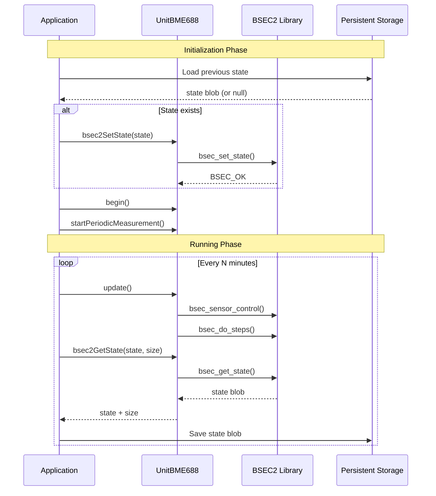

### Configuration Management

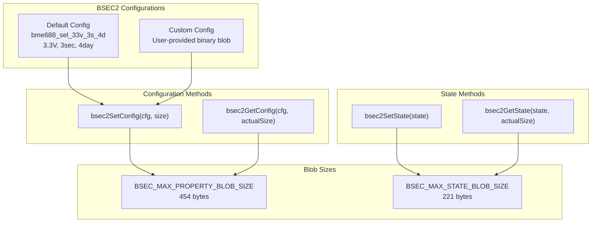

**Key Constants:**
- `BSEC_MAX_PROPERTY_BLOB_SIZE`: 454 bytes (configuration)
- `BSEC_MAX_STATE_BLOB_SIZE`: 221 bytes (state)
- `BSEC_MAX_WORKBUFFER_SIZE`: Work buffer for operations

**Sources:** [src/unit/unit_BME688.cpp:799-824](), [src/unit/unit_BME688.hpp:789-819]()

---

## Calibration Parameters

The BME688 stores factory calibration parameters in non-volatile memory. These parameters are loaded during initialization and used for compensation calculations.

### Calibration Data Structure

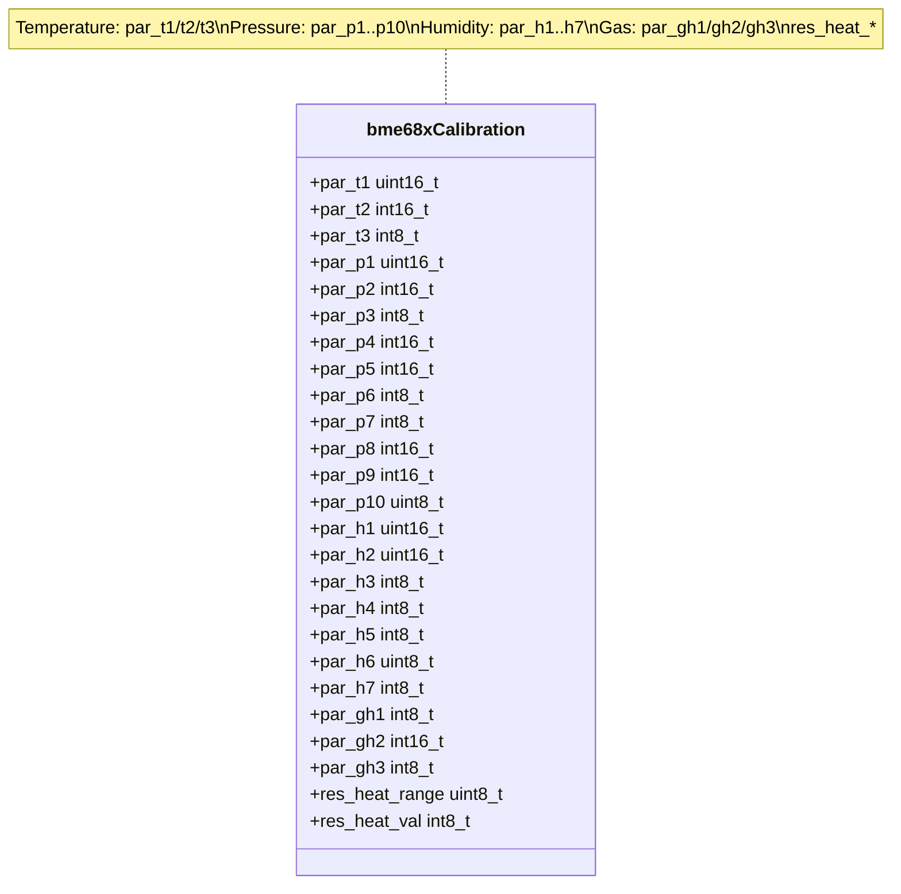

### Calibration Register Mapping

The calibration data is stored across three register groups:

| Register Group | Address | Size | Parameters |
|----------------|---------|------|------------|
| Group 0 | 0x8A | 23 bytes | par_t2, par_t3, par_p1-p10 |
| Group 1 | 0xE1 | 14 bytes | par_t1, par_h1-h7, par_gh1-gh3 |
| Group 2 | 0x00 | 3 bytes | res_heat_range, res_heat_val |

### Calibration API

| Method | Description | Use Case |
|--------|-------------|----------|
| `calibration()` | Get current calibration (read-only) | Inspect factory calibration |
| `readCalibration(c)` | Read calibration from sensor | Backup/verify calibration |
| `writeCalibration(c)` | Write calibration to sensor | Restore after reset |

**Warning**: Writing calibration parameters is generally not needed as they are factory-set and persist across resets. Only modify if you have specific calibration data from Bosch.

**Sources:** [src/unit/unit_BME688.hpp:86-89](), [src/unit/unit_BME688.cpp:436-481](), [src/unit/unit_BME688.cpp:483-532]()

---

## Data Access and Measurement Retrieval

### Data Structure Hierarchy

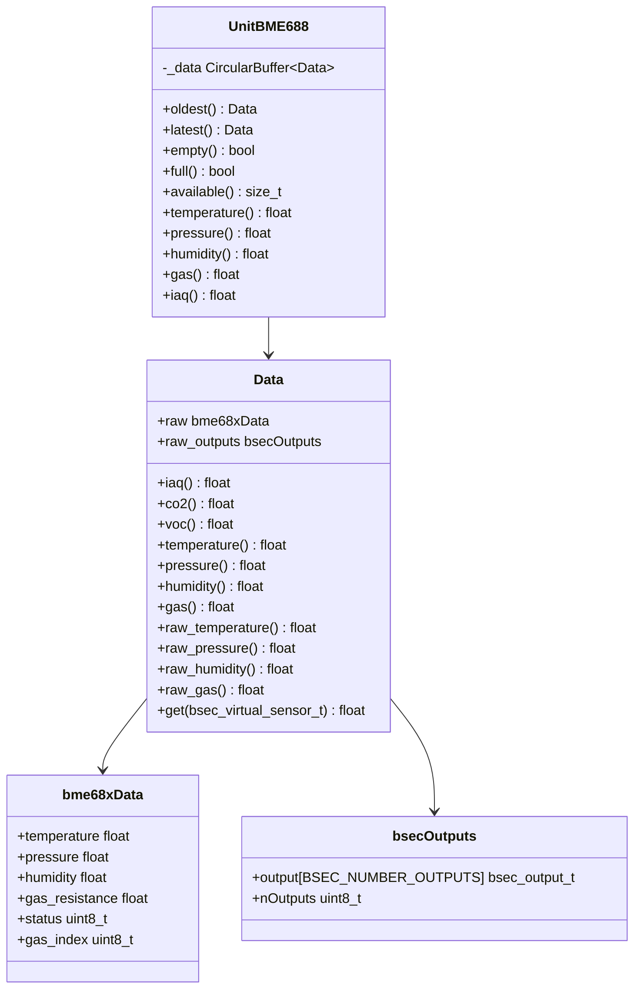

### Access Patterns

#### Simple Access (Most Recent Value)

```cpp
// Direct access to oldest buffered measurement
float temp = unit.temperature();      // °C
float pres = unit.pressure();         // Pa
float hum = unit.humidity();          // %
float gas = unit.gas();               // Ω

#if defined(UNIT_BME688_USING_BSEC2)
float iaq = unit.iaq();               // 0-500 scale
#endif
```

#### Circular Buffer Access

```cpp
// Check data availability
if (!unit.empty()) {
    // Access oldest measurement
    const auto& data = unit.oldest();
    
    // BSEC2 outputs (if available)
    float iaq = data.iaq();
    float co2 = data.co2();
    float voc = data.voc();
    
    // Raw sensor data (always available)
    float temp = data.raw_temperature();
    float pres = data.raw_pressure();
    float hum = data.raw_humidity();
    float gas = data.raw_gas();
}

// Iterate through buffer
for (size_t i = 0; i < unit.available(); i++) {
    const auto& data = unit[i];
    // Process data...
}
```

#### BSEC2 Virtual Sensor Access

```cpp
#if defined(UNIT_BME688_USING_BSEC2)
const auto& data = unit.oldest();

// Method 1: Named accessors
float iaq = data.iaq();
float static_iaq = data.static_iaq();
float co2 = data.co2();
float voc = data.voc();
float temp_comp = data.heat_compensated_temperature();
float hum_comp = data.heat_compensated_humidity();
float gas_pct = data.gas_percentage();

// Method 2: Generic get
float iaq = data.get(BSEC_OUTPUT_IAQ);
float co2 = data.get(BSEC_OUTPUT_CO2_EQUIVALENT);

// Status flags
bool stabilized = data.gas_stabilization();
bool burn_in_complete = data.gas_run_in_status();
#endif
```

**Sources:** [src/unit/unit_BME688.hpp:252-368](), [src/unit/unit_BME688.hpp:482-534](), [src/unit/unit_BME688.cpp:118-127]()

---

## Error Handling and Diagnostics

### Common Error Scenarios

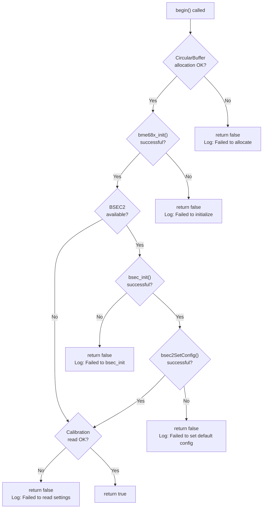

### Diagnostic Methods

| Method | Return Type | Purpose |
|--------|-------------|---------|
| `readUniqueID(id)` | `bool` | Read 32-bit unique chip ID |
| `softReset()` | `bool` | Software reset sensor |
| `selfTest()` | `bool` | Execute internal self-test |
| `readMode(mode)` | `bool` | Verify current operating mode |
| `bsec2Version()` | `bsec_version_t` | Get BSEC2 library version |

### Status Validation

```cpp
// Check periodic measurement status
if (unit.inPeriodic()) {
    // Measurements running
}

// Check data availability
if (unit.updated()) {
    // New data available since last check
}

// Verify BSEC2 subscription
#if defined(UNIT_BME688_USING_BSEC2)
if (unit.bsec2IsSubscribed(BSEC_OUTPUT_IAQ)) {
    // IAQ is subscribed
}
uint32_t subscriptions = unit.bsec2Subscription();
#endif
```

**Sources:** [src/unit/unit_BME688.cpp:410-434](), [src/unit/unit_BME688.cpp:169-262]()

---

## Platform Considerations Summary

| Feature | ESP32/ESP32-S3/ESP32-C3 | ESP32-C6 (NanoC6) |
|---------|-------------------------|-------------------|
| **BSEC2 Library** | ✅ Available | ❌ Not Available |
| **IAQ Calculation** | ✅ Yes | ❌ No |
| **CO2 Equivalent** | ✅ Yes | ❌ No |
| **VOC Equivalent** | ✅ Yes | ❌ No |
| **Raw T/P/H/Gas** | ✅ Yes | ✅ Yes |
| **Configuration Type** | BSEC2-driven | Manual TPH/heater |
| **Update Logic** | `update_bsec2()` | `update_bme688()` |
| **Measurement Modes** | Forced, Parallel (auto) | Forced, Parallel, Sequential |

### Conditional Compilation

The library uses conditional compilation to handle platform differences:

```cpp
#if defined(CONFIG_IDF_TARGET_ESP32) || \
    defined(CONFIG_IDF_TARGET_ESP32S3) || \
    defined(CONFIG_IDF_TARGET_ESP32C3)
    #define UNIT_BME688_USING_BSEC2
#endif
```

**Sources:** [src/unit/unit_BME688.hpp:22-31](), [src/unit/unit_BME688.cpp:11-16]()

---

## Example Usage Patterns

### Basic Periodic Measurement (BSEC2)

```cpp
#include <M5UnitUnifiedENV.h>

m5::unit::UnitBME688 unit;

void setup() {
    // Configure before begin
    auto cfg = unit.config();
    cfg.start_periodic = true;
    cfg.sample_rate = bme688::bsec2::SampleRate::LowPower;
    cfg.subscribe_bits = (1U << BSEC_OUTPUT_IAQ) |
                        (1U << BSEC_OUTPUT_CO2_EQUIVALENT) |
                        (1U << BSEC_OUTPUT_BREATH_VOC_EQUIVALENT);
    unit.config(cfg);
    
    unit.begin();
}

void loop() {
    unit.update();
    
    if (unit.updated()) {
        Serial.printf("IAQ: %.1f, CO2: %.0f ppm, VOC: %.2f ppm\n",
                     unit.iaq(), 
                     unit.oldest().co2(),
                     unit.oldest().voc());
    }
    
    delay(100);
}
```

### Basic Periodic Measurement (No BSEC2)

```cpp
m5::unit::UnitBME688 unit;

void setup() {
    auto cfg = unit.config();
    cfg.mode = bme688::Mode::Forced;
    cfg.oversampling_temperature = bme688::Oversampling::x2;
    cfg.heater_temperature = 320;  // °C
    cfg.heater_duration = 150;     // ms
    unit.config(cfg);
    
    unit.begin();
}

void loop() {
    unit.update();
    
    if (unit.updated()) {
        Serial.printf("Temp: %.1f°C, Gas: %.0f Ω\n",
                     unit.temperature(),
                     unit.gas());
    }
    
    delay(1000);
}
```

### Single-Shot Measurement

```cpp
bme688::bme68xData data;
if (unit.measureSingleShot(data)) {
    Serial.printf("Temp: %.2f°C, Press: %.2f Pa, Hum: %.2f%%, Gas: %.0f Ω\n",
                 data.temperature, 
                 data.pressure,
                 data.humidity,
                 data.gas_resistance);
}
```

### State Persistence (BSEC2)

```cpp
#include <Preferences.h>

Preferences prefs;
m5::unit::UnitBME688 unit;

void saveState() {
    uint8_t state[BSEC_MAX_STATE_BLOB_SIZE];
    uint32_t size;
    
    if (unit.bsec2GetState(state, size)) {
        prefs.putBytes("bsec_state", state, size);
    }
}

void loadState() {
    uint8_t state[BSEC_MAX_STATE_BLOB_SIZE];
    size_t size = prefs.getBytes("bsec_state", state, BSEC_MAX_STATE_BLOB_SIZE);
    
    if (size > 0) {
        unit.bsec2SetState(state);
    }
}

void setup() {
    prefs.begin("bme688", false);
    loadState();
    unit.begin();
}

void loop() {
    unit.update();
    
    // Save state every 6 hours
    static unsigned long lastSave = 0;
    if (millis() - lastSave > 6 * 3600 * 1000) {
        saveState();
        lastSave = millis();
    }
}
```

**Sources:** [src/unit/unit_BME688.hpp:377-447](), [src/unit/unit_BME688.cpp:169-262]()