M5Unit-ENV BMP280 (Pressure and Temperature)

# BMP280 (Pressure and Temperature)

<details>
<summary>Relevant source files</summary>

The following files were used as context for generating this wiki page:

- [src/unit/unit_BMP280.cpp](src/unit/unit_BMP280.cpp)
- [src/unit/unit_BMP280.hpp](src/unit/unit_BMP280.hpp)
- [src/unit/unit_ENV4.cpp](src/unit/unit_ENV4.cpp)
- [src/unit/unit_ENV4.hpp](src/unit/unit_ENV4.hpp)
- [src/unit/unit_SGP30.cpp](src/unit/unit_SGP30.cpp)
- [src/unit/unit_SHT40.cpp](src/unit/unit_SHT40.cpp)
- [test/embedded/test_bmp280/bmp280_test.cpp](test/embedded/test_bmp280/bmp280_test.cpp)

</details>


This page documents the BMP280 sensor unit driver, which provides barometric pressure and temperature measurements. The BMP280 is a digital pressure sensor from Bosch Sensortec featuring three power modes, configurable oversampling, IIR filtering, and six predefined use case settings optimized for different applications.

For information about the composite ENV4 unit that integrates BMP280 with SHT40, see [ENV4 (ENVIV - Composite Unit)](#4.9). For general usage patterns including periodic vs single-shot measurements, see [Usage Patterns and Examples](#5).

**Sources:** [src/unit/unit_BMP280.hpp:1-434](), [src/unit/unit_BMP280.cpp:1-595]()

---

## Class Structure and Key Types

The BMP280 driver is implemented in the `UnitBMP280` class within the `m5::unit` namespace, with sensor-specific types in the `m5::unit::bmp280` namespace.

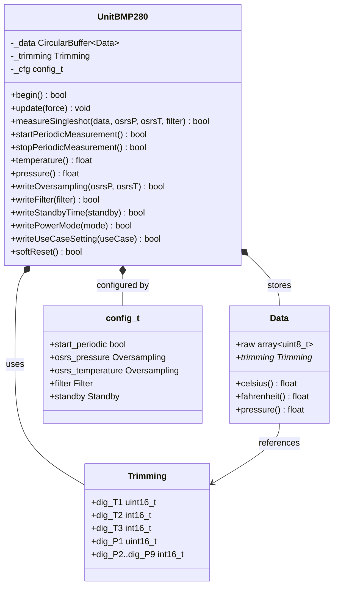

**Sources:** [src/unit/unit_BMP280.hpp:150-389](), [src/unit/unit_BMP280.hpp:130-142](), [src/unit/unit_BMP280.hpp:105-124](), [src/unit/unit_BMP280.hpp:158-169]()

---

## Power Modes and Measurement States

The BMP280 operates in three distinct power modes that determine its measurement behavior:

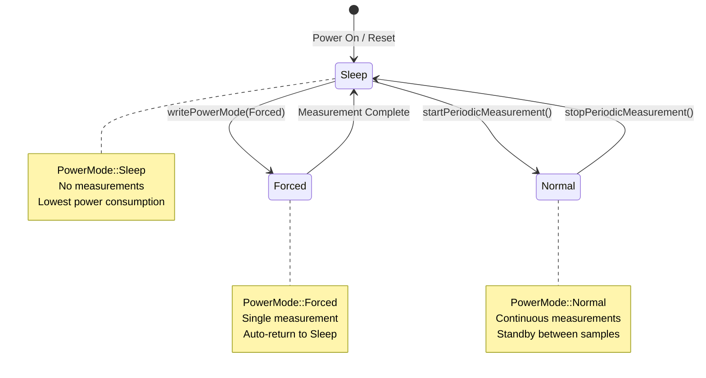

| Power Mode | Enum Value | Behavior | Use Case |
|------------|-----------|----------|----------|
| Sleep | `PowerMode::Sleep` | No measurements performed | Idle state, low power |
| Forced | `PowerMode::Forced` | Single measurement then return to Sleep | Single-shot measurements |
| Normal | `PowerMode::Normal` | Periodic measurements with standby intervals | Continuous monitoring |

**Key Implementation Details:**
- Mode changes must wait for current measurement to complete ([src/unit/unit_BMP280.cpp:469-481]())
- Writes to CONFIG register are ignored in Normal mode ([src/unit/unit_BMP280.cpp:503-510]())
- `inPeriodic()` returns true when in Normal mode ([src/unit/unit_BMP280.cpp:286-299]())

**Sources:** [src/unit/unit_BMP280.hpp:30-34](), [src/unit/unit_BMP280.cpp:26-29](), [src/unit/unit_BMP280.cpp:453-485]()

---

## Oversampling Configuration

Oversampling reduces noise by averaging multiple measurements. The BMP280 supports independent oversampling for pressure and temperature.

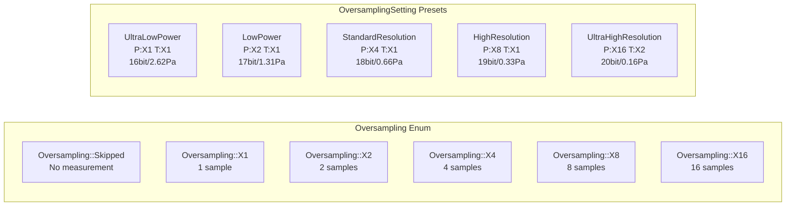

**Oversampling Methods:**

| Method | Purpose | Restrictions |
|--------|---------|--------------|
| `writeOversampling(osrsP, osrsT)` | Set both pressure and temperature | Cannot call during periodic measurement |
| `writeOversamplingPressure(osrsP)` | Set pressure only | Cannot call during periodic measurement |
| `writeOversamplingTemperature(osrsT)` | Set temperature only | Cannot call during periodic measurement |
| `writeOversampling(OversamplingSetting)` | Use preset combination | Cannot call during periodic measurement |
| `readOversampling(osrsP, osrsT)` | Read current settings | Can call anytime |

**Important Constraints:**
- Temperature oversampling cannot be `Skipped` when measuring pressure ([src/unit/unit_BMP280.cpp:354-356]())
- Temperature measurement is required for pressure compensation ([src/unit/unit_BMP280.cpp:131-133]())
- Oversampling settings cannot be changed during periodic measurement ([src/unit/unit_BMP280.cpp:403-406]())

**Sources:** [src/unit/unit_BMP280.hpp:37-59](), [src/unit/unit_BMP280.cpp:31-41](), [src/unit/unit_BMP280.cpp:390-451](), [test/embedded/test_bmp280/bmp280_test.cpp:176-255]()

---

## IIR Filter Configuration

The BMP280 includes an internal IIR (Infinite Impulse Response) filter to reduce short-term fluctuations in pressure readings caused by environmental disturbances like door slams or wind.

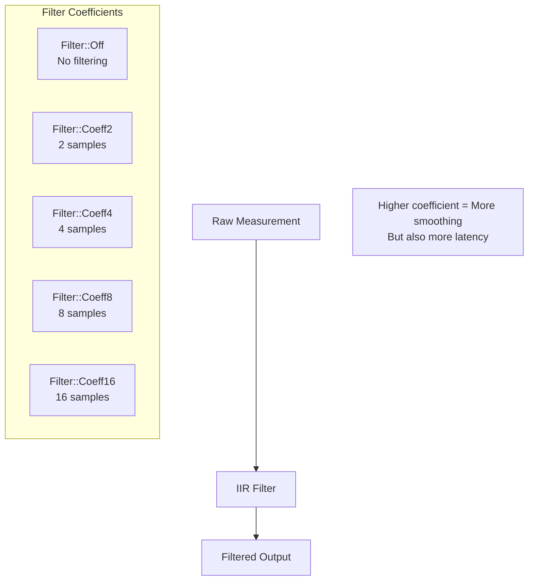

**Filter Configuration:**
- **Method:** `writeFilter(Filter)` - Set filter coefficient
- **Restriction:** Must be in Sleep mode ([src/unit/unit_BMP280.cpp:503-510]())
- **Reads:** `readFilter(Filter&)` - Get current filter setting

**Filter Trade-offs:**
- `Filter::Off` - No smoothing, fastest response, most noise
- `Filter::Coeff16` - Maximum smoothing, slowest response, least noise

**Sources:** [src/unit/unit_BMP280.hpp:62-71](), [src/unit/unit_BMP280.cpp:51-53](), [src/unit/unit_BMP280.cpp:487-518]()

---

## Standby Time and Periodic Measurement Intervals

In Normal (periodic) mode, the sensor alternates between measurement and standby periods. The standby time determines the measurement interval.

```mermaid
gantt
    title Periodic Measurement Timing (Normal Mode)
    dateFormat X
    axisFormat %L ms
    
    section Standby::Time62_5ms
    Measure  :0, 10
    Standby  :10, 72
    Measure  :72, 82
    Standby  :82, 144
    
    section Standby::Time250ms
    Measure  :0, 10
    Standby  :10, 260
    Measure  :260, 270
    Standby  :270, 520
```

**Standby Options:**

| Enum Value | Duration | Typical Use |
|------------|----------|-------------|
| `Standby::Time0_5ms` | 0.5 ms | High-speed dynamic measurements |
| `Standby::Time62_5ms` | 62.5 ms | Handheld devices |
| `Standby::Time125ms` | 125 ms | General monitoring |
| `Standby::Time250ms` | 250 ms | Weather stations |
| `Standby::Time500ms` | 500 ms | Low power applications |
| `Standby::Time1sec` | 1 second | Background monitoring |
| `Standby::Time2sec` | 2 seconds | Very low power |
| `Standby::Time4sec` | 4 seconds | Minimal power |

**Implementation Details:**
- Standby time is stored in internal `_interval` variable ([src/unit/unit_BMP280.cpp:332-333]())
- Interval lookup table maps enum to milliseconds ([src/unit/unit_BMP280.cpp:49]())
- `writeStandbyTime()` cannot be called during periodic measurement ([src/unit/unit_BMP280.cpp:530-543]())

**Sources:** [src/unit/unit_BMP280.hpp:74-86](), [src/unit/unit_BMP280.cpp:43-49](), [src/unit/unit_BMP280.cpp:520-543]()

---

## Use Case Presets

The BMP280 provides six predefined use case configurations that combine oversampling, filter, and standby settings optimized for specific applications:

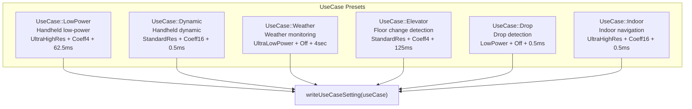

**Use Case Table:**

| Use Case | Oversampling | Filter | Standby | Application |
|----------|--------------|--------|---------|-------------|
| `LowPower` | UltraHighResolution | Coeff4 | 62.5ms | Battery-powered handhelds |
| `Dynamic` | StandardResolution | Coeff16 | 0.5ms | Fast-changing conditions |
| `Weather` | UltraLowPower | Off | 4sec | Long-term weather stations |
| `Elevator` | StandardResolution | Coeff4 | 125ms | Floor/altitude tracking |
| `Drop` | LowPower | Off | 0.5ms | Drop/fall detection |
| `Indoor` | UltraHighResolution | Coeff16 | 0.5ms | Indoor positioning systems |

**Method:**
- `writeUseCaseSetting(UseCase)` - Apply preset configuration
- Cannot be called during periodic measurement ([src/unit/unit_BMP280.cpp:545-549]())

**Sources:** [src/unit/unit_BMP280.hpp:89-99](), [src/unit/unit_BMP280.cpp:55-67](), [src/unit/unit_BMP280.cpp:545-549](), [test/embedded/test_bmp280/bmp280_test.cpp:100-116](), [test/embedded/test_bmp280/bmp280_test.cpp:325-361]()

---

## Trimming Parameters and Compensation Algorithms

The BMP280 stores factory-calibrated trimming parameters in non-volatile memory. These parameters are essential for converting raw ADC values into physical units.

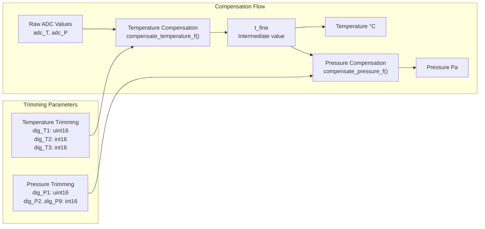

**Trimming Structure:**

The `Trimming` union ([src/unit/unit_BMP280.hpp:105-124]()) contains:
- **Temperature:** 3 parameters (dig_T1, dig_T2, dig_T3)
- **Pressure:** 9 parameters (dig_P1 through dig_P9)
- Total: 24 bytes read from register 0x88

**Compensation Algorithm Details:**

1. **Temperature Compensation** ([src/unit/unit_BMP280.cpp:170-180]()):
   - Converts 20-bit ADC value to Celsius
   - Produces `t_fine` intermediate value used for pressure calculation
   - Formula involves division and floating-point arithmetic

2. **Pressure Compensation** ([src/unit/unit_BMP280.cpp:182-200]()):
   - Requires `t_fine` from temperature compensation
   - Converts 20-bit ADC value to Pascals
   - More complex formula with multiple intermediate variables

**Key Implementation Notes:**
- Temperature must be calculated before pressure ([src/unit/unit_BMP280.cpp:131-133]())
- Returns `NaN` if trimming data is unavailable ([src/unit/unit_BMP280.cpp:124-130]())
- Both integer and floating-point versions exist ([src/unit/unit_BMP280.cpp:138-205]())
- Trimming read during `begin()` ([src/unit/unit_BMP280.cpp:263-266]())

**Sources:** [src/unit/unit_BMP280.hpp:105-124](), [src/unit/unit_BMP280.cpp:121-205](), [src/unit/unit_BMP280.cpp:212-237](), [src/unit/unit_BMP280.cpp:568-571]()

---

## Data Structure and Measurement Reading

The `bmp280::Data` structure holds measurement results and provides conversion methods:

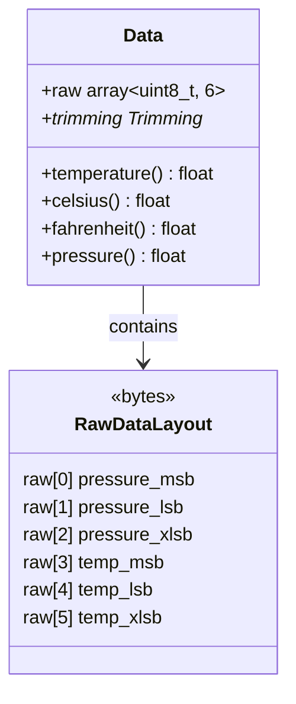

**Data Access Methods:**

| Method | Return Type | Description |
|--------|-------------|-------------|
| `celsius()` | `float` | Temperature in Celsius |
| `fahrenheit()` | `float` | Temperature in Fahrenheit |
| `temperature()` | `float` | Alias for `celsius()` |
| `pressure()` | `float` | Pressure in Pascals |

**Measurement Reading Requirements:**

The BMP280 datasheet specifies that all 6 data registers must be read in a single burst to ensure data consistency ([src/unit/unit_BMP280.cpp:583-589]()):

```
// Datasheet: "Shadowing will only work if all data registers 
// are read in a single burst read."
readRegister(GET_MEASUREMENT, d.raw.data(), d.raw.size(), 0)
```

**NOT_MEASURED Detection:**

When oversampling is set to `Skipped`, the sensor returns a sentinel value `0x800000` ([src/unit/unit_BMP280.cpp:24]()). The data methods check for this and return `NaN`:

```cpp
return (adc_T != NOT_MEASURED) ? c.temperature(...) 
                               : std::numeric_limits<float>::quiet_NaN();
```

**Sources:** [src/unit/unit_BMP280.hpp:130-142](), [src/unit/unit_BMP280.cpp:212-237](), [src/unit/unit_BMP280.cpp:579-591]()

---

## Periodic Measurement Mode

Periodic measurement mode continuously measures pressure and temperature at regular intervals, storing results in a circular buffer.

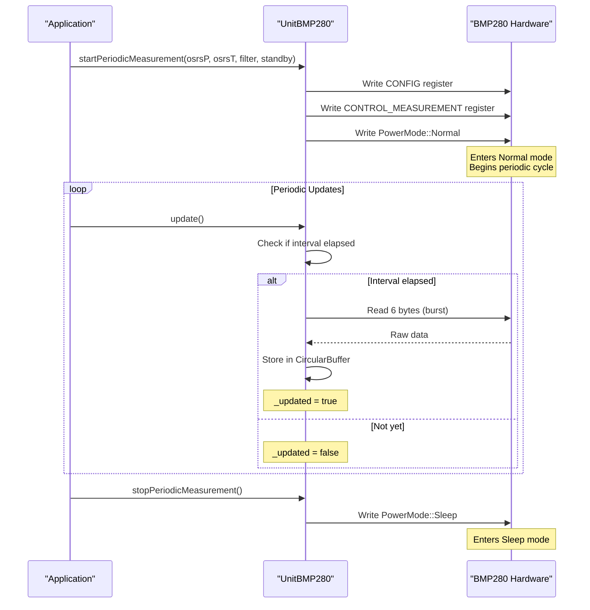

**Starting Periodic Measurement:**

Two overloaded methods are available:

1. **With Parameters** ([src/unit/unit_BMP280.cpp:302-320]()):
   ```cpp
   bool startPeriodicMeasurement(
       Oversampling osrsPressure,
       Oversampling osrsTemperature,
       Filter filter,
       Standby st
   );
   ```

2. **Using Current Settings** ([src/unit/unit_BMP280.cpp:322-336]()):
   ```cpp
   bool startPeriodicMeasurement();
   ```

**Update Cycle:**

The `update()` method ([src/unit/unit_BMP280.cpp:283-300]()) checks timing and reads data:
1. Verify periodic mode is active
2. Calculate if interval has elapsed since last read
3. Read measurement if interval passed
4. Push data to circular buffer
5. Update `_latest` timestamp

**Configuration on Begin:**

The `config_t` structure controls automatic startup ([src/unit/unit_BMP280.hpp:158-169]()):
```cpp
struct config_t {
    bool start_periodic{true};              // Auto-start?
    Oversampling osrs_pressure{X16};        // Initial pressure oversampling
    Oversampling osrs_temperature{X2};      // Initial temp oversampling
    Filter filter{Coeff16};                 // Initial filter
    Standby standby{Time1sec};              // Initial standby
};
```

**Sources:** [src/unit/unit_BMP280.hpp:224-255](), [src/unit/unit_BMP280.cpp:283-336](), [src/unit/unit_BMP280.cpp:278-280]()

---

## Single-Shot Measurement Mode

Single-shot mode performs one measurement on demand without continuous monitoring. The sensor automatically returns to Sleep mode after measurement completes.

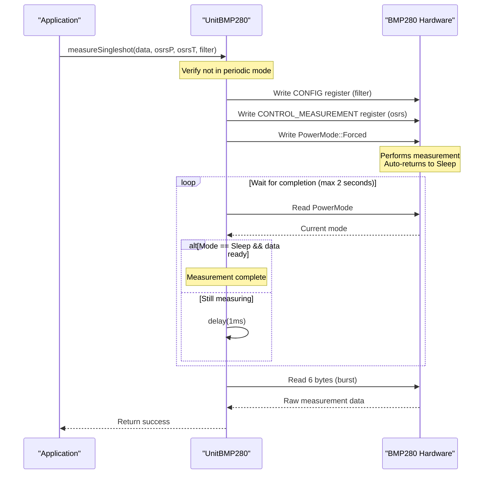

**Single-Shot Methods:**

1. **With Parameters** ([src/unit/unit_BMP280.cpp:347-364]()):
   ```cpp
   bool measureSingleshot(
       Data& d,
       Oversampling osrsPressure,
       Oversampling osrsTemperature,
       Filter filter
   );
   ```
   - Configures all settings before measurement
   - Settings are persistent after measurement

2. **Using Current Settings** ([src/unit/unit_BMP280.cpp:366-388]()):
   ```cpp
   bool measureSingleshot(Data& d);
   ```
   - Uses existing register configuration
   - Writes only PowerMode::Forced

**Timing and Completion Detection:**

The implementation waits for measurement completion by polling:
1. Write `PowerMode::Forced` to start measurement
2. Poll power mode register
3. Wait until mode returns to `PowerMode::Sleep`
4. Verify data ready status bit
5. Read measurement data
6. Timeout after 2 seconds ([src/unit/unit_BMP280.cpp:375]())

**Restrictions:**
- Cannot call during periodic measurement ([src/unit/unit_BMP280.cpp:350-352]())
- Temperature oversampling cannot be `Skipped` ([src/unit/unit_BMP280.cpp:354-356]())

**Sources:** [src/unit/unit_BMP280.hpp:258-277](), [src/unit/unit_BMP280.cpp:347-388](), [test/embedded/test_bmp280/bmp280_test.cpp:398-462]()

---

## Register Map and Hardware Interface

The BMP280 communicates via I2C with a defined register map for configuration and data access.

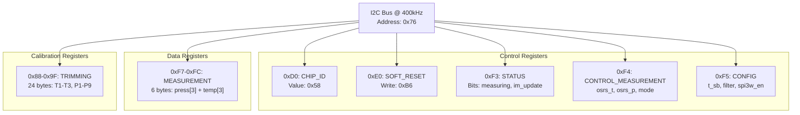

**Key Registers:**

| Address | Name | Purpose | Access |
|---------|------|---------|--------|
| 0xD0 | CHIP_ID | Verify sensor identity (0x58) | Read |
| 0xE0 | SOFT_RESET | Software reset (write 0xB6) | Write |
| 0xF3 | STATUS | Check measurement status | Read |
| 0xF4 | CONTROL_MEASUREMENT | Configure oversampling and mode | Read/Write |
| 0xF5 | CONFIG | Configure filter and standby | Read/Write |
| 0xF7-0xFC | MEASUREMENT | Read pressure and temperature | Read (burst) |
| 0x88-0x9F | TRIMMING | Calibration parameters | Read (once) |

**Status Register Bits:**
- Bit 3: `measuring` - Set when conversion is running
- Bit 0: `im_update` - Set when NVM data is being copied

**Data Ready Check** ([src/unit/unit_BMP280.cpp:573-577]()):
```cpp
bool is_data_ready() {
    uint8_t s{0xFF};
    return readRegister8(GET_STATUS, s, 0) && 
           ((s & 0x09 /* Measuring, im_update */) == 0x00);
}
```

**I2C Configuration:**
- Default address: `0x76` ([src/unit/unit_BMP280.hpp:151]())
- Bus speed: 400 kHz ([src/unit/unit_BMP280.hpp:175]())

**Sources:** [src/unit/unit_BMP280.hpp:393-427](), [src/unit/unit_BMP280.cpp:573-577](), [src/unit/unit_BMP280.cpp:22-24](), [src/unit/unit_BMP280.cpp:551-565]()

---

## Initialization and Reset

The `begin()` method initializes the sensor and optionally starts periodic measurement.

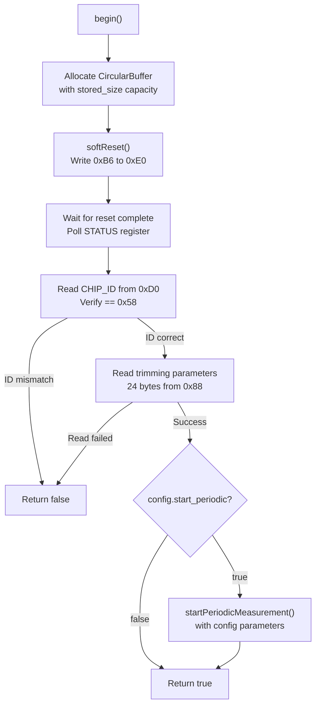

**Initialization Sequence** ([src/unit/unit_BMP280.cpp:245-281]()):

1. **Buffer Allocation:**
   - Creates `CircularBuffer<Data>` with capacity from `stored_size`
   - Default capacity is 1, configurable via component config

2. **Soft Reset:**
   - Writes `0xB6` to SOFT_RESET register
   - Waits up to 100ms for `im_update` bit to clear
   - Sets `_periodic = false` ([src/unit/unit_BMP280.cpp:558]())

3. **Chip Identification:**
   - Reads CHIP_ID register
   - Verifies value is `0x58` (BMP280 identifier)
   - Returns failure if mismatch

4. **Calibration Data:**
   - Reads 24 bytes of trimming parameters
   - Stored in `_trimming` member variable
   - Essential for data compensation

5. **Optional Auto-Start:**
   - Checks `config_t::start_periodic` flag
   - If true, calls `startPeriodicMeasurement()` with config parameters

**Reset Effects:**
- All registers return to default values
- Power mode becomes Sleep
- Oversampling: both Skipped
- Filter: Off
- Standby: Time0_5ms
- Periodic measurement flag cleared

**Sources:** [src/unit/unit_BMP280.cpp:245-281](), [src/unit/unit_BMP280.cpp:551-565](), [src/unit/unit_BMP280.hpp:158-169]()

---

## Integration in ENV4 Composite Unit

The BMP280 is integrated into the ENV4 composite unit alongside the SHT40 sensor.

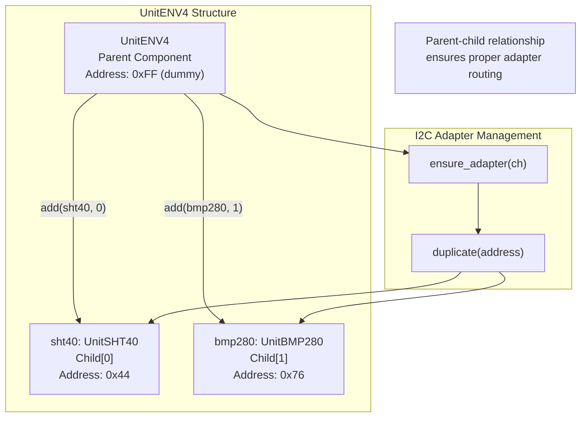

**ENV4 Constructor** ([src/unit/unit_ENV4.cpp:23-30]()):
```cpp
UnitENV4::UnitENV4(const uint8_t addr) : Component(addr) {
    auto cfg = component_config();
    cfg.max_children = 2;
    component_config(cfg);
    _valid = add(sht40, 0) && add(bmp280, 1);
}
```

**Key Integration Points:**
1. **Public Members:** ENV4 exposes `sht40` and `bmp280` as public members ([src/unit/unit_ENV4.hpp:31-32]())
2. **Adapter Duplication:** `ensure_adapter()` creates I2C adapters with correct addresses ([src/unit/unit_ENV4.cpp:32-45]())
3. **Dual Temperature Readings:** Both sensors provide temperature, allowing cross-validation
4. **Independent Operation:** Each child unit can be accessed and configured separately

**Usage Pattern:**
```cpp
UnitENV4 env4;
env4.begin();

// Access BMP280 directly
float pressure = env4.bmp280.pressure();
float temp1 = env4.bmp280.temperature();

// Access SHT40 for comparison
float temp2 = env4.sht40.temperature();
float humidity = env4.sht40.humidity();
```

**Sources:** [src/unit/unit_ENV4.hpp:21-54](), [src/unit/unit_ENV4.cpp:23-45]()

---

## Timing Considerations and Measurement Duration

Understanding measurement timing is critical for proper sensor operation, especially when coordinating updates or calculating timeouts.

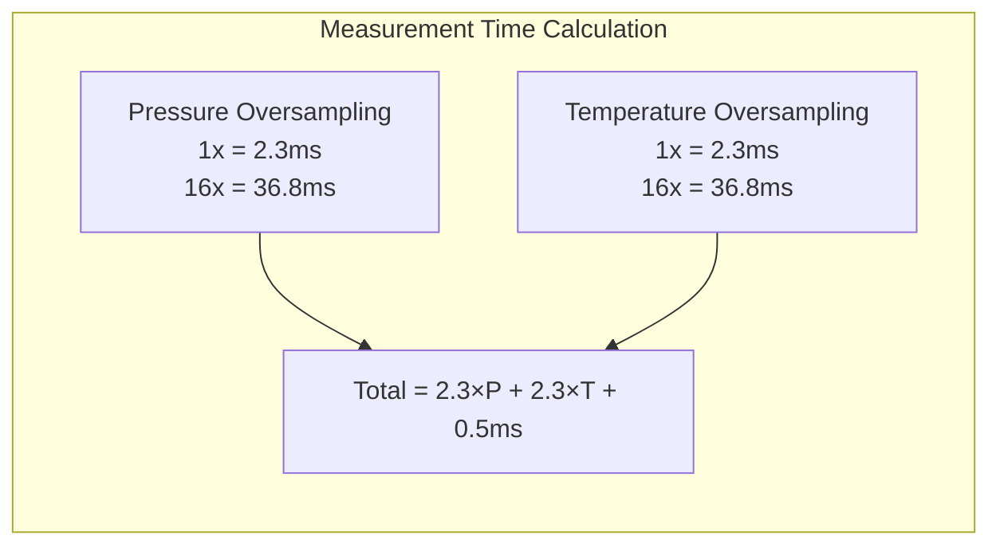

**Measurement Duration Formula:**

Test implementation shows timing calculation ([test/embedded/test_bmp280/bmp280_test.cpp:156-172]()):
```cpp
uint32_t calculate_measure_time(Oversampling osrsP, Oversampling osrsT, Filter f) {
    uint32_t px = (1U << to_underlying(osrsP) >> 1);
    uint32_t tx = (1U << to_underlying(osrsT) >> 1);
    float pt = 2.3f * px;
    float tt = 2.3f * tx;
    return pt + tt + 0.5f;
}
```

**Typical Durations:**

| Configuration | Pressure Time | Temp Time | Total |
|---------------|---------------|-----------|-------|
| X1 / X1 | 2.3 ms | 2.3 ms | ~5 ms |
| X4 / X1 | 9.2 ms | 2.3 ms | ~12 ms |
| X16 / X2 | 36.8 ms | 4.6 ms | ~42 ms |

**Timeout Values:**
- Single-shot timeout: 2 seconds ([src/unit/unit_BMP280.cpp:375]())
- Power mode change timeout: 1 second ([src/unit/unit_BMP280.cpp:473]())
- Soft reset timeout: 100 ms ([src/unit/unit_BMP280.cpp:554]())

**Periodic Measurement Intervals:**

When `Standby::Time0_5ms` is used, the actual interval depends on measurement duration:
```
Actual Interval = MAX(Measurement Duration, 0.5ms)
```

For other standby times, the interval is:
```
Actual Interval = Standby Time + Measurement Duration
```

**Sources:** [test/embedded/test_bmp280/bmp280_test.cpp:156-172](), [test/embedded/test_bmp280/bmp280_test.cpp:119-154](), [src/unit/unit_BMP280.cpp:49]()

---

## Error Handling and Validation

The BMP280 driver implements multiple layers of error checking and validation.

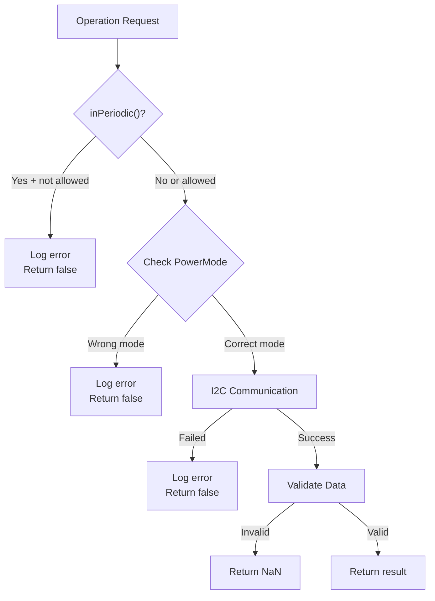

**Common Error Conditions:**

1. **Periodic Mode Restrictions** ([src/unit/unit_BMP280.cpp:306-308]()):
   - Many configuration changes blocked during periodic measurement
   - Functions return false with debug log message
   - Must call `stopPeriodicMeasurement()` first

2. **Power Mode Requirements** ([src/unit/unit_BMP280.cpp:503-510]()):
   - CONFIG register writes ignored in Normal mode
   - Must be in Sleep mode for filter changes
   - Explicit check and error return

3. **Measurement Constraints:**
   - Temperature cannot be Skipped when measuring pressure
   - Checks enforced in `measureSingleshot()` ([src/unit/unit_BMP280.cpp:354-356]())

4. **NaN Return Values:**
   - Returned when trimming unavailable ([src/unit/unit_BMP280.cpp:124]())
   - Returned when measurements skipped ([src/unit/unit_BMP280.cpp:219-220]())
   - Used for invalid/unavailable data

5. **Timeout Protection:**
   - All polling loops have timeout conditions
   - Prevents infinite waits on hardware failure

**Logging Levels:**
- `M5_LIB_LOGE`: Critical errors (communication failures, invalid state)
- `M5_LIB_LOGD`: Debug messages (mode conflicts)
- `M5_LIB_LOGV`: Verbose info (trimming parameter values)

**Sources:** [src/unit/unit_BMP280.cpp:306-308](), [src/unit/unit_BMP280.cpp:350-356](), [src/unit/unit_BMP280.cpp:503-510](), [src/unit/unit_BMP280.cpp:219-220]()

---

## Testing and Verification

The BMP280 includes comprehensive embedded tests using GoogleTest framework.

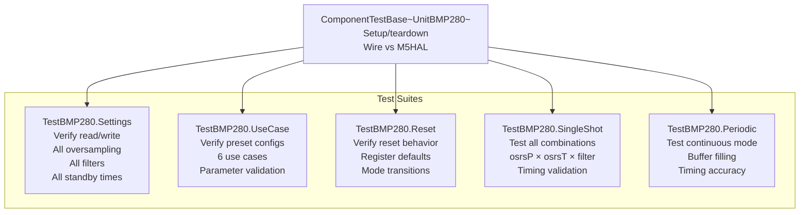

**Test Coverage:**

1. **Settings Test** ([test/embedded/test_bmp280/bmp280_test.cpp:176-323]()):
   - All oversampling combinations (6 × 6 = 36)
   - All oversampling presets (5)
   - All filter coefficients (5)
   - All standby times (8)
   - All power modes (3)
   - Periodic mode restrictions

2. **Use Case Test** ([test/embedded/test_bmp280/bmp280_test.cpp:325-361]()):
   - All 6 use case presets
   - Verification of oversampling settings
   - Verification of filter settings
   - Verification of standby times
   - Periodic mode restrictions

3. **Reset Test** ([test/embedded/test_bmp280/bmp280_test.cpp:363-396]()):
   - Register state before reset
   - Register state after reset
   - Verification of default values
   - Power mode transition to Sleep

4. **Single-Shot Test** ([test/embedded/test_bmp280/bmp280_test.cpp:398-462]()):
   - 180 combinations (6 osrsP × 6 osrsT × 5 filters)
   - Temperature-only measurements
   - Combined temperature + pressure
   - Invalid configurations (Skipped temperature)
   - Data finiteness validation

5. **Periodic Test** ([test/embedded/test_bmp280/bmp280_test.cpp:464-526]()):
   - All 6 use cases
   - Timing accuracy verification
   - Buffer capacity filling (8 samples)
   - Data availability checking
   - Buffer operations (discard, flush)

**Test Utilities:**

The `test_periodic()` helper function ([test/embedded/test_bmp280/bmp280_test.cpp:119-154]()) validates:
- First measurement latency
- Continuous measurement timing
- Update cycle correctness
- Timeout protection

**Sources:** [test/embedded/test_bmp280/bmp280_test.cpp:1-527](), [test/embedded/test_bmp280/bmp280_test.cpp:30-57]()