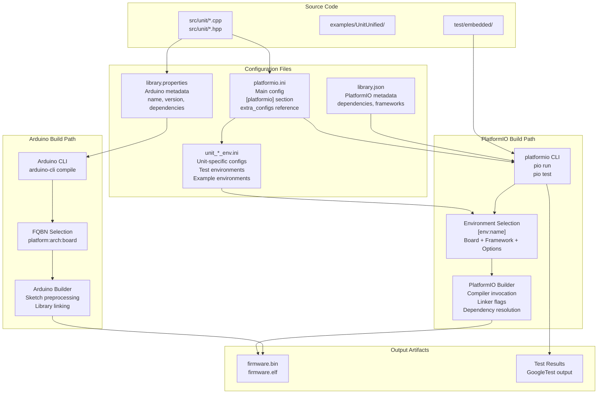
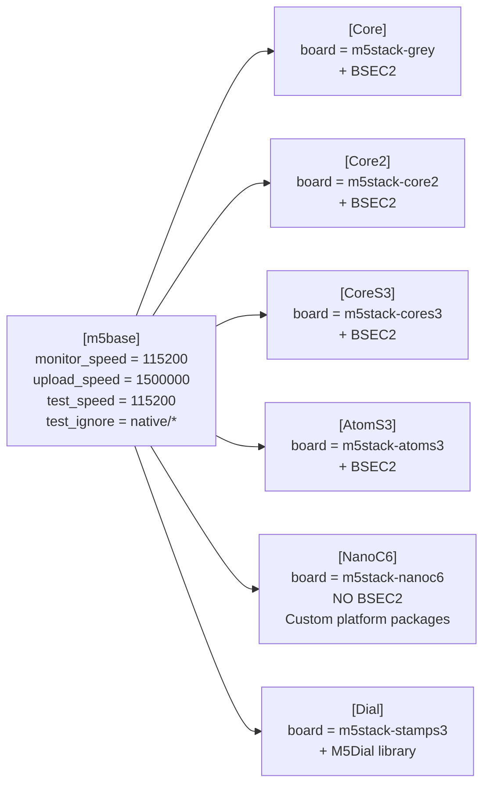
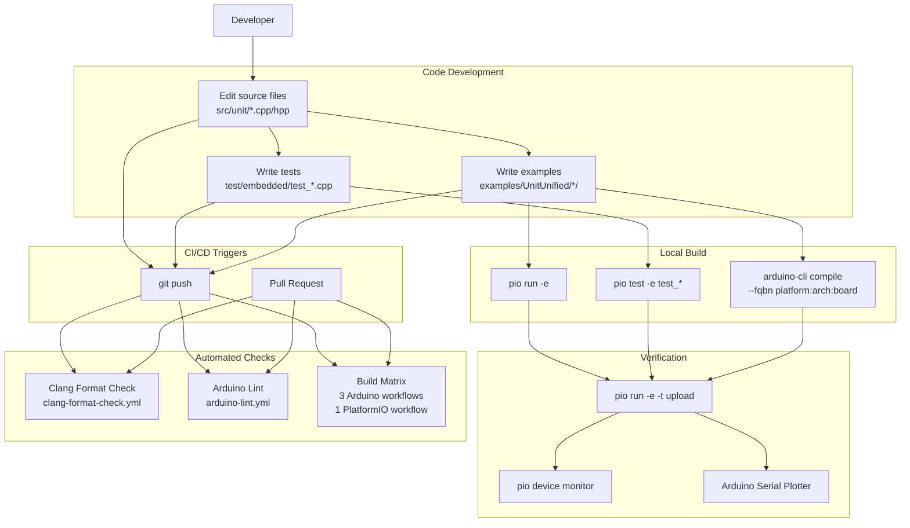

M5Unit-ENV Build System and Development

# Build System and Development

<details>
<summary>Relevant source files</summary>

The following files were used as context for generating this wiki page:

- [.github/workflows/arduino-esp-v2-build-check.yml](.github/workflows/arduino-esp-v2-build-check.yml)
- [.github/workflows/arduino-esp-v3-build-check.yml](.github/workflows/arduino-esp-v3-build-check.yml)
- [.github/workflows/arduino-m5-build-check.yml](.github/workflows/arduino-m5-build-check.yml)
- [platformio.ini](platformio.ini)
- [src/M5UnitUnifiedENV.hpp](src/M5UnitUnifiedENV.hpp)
- [unit_co2_env.ini](unit_co2_env.ini)

</details>


This page provides an overview of the M5Unit-ENV build infrastructure, including the dual build system support (PlatformIO and Arduino), configuration structure, multi-platform targeting, and development workflow. This document covers the high-level build system architecture and common development tasks.

For detailed PlatformIO configuration including environment inheritance and board-specific settings, see [PlatformIO Configuration](#6.1). For a comprehensive list of supported hardware and platform versions, see [Supported Boards and Platforms](#6.2). For Arduino IDE-specific usage, see [Arduino IDE Integration](#6.3). For information about the embedded testing framework, see [Testing Infrastructure](#6.4). CI/CD pipeline details are covered in [Continuous Integration](#7).

## Build System Architecture

The M5Unit-ENV library supports two parallel build ecosystems: **PlatformIO** for advanced development workflows and **Arduino** for educational and hobbyist use cases. Both systems build the same source code but use different configuration mechanisms and toolchains.



**Sources:** [platformio.ini:1-204](), [library.properties](), [library.json](), [src/M5UnitUnifiedENV.hpp:1-56]()

## Configuration File Hierarchy

PlatformIO configuration is split across multiple files using an inheritance model. The base `platformio.ini` defines common settings and references unit-specific configuration files.

```mermaid
graph TB
    MAIN["platformio.ini<br/>[platformio] extra_configs<br/>[env] base settings<br/>lib_deps, build_flags"]
    
    subgraph "Base Sections"
        ENV["[env]<br/>Common build flags<br/>lib_ldf_mode = deep<br/>test_framework = googletest"]
        BSEC2["[bsec2]<br/>lib_deps = bsec2"]
        M5BASE["[m5base]<br/>Monitor settings<br/>Upload speed<br/>Test filters"]
    end
    
    subgraph "Board Configurations"
        CORE["[Core]<br/>extends = m5base<br/>board = m5stack-grey<br/>lib_deps with BSEC2"]
        CORES3["[CoreS3]<br/>extends = m5base<br/>board = m5stack-cores3"]
        NANOC6["[NanoC6]<br/>extends = m5base<br/>board = m5stack-nanoc6<br/>NO BSEC2"]
        ATOMS3["[AtomS3]<br/>extends = m5base<br/>board = m5stack-atoms3"]
    end
    
    subgraph "Framework Variants"
        ARD_LATEST["[arduino_latest]<br/>platform = espressif32@6.8.1<br/>framework = arduino"]
        ARD_6_6_0["[arduino_6_6_0]<br/>platform = espressif32@6.6.0"]
        ARD_4_4_0["[arduino_4_4_0]<br/>platform = espressif32@4.4.0"]
        ESP_IDF["[esp-idf]<br/>platform = espressif32@6.8.1<br/>framework = espidf"]
    end
    
    subgraph "Build Option Profiles"
        OPT_RELEASE["[option_release]<br/>build_type = release<br/>CORE_DEBUG_LEVEL = 3<br/>LOG_LOCAL_LEVEL = 3"]
        OPT_LOG["[option_log]<br/>build_type = release<br/>CORE_DEBUG_LEVEL = 5<br/>LOG_LOCAL_LEVEL = 5"]
        OPT_DEBUG["[option_debug]<br/>build_type = debug<br/>DEBUG defined<br/>All log levels = 5"]
    end
    
    subgraph "Unit-Specific Files"
        CO2_INI["unit_co2_env.ini<br/>[env:test_SCD40_Core]<br/>[env:UnitCO2_PlotToSerial_*]"]
        ENV3_INI["unit_env3_env.ini<br/>ENV3 test/example envs"]
        ENVPRO_INI["unit_envpro_env.ini<br/>BME688 test/example envs"]
    end
    
    subgraph "Concrete Environments"
        TEST_ENV["[env:test_SCD40_Core]<br/>extends = Core, option_release, arduino_latest<br/>test_filter = embedded/test_scd40<br/>lib_deps += googletest"]
        EXAMPLE_ENV["[env:UnitCO2_PlotToSerial_Core_Arduino_latest]<br/>extends = Core, option_release, arduino_latest<br/>build_src_filter = examples/UnitUnified/UnitCO2/PlotToSerial"]
    end
    
    MAIN --> ENV
    MAIN --> BSEC2
    MAIN --> M5BASE
    MAIN --> CO2_INI
    MAIN --> ENV3_INI
    MAIN --> ENVPRO_INI
    
    M5BASE --> CORE
    M5BASE --> CORES3
    M5BASE --> NANOC6
    M5BASE --> ATOMS3
    
    CO2_INI --> TEST_ENV
    CO2_INI --> EXAMPLE_ENV
    
    TEST_ENV --> CORE
    TEST_ENV --> OPT_RELEASE
    TEST_ENV --> ARD_LATEST
    
    EXAMPLE_ENV --> CORE
    EXAMPLE_ENV --> OPT_RELEASE
    EXAMPLE_ENV --> ARD_LATEST
```



**Sources:** [platformio.ini:1-204](), [unit_co2_env.ini:1-338]()

The `extra_configs` directive at [platformio.ini:6]() loads unit-specific INI files:
- `unit_co2_env.ini` - SCD40/SCD41 CO2 sensor configurations
- `unit_env3_env.ini` - ENV3 composite unit configurations  
- `unit_env4_env.ini` - ENV4 composite unit configurations
- `unit_envpro_env.ini` - BME688 ENVPro configurations
- `unit_tvoc_env.ini` - SGP30 TVOC sensor configurations

## Framework and Platform Versions

The library supports multiple versions of the Espressif32 Arduino platform to ensure compatibility across different hardware and toolchain versions.

| Framework Profile | Platform Version | ESP-IDF Version | Use Case |
|------------------|------------------|-----------------|----------|
| `arduino_latest` | espressif32@6.8.1 | IDF 5.1 | Latest features, ESP32-C6 support |
| `arduino_6_6_0` | espressif32@6.6.0 | IDF 5.1 | Stable recent version |
| `arduino_6_0_1` | espressif32@6.0.1 | IDF 5.1 | Earlier 6.x baseline |
| `arduino_5_4_0` | espressif32@5.4.0 | IDF 4.4 | Legacy compatibility |
| `arduino_4_4_0` | espressif32@4.4.0 | IDF 4.4 | Older hardware support |
| `esp-idf` | espressif32@6.8.1 | IDF 5.1 (native) | ESP-IDF framework (not Arduino) |

**Sources:** [platformio.ini:138-165]()

## Build Option Profiles

Four build option profiles control debug output and optimization levels. These are defined at [platformio.ini:167-199]() and can be mixed with board and framework configurations.

### option_release

Standard release build with moderate logging:
- `build_type = release`
- `CORE_DEBUG_LEVEL = 3` (Error level)
- `LOG_LOCAL_LEVEL = 3`
- `APP_LOG_LEVEL = 3`
- `M5_LOG_LEVEL = 3`

### option_log

Release build with verbose logging:
- `build_type = release`
- `CORE_DEBUG_LEVEL = 5` (Verbose level)
- `LOG_LOCAL_LEVEL = 5`
- `APP_LOG_LEVEL = 5`

### option_debug

Debug build with full logging and debug symbols:
- `build_type = debug`
- All log levels set to 5 (Verbose)
- `-DDEBUG` preprocessor flag defined

### option_map

Release build with linker map file generation:
- Standard release log levels (3)
- `M5_LOG_LEVEL = 0` (no M5 logging)
- `-Wl,-Map,output.map` linker flag to generate memory map

**Sources:** [platformio.ini:167-199]()

## Board Configuration Inheritance

Board configurations use inheritance to reduce duplication. All board configs extend `[m5base]` which defines common monitor and upload settings.



**Sources:** [platformio.ini:21-123]()

**Key distinction:** The NanoC6 configuration at [platformio.ini:89-97]() excludes BSEC2 due to resource constraints and uses custom platform packages to support the ESP32-C6 chip. All other boards include BSEC2 for BME688 air quality functionality.

## Library Dependencies

Base dependencies are defined at [platformio.ini:13-15]() and inherited by all environments:

```ini
lib_deps = m5stack/M5Unified
    m5stack/M5UnitUnified
    boschsensortec/BME68x Sensor library@>=1.3.40408
```

The BSEC2 dependency is defined separately at [platformio.ini:19]() and conditionally included:

```ini
[bsec2]
lib_deps = boschsensortec/bsec2@>=1.10.2610
```

Individual board configurations combine these using PlatformIO's variable expansion:
```ini
[Core]
lib_deps = ${env.lib_deps}
    ${bsec2.lib_deps}
```

The NanoC6 board omits `${bsec2.lib_deps}` to avoid memory and compatibility issues.

**Sources:** [platformio.ini:13-19](), [platformio.ini:34-35](), [platformio.ini:97]()

## Test Environment Configuration

Test environments follow a naming pattern: `test_<SENSOR>_<BOARD>`. Each test environment:
1. Extends a board configuration (e.g., `Core`)
2. Extends a build option profile (e.g., `option_release`)
3. Extends a framework version (e.g., `arduino_latest`)
4. Adds GoogleTest library dependency
5. Sets `test_filter` to target specific test directory

Example test environment at [unit_co2_env.ini:5-9]():
```ini
[env:test_SCD40_Core]
extends = Core, option_release, arduino_latest
lib_deps = ${Core.lib_deps} 
    ${test_fw.lib_deps}
test_filter = embedded/test_scd40
```

The `test_fw` section at [platformio.ini:201-202]() defines the GoogleTest dependency:
```ini
[test_fw]
lib_deps = google/googletest@1.12.1
```

**Sources:** [unit_co2_env.ini:5-15](), [platformio.ini:201-202](), [platformio.ini:11-12]()

## Example Build Environment Configuration

Example environments follow the pattern: `<Unit>_<Example>_<Board>_<Framework>`. They use `build_src_filter` to include only the specific example code:

```ini
[env:UnitCO2_PlotToSerial_Core_Arduino_latest]
extends = Core, option_release, arduino_latest
build_src_filter = +<*> -<.git/> -<.svn/> +<../examples/UnitUnified/UnitCO2/PlotToSerial>
```

This pattern at [unit_co2_env.ini:178-180]() allows building example sketches as if they were the main application code, enabling compilation verification in CI/CD without manual Arduino IDE interaction.

**Sources:** [unit_co2_env.ini:178-338]()

## Development Workflow



**Sources:** [platformio.ini:1-204](), [.github/workflows/arduino-esp-v3-build-check.yml:1-126](), [.github/workflows/clang-format-check.yml]()

## Common Build Commands

### PlatformIO

List all available environments:
```bash
pio run --list-targets
```

Build a specific example for a specific board:
```bash
pio run -e UnitCO2_PlotToSerial_Core_Arduino_latest
```

Run tests for a specific sensor on a specific board:
```bash
pio test -e test_SCD40_Core
```

Build and upload:
```bash
pio run -e UnitCO2_PlotToSerial_AtomS3_Arduino_latest -t upload
```

Monitor serial output:
```bash
pio device monitor -e UnitCO2_PlotToSerial_AtomS3_Arduino_latest
```

### Arduino CLI

Compile an example:
```bash
arduino-cli compile \
  --fqbn esp32:esp32:m5stack_cores3 \
  examples/UnitUnified/UnitCO2/PlotToSerial
```

Upload to device:
```bash
arduino-cli upload \
  --fqbn esp32:esp32:m5stack_cores3 \
  -p /dev/ttyUSB0 \
  examples/UnitUnified/UnitCO2/PlotToSerial
```

**Sources:** General PlatformIO/Arduino CLI documentation

## Build System Advantages

### PlatformIO Benefits

1. **Precise dependency management** - Library versions locked in configuration
2. **Multiple environments** - Test different boards/frameworks without reconfiguration
3. **Automated testing** - GoogleTest integration with `pio test` command
4. **Advanced build options** - Granular control over compiler flags and log levels
5. **CI/CD friendly** - Deterministic builds for automation

### Arduino Benefits

1. **Simple setup** - No configuration files needed for basic usage
2. **Visual tools** - Serial Plotter for data visualization
3. **Educational** - Lower barrier to entry for beginners
4. **Library Manager** - One-click library installation
5. **Broader ecosystem** - Access to thousands of community libraries

Both systems compile the same source code defined at [src/M5UnitUnifiedENV.hpp:1-56]() and share the same external dependencies. The choice depends on development workflow preferences and project complexity.

**Sources:** [platformio.ini:1-204](), [library.properties](), [src/M5UnitUnifiedENV.hpp:1-56]()