M5Unit-ENV Calibration and Configuration

# Calibration and Configuration

<details>
<summary>Relevant source files</summary>

The following files were used as context for generating this wiki page:

- [src/unit/unit_ENV4.cpp](src/unit/unit_ENV4.cpp)
- [src/unit/unit_ENV4.hpp](src/unit/unit_ENV4.hpp)
- [src/unit/unit_SCD40.cpp](src/unit/unit_SCD40.cpp)
- [src/unit/unit_SCD41.cpp](src/unit/unit_SCD41.cpp)
- [src/unit/unit_SGP30.cpp](src/unit/unit_SGP30.cpp)
- [src/unit/unit_SHT40.cpp](src/unit/unit_SHT40.cpp)

</details>


This page documents sensor calibration workflows and configuration management across M5Unit-ENV sensor units. Coverage includes CO2 forced recalibration (FRC), automatic self-calibration (ASC) setup, SGP30 baseline persistence, temperature offset adjustment, and altitude compensation.

For general usage patterns and measurement modes, see [Usage Patterns and Examples](#5). For sensor-specific APIs, see [Sensor Units Reference](#4).

## Overview

Calibration and configuration operations require careful state management. Most calibration commands can only be executed when the sensor is not in periodic measurement mode, requiring explicit stop/start cycles. Configuration persistence varies by sensor—some settings persist across power cycles automatically, others require explicit persistence commands.

**Key Principles:**
- Calibration operations typically require idle state (periodic measurements stopped)
- Configuration must occur before starting periodic measurements or during specific windows
- Persistence mechanisms vary: automatic (SCD4x settings), manual trigger (SCD4x `persistSettings`), or application-managed (SGP30 baseline)
- Validation delays are sensor-specific and must be respected

Sources: [src/unit/unit_SCD40.cpp:78-109](), [src/unit/unit_SGP30.cpp:55-88]()

---

## CO2 Sensor Calibration (SCD40/SCD41)

The SCD40 and SCD41 CO2 sensors support multiple calibration mechanisms to maintain accuracy over time. All calibration operations enforce state preconditions.

### Automatic Self-Calibration (ASC)

ASC continuously calibrates the sensor by assuming exposure to fresh air (400 ppm CO2) at regular intervals. This is the default calibration method for most deployments.

#### Basic ASC Configuration

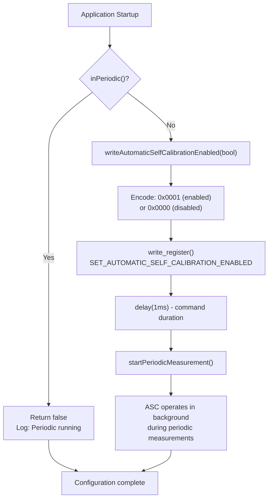

**Automatic Self-Calibration API Mapping**

| Operation | Method | Command | State Requirement | Duration |
|-----------|--------|---------|-------------------|----------|
| Enable/Disable ASC | `writeAutomaticSelfCalibrationEnabled(bool)` | `SET_AUTOMATIC_SELF_CALIBRATION_ENABLED` | Idle (not periodic) | 1 ms |
| Read ASC Status | `readAutomaticSelfCalibrationEnabled(bool&)` | `GET_AUTOMATIC_SELF_CALIBRATION_ENABLED` | Idle | 1 ms |
| Set ASC Target (ppm) | `writeAutomaticSelfCalibrationTarget(uint16_t)` | `SET_AUTOMATIC_SELF_CALIBRATION_TARGET` | Idle | 1 ms |
| Read ASC Target | `readAutomaticSelfCalibrationTarget(uint16_t&)` | `GET_AUTOMATIC_SELF_CALIBRATION_TARGET` | Idle | 1 ms |

The ASC configuration is applied during `begin()` from the stored configuration:

```cpp
// From unit_SCD40.cpp:101-104
if (!writeAutomaticSelfCalibrationEnabled(_cfg.calibration)) {
    M5_LIB_LOGE("Failed to writeAutomaticSelfCalibrationEnabled");
    return false;
}
```

Sources: [src/unit/unit_SCD40.cpp:311-335](), [src/unit/unit_SCD40.cpp:337-361]()

#### SCD41 Enhanced ASC Parameters

SCD41 adds configuration for ASC timing parameters:

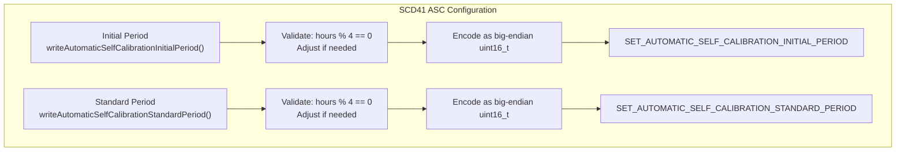

| Parameter | Method | Constraint | Default | Description |
|-----------|--------|------------|---------|-------------|
| Initial Period | `writeAutomaticSelfCalibrationInitialPeriod(uint16_t hours)` | Multiple of 4 hours | - | Duration before first ASC calculation |
| Standard Period | `writeAutomaticSelfCalibrationStandardPeriod(uint16_t hours)` | Multiple of 4 hours | - | Interval between subsequent ASC updates |

Implementation enforces 4-hour alignment:

```cpp
// From unit_SCD41.cpp:121-124
if (hours % 4) {
    M5_LIB_LOGW("Arguments are modified to multiples of 4");
}
uint16_t h = (hours >> 2) << 2;
```

Sources: [src/unit/unit_SCD41.cpp:115-128](), [src/unit/unit_SCD41.cpp:146-159]()

---

### Forced Recalibration (FRC)

FRC allows immediate calibration to a known CO2 concentration. This is used for accurate calibration in controlled environments.

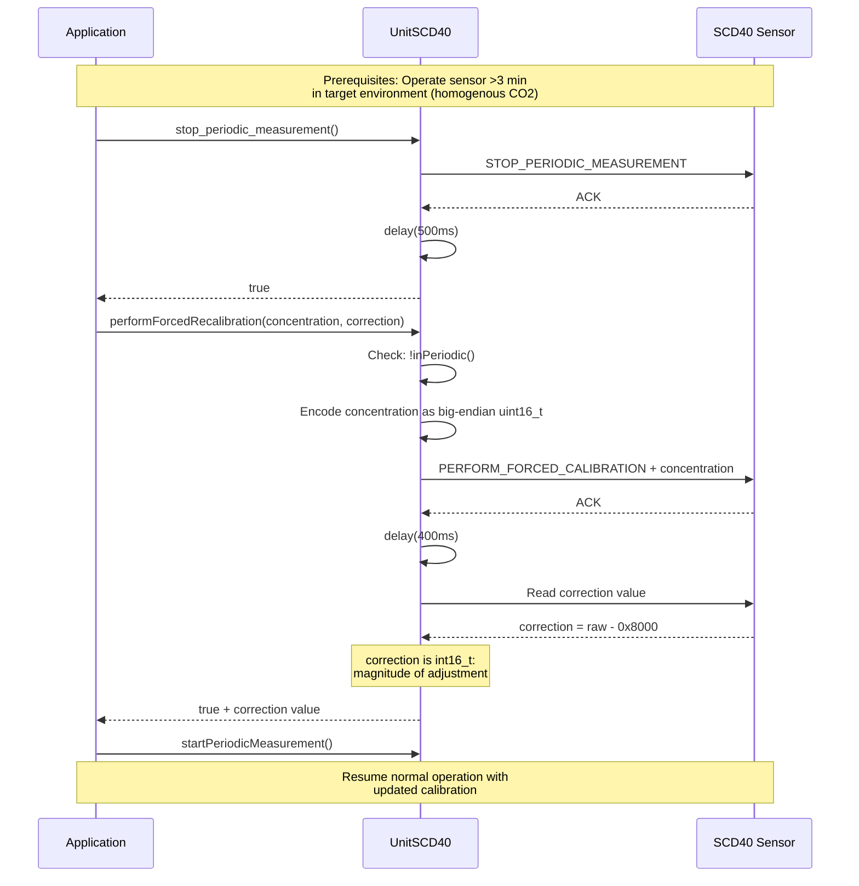

**FRC Workflow Requirements:**

1. **Pre-calibration**: Operate sensor >3 minutes in target environment with stable, homogenous CO2 concentration
2. **Stop periodic measurements**: Call `stop_periodic_measurement()` and wait 500 ms
3. **Issue FRC command**: Call `performForcedRecalibration(concentration, correction)`
   - `concentration`: Known CO2 concentration in ppm (typically 400 ppm for fresh air)
   - `correction`: Output parameter receiving magnitude of calibration adjustment
4. **Wait**: Command duration is 400 ms
5. **Validate**: Check `correction` value; 0xFFFF indicates failure
6. **Resume**: Restart periodic measurements

Implementation details:

```cpp
// From unit_SCD40.cpp:261-309
bool UnitSCD40::performForcedRecalibration(const uint16_t concentration, int16_t& correction)
{
    correction = 0;
    if (inPeriodic()) {
        M5_LIB_LOGD("Periodic measurements are running");
        return false;
    }
    
    m5::types::big_uint16_t u16(concentration);
    if (!write_register(PERFORM_FORCED_CALIBRATION, u16.data(), u16.size())) {
        return false;
    }
    m5::utility::delay(PERFORM_FORCED_CALIBRATION_DURATION);
    
    if (read_register(PERFORM_FORCED_CALIBRATION, u16.data(), u16.size()) && u16.get() != 0xFFFF) {
        correction = (int16_t)(u16.get() - 0x8000);
        return true;
    }
    return false;
}
```

Sources: [src/unit/unit_SCD40.cpp:261-309]()

---

### Temperature Offset

Temperature offset compensates for self-heating or external heat sources affecting the temperature sensor. The offset is applied internally before outputting temperature values.

**Temperature Offset Configuration**

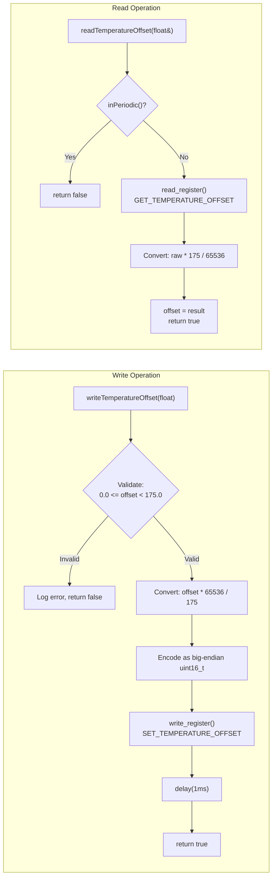

| Operation | Method | Range | Resolution | State Requirement |
|-----------|--------|-------|------------|-------------------|
| Write Offset | `writeTemperatureOffset(float offset)` | 0.0°C to 175.0°C | ~0.0027°C | Idle (not periodic) |
| Read Offset | `readTemperatureOffset(float& offset)` | - | ~0.0027°C | Idle |

Conversion formulas:

```cpp
// Write: float to uint16_t (unit_SCD40.cpp:176-177)
uint16_t tmp16 = Temperature::toUint16(offset);  // offset * 65536 / 175

// Read: uint16_t to float (unit_SCD40.cpp:192)
offset = Temperature::toFloat(u16.get());  // u16 * 175 / 65536
```

Sources: [src/unit/unit_SCD40.cpp:164-180](), [src/unit/unit_SCD40.cpp:182-196](), [src/unit/unit_SCD40.cpp:20-31]()

---

### Altitude Compensation

Sensor altitude configures the CO2 sensor to compensate for atmospheric pressure changes at different elevations. This improves CO2 measurement accuracy.

**Altitude Compensation API**

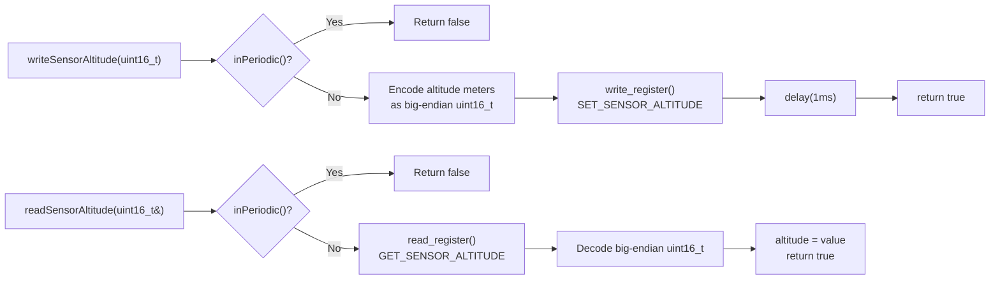

| Method | Parameter | Unit | Range | Description |
|--------|-----------|------|-------|-------------|
| `writeSensorAltitude(uint16_t altitude)` | altitude | meters above sea level | 0 - 65535 | Configure sensor altitude |
| `readSensorAltitude(uint16_t& altitude)` | altitude | meters above sea level | 0 - 65535 | Read configured altitude |

**Note**: Both altitude compensation and ambient pressure compensation serve similar purposes. Using both simultaneously is not recommended—prefer ambient pressure for dynamic environments.

Sources: [src/unit/unit_SCD40.cpp:198-223]()

---

### Ambient Pressure Compensation

Ambient pressure can be set dynamically (even during periodic measurements) to provide real-time pressure compensation for CO2 readings. This is more flexible than altitude compensation for changing environments.

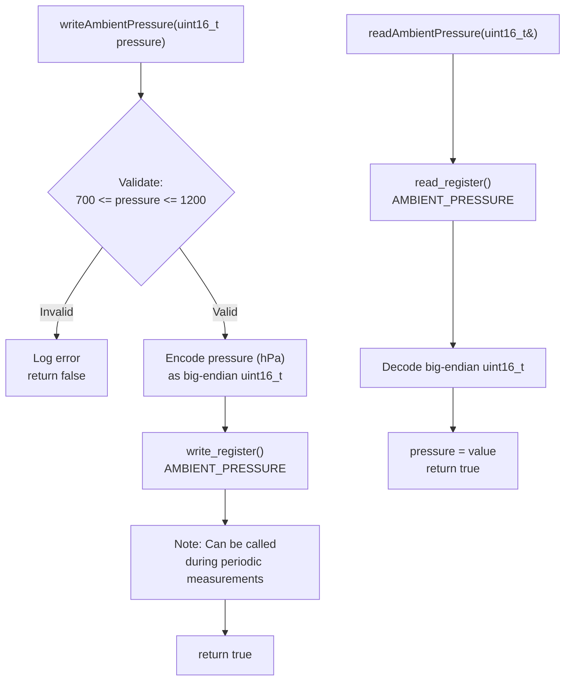

| Method | Parameter | Unit | Valid Range | State Requirement |
|--------|-----------|------|-------------|-------------------|
| `writeAmbientPressure(uint16_t pressure)` | pressure | hPa (millibar) | 700 - 1200 | Any (can run during periodic) |
| `readAmbientPressure(uint16_t& pressure)` | pressure | hPa (millibar) | 700 - 1200 | Any |

Implementation allows dynamic updates:

```cpp
// From unit_SCD40.cpp:225-242
bool UnitSCD40::writeAmbientPressure(const uint16_t pressure, const uint32_t duration)
{
    constexpr uint32_t PRESSURE_MIN{700};
    constexpr uint32_t PRESSURE_MAX{1200};

#if 0  // Commented out - allows calling during periodic
    if (inPeriodic()) {
        M5_LIB_LOGD("Periodic measurements are running");
        return false;
    }
#endif
    if (pressure < PRESSURE_MIN || pressure > PRESSURE_MAX) {
        M5_LIB_LOGE("pressure is not a valid scope (%u - %u) %u", PRESSURE_MIN, PRESSURE_MAX, pressure);
        return false;
    }
    // ... encode and write
}
```

Sources: [src/unit/unit_SCD40.cpp:225-259]()

---

### Configuration Persistence

Settings can be persisted to non-volatile memory to survive power cycles.

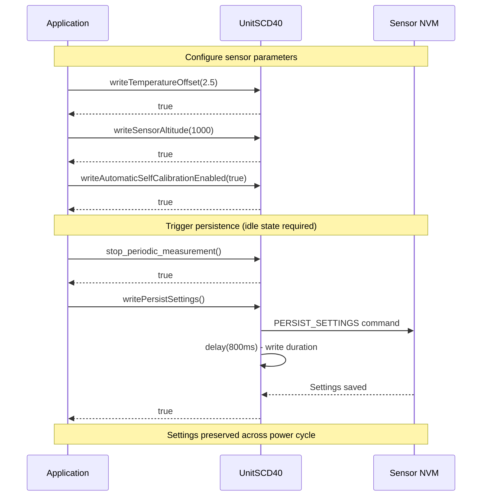

**Persistence Workflow:**

1. Stop periodic measurements
2. Configure all desired parameters (temperature offset, altitude, ASC settings)
3. Call `writePersistSettings()` to save to NVM
4. Wait for completion (800 ms default)
5. Settings persist across power cycles and resets

```cpp
// From unit_SCD40.cpp:363-375
bool UnitSCD40::writePersistSettings(const uint32_t duration)
{
    if (inPeriodic()) {
        M5_LIB_LOGD("Periodic measurements are running");
        return false;
    }
    
    if (writeRegister(PERSIST_SETTINGS)) {
        m5::utility::delay(duration);  // Default 800ms
        return true;
    }
    return false;
}
```

Sources: [src/unit/unit_SCD40.cpp:363-375]()

---

## SGP30 Baseline Management

The SGP30 TVOC/eCO2 sensor requires baseline management for accurate long-term operation. Unlike the SCD4x auto-calibration, SGP30 baseline persistence is application-managed.

### Initialization and Baseline Restoration

```mermaid
stateDiagram-v2
    [*] --> PowerOn: Device boot
    PowerOn --> IAQ_Init: IAQ_INIT command
    IAQ_Init --> Initialization: 15 second window
    
    state Initialization {
        [*] --> RestoreBaseline: writeIaqBaseline()
        RestoreBaseline --> SetHumidity: writeAbsoluteHumidity()
        SetHumidity --> [*]
    }
    
    Initialization --> FixedOutput: After 15s
    FixedOutput --> NormalOperation: Valid measurements
    
    state FixedOutput {
        note right of FixedOutput: Returns fixed values:<br/>CO2eq = 400 ppm<br/>TVOC = 0 ppb
    }
    
    state NormalOperation {
        [*] --> Measuring
        Measuring --> SaveBaseline: Every 1 hour
        SaveBaseline --> Measuring
    }
    
    NormalOperation --> [*]
```

**Critical Timing Window:**
- Baseline and humidity restoration **must** occur within the 15-second initialization period after `IAQ_INIT`
- Configuration applies during `start_periodic_measurement()`:

```cpp
// From unit_SGP30.cpp:110-117
bool UnitSGP30::start_periodic_measurement(const uint16_t co2eq, const uint16_t tvoc, 
                                           const uint16_t humidity, const uint32_t interval)
{
    return start_periodic_measurement(interval, duration) && 
           write_iaq_baseline(co2eq, tvoc) &&
           writeAbsoluteHumidity(humidity);
}
```

Sources: [src/unit/unit_SGP30.cpp:110-148](), [src/unit/unit_SGP30.cpp:55-88]()

---

### IAQ Baseline Read/Write

```mermaid
graph TB
    subgraph "Baseline Write"
        W_START["write_iaq_baseline(co2eq, tvoc)"] --> W_ENCODE["Encode with CRC"]
        W_ENCODE --> W_NOTE["Note: Order is TVOC first,<br/>then CO2eq (reversed from read)"]
        W_NOTE --> W_TVOC["TVOC: [uint16_be, CRC8]"]
        W_TVOC --> W_CO2["CO2eq: [uint16_be, CRC8]"]
        W_CO2 --> W_CMD["writeRegister()<br/>SET_IAQ_BASELINE"]
        W_CMD --> W_TIMING["Must execute within<br/>15s of IAQ_INIT"]
    end
    
    subgraph "Baseline Read"
        R_START["readIaqBaseline(co2eq&, tvoc&)"] --> R_CMD["readRegister()<br/>GET_IAQ_BASELINE"]
        R_CMD --> R_VALIDATE["Validate CRC for both values"]
        R_VALIDATE --> R_CO2["Extract CO2eq (first word)"]
        R_CO2 --> R_TVOC["Extract TVOC (second word)"]
        R_TVOC --> R_SUCCESS["return true"]
    end
```

**Baseline API**

| Operation | Method | When to Use | Notes |
|-----------|--------|-------------|-------|
| Read Baseline | `readIaqBaseline(uint16_t& co2eq, uint16_t& tvoc)` | Hourly during operation | Save to persistent storage |
| Write Baseline | Called via `start_periodic_measurement()` | At startup | Restore from persistent storage |

**Baseline Persistence Strategy:**

1. **During Operation**: Read baseline every 60 minutes using `readIaqBaseline()`
2. **Store**: Save baseline values to non-volatile storage (e.g., preferences, EEPROM)
3. **At Startup**: Restore baseline via `start_periodic_measurement(co2eq, tvoc, humidity, interval)`
4. **First Boot**: Use default values (0, 0) or allow 12-hour conditioning period

Implementation:

```cpp
// From unit_SGP30.cpp:333-347 (write - note reversed order)
bool UnitSGP30::write_iaq_baseline(const uint16_t co2eq, const uint16_t tvoc)
{
    m5::utility::CRC8_Checksum crc{};
    m5::types::big_uint16_t cc(co2eq);
    m5::types::big_uint16_t tt(tvoc);
    
    std::array<uint8_t, (2 + 1) * 2> buf{};
    // Note that the order is different for get and set
    std::memcpy(buf.data() + 0, tt.data(), 2);  // TVOC first
    buf[2] = crc.range(tt.data(), 2);
    std::memcpy(buf.data() + 3, cc.data(), 2);  // CO2eq second
    buf[5] = crc.range(cc.data(), 2);
    
    return writeRegister(SET_IAQ_BASELINE, buf.data(), buf.size());
}
```

Sources: [src/unit/unit_SGP30.cpp:183-196](), [src/unit/unit_SGP30.cpp:333-347]()

---

### Humidity Compensation

Absolute humidity compensation improves measurement accuracy. The SGP30 accepts humidity in a special fixed-point format.

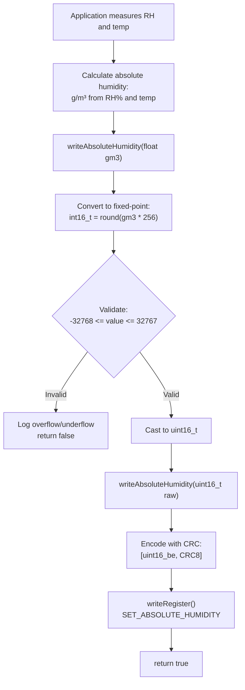

**Humidity Compensation API**

| Method | Format | Valid Range | When to Call |
|--------|--------|-------------|--------------|
| `writeAbsoluteHumidity(float gm3)` | g/m³ (floating point) | Depends on int16 overflow check | During 15s init window or periodically |
| `writeAbsoluteHumidity(uint16_t raw)` | Fixed-point (value * 256) | 0 - 65535 | Direct low-level access |

Fixed-point encoding:

```cpp
// From unit_SGP30.cpp:208-216
bool UnitSGP30::writeAbsoluteHumidity(const float gm3, const uint32_t duration)
{
    int32_t tmp = static_cast<int32_t>(std::round(gm3 * 256.f));
    if (tmp > 32767 || tmp < -32768) {
        M5_LIB_LOGE("Over/underflow: %f / %d", gm3, tmp);
        return false;
    }
    return writeAbsoluteHumidity(static_cast<uint16_t>(static_cast<int16_t>(tmp)), duration);
}
```

Sources: [src/unit/unit_SGP30.cpp:198-216]()

---

## Configuration State Management

Most calibration operations require specific sensor states. Understanding these preconditions prevents configuration failures.

### State Preconditions Matrix

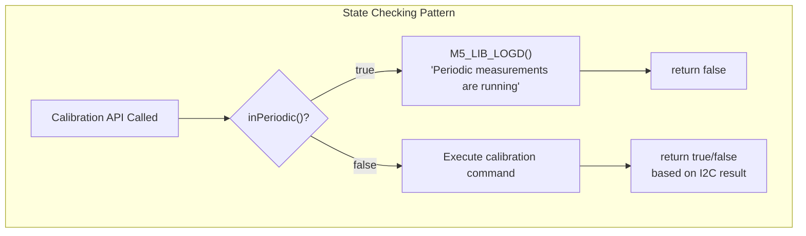

**Configuration State Requirements by Sensor**

| Sensor | Operation | Idle Required | Can Run During Periodic | Notes |
|--------|-----------|---------------|-------------------------|-------|
| **SCD40/SCD41** | Temperature Offset | ✓ | ✗ | - |
| | Sensor Altitude | ✓ | ✗ | - |
| | Ambient Pressure | ✗ | ✓ | Exception: dynamic updates allowed |
| | ASC Enable/Target | ✓ | ✗ | - |
| | Forced Recalibration | ✓ | ✗ | Requires >3 min pre-conditioning |
| | Persist Settings | ✓ | ✗ | 800 ms write duration |
| **SGP30** | IAQ Baseline | ✗ | During 15s init window | Must be within IAQ_INIT window |
| | Absolute Humidity | ✗ | During 15s init or anytime | Can update periodically |
| **SHT40** | Precision/Heater | ✓ | ✗ | Applied at start_periodic call |

Implementation pattern (repeated across sensors):

```cpp
// Example from unit_SCD40.cpp:166-169
bool UnitSCD40::writeTemperatureOffset(const float offset, const uint32_t duration)
{
    if (inPeriodic()) {
        M5_LIB_LOGD("Periodic measurements are running");
        return false;
    }
    // ... configuration logic
}
```

Sources: [src/unit/unit_SCD40.cpp:164-180](), [src/unit/unit_SCD40.cpp:198-207](), [src/unit/unit_SCD40.cpp:225-242](), [src/unit/unit_SGP30.cpp:110-148]()

---

## Configuration Workflow Patterns

### Pre-Measurement Configuration

Typical workflow for configuring a sensor before starting measurements:

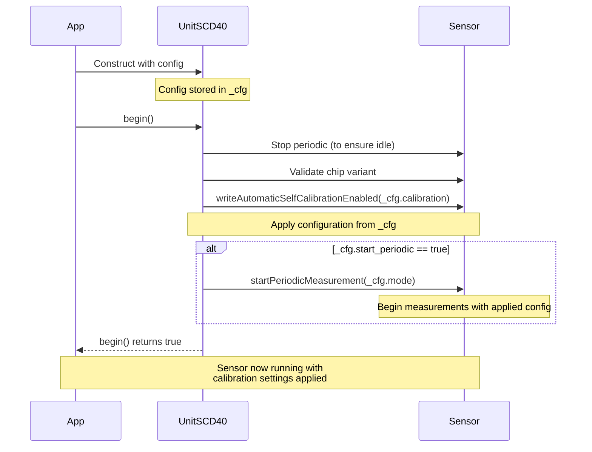

### Runtime Configuration Updates

For sensors requiring configuration changes during operation:

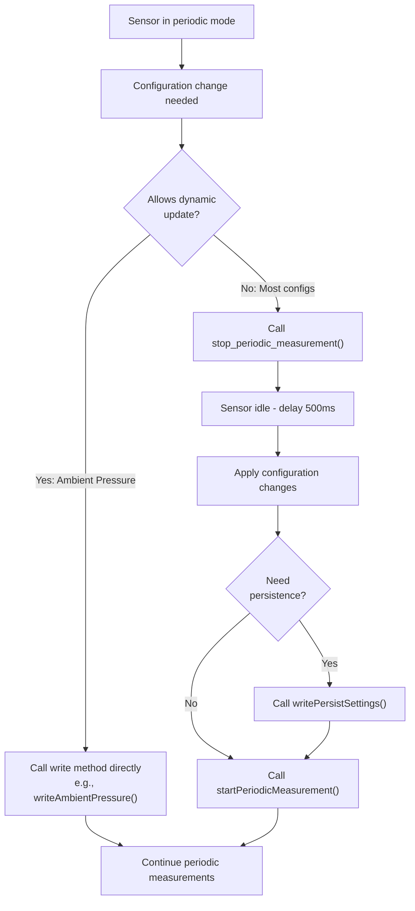

Sources: [src/unit/unit_SCD40.cpp:78-109](), [src/unit/unit_SCD40.cpp:225-242](), [src/unit/unit_SCD40.cpp:152-162]()

---

## Calibration Data Encoding

Understanding data encoding is important for low-level configuration operations.

### Endianness and CRC Protection

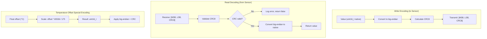

**CRC-8 Calculation (Sensirion Standard)**

The library uses `m5::utility::CRC8_Checksum` for data integrity:

```cpp
// Pattern used throughout SCD40/SCD41/SHT40
m5::utility::CRC8_Checksum crc{};
auto crc8 = crc.range(data_ptr, data_length);  // Calculate CRC-8
```

This CRC calculation follows the Sensirion standard (polynomial 0x31, init 0xFF).

Sources: [src/unit/unit_SCD40.cpp:493-508](), [src/unit/unit_SCD40.cpp:510-521](), [src/unit/unit_SCD40.cpp:20-31]()

---

## Example: Complete Calibration Setup

### SCD40 Deployment Configuration

```cpp
// Complete calibration workflow for SCD40
#include <M5UnitUnifiedENV.h>

void setup() {
    // 1. Initialize sensor
    auto cfg = m5::unit::UnitSCD40::config_t();
    cfg.start_periodic = false;  // Manual control
    cfg.calibration = true;      // Enable ASC
    
    m5::unit::UnitSCD40 scd40;
    scd40.config(cfg);
    
    if (!scd40.begin()) {
        // Handle initialization failure
        return;
    }
    
    // 2. Configure altitude (example: Denver, CO)
    if (!scd40.writeSensorAltitude(1609)) {  // 1609 meters
        // Handle error
    }
    
    // 3. Configure temperature offset (if needed)
    if (!scd40.writeTemperatureOffset(2.5f)) {  // 2.5°C offset
        // Handle error
    }
    
    // 4. Set ASC target (optional, default is 400 ppm)
    if (!scd40.writeAutomaticSelfCalibrationTarget(420)) {  // 420 ppm
        // Handle error
    }
    
    // 5. Persist configuration to NVM
    if (!scd40.writePersistSettings(800)) {  // 800ms write time
        // Handle error
    }
    
    // 6. Start periodic measurements
    if (!scd40.startPeriodicMeasurement()) {
        // Handle error
    }
}

void loop() {
    scd40.update();
    
    if (scd40.updated()) {
        auto data = scd40.data();
        // Use data.co2(), data.celsius(), data.humidity()
    }
    
    delay(100);
}
```

Sources: [src/unit/unit_SCD40.cpp:78-109](), [src/unit/unit_SCD40.cpp:198-207](), [src/unit/unit_SCD40.cpp:164-180](), [src/unit/unit_SCD40.cpp:337-345](), [src/unit/unit_SCD40.cpp:363-375]()

### SGP30 Baseline Persistence

```cpp
// SGP30 with baseline persistence
#include <M5UnitUnifiedENV.h>
#include <Preferences.h>

Preferences prefs;
m5::unit::UnitSGP30 sgp30;
uint32_t lastBaselineSave = 0;

void setup() {
    prefs.begin("sgp30", false);
    
    // Load saved baseline
    uint16_t saved_co2eq = prefs.getUShort("baseline_co2", 0);
    uint16_t saved_tvoc = prefs.getUShort("baseline_tvoc", 0);
    
    auto cfg = m5::unit::UnitSGP30::config_t();
    cfg.baseline_co2eq = saved_co2eq;
    cfg.baseline_tvoc = saved_tvoc;
    cfg.start_periodic = true;
    cfg.interval = 1000;  // 1 second
    
    sgp30.config(cfg);
    
    if (!sgp30.begin()) {
        // Handle initialization failure
        return;
    }
    
    lastBaselineSave = millis();
}

void loop() {
    sgp30.update();
    
    if (sgp30.updated()) {
        auto data = sgp30.data();
        // Use data.co2eq(), data.tvoc()
    }
    
    // Save baseline every hour
    if (millis() - lastBaselineSave >= 3600000) {
        uint16_t co2eq, tvoc;
        if (sgp30.readIaqBaseline(co2eq, tvoc)) {
            prefs.putUShort("baseline_co2", co2eq);
            prefs.putUShort("baseline_tvoc", tvoc);
            lastBaselineSave = millis();
        }
    }
    
    delay(100);
}
```

Sources: [src/unit/unit_SGP30.cpp:55-88](), [src/unit/unit_SGP30.cpp:110-117](), [src/unit/unit_SGP30.cpp:183-196]()

---

## Summary

Calibration and configuration management in M5Unit-ENV requires understanding:

1. **State Requirements**: Most operations require idle state (not in periodic measurement)
2. **Timing Windows**: SGP30 baseline restoration has a 15-second critical window
3. **Persistence Mechanisms**: Vary by sensor (automatic, manual trigger, application-managed)
4. **Validation**: CRC-8 protection and range validation prevent invalid configurations
5. **Dynamic Updates**: Limited operations (ambient pressure, SGP30 humidity) allow runtime updates

For multi-sensor coordination, see [Multi-Sensor Applications](#5.2). For detailed sensor APIs, refer to individual sensor pages in [Sensor Units Reference](#4).