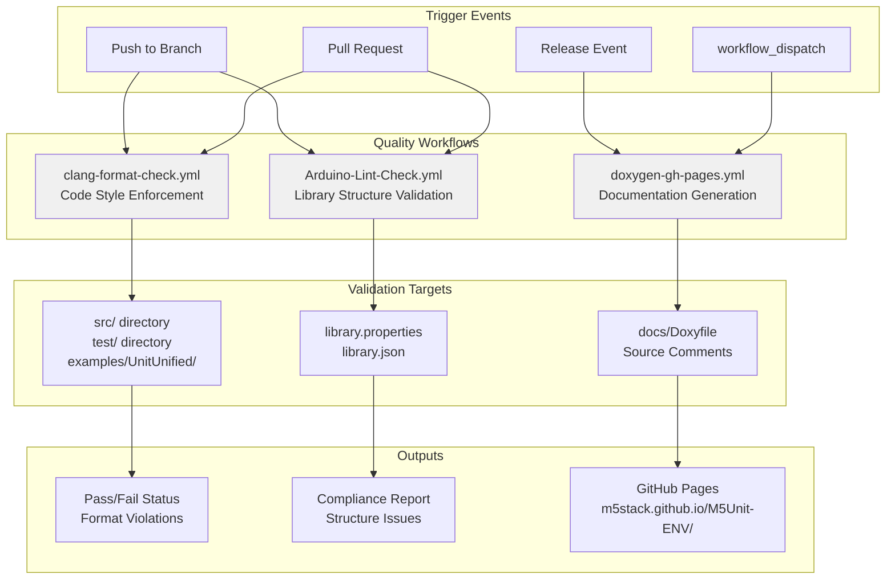
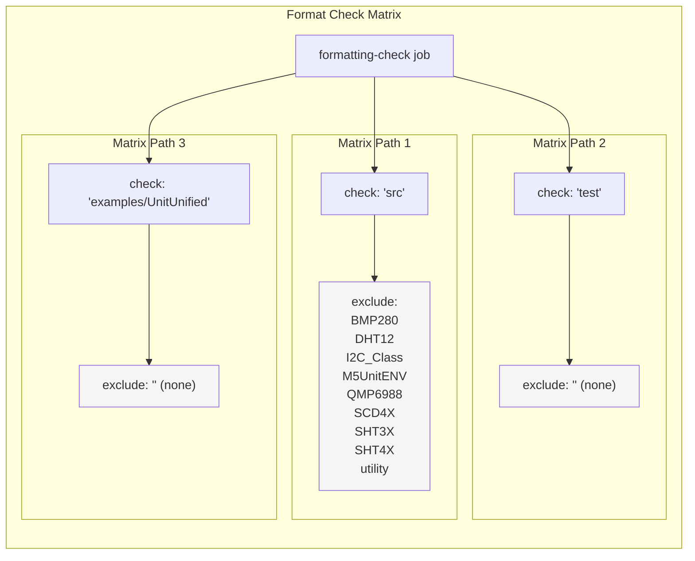
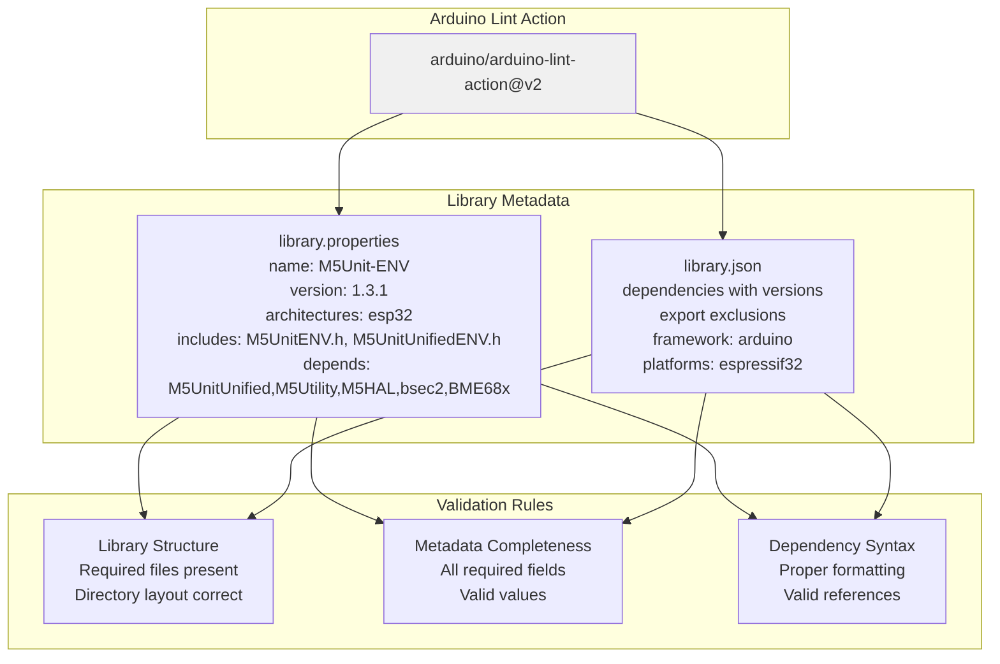
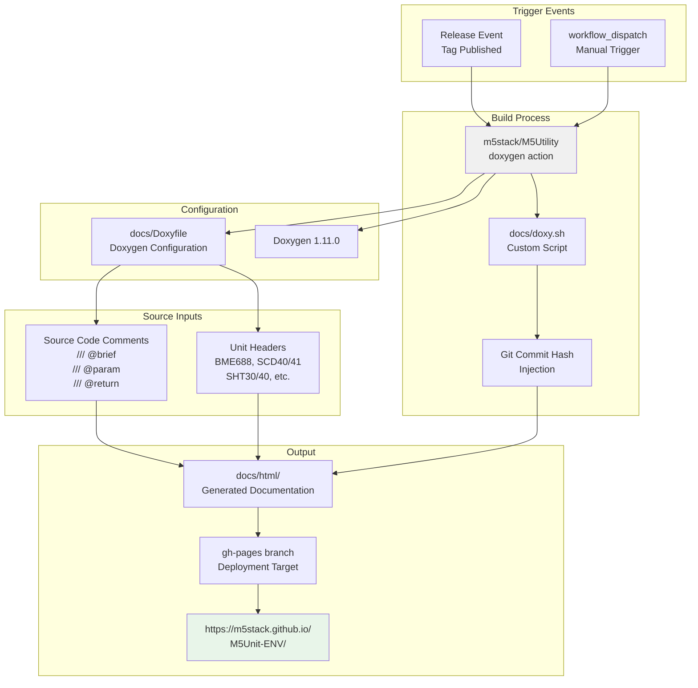
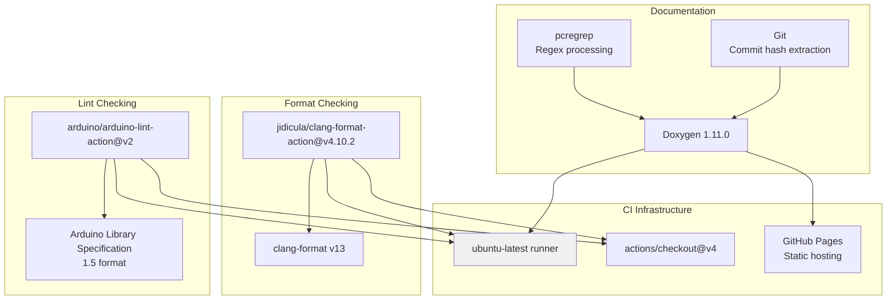

M5Unit-ENV Code Quality and Documentation

# Code Quality and Documentation

<details>
<summary>Relevant source files</summary>

The following files were used as context for generating this wiki page:

- [.github/ISSUE_TEMPLATE/bug-report.yml](.github/ISSUE_TEMPLATE/bug-report.yml)
- [.github/workflows/Arduino-Lint-Check.yml](.github/workflows/Arduino-Lint-Check.yml)
- [.github/workflows/clang-format-check.yml](.github/workflows/clang-format-check.yml)
- [.github/workflows/doxygen-gh-pages.yml](.github/workflows/doxygen-gh-pages.yml)
- [README.md](README.md)
- [library.json](library.json)
- [library.properties](library.properties)

</details>


This page documents the automated code quality enforcement and documentation generation infrastructure for the M5Unit-ENV library. It covers three primary quality gates: code formatting validation via clang-format, library structure validation via Arduino Lint, and API documentation generation via Doxygen with GitHub Pages deployment.

For information about build verification workflows, see [Arduino Build Matrix](#7.1) and [PlatformIO Build Verification](#7.2).

---

## Overview of Quality Gates

The M5Unit-ENV library enforces code quality through three independent GitHub Actions workflows that run on different triggers. These workflows ensure consistent code style, valid library metadata, and up-to-date API documentation.



**Sources:** [.github/workflows/clang-format-check.yml:1-69](), [.github/workflows/Arduino-Lint-Check.yml:1-28](), [.github/workflows/doxygen-gh-pages.yml:1-26]()

---

## Code Formatting Enforcement

### Clang-Format Configuration

The library uses `clang-format` version 13 to enforce consistent C++ code style across the codebase. The workflow runs on all pushes and pull requests that modify C/C++ source files.

| Trigger Condition | Action |
|------------------|---------|
| Push to any branch (except tags) | Run format check |
| Pull request with C/C++ changes | Run format check |
| Manual dispatch | Run format check |

**File Pattern Matching:**
- Includes: `.c`, `.C`, `.cc`, `.cpp`, `.cxx`, `.c++`, `.h`, `.H`, `.hh`, `.hpp`, `.hxx`, `.h++`, `.inl`, `.ino`, `.pde`, `.proto`, `.cu`
- Defined by regex: `^.*\.((((c|C)(c|pp|xx|\+\+)?$)|((h|H)h?(pp|xx|\+\+)?$))|(inl|ino|pde|proto|cu))$`

**Sources:** [.github/workflows/clang-format-check.yml:1-10](), [.github/workflows/clang-format-check.yml:14-31]()

### Format Check Strategy Matrix

The workflow uses a matrix strategy to check three distinct directory paths with different exclusion rules:



**Exclusion Pattern for src/ Directory:**
```
^.*[\/](BMP280|DHT12|I2C_Class|M5UnitENV|QMP6988|SCD4X|SHT3X|SHT4X|utility)\.(cpp|h|hpp)$
```

This regex excludes vendored and legacy files from format checking to avoid conflicts with upstream library styles.

**Sources:** [.github/workflows/clang-format-check.yml:42-54]()

### Concurrency Control

The workflow implements concurrency control to prevent redundant checks:

| Setting | Value | Purpose |
|---------|-------|---------|
| `group` | `${{ github.workflow }}-${{ github.ref }}` | Unique group per branch |
| `cancel-in-progress` | `true` | Cancel outdated checks when new commits pushed |

**Sources:** [.github/workflows/clang-format-check.yml:38-40]()

### Format Check Execution

The workflow uses the `jidicula/clang-format-action@v4.10.2` action with specific configuration:

```yaml
- clang-format-version: '13'
- check-path: src | test | examples/UnitUnified (from matrix)
- exclude-regex: (path-specific exclusions)
- include-regex: (file extension pattern)
```

Pull requests include a special checkout step to ensure the correct commit SHA is checked:

```yaml
ref: ${{ github.event.pull_request.head.sha }}
```

This ensures format checks run against the actual PR commit, not the merge commit.

**Sources:** [.github/workflows/clang-format-check.yml:56-68]()

---

## Library Structure Validation

### Arduino Lint Workflow

The `Arduino-Lint-Check.yml` workflow validates library metadata and structure compliance with Arduino library specifications. It runs only on the `master` and `main` branches to avoid blocking development work.

**Trigger Configuration:**

| Event | Branch Restriction | Purpose |
|-------|-------------------|---------|
| Push | `master`, `main` only | Validate production-ready metadata |
| Pull request | `master`, `main` only | Pre-merge validation |
| Manual dispatch | Any branch | On-demand validation |

**Sources:** [.github/workflows/Arduino-Lint-Check.yml:1-16]()

### Validation Targets

The lint check validates two primary metadata files:



**Sources:** [.github/workflows/Arduino-Lint-Check.yml:17-28](), [library.properties:1-12](), [library.json:1-33]()

### Compliance Level

The lint action is configured with strict compliance:

```yaml
library-manager: update
compliance: strict
project-type: all
```

This ensures the library meets all Arduino library specifications for distribution via Arduino Library Manager.

**Sources:** [.github/workflows/Arduino-Lint-Check.yml:23-27]()

---

## Documentation Generation and Deployment

### Doxygen Workflow Architecture

Documentation generation is triggered only on releases or manual dispatch to conserve CI resources. The workflow generates HTML documentation from source code comments and deploys it to GitHub Pages.



**Sources:** [.github/workflows/doxygen-gh-pages.yml:1-26](), [README.md:90-106]()

### Doxygen Action Configuration

The workflow uses a reusable GitHub Action from the M5Utility repository:

| Parameter | Value | Purpose |
|-----------|-------|---------|
| `doxygen_version` | `1.11.0` | Specific Doxygen version for consistency |
| `github_token` | `${{ secrets.GITHUB_TOKEN }}` | Authentication for Pages deployment |
| `branch` | `gh-pages` | Target branch for deployment |
| `folder` | `docs/html` | Output directory |
| `config_file` | `docs/Doxyfile` | Doxygen configuration file |

**Sources:** [.github/workflows/doxygen-gh-pages.yml:14-25]()

### Custom Documentation Script

The library provides a `docs/doxy.sh` script for local documentation generation. This script offers additional functionality beyond the CI workflow:

**Key Features:**
- Executes Doxygen with the same configuration as CI
- Injects git commit hash into generated HTML (requires git repository)
- Outputs to `docs/html/` directory
- Requires: Doxygen, pcregrep, Git (for commit hash)

**Usage:**
```bash
bash docs/doxy.sh
```

The commit hash injection allows developers to correlate documentation versions with specific source code commits.

**Sources:** [README.md:93-105]()

### Documentation Export Configuration

The `library.json` file explicitly excludes generated documentation from package distribution:

```json
"export": {
    "exclude": [
        "docs/html"
    ]
}
```

This prevents the large HTML documentation directory from being included in library downloads via PlatformIO, reducing package size.

**Sources:** [library.json:28-32]()

---

## Quality Gate Dependencies

### Required Tools and Versions



**Sources:** [.github/workflows/clang-format-check.yml:63-64](), [.github/workflows/Arduino-Lint-Check.yml:22-23](), [.github/workflows/doxygen-gh-pages.yml:18-20](), [README.md:102-105]()

---

## Integration with Library Metadata

### Version Synchronization

Both `library.properties` and `library.json` must maintain synchronized version numbers for compatibility across Arduino and PlatformIO ecosystems:

| File | Version Field | Current Value |
|------|---------------|---------------|
| `library.properties` | `version` | `1.3.1` |
| `library.json` | `version` | `1.3.1` |

Mismatched versions will cause Arduino Lint to fail.

**Sources:** [library.properties:2](), [library.json:18]()

### Dependency Declaration Differences

The two metadata formats declare dependencies differently:

**library.properties (comma-separated list):**
```
depends=M5UnitUnified,M5Utility,M5HAL,bsec2,BME68x Sensor library
```

**library.json (structured with versions):**
```json
"dependencies": {
    "m5stack/M5UnitUnified": ">=0.1.0",
    "boschsensortec/BME68x Sensor library": ">=1.3.40408",
    "boschsensortec/bsec2": ">=1.10.2610"
}
```

Arduino Lint validates that both formats are syntactically correct and reference valid libraries.

**Sources:** [library.properties:11](), [library.json:13-17]()

---

## Concurrency and Resource Management

All three quality workflows implement the same concurrency control pattern:

```yaml
concurrency:
  group: ${{ github.workflow }}-${{ github.ref }}
  cancel-in-progress: true
```

This configuration ensures:
- Only one instance of each workflow runs per branch at a time
- New commits automatically cancel in-progress checks for the same branch
- Reduced CI resource consumption
- Faster feedback on the most recent commit

**Sources:** [.github/workflows/clang-format-check.yml:38-40](), [.github/workflows/Arduino-Lint-Check.yml:13-15](), [.github/workflows/doxygen-gh-pages.yml:10-12]()

---

## Quality Gate Workflow Summary

| Workflow | Trigger Branches | Trigger Events | Validation Scope | Output |
|----------|-----------------|----------------|------------------|--------|
| `clang-format-check.yml` | All (except tags) | Push, PR, Manual | Code style in src/, test/, examples/UnitUnified/ | Pass/Fail + violation report |
| `Arduino-Lint-Check.yml` | master, main only | Push, PR, Manual | Library metadata and structure | Compliance report |
| `doxygen-gh-pages.yml` | Any | Release, Manual | API documentation completeness | GitHub Pages deployment |

**Sources:** [.github/workflows/clang-format-check.yml:6-32](), [.github/workflows/Arduino-Lint-Check.yml:2-7](), [.github/workflows/doxygen-gh-pages.yml:2]()