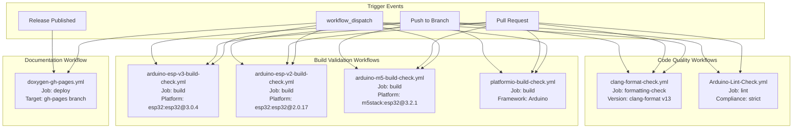
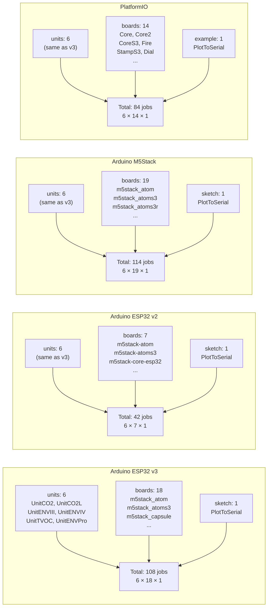
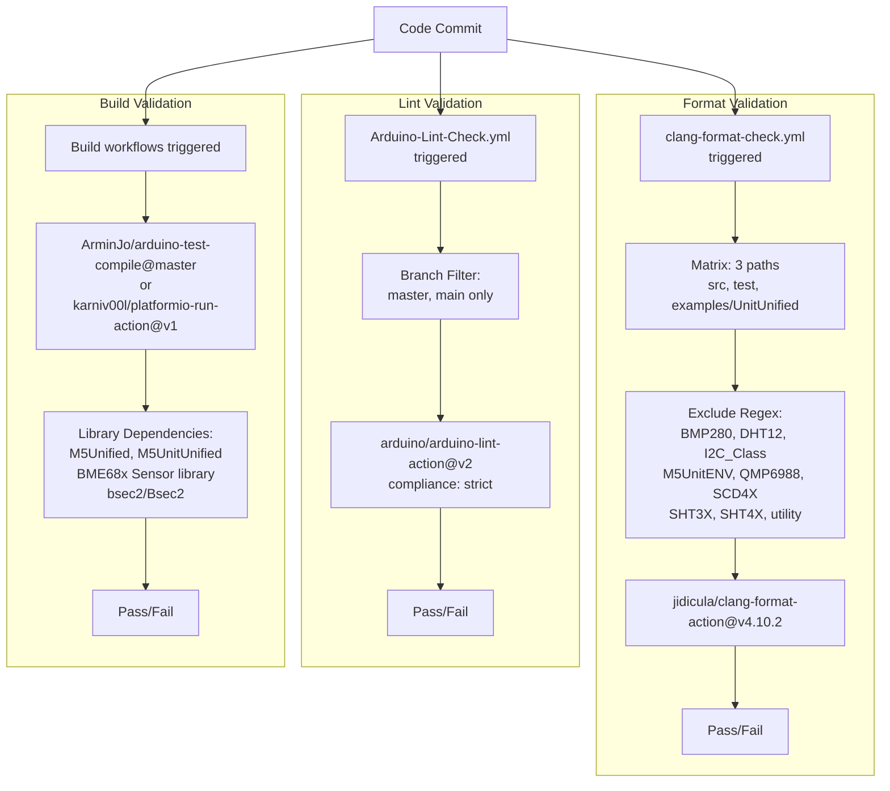
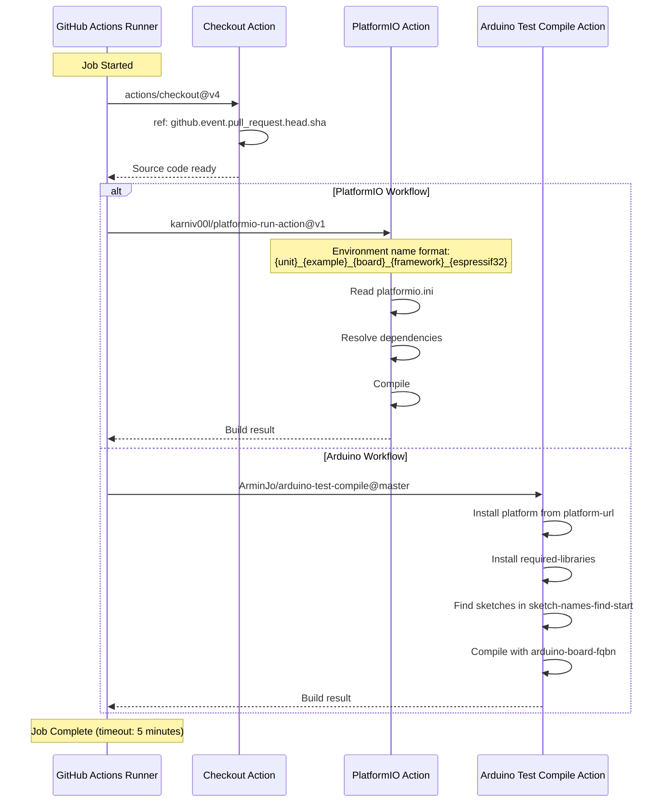
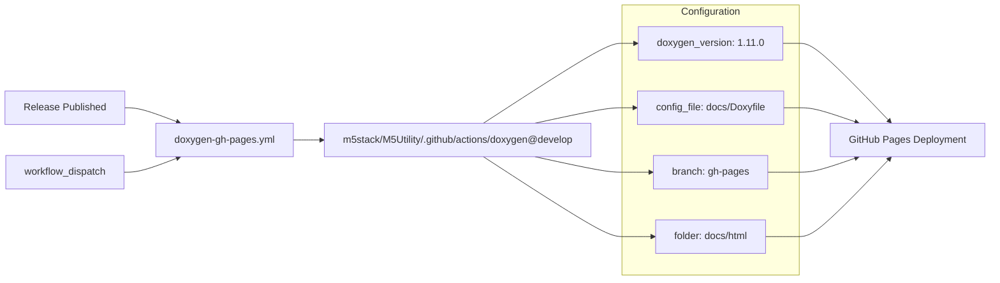

M5Unit-ENV Continuous Integration

# Continuous Integration

<details>
<summary>Relevant source files</summary>

The following files were used as context for generating this wiki page:

- [.github/ISSUE_TEMPLATE/bug-report.yml](.github/ISSUE_TEMPLATE/bug-report.yml)
- [.github/workflows/Arduino-Lint-Check.yml](.github/workflows/Arduino-Lint-Check.yml)
- [.github/workflows/arduino-esp-v2-build-check.yml](.github/workflows/arduino-esp-v2-build-check.yml)
- [.github/workflows/arduino-esp-v3-build-check.yml](.github/workflows/arduino-esp-v3-build-check.yml)
- [.github/workflows/arduino-m5-build-check.yml](.github/workflows/arduino-m5-build-check.yml)
- [.github/workflows/clang-format-check.yml](.github/workflows/clang-format-check.yml)
- [.github/workflows/doxygen-gh-pages.yml](.github/workflows/doxygen-gh-pages.yml)
- [.github/workflows/platformio-build-check.yml](.github/workflows/platformio-build-check.yml)
- [examples/UnitUnified/UnitCO2L/PlotToSerial/PlotToSerial.ino](examples/UnitUnified/UnitCO2L/PlotToSerial/PlotToSerial.ino)

</details>


The M5Unit-ENV library implements a comprehensive CI/CD pipeline through GitHub Actions workflows that validate code quality, build compatibility, and documentation integrity. The pipeline executes automated checks on every push and pull request, ensuring that changes maintain compatibility across 100+ hardware/platform/unit combinations while enforcing code style standards. For detailed information about specific build workflows, see [Arduino Build Matrix](#7.1), [PlatformIO Build Verification](#7.2), and [Code Quality and Documentation](#7.3).

## Pipeline Architecture

The CI/CD infrastructure consists of six independent GitHub Actions workflows that execute in parallel, each responsible for a specific validation domain:



**Sources:** [.github/workflows/arduino-esp-v3-build-check.yml:1-126](), [.github/workflows/arduino-m5-build-check.yml:1-127](), [.github/workflows/platformio-build-check.yml:1-138](), [.github/workflows/clang-format-check.yml:1-69](), [.github/workflows/arduino-esp-v2-build-check.yml:1-108](), [.github/workflows/doxygen-gh-pages.yml:1-26](), [.github/workflows/Arduino-Lint-Check.yml:1-28]()

## Workflow Trigger Configuration

All workflows implement path-based filtering to minimize unnecessary CI execution. The trigger configuration is consistent across build workflows:

| Workflow | Trigger Events | Watched Paths | Branch Filter |
|----------|---------------|---------------|---------------|
| `arduino-esp-v3-build-check.yml` | push, pull_request, workflow_dispatch | `src/unit/**`, `examples/UnitUnified/**`, workflow file | All branches except tags |
| `arduino-esp-v2-build-check.yml` | push, pull_request, workflow_dispatch | `src/unit/**`, `examples/UnitUnified/**`, workflow file | All branches except tags |
| `arduino-m5-build-check.yml` | push, pull_request, workflow_dispatch | `src/unit/**`, `examples/UnitUnified/**`, workflow file | All branches except tags |
| `platformio-build-check.yml` | push, pull_request, workflow_dispatch | `src/unit/**`, `examples/UnitUnified/**`, `platformio.ini` | All branches except tags |
| `clang-format-check.yml` | push, pull_request, workflow_dispatch | `**.ino`, `**.cpp`, `**.hpp`, `**.h`, `**.c`, `**.inl`, `.clang-format` | All branches |
| `Arduino-Lint-Check.yml` | push, pull_request, workflow_dispatch | All paths | master, main only |
| `doxygen-gh-pages.yml` | release, workflow_dispatch | All paths | N/A |

The path filters use glob patterns to target specific file types. For example, `src/unit/**.cpp` matches all C++ source files within the unit directory hierarchy. The `tags-ignore` pattern excludes version tags to prevent duplicate runs during releases.

**Sources:** [.github/workflows/arduino-esp-v3-build-check.yml:7-37](), [.github/workflows/arduino-m5-build-check.yml:7-37](), [.github/workflows/platformio-build-check.yml:3-35](), [.github/workflows/clang-format-check.yml:6-32](), [.github/workflows/Arduino-Lint-Check.yml:2-7](), [.github/workflows/doxygen-gh-pages.yml:2]()

## Build Matrix Dimensions

The build workflows employ GitHub Actions matrix strategy to test all unit-board-platform combinations. Each workflow defines different matrix dimensions:



The complete matrix specification for Arduino ESP32 v3 is defined in [.github/workflows/arduino-esp-v3-build-check.yml:56-105](). The `strategy.fail-fast: false` setting ensures that a failure in one matrix cell does not cancel other jobs. Each job is named using the pattern `${{ matrix.unit }}:${{ matrix.sketch }}:${{matrix.board}}@${{matrix.platform-version}}`, providing clear identification in the GitHub Actions UI.

**Sources:** [.github/workflows/arduino-esp-v3-build-check.yml:47-105](), [.github/workflows/arduino-esp-v2-build-check.yml:47-88](), [.github/workflows/arduino-m5-build-check.yml:47-106](), [.github/workflows/platformio-build-check.yml:45-120]()

## Quality Gate Sequence

Pre-merge quality gates execute in parallel but enforce independent quality standards:



The clang-format check uses version 13 with path-specific exclusions defined in the matrix strategy. Excluded paths match vendored third-party libraries that maintain their own coding styles. The exclude regex is: `^.*[\/](BMP280|DHT12|I2C_Class|M5UnitENV|QMP6988|SCD4X|SHT3X|SHT4X|utility)\.(cpp|h|hpp)$`.

**Sources:** [.github/workflows/clang-format-check.yml:42-69](), [.github/workflows/Arduino-Lint-Check.yml:17-28]()

## Library Dependency Resolution

Build workflows declare required libraries through environment variables that are passed to the Arduino CLI or PlatformIO:

| Workflow | Environment Variable | Required Libraries |
|----------|---------------------|-------------------|
| `arduino-esp-v3-build-check.yml` | `REQUIRED_LIBRARIES` | `M5Unified,M5UnitUnified,BME68x Sensor library,bsec2` |
| `arduino-esp-v2-build-check.yml` | `REQUIRED_LIBRARIES` | `M5Unified,M5UnitUnified,BME68x Sensor library,Bsec2` |
| `arduino-m5-build-check.yml` | `REQUIRED_LIBRARIES` | `M5Unified,M5UnitUnified,BME68x Sensor library,bsec2` |

Note the case difference in BSEC2 library name between ESP32 v2 (`Bsec2`) and v3/M5Stack (`bsec2`). The Arduino CLI uses these comma-separated library names to automatically download and install dependencies before compilation. The PlatformIO workflow relies on `library.json` and `platformio.ini` for dependency management and does not use this environment variable.

**Sources:** [.github/workflows/arduino-esp-v3-build-check.yml:3-5](), [.github/workflows/arduino-esp-v2-build-check.yml:3-5](), [.github/workflows/arduino-m5-build-check.yml:3-5]()

## Build Execution Flow

Each build job follows a standardized execution sequence:



The checkout action specifically uses `ref: ${{ github.event.pull_request.head.sha }}` to ensure pull request builds test the PR head commit, not a merge commit. The timeout is set to 5 minutes for all build jobs, defined at [.github/workflows/arduino-esp-v3-build-check.yml:51]().

**Sources:** [.github/workflows/arduino-esp-v3-build-check.yml:106-125](), [.github/workflows/platformio-build-check.yml:121-137]()

## Sketch Discovery Mechanism

Arduino workflows use dynamic sketch discovery rather than hardcoded paths. The discovery is configured through two parameters:

```
SKETCH_NAMES_FIND_START: ./examples/UnitUnified
sketch-names: ${{ matrix.sketch }}.ino
sketch-names-find-start: ${{ env.SKETCH_NAMES_FIND_START }}/${{ matrix.unit }}
```

For a job with `matrix.unit: UnitCO2` and `matrix.sketch: PlotToSerial`, the action searches for `PlotToSerial.ino` within `./examples/UnitUnified/UnitCO2/**`. This pattern allows adding new example sketches without modifying workflow files. The actual sketch file is a thin wrapper that includes the implementation: [examples/UnitUnified/UnitCO2L/PlotToSerial/PlotToSerial.ino:11]() contains only `#include "main/PlotToSerial.cpp"`.

**Sources:** [.github/workflows/arduino-esp-v3-build-check.yml:4,123-124](), [examples/UnitUnified/UnitCO2L/PlotToSerial/PlotToSerial.ino:1-12]()

## Concurrency Control

All workflows implement GitHub Actions concurrency groups to prevent redundant builds:

```yaml
concurrency:
  group: ${{ github.workflow }}-${{ github.ref }}
  cancel-in-progress: true
```

This configuration creates a concurrency group named by workflow and ref (e.g., `Build(arduino-esp32:3.x)-refs/heads/develop`). When a new commit is pushed to the same branch while a workflow is running, the `cancel-in-progress: true` setting terminates the in-progress run and starts a new one. This prevents wasted CI resources on outdated commits.

**Sources:** [.github/workflows/arduino-esp-v3-build-check.yml:43-45](), [.github/workflows/arduino-m5-build-check.yml:43-45](), [.github/workflows/platformio-build-check.yml:41-43](), [.github/workflows/clang-format-check.yml:38-40]()

## Documentation Deployment Pipeline

The documentation workflow operates independently from build validation, triggering only on releases or manual dispatch:



The workflow uses a reusable action from the M5Utility repository: `m5stack/M5Utility/.github/actions/doxygen@develop`. This action generates HTML documentation from source code comments using Doxygen 1.11.0, then commits the output to the `gh-pages` branch. The generated documentation is hosted at `https://m5stack.github.io/M5Unit-ENV/`.

**Sources:** [.github/workflows/doxygen-gh-pages.yml:1-26]()

## Platform URL Configuration

Arduino workflows target different package index URLs based on the platform vendor:

| Platform | URL | Use Case |
|----------|-----|----------|
| `esp32:esp32@3.0.4` | `https://espressif.github.io/arduino-esp32/package_esp32_index.json` | Official Espressif ESP32 Arduino core v3 |
| `esp32:esp32@2.0.17` | `https://espressif.github.io/arduino-esp32/package_esp32_index.json` | Official Espressif ESP32 Arduino core v2 (legacy) |
| `m5stack:esp32@3.2.1` | `https://m5stack.oss-cn-shenzhen.aliyuncs.com/resource/arduino/package_m5stack_index.json` | M5Stack custom ESP32 core with board definitions |

The M5Stack platform includes additional board definitions not present in the official Espressif core, such as `m5stack_atoms3r` and `m5stack_dinmeter`. This requires testing against both official and M5Stack cores to ensure compatibility across the ecosystem.

**Sources:** [.github/workflows/arduino-esp-v3-build-check.yml:57-58](), [.github/workflows/arduino-esp-v2-build-check.yml:57-58](), [.github/workflows/arduino-m5-build-check.yml:57-58]()

## Board FQBN Format

The Arduino CLI uses Fully Qualified Board Names (FQBN) to specify compilation targets. The format is constructed from matrix variables:

```
${{ matrix.platform }}:${{ matrix.archi }}:${{ matrix.board }}
```

Example FQBNs generated by different workflows:

- ESP32 v3: `esp32:esp32:m5stack_cores3`
- ESP32 v2: `esp32:esp32:m5stack-core-esp32` (note hyphen separator)
- M5Stack: `m5stack:esp32:m5stack_cores3`

The board name format differs between ESP32 v2 (hyphens) and v3/M5Stack (underscores). This is handled by the matrix `board` values, not runtime logic. The complete board lists are at [.github/workflows/arduino-esp-v3-build-check.yml:71-95](), [.github/workflows/arduino-esp-v2-build-check.yml:71-78](), and [.github/workflows/arduino-m5-build-check.yml:71-96]().

**Sources:** [.github/workflows/arduino-esp-v3-build-check.yml:116](), [.github/workflows/arduino-m5-build-check.yml:117](), [.github/workflows/arduino-esp-v2-build-check.yml:99]()