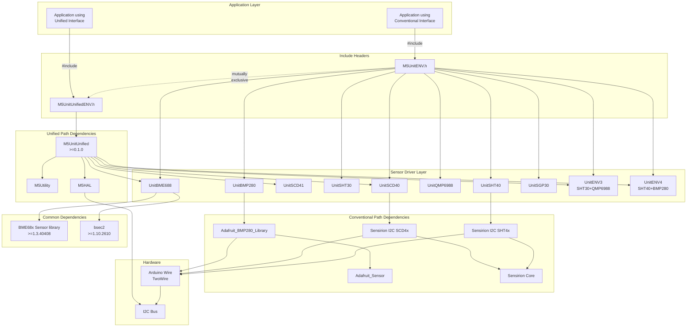
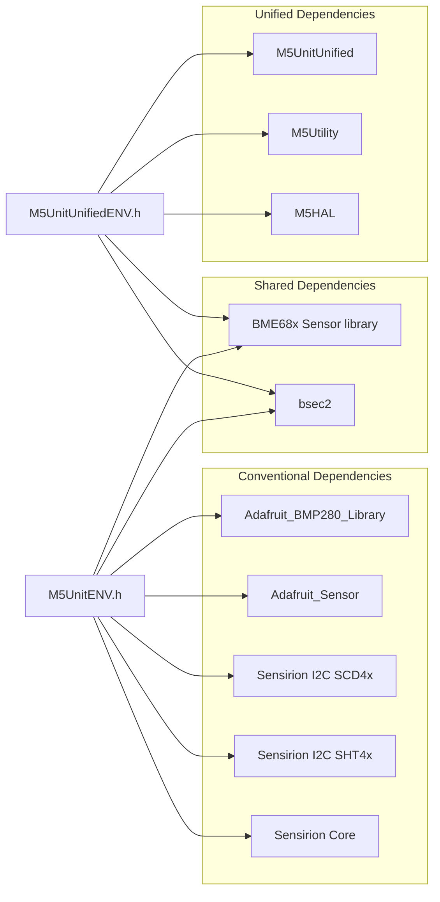
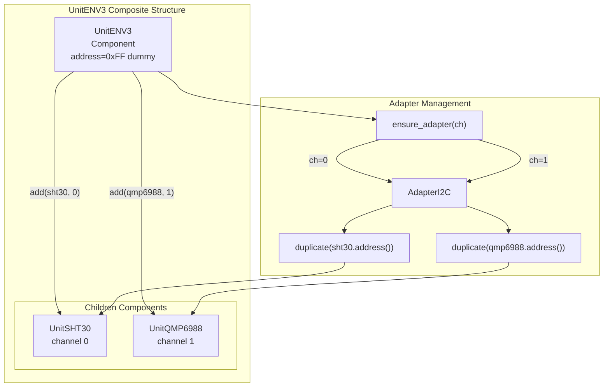

M5Unit-ENV Conventional vs Unified Interface

# Conventional vs Unified Interface

<details>
<summary>Relevant source files</summary>

The following files were used as context for generating this wiki page:

- [README.md](README.md)
- [library.json](library.json)
- [library.properties](library.properties)
- [src/unit/unit_ENV3.cpp](src/unit/unit_ENV3.cpp)
- [src/unit/unit_ENV3.hpp](src/unit/unit_ENV3.hpp)

</details>


## Purpose and Scope

This document explains the dual-interface architecture of the M5Unit-ENV library, detailing the differences between the conventional interface (`M5UnitENV.h`) and the unified interface (`M5UnitUnifiedENV.h`). It covers architectural differences, dependency chains, when to use each approach, and their mutually exclusive nature.

For platform-specific dependency details, see [Dependency Management](#3.2). For build system integration of these interfaces, see [PlatformIO Configuration](#6.1) and [Arduino IDE Integration](#6.3).

## Interface Overview

The M5Unit-ENV library provides two distinct entry points for accessing environmental sensor units:

| Interface | Header File | Primary Use Case | Framework Dependency |
|-----------|-------------|------------------|---------------------|
| **Conventional** | `M5UnitENV.h` | Standalone sensor access, Arduino ecosystem compatibility | Adafruit, Sensirion libraries |
| **Unified** | `M5UnitUnifiedENV.h` | Integration with M5Stack ecosystem, multi-unit management | M5UnitUnified framework |

These interfaces are **mutually exclusive** and cannot be used simultaneously in the same application.

**Sources:** [library.properties:10](), [library.json:22-24](), [README.md:72-75]()

## Architectural Comparison



**Architectural Comparison: Conventional vs Unified Interface Dependency Flow**

This diagram illustrates how the two interfaces diverge at the include level and follow different dependency chains. The conventional path uses industry-standard libraries (Adafruit, Sensirion) that communicate via Arduino's `Wire` library, while the unified path routes through M5Stack's framework layers (`M5UnitUnified`, `M5HAL`, `M5Utility`) for enhanced capabilities.

**Sources:** [library.properties:10-11](), [library.json:13-24](), [README.md:29-85]()

## Key Differences

### Dependency Requirements



**Dependency Trees for Each Interface**

**Sources:** [library.properties:11](), [library.json:13-16](), [README.md:29-35](), [README.md:78-85]()

### Feature Comparison

| Feature | Conventional Interface | Unified Interface |
|---------|----------------------|-------------------|
| **Header File** | `M5UnitENV.h` | `M5UnitUnifiedENV.h` |
| **Framework Integration** | Standalone, Arduino-centric | M5UnitUnified ecosystem |
| **I2C Communication** | Direct `Wire` (TwoWire) | M5HAL abstraction layer |
| **Multi-Unit Management** | Manual instantiation per unit | Automatic discovery and lifecycle management via `M5UnitUnified` |
| **Supported Units** | All 8 sensor units + 2 composite units | 6 units: CO2, CO2L, ENVIII, ENVIV, ENVPro, TVOC |
| **Hardware Abstraction** | Arduino Wire API | M5HAL GPIO/I2C/SPI abstraction |
| **Utility Functions** | Standard library only | M5Utility (CRC, hashing, helpers) |
| **Adapter Pattern** | Not available | Component/Adapter pattern for unit composition |
| **Example Location** | Various conventional examples | `examples/UnitUnified/` directory |
| **Primary Target Audience** | Arduino ecosystem users, hobbyists | M5Stack device users, advanced integration |

**Sources:** [library.properties:10](), [library.json:22-24](), [README.md:44-76](), [src/unit/unit_ENV3.hpp:13-28]()

## Composite Unit Architecture Example

The unified interface supports sophisticated parent-child relationships for composite units like `UnitENV3`, which aggregates `UnitSHT30` and `UnitQMP6988`:



**Unified Interface Composite Unit Pattern (UnitENV3 Example)**

The unified interface's component/adapter pattern enables composite units like `UnitENV3` to aggregate child components (`UnitSHT30`, `UnitQMP6988`) with automatic I2C adapter duplication. The parent uses a dummy address (0xFF) and delegates actual I2C communication to children via `ensure_adapter()`. This pattern is not available in the conventional interface.

**Sources:** [src/unit/unit_ENV3.hpp:20-49](), [src/unit/unit_ENV3.cpp:23-45]()

## Mutual Exclusivity and Include Pattern

The two interfaces **cannot be used together** in the same compilation unit. This is explicitly documented in the README:

```cpp
#include <M5UnitUnifiedENV.h> // For UnitUnified
//#include <M5UnitENV.h> // When using M5UnitUnified, do not use it at the same time as conventional libraries
```

### Why They Are Mutually Exclusive

1. **Symbol Conflicts**: Both interfaces may define sensor driver classes with identical names but different implementations
2. **Dependency Conflicts**: Conventional libraries (Adafruit, Sensirion) and M5 framework libraries may have conflicting I2C bus management
3. **Initialization Patterns**: Conventional approach uses direct `Wire` initialization; unified approach uses M5HAL bus management
4. **Memory Model**: Unified interface uses `std::shared_ptr` for adapters; conventional uses direct pointers

### Include File Declaration

The library declares both headers in metadata to support both usage patterns:

| Metadata File | Declaration |
|---------------|-------------|
| `library.properties` | `includes=M5UnitENV.h, M5UnitUnifiedENV.h` |
| `library.json` | `"headers": ["M5UnitENV.h", "M5UnitUnifiedENV.h"]` |

**Sources:** [library.properties:10](), [library.json:22-24](), [README.md:72-75]()

## When to Use Each Interface

### Use Conventional Interface (`M5UnitENV.h`) When:

- **Standalone Sensor Access**: Working with individual sensors without M5Stack device integration
- **Arduino Ecosystem Compatibility**: Using Arduino IDE or standard Arduino libraries
- **Existing Adafruit/Sensirion Code**: Migrating from or integrating with existing Adafruit/Sensirion-based projects
- **Simple Use Cases**: Reading sensor data without complex multi-unit orchestration
- **Broader Hardware Support**: Targeting generic ESP32 boards without M5Stack-specific features
- **Learning and Prototyping**: Educational contexts where M5Stack framework overhead is unnecessary

### Use Unified Interface (`M5UnitUnifiedENV.h`) When:

- **M5Stack Device Integration**: Building applications for M5Stack Core, Core2, CoreS3, Atom, Stick, etc.
- **Multi-Unit Applications**: Managing multiple environmental units simultaneously
- **Advanced Features**: Requiring automatic unit discovery, lifecycle management, or component composition
- **M5Unified Ecosystem**: Integrating with M5Unified for display, input, and logging capabilities
- **Adapter Pattern Benefits**: Needing flexible I2C bus management with adapter duplication
- **Hardware Abstraction**: Requiring platform-agnostic GPIO/I2C/SPI access via M5HAL
- **Production Deployments**: Building robust applications with M5Stack's validated framework

**Sources:** [README.md:1-106](), [library.properties:1-12]()

## Supported Units by Interface

### Conventional Interface Support

The conventional interface supports all sensor units through direct driver access:

- **Environmental Sensors**: SHT30, SHT40, QMP6988, BMP280
- **Advanced Environmental**: BME688 (ENVPro)
- **CO2 Sensors**: SCD40, SCD41
- **Air Quality**: SGP30 (TVOC)
- **Composite Units**: ENV3 (ENVIII), ENV4 (ENVIV)

### Unified Interface Support

The unified interface currently supports a subset of units through `M5UnitUnified` framework integration:

| Unit | SKU | Sensors Included |
|------|-----|------------------|
| Unit CO2 | U103 | SCD40 |
| Unit CO2L | U104 | SCD41 |
| Unit ENVIII | U001-C | SHT30 + QMP6988 |
| Unit ENVIV | U001-D | SHT40 + BMP280 |
| Unit ENVPro | U169 | BME688 |
| Unit TVOC | U088 | SGP30 |

**Note**: The README indicates "Supported units will be added in the future" for the unified interface.

**Sources:** [README.md:47-76]()

## Code Entity Mapping

### Header File Locations

| Interface Type | Include Path | Physical Location |
|----------------|--------------|-------------------|
| Conventional | `#include <M5UnitENV.h>` | Root of library |
| Unified | `#include <M5UnitUnifiedENV.h>` | Root of library |
| Unit Drivers | `#include "unit/unit_*.hpp"` | `src/unit/` directory |

### Example Directory Structure

| Interface Type | Example Path |
|----------------|--------------|
| Conventional | `examples/*/` (various standalone examples) |
| Unified | `examples/UnitUnified/*/` |

**Sources:** [library.json:22-24](), [README.md:72-88]()

## Summary

The M5Unit-ENV library's dual-interface architecture provides flexibility for different use cases:

- **Conventional Interface**: Direct sensor access using industry-standard libraries (Adafruit, Sensirion), suitable for standalone Arduino applications
- **Unified Interface**: M5Stack framework integration with advanced features (multi-unit management, component composition, hardware abstraction), suitable for M5Stack device ecosystem

These interfaces are mutually exclusive by design and target different audiences: Arduino ecosystem users vs M5Stack ecosystem users. The choice depends on project requirements, target hardware, and desired integration depth with M5Stack's frameworks.

**Sources:** [library.properties:1-12](), [library.json:1-33](), [README.md:1-106](), [src/unit/unit_ENV3.hpp:1-54](), [src/unit/unit_ENV3.cpp:1-49]()