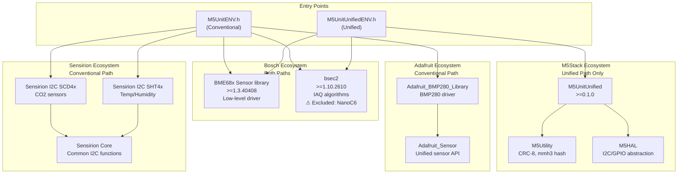
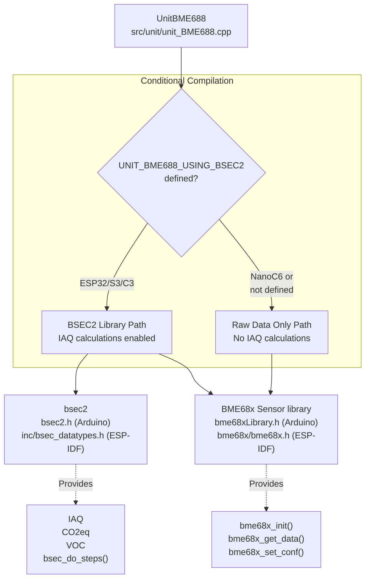
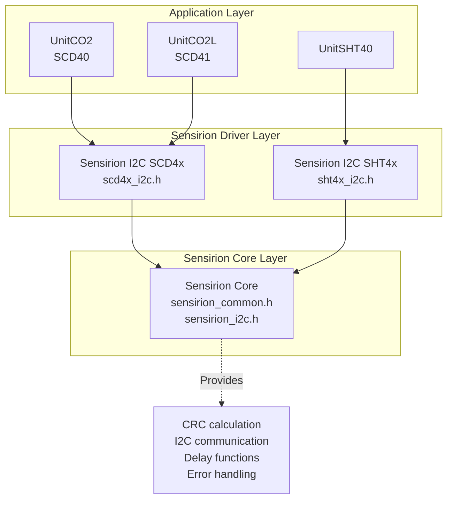
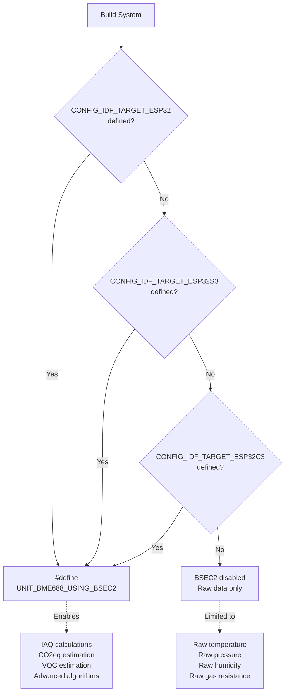
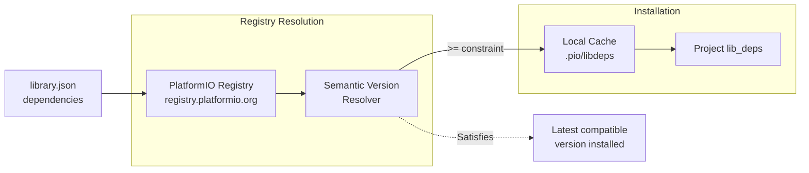
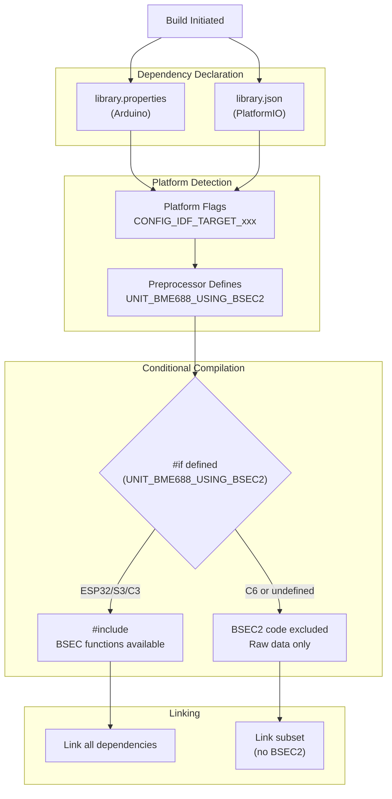

M5Unit-ENV Dependency Management

# Dependency Management

<details>
<summary>Relevant source files</summary>

The following files were used as context for generating this wiki page:

- [README.md](README.md)
- [library.json](library.json)
- [library.properties](library.properties)
- [src/unit/unit_BME688.cpp](src/unit/unit_BME688.cpp)
- [src/unit/unit_BME688.hpp](src/unit/unit_BME688.hpp)

</details>


This document details all external dependencies required by the M5Unit-ENV library, their version requirements, platform-specific exclusions, and how they integrate with different build systems. It covers both the conventional and unified interface dependency paths.

For information about the architectural differences between interfaces, see [Conventional vs Unified Interface](#3.1). For build system configuration details, see [PlatformIO Configuration](#6.1) and [Arduino IDE Integration](#6.3).

## Dependency Architecture

The M5Unit-ENV library has two distinct dependency paths depending on which interface is used. The conventional interface (`M5UnitENV.h`) relies primarily on third-party vendor libraries (Adafruit, Sensirion), while the unified interface (`M5UnitUnifiedENV.h`) builds on the M5Stack ecosystem framework.

**Dual-Path Dependency Architecture**



Sources: [library.properties:11](), [library.json:13-16](), [README.md:29-35](), [README.md:78-85]()

## Core M5Stack Dependencies

The unified interface requires the M5Stack ecosystem libraries, which provide framework services, hardware abstraction, and utility functions. These dependencies are **only required when using `M5UnitUnifiedENV.h`**.

| Library | Minimum Version | Purpose | Key Components |
|---------|----------------|---------|----------------|
| **M5UnitUnified** | >=0.1.0 | Unit management framework | Multi-unit discovery, lifecycle management, adapter patterns |
| **M5Utility** | (latest) | Common utilities | CRC-8 calculation, MurmurHash3 (mmh3) |
| **M5HAL** | (latest) | Hardware abstraction layer | I2C bus adapter, GPIO management |

The `M5Utility` library is specifically used for hash calculation in unit identification and CRC validation, as seen in [src/unit/unit_BME688.cpp:21]() where `m5::utility::mmh3` is imported for the unit UID generation [src/unit/unit_BME688.cpp:132]().

Sources: [library.json:13-16](), [README.md:78-82](), [src/unit/unit_BME688.cpp:17](), [src/unit/unit_BME688.cpp:21]()

## Bosch Sensortec Dependencies

The BME688 sensor (ENVPro unit) requires two Bosch libraries. These are **required for both conventional and unified interfaces** when using the BME688/ENVPro sensor.

**BME688 Dependency Stack**



Sources: [src/unit/unit_BME688.hpp:22-31](), [src/unit/unit_BME688.cpp:11-16]()

### BME68x Sensor Library

**Version Requirement:** `>=1.3.40408`

This library provides low-level sensor communication functions:
- Sensor initialization: `bme68x_init()` [src/unit/unit_BME688.cpp:182]()
- Configuration management: `bme68x_set_conf()`, `bme68x_get_conf()` [src/unit/unit_BME688.cpp:222]()
- Data retrieval: `bme68x_get_data()` [src/unit/unit_BME688.cpp:783]()
- Mode control: `bme68x_set_op_mode()`, `bme68x_get_op_mode()` [src/unit/unit_BME688.cpp:678](), [src/unit/unit_BME688.cpp:688]()
- Heater configuration: `bme68x_set_heatr_conf()` [src/unit/unit_BME688.cpp:669]()

The library is conditionally included based on the build environment [src/unit/unit_BME688.hpp:16-20]():
- Arduino: `#include <bme68xLibrary.h>`
- ESP-IDF: `#include <bme68x/bme68x.h>`

Sources: [library.json:15](), [src/unit/unit_BME688.hpp:16-20](), [src/unit/unit_BME688.cpp:182-225]()

### BSEC2 (Bosch Sensortec Environmental Cluster 2)

**Version Requirement:** `>=1.10.2610`

**Platform Exclusion:** Not available on ESP32-C6 (NanoC6)

BSEC2 is Bosch's proprietary air quality algorithm library that provides advanced metrics:
- **IAQ (Indoor Air Quality):** `BSEC_OUTPUT_IAQ`, `BSEC_OUTPUT_STATIC_IAQ`
- **CO2 Equivalent:** `BSEC_OUTPUT_CO2_EQUIVALENT`
- **VOC (Breath VOC):** `BSEC_OUTPUT_BREATH_VOC_EQUIVALENT`
- **Heat-Compensated Values:** Temperature and humidity with heater compensation
- **Gas Estimates:** Four-class gas classification

The library is conditionally compiled based on the target platform [src/unit/unit_BME688.hpp:22-31]():

```cpp
#if defined(CONFIG_IDF_TARGET_ESP32) || defined(CONFIG_IDF_TARGET_ESP32S3) || 
    defined(CONFIG_IDF_TARGET_ESP32C3)
#define UNIT_BME688_USING_BSEC2
#endif
```

When BSEC2 is available, it provides the `bsec_do_steps()` function [src/unit/unit_BME688.cpp:1012]() to process raw sensor data into high-level air quality metrics. The default configuration is loaded from `config/bme688/bme688_sel_33v_3s_4d/bsec_selectivity.txt` [src/unit/unit_BME688.cpp:76]().

**BSEC2 Integration Functions:**

| Function | Purpose | Line Reference |
|----------|---------|----------------|
| `bsec_init()` | Initialize BSEC2 library | [src/unit/unit_BME688.cpp:188]() |
| `bsec_set_configuration()` | Load algorithm config | [src/unit/unit_BME688.cpp:808]() |
| `bsec_update_subscription()` | Subscribe to virtual sensors | [src/unit/unit_BME688.cpp:848]() |
| `bsec_sensor_control()` | Get next measurement settings | [src/unit/unit_BME688.cpp:295]() |
| `bsec_do_steps()` | Process raw data to outputs | [src/unit/unit_BME688.cpp:1012]() |
| `bsec_get_state()` / `bsec_set_state()` | State persistence | [src/unit/unit_BME688.cpp:815-823]() |

Sources: [library.json:16](), [README.md:85](), [src/unit/unit_BME688.hpp:22-31](), [src/unit/unit_BME688.cpp:11-16](), [src/unit/unit_BME688.cpp:187-200](), [src/unit/unit_BME688.cpp:786-1019]()

## Adafruit Dependencies

The conventional interface uses Adafruit libraries for the BMP280 pressure sensor (used in ENVIV and BPS units). These are **only required when using `M5UnitENV.h`**.

| Library | Purpose | Key Classes/Functions |
|---------|---------|----------------------|
| **Adafruit_BMP280_Library** | BMP280 sensor driver | Temperature, pressure measurement |
| **Adafruit_Sensor** | Unified sensor interface | Common sensor API abstraction |

The BMP280 driver depends on the unified sensor library, which provides a common interface pattern used across Adafruit's sensor ecosystem.

Sources: [README.md:31-32](), [library.properties:11]()

## Sensirion Dependencies

The conventional interface uses Sensirion libraries for CO2 sensors (SCD40, SCD41) and advanced temperature/humidity sensors (SHT40). These are **only required when using `M5UnitENV.h`**.

**Sensirion Dependency Hierarchy**



Sources: [README.md:33-35]()

### Sensirion I2C SCD4x

Provides driver functions for SCD40 and SCD41 CO2 sensors:
- Periodic measurement control
- Single-shot measurement (SCD41 only)
- Automatic self-calibration (ASC)
- Forced recalibration (FRC)
- Temperature offset adjustment
- Altitude compensation
- Ambient pressure compensation

Sources: [README.md:33]()

### Sensirion I2C SHT4x

Provides driver functions for SHT40 temperature and humidity sensor:
- High/medium/low precision measurements
- Heater activation for condensation removal
- Serial number reading
- Soft reset functionality

Sources: [README.md:34]()

### Sensirion Core

Common utilities shared across Sensirion sensor libraries:
- I2C communication primitives
- CRC-8 validation
- Delay and timing functions
- Error code definitions

Both SCD4x and SHT4x libraries depend on this core library for basic I2C operations and data validation.

Sources: [README.md:35]()

## Dependency Version Matrix

The following table summarizes all dependencies with their version requirements and applicability:

| Library | Min Version | Interface | Platforms | Notes |
|---------|------------|-----------|-----------|-------|
| **M5UnitUnified** | >=0.1.0 | Unified only | All ESP32 | Core framework |
| **M5Utility** | (latest) | Unified only | All ESP32 | CRC, hashing |
| **M5HAL** | (latest) | Unified only | All ESP32 | Hardware abstraction |
| **BME68x Sensor library** | >=1.3.40408 | Both | All ESP32 | BME688 low-level |
| **bsec2** | >=1.10.2610 | Both | ESP32, S3, C3 | **Excluded: C6** |
| **Adafruit_BMP280_Library** | (latest) | Conventional | All ESP32 | BMP280 driver |
| **Adafruit_Sensor** | (latest) | Conventional | All ESP32 | Unified API |
| **Sensirion I2C SCD4x** | (latest) | Conventional | All ESP32 | CO2 sensors |
| **Sensirion I2C SHT4x** | (latest) | Conventional | All ESP32 | Temp/Humidity |
| **Sensirion Core** | (latest) | Conventional | All ESP32 | Common functions |

Sources: [library.properties:11](), [library.json:13-16](), [README.md:29-35](), [README.md:78-86]()

## Platform-Specific Exclusions

### BSEC2 Exclusion on ESP32-C6

The BSEC2 library is **not available** on the ESP32-C6 (NanoC6) platform due to resource constraints. This is enforced through conditional compilation:

**Platform Detection Logic:**



Sources: [src/unit/unit_BME688.hpp:22-31]()

When BSEC2 is excluded, the BME688 sensor can still be used, but only raw sensor data is available:
- Temperature (compensated)
- Pressure (compensated)
- Humidity (compensated)
- Gas resistance (raw)

The high-level metrics (IAQ, CO2eq, VOC) require BSEC2 and are unavailable on NanoC6.

Sources: [README.md:85](), [src/unit/unit_BME688.hpp:22-31](), [src/unit/unit_BME688.cpp:11-16]()

## Build System Integration

### Arduino Library Manager

Dependencies are declared in `library.properties` using the `depends` field [library.properties:11]():

```
depends=M5UnitUnified,M5Utility,M5HAL,bsec2,BME68x Sensor library
```

The Arduino Library Manager automatically resolves and installs these dependencies when the M5Unit-ENV library is installed. Library names must match the exact names published in the Arduino Library Registry.

**Limitations:**
- Cannot specify version ranges (all dependencies install latest)
- Cannot conditionally exclude dependencies based on platform
- Both conventional and unified dependencies are always installed

Sources: [library.properties:1-11]()

### PlatformIO

Dependencies are declared in `library.json` with semantic versioning support [library.json:13-16]():

```json
"dependencies": {
    "m5stack/M5UnitUnified": ">=0.1.0",
    "boschsensortec/BME68x Sensor library": ">=1.3.40408",
    "boschsensortec/bsec2": ">=1.10.2610"
}
```

**PlatformIO Dependency Resolution:**



Sources: [library.json:13-16]()

**Platform-Specific Configuration:**

PlatformIO allows platform-specific dependency management in `platformio.ini` through build flags and library filtering. For BSEC2 exclusion on NanoC6, the build system relies on the conditional compilation in the source code rather than dependency exclusion.

Sources: [library.json:1-33]()

## Dependency Resolution Process

The following diagram illustrates how dependencies are resolved during the build process:

**Build-Time Dependency Resolution**



Sources: [library.properties:11](), [library.json:13-16](), [src/unit/unit_BME688.hpp:22-31](), [src/unit/unit_BME688.cpp:11-16]()

### Dependency Order

Dependencies must be resolved in the correct order due to transitive dependencies:

1. **M5HAL** (no dependencies)
2. **M5Utility** (no dependencies)
3. **M5UnitUnified** (depends on M5HAL, M5Utility)
4. **Sensirion Core** (no dependencies)
5. **Sensirion I2C SCD4x** (depends on Sensirion Core)
6. **Sensirion I2C SHT4x** (depends on Sensirion Core)
7. **Adafruit_Sensor** (no dependencies)
8. **Adafruit_BMP280_Library** (depends on Adafruit_Sensor)
9. **BME68x Sensor library** (no dependencies)
10. **bsec2** (depends on BME68x Sensor library)

Both Arduino and PlatformIO automatically handle transitive dependencies, but understanding the order helps diagnose build issues.

Sources: [library.properties:11](), [library.json:13-16](), [README.md:29-35](), [README.md:78-86]()