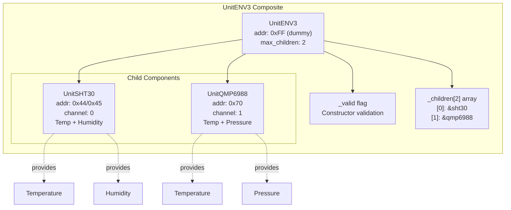
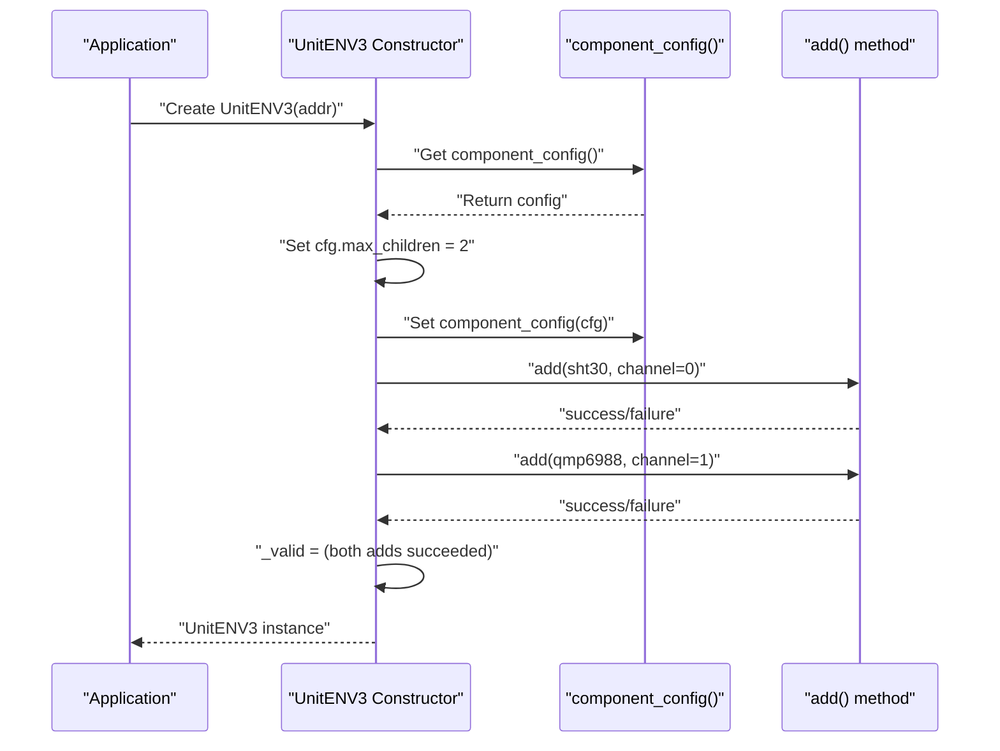
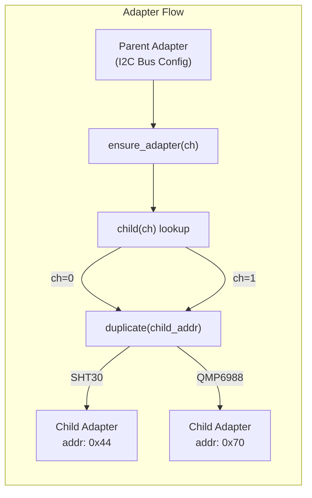
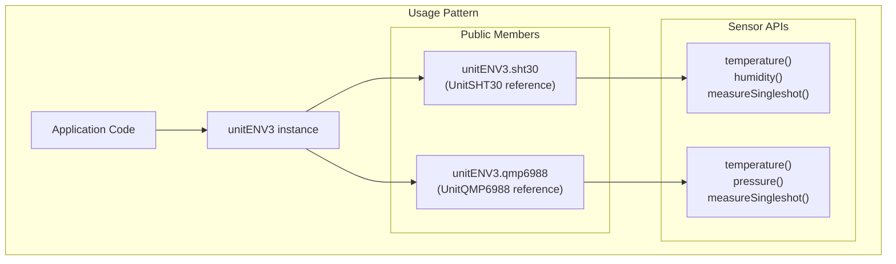
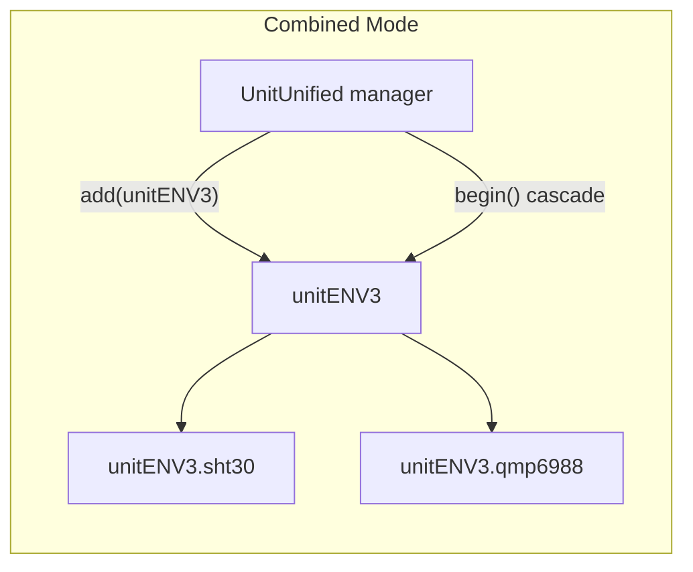
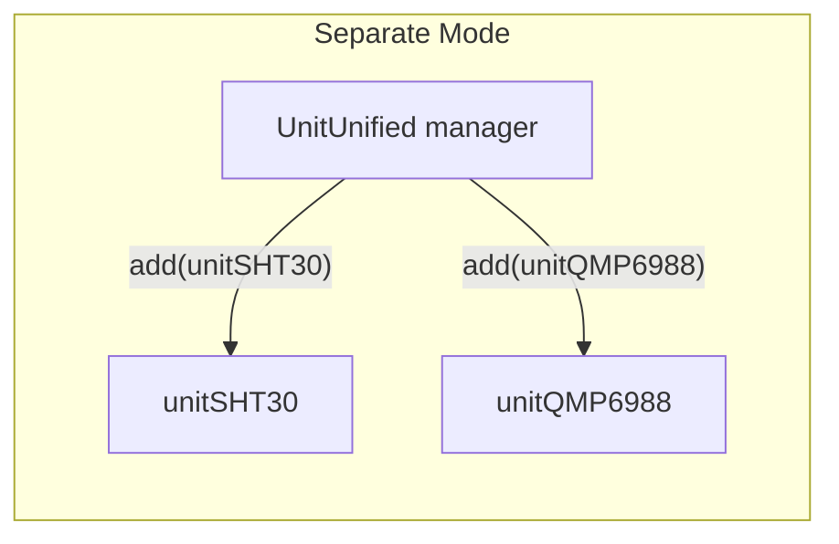
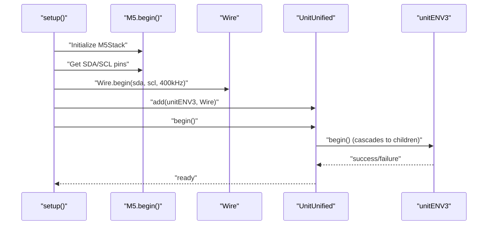
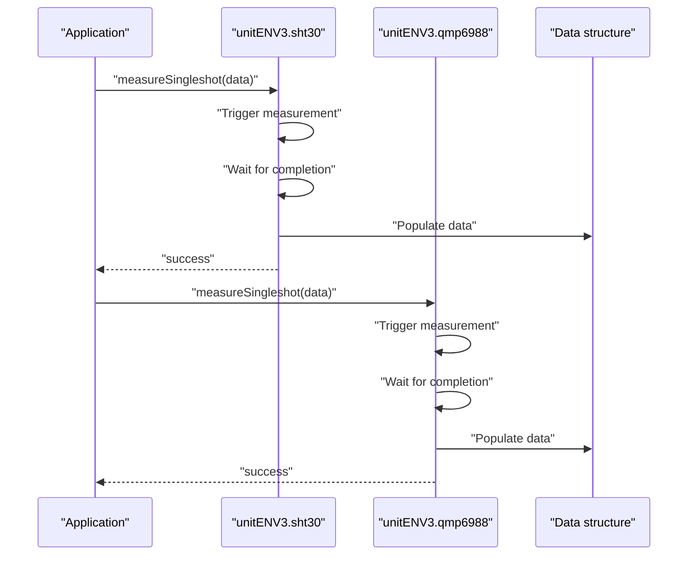
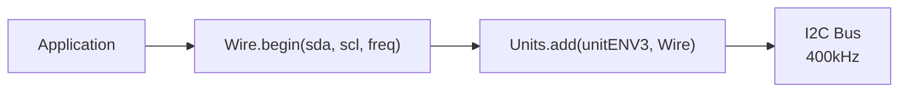
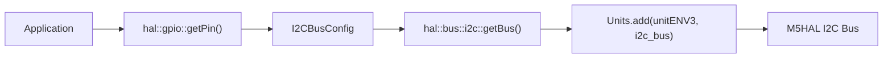

M5Unit-ENV ENV3 (ENVIII - Composite Unit)

# ENV3 (ENVIII - Composite Unit)

<details>
<summary>Relevant source files</summary>

The following files were used as context for generating this wiki page:

- [examples/UnitUnified/UnitENVIII/PlotToSerial/PlotToSerial.ino](examples/UnitUnified/UnitENVIII/PlotToSerial/PlotToSerial.ino)
- [examples/UnitUnified/UnitENVIII/PlotToSerial/main/PlotToSerial.cpp](examples/UnitUnified/UnitENVIII/PlotToSerial/main/PlotToSerial.cpp)
- [examples/UnitUnified/UnitENVPro/PlotToSerial/PlotToSerial.ino](examples/UnitUnified/UnitENVPro/PlotToSerial/PlotToSerial.ino)
- [examples/UnitUnified/UnitENVPro/PlotToSerial/main/PlotToSerial.cpp](examples/UnitUnified/UnitENVPro/PlotToSerial/main/PlotToSerial.cpp)
- [examples/UnitUnified/UnitTVOC/PlotToSerial/main/PlotToSerial.cpp](examples/UnitUnified/UnitTVOC/PlotToSerial/main/PlotToSerial.cpp)
- [src/unit/unit_ENV3.cpp](src/unit/unit_ENV3.cpp)
- [src/unit/unit_ENV3.hpp](src/unit/unit_ENV3.hpp)

</details>


## Purpose and Scope

This document explains the `UnitENV3` composite unit, which aggregates the SHT30 temperature/humidity sensor and QMP6988 pressure sensor into a single logical unit. The ENV3 implements a parent-child component architecture where the composite unit manages I2C adapter allocation for its child sensors while providing convenient unified access patterns.

For details on the individual sensor components, see [SHT30](#4.2) and [QMP6988](#4.3). For information on the similar ENV4 composite unit, see [ENV4](#4.9).

**Sources:** [src/unit/unit_ENV3.hpp:1-53](), [src/unit/unit_ENV3.cpp:1-49]()

---

## Composite Unit Structure

The `UnitENV3` class is a `Component` that does not represent a physical I2C device itself. Instead, it serves as a container that manages two child sensor components. The unit uses a dummy I2C address (`0xFF`) since it performs no direct I2C communication—all sensor operations are delegated to its children.



**Sources:** [src/unit/unit_ENV3.hpp:20-49](), [src/unit/unit_ENV3.cpp:23-30]()

---

## Parent-Child Component Architecture

### Component Registration

The `UnitENV3` constructor establishes the parent-child relationship by configuring the component to accept up to two children and adding the sensor instances at specific channel indices:

| Child Sensor | Channel | I2C Address | Capabilities |
|--------------|---------|-------------|--------------|
| `sht30` | 0 | 0x44 (default) | Temperature, Humidity |
| `qmp6988` | 1 | 0x70 (default) | Temperature, Pressure |



The `_valid` flag is set to `true` only if both child components are successfully added. The `begin()` method simply returns this validation flag.

**Sources:** [src/unit/unit_ENV3.cpp:23-30](), [src/unit/unit_ENV3.hpp:38-41]()

---

## I2C Adapter Management

The `UnitENV3::ensure_adapter()` method creates I2C adapter instances for child components by duplicating the parent's adapter with the child's specific I2C address. This allows each child to communicate on the I2C bus independently while sharing the parent's bus configuration.



The method performs validation before creating adapters:
- Checks that the channel is valid (0 or 1)
- Verifies that a child unit exists at the specified channel
- Converts the parent adapter to an `AdapterI2C` type
- Duplicates the adapter with the child's I2C address

**Sources:** [src/unit/unit_ENV3.cpp:32-45]()

---

## Component Access Patterns

The `UnitENV3` class exposes its child sensors as public members, allowing direct access to sensor-specific APIs:



This design allows code to treat the composite unit as a unified entity for lifecycle management (add, begin, update) while accessing individual sensor data through member references.

**Sources:** [src/unit/unit_ENV3.hpp:30-31](), [examples/UnitUnified/UnitENVIII/PlotToSerial/main/PlotToSerial.cpp:35-40]()

---

## Usage Modes: Combined vs Separate

The ENV3 hardware can be used in two distinct software patterns:

### Combined Unit Mode

In this mode, the composite `UnitENV3` is added to the `UnitUnified` manager as a single entity. The manager handles lifecycle for both children through the parent.



### Separate Units Mode

Alternatively, the SHT30 and QMP6988 can be instantiated and managed independently, treating them as unrelated sensors.



**Sources:** [examples/UnitUnified/UnitENVIII/PlotToSerial/main/PlotToSerial.cpp:18-40]()

---

## Example: PlotToSerial Pattern

The PlotToSerial example demonstrates conditional compilation to switch between combined and separate modes:

### Setup Phase

The example uses preprocessor directives to select the usage pattern:

| Macro | Effect |
|-------|--------|
| `USING_ENV3` | Use combined unit mode |
| (undefined) | Use separate units mode |
| `USING_SINGLE_SHOT` | Configure for single-shot measurements |
| `USING_M5HAL` | Use M5HAL I2C instead of Wire |

**Combined Mode Setup Flow:**



**Sources:** [examples/UnitUnified/UnitENVIII/PlotToSerial/main/PlotToSerial.cpp:43-127]()

---

## Measurement Modes

### Periodic Measurement

By default, both child sensors operate in periodic mode. The `Units.update()` call triggers measurement cycles for all registered units.

```mermaid
sequenceDiagram
    participant Loop as "loop()"
    participant Units as "Units.update()"
    participant SHT30 as "unitENV3.sht30"
    participant QMP as "unitENV3.qmp6988"
    
    Loop->>Units: "update()"
    Units->>SHT30: "periodic update"
    Units->>QMP: "periodic update"
    
    Loop->>SHT30: "if (sht30.updated())"
    SHT30-->>Loop: "true"
    Loop->>SHT30: "temperature(), humidity()"
    
    Loop->>QMP: "if (qmp6988.updated())"
    QMP-->>Loop: "true"
    Loop->>QMP: "temperature(), pressure()"
```

### Single-Shot Measurement

When configured for single-shot mode, measurements are triggered explicitly via `measureSingleshot()`:



**Sources:** [examples/UnitUnified/UnitENVIII/PlotToSerial/main/PlotToSerial.cpp:129-153]()

---

## Configuration Example

### Disabling Periodic Mode for Single-Shot

To configure the ENV3 for single-shot measurements, modify each child's configuration:

```cpp
// Access child sensor configuration
auto cfg = unitENV3.sht30.config();
cfg.start_periodic = false;
unitENV3.sht30.config(cfg);

// Similar for QMP6988
auto cfg_qmp = unitENV3.qmp6988.config();
cfg_qmp.start_periodic = false;
unitENV3.qmp6988.config(cfg_qmp);
```

This pattern demonstrates that while the composite unit manages lifecycle, individual sensor behavior is controlled through direct access to child members.

**Sources:** [examples/UnitUnified/UnitENVIII/PlotToSerial/main/PlotToSerial.cpp:51-62]()

---

## I2C Bus Configuration Options

The ENV3 supports two I2C communication backends:

### Using Arduino Wire



### Using M5HAL



The M5HAL approach provides additional abstraction and is integrated with the M5Stack ecosystem, while Wire offers standard Arduino compatibility.

**Sources:** [examples/UnitUnified/UnitENVIII/PlotToSerial/main/PlotToSerial.cpp:64-91]()

---

## Class Definition Summary

| Class Member | Type | Purpose |
|--------------|------|---------|
| `UnitENV3::sht30` | `UnitSHT30` | Public member providing temperature and humidity sensor access |
| `UnitENV3::qmp6988` | `UnitQMP6988` | Public member providing pressure and temperature sensor access |
| `UnitENV3::UnitENV3(addr)` | Constructor | Initializes composite unit with dummy address (default: 0xFF) |
| `UnitENV3::begin()` | Method | Returns validation flag indicating successful child registration |
| `UnitENV3::ensure_adapter(ch)` | Method | Creates I2C adapter for child at specified channel |
| `UnitENV3::_valid` | `bool` | Private flag indicating constructor success |
| `UnitENV3::_children` | `Component*[2]` | Private array holding pointers to child components |

**Sources:** [src/unit/unit_ENV3.hpp:20-49]()

---

## Design Rationale

The composite unit pattern provides several advantages:

1. **Unified Lifecycle Management**: Add and initialize both sensors with a single `Units.add()` call
2. **Automatic Adapter Allocation**: Parent adapter configuration automatically propagates to children
3. **Flexible Access**: Direct access to child APIs while maintaining composite abstraction
4. **Backward Compatibility**: Can fall back to separate unit management if needed

The dummy address (0xFF) is necessary to ensure the `ensure_adapter()` method correctly creates child adapters. Without a non-zero address, the adapter duplication mechanism would fail.

**Sources:** [src/unit/unit_ENV3.hpp:26-27](), [src/unit/unit_ENV3.cpp:32-45]()