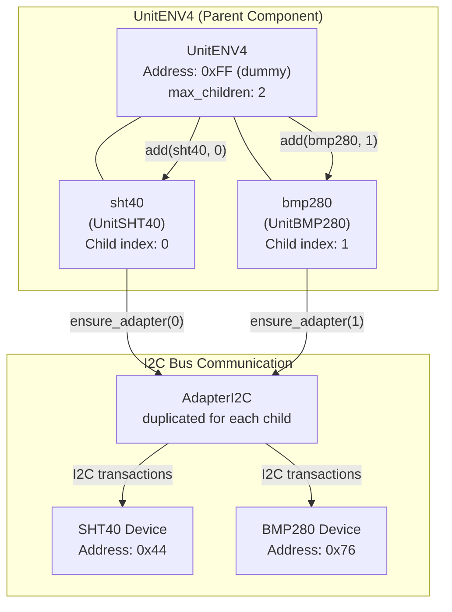
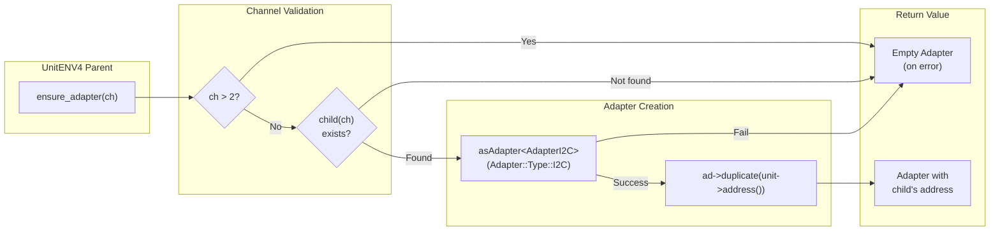
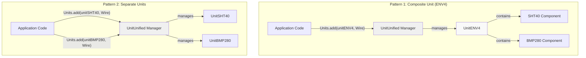
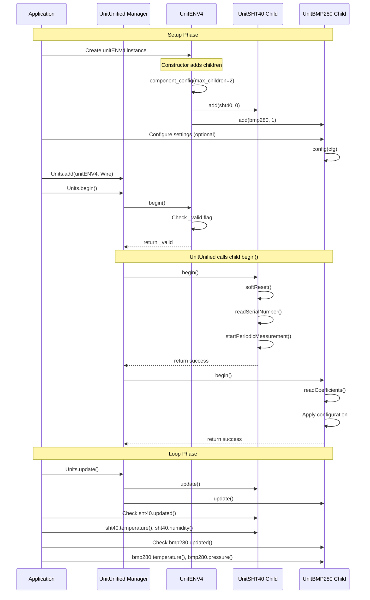
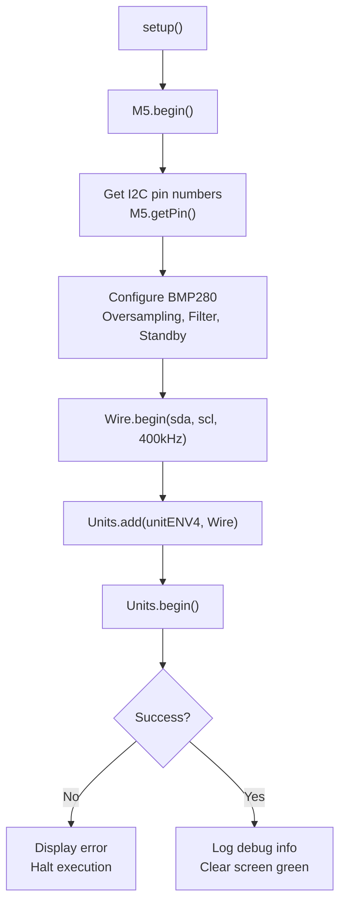

M5Unit-ENV ENV4 (ENVIV - Composite Unit)

# ENV4 (ENVIV - Composite Unit)

<details>
<summary>Relevant source files</summary>

The following files were used as context for generating this wiki page:

- [examples/UnitUnified/UnitENVIV/PlotToSerial/main/PlotToSerial.cpp](examples/UnitUnified/UnitENVIV/PlotToSerial/main/PlotToSerial.cpp)
- [src/unit/unit_ENV4.cpp](src/unit/unit_ENV4.cpp)
- [src/unit/unit_ENV4.hpp](src/unit/unit_ENV4.hpp)
- [src/unit/unit_SGP30.cpp](src/unit/unit_SGP30.cpp)
- [src/unit/unit_SHT40.cpp](src/unit/unit_SHT40.cpp)
- [test/embedded/test_sht40/sht40_test.cpp](test/embedded/test_sht40/sht40_test.cpp)
- [unit_env4_env.ini](unit_env4_env.ini)

</details>


This page documents the ENV4 (also known as ENVIV or Unit ENVIV) composite environmental sensor unit, which integrates the SHT40 temperature/humidity sensor and BMP280 barometric pressure sensor into a single logical unit. This page covers the composite unit structure, parent-child component architecture, adapter management, and usage patterns.

For detailed information about the individual sensor components, see [SHT40 (Advanced Temperature/Humidity)](#4.6) and [BMP280 (Pressure and Temperature)](#4.5). For the similar ENV3 composite unit, see [ENV3 (ENVIII - Composite Unit)](#4.8).

---

## Overview

The `UnitENV4` class is a composite unit that aggregates two physical sensors (SHT40 and BMP280) into a single logical component. Unlike the individual sensor units, ENV4 itself has no I2C I/O operations; it serves as a container and manager for its child sensor components. The composite unit simplifies initialization and management when using both sensors together on the same I2C bus.

**Key characteristics:**
- **Composite pattern**: Aggregates SHT40 and BMP280 as child components
- **No direct I/O**: ENV4 has no sensor hardware; it manages child units
- **Dual temperature sources**: Provides temperature readings from both SHT40 and BMP280
- **Unified initialization**: Single `begin()` call initializes both sensors
- **Flexible access**: Child components accessible via public member variables

**Hardware specifications:**
- **SHT40**: Temperature, humidity with heater support
- **BMP280**: Barometric pressure, temperature with configurable oversampling
- **I2C addresses**: SHT40 (0x44), BMP280 (0x76)

Sources: [src/unit/unit_ENV4.hpp:1-55](), [src/unit/unit_ENV4.cpp:1-49]()

---

## Component Architecture

The ENV4 unit uses M5UnitUnified's parent-child component model to manage its constituent sensors. The parent component (ENV4) establishes relationships with child components (SHT40, BMP280) and manages I2C adapter allocation.



**Constructor initialization sequence:**

[src/unit/unit_ENV4.cpp:23-30]()

The constructor performs these steps:
1. Configures component to accept 2 children (`cfg.max_children = 2`)
2. Adds SHT40 as child 0: `add(sht40, 0)`
3. Adds BMP280 as child 1: `add(bmp280, 1)`
4. Sets `_valid` flag based on successful addition

**Dummy address pattern:**

ENV4 uses address `0xFF` as a dummy value since it performs no I2C operations itself. The dummy address is required by the component framework but never used for actual communication.

[src/unit/unit_ENV4.hpp:28]()

Sources: [src/unit/unit_ENV4.hpp:21-55](), [src/unit/unit_ENV4.cpp:23-30]()

---

## I2C Adapter Management

The `ensure_adapter()` method is crucial for the composite unit pattern. It creates independent I2C adapter instances for each child component, allowing them to communicate with their respective physical sensors using the correct I2C addresses.



**Implementation details:**

[src/unit/unit_ENV4.cpp:32-45]()

The method:
1. **Validates channel**: Ensures `ch <= 2` to prevent out-of-bounds access
2. **Retrieves child**: Gets child component at specified index using `child(ch)`
3. **Obtains I2C adapter**: Converts generic adapter to `AdapterI2C` type
4. **Duplicates adapter**: Creates new adapter instance with child's specific I2C address
5. **Returns adapter**: Provides adapter for child component's I2C operations

**Error handling:**

- Invalid channel (> 2): Returns empty adapter
- Child not found: Returns empty adapter  
- Adapter cast fails: Returns empty adapter

This pattern ensures each child component receives an adapter configured with its correct I2C address (0x44 for SHT40, 0x76 for BMP280), allowing independent communication despite sharing the same I2C bus.

Sources: [src/unit/unit_ENV4.cpp:32-45]()

---

## Component Access and Configuration

ENV4 provides direct access to child components through public member variables, allowing configuration and data retrieval from each sensor independently.

### Public Member Variables

| Member | Type | Description | I2C Address |
|--------|------|-------------|-------------|
| `sht40` | `UnitSHT40` | Temperature and humidity sensor | 0x44 |
| `bmp280` | `UnitBMP280` | Barometric pressure and temperature sensor | 0x76 |

[src/unit/unit_ENV4.hpp:31-32]()

### Configuration Example

Child components can be configured before calling `Units.begin()`:

[examples/UnitUnified/UnitENVIV/PlotToSerial/main/PlotToSerial.cpp:52-60]()

This example demonstrates:
- Accessing BMP280 through `unitENV4.bmp280`
- Reading current configuration with `bmp280.config()`
- Modifying configuration parameters
- Writing back configuration with `bmp280.config(cfg)`

**Configurable BMP280 parameters:**
- `osrs_pressure`: Pressure oversampling (X1, X2, X4, X8, X16)
- `osrs_temperature`: Temperature oversampling (X1, X2)
- `filter`: IIR filter coefficient (Off, Coeff2, Coeff4, Coeff8, Coeff16)
- `standby`: Standby time between measurements (Time500ms, Time1000ms, etc.)

### Data Access Pattern

Both sensors can be accessed independently for measurements:

[examples/UnitUnified/UnitENVIV/PlotToSerial/main/PlotToSerial.cpp:95-108]()

**Available data methods:**
- **SHT40**: `temperature()`, `humidity()`, `fahrenheit()`
- **BMP280**: `temperature()`, `pressure()`, `altitude()`

**Update checking:**
- `sht40.updated()`: True when new SHT40 data available
- `bmp280.updated()`: True when new BMP280 data available

Sources: [src/unit/unit_ENV4.hpp:31-32](), [examples/UnitUnified/UnitENVIV/PlotToSerial/main/PlotToSerial.cpp:52-60](), [examples/UnitUnified/UnitENVIV/PlotToSerial/main/PlotToSerial.cpp:95-108]()

---

## Usage Patterns: Composite vs Separate Units

The library supports two usage patterns for accessing SHT40 and BMP280 sensors: using the composite ENV4 unit or managing separate individual units. The example code demonstrates both approaches using conditional compilation.



### Pattern 1: Composite Unit Approach

[examples/UnitUnified/UnitENVIV/PlotToSerial/main/PlotToSerial.cpp:20-35]()

**Characteristics:**
- Single unit object manages both sensors
- One `Units.add()` call registers both components
- Access sensors via `unitENV4.sht40` and `unitENV4.bmp280`
- Simplified management for paired sensors

**Initialization:**

[examples/UnitUnified/UnitENVIV/PlotToSerial/main/PlotToSerial.cpp:62-72]()

### Pattern 2: Separate Units Approach

**Characteristics:**
- Two independent unit objects
- Two `Units.add()` calls required
- Direct access to `unitSHT40` and `unitBMP280`
- More granular control over lifecycle

**Initialization:**

[examples/UnitUnified/UnitENVIV/PlotToSerial/main/PlotToSerial.cpp:74-82]()

### Comparison Table

| Aspect | Composite Unit (ENV4) | Separate Units |
|--------|----------------------|----------------|
| **Unit count** | 1 (UnitENV4) | 2 (UnitSHT40 + UnitBMP280) |
| **Registration** | `Units.add(unitENV4, Wire)` | `Units.add(unitSHT40, Wire)` + `Units.add(unitBMP280, Wire)` |
| **Sensor access** | `unitENV4.sht40` / `unitENV4.bmp280` | `unitSHT40` / `unitBMP280` |
| **Configuration** | Through child references | Direct on unit objects |
| **Update calls** | Single `Units.update()` updates both | Single `Units.update()` updates both |
| **Use case** | Standard ENV4 hardware | Separate sensors or custom wiring |

Both patterns are functionally equivalent in the update loop, as the unified manager handles all registered units. The choice depends on whether you have the physical ENV4 composite unit or separate sensor modules.

Sources: [examples/UnitUnified/UnitENVIV/PlotToSerial/main/PlotToSerial.cpp:14-87]()

---

## Initialization and Lifecycle

The ENV4 composite unit follows a streamlined initialization process that leverages the parent-child component framework.



### Constructor Behavior

[src/unit/unit_ENV4.cpp:23-30]()

The constructor:
1. Sets maximum children count to 2
2. Adds SHT40 and BMP280 as children
3. Sets `_valid` flag based on successful addition

### begin() Method

[src/unit/unit_ENV4.hpp:39-42]()

The `begin()` method simply returns the `_valid` flag set in the constructor. The actual sensor initialization is handled by the UnitUnified framework, which automatically calls `begin()` on all child components.

**Important:** This differs from individual sensor units where `begin()` performs hardware initialization. For ENV4, the framework handles child initialization automatically.

### Update Cycle

The update cycle is managed by `Units.update()`, which:
1. Calls `update()` on the ENV4 parent (no-op, as ENV4 has no I/O)
2. Automatically calls `update()` on all child components
3. Sets the `updated()` flag for each child when new data arrives

[examples/UnitUnified/UnitENVIV/PlotToSerial/main/PlotToSerial.cpp:90-108]()

### Component Lifecycle

The ENV4 component follows this lifecycle:
1. **Construction**: Parent-child relationships established, `_valid` set
2. **Configuration**: Optional pre-begin configuration of child sensors
3. **Registration**: Added to UnitUnified manager
4. **Initialization**: Framework calls `begin()` on parent and children
5. **Operation**: Regular `update()` calls maintain periodic measurements
6. **Destruction**: Automatic cleanup via standard destructor

Sources: [src/unit/unit_ENV4.cpp:23-30](), [src/unit/unit_ENV4.hpp:39-42](), [examples/UnitUnified/UnitENVIV/PlotToSerial/main/PlotToSerial.cpp:90-108]()

---

## Complete Usage Example

The following example demonstrates a complete ENV4 implementation using the PlotToSerial pattern for Arduino Serial Plotter visualization.

### Setup Phase



[examples/UnitUnified/UnitENVIV/PlotToSerial/main/PlotToSerial.cpp:44-88]()

**Key setup steps:**
1. Initialize M5Unified framework
2. Obtain I2C pin assignments for the device
3. Configure BMP280 parameters (pressure oversampling X16, temperature X2, filter coefficient 16)
4. Initialize Wire with 400kHz I2C speed
5. Register ENV4 unit with UnitUnified manager
6. Begin all units (initializes both sensors)
7. Display initialization status

### Loop Phase

[examples/UnitUnified/UnitENVIV/PlotToSerial/main/PlotToSerial.cpp:90-109]()

**Loop operations:**
1. Update M5 system state
2. Update all units (triggers sensor measurements)
3. Check SHT40 update flag and retrieve temperature/humidity
4. Check BMP280 update flag and retrieve temperature/pressure
5. Calculate altitude from pressure
6. Output formatted data to Serial (compatible with Serial Plotter)

### Output Format

The example outputs data in Arduino Serial Plotter format with labeled channels:
```
>SHT40Temp:23.4567
>Humidity:45.6789
>BMP280Temp:23.1234
>Pressure:1013.25
>Altitude:123.4567
```

This format allows real-time visualization of all sensor readings in separate traces.

Sources: [examples/UnitUnified/UnitENVIV/PlotToSerial/main/PlotToSerial.cpp:44-109]()

---

## Build and Test Configuration

The ENV4 unit has comprehensive build configurations for multiple M5Stack platforms and test environments.

### Test Framework

Unit tests exist for both component sensors:
- **SHT40 tests**: [test/embedded/test_sht40/sht40_test.cpp]()
- **BMP280 tests**: Defined in test configuration

Test environments span 14 boards:
- M5Stack: Core, Core2, CoreS3, Fire
- Atom series: AtomMatrix, AtomS3, AtomS3R
- Stick series: StickCPlus, StickCPlus2
- Others: StampS3, Dial, NanoC6, Paper, CoreInk

[unit_env4_env.ini:1-175]()

### Example Build Configurations

The PlotToSerial example is built across multiple platforms and Arduino framework versions:

| Platform | Framework Versions | Configuration Lines |
|----------|-------------------|---------------------|
| Core | latest, 5.4.0, 4.4.0 | [unit_env4_env.ini:177-187]() |
| Core2 | latest, 5.4.0, 4.4.0 | [unit_env4_env.ini:189-199]() |
| CoreS3 | latest | [unit_env4_env.ini:201-203]() |
| Fire | latest, 5.4.0, 4.4.0 | [unit_env4_env.ini:245-255]() |

Total of 14 boards with various framework versions are validated in CI/CD, ensuring broad compatibility.

### Test Execution

SHT40 tests validate:
- Soft reset functionality
- General reset command
- Serial number reading
- Single-shot measurements across precision/heater modes
- Periodic measurement modes
- Data buffering and circular buffer behavior

[test/embedded/test_sht40/sht40_test.cpp:99-245]()

Example test case structure:
```
TEST_P(TestSHT40, SingleShot)
  - Validates all precision/heater combinations
  - Checks temperature and humidity are finite
  - Verifies heater flag state
  
TEST_P(TestSHT40, Periodic)
  - Tests periodic measurement timing
  - Validates buffer storage (STORED_SIZE=4)
  - Checks update flags and data access
  - Verifies circular buffer operations
```

Sources: [unit_env4_env.ini:1-256](), [test/embedded/test_sht40/sht40_test.cpp:1-246]()

---

## Class Reference Summary

### UnitENV4

**Inheritance:** `Component` (from M5UnitComponent)

**Header:** [src/unit/unit_ENV4.hpp:21-55]()

**Implementation:** [src/unit/unit_ENV4.cpp:1-49]()

**Key members:**

| Member | Type | Access | Description |
|--------|------|--------|-------------|
| `sht40` | `UnitSHT40` | public | SHT40 temperature/humidity sensor instance |
| `bmp280` | `UnitBMP280` | public | BMP280 pressure/temperature sensor instance |
| `name` | `const char[]` | static | Unit name: "UnitENV4" |
| `uid` | `types::uid_t` | static | Unique identifier computed via mmh3 hash |
| `attr` | `types::attr_t` | static | Attributes: AccessI2C |
| `DEFAULT_ADDRESS` | `uint8_t` | static | 0xFF (dummy address) |

**Key methods:**

| Method | Return | Description |
|--------|--------|-------------|
| `UnitENV4(uint8_t addr)` | - | Constructor, adds child components |
| `begin()` | `bool` | Returns validation flag from constructor |
| `ensure_adapter(uint8_t ch)` | `std::shared_ptr<Adapter>` | Creates I2C adapter for child component |

**Internal members:**

| Member | Type | Description |
|--------|------|-------------|
| `_valid` | `bool` | Constructor successfully added children |
| `_children[2]` | `Component*[]` | Array holding pointers to sht40 and bmp280 |

Sources: [src/unit/unit_ENV4.hpp:1-55](), [src/unit/unit_ENV4.cpp:1-49]()