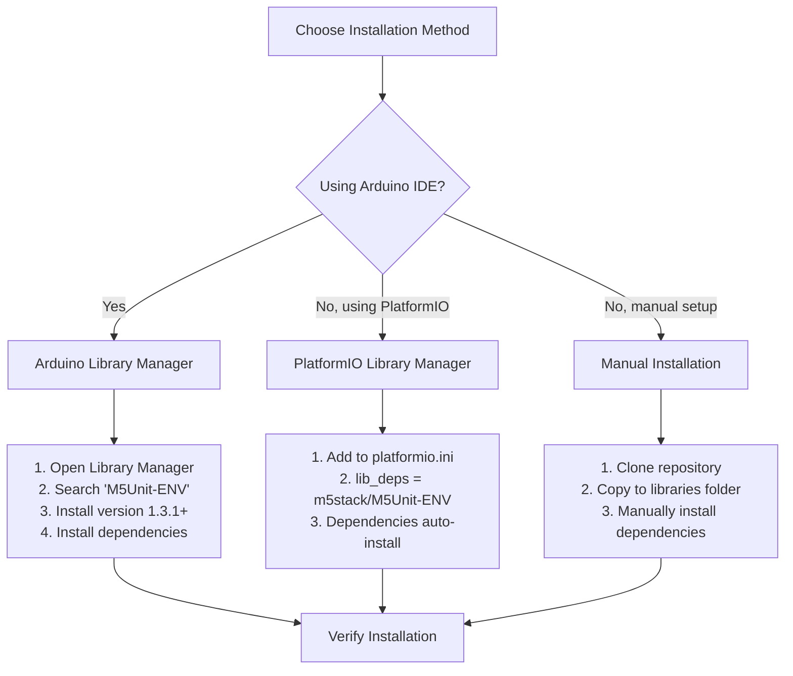
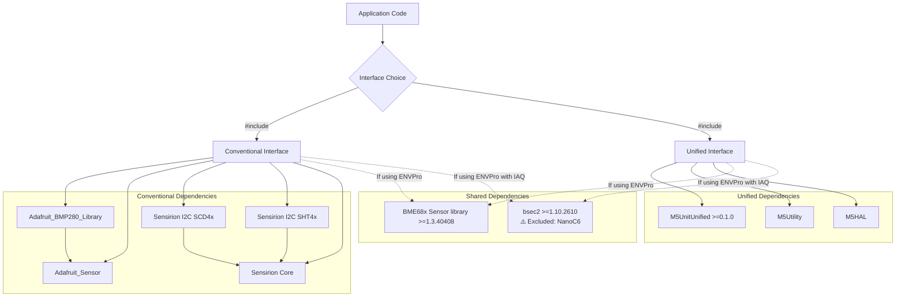
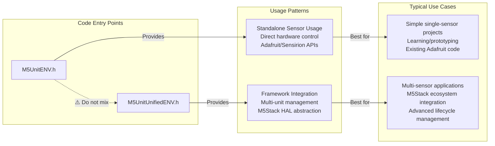
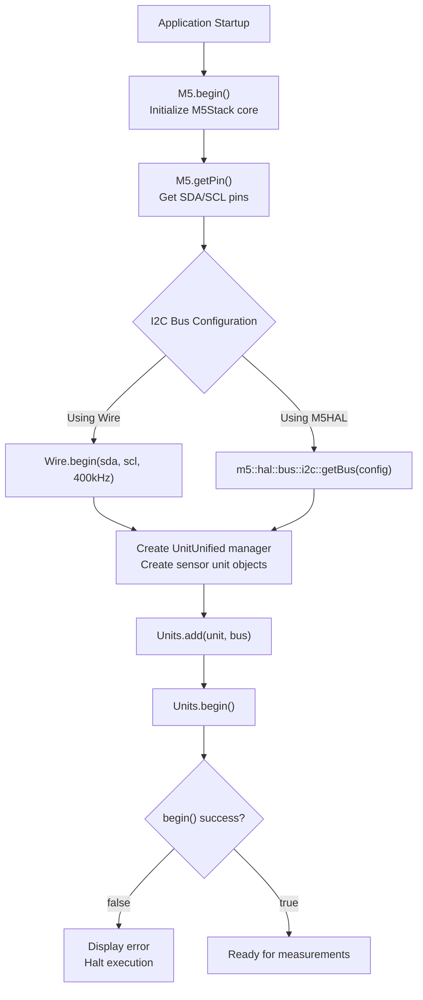
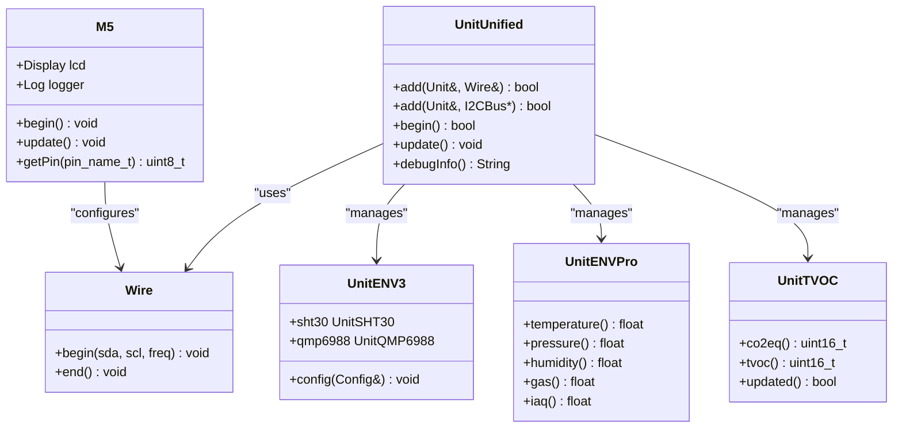
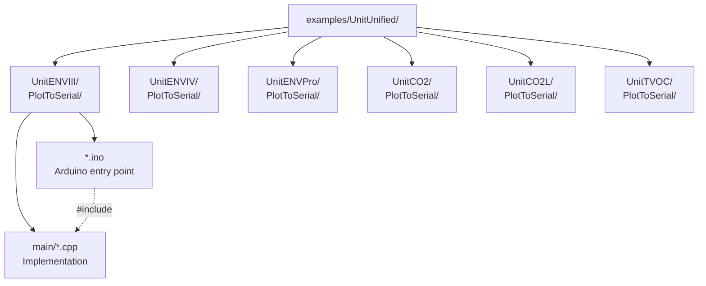
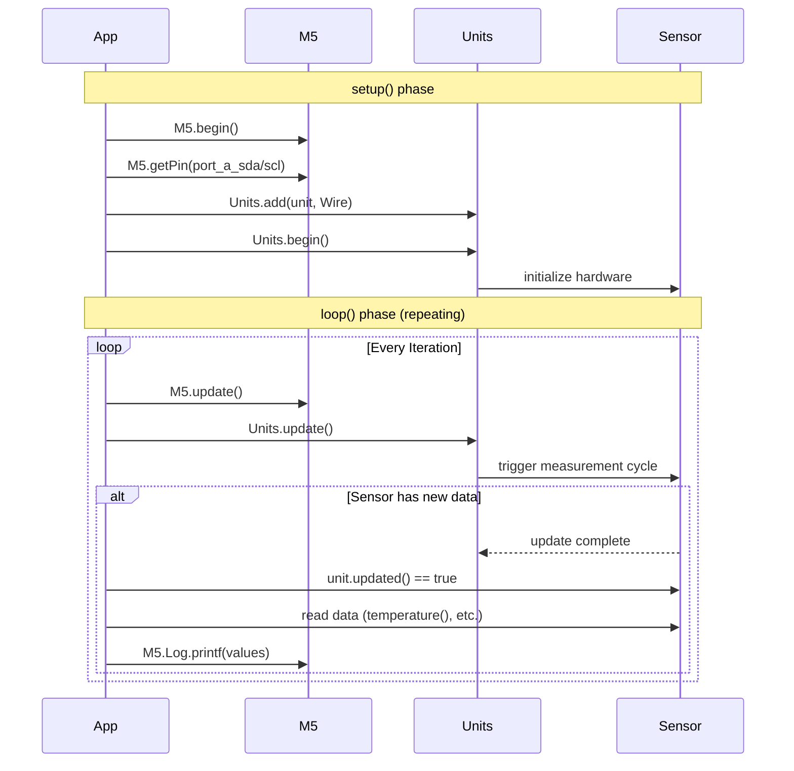

M5Unit-ENV Getting Started

# Getting Started

<details>
<summary>Relevant source files</summary>

The following files were used as context for generating this wiki page:

- [README.md](README.md)
- [examples/UnitUnified/UnitENVIII/PlotToSerial/PlotToSerial.ino](examples/UnitUnified/UnitENVIII/PlotToSerial/PlotToSerial.ino)
- [examples/UnitUnified/UnitENVIII/PlotToSerial/main/PlotToSerial.cpp](examples/UnitUnified/UnitENVIII/PlotToSerial/main/PlotToSerial.cpp)
- [examples/UnitUnified/UnitENVPro/PlotToSerial/PlotToSerial.ino](examples/UnitUnified/UnitENVPro/PlotToSerial/PlotToSerial.ino)
- [examples/UnitUnified/UnitENVPro/PlotToSerial/main/PlotToSerial.cpp](examples/UnitUnified/UnitENVPro/PlotToSerial/main/PlotToSerial.cpp)
- [examples/UnitUnified/UnitTVOC/PlotToSerial/main/PlotToSerial.cpp](examples/UnitUnified/UnitTVOC/PlotToSerial/main/PlotToSerial.cpp)
- [library.json](library.json)
- [library.properties](library.properties)

</details>


This page guides you through initial setup, installation, dependency management, and first steps with the M5Unit-ENV library. You will learn how to install the library via Arduino Library Manager or PlatformIO, configure dependencies, select between conventional and unified interfaces, and run your first environmental sensor program.

For architectural details about the dual-interface design, see [Architecture Overview](#3). For detailed sensor configuration and usage patterns, see [Usage Patterns and Examples](#5). For troubleshooting installation or initialization issues, see [Troubleshooting and FAQ](#9).

## Installation Methods

The M5Unit-ENV library can be installed through two primary methods, depending on your development environment.

### Installation Decision Tree



**Sources:** [README.md:1-106](), [library.properties:1-12](), [library.json:1-33]()

### Arduino Library Manager Installation

The library is registered in the Arduino Library Registry and can be installed directly from the Arduino IDE or Arduino CLI.

**Arduino IDE Steps:**
1. Open Arduino IDE
2. Navigate to **Sketch → Include Library → Manage Libraries**
3. Search for `M5Unit-ENV`
4. Select version `1.3.1` or higher
5. Click **Install** (dependencies will prompt for installation)

**Arduino CLI:**
```bash
arduino-cli lib install "M5Unit-ENV@1.3.1"
```

**Sources:** [library.properties:1-12](), [README.md:1-28]()

### PlatformIO Installation

Add the library to your `platformio.ini` configuration file:

```ini
[env:your_board]
platform = espressif32
framework = arduino
lib_deps = 
    m5stack/M5Unit-ENV@^1.3.1
```

PlatformIO will automatically resolve and install dependencies specified in [library.json:13-17]().

**Sources:** [library.json:1-33](), [README.md:29-88]()

## Dependency Management

The library requires different dependencies depending on which interface and sensor units you use.

### Core Dependencies by Interface

| Dependency | Conventional Interface | Unified Interface | Version Requirement | Notes |
|------------|----------------------|-------------------|---------------------|-------|
| `M5UnitUnified` | ❌ | ✅ Required | `>=0.1.0` | Framework for unified handling |
| `M5Utility` | ❌ | ✅ Required | Latest | CRC-8, MurmurHash3 utilities |
| `M5HAL` | ❌ | ✅ Required | Latest | Hardware abstraction layer |
| `Adafruit_BMP280_Library` | ✅ For BMP280 | ❌ | Latest | Conventional BMP280 driver |
| `Adafruit_Sensor` | ✅ For BMP280 | ❌ | Latest | Unified sensor API base |
| `Sensirion I2C SCD4x` | ✅ For SCD40 | ❌ | Latest | Conventional CO2 driver |
| `Sensirion I2C SHT4x` | ✅ For SHT40 | ❌ | Latest | Conventional temp/humidity |
| `Sensirion Core` | ✅ For Sensirion | ❌ | Latest | I2C common functions |
| `BME68x Sensor library` | ✅ For BME688 | ✅ For BME688 | `>=1.3.40408` | Low-level BME688 driver |
| `bsec2` | ✅ For BME688 IAQ | ✅ For BME688 IAQ | `>=1.10.2610` | Air quality algorithm |

**Sources:** [library.properties:11](), [library.json:13-17](), [README.md:29-36](), [README.md:78-85]()

### Dependency Resolution Flow



**Sources:** [library.properties:11](), [library.json:13-17](), [README.md:78-86]()

### Platform-Specific Considerations

The **BSEC2** library (required for BME688 IAQ calculations) has platform exclusions:

- **Excluded:** ESP32-C6 (NanoC6) due to resource constraints
- **Supported:** ESP32, ESP32-S3, ESP32-C3

This is enforced in the build system configuration.

**Sources:** [README.md:85]()

## Interface Selection

The library provides two mutually exclusive interfaces. You must choose one at compile time by including the appropriate header.

### Interface Comparison



**Key Decision Factors:**

| Factor | Conventional Interface | Unified Interface |
|--------|----------------------|-------------------|
| **Header Include** | `#include <M5UnitENV.h>` | `#include <M5UnitUnifiedENV.h>` |
| **Supported Units** | ENV3, ENV4, BMP280, SHT30, QMP6988, SGP30 | ENVPro, CO2, CO2L, ENVIII, ENVIV, TVOC |
| **Initialization Pattern** | Direct sensor `begin()` calls | `UnitUnified::add()` + `begin()` |
| **I2C Management** | Arduino `Wire` library | `Wire` or `M5HAL::bus::i2c` |
| **Discovery** | Manual addressing | Automatic via `M5UnitUnified` |
| **Learning Curve** | Lower (standard Arduino) | Higher (M5Stack framework) |

**Sources:** [library.properties:10](), [library.json:22-25](), [README.md:71-75](), [examples/UnitUnified/UnitENVIII/PlotToSerial/main/PlotToSerial.cpp:9-11]()

### Mutual Exclusion Warning

**Do not include both headers simultaneously.** The interfaces are mutually exclusive and will cause compilation conflicts:

```cpp
// ❌ WRONG - Will cause conflicts
#include <M5UnitENV.h>
#include <M5UnitUnifiedENV.h>

// ✅ CORRECT - Choose one
#include <M5UnitUnifiedENV.h>  // For unified interface
```

**Sources:** [README.md:72-75]()

## Basic Setup Pattern (Unified Interface)

This section demonstrates the standard initialization pattern using the unified interface. For conventional interface examples, see the sensor-specific documentation pages under [Sensor Units Reference](#4).

### Unified Interface Setup Flow



**Sources:** [examples/UnitUnified/UnitENVIII/PlotToSerial/main/PlotToSerial.cpp:43-127]()

### Minimal Setup Example (Wire Interface)

The following pattern appears in [examples/UnitUnified/UnitENVIII/PlotToSerial/main/PlotToSerial.cpp:43-127]():

**Global Declarations:**
```cpp
#include <M5Unified.h>
#include <M5UnitUnified.h>
#include <M5UnitUnifiedENV.h>

m5::unit::UnitUnified Units;  // Manager for multiple units
m5::unit::UnitENV3 unitENV3;  // Example: ENV3 composite unit
```

**Setup Function:**
```cpp
void setup() {
    M5.begin();  // Initialize M5Stack core
    
    // Get I2C pins for PortA
    auto pin_num_sda = M5.getPin(m5::pin_name_t::port_a_sda);
    auto pin_num_scl = M5.getPin(m5::pin_name_t::port_a_scl);
    
    // Initialize Wire at 400kHz
    Wire.end();
    Wire.begin(pin_num_sda, pin_num_scl, 400000U);
    
    // Add unit to manager and initialize
    if (!Units.add(unitENV3, Wire) || !Units.begin()) {
        M5_LOGE("Failed to begin");
        while (true) { delay(10000); }
    }
}
```

**Sources:** [examples/UnitUnified/UnitENVIII/PlotToSerial/main/PlotToSerial.cpp:43-89]()

### I2C Bus Configuration Options

The library supports two I2C bus abstraction methods:

#### Option 1: Arduino Wire Library

```cpp
// Standard Arduino approach
Wire.end();
Wire.begin(pin_num_sda, pin_num_scl, 400000U);
Units.add(unit, Wire);
```

**Characteristics:**
- Uses Arduino's standard `TwoWire` class
- Widely compatible with existing Arduino code
- Manual pin configuration required
- Enabled when `USING_M5HAL` is not defined

**Sources:** [examples/UnitUnified/UnitENVIII/PlotToSerial/main/PlotToSerial.cpp:79-89]()

#### Option 2: M5HAL Bus Abstraction

```cpp
// M5HAL approach
#define USING_M5HAL  // Enable M5HAL mode

m5::hal::bus::I2CBusConfig i2c_cfg;
i2c_cfg.pin_sda = m5::hal::gpio::getPin(pin_num_sda);
i2c_cfg.pin_scl = m5::hal::gpio::getPin(pin_num_scl);
auto i2c_bus = m5::hal::bus::i2c::getBus(i2c_cfg);
Units.add(unit, i2c_bus ? i2c_bus.value() : nullptr);
```

**Characteristics:**
- Uses M5Stack's hardware abstraction layer
- Provides advanced bus management
- Consistent API across M5Stack products
- Enabled by defining `USING_M5HAL` before includes

**Sources:** [examples/UnitUnified/UnitENVIII/PlotToSerial/main/PlotToSerial.cpp:13](), [examples/UnitUnified/UnitENVIII/PlotToSerial/main/PlotToSerial.cpp:65-77]()

### Code Entity Mapping



**Sources:** [examples/UnitUnified/UnitENVIII/PlotToSerial/main/PlotToSerial.cpp:1-154](), [examples/UnitUnified/UnitENVPro/PlotToSerial/main/PlotToSerial.cpp:1-57](), [examples/UnitUnified/UnitTVOC/PlotToSerial/main/PlotToSerial.cpp:1-57]()

## First Steps

### Running Example Sketches

The library includes example sketches in the `examples/UnitUnified/` directory for each supported sensor unit.

#### Example Location Structure



**Example Structure:**
- Each unit has a dedicated directory (e.g., `UnitENVIII/`)
- Contains a `PlotToSerial/` subdirectory
- `.ino` file includes the `.cpp` implementation from `main/`

**Sources:** [README.md:88](), [examples/UnitUnified/UnitENVIII/PlotToSerial/PlotToSerial.ino:1-12]()

#### Opening Examples in Arduino IDE

1. **File → Examples → M5Unit-ENV → UnitUnified → [UnitName] → PlotToSerial**
2. Select your M5Stack board from **Tools → Board**
3. Configure Port from **Tools → Port**
4. Click **Upload**

#### Opening Examples in PlatformIO

Examples can be used as project templates:

```bash
# Copy example to your project
cp -r examples/UnitUnified/UnitENVIII/PlotToSerial/ my_project/
cd my_project
pio run -t upload
```

**Sources:** [README.md:88]()

### Basic Measurement Loop Pattern

All unified interface examples follow a consistent `setup()` / `loop()` pattern:



**Sources:** [examples/UnitUnified/UnitENVIII/PlotToSerial/main/PlotToSerial.cpp:129-153]()

### Example: ENV3 Periodic Measurement

This example from [examples/UnitUnified/UnitENVIII/PlotToSerial/main/PlotToSerial.cpp:129-153]() demonstrates the standard periodic measurement pattern:

```cpp
void loop() {
    M5.update();      // Update M5Stack state
    Units.update();   // Trigger sensor update cycle
    
    // Check if SHT30 has new data
    if (sht30.updated()) {
        M5.Log.printf(">SHT30Temp:%2.2f\n>Humidity:%2.2f\n", 
                      sht30.temperature(), sht30.humidity());
    }
    
    // Check if QMP6988 has new data
    if (qmp6988.updated()) {
        M5.Log.printf(">QMP6988Temp:%2.2f\n>Pressure:%.2f\n", 
                      qmp6988.temperature(), qmp6988.pressure() * 0.01f);
    }
}
```

**Key Methods:**
- `Units.update()`: Triggers measurement cycle for all registered units
- `unit.updated()`: Returns `true` when new data is available
- `unit.temperature()`, `unit.humidity()`, etc.: Access latest readings

**Sources:** [examples/UnitUnified/UnitENVIII/PlotToSerial/main/PlotToSerial.cpp:129-153]()

### Example: ENVPro with BSEC2

For advanced air quality measurements with the BME688 sensor ([examples/UnitUnified/UnitENVPro/PlotToSerial/main/PlotToSerial.cpp:42-56]()):

```cpp
void loop() {
    M5.update();
    Units.update();
    
    if (unit.updated()) {
#if defined(UNIT_BME688_USING_BSEC2)
        // With BSEC2: IAQ available
        M5.Log.printf(">IAQ:%.2f\n>Temperature:%.2f\n>Pressure:%.2f\n", 
                      unit.iaq(), unit.temperature(), unit.pressure());
#else
        // Without BSEC2: basic environmental only
        M5.Log.printf(">Temperature:%.2f\n>Pressure:%.2f\n", 
                      unit.temperature(), unit.pressure());
#endif
    }
}
```

**BSEC2 Note:** The `UNIT_BME688_USING_BSEC2` define is set automatically when BSEC2 library is available and platform is supported.

**Sources:** [examples/UnitUnified/UnitENVPro/PlotToSerial/main/PlotToSerial.cpp:42-56]()

### Example: TVOC with Initialization Delay

The SGP30 sensor requires a 15-second initialization period ([examples/UnitUnified/UnitTVOC/PlotToSerial/main/PlotToSerial.cpp:46-56]()):

```cpp
void loop() {
    M5.update();
    Units.update();
    
    // SGP30 measurement starts 15 seconds after begin
    if (unit.updated()) {
        M5.Log.printf("\n>CO2eq:%u\n>TVOC:%u", unit.co2eq(), unit.tvoc());
    }
}
```

**Important:** The first valid readings appear 15 seconds after `Units.begin()` completes. The `unit.updated()` method returns `false` during initialization.

**Sources:** [examples/UnitUnified/UnitTVOC/PlotToSerial/main/PlotToSerial.cpp:41-56]()

## Verification and Next Steps

After successfully running an example, you should see:

1. **Serial Output:** Sensor data formatted for Arduino Serial Plotter (`>Label:Value` format)
2. **LCD Feedback:** Display clears to dark green on success, red on failure
3. **Debug Info:** `Units.debugInfo()` prints detected units and their I2C addresses

### Verification Checklist

| Step | Expected Behavior | Failure Action |
|------|------------------|----------------|
| Compilation | No errors, all dependencies resolved | Check [Dependency Management](#dependency-management) |
| Upload | Sketch uploads successfully | Verify board selection and port |
| Serial Output | Debug messages appear at 115200 baud | Check serial monitor configuration |
| Sensor Detection | `Units.debugInfo()` shows discovered units | Check I2C connections, addresses |
| Data Updates | `unit.updated()` returns `true` periodically | Check sensor power, initialization delay |
| Valid Readings | Data values within expected ranges | See [Troubleshooting and FAQ](#9) |

### Next Steps

Once basic examples work:

1. **Explore Measurement Modes:** See [Usage Patterns and Examples](#5) for periodic vs single-shot patterns
2. **Configure Sensors:** See individual sensor pages under [Sensor Units Reference](#4)
3. **Multi-Sensor Applications:** See [Multi-Sensor Applications](#5.2)
4. **Calibration:** See [Calibration and Configuration](#5.3) for CO2 calibration, baseline persistence
5. **Custom Applications:** Adapt examples to your specific use case

**Sources:** [examples/UnitUnified/UnitENVIII/PlotToSerial/main/PlotToSerial.cpp:1-154](), [examples/UnitUnified/UnitENVPro/PlotToSerial/main/PlotToSerial.cpp:1-57](), [examples/UnitUnified/UnitTVOC/PlotToSerial/main/PlotToSerial.cpp:1-57]()