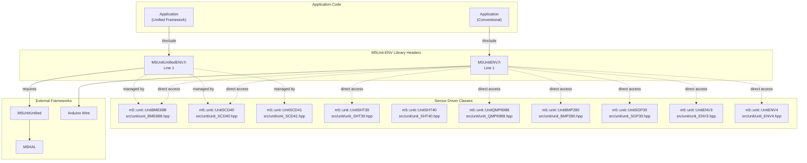
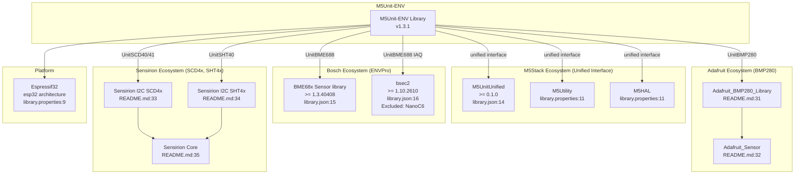

M5Unit-ENV Home

# Home

Relevant source files

The following files were used as context for generating this wiki page:

- [README.md](README.md)
- [library.json](library.json)
- [library.properties](library.properties)

## Purpose and Scope

The M5Unit-ENV library provides Arduino-compatible interfaces for M5Stack environmental sensor units. It enables applications to read temperature, humidity, atmospheric pressure, CO2 concentration, air quality indices (IAQ), and volatile organic compounds (TVOC) from a range of I2C-based sensors.

This library implements a **dual-interface architecture**: a conventional direct-access interface (`M5UnitENV.h`) for standalone sensor usage, and a unified framework interface (`M5UnitUnifiedENV.h`) for integration with the M5UnitUnified ecosystem. These two interfaces are mutually exclusive and cannot be used simultaneously.

For detailed setup instructions, see [Getting Started](#2). For architecture details and interface selection guidance, see [Architecture Overview](#3) and [Conventional vs Unified Interface](#3.1). For sensor-specific usage, refer to [Sensor Units Reference](#4).

**Sources:** [library.properties:1-12](), [library.json:1-33](), [README.md:1-106]()

---

## Library Entry Points

The library exposes two primary include files that provide different integration approaches:

**M5UnitENV.h Conventional Interface**
- Direct instantiation of sensor classes: `UnitSHT30`, `UnitQMP6988`, `UnitBMP280`, etc.
- Manual initialization via `begin()` methods
- Explicit I2C `Wire` object management
- Suitable for simple applications with one or two sensors
- No framework overhead

**M5UnitUnifiedENV.h Unified Interface**
- Integrates with M5UnitUnified lifecycle management
- Automatic sensor discovery and initialization
- Hardware abstraction via M5HAL
- Multi-sensor coordination through `m5::unit_unified` namespace
- Required for M5Unified applications

**Sources:** [library.properties:10-11](), [library.json:22-25](), [README.md:72-75]()

---

## Supported Sensor Units

The library supports ten sensor units across four functional categories, each mapped to specific M5Stack SKUs:

| Unit Name | SKU | Primary Sensor(s) | Measurements | Class Name |
|-----------|-----|-------------------|--------------|------------|
| **Environmental Composite Units** |
| ENVIII | U001-C | SHT30 + QMP6988 | Temperature (dual), Humidity, Pressure | `UnitENV3` |
| ENVIV | U001-D | SHT40 + BMP280 | Temperature (dual), Humidity, Pressure | `UnitENV4` |
| ENVPro | U169 | BME688 | Temperature, Humidity, Pressure, Gas Resistance, IAQ, CO2eq, VOC | `UnitBME688` |
| **CO2 Sensors** |
| CO2 | U103 | SCD40 | CO2 concentration, Temperature, Humidity | `UnitSCD40` |
| CO2L | U104 | SCD41 | CO2 concentration, Temperature, Humidity, single-shot | `UnitSCD41` |
| **Air Quality** |
| TVOC | U088 | SGP30 | TVOC, eCO2, H2 | `UnitSGP30` |
| **Individual Sensors** |
| ENV | U001 | SHT30 | Temperature, Humidity | `UnitSHT30` |
| Hat ENVIII | U001-B | SHT30 | Temperature, Humidity | `UnitSHT30` |
| BPS | U090 | QMP6988 | Pressure, Temperature | `UnitQMP6988` |
| BPS V2 | U053-B, U053-D | BMP280 | Pressure, Temperature | `UnitBMP280` |

**Feature Matrix:**

| Feature | SHT30 | SHT40 | QMP6988 | BMP280 | BME688 | SCD40 | SCD41 | SGP30 |
|---------|-------|-------|---------|---------|--------|-------|-------|-------|
| Single-shot measurement | ✓ | ✓ | ✓ | ✓ | ✓ | ✗ | ✓ | ✗ |
| Periodic measurement | ✓ | ✓ | ✓ | ✓ | ✓ | ✓ | ✓ | ✓ |
| Heater control | ✓ | ✓ | ✗ | ✗ | ✓ | ✗ | ✗ | ✗ |
| Calibration support | ✗ | ✗ | ✗ | ✗ | ✓ | ✓ | ✓ | ✓ |
| Power management | ✗ | ✗ | ✗ | ✓ | ✓ | ✗ | ✓ | ✗ |

**Sources:** [README.md:5-28](), [README.md:47-63]()

---

## Dependency Architecture

The library integrates with multiple external ecosystems depending on the interface and sensor used:

**Dependency Categories:**

1. **M5Stack Framework (Required for Unified Interface)**
   - `M5UnitUnified` >= 0.1.0: Unit lifecycle and discovery
   - `M5Utility`: CRC-8, MurmurHash3, common utilities
   - `M5HAL`: Hardware abstraction layer for I2C/GPIO

2. **Bosch Libraries (Required for UnitBME688)**
   - `BME68x Sensor library` >= 1.3.40408: Low-level BME688 driver
   - `bsec2` >= 1.10.2610: IAQ algorithm (excluded on NanoC6 due to memory constraints)

3. **Third-Party Sensor Libraries (Required for Conventional Interface)**
   - `Adafruit_BMP280_Library` + `Adafruit_Sensor`: BMP280 support
   - `Sensirion I2C SCD4x`: SCD40/SCD41 support
   - `Sensirion I2C SHT4x`: SHT40 support
   - `Sensirion Core`: Common I2C functions for Sensirion sensors

4. **Platform Requirements**
   - ESP32 architecture only
   - Arduino framework

**Sources:** [library.properties:9-11](), [library.json:13-26](), [README.md:29-85]()

---

## Build System Support

The library supports dual build environments with platform-specific configurations:

| Build System | Configuration File | Installation Method | Target Platforms |
|--------------|-------------------|---------------------|------------------|
| **Arduino IDE** | `library.properties` | Library Manager search for "M5Unit-ENV" | ESP32 boards via Board Manager |
| **Arduino CLI** | `library.properties` | `arduino-cli lib install M5Unit-ENV` | ESP32 boards via Board Manager |
| **PlatformIO** | `library.json` | Auto-resolved via `lib_deps` or `platformio lib install "M5Unit-ENV"` | `espressif32` platform |

**Platform Coverage:**
- Arduino ESP32 v3.0.4: 18 boards
- Arduino ESP32 v2.0.17: 7 legacy boards  
- M5Stack ESP32 v3.2.1: 19 M5Stack-specific boards
- PlatformIO: 14 boards in test matrix

For detailed configuration, see [PlatformIO Configuration](#6.1), [Supported Boards and Platforms](#6.2), and [Arduino IDE Integration](#6.3).

**Sources:** [library.properties:1-12](), [library.json:1-33](), [README.md:1-106]()

---

## Quick Navigation

**Getting Started:**
- [Installation and Setup](#2) - Library manager installation, dependency resolution
- [Quick Start Examples](#2.1) - Minimal working code for common sensors

**Core Concepts:**
- [Architecture Overview](#3) - Internal structure and design philosophy
- [Conventional vs Unified Interface](#3.1) - Choosing the right approach
- [Dependency Management](#3.2) - External library integration details

**Sensor Documentation:**
- [BME688 (ENVPro)](#4.1) - Most advanced sensor with IAQ/BSEC2 integration
- [SCD40/SCD41 (CO2)](#4.4) - CO2 concentration measurement and calibration
- [ENV3/ENV4 (Composite)](#4.8) - Multi-sensor composite units
- [Complete Sensor Reference](#4) - All supported units

**Development:**
- [Build System and Development](#6) - PlatformIO and Arduino configurations
- [Testing Infrastructure](#6.4) - GoogleTest-based embedded tests
- [Continuous Integration](#7) - Automated build and quality checks

**API Details:**
- [API Reference](#8) - Common patterns and method signatures
- [Usage Patterns and Examples](#5) - Real-world usage scenarios
- [Troubleshooting and FAQ](#9) - Common issues and solutions

**Sources:** [README.md:1-106]()

---

## Repository Information

- **GitHub Repository:** https://github.com/m5stack/M5Unit-ENV
- **Version:** 1.3.1
- **License:** MIT
- **Maintainer:** M5Stack
- **Documentation:** [GitHub Pages](https://m5stack.github.io/M5Unit-ENV/)
- **Product Documentation:** [M5Stack Docs](https://docs.m5stack.com/)

**Sources:** [library.properties:1-12](), [library.json:1-33](), [README.md:37-106]()