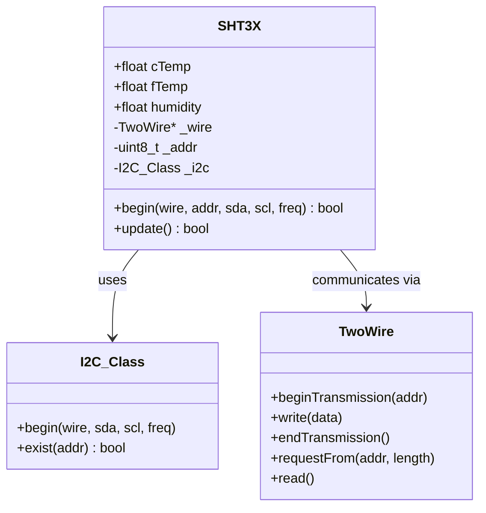
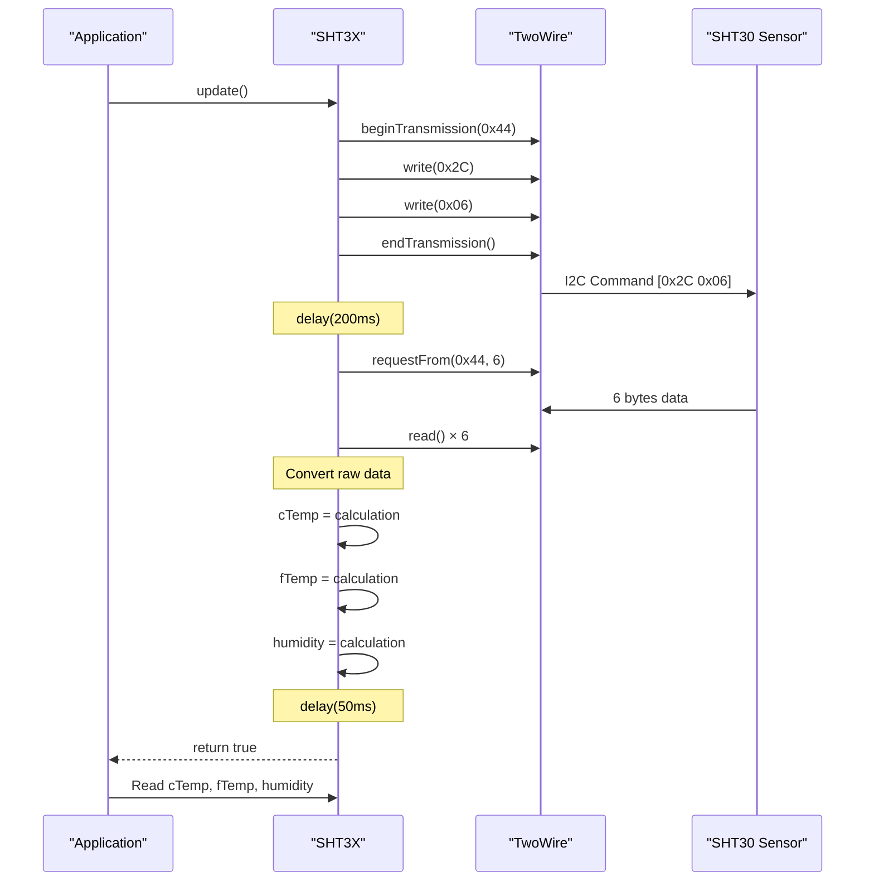
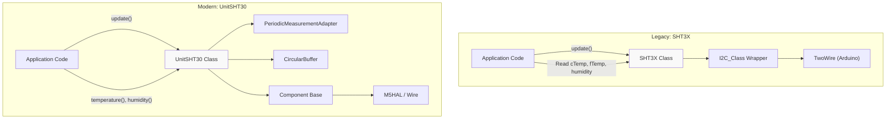
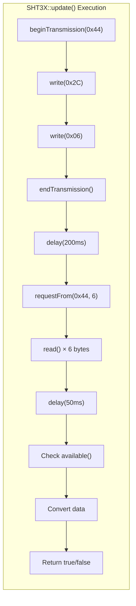

M5Unit-ENV Legacy Sensor Interfaces

# Legacy Sensor Interfaces

<details>
<summary>Relevant source files</summary>

The following files were used as context for generating this wiki page:

- [src/SHT3X.cpp](src/SHT3X.cpp)
- [src/SHT3X.h](src/SHT3X.h)
- [src/unit/unit_QMP6988.cpp](src/unit/unit_QMP6988.cpp)
- [src/unit/unit_QMP6988.hpp](src/unit/unit_QMP6988.hpp)
- [src/unit/unit_SHT30.hpp](src/unit/unit_SHT30.hpp)

</details>


## Purpose and Scope

This page documents the legacy sensor interface classes that provide simplified, backward-compatible access to environmental sensors. These classes predate the M5UnitUnified framework and offer a more straightforward API at the cost of reduced functionality.

Currently, the primary legacy interface is the `SHT3X` class, which provides basic temperature and humidity readings from SHT30 sensors. For modern, feature-rich sensor access using the unified framework, see the individual sensor unit pages ([4.1](#4.1) through [4.9](#4.9)).

---

## Overview

The legacy sensor interfaces were designed as simple, standalone classes that could be used without dependencies on the M5UnitUnified framework. They focus on basic measurement functionality with minimal configuration options.

### Key Characteristics

| Aspect | Legacy Interface | Modern Unified Interface |
|--------|------------------|--------------------------|
| Framework Dependency | None (standalone) | Requires M5UnitUnified |
| Measurement Pattern | Blocking single-shot only | Periodic + single-shot |
| Data Access | Public member variables | Accessor methods with buffering |
| Advanced Features | None | Status, heater, calibration, etc. |
| I2C Abstraction | `I2C_Class` wrapper | M5HAL or Arduino Wire |
| Configuration | Hardcoded | Extensive configuration API |

**Sources:** [src/SHT3X.h:1-26](), [src/unit/unit_SHT30.hpp:1-360]()

---

## SHT3X Legacy Class

The `SHT3X` class provides basic temperature and humidity measurement from SHT30 sensors using a simplified blocking interface.

### Class Structure



**Sources:** [src/SHT3X.h:10-23](), [src/SHT3X.cpp:1-44]()

### Initialization

The `begin()` method initializes the sensor with I2C parameters:

```cpp
bool begin(TwoWire* wire = &Wire, uint8_t addr = SHT3X_I2C_ADDR,
           uint8_t sda = 21, uint8_t scl = 22, long freq = 400000U);
```

**Default Parameters:**
- I2C Address: `0x44` (`SHT3X_I2C_ADDR`)
- SDA Pin: `21`
- SCL Pin: `22`
- I2C Frequency: `400 kHz`

The method returns `true` if the sensor is detected on the I2C bus.

**Sources:** [src/SHT3X.h:12-13](), [src/SHT3X.cpp:3-9]()

### Measurement Process



**Sources:** [src/SHT3X.cpp:11-43]()

### Data Conversion

The `update()` method performs blocking measurement and populates public member variables:

| Member Variable | Formula | Unit |
|----------------|---------|------|
| `cTemp` | `((raw[0] * 256 + raw[1]) * 175 / 65535.0) - 45` | °C |
| `fTemp` | `(cTemp * 1.8) + 32` | °F |
| `humidity` | `((raw[3] * 256 + raw[4]) * 100 / 65535.0)` | %RH |

**I2C Command Used:** `0x2C06` (Single-shot, high repeatability, clock stretching enabled)

**Timing:**
- Pre-measurement delay: `200 ms`
- Post-read delay: `50 ms`
- Total blocking time: ~`250 ms`

**Sources:** [src/SHT3X.cpp:17-40]()

---

## Comparison with UnitSHT30

### Architecture Differences



**Sources:** [src/SHT3X.h:10-23](), [src/unit/unit_SHT30.hpp:111-307]()

### Feature Comparison Table

| Feature | SHT3X (Legacy) | UnitSHT30 (Modern) | Notes |
|---------|----------------|-------------------|-------|
| **Measurement Modes** |
| Single-shot | ✓ (blocking only) | ✓ (non-blocking) | Legacy blocks for 250ms |
| Periodic | ✗ | ✓ | Modern supports 0.5-10 MPS |
| **Repeatability** |
| High | ✓ (hardcoded) | ✓ (configurable) | Legacy always uses high |
| Medium/Low | ✗ | ✓ | Not available in legacy |
| **Data Access** |
| Public variables | ✓ | ✗ | Legacy: direct access |
| Accessor methods | ✗ | ✓ | Modern: `temperature()`, `humidity()` |
| Historical data | ✗ | ✓ | Modern uses CircularBuffer |
| **Advanced Features** |
| Heater control | ✗ | ✓ | `startHeater()`, `stopHeater()` |
| Status register | ✗ | ✓ | `readStatus()`, `clearStatus()` |
| Serial number | ✗ | ✓ | `readSerialNumber()` |
| Soft reset | ✗ | ✓ | `softReset()`, `generalReset()` |
| ART mode | ✗ | ✓ | Accelerated Response Time |
| **Configuration** |
| I2C parameters | ✓ (on begin) | ✓ (component config) | Both support customization |
| Measurement settings | ✗ | ✓ | Modern: MPS, repeatability |
| **Error Handling** |
| Return codes | Basic | Comprehensive | Modern has better diagnostics |
| **Dependencies** |
| M5UnitUnified | ✗ | ✓ | Legacy is standalone |
| I2C abstraction | `I2C_Class` | M5HAL or Wire | Different wrappers |

**Sources:** [src/SHT3X.cpp:11-43](), [src/unit/unit_SHT30.hpp:114-307]()

### Command Mapping

| Operation | SHT3X Command | UnitSHT30 Command | Notes |
|-----------|---------------|-------------------|-------|
| Single-shot measurement | `0x2C06` | `0x2C06` (High, stretch) | Same command for high repeatability |
| | | `0x2C0D` (Medium, stretch) | Additional option |
| | | `0x2C10` (Low, stretch) | Additional option |
| | | `0x2400-0x2416` (no stretch) | Non-blocking variants |
| Periodic measurement | N/A | `0x2032-0x272A` | 15 different configurations |
| Status read | N/A | `0xF32D` | Not available in legacy |
| Heater control | N/A | `0x306D`, `0x3066` | Not available in legacy |

**Sources:** [src/SHT3X.cpp:17-18](), [src/unit/unit_SHT30.hpp:313-350]()

---

## Migration Guide

### Converting Legacy Code to Modern Interface

**Legacy Pattern:**
```cpp
// Legacy SHT3X usage
#include "SHT3X.h"

SHT3X sensor;

void setup() {
    sensor.begin(&Wire, 0x44, 21, 22, 400000);
}

void loop() {
    if (sensor.update()) {
        Serial.printf("Temp: %.2f°C, Humidity: %.2f%%\n", 
                      sensor.cTemp, sensor.humidity);
    }
    delay(1000);
}
```

**Modern Equivalent:**
```cpp
// Modern UnitSHT30 usage
#include <M5UnitUnifiedENV.h>

m5::unit::UnitSHT30 sensor;

void setup() {
    // Configure component if needed
    auto ccfg = sensor.component_config();
    ccfg.stored_size = 1;  // Buffer size
    sensor.component_config(ccfg);
    
    // Configure measurement settings
    auto cfg = sensor.config();
    cfg.start_periodic = true;
    cfg.mps = m5::unit::sht30::MPS::One;
    cfg.repeatability = m5::unit::sht30::Repeatability::High;
    sensor.config(cfg);
    
    sensor.begin();
}

void loop() {
    sensor.update();
    Serial.printf("Temp: %.2f°C, Humidity: %.2f%%\n", 
                  sensor.temperature(), sensor.humidity());
    delay(1000);
}
```

**Sources:** [src/SHT3X.cpp:3-43](), [src/unit/unit_SHT30.hpp:130-180]()

### Migration Checklist

1. **Include Statement:**
   - Replace `#include "SHT3X.h"` with `#include <M5UnitUnifiedENV.h>`

2. **Class Name:**
   - Replace `SHT3X` with `m5::unit::UnitSHT30`

3. **Initialization:**
   - Legacy: `sensor.begin(&Wire, addr, sda, scl, freq)`
   - Modern: Configure via `component_config()` and `config()`, then call `begin()`

4. **Data Access:**
   - Legacy: Direct access to `sensor.cTemp`, `sensor.fTemp`, `sensor.humidity`
   - Modern: Use methods `sensor.temperature()`, `sensor.celsius()`, `sensor.fahrenheit()`, `sensor.humidity()`

5. **Update Pattern:**
   - Legacy: `update()` blocks for ~250ms
   - Modern: `update()` is non-blocking when using periodic mode

6. **Error Handling:**
   - Both return `bool` from `update()`, but modern interface has additional status checking

**Sources:** [src/SHT3X.h:1-26](), [src/unit/unit_SHT30.hpp:111-307]()

---

## When to Use Each Interface

### Use Legacy SHT3X When:

- **No M5UnitUnified dependency**: Your project cannot include the M5UnitUnified framework
- **Simple requirements**: You only need basic temperature and humidity readings
- **Backward compatibility**: Maintaining existing code that uses the legacy interface
- **Resource constraints**: Minimal memory footprint is critical
- **Quick prototyping**: Need the simplest possible API

### Use Modern UnitSHT30 When:

- **Advanced features needed**: Heater control, status monitoring, serial number reading
- **Periodic measurements**: Automatic sampling at 0.5-10 Hz
- **Non-blocking operation**: Integration with event loops or multi-sensor systems
- **Data buffering**: Need historical data storage via CircularBuffer
- **Framework integration**: Using M5UnitUnified for multi-sensor management
- **Configurability**: Need control over repeatability, MPS, and other parameters
- **New projects**: All new development should prefer the modern interface

**Sources:** [src/SHT3X.h:1-26](), [src/unit/unit_SHT30.hpp:111-307]()

---

## Implementation Details

### SHT3X I2C Communication Flow



### Error Conditions in SHT3X

The legacy interface has limited error detection:

| Error Condition | Detection Method | Recovery |
|----------------|------------------|----------|
| Device not found | `begin()` returns `false` | Check I2C wiring, address |
| I2C transmission failure | `endTransmission() != 0` | Retry or reset I2C bus |
| Incomplete data | `available() != 0` after read | Data may be invalid |

**Sources:** [src/SHT3X.cpp:11-43]()

### Data Format Details

**Raw Data Structure (6 bytes):**
```
Byte 0-1: Temperature MSB/LSB
Byte 2:   Temperature CRC-8 (not validated in legacy)
Byte 3-4: Humidity MSB/LSB  
Byte 5:   Humidity CRC-8 (not validated in legacy)
```

**Note:** The legacy `SHT3X` class does not validate CRC checksums, unlike the modern `UnitSHT30` which properly validates data integrity.

**Sources:** [src/SHT3X.cpp:28-40]()

---

## Future Considerations

The legacy `SHT3X` interface is maintained for backward compatibility but is not recommended for new development. Future updates to the library may:

- Mark the legacy interface as deprecated
- Provide additional migration tools
- Extend legacy support to other sensors if needed
- Eventually phase out legacy interfaces in favor of the unified framework

For modern, actively maintained sensor interfaces with full feature support, refer to the sensor-specific pages ([4.1](#4.1) through [4.9](#4.9)) and the unified interface documentation ([3.1](#3.1)).

**Sources:** [src/SHT3X.h:1-26](), [src/unit/unit_SHT30.hpp:1-360]()